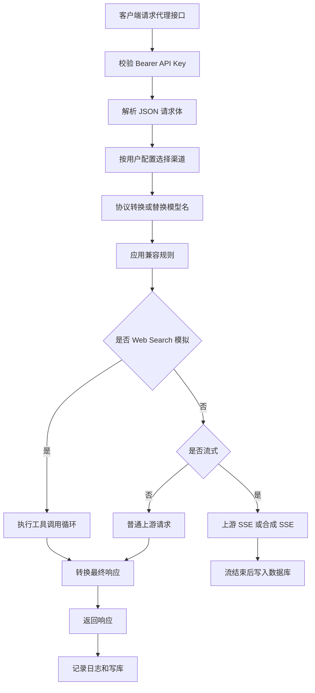

# 应用网关与代理入口

## 模块名称

应用网关与代理入口。

## 模块职责

该模块由 `opencodex_proxy/app.py` 承担，是后端的编排中心。它负责创建 Flask 应用、注册管理后台路由、注册代理入口、串联鉴权、配置、路由、协议转换、兼容规则、上游调用、Web Search 模拟、日志记录和数据库写入。

## 输入

- HTTP 管理台请求：
  - `/admin`
  - `/admin/api/session`
  - `/admin/api/login`
  - `/admin/api/logout`
  - `/admin/api/users`
  - `/admin/api/api-keys`
  - `/admin/api/config`
  - `/admin/api/web-search`
  - `/admin/api/logs`
  - `/admin/api/stats`
  - `/admin/api/channels/discover-models`
  - `/admin/api/channels/test`
- HTTP 代理请求：
  - `POST /v1/responses`
  - `POST /v1/chat/completions`
  - `POST /v1/messages`
- JSON 请求体、请求头、客户端 IP、Session Cookie、Bearer API Key。

## 输出

- 管理后台 HTML 或静态 SPA 文件。
- 管理 API JSON 响应。
- 代理接口 JSON 响应。
- 代理接口 SSE 响应。
- JSON 格式应用日志。
- SQLite 请求日志记录。

## 依赖模块

- `settings.py`：读取环境变量。
- `config.py`：读取、校验和保存渠道配置。
- `routing.py`：选择目标渠道和上游模型。
- `protocols.py`：协议请求和响应转换。
- `compat.py`：应用兼容规则。
- `upstream.py`：发起上游 HTTP 请求。
- `streaming.py`：生成和转换 SSE。
- `web_search.py`：Web Search 工具模拟。
- `db.py`：用户、API Key、渠道、日志和统计持久化。
- `logging_utils.py`：日志配置与脱敏。
- `reasoning_cache.py`：reasoning/thinking 内容缓存。
- `errors.py`：统一异常结构。

## 核心逻辑

- 逻辑步骤 1：`create_app` 从环境或入参构造 `Settings`，初始化日志、超级管理员、配置管理器、Reasoning 缓存和异步数据库写入器。
- 逻辑步骤 2：注册管理台页面和管理 API，登录成功后把用户信息写入 Flask Session。
- 逻辑步骤 3：代理入口根据请求路径识别入口协议，生成 `request_id` 并准备日志上下文。
- 逻辑步骤 4：从 `Authorization` 头读取 Bearer Token，调用数据库模块校验访问 API Key，确定请求所属用户。
- 逻辑步骤 5：解析 JSON 请求体，读取 `model`、`stream` 和可见参数。
- 逻辑步骤 6：按当前用户配置调用 `choose_channel`，得到目标渠道、原始模型和上游模型。
- 逻辑步骤 7：如果入口协议和渠道协议不同，调用 `convert_request` 转换请求；否则只替换模型名。
- 逻辑步骤 8：调用 `apply_compat` 应用渠道兼容规则。
- 逻辑步骤 9：根据请求类型选择处理路径：
  - 同协议流式请求：上游 SSE 透传。
  - Responses 入口转 Chat/Messages 流式：上游 SSE 转 Responses SSE。
  - Responses 请求声明 Web Search 且满足条件：执行本地 Web Search 模拟。
  - 非流式请求：调用上游后转换响应并返回 JSON。
  - 客户端要求流式但上游只做非流式：把完整响应合成为 Responses SSE。
- 逻辑步骤 10：在 `finally` 中记录结构化日志；非延迟写库路径同步提交异步写库任务，流式路径在生成器结束时写库。

## 数据结构 / 数据库表

该模块自身不定义数据库表，但会组织并写入以下记录：

- `request_logs`：请求元数据，包括路径、模型、渠道、状态码、TTFT、Token、费用、用户和错误。
- `request_log_details`：请求头、请求体、上游请求体、上游响应体、最终响应体、Web Search 详情。
- `channels`：代理渠道配置，由管理 API 读取和保存。
- `users`：管理后台用户。
- `access_api_keys`：代理访问 API Key。
- `web_search_settings`、`tavily_keys`：Web Search 配置。

## 外部接口 / API

### 代理接口

| 接口 | 参数 | 返回值 | 异常 |
| --- | --- | --- | --- |
| `POST /v1/responses` | Responses JSON 请求体，Bearer API Key | Responses JSON 或 Responses SSE | 401 无有效 API Key，400 请求体或路由错误，502/504 上游错误 |
| `POST /v1/chat/completions` | Chat Completions JSON 请求体，Bearer API Key | Chat JSON 或透传 SSE | 401、400、502、504 |
| `POST /v1/messages` | Anthropic Messages JSON 请求体，Bearer API Key | Messages JSON 或透传 SSE | 401、400、502、504 |

### 管理接口

| 接口 | 说明 |
| --- | --- |
| `GET /admin` | 管理台页面或登录页 |
| `POST /admin/api/login` | 管理台登录 |
| `GET /admin/api/session` | 当前登录状态 |
| `GET/POST/PATCH/DELETE /admin/api/users` | 用户管理，超级管理员权限 |
| `GET/POST/PATCH/DELETE /admin/api/api-keys` | 访问 API Key 管理 |
| `GET/POST /admin/api/config` | 渠道配置读取与保存 |
| `GET /admin/api/config/export` | 导出渠道配置 |
| `POST /admin/api/config/import` | 导入并合并渠道配置 |
| `GET/POST /admin/api/web-search` | Web Search 配置，超级管理员权限 |
| `POST /admin/api/web-search/test-key` | 测试指定 Tavily Key |
| `GET /admin/api/logs` | 分页请求日志 |
| `GET /admin/api/log-filter-options` | 日志筛选候选值 |
| `GET /admin/api/logs/<id>` | 日志详情 |
| `GET /admin/api/stats` | 统计数据 |
| `POST /admin/api/channels/discover-models` | 发现上游模型 |
| `POST /admin/api/channels/test` | 测试渠道可用性 |

## 异常处理

| 异常类型 | 触发条件 | 处理方式 |
| --- | --- | --- |
| `BadRequestError` | 请求体不是 JSON、缺少 Bearer Key、协议或参数不支持 | 返回 400 或指定状态码的 JSON 错误 |
| `ConfigError` | 渠道配置结构非法、字段非法、模型映射冲突 | 管理 API 返回 400，代理入口返回 config error |
| `RoutingError` | 当前用户没有启用渠道或模型无匹配渠道 | 返回 400 routing error |
| `UpstreamError` | 上游 HTTP 错误、连接失败、超时、非法 JSON | 返回上游状态码或 502/504，并尽量带上上游响应体 |
| 未捕获异常 | 防御性兜底 | 写入异常日志，返回 500 |

## 流程图 / UML

## 备注

- `app.py` 当前承担的职责较多，是最需要谨慎修改的文件。
- 流式请求的数据库写入延迟到生成器结束，避免在响应尚未结束时记录不完整状态。
- 管理台 SPA 构建产物位于 `opencodex_proxy/static/admin`，后端会优先服务该目录中的 `index.html`。

