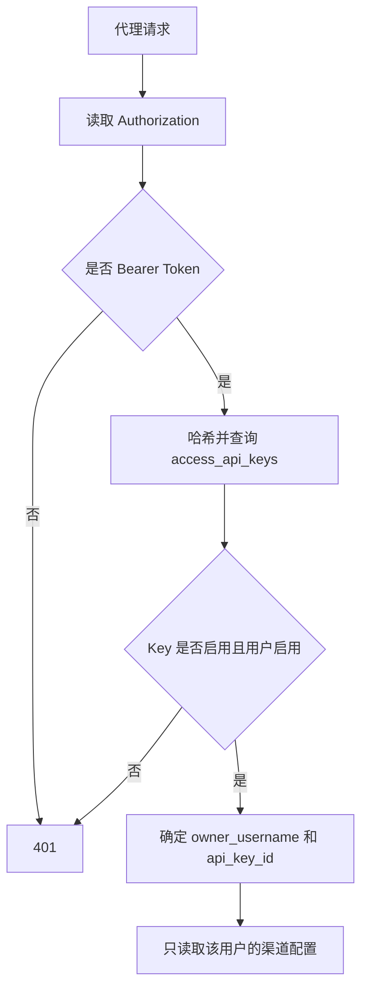

# 认证与访问控制模块

## 模块名称

认证与访问控制。

## 模块职责

负责管理后台登录、Session 用户识别、超级管理员权限校验、普通用户权限隔离、访问 API Key 创建和认证。该模块确保代理请求只能使用管理台创建的访问 Key，并且普通用户只能访问自己的渠道、Key 和日志。

## 输入

- 管理台登录用户名和密码。
- Flask Session 中的用户信息。
- `Authorization: Bearer ocx_...` 请求头。
- 用户管理 API 的 JSON 请求体。
- API Key 管理 API 的 JSON 请求体。

## 输出

- 当前登录用户信息。
- 用户列表、用户创建结果、用户更新结果、删除结果。
- 访问 API Key 元数据和创建时的一次性明文。
- 代理请求对应的 `owner_username` 和 `api_key_id`。
- 401、403 或 404 等权限相关错误。

## 依赖模块

- `app.py`：路由和权限检查入口。
- `db.py`：用户表、API Key 表、密码哈希、Key 哈希、认证查询。
- `settings.py`：环境变量超级管理员用户名和密码。
- `errors.py`：权限错误响应。

## 核心逻辑

- 逻辑步骤 1：应用启动时调用 `ensure_superadmin`，用环境变量中的管理员用户名和密码创建或更新超级管理员。
- 逻辑步骤 2：管理台登录时调用 `authenticate_user` 校验用户名、密码和启用状态。
- 逻辑步骤 3：登录成功后 `_set_session_user` 把用户名、角色和启用状态写入 Session。
- 逻辑步骤 4：管理 API 通过 `require_user` 检查登录状态，并重新读取数据库用户，防止用户被停用后继续使用旧 Session。
- 逻辑步骤 5：超级管理员 API 通过 `require_superadmin` 检查角色。
- 逻辑步骤 6：代理入口通过 `_authenticate_proxy_access_key` 从 Authorization 头提取 Bearer Token，并调用 `authenticate_access_api_key` 校验 Key。
- 逻辑步骤 7：认证成功后，代理请求只使用该 Key 所属用户的渠道配置和日志范围。

## 数据结构 / 数据库表

### `users`

| 字段 | 类型 | 用途 |
| --- | --- | --- |
| `username` | TEXT PRIMARY KEY | 用户名 |
| `password_hash` | TEXT | PBKDF2 密码哈希 |
| `role` | TEXT | `superadmin` 或 `user` |
| `enabled` | INTEGER | 是否启用 |
| `created_at` | REAL | 创建时间 |
| `updated_at` | REAL | 更新时间 |

### `access_api_keys`

| 字段 | 类型 | 用途 |
| --- | --- | --- |
| `id` | INTEGER PRIMARY KEY | API Key ID |
| `owner_username` | TEXT | 所属用户 |
| `name` | TEXT | Key 名称 |
| `key_hash` | TEXT UNIQUE | Key 哈希 |
| `key_plaintext` | TEXT | 创建时明文，兼容复制展示 |
| `key_prefix` | TEXT | 明文前缀 |
| `key_suffix` | TEXT | 明文后缀 |
| `enabled` | INTEGER | 是否启用 |
| `created_at` | REAL | 创建时间 |
| `updated_at` | REAL | 更新时间 |
| `last_used_at` | REAL | 最近使用时间 |

## 外部接口 / API

| 接口名 | 参数 | 返回值 | 异常 |
| --- | --- | --- | --- |
| `POST /admin/api/login` | `username`, `password` | `{authenticated, user}` | 401 用户名或密码错误 |
| `GET /admin/api/session` | Session Cookie | 登录状态和用户信息 | 无登录时 `authenticated=false` |
| `GET /admin/api/users` | Session Cookie | 用户列表 | 401 未登录，403 非超级管理员 |
| `POST /admin/api/users` | `username`, `password`, `enabled` | 新用户 | 400 参数非法，403 权限不足 |
| `PATCH /admin/api/users/<username>` | `enabled` 或 `password` | 更新后的用户 | 400/404/403 |
| `DELETE /admin/api/users/<username>` | 路径用户名 | 删除结果 | 400 不允许删除当前用户，404 不存在 |
| `GET /admin/api/api-keys` | 可选 `owner_username` | Key 列表 | 普通用户自动限定自己 |
| `POST /admin/api/api-keys` | `name`, 可选 `owner_username` | 新 Key，含一次性明文 | 400 参数非法 |
| `PATCH /admin/api/api-keys/<id>` | `enabled` | 更新后的 Key | 404 不存在或无权限 |
| `DELETE /admin/api/api-keys/<id>` | Key ID | 删除结果 | 404 不存在或无权限 |

## 异常处理

| 异常类型 | 触发条件 | 处理方式 |
| --- | --- | --- |
| 401 | 未登录、Session 用户失效、代理请求无有效 Bearer Key | 返回认证错误 |
| 403 | 普通用户访问超级管理员接口 | 返回 `superadmin required` |
| 400 | 用户名为空、密码为空、试图修改环境超级管理员密码等 | 返回具体错误消息 |
| 404 | 用户或 Key 不存在，或普通用户访问别人的 Key | 返回 not found |

## 流程图 / UML

## 备注

- `OPENCODEX_ADMIN_USERNAME` 和 `OPENCODEX_ADMIN_PASSWORD` 是环境变量权威来源。
- 访问 API Key 是代理自己的调用凭证，不会被透传给上游。
- 上游模型服务 Key 应配置在渠道 `apikey` 或自定义 headers 中。

