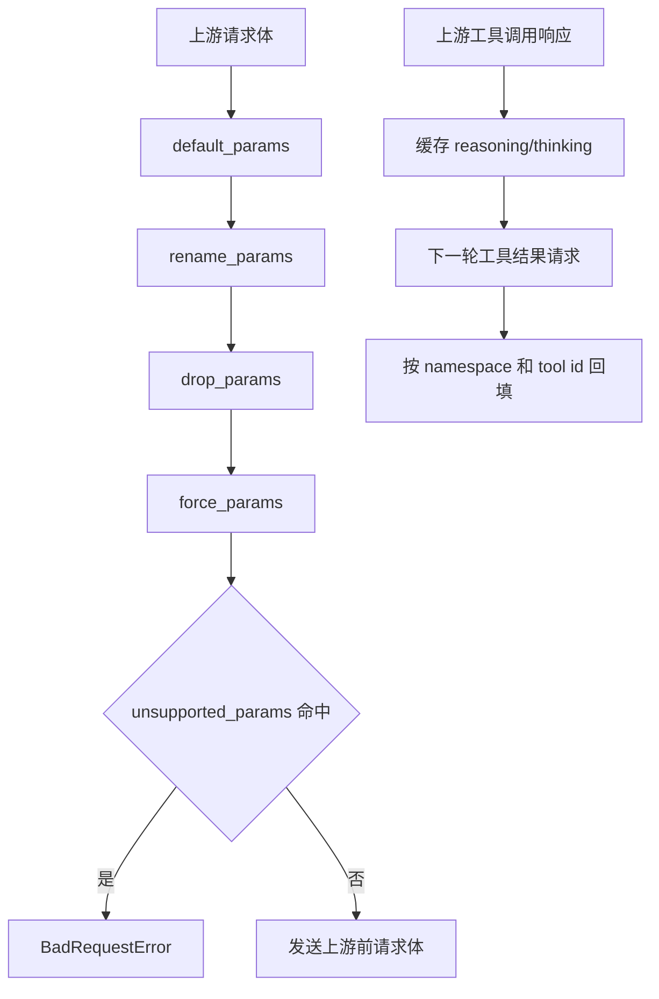

# 兼容规则与 Reasoning 缓存模块

## 模块名称

兼容规则与 Reasoning 缓存。

## 模块职责

兼容规则模块用于在请求发送给上游前调整参数，以适配不同上游的参数命名和能力差异。Reasoning 缓存模块用于保存上游返回的 reasoning/thinking 内容，并在后续工具续轮请求中回填，避免某些上游因为缺少推理上下文而拒绝请求。

## 输入

- 渠道配置中的 `compat` 对象。
- 已转换为上游协议的请求体。
- 上游 Chat 响应中的 `reasoning_content`。
- 上游 Messages 响应中的 `thinking` block。
- 请求中的缓存 namespace。

## 输出

- 应用兼容规则后的请求体。
- 兼容规则执行详情列表。
- 注入 reasoning/thinking 后的请求体。
- 被注入的 tool call ID 列表。

## 依赖模块

- `compat.py`：参数兼容处理。
- `reasoning_cache.py`：reasoning/thinking 缓存和回填。
- `app.py`：在代理主流程中决定何时应用兼容和注入缓存。
- `config.py`：校验 compat 字段。
- `errors.py`：unsupported 参数错误。

## 核心逻辑

### 兼容规则

- 逻辑步骤 1：先应用 `default_params`，仅当请求中没有该字段时补默认值。
- 逻辑步骤 2：应用 `rename_params`，把源字段改名到目标字段；如果目标字段已存在则保留目标字段。
- 逻辑步骤 3：应用 `drop_params`，删除上游不需要的字段。
- 逻辑步骤 4：应用 `force_params`，强制覆盖字段值。
- 逻辑步骤 5：检查 `unsupported_params`，如果请求中仍包含这些字段，则抛出 `BadRequestError`。

### Reasoning 缓存

- 逻辑步骤 1：Chat 响应中如果 assistant message 同时包含 `reasoning_content` 和 `tool_calls`，则按 tool call ID 缓存 reasoning。
- 逻辑步骤 2：Messages 响应中如果 `thinking` block 出现在 `tool_use` 前，则按 tool use ID 缓存 thinking blocks。
- 逻辑步骤 3：后续请求中，如果 assistant 工具调用缺少 reasoning/thinking，则根据 tool call ID 和 namespace 查找并注入。
- 逻辑步骤 4：缓存使用 `OrderedDict`，超过 `max_entries` 后移除最早条目。
- 逻辑步骤 5：如果渠道开启 `fallback_thinking_on_tool_use`，代理会在找不到缓存时注入兜底文本，降低上游拒绝续轮的概率。

## 数据结构 / 数据库表

该模块不直接使用数据库。

### `compat` 配置

| 字段 | 类型 | 用途 |
| --- | --- | --- |
| `default_params` | object | 缺省参数补齐 |
| `rename_params` | object | 参数重命名 |
| `drop_params` | array | 删除参数 |
| `force_params` | object | 强制覆盖参数 |
| `unsupported_params` | array | 上游不支持参数，命中即拒绝 |
| `fallback_thinking_on_tool_use` | boolean | 工具续轮缺 reasoning 时注入兜底内容 |

### ReasoningCache 内存结构

| 字段 | 类型 | 用途 |
| --- | --- | --- |
| `_by_tool_call_id` | OrderedDict | Chat reasoning，键为 `(namespace, tool_call_id)` |
| `_thinking_by_tool_call_id` | OrderedDict | Messages thinking blocks，键为 `(namespace, tool_call_id)` |
| `max_entries` | integer | 最大缓存条数 |

## 外部接口 / API

| 函数 | 参数 | 返回值 | 异常 |
| --- | --- | --- | --- |
| `apply_compat` | `payload`, `compat` | `(payload, details)` | `BadRequestError` |
| `remember_chat_response` | Chat response, namespace | 无 | 无显式异常 |
| `remember_messages_response` | Messages response, namespace | 无 | 无显式异常 |
| `inject_chat_request` | Chat request, namespace | 注入的 tool call ID 列表 | 无显式异常 |
| `inject_messages_request` | Messages request, namespace | 注入的 tool use ID 列表 | 无显式异常 |

## 异常处理

| 异常类型 | 触发条件 | 处理方式 |
| --- | --- | --- |
| `BadRequestError` | `unsupported_params` 中的字段仍出现在请求体 | 代理返回 400 |
| 缓存未命中 | 没有对应 tool call ID 或 namespace 不一致 | 不注入，继续请求 |
| 请求结构不匹配 | messages/content/tool_calls 类型不符合预期 | 跳过处理 |

## 流程图 / UML

## 备注

- 兼容规则执行顺序会影响最终请求体，新增规则时应保持当前顺序。
- Reasoning 缓存是内存态，代理重启后会丢失。
- namespace 来自请求字段、metadata 或 request_id，用于隔离不同会话的工具调用。

