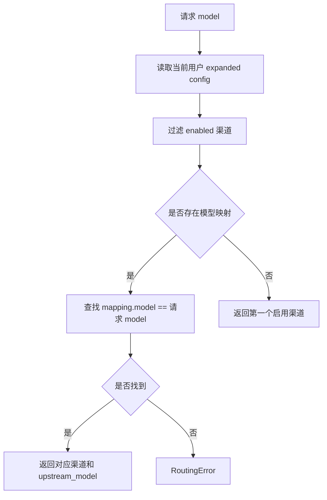

# 配置管理与路由模块

## 模块名称

配置管理与路由。

## 模块职责

负责渠道配置的读取、归一化、环境变量展开、合法性校验、按用户保存，以及代理请求中的渠道选择和模型映射。

## 输入

- 管理台提交的渠道配置 JSON。
- SQLite 中已保存的 `channels` 表数据。
- 当前代理请求的用户和 `model`。
- 默认超时时间。

## 输出

- 当前用户可见的原始配置。
- 当前用户可用的展开后配置。
- 保存后的渠道配置。
- `RouteResult`，包含目标渠道、原始模型和上游模型。
- 配置校验错误或路由错误。

## 依赖模块

- `config.py`：配置管理、归一化、校验。
- `routing.py`：路由选择。
- `db.py`：渠道读取和保存。
- `defaults.py`：默认重试次数。
- `errors.py`：路由错误。

## 核心逻辑

- 逻辑步骤 1：`ConfigManager` 初始化时调用 `init_db` 并从数据库读取所有渠道。
- 逻辑步骤 2：`normalize_config` 补齐模型映射中的 `upstream_model`，为空时默认等于 `model`。
- 逻辑步骤 3：`expand_env` 对字符串值执行环境变量展开。
- 逻辑步骤 4：`validate_config` 检查顶层字段、渠道列表类型、同一用户内渠道 ID 是否重复。
- 逻辑步骤 5：`validate_channel` 校验渠道 ID、类型、baseurl、认证模式、超时、重试次数、headers、启用状态、模型映射和兼容配置。
- 逻辑步骤 6：保存配置时按 `owner_username` 写入 `channels` 表；普通用户保存时强制归属自己。
- 逻辑步骤 7：代理请求路由时先过滤启用渠道。
- 逻辑步骤 8：如果任意启用渠道配置了模型映射，则必须找到与请求 `model` 完全一致的映射。
- 逻辑步骤 9：如果没有任何模型映射，则使用第一个启用渠道，并把请求模型原样作为上游模型。

## 数据结构 / 数据库表

### 渠道配置对象

| 字段 | 类型 | 用途 |
| --- | --- | --- |
| `owner_username` | string | 渠道所属用户 |
| `id` | string | 渠道唯一 ID，同一用户内唯一 |
| `name` | string | 渠道显示名称 |
| `type` | string | `responses`、`chat` 或 `messages` |
| `baseurl` | string | 上游基础地址，必须以 `http://` 或 `https://` 开头 |
| `apikey` | string | 上游 API Key |
| `auth_mode` | string | `config` 或 `none` |
| `headers` | object | 自定义上游请求头 |
| `timeout_seconds` | integer | 单请求超时 |
| `retry_count` | integer | 可重试次数 |
| `compat` | object | 参数兼容规则 |
| `models` | array | 模型映射列表 |
| `enabled` | boolean | 是否启用 |

### `channels`

| 字段 | 类型 | 用途 |
| --- | --- | --- |
| `owner_username` | TEXT | 所属用户 |
| `id` | TEXT | 渠道 ID |
| `position` | INTEGER | 排序位置 |
| `name` | TEXT | 渠道名称 |
| `type` | TEXT | 上游协议类型 |
| `baseurl` | TEXT | 上游地址 |
| `apikey` | TEXT | 上游 Key |
| `auth_mode` | TEXT | 鉴权模式 |
| `headers_json` | TEXT | 自定义 headers |
| `timeout_seconds` | INTEGER | 超时 |
| `retry_count` | INTEGER | 重试次数 |
| `compat_json` | TEXT | 兼容配置 |
| `models_json` | TEXT | 模型映射 |
| `enabled` | INTEGER | 是否启用 |
| `created_at` | REAL | 创建时间 |
| `updated_at` | REAL | 更新时间 |

主键为 `(owner_username, id)`。

## 外部接口 / API

| 接口名 | 参数 | 返回值 | 异常 |
| --- | --- | --- | --- |
| `GET /admin/api/config` | 当前 Session | 当前用户配置 | 401 未登录 |
| `POST /admin/api/config` | `{channels: [...]}` | 保存后的配置 | 400 配置非法，500 数据库写入失败 |
| `GET /admin/api/config/export` | 当前 Session | JSON 文件响应 | 401 未登录 |
| `POST /admin/api/config/import` | `{channels: [...]}` | 合并结果和跳过 ID | 400 配置非法 |
| `POST /admin/api/channels/discover-models` | 渠道草稿 | 上游模型列表 | 400 配置非法，502 上游失败 |
| `POST /admin/api/channels/test` | 渠道草稿和测试 payload | 测试响应 | 400 配置非法，502 上游失败 |

## 异常处理

| 异常类型 | 触发条件 | 处理方式 |
| --- | --- | --- |
| `ConfigError` | 字段类型错误、缺少必填字段、baseurl 非 HTTP、重复模型映射 | 管理 API 返回 400 |
| `RoutingError` | 无启用渠道、模型没有匹配映射 | 代理接口返回 400 |
| 数据库异常 | 保存或导入配置失败 | 返回 500 并写错误日志 |

## 流程图 / UML

## 备注

- 只要任意启用渠道配置了模型映射，请求模型就必须命中某个映射。
- 普通用户不会回退使用超级管理员渠道。
- `auth_mode=none` 时不会自动注入 Authorization，但自定义 headers 仍会透传给上游。

