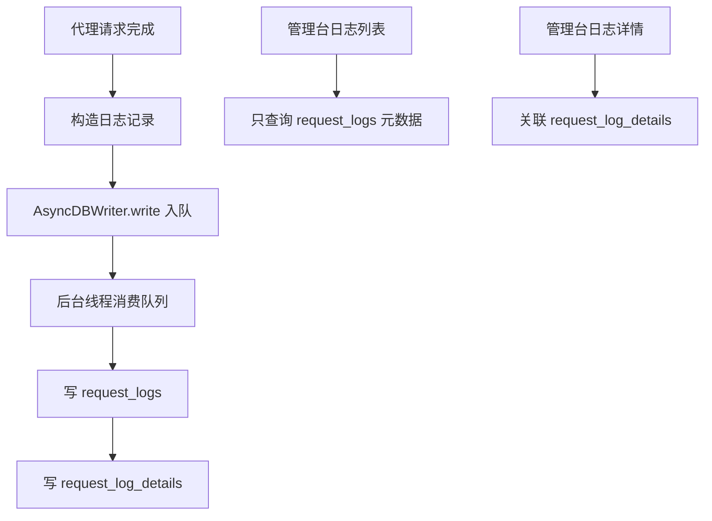

# 持久化、日志与统计模块

## 模块名称

持久化、日志与统计。

## 模块职责

负责 SQLite 表结构初始化和迁移、用户和 Key 存储、渠道存储、Web Search 配置存储、请求日志异步写入、日志查询、筛选项查询、Token 用量提取、费用估算和统计看板数据聚合。

## 输入

- 应用启动时的数据库路径和默认管理员用户名。
- 管理 API 提交的用户、Key、渠道、Web Search 配置。
- 代理请求结束后形成的日志记录。
- 管理后台日志筛选条件和统计区间。

## 输出

- SQLite 数据库文件。
- 用户、Key、渠道、Web Search 配置查询结果。
- 请求日志列表和详情。
- 筛选候选项。
- 统计 summary、时间序列 points、模型分布。
- 成本估算。

## 依赖模块

- `db.py`：数据库核心实现。
- `logging_utils.py`：JSON 日志和脱敏。
- `settings.py`：数据库路径、日志路径、日志等级、人民币汇率。
- `pricing.json`：模型价格表。
- `app.py`：把请求上下文和响应内容交给数据库写入。

## 核心逻辑

- 逻辑步骤 1：`init_db` 创建数据库目录，执行建表 SQL，并调用迁移逻辑补齐历史字段。
- 逻辑步骤 2：`ensure_superadmin` 根据环境变量创建或更新超级管理员。
- 逻辑步骤 3：用户和访问 Key 使用 PBKDF2 或 HMAC/SHA 方式保存哈希，避免只依赖明文。
- 逻辑步骤 4：渠道、Web Search 配置以 JSON 字段保存复杂结构。
- 逻辑步骤 5：代理请求完成后构造日志记录，调用 `AsyncDBWriter.write` 放入队列。
- 逻辑步骤 6：后台线程消费队列，先写 `request_logs` 元数据，再写 `request_log_details` 大字段。
- 逻辑步骤 7：日志列表默认只查询元数据，详情接口再关联读取大字段，降低列表响应体积。
- 逻辑步骤 8：`extract_usage` 按协议提取 input、cached、output tokens。
- 逻辑步骤 9：`calculate_cost` 根据 `pricing.json` 模型模糊匹配和分段定价估算美元成本。
- 逻辑步骤 10：`read_stats` 按时间区间聚合请求量、成功量、Token、成本、RPM、TPM、TTFT 和模型分布。

## 数据结构 / 数据库表

### `request_logs`

| 字段 | 类型 | 用途 |
| --- | --- | --- |
| `id` | INTEGER PRIMARY KEY | 日志 ID |
| `request_id` | TEXT | 请求短 ID |
| `created_at` | REAL | 请求开始时间 |
| `method` | TEXT | HTTP 方法 |
| `path` | TEXT | 请求路径 |
| `client_ip` | TEXT | 客户端 IP |
| `model` | TEXT | 客户端请求模型 |
| `upstream_model` | TEXT | 实际上游模型 |
| `channel_id` | TEXT | 渠道 ID |
| `is_stream` | INTEGER | 是否流式 |
| `ttft_ms` | INTEGER | 首 Token 延迟 |
| `duration_ms` | INTEGER | 总耗时 |
| `status_code` | INTEGER | 响应状态码 |
| `input_tokens` | INTEGER | 输入 Token |
| `cached_tokens` | INTEGER | 缓存 Token |
| `output_tokens` | INTEGER | 输出 Token |
| `cost` | REAL | 成本估算 |
| `owner_username` | TEXT | 所属用户 |
| `api_key_id` | INTEGER | 访问 Key ID |
| `error` | TEXT | 错误摘要 |

### `request_log_details`

| 字段 | 类型 | 用途 |
| --- | --- | --- |
| `log_id` | INTEGER PRIMARY KEY | 对应 `request_logs.id` |
| `request_headers` | TEXT | 脱敏请求头 |
| `request_body` | TEXT | 脱敏客户端请求体 |
| `upstream_request_body` | TEXT | 脱敏上游请求体 |
| `upstream_response_body` | TEXT | 脱敏上游响应体 |
| `response_body` | TEXT | 脱敏客户端响应体 |
| `web_search_json` | TEXT | Web Search 执行详情 |

其余表结构见认证、配置和 Web Search 模块文档。

## 外部接口 / API

| 接口名 | 参数 | 返回值 | 异常 |
| --- | --- | --- | --- |
| `GET /admin/api/logs` | 分页和筛选参数 | `{events,total,page,page_size}` | 普通用户自动限定 owner |
| `GET /admin/api/logs/<id>` | 日志 ID | 日志详情 | 404 不存在或无权限 |
| `GET /admin/api/log-filter-options` | `field`, `q`, 当前筛选 | 候选值 | 非法字段返回空结果 |
| `GET /admin/api/stats` | `range` 或 custom 时间戳 | 统计数据 | 空库返回空统计 |
| `read_logs_page` | db path、分页、filters | 分页日志 | 参数自动归一化 |
| `read_stats` | db path、时间范围、owner | 看板统计 | 参数非法时回退默认范围 |

## 异常处理

| 异常类型 | 触发条件 | 处理方式 |
| --- | --- | --- |
| 写库异常 | 异步写入线程插入失败 | rollback 后吞掉异常，避免影响代理响应 |
| 数据库不存在 | 首次运行或日志为空 | 返回空日志或空统计 |
| JSON 字段损坏 | 解析 headers/models/compat/details 失败 | 回退为空对象或空列表 |
| 分页参数非法 | page/page_size 不是合法整数 | 归一化到安全范围 |

## 流程图 / UML

## 备注

- 日志文件采用 JSON Lines 风格，敏感字段通过 `redact` 脱敏。
- 数据库日志分为元数据和详情表，避免列表查询加载大字段。
- 成本估算依赖 `pricing.json`，模型名使用最长子串匹配。

