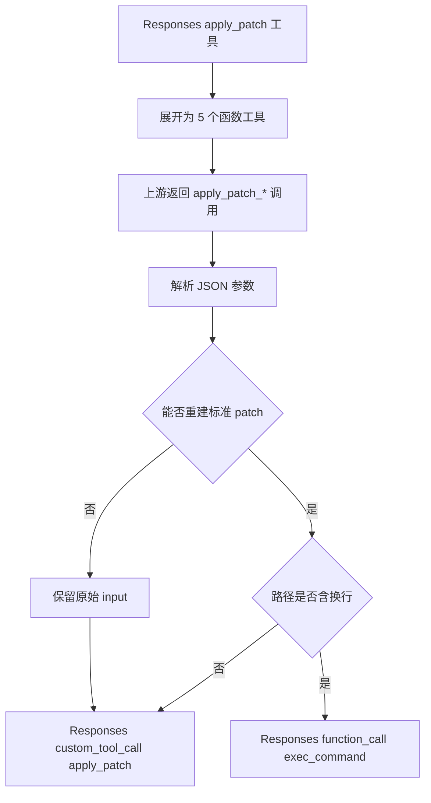

# apply_patch 兼容格式细则

## 模块名称

apply_patch 兼容转换。

## 模块职责

该细则补充协议转换模块中 apply_patch 的特殊兼容逻辑。它负责识别 Responses 原生或自定义的 `apply_patch` 工具，把它展开成 Chat/Messages 上游更容易调用的结构化函数工具，并在上游返回工具调用后重建为 Responses 可识别的 `custom_tool_call` 或降级为 `exec_command`。

## 输入

- Responses 工具定义中的 `apply_patch` 或等价 custom tool。
- 上游 Chat/Messages 返回的结构化工具调用：
  - `apply_patch_add_file`
  - `apply_patch_delete_file`
  - `apply_patch_update_file`
  - `apply_patch_replace_file`
  - `apply_patch_batch`
- 旧格式 patch 文本，例如 `*** Begin Patch ... *** End Patch`。
- 工具调用参数，可能是 JSON 字符串、对象、`patch` 字段、`input` 字段或命令数组。

## 输出

- 给上游使用的函数工具 schema。
- Responses `custom_tool_call`，名称为 `apply_patch`，`input` 为标准 patch 语法。
- 特殊情况下的 Responses `function_call`，名称为 `exec_command`，参数为可执行 shell 命令。
- 结构化 batch operations。

## 依赖模块

- `protocols.py`：工具展开、参数归一化、patch 重建、exec fallback。
- `patch_semantics.py`：流式语义事件中的文件开始、内容进度、文件结束。
- `streaming.py`：流式工具调用时将 apply_patch 语义映射成 Responses SSE。

## 核心逻辑

- 逻辑步骤 1：工具识别。
  - `native_type == "apply_patch"` 时识别为 apply_patch。
  - 工具名归一化后等于 `apply_patch`，且 `native_type` 为 `custom` 或 `apply_patch` 时识别。
  - 原始工具 `raw.type == "custom"` 且名称为 `apply_patch` 时识别。

- 逻辑步骤 2：工具展开。
  - `_expand_apply_patch_proxy_tools` 将一个 apply_patch 工具展开成 5 个结构化函数工具。
  - 展开后会调用 `_dedupe_canonical_tools` 去重。

- 逻辑步骤 3：上游工具调用返回后，按工具名和参数重建 patch。
  - `apply_patch_add_file`、`delete_file`、`update_file`、`replace_file` 和 `batch` 会走 `_rebuild_apply_patch_grammar`。
  - 旧格式 `apply_patch` 会走 `_apply_patch_input_from_arguments`，尽量提取 patch 文本。

- 逻辑步骤 4：判断是否需要降级成 `exec_command`。
  - 如果结构化操作中的 `path` 或 `move_to` 包含换行符，标准 patch 语法无法安全表达，降级为 Python fallback 命令。
  - 如果旧格式 patch 解析出多行路径，也降级为 Python fallback 命令。
  - 其他旧格式 patch 会生成调用 `apply_patch` 命令的 shell wrapper。

- 逻辑步骤 5：Responses 输出重建。
  - 不需要 fallback 时，返回 `custom_tool_call`：`name=apply_patch`，`input=标准 patch 文本`。
  - 需要 fallback 时，返回 `function_call`：`name=exec_command`，`arguments={"cmd": "..."}`。

## 支持的结构化工具格式

### `apply_patch_add_file`

| 字段 | 类型 | 必填 | 说明 |
| --- | --- | --- | --- |
| `path` | string | 是 | 新文件路径 |
| `content` | string | 是 | 完整文件内容 |

重建 patch：

```text
*** Begin Patch
*** Add File: path
+line 1
+line 2
*** End Patch
```

### `apply_patch_delete_file`

| 字段 | 类型 | 必填 | 说明 |
| --- | --- | --- | --- |
| `path` | string | 是 | 删除文件路径 |

重建 patch：

```text
*** Begin Patch
*** Delete File: path
*** End Patch
```

### `apply_patch_update_file`

| 字段 | 类型 | 必填 | 说明 |
| --- | --- | --- | --- |
| `path` | string | 是 | 目标文件路径 |
| `move_to` | string | 否 | 移动后的目标路径 |
| `hunks` | array | 是 | 更新片段 |

`hunks[].lines[]`：

| 字段 | 类型 | 允许值 | 说明 |
| --- | --- | --- | --- |
| `op` | string | `context`、`add`、`remove`、`eof` | 行语义 |
| `text` | string | 任意字符串 | 行内容，`eof` 通常为空 |

重建 patch：

```text
*** Begin Patch
*** Update File: path
*** Move to: new_path
@@
 context line
-removed line
+added line
*** End of File
*** End Patch
```

### `apply_patch_replace_file`

| 字段 | 类型 | 必填 | 说明 |
| --- | --- | --- | --- |
| `path` | string | 是 | 替换文件路径 |
| `content` | string | 是 | 替换后的完整内容 |

重建 patch 会被表达为先删除再新增同一路径：

```text
*** Begin Patch
*** Delete File: path
*** Add File: path
+new content
*** End Patch
```

### `apply_patch_batch`

| 字段 | 类型 | 必填 | 说明 |
| --- | --- | --- | --- |
| `operations` | array | 是 | 多个结构化操作 |

每个 operation 支持：

| 字段 | 类型 | 说明 |
| --- | --- | --- |
| `type` | string | `add_file`、`delete_file`、`update_file`、`replace_file` |
| `path` | string | 目标路径 |
| `move_to` | string | 仅 `update_file` 使用 |
| `content` | string | `add_file` 和 `replace_file` 使用 |
| `hunks` | array | `update_file` 使用 |

## 旧格式兼容

### 可识别的旧参数来源

| 输入形态 | 提取方式 |
| --- | --- |
| 字符串且不是 JSON 对象 | 包装为 `{"patch": "...原字符串..."}` |
| JSON 对象字符串 | 保持字符串，后续按 JSON 解码 |
| 对象含 `patch` | 使用 `patch` 字段 |
| 对象仅含 `input` | 转成 `{"patch": input}` |
| 对象含 `command` | 尝试从命令中提取 patch |
| 命令数组 | 如果首项是 `apply_patch`，使用第二项或其中看起来像 patch 的字符串 |

### 标准 patch 解析

支持：

- `*** Add File: path`
- `*** Delete File: path`
- `*** Update File: path`
- `*** Move to: path`
- `@@` hunk
- 以空格开头的 context 行
- 以 `+` 开头的新增行
- 以 `-` 开头的删除行
- `*** End of File`

不支持时会返回 `None`，保留原始输入或走 fallback。

## fallback 规则

| 场景 | 输出 |
| --- | --- |
| 结构化操作路径无换行 | Responses `custom_tool_call`，调用 `apply_patch` |
| 结构化操作路径或 `move_to` 含换行 | Responses `function_call`，调用 `exec_command` 执行 Python fallback |
| 旧格式 patch 可解析且路径含换行 | `exec_command` Python fallback |
| 旧格式 patch 看起来像 patch 但无需 Python fallback | `exec_command` shell wrapper，内部调用 `apply_patch` 命令 |
| 输入不是 patch 且无法重建 | 保留为 apply_patch custom call 的原始 input |

Python fallback 支持：

- 新增文件：目标存在则失败。
- 删除文件：目标不存在则失败。
- 替换文件：目标不存在则失败。
- 更新文件：按 hunk context 查找并替换；找不到上下文则失败。
- 移动文件：目标已存在则失败，写入新路径后删除原路径。

## 异常处理

| 异常类型 | 触发条件 | 处理方式 |
| --- | --- | --- |
| JSON 解码失败 | 参数字符串不是合法 JSON | 当作普通字符串或 patch 文本继续处理 |
| Patch 解析失败 | 缺少 Begin/End、路径为空、hunk 行格式非法 | 返回 `None`，由上层保留原始输入或 fallback |
| 路径含换行 | 标准 patch 表达不安全 | 生成 `exec_command` Python fallback |
| Python fallback 执行失败 | 文件不存在、目标存在、hunk context 找不到 | 命令输出错误并非零退出 |

## 流程图 / UML



## 备注

- 这套兼容逻辑主要解决 Chat/Messages 上游不支持 Responses custom tool 的问题。
- `replace_file` 在标准 patch 中被编码为 delete + add，测试中需要覆盖同路径替换。
- 多行路径属于特殊兼容场景，当前通过 `exec_command` 执行 Python fallback。
- 相关回归测试集中在 `tests/test_protocols.py` 中的 apply_patch 用例。

