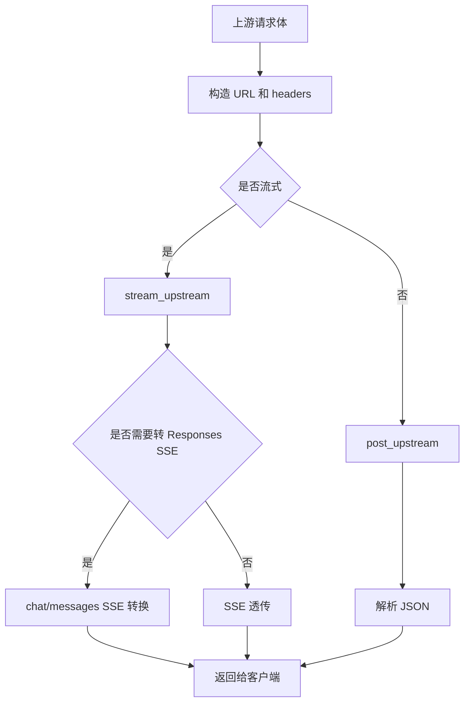

# 上游请求与流式转换模块

## 模块名称

上游请求与流式转换。

## 模块职责

负责把代理内部准备好的请求发送给上游模型服务，并处理普通 JSON 响应、模型列表发现、SSE 流式响应、上游协议流到 Responses SSE 的转换，以及非流式响应到 SSE 的合成。

## 输入

- 渠道配置对象。
- 已转换并应用兼容规则的上游请求体。
- 默认超时时间。
- 上游返回的 JSON 或 SSE 行。

## 输出

- 上游 JSON 响应。
- 上游模型列表 JSON。
- 逐行 SSE 文本。
- Responses SSE 事件。
- 上游错误对象。

## 依赖模块

- `upstream.py`：HTTP 请求、重试、鉴权头构造。
- `streaming.py`：SSE 解析、Responses SSE 生成、Chat/Messages SSE 转换。
- `patch_semantics.py`：流式 apply_patch 工具语义事件。
- `protocols.py`：工具调用项构造和 annotation 归一化辅助。
- `errors.py`：上游错误。

## 核心逻辑

- 逻辑步骤 1：根据渠道 `type` 选择上游 endpoint：
  - `responses` -> `/v1/responses`
  - `chat` -> `/v1/chat/completions`
  - `messages` -> `/v1/messages`
- 逻辑步骤 2：`_join_url` 兼容 `baseurl` 是否已经以 `/v1` 结尾。
- 逻辑步骤 3：`build_headers` 注入 `content-type`、`user-agent`、自定义 headers 和认证头。
- 逻辑步骤 4：`post_upstream` 发送非流式 POST，请求成功后解析 JSON。
- 逻辑步骤 5：`stream_upstream` 发送流式 POST，返回可迭代的 SSE 行。
- 逻辑步骤 6：`list_upstream_models` 向 `/v1/models` 发起 GET，用于管理台模型发现。
- 逻辑步骤 7：`_urlopen_with_retries` 对 429、5xx、连接失败、远程断开和超时进行重试。
- 逻辑步骤 8：`responses_sse_events` 把完整 Responses JSON 合成为 Responses SSE。
- 逻辑步骤 9：`chat_sse_to_responses_events` 将 Chat SSE 增量转换成 Responses SSE。
- 逻辑步骤 10：`messages_sse_to_responses_events` 将 Anthropic Messages SSE 转换成 Responses SSE。

## 数据结构 / 数据库表

该模块不直接写数据库，但代理应用会把以下内容写入日志详情：

- `upstream_request_body`：发给上游的请求体，已脱敏。
- `upstream_response_body`：上游完整响应体，已脱敏。
- `response_body`：返回给客户端的响应体，已脱敏。

## 外部接口 / API

| 函数 | 参数 | 返回值 | 异常 |
| --- | --- | --- | --- |
| `post_upstream` | `channel`, `payload`, `default_timeout` | dict JSON 响应 | `UpstreamError` |
| `stream_upstream` | `channel`, `payload`, `default_timeout` | SSE 行迭代器 | `UpstreamError` |
| `list_upstream_models` | `channel`, `default_timeout` | dict 模型列表 | `UpstreamError` |
| `build_headers` | `channel` | HTTP headers | 无显式异常 |
| `responses_sse_events` | Responses payload | SSE 字符串迭代器 | 无显式异常 |
| `chat_sse_to_responses_events` | 上游 SSE 行、模型名、回调 | Responses SSE | 数据不完整时尽量跳过 |
| `messages_sse_to_responses_events` | 上游 SSE 行、模型名、回调 | Responses SSE | 数据不完整时尽量跳过 |

## 异常处理

| 异常类型 | 触发条件 | 处理方式 |
| --- | --- | --- |
| HTTP 429/5xx | 上游限流或服务端错误 | 按 `retry_count` 重试，尊重 `Retry-After` |
| HTTP 4xx | 上游请求错误 | 不重试，返回 `UpstreamError` 并带上上游响应体 |
| `URLError` | DNS、连接失败等 | 可重试，最终返回 502 |
| `RemoteDisconnected` | 上游提前断开 | 可重试，最终返回 502 |
| `TimeoutError` | 请求超时 | 可重试，最终返回 504 |
| `JSONDecodeError` | 非流式上游返回非法 JSON | 返回 502 |

## 流程图 / UML

## 备注

- Messages 渠道使用 `x-api-key` 和 `anthropic-version`；Responses/Chat 通常使用 `authorization: Bearer ...`。
- 重试只发生在上游响应开始前，流式响应开始后的错误由流式生成器记录。
- TTFT 由代理层根据首个有效 SSE 行计算。

