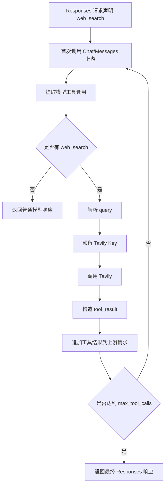

# Web Search 模拟模块

## 模块名称

Web Search 模拟。

## 模块职责

在 Responses 入口请求声明 `web_search` 工具，但目标上游是 Chat 或 Messages 协议时，使用本地 Tavily 调用模拟 Web Search 工具执行，并把工具结果回填给上游继续生成最终回答。

## 输入

- Responses 请求体中的 `tools`。
- 模型生成的工具调用。
- Tavily API Key 配置。
- Web Search 查询参数。
- 上游中间轮响应。

## 输出

- Web Search 工具调用结果。
- 带 `web_search_call` 输出项的 Responses 响应。
- 来源 annotation。
- Web Search 执行日志。
- 失败时的工具结果或上游错误。

## 依赖模块

- `web_search.py`：工具声明识别、查询解析、Tavily 调用、结果构造和来源标注。
- `app.py`：非流式和流式 Web Search 编排。
- `db.py`：Web Search 配置读取、保存、Key 预留和使用次数递增。
- `upstream.py`：执行工具前后的上游模型调用。
- `streaming.py`：流式 Web Search 的 Responses SSE 拼接。
- `reasoning_cache.py`：工具续轮时保留 thinking/reasoning 上下文。

## 核心逻辑

- 逻辑步骤 1：`request_declares_web_search` 判断 Responses 请求是否声明 `{"type": "web_search"}`。
- 逻辑步骤 2：代理层额外判断入口协议必须是 `responses`，渠道类型必须是 `chat` 或 `messages`，请求用户必须是超级管理员，且 Web Search 配置启用。
- 逻辑步骤 3：第一次调用上游，让模型决定是否调用 `web_search`。
- 逻辑步骤 4：`extract_tool_calls` 从 Chat 或 Messages 响应中提取工具调用。
- 逻辑步骤 5：`web_search_calls` 筛选名为 `web_search` 的调用，`parse_web_search_query` 要求参数只能包含 `query`。
- 逻辑步骤 6：从数据库预留可用 Tavily Key，预留时会递增使用次数。
- 逻辑步骤 7：调用 `tavily_search`，将结果转换为工具结果 JSON。
- 逻辑步骤 8：`append_tool_results` 把模型工具调用和工具结果追加到上游请求消息中。
- 逻辑步骤 9：继续调用上游，直到没有新的 Web Search 调用或达到 `max_tool_calls`。
- 逻辑步骤 10：把中间工具调用转换成 Responses 的 `web_search_call` item，并对最终消息增加来源文本和 URL citation annotation。

## 数据结构 / 数据库表

### `web_search_settings`

| 字段 | 类型 | 用途 |
| --- | --- | --- |
| `id` | INTEGER PRIMARY KEY | 固定为 1 |
| `enabled` | INTEGER | Web Search 是否启用 |
| `key_usage_limit` | INTEGER | 默认单 Key 使用上限 |
| `created_at` | REAL | 创建时间 |
| `updated_at` | REAL | 更新时间 |

### `tavily_keys`

| 字段 | 类型 | 用途 |
| --- | --- | --- |
| `id` | INTEGER PRIMARY KEY | Key ID |
| `position` | INTEGER | 排序位置 |
| `provider` | TEXT | 当前支持 `tavily` |
| `api_key` | TEXT | Tavily API Key |
| `enabled` | INTEGER | 是否启用 |
| `usage_count` | INTEGER | 已使用次数 |
| `usage_limit` | INTEGER | 该 Key 使用上限 |
| `created_at` | REAL | 创建时间 |
| `updated_at` | REAL | 更新时间 |

### Web Search 工具结果

| 字段 | 类型 | 用途 |
| --- | --- | --- |
| `call_id` | string | 模型工具调用 ID |
| `query` | string | 搜索查询 |
| `status` | string | `completed` 或 `failed` |
| `tool_result` | string | 传回模型的 JSON 字符串 |
| `opencodex_result` | object | 内部结构化结果 |
| `provider` | string | 搜索提供方 |
| `key_id` | integer | 使用的 Key |
| `raw` | object | Tavily 原始响应 |

## 外部接口 / API

| 接口名 | 参数 | 返回值 | 异常 |
| --- | --- | --- | --- |
| `GET /admin/api/web-search` | Session | Web Search 配置 | 403 非超级管理员 |
| `POST /admin/api/web-search` | `enabled`, `key_usage_limit`, `keys` | 保存后的配置 | 400 参数非法 |
| `POST /admin/api/web-search/test-key` | `id`, 可选 `query` | Key 测试结果 | 400 Key 不可用或参数非法 |
| `tavily_search` | `api_key`, `query`, `timeout` | Tavily 结果摘要 | 返回失败结构，不抛业务异常 |

## 异常处理

| 异常类型 | 触发条件 | 处理方式 |
| --- | --- | --- |
| 查询参数非法 | 工具参数不是 JSON、不是对象、缺少 query、包含 query 以外字段 | 构造 failed 工具结果喂回模型 |
| 无可用 Key | 所有 Key 停用或达到使用上限 | 构造 failed 工具结果 |
| Tavily HTTP 错误 | Tavily 返回 4xx/5xx | 构造 failed 工具结果并记录原始响应 |
| Tavily 网络错误或超时 | 连接失败或超时 | 构造 failed 工具结果 |
| 上游最终调用失败 | 工具结果回填后上游返回错误 | 代理返回上游错误，同时保留 Web Search 日志 |

## 流程图 / UML

## 备注

- 当前 Web Search 模拟只对超级管理员开放。
- `max_tool_calls` 默认是 5，布尔值会被视为默认值。
- 当前实现只支持 Tavily provider。

