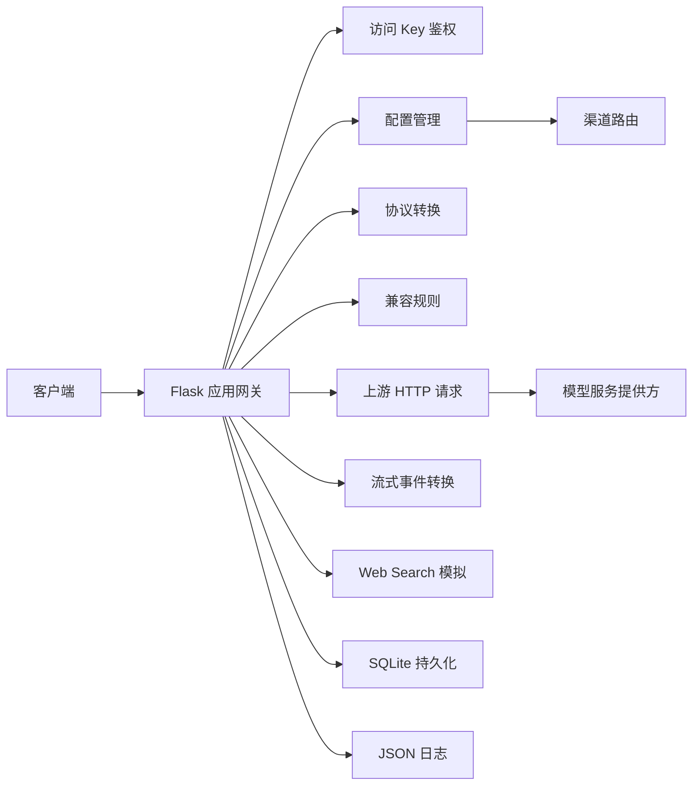

# 项目概述

## 1.1 项目名称

OpenCodex Proxy。

## 1.2 项目背景

OpenCodex Proxy 是一个轻量 Python 后端代理服务，用于在客户端和不同模型服务提供方之间做协议适配、渠道路由和运行观测。

当前代码支持三个入口协议：

- `/v1/responses`
- `/v1/chat/completions`
- `/v1/messages`

后端可以把入口协议转换到渠道配置的上游协议，从而让同一个客户端请求按不同渠道转发到 Responses、Chat Completions 或 Anthropic Messages 风格的服务。

## 1.3 项目目标

- 为 Codex CLI 或其他兼容客户端提供统一的 OpenAI 风格代理入口。
- 支持多个上游渠道，并按用户、模型映射和启用状态选择渠道。
- 对不同上游协议做请求和响应转换。
- 对上游不兼容参数做显式改写、默认值补齐或拒绝。
- 提供管理后台，用于配置渠道、用户、访问 API Key、Web Search 和日志查看。
- 记录请求日志、Token 用量、费用估算、TTFT 和统计数据。
- 在特定条件下为 Responses 请求模拟 `web_search` 工具调用。

## 1.4 核心功能概览

| 功能 | 说明 |
| --- | --- |
| 管理后台 | `/admin` 提供登录、渠道配置、用户管理、访问 API Key 管理、日志和统计查看 |
| 访问鉴权 | 代理接口必须使用管理台创建的 `Authorization: Bearer ocx_...` 访问 Key |
| 用户隔离 | 普通用户只能使用自己的渠道、API Key 和日志；超级管理员可以管理全部资源 |
| 渠道路由 | 根据当前用户配置和请求模型选择上游渠道，支持模型名映射到上游模型名 |
| 协议转换 | 在 Responses、Chat 和 Messages 之间转换请求、响应、工具调用和用量字段 |
| 上游调用 | 使用 `urllib.request` 发起 JSON HTTP 请求，支持重试、超时和模型列表发现 |
| 流式处理 | 支持上游 SSE 透传、Chat/Messages SSE 转 Responses SSE、非流式响应合成 SSE |
| Web Search 模拟 | 超级管理员的 Responses 请求可在 Chat/Messages 上游中模拟 `web_search` 工具 |
| 日志与统计 | SQLite 记录元数据和详情，提供分页查询、筛选、统计区间和费用估算 |
| 兼容规则 | 支持参数默认值、重命名、删除、强制覆盖和 unsupported 参数拦截 |
| Reasoning 缓存 | 缓存上游 reasoning/thinking 内容，并在工具续轮请求中回填 |

## 1.5 技术栈与架构概览

### 技术栈

| 类别 | 技术 |
| --- | --- |
| Web 框架 | Flask |
| 配置读取 | python-dotenv、环境变量 |
| 数据库 | SQLite |
| HTTP 客户端 | Python 标准库 `urllib.request` |
| 日志 | Python `logging`、`RotatingFileHandler`、JSON 日志 |
| 部署 | Docker、shell 部署脚本 |
| 测试 | Python `unittest` |

### 架构概览

### 关键入口

- 应用创建：`opencodex_proxy.app:create_app`
- 命令入口：`python -m opencodex_proxy`
- 环境配置：`opencodex_proxy.settings:Settings.from_env`
- 数据库初始化：`opencodex_proxy.db:init_db`
- 协议转换：`opencodex_proxy.protocols:convert_request`、`convert_response`
- 上游调用：`opencodex_proxy.upstream:post_upstream`、`stream_upstream`

