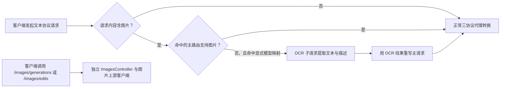
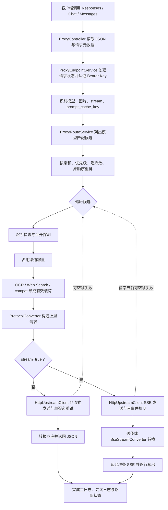
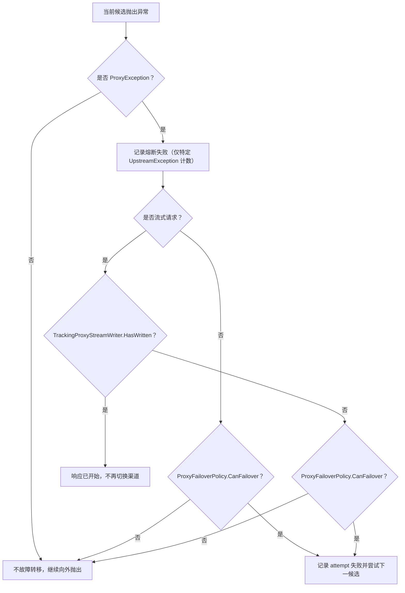

# 代理转换系统边界与术语

> 基准提交：`5851939ad08db9465a226cc18489756ff8cd6941`
> 本文回答两个问题：**“代理转换系统负责什么？”**以及**“后续文档中的词分别指什么？”**。

## 1. 适用范围

本文适用于 OpenCodex 的文本/多模态大模型代理主链路，覆盖以下三个客户端入口协议：

| 入口协议 | HTTP 路径 | `entryProtocol` 常量 | 控制器入口 |
|---|---|---|---|
| OpenAI Responses | `/responses`、`/v1/responses` | `ProtocolConverter.Responses`，值为 `responses` | `ProxyController.Responses` |
| OpenAI Chat Completions | `/chat/completions`、`/v1/chat/completions` | `ProtocolConverter.Chat`，值为 `chat` | `ProxyController.ChatCompletions` |
| Anthropic Messages | `/messages`、`/v1/messages` | `ProtocolConverter.Messages`，值为 `messages` | `ProxyController.Messages` |

本文所称“代理转换”不是单一的 JSON 字段替换函数，而是从客户端请求进入到客户端收到结果的整条编排链路：

1. 读取并解析请求体；
2. 收集并脱敏请求元数据；
3. Bearer API Key 认证；
4. 识别请求模型、流式标志、图片输入和粘性键；
5. 查找、排序并逐一尝试路由候选；
6. 检查熔断状态并占用渠道容量；
7. 执行图片 OCR 降级、Web Search 模式处理和渠道兼容重写；
8. 将入口协议请求转换为上游渠道协议；
9. 调用上游，并在同一渠道内部重试；
10. 将上游响应转换回入口协议；
11. 必要时跨渠道故障转移；
12. 写出非流式 JSON 或流式 SSE，并记录主请求、渠道尝试及 OCR 子请求日志。

## 2. 系统边界

### 2.1 边界内

以下能力属于本套文档的核心范围：

- 三种文本协议之间的同协议透传与跨协议转换；
- 请求内容、指令、参数、工具、工具历史、Reasoning 和 Usage 的语义映射；
- 六个跨协议流式转换方向；
- 按访问密钥所有者隔离的渠道配置读取；
- 请求模型到上游模型的显式映射；
- 渠道优先级、位置、活跃请求数和粘性亲和排序；
- 渠道容量租约；
- 渠道熔断、半开探测与成功/失败回写；
- 单渠道内部 HTTP/SSE 重试；
- 多渠道之间的故障转移；
- 图片输入检测，以及文本模型不支持图片时触发的 OCR 降级；
- Web Search 禁用、原生及模拟模式对主链路的影响；
- 请求/响应日志与流式时序指标。

### 2.2 相邻但不是本文档主体

下列能力与代理主链路相邻，但应与“三协议代理转换”区分：

| 能力 | 与主链路的关系 | 文档边界 |
|---|---|---|
| `/models`、`/v1/models` | 复用访问密钥认证、路由模型能力和模型目录 | 仅解释它如何反映路由模型，不把它当作协议转换请求 |
| `/images/generations`、`/v1/images/generations` | 独立图片生成代理端点 | 不属于 Responses/Chat/Messages 三协议转换矩阵 |
| `/images/edits`、`/v1/images/edits` | 独立 multipart 图片编辑代理端点 | 不属于三协议请求规范化；具有独立请求读取器与响应写出器 |
| OCR 视觉子请求 | 由三协议主请求的图片降级路径触发 | 属于主链路的内部辅助流程，但不是第四种客户端协议 |
| 管理后台 Cookie 认证 | 管理接口的会话认证 | 不等同于代理端点的 Bearer API Key 认证 |
| 渠道、模型目录、价格管理 | 为路由、能力判断和计费提供数据 | 本文只说明读取语义，不展开管理端 CRUD |
| Tavily Web Search | Web Search 模拟模式调用的外部搜索服务 | 仅描述其嵌入代理链路的部分 |

### 2.3 明确不应混淆的两类图片能力

OCR 降级的目标是让**原本包含图片的文本协议请求**可以继续发送给不支持图片的文本模型；独立 Images API 的目标是生成或编辑图片。两者不共享同一协议矩阵。

## 3. 源码入口

### 3.1 HTTP 与应用编排入口

| 路径 | 类型/方法 | 责任 |
|---|---|---|
| `opencodex_proxy/src/Presentation/OpenCodex.Api/Controllers/ProxyController.cs` | `ProxyController.Proxy` | 读取 JSON 对象、构建端点上下文、调用代理编排服务、选择空响应或 JSON 响应 |
| `opencodex_proxy/src/Presentation/OpenCodex.Api/Infrastructure/RequestBodyReader.cs` | `RequestBodyReader.ReadJsonObjectAsync` | 将请求体解析成 `Dictionary<string, object?>`；非法 JSON 或非对象根节点返回 `null` |
| `opencodex_proxy/src/Presentation/OpenCodex.Api/Infrastructure/ProxyRequestMetadataFactory.cs` | `ProxyRequestMetadataFactory.FromHttpRequest` | 收集方法、路径、客户端 IP、请求头；对 Authorization 值做展示级脱敏 |
| `opencodex_proxy/src/Libraries/OpenCodex.Core/Services/Proxy/ProxyEndpointService.cs` | `ProxyEndpointService.ProxyAsync` | 主编排器：认证、路由、转换、发送、故障转移、响应及日志生命周期 |

### 3.2 协议转换入口

| 路径 | 类型/方法 | 责任 |
|---|---|---|
| `opencodex_proxy/src/Libraries/OpenCodex.Core/Protocols/ProtocolConverter.cs` | `ConvertRequest` | 同协议深拷贝/Schema 清洗，或经规范化中间结构完成跨协议请求转换 |
| 同上 | `ConvertResponse` | 同协议深拷贝/恢复客户端可见模型，或经规范化中间结构完成跨协议响应转换 |
| 同上 | `SupportsStreamingConversion` | 判断某个入口协议与上游协议组合是否已有流式实现 |
| `opencodex_proxy/src/Libraries/OpenCodex.Core/Protocols/SseStreamConverter*.cs` | 各方向事件转换器 | 六种跨协议 SSE 事件状态机 |

### 3.3 路由、可靠性与上游入口

| 路径 | 类型 | 责任 |
|---|---|---|
| `opencodex_proxy/src/Libraries/OpenCodex.Core/Services/Proxy/ProxyRouteService.cs` | `ProxyRouteService` | 读取 owner 范围内渠道、模型匹配、上游模型映射、候选初始排序 |
| `opencodex_proxy/src/Libraries/OpenCodex.Core/Services/Proxy/ChannelAffinityService.cs` | `ChannelAffinityService` | `prompt_cache_key` 到渠道 ID 的滑动过期亲和映射 |
| `opencodex_proxy/src/Libraries/OpenCodex.Core/Services/Proxy/ChannelCapacityService.cs` | `ChannelCapacityService` | 渠道并发容量租约；Redis 可用时跨实例共享，否则进程内降级 |
| `opencodex_proxy/src/Libraries/OpenCodex.Core/Services/Proxy/ChannelCircuitBreakerService.cs` | `ChannelCircuitBreakerService` | 健康、打开、半开状态及探测名额 |
| `opencodex_proxy/src/Libraries/OpenCodex.Core/ExternalIntegrations/HttpUpstreamClient*.cs` | `HttpUpstreamClient` | 构建上游 HTTP 请求、认证头、超时、单渠道重试、JSON/SSE 读取 |

## 4. 输入与输出边界

### 4.1 输入

一次三协议代理请求由 `ProxyEndpointContext` 表示，核心字段如下：

| 字段 | 来源 | 语义 |
|---|---|---|
| `EntryProtocol` | 控制器按路由固定传入 | 客户端期望的协议形态，也是最终响应必须恢复的协议 |
| `Payload` | `RequestBodyReader` | 松类型 JSON 对象；解析失败或根节点不是对象时为 `null` |
| `AuthorizationHeader` | HTTP `Authorization` | 只用于 OpenCodex 访问密钥认证；不直接透传给上游 |
| `RequestMetadata` | 方法、路径、IP、脱敏请求头 | 用于日志，以及 Responses→Responses 时筛选部分 Codex 请求头 |
| `StreamWriter` | `ProxyStreamResponseWriter` | 延迟准备 SSE 响应并逐行写出 |
| `CancellationToken` | `HttpContext.RequestAborted` | 客户端断连/取消向下游和上游传播 |

### 4.2 输出

`ProxyEndpointResult` 有两种形态：

| 场景 | `StatusCode` | `Payload` | `IsEmpty` | 控制器行为 |
|---|---:|---|---|---|
| 非流式成功或尚未开始流式时的结构化错误 | 实际下游状态码 | JSON 兼容对象 | `false` | `StatusCode(status, payload)` |
| 流式请求已由 `IProxyStreamWriter` 写入 | 200 | `null` | `true` | 返回 `EmptyResult`，不再二次序列化 |

上游 `UpstreamException` 对客户端统一表现为 HTTP 502，并返回泛化消息；异常对象中的原始上游状态和响应体只供日志、熔断及故障转移判断使用。

## 5. 核心术语

### 5.1 协议方向术语

| 术语 | 定义 | 例子 |
|---|---|---|
| 入口协议（entry/source protocol） | 客户端调用的协议，也是下游响应协议 | 客户端 POST `/v1/responses`，入口协议为 `responses` |
| 渠道协议（channel/target protocol） | 命中渠道配置的 `type`，决定上游端点和请求格式 | 渠道 `type=messages`，上游调用 `/v1/messages` |
| 同协议透传 | 入口协议与渠道协议相同 | Responses→Responses |
| 跨协议转换 | 入口协议与渠道协议不同 | Responses→Messages |
| 下游（downstream） | 面向调用 OpenCodex 的客户端方向 | Codex Desktop、SDK 或调用方应用 |
| 上游（upstream） | OpenCodex 调用模型提供方的方向 | OpenAI/Anthropic 兼容服务 |

需要特别注意 `ProtocolConverter.ConvertResponse` 的参数命名：调用方传入的 `sourceProtocol` 仍表示**客户端入口协议**，`targetProtocol` 表示**上游渠道协议**。实现会先按上游协议读取响应，再按入口协议生成结果。因此，文档中的“Responses→Messages 响应转换”表示“客户端要 Responses、上游实际返回 Messages，最终转回 Responses”，不是把 Responses 响应发给 Messages 客户端。

### 5.2 请求载荷的三层形态

| 名称 | 代码变量/属性 | 何时形成 | 是否可能含原始图片 |
|---|---|---|---|
| 原始载荷 | `payload`、`OriginalPayload` | JSON 解析之后 | 是 |
| 有效载荷 | `effectivePayload`、`Payload` | 图片降级、Web Search 模式和渠道兼容重写之后 | 取决于路由；OCR 降级后通常被文本替代 |
| 上游请求 | `upstreamRequest`、`UpstreamRequest` | `ProtocolConverter.ConvertRequest` 之后 | 取决于有效载荷与上游协议 |

这三层不能混用：日志需要保留调用方原始请求；协议转换必须使用已应用当前候选渠道兼容策略的有效载荷；上游客户端只能收到映射后的上游模型和目标协议字段。

### 5.3 模型术语

| 术语 | 对应字段 | 说明 |
|---|---|---|
| 请求模型/对外模型 | 原始请求的 `model`、`ProxyRouteDto.OriginalModel` | 客户端使用的稳定模型名 |
| 上游模型 | 映射中的 `upstream_model`、`ProxyRouteDto.UpstreamModel` | 真正发送给模型提供方的名称 |
| 客户端可见模型 | 转换后响应中的 `model` | 应恢复为请求模型，而不是泄露上游模型 |
| 模型映射 | 渠道 `models` 数组中的对象 | 将 `model` 精确映射到 `upstream_model`，并参与能力判断 |
| 命中显式映射 | `ProxyRouteDto.MatchedModelMapping=true` | 表示当前路由来自某个模型映射对象，而不是无映射兼容回退 |

### 5.4 路由与可靠性术语

| 术语 | 精确定义 |
|---|---|
| 候选渠道 | owner 范围内、启用、类型过滤后且命中请求模型的渠道-模型组合 |
| 优先级 | 渠道 `priority`；数值越小越优先 |
| 位置 | 渠道 `position`；同优先级时数值越小越优先 |
| 粘性键 | 请求顶层 `prompt_cache_key` 字符串 |
| 亲和渠道 | 最近一次为同一 `(owner, stickyKey)` 记住的渠道 ID；在最终候选排序中优先 |
| 活跃请求数 | `ChannelCapacityService` 记录的当前进程内租约数；用于“较空闲渠道优先”的启发式排序 |
| 容量 | 渠道 `capacity`；大于 0 时为并发硬上限，0 或无有效正整数表示不限流 |
| 容量租约 | 成功进入某候选后持有的 `IChannelCapacityLease`，离开该候选尝试时释放 |
| 熔断打开 | 渠道累计达到阈值后在配置时长内被跳过 |
| 半开探测 | 打开时长到期后允许的有限试探请求；当前默认最多 1 个 |
| 单渠道重试 | `HttpUpstreamClient` 针对同一渠道、同一上游请求执行的再次发送 |
| 跨渠道故障转移 | 当前渠道最终失败后，`ProxyEndpointService` 继续尝试下一个候选 |

“重试”和“故障转移”是两层机制。若 `retry_count=3`，单个候选最多发送 4 次上游 HTTP 请求；这些尝试全部失败后，外层才可能进入下一候选。渠道尝试日志的 `route_attempt_number` 统计的是外层候选次数，不是单渠道内部 HTTP 次数。

### 5.5 流式术语

| 术语 | 定义 |
|---|---|
| SSE | Server-Sent Events；本项目以字符串行的异步序列处理 |
| 流式透传 | 入口协议与渠道协议相同，原始 SSE 行写给下游，同时用累积器构造日志摘要 |
| 流式转换 | 入口协议与渠道协议不同，由 `SseStreamConverter` 将上游事件转换为入口协议事件 |
| 首字节前失败 | `TrackingProxyStreamWriter.HasWritten=false` 时发生异常；满足策略时可切换渠道 |
| 首字节后失败 | 已向客户端写出至少一行；响应已开始，不能改成另一个渠道或 JSON 错误 |
| TTFT | `StreamWriteMetrics.TtftMs`；由协议感知的 `CountsForTtft` 判断首个有效内容/推理/工具增量，而非简单首行时间 |
| First SSE Event | 第一条非空 SSE 行写出的时间 |
| Terminal Event | 各协议表示完成、失败或中止的末端事件；Responses 写出器还会在看到 `response.completed` 但未看到 `[DONE]` 时补 `[DONE]` |

### 5.6 日志术语

| 请求类型 | 常量 | 用途 |
|---|---|---|
| 主请求 | `ProxyRequestTypes.Main` | 一次客户端代理请求的总体生命周期 |
| 渠道尝试 | `ProxyRequestTypes.Attempt` | 主请求下每个真正获得容量并开始处理的候选尝试 |
| OCR 请求 | `ProxyRequestTypes.Ocr` | 图片降级产生的内部视觉识别调用 |

主请求先通过 `CreateQueuedLog` 建立排队记录，候选确定上游请求后调用 `MarkProcessing`，最终由非流式或流式服务完成。渠道尝试作为子日志单独写入，因此分析故障转移时应同时查看主请求与 `attempt` 记录。

## 6. 判断逻辑总表

| 判断点 | 条件 | 结果 |
|---|---|---|
| 请求体是否合法 | 不是合法 JSON 对象 | `BadRequestException("request body must be a JSON object")` |
| 是否流式 | 顶层 `stream` 的运行时值严格为布尔 `true` | 进入流式服务；字符串 `"true"` 在三协议主链路不算流式 |
| 是否含图片 | 由入口协议对应内容块类型检测 | 参与路由能力及 OCR 降级判断 |
| 是否需要 OCR | 含图片、当前路由不支持图片、且路由命中显式模型映射 | 为每张用户图片执行视觉 OCR 后重写有效载荷 |
| 是否转换协议 | `entryProtocol != channelType` | 经规范化中间结构转换；否则深拷贝透传并清洗工具 Schema |
| 是否可流式转换 | 同协议，或属于已登记的六个跨协议方向 | 允许进入流式处理；否则返回 400 |
| 是否可故障转移 | 异常状态满足策略；流式还要求没有下游写出 | 尝试下一候选 |
| 是否向客户端暴露上游错误 | 上游异常 | 不暴露原始体；统一 502 与泛化消息 |

## 7. 系统边界主流程图

## 8. 复杂边界：何时仍能更换渠道

## 9. 边界与错误

1. **请求元数据中的 Authorization 脱敏不等于上游透传。** `ProxyRequestMetadataFactory` 会保存脱敏值用于日志；Responses→Responses 的允许头集合不包含 `Authorization`。上游认证由渠道 `apikey` 和 `auth_mode` 独立构建。
2. **`stream` 只接受布尔判断。** 三协议主链路使用 `streamValue is true`；非布尔真值不会进入流式分支。
3. **图片标志不改变主模型路由。** `requestContainsImages` 会传给路由接口，但当前 `ListRouteCandidatesAsync` 的主模型匹配仍按请求模型进行；图片不支持时由后续 OCR 降级处理。
4. **存在任意模型映射时，不再使用“第一个渠道直接透传模型”的旧回退。** 这是全体启用渠道范围的开关，不是单渠道开关。
5. **流式响应开始后错误的 HTTP 状态不可重写。** 中间件检测 `Response.HasStarted` 后会重新抛出异常。
6. **同协议也不是零处理。** 请求会深拷贝、替换为上游模型并清洗工具 Schema；响应会深拷贝并把 `model` 恢复为对外模型。
7. **独立 Images API 不属于三协议矩阵。** 它使用 `IProxyImagesEndpointService`、`IImagesUpstreamClient` 和独立图片响应写入，不应据此推导三协议行为。

## 10. 测试锚点

以下测试文件是本文边界定义的主要证据：

| 测试文件 | 关键覆盖 |
|---|---|
| `opencodex_proxy/tests/OpenCodex.Api.Tests/ProxyEndpointServiceTests.cs` | 主编排、候选排序、容量释放、粘性路由、熔断、首字节前后故障转移、Responses 请求头 |
| `opencodex_proxy/tests/OpenCodex.Api.Tests/ProxyVisionRoutingTests.cs` | 三协议图片输入检测、主模型不因图片改变、OCR 视觉路由、优先级与位置 |
| `opencodex_proxy/tests/OpenCodex.Api.Tests/ProtocolStructuralCompatibilityTests.cs` | 请求/响应结构映射、无等价参数拒绝、图片内容转换 |
| `opencodex_proxy/tests/OpenCodex.Api.Tests/ProxyStreamServiceTests.cs` | 流式透传/转换分支、延迟准备 SSE、日志累积和错误状态 |
| `opencodex_proxy/tests/OpenCodex.Api.Tests/UpstreamStreamErrorRetryTests.cs` | HTTP 200 + SSE 错误探测与同渠道重试 |
| `opencodex_proxy/tests/OpenCodex.Api.Tests/ImagesControllerTests.cs` | 独立 Images API 的输入边界，证明其与三协议控制器分离 |

## 11. 后续阅读

- [架构与端到端流程](02-architecture-and-end-to-end-flow.md)
- [协议支持矩阵](../02-foundation/01-protocol-support-matrix.md)
- [规范化数据模型](../02-foundation/02-canonical-data-model.md)
- [入口认证与请求状态](../02-foundation/03-entry-auth-and-request-state.md)
- [路由选择与模型映射](../03-routing/01-route-selection-and-model-mapping.md)
- [亲和、容量与熔断](../03-routing/02-affinity-capacity-and-circuit-breaker.md)
- [故障转移、重试与超时](../03-routing/03-failover-retry-and-timeout.md)
