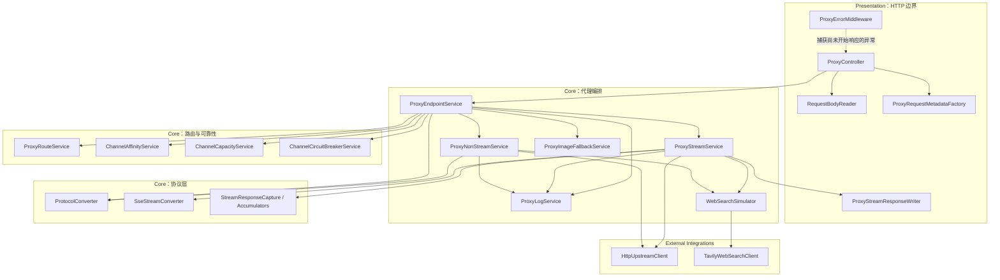
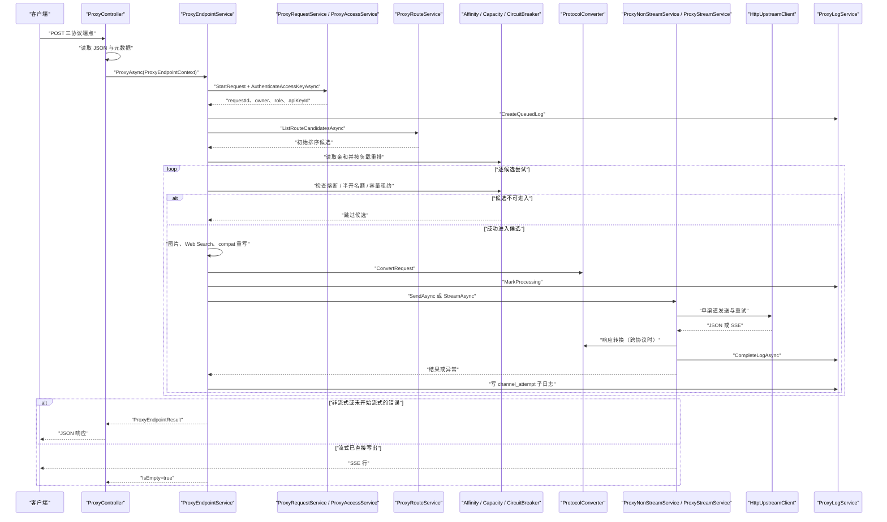
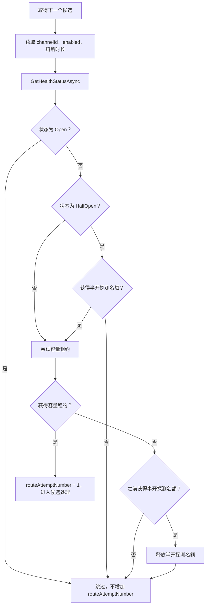
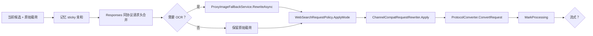
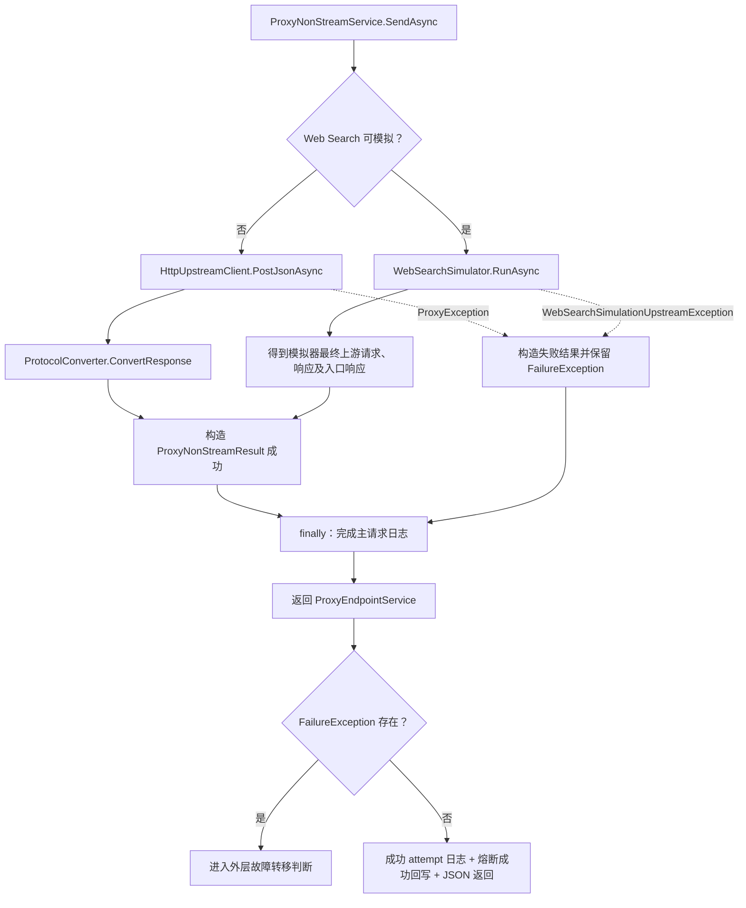
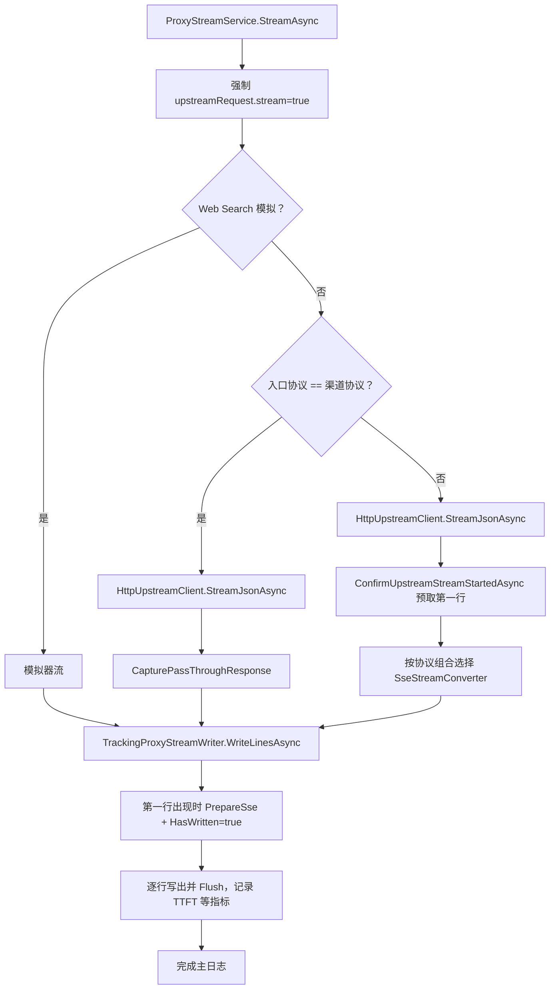
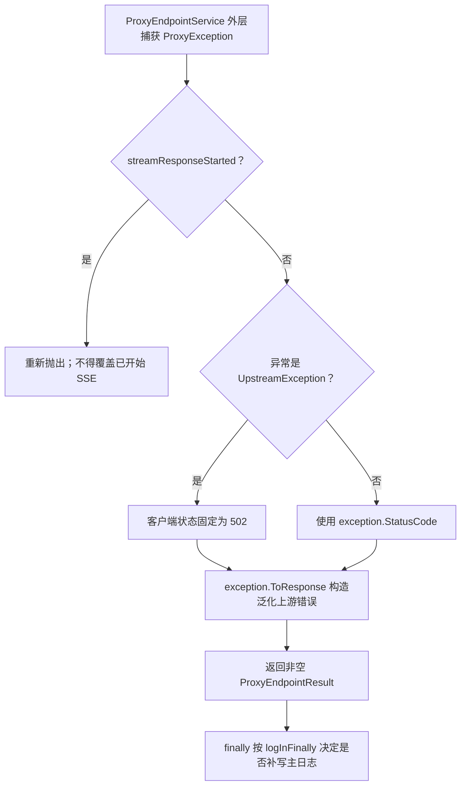

# 代理转换架构与端到端流程

> 基准提交：`5851939ad08db9465a226cc18489756ff8cd6941`
> 本文从运行时编排角度说明一次请求如何穿过控制器、认证、路由、兼容处理、协议转换、上游、响应转换、日志和错误边界。

## 1. 适用范围

本文覆盖 `ProxyController` 暴露的 Responses、Chat Completions 与 Messages 三类代理请求，重点是**模块间调用顺序与所有关键判断点**。字段级转换、工具状态机和各 SSE 事件细节在后续专题文档展开。

本文不展开独立 `/images/generations` 与 `/images/edits` 的完整实现，但会标出主链路内由图片输入触发的 OCR 辅助路径。

## 2. 源码入口与分层

### 2.1 分层视图

| 层 | 主要路径 | 关键类型 | 核心责任 |
|---|---|---|---|
| Presentation | `opencodex_proxy/src/Presentation/OpenCodex.Api` | `ProxyController`、`RequestBodyReader`、`ProxyStreamResponseWriter`、`ProxyErrorMiddleware` | HTTP 路由、输入解析、元数据采集、响应写出、末端异常处理 |
| Core 编排 | `opencodex_proxy/src/Libraries/OpenCodex.Core/Services/Proxy` | `ProxyEndpointService`、`ProxyNonStreamService`、`ProxyStreamService` | 一次代理请求的业务编排、分支执行和日志生命周期 |
| Core 协议 | `opencodex_proxy/src/Libraries/OpenCodex.Core/Protocols` | `ProtocolConverter`、`SseStreamConverter`、各响应累积器 | 请求/响应规范化、跨协议映射、流式状态机 |
| Core 路由可靠性 | `opencodex_proxy/src/Libraries/OpenCodex.Core/Services/Proxy` | `ProxyRouteService`、`ChannelAffinityService`、`ChannelCapacityService`、`ChannelCircuitBreakerService` | 候选发现、排序、容量、熔断、亲和 |
| External Integrations | `opencodex_proxy/src/Libraries/OpenCodex.Core/ExternalIntegrations` | `HttpUpstreamClient`、`TavilyWebSearchClient` | HTTP 请求构造、同渠道重试、上游 JSON/SSE 与搜索服务调用 |
| CoreBase 契约 | `opencodex_proxy/src/Libraries/OpenCodex.CoreBase` | `ProxyEndpointContext`、`ProxyRouteDto`、`ProxyStreamContext` 等 | 跨层稳定 DTO、接口和运行时上下文 |
| Domain/Data | `opencodex_proxy/src/Libraries/OpenCodex.Domain`、`OpenCodex.Data` | `Channel`、`AccessApiKey`、`RequestLog` 等 | 渠道、用户、密钥、模型、日志持久化 |

### 2.2 组件关系图

## 3. 端到端输入与输出

### 3.1 入口输入

控制器将以下内容封装为 `ProxyEndpointContext`：

- 固定的入口协议标识；
- 解析后的 JSON 对象或 `null`；
- 原始 Authorization 头；
- 请求方法、路径、客户端 IP 与脱敏请求头；
- 绑定当前 `HttpResponse` 的流式写入器；
- `HttpContext.RequestAborted` 取消令牌。

### 3.2 编排中间结果

主编排器在请求级别维护以下状态：

| 状态 | 初始值 | 后续来源 | 作用 |
|---|---|---|---|
| `requestId` | `StartRequest` 生成 12 字节随机十六进制字符串 | 不变 | 串联主请求及子日志 |
| `ownerUsername` | 运行时配置的管理员用户名 | 认证后替换为访问密钥所有者 | owner 数据隔离、缓存键、路由、亲和、容量、熔断 |
| `defaultTimeout` | 运行时设置 | 不变 | 渠道未配置有效超时时的回退 |
| `requestModel` | `payload["model"]` 的字符串读取 | 不变 | 路由匹配与客户端可见模型 |
| `upstreamModel` | 当前候选 `ProxyRouteDto.UpstreamModel` | 候选切换时更新 | 写入上游请求 |
| `effectivePayload` | 初始指向原始载荷 | OCR、Web Search、compat 后替换 | 当前候选真正参与协议转换的载荷 |
| `upstreamRequest` | `null` | `ProtocolConverter.ConvertRequest` | 当前候选发送给上游的对象 |
| `streamResponseStarted` | `false` | 从 `TrackingProxyStreamWriter.HasWritten` 读取 | 决定流式错误还能否结构化返回/故障转移 |

### 3.3 下游输出

- 非流式：`ProxyNonStreamService` 返回状态和对象，控制器交给 MVC JSON 序列化。
- 流式：`ProxyStreamService` 通过 `IProxyStreamWriter` 直接写 `text/event-stream`；编排器返回空结果。
- 结构化代理错误：使用 `ProxyException.ToResponse()` 的 `{error:{message,type}}` 结构。
- 上游错误：对客户端固定转为 502，消息为 `An upstream error occurred. Please try again later.`。

## 4. 顶层主流程

## 5. `ProxyEndpointService.ProxyAsync` 的精确判断顺序

以下顺序是主链路的稳定语义。改变顺序可能改变路由、日志或错误可见性。

### 5.1 请求初始化与认证

1. 记录整体开始时间 `started`。
2. 调用 `ProxyRequestService.StartRequest`：
   - 使用 `RandomNumberGenerator.GetHexString(12).ToLowerInvariant()` 生成请求 ID；
   - 从运行时设置读取默认管理员用户名和默认上游超时。
3. 调用 `AuthenticateAccessKeyAsync` 验证 Bearer Key。
4. 认证成功后，用密钥所有者用户名、角色和 API Key ID 覆盖初始默认值。
5. 检查 `context.Payload`：为 `null` 时抛出 400。

认证发生在载荷合法性检查之前。因此没有合法访问密钥的请求不会先得到请求体格式错误。

### 5.2 提取请求级信号

| 信号 | 提取规则 | 消费者 |
|---|---|---|
| `requestModel` | `JsonDictionaryValue.String(payload, "model")` | 路由、日志、客户端可见模型 |
| `requestContainsImages` | `ProxyImageRequestDetector.ContainsImageInput(payload, entryProtocol)` | 路由能力标记、OCR 降级 |
| `stickyKey` | 顶层 `prompt_cache_key` 字符串 | 渠道亲和 |
| `isStream` | 顶层 `stream` 的值运行时严格为 `true` | 流式/非流式分支、日志 |

### 5.3 创建排队日志

在查询路由前调用 `ProxyLogService.CreateQueuedLog`，写入：

- request ID、owner、API Key ID；
- 原始请求载荷和请求模型；
- 流式标记；
- 方法、路径、IP 和已脱敏请求头。

因此，即使后续没有任何可用渠道，主请求也已有 queued 日志可完成。

### 5.4 获取并重排候选

1. `ProxyRouteService.ListRouteCandidatesAsync` 先按模型映射产生候选，并按渠道 `priority`、`position`、ID 排序。
2. 若有 `stickyKey`，从 `ChannelAffinityService` 读取首选渠道 ID。
3. `OrderCandidatesAsync` 为每个候选计算：
   - 是否为亲和渠道；
   - `priority`；
   - 当前进程视角的活跃请求数；
   - 原候选索引。
4. 最终顺序：亲和命中优先 → priority 升序 → 活跃请求数升序 → 原候选索引升序。

注意：亲和优先级高于配置 priority；但亲和渠道稍后仍必须通过熔断与容量检查。

### 5.5 每个候选的准入流程

只有成功获得容量租约的候选才算一次 `route_attempt`。熔断打开、半开名额已占用或容量满的候选不会产生渠道尝试子日志。

### 5.6 候选内的请求处理顺序

成功获得租约后，顺序固定如下：

1. 若 `stickyKey` 非空，立即记住当前候选渠道；
2. 读取渠道类型、渠道 ID、上游模型；
3. 仅在 Responses→Responses 时合并允许透传的 Codex 请求头；
4. `effectivePayload = payload`；
5. 若含图片、当前映射模型不支持图片且命中显式模型映射，执行 OCR 降级；
6. 调用 `WebSearchRequestPolicy.ApplyMode` 应用全局 Web Search 模式；
7. 从渠道读取 `compat` 对象；
8. 调用 `ChannelCompatRequestRewriter.Apply`；
9. 调用 `ProtocolConverter.ConvertRequest`，同时把模型替换为当前候选的 `UpstreamModel`；
10. 调用 `ProxyLogService.MarkProcessing`；
11. 根据 `isStream` 进入对应执行服务。

这里“记忆亲和”发生在上游调用成功之前。如果该候选随后失败，下一次同一 sticky key 仍可能优先命中该渠道；熔断与容量检查会继续提供保护。

## 6. 非流式执行分支

### 6.1 主流程

`ProxyNonStreamService.SendAsync` 执行以下逻辑：

1. 从原始 Responses 请求提取 JSON Schema 文本格式信息；
2. 特定 Responses→Chat/Messages 场景构建工具调用映射，用于把响应中的代理工具名还原；
3. 判断 Web Search 是否应由本地模拟器执行；
4. 若模拟：`WebSearchSimulator.RunAsync` 可能执行多轮“模型工具调用 → Tavily → 延续请求”；
5. 若不模拟：`HttpUpstreamClient.PostJsonAsync` 发起上游调用；
6. 使用 `ProtocolConverter.ConvertResponse` 生成入口协议响应；
7. 在 `finally` 中完成主日志；
8. 将成功结果或捕获到的 `ProxyException` 包装成 `ProxyNonStreamResult` 返回编排器。

### 6.2 编排器如何处理结果

`ProxyEndpointService` 检查 `ProxyNonStreamResult.FailureException`：

- 非空：重新抛出，让外层候选 catch 统一做熔断、attempt 日志与故障转移判断；
- 为空：写成功 attempt 日志、调用 `RecordSuccessAsync` 清除熔断状态、返回非流式结果。

### 6.3 非流式流程图

## 7. 流式执行分支

### 7.1 流式准入

编排器在调用 `ProxyStreamService` 前先调用 `ProtocolConverter.SupportsStreamingConversion`。同协议始终支持；当前三协议之间六个跨协议方向全部显式登记。未登记方向抛出 400，不会调用上游。

### 7.2 三条流式路径

`ProxyStreamService.StreamAsync` 首先强制 `upstreamRequest["stream"] = true`，随后选择：

| 分支 | 条件 | 上游/下游处理 |
|---|---|---|
| Web Search 模拟 | `IWebSearchSimulator.CanSimulate(...)` | 模拟器产生入口协议可写出的流，并维护最终请求/响应/细节 |
| 同协议透传 | `EntryProtocol == ChannelType` | 原 SSE 行写出；`StreamResponseCapture` 同时累积结构化日志响应 |
| 跨协议转换 | 其余已支持组合 | 先确认上游流可读取第一行，再交给对应 `SseStreamConverter` |

### 7.3 为什么延迟准备 SSE

编排器把原始写入器包装为 `TrackingProxyStreamWriter`。该包装器只有在异步行序列真正产出第一行时才调用 `PrepareSse` 并设置 `HasWritten=true`。这形成关键事务边界：

- 上游连接、HTTP 状态、首个可重试 SSE error 或转换器初始化在第一行前失败：仍可切换渠道或返回 JSON 错误；
- 第一行已经交给下游：HTTP 响应已经开始，不能重新路由。

对于跨协议路径，`ConfirmUpstreamStreamStartedAsync` 会先对上游序列执行一次 `MoveNextAsync`，再返回“首行 + 后续行”的重放序列。这让发生在上游序列启动阶段的异常在进入下游写循环前暴露。

### 7.4 流式细节图

### 7.5 流式成功后的编排回收

`StreamAsync` 正常结束后：

1. 写成功渠道尝试日志；
2. 调用熔断器 `RecordSuccessAsync`；
3. 读取 `trackingWriter.HasWritten`；
4. 返回 `ProxyEndpointResult(200, null, true)`。

即使上游成功但流为空，`HasWritten` 可能仍为 `false`；不过正常返回仍是空结果，因为流式服务已经完成其生命周期。

## 8. 故障、熔断与日志的交互

### 8.1 `ProxyException` 分支

候选处理抛出 `ProxyException` 时，外层按以下顺序处理：

1. `ChannelCircuitBreakerService.RecordFailureAsync`；
2. 如果是半开探测且该异常不计入熔断，释放探测名额；
3. 提取 `UpstreamException.Body` 作为日志用上游错误体；
4. 计算流式是否已经写出；
5. 计算是否满足 `ProxyFailoverPolicy.CanFailover`；
6. 写失败渠道尝试子日志；
7. 可转移则保存为 `lastFailoverException` 并继续下一个候选，否则向外抛出。

### 8.2 非 `ProxyException` 分支

- 若已占半开探测名额，先释放；
- 非 `OperationCanceledException` 会写一条 500、不可转移的 attempt 日志；
- 然后原样抛出；
- 客户端响应尚未开始时由 `ProxyErrorMiddleware` 转成通用 500 API 错误；已开始时继续向服务器管线抛出。

### 8.3 候选耗尽

| 状态 | 最终行为 |
|---|---|
| 至少一次失败满足故障转移 | 抛出最后一个 `lastFailoverException` |
| 所有候选都因 Open、半开名额或容量跳过 | 抛出 429 `RoutingException`，消息为所有启用渠道处于容量限制的概括描述 |
| 路由服务在候选生成前已失败 | 直接返回相应 `RoutingException`，通常为 400 |

### 8.4 最外层结构化错误

`logInFinally` 的职责是防止重复完成主日志：

- 在进入 `ProxyNonStreamService` 或 `ProxyStreamService` 前被设为 `false`，主日志由对应服务完成；
- 在认证、请求体检查、候选生成或候选处理服务之前失败时仍为 `true`，由端点编排器补写/完成日志。

## 9. Responses 同协议请求头分支

只有 `entryProtocol=responses` 且 `channelType=responses` 时，`ApplyResponsesPassthroughHeaders` 才会把允许的客户端头合并进当前候选渠道副本：

- `User-Agent`
- `x-oai-attestation`
- `x-codex-turn-metadata`
- `x-codex-window-id`
- `x-client-request-id`
- `originator`
- `session-id`
- `thread-id`
- `x-codex-beta-features`

判断规则：

1. 请求中存在允许头则取请求值；
2. `User-Agent` 若不包含 `Codex Desktop`，改用内置 Codex Desktop 默认值；
3. 缺失头可使用内置默认值；
4. 渠道配置已有同名头时不覆盖；
5. 比较头名时忽略大小写；
6. `Authorization` 不在集合中。

该操作对 `ProxyRouteDto.Channel` 做深拷贝，不直接修改缓存返回的渠道配置。

## 10. 数据所有权与生命周期

### 10.1 请求对象的复制策略

- `RequestBodyReader` 创建首个松类型对象树；
- 同协议 `ConvertRequest` 深拷贝后替换模型，避免直接污染原载荷；
- Web Search 模式和兼容重写返回新对象；
- Responses 请求头合并复制渠道对象；
- `ChannelCapacityLease` 使用 `using` 包围单个候选全过程，正常返回、代理异常和一般异常都会释放。

### 10.2 作用域

| 服务 | DI 生命周期 | 影响 |
|---|---|---|
| `ProxyEndpointService`、路由/日志/流式/非流式服务 | Scoped | 每个 HTTP 请求独立编排状态 |
| `ChannelAffinityService` | Singleton | 进程内亲和状态跨请求共享；Redis 可跨实例 |
| `ChannelCapacityService` | Singleton | 进程内活跃计数跨请求共享；Redis 提供全局硬限流 |
| `ChannelCircuitBreakerService` | Singleton | 进程内熔断状态跨请求共享；Redis 可跨实例 |
| `TwoLevelCacheService` | Singleton | 路由、认证等缓存跨请求共享 |

## 11. 决策表

### 11.1 执行分支选择

| `stream` | Web Search 模拟 | 入口=渠道 | 执行路径 |
|---|---|---|---|
| false | false | 任意 | `PostJsonAsync`；必要时非流式响应转换 |
| false | true | 通常为 Responses→Chat/Messages | `WebSearchSimulator.RunAsync` |
| true | true | 由模拟器能力判断 | `RunChatStreamAsync` 产生下游流 |
| true | false | true | SSE 同协议透传 + `StreamResponseCapture` |
| true | false | false | 对应 `SseStreamConverter` 跨协议状态机 |

### 11.2 候选结束状态

| 结果 | attempt 日志 | 熔断动作 | 容量租约 | 是否继续下一候选 |
|---|---|---|---|---|
| 成功 | success | `RecordSuccessAsync` | 释放 | 否，直接返回 |
| 可转移 ProxyException | failed，`failover_eligible=true` | 视状态计失败 | 释放 | 是 |
| 不可转移 ProxyException | failed，`failover_eligible=false` | 视状态计失败 | 释放 | 否，抛出 |
| 一般异常 | 非取消时写 500 failed | 不计失败，半开名额释放 | 释放 | 否 |
| 熔断/容量准入失败 | 不写 | 无成功/失败回写；必要时释放探测名额 | 未获得或立即无租约 | 是 |

## 12. 边界与错误

1. `ProxyController` 的 `/responses` 与 `/v1/responses` 等别名执行完全相同逻辑；但 `ProxyErrorMiddleware` 只把 `/v1` 开头识别为代理兼容端点。主代理 `ProxyException` 大多在 `ProxyEndpointService` 内已转为结果，此差异主要影响越过端点服务的异常。
2. 请求体 JSON 解析失败与根节点非对象都会折叠为同一个 `null`，端点服务无法区分两者。
3. 渠道兼容重写是**按候选执行**的。故障转移到另一个渠道时会重新从原始载荷开始应用该渠道的 OCR/模式/compat/协议转换，不能复用前一候选的上游请求。
4. OCR 降级发生在容量租约获得之后，因此 OCR 花费包含在主候选容量占用时间中。
5. 主请求的图片 OCR 子调用本身走 `IUpstreamClient.PostJsonAsync`，但不走主请求的候选故障转移循环；视觉路由选择逻辑独立。
6. `TrackingProxyStreamWriter.HasWritten` 表示至少枚举并向内层写入器交付了一行，不只是响应头被准备。其 `IsPrepared` 单独表示 SSE 头已设置。
7. 客户端取消不是故障转移信号。连接取消令牌会终止延迟、上游调用和写出。
8. 成功的同协议响应仍会将 `model` 恢复为对外模型；“透传”不代表逐字节不变。

## 13. 测试锚点

| 测试文件/方法 | 对应架构判断 |
|---|---|
| `ProxyEndpointServiceTests.ProxyAsync_SamePriorityPrefersLessBusyChannel` | 最终候选排序中的活跃请求数 |
| `ProxyEndpointServiceTests.ProxyAsync_StickyKeyRoutesToPreviouslyRememberedChannel` | 亲和渠道优先 |
| `ProxyEndpointServiceTests.ProxyAsync_StickyPreferredChannelAtCapacity_FallsBackToOtherChannel` | 亲和不绕过容量 |
| `ProxyEndpointServiceTests.ProxyAsync_NonStreamRetryableFailure_FailsOverToNextChannel` | 非流式候选故障转移 |
| `ProxyEndpointServiceTests.ProxyAsync_StreamRetryableFailureBeforeFirstByte_FailsOverToNextChannel` | 流式首字节前切换 |
| `ProxyEndpointServiceTests.ProxyAsync_StreamRetryableFailureAfterFirstByte_DoesNotFailover` | 流式响应开始后不可切换 |
| `ProxyEndpointServiceTests.ProxyAsync_StreamFailoverSuccess_PrepareSseOnlyCalledAfterFailoverSucceeds` | SSE 延迟准备 |
| `ProxyEndpointServiceTests.ProxyAsync_ResponsesPassthrough_CopiesCodexHeadersToUpstreamChannel` | Responses 同协议允许头合并 |
| `ProxyEndpointServiceTests.ProxyAsync_ResponsesToChat_DoesNotCopyCodexHeaders` | 跨协议不执行允许头分支 |
| `ProxyStreamServiceTests.StreamAsync_UpstreamFailure_DoesNotPrepareSseBeforeUpstreamReturns` | 上游失败前不开始下游响应 |
| `ProxyStreamServiceTests.StreamAsync_PassThroughSuccess_PrepareSseDeferredUntilFirstLine` | 同协议流也延迟到首行 |
| `ProxyStreamServiceTests.StreamAsync_ConvertedChat_CapturesUpstreamAndDownstreamDeltas` | 跨协议同时记录上游/下游事件 |
| `UpstreamStreamErrorRetryTests.StreamJsonAsync_RateLimitError_RetriesAndSucceedsOnSecondAttempt` | SSE 首事件探测发生在下游写出之前 |

## 14. 后续阅读

- [协议支持矩阵](../02-foundation/01-protocol-support-matrix.md)
- [规范化数据模型](../02-foundation/02-canonical-data-model.md)
- [入口认证与请求状态](../02-foundation/03-entry-auth-and-request-state.md)
- [路由选择与模型映射](../03-routing/01-route-selection-and-model-mapping.md)
- [亲和、容量与熔断](../03-routing/02-affinity-capacity-and-circuit-breaker.md)
- [故障转移、重试与超时](../03-routing/03-failover-retry-and-timeout.md)
- [请求转换主流程](../04-request-conversion/01-request-conversion-main-flow.md)
- [流式管线与 SSE 解析](../07-streaming/01-stream-pipeline-and-sse-parsing.md)
- [错误、日志与诊断](../09-reference/01-errors-logging-and-diagnostics.md)
