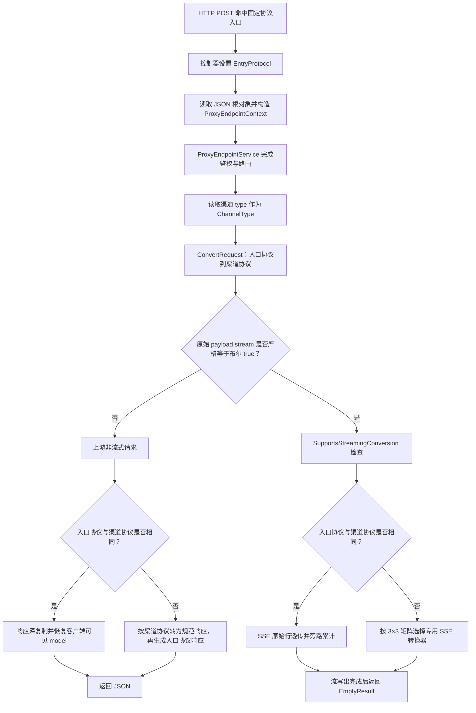
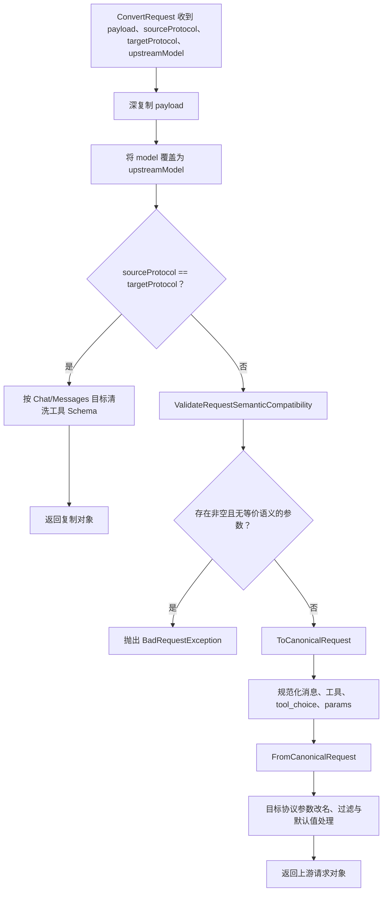

# 协议支持矩阵

> 基线：当前文档依据仓库 HEAD `5851939ad08db9465a226cc18489756ff8cd6941` 整理。本文中的“支持”表示当前代码存在明确的请求、响应或流式派发路径；不表示任意字段、任意工具形态都能无损互转。条件性限制见“语义兼容性判断”和“工具/MCP 限制”。

## 1. 适用范围

本文回答以下基础问题：

1. 客户端可以从哪些 HTTP 入口提交请求；
2. 入口协议如何确定；
3. 一个入口协议可以被路由到哪些上游协议；
4. 请求、非流式响应、流式响应分别走哪条转换路径；
5. 哪些组合虽然“有转换器”，仍会因语义不可等价而被拒绝；
6. `images` 渠道为什么不属于本矩阵。

本文只覆盖文本与多模态消息代理主链路中的三种协议：

| 文档名 | 代码常量 | 语义 |
|---|---|---|
| Responses | `ProtocolConverter.Responses` | OpenAI Responses 风格，值为 `responses` |
| Chat Completions | `ProtocolConverter.Chat` | OpenAI Chat Completions 风格，值为 `chat` |
| Anthropic Messages | `ProtocolConverter.Messages` | Anthropic Messages 风格，值为 `messages` |

图片生成与图片编辑由 `ImagesController` 及独立的图片代理服务处理。虽然渠道配置允许 `type = "images"`，但 `ProtocolConverter` 的文本协议转换分派不包含 `images`。

## 2. 术语与矩阵阅读方式

### 2.1 两个方向不要混淆

本文所有矩阵均采用：

- **行：入口协议/客户端可见协议**，即 `ProxyEndpointContext.EntryProtocol`；
- **列：渠道协议/上游实际协议**，即路由渠道中的 `channel["type"]`；
- **单元格方向：入口协议 → 渠道协议**。

请求沿“行到列”发送；响应沿“列到行”返回。

例如，矩阵中的 `Responses → Chat` 表示：

1. 客户端提交 Responses 请求；
2. 路由选择 Chat 渠道；
3. 请求执行 Responses 到 Chat 转换；
4. Chat 上游响应再转换回 Responses；
5. 客户端始终看到 Responses 形态。

### 2.2 `ConvertResponse` 参数名容易误读

`ProxyNonStreamService.SendAsync` 调用：

```csharp
ProtocolConverter.ConvertResponse(
    upstreamResponse,
    context.EntryProtocol,
    context.ChannelType,
    context.Route.OriginalModel,
    textFormat,
    toolCallMappings);
```

这里：

- `sourceProtocol` 参数实际传入的是**客户端入口协议**；
- `targetProtocol` 参数实际传入的是**上游渠道协议**；
- 方法内部先按 `targetProtocol` 解析上游响应，再按 `sourceProtocol` 生成客户端响应。

因此，分析响应方向时应以“上游渠道 → 客户端入口”理解，而不是只按形参名理解。

## 3. 源码入口

### 3.1 HTTP 入口

主要入口位于：

- `opencodex_proxy/src/Presentation/OpenCodex.Api/Controllers/ProxyController.cs`
  - `Responses`
  - `ChatCompletions`
  - `Messages`
  - 私有方法 `Proxy`
- `opencodex_proxy/src/Presentation/OpenCodex.Api/Infrastructure/RequestBodyReader.cs`
  - `ReadJsonObjectAsync`
- `opencodex_proxy/src/Libraries/OpenCodex.Core/Services/Proxy/ProxyEndpointService.cs`
  - `ProxyAsync`

### 3.2 协议转换入口

- `opencodex_proxy/src/Libraries/OpenCodex.Core/Protocols/ProtocolConverter.cs`
  - `ConvertRequest`
  - `ConvertResponse`
  - `SupportsStreamingConversion`
- `opencodex_proxy/src/Libraries/OpenCodex.Core/Protocols/ProtocolConverter.Requests.cs`
  - `ToCanonicalRequest`
  - `FromCanonicalRequest`
- `opencodex_proxy/src/Libraries/OpenCodex.Core/Protocols/ProtocolConverter.Responses.cs`
  - `ToCanonicalResponse`
  - `FromCanonicalResponse`
- `opencodex_proxy/src/Libraries/OpenCodex.Core/Services/Proxy/ProxyStreamService.cs`
  - `StreamAsync`
- `opencodex_proxy/src/Libraries/OpenCodex.Core/Protocols/SseStreamConverter.*.cs`
  - 六个跨协议流式转换器

### 3.3 语义拦截入口

- `opencodex_proxy/src/Libraries/OpenCodex.Core/Protocols/ProtocolConverter.RequestValidation.cs`
  - `ValidateRequestSemanticCompatibility`
  - `UnsupportedSemanticParameters`
- `opencodex_proxy/src/Libraries/OpenCodex.Core/Protocols/ProtocolConverter.Mcp.cs`
  - `EnsureRemoteMcpToolsConvertible`
  - MCP 方言互转辅助方法
- `opencodex_proxy/src/Libraries/OpenCodex.Core/Protocols/ProtocolConverter.Requests.cs`
  - `CanonicalToChatRequest`
  - `CanonicalToMessagesRequest`
- `opencodex_proxy/src/Libraries/OpenCodex.Core/Protocols/ProtocolConverter.Responses.cs`
  - `CanonicalToChatResponse`

## 4. HTTP 路径与入口协议

入口协议不是根据请求体中的字段猜测，而是由控制器动作固定传入。

| HTTP 方法 | 路径 | 固定入口协议 | 控制器动作 |
|---|---|---|---|
| POST | `/responses` | `responses` | `ProxyController.Responses` |
| POST | `/v1/responses` | `responses` | `ProxyController.Responses` |
| POST | `/chat/completions` | `chat` | `ProxyController.ChatCompletions` |
| POST | `/v1/chat/completions` | `chat` | `ProxyController.ChatCompletions` |
| POST | `/messages` | `messages` | `ProxyController.Messages` |
| POST | `/v1/messages` | `messages` | `ProxyController.Messages` |

相邻但不进入协议转换矩阵的接口：

| HTTP 方法 | 路径 | 用途 |
|---|---|---|
| GET | `/models`、`/v1/models` | 鉴权后列出当前用户可路由模型 |
| POST | `/images/generations`、`/v1/images/generations` | 独立图片生成链路 |
| POST | `/images/edits`、`/v1/images/edits` | 独立图片编辑链路 |

## 5. 输入与输出

### 5.1 主链路输入

`ProxyEndpointContext` 承载：

| 字段 | 来源 | 用途 |
|---|---|---|
| `EntryProtocol` | 控制器动作固定值 | 决定客户端协议 |
| `Payload` | `RequestBodyReader.ReadJsonObjectAsync` | 弱类型 JSON 请求对象 |
| `AuthorizationHeader` | 原始 `Authorization` 请求头 | Bearer API Key 鉴权 |
| `RequestMetadata` | `ProxyRequestMetadataFactory.FromHttpRequest` | 方法、路径、IP、脱敏头 |
| `StreamWriter` | `ProxyStreamResponseWriter` | 流式响应写出 |
| `CancellationToken` | `HttpContext.RequestAborted` | 客户端取消传播 |

### 5.2 协议转换输入

请求转换：

```text
入口 payload
+ entryProtocol
+ channelType
+ upstreamModel
+ channelCompat
```

非流式响应转换：

```text
上游 response
+ entryProtocol
+ channelType
+ originalModel
+ textFormat
+ toolCallMappings
```

流式响应转换：

```text
上游 SSE 行
+ entryProtocol
+ channelType
+ 客户端可见模型
+ 流式累计状态
```

### 5.3 输出

| 分支 | 输出 |
|---|---|
| 非流式成功 | `ProxyEndpointResult(StatusCode, Payload, IsEmpty: false)` |
| 流式成功 | SSE 已由 `StreamWriter` 写出，返回 `ProxyEndpointResult(200, null, IsEmpty: true)` |
| 响应尚未开始时的代理错误 | JSON 错误对象 |
| 流式响应已经开始后的错误 | 不再改写为普通 JSON；异常继续向外传播 |

## 6. 请求转换支持矩阵

### 6.1 结构性支持

| 入口协议 \ 渠道协议 | Responses | Chat | Messages |
|---|---|---|---|
| **Responses** | 支持：同协议复制 | 支持：经规范模型转换 | 支持：经规范模型转换 |
| **Chat** | 支持：经规范模型转换 | 支持：同协议复制 | 支持：经规范模型转换 |
| **Messages** | 支持：经规范模型转换 | 支持：经规范模型转换 | 支持：同协议复制 |

“经规范模型转换”指：

```text
ValidateRequestSemanticCompatibility
→ ToCanonicalRequest
→ FromCanonicalRequest
```

“同协议复制”指：

```text
DeepCopy(payload)
→ model 替换为 upstreamModel
→ Chat/Messages 工具 Schema 清洗
```

同协议请求不会进入 `ValidateRequestSemanticCompatibility`，也不会进入请求参数白名单过滤。

### 6.2 同协议请求并非逐字节透传

即使入口协议和渠道协议相同，`ConvertRequest` 仍执行：

1. 深复制请求对象；
2. 将 `model` 强制设置为路由解析出的 `upstreamModel`；
3. 对 Chat 或 Messages 的工具 JSON Schema 做清洗；
4. Responses 同协议请求当前不做工具 Schema 清洗。

因此，“同协议”是结构透传，不是原始 HTTP body 的字节透传。

## 7. 非流式响应转换支持矩阵

### 7.1 结构性支持

| 客户端入口 \ 上游渠道 | Responses 上游 | Chat 上游 | Messages 上游 |
|---|---|---|---|
| **Responses 客户端** | 深复制并恢复可见模型 | `ChatResponseToCanonical` → `CanonicalToResponsesResponse` | `MessagesResponseToCanonical` → `CanonicalToResponsesResponse` |
| **Chat 客户端** | `ResponsesResponseToCanonical` → `CanonicalToChatResponse` | 深复制并恢复可见模型 | `MessagesResponseToCanonical` → `CanonicalToChatResponse` |
| **Messages 客户端** | `ResponsesResponseToCanonical` → `CanonicalToMessagesResponse` | `ChatResponseToCanonical` → `CanonicalToMessagesResponse` | 深复制并恢复可见模型 |

### 7.2 客户端可见模型

`ConvertResponse` 的 `originalModel` 来自 `ProxyRouteDto.OriginalModel`。当该值非空时：

- 同协议响应：直接覆盖响应中的 `model`；
- 跨协议响应：规范响应的 `model` 优先使用 `originalModel`。

因此，客户端通常看到请求模型/公共映射模型，而不是渠道真实的 `upstreamModel`。

### 7.3 结构化输出附加处理

当入口是 Responses，且原始请求包含：

```json
{
  "text": {
    "format": {
      "type": "json_schema"
    }
  }
}
```

如果上游是 Chat 或 Messages，非流式响应转换后还会执行 `ApplyJsonSchemaTextFormat`。纯文本可能被包装为 JSON 对象；已经是合法 JSON 对象或数组的文本保持原样。

这不是一个额外协议方向，而是 Responses 客户端兼容层。

## 8. 流式支持矩阵

### 8.1 总矩阵

当前 `ProtocolConverter.SupportsStreamingConversion` 对三种协议的 3×3 组合全部返回 `true`。

| 客户端入口 \ 上游渠道 | Responses 上游 | Chat 上游 | Messages 上游 |
|---|---|---|---|
| **Responses 客户端** | 原始 SSE 行透传并捕获 | `ChatToResponsesEvents` | `MessagesToResponsesEvents` |
| **Chat 客户端** | `ResponsesToChatEvents` | 原始 SSE 行透传并捕获 | `MessagesToChatEvents` |
| **Messages 客户端** | `ResponsesToMessagesEvents` | `ChatToMessagesEvents` | 原始 SSE 行透传并捕获 |

六个跨协议方向均在 `ProxyStreamService.StreamAsync` 的 `(EntryProtocol, ChannelType)` switch 中有明确分支。

### 8.2 同协议流式分支

当 `EntryProtocol == ChannelType`：

1. 调用 `IUpstreamClient.StreamJsonAsync`；
2. 不进入 `SseStreamConverter`；
3. 上游行通过 `CaptureLoggableStreamLines` 和 `CapturePassThroughResponse`；
4. 原始行写向客户端；
5. `StreamResponseCapture` 尝试重建用于日志、Usage 和计费的上游响应。

同协议流式“透传”仍有旁路捕获，但下游事件内容不做跨协议改写。

### 8.3 跨协议流式分支

跨协议流式转换不会直接复用非流式的请求/响应规范字典作为逐事件中间格式。它使用六个专用 SSE 状态机，并通过 `ConvertedStreamResult` 回填：

- `UpstreamResponse`：累计后的上游协议响应；
- `ToolCallMappings`：Responses 原生/自定义工具恢复映射；
- `TextFormat`：Responses `json_schema` 兼容信息。

流结束后，如已累计 `UpstreamResponse`，还会调用一次 `ProtocolConverter.ConvertResponse` 生成日志中的客户端响应载荷。

## 9. 主判断流程



## 10. 请求转换的复杂判断流程



## 11. 语义兼容性判断表

下表来自 `UnsupportedSemanticParameters`。字段只有在键存在且规范化后值非 `null` 时才触发拒绝；空字符串、`false`、空列表仍属于“非 null”，也会触发。

| 入口 → 渠道 | 明确拒绝的非空参数 | 原因类别 |
|---|---|---|
| Responses → Chat | `background`、`context_management`、`conversation`、`previous_response_id`、`prompt` | Chat 没有当前实现认可的等价状态/提示语义 |
| Responses → Messages | 上述五项 | `parallel_tool_calls`、`reasoning` 在转换时静默移除，Messages 目标无法保持对应语义 |
| Messages → Responses | `container`、`thinking` | 当前转换不把容器/原生 thinking 请求语义静默降级 |
| Messages → Chat | `container`、`thinking` | Chat 没有当前实现认可的等价语义 |
| Chat → Messages | `parallel_tool_calls`、`reasoning_effort` | 当前转换拒绝改变并行工具和推理强度语义 |
| Chat → Responses | 无预检拒绝项 | 仍受工具、字段白名单和具体内容转换约束 |
| 同协议 | 不执行该语义预检 | 由上游协议本身处理 |

错误消息格式：

```text
request parameter '<PARAM>' cannot be converted from <SOURCE> to <TARGET> without changing request semantics
```

### 11.1 参数过滤不是等价性证明

跨协议生成目标请求后，`FilterRequestParameters` 只保留目标协议白名单中的字段。由此应区分两类行为：

1. **明确拒绝**：上述状态/行为参数在转换前抛错；
2. **允许转换后过滤**：未被列入明确拒绝表、又不在目标白名单中的字段可能被删除。

因此矩阵中的“支持”不能理解为所有扩展字段均保留。

## 12. 工具与 MCP 条件限制

### 12.1 Native remote MCP 到 Chat

Chat Completions 没有当前实现认可的原生远程 MCP 定义。以下场景会明确拒绝，而不是伪装为普通 function：

- Responses 原生 MCP 工具定义转换到 Chat；
- Responses/Messages 原生 MCP 历史转换到 Chat；
- Responses/Messages 原生 MCP 响应转换到 Chat；
- Responses 流中出现无法由 Chat 表示的原生 MCP 生命周期。

典型错误会建议使用 Responses/Messages 上游，或显式代理侧 MCP bridge。

### 12.2 Responses 与 Messages 的 MCP 也有条件

Responses 与 Anthropic Messages 都支持原生 MCP 表达，但二者方言并不完全等价。例如：

- Anthropic 目标需要可用的 `server_url`；
- OpenAI 的 `connector_id`/`tunnel_id` 形态不能自动变成 Anthropic `mcp_servers` URL；
- 审批要求、禁用覆盖或复合 allowed-tools 约束若无等价表达，会被拒绝；
- 转换器不会为了“成功转换”而扩大工具授权范围。

### 12.3 传统命名空间 MCP 与 native MCP 不同

名称以 `mcp__` 表示的普通 function/命名空间工具仍可按传统函数工具扁平化转换；它不自动等同于 `native_type = "mcp"`、`mcp_kind = "remote"` 的远程 MCP 工具。

## 13. 决策表：一次请求最终走哪条路径

| 条件 | 结果 |
|---|---|
| 请求体不能解析为 JSON 对象 | 鉴权成功后返回 400 |
| 路由渠道类型为 `responses/chat/messages` | 进入本矩阵 |
| 路由渠道类型为 `images` 且走文本控制器 | 文本转换器没有该目标分支；属于配置/路由边界，不是受支持矩阵单元 |
| `stream` 不是布尔 `true` | 非流式处理，即使值是字符串 `"true"` |
| `stream` 是布尔 `true`，入口=渠道 | 同协议 SSE 透传 |
| `stream` 是布尔 `true`，入口≠渠道，且矩阵登记 | 专用 SSE 转换 |
| 跨协议请求含明确不等价参数 | 400，转换在发送上游前终止 |
| 转向 Chat 时含原生远程 MCP | 400，明确拒绝 |
| 非流式上游协议与入口协议不同 | 上游响应经规范响应模型返回入口形态 |
| 流式响应已经写出后发生错误 | 不再切换成普通 JSON 错误体 |

## 14. 边界与错误

### 14.1 未知协议标识

跨协议时：

- 未知源协议：`unsupported source protocol: ...`；
- 未知目标协议：`unsupported target protocol: ...`；
- 未知上游响应协议：`unsupported upstream protocol: ...`；
- 未知客户端响应协议：`unsupported response protocol: ...`。

正常 HTTP 入口只会产生三种已知入口协议；未知值通常来自内部调用、测试替身或错误渠道配置。

### 14.2 流式门禁与实际派发双重保护

`ProxyEndpointService.ProxyAsync` 在进入流服务前调用 `SupportsStreamingConversion`。`ProxyStreamService.StreamAsync` 的 switch 仍保留 default 分支：

```text
streaming conversion not implemented for <ENTRY> to <CHANNEL>
```

前者是能力门禁，后者是不可达分支保护。

### 14.3 同协议能力由上游承担

同协议请求不经过跨协议字段白名单，因此：

- 代理不会替上游验证所有协议字段；
- 上游可能接受、忽略或拒绝额外字段；
- 同协议流式事件也按原始上游语义返回。

### 14.4 “支持”不等于内容完全同构

三种协议在以下方面存在结构差异：

- system/developer 指令位置；
- 文本、图片、文件内容块；
- 工具调用及工具结果；
- Reasoning/thinking 与签名；
- refusal、annotations；
- finish/stop reason；
- usage 与缓存 token；
- native MCP；
- Responses 特有状态参数。

当前代码通过规范模型、专用流状态机、显式拒绝和字段过滤组合处理，而不是声明协议天然同构。

## 15. 测试锚点

以下测试直接覆盖矩阵及主要条件。引用以测试类型和方法名为准，不使用行号。

### 15.1 全方向与流式派发

文件：`opencodex_proxy/tests/OpenCodex.Api.Tests/SseStreamConverterTests.cs`

- `SupportsStreamingConversion_AllDirectionsAreSupported`
- `ChatToMessages_EmitsMessageStartBeforeContent`
- `MessagesToChat_TextDelta_EmitsRoleThenContentThenFinish`
- `ResponsesToChat_TextDelta_EmitsContentAndFinish`
- `ResponsesToMessages_TextDelta_EmitsMessageStartAndTextBlock`
- `Chat_EmitsResponseInProgressAfterCreated`
- `Messages_EmitsResponseInProgressAfterCreated`

补充文件：

- `opencodex_proxy/tests/OpenCodex.Api.Tests/ChatMessagesStreamingCompatibilityTests.cs`
- `opencodex_proxy/tests/OpenCodex.Api.Tests/InboundStreamingCompatibilityTests.cs`
- `opencodex_proxy/tests/OpenCodex.Api.Tests/ResponsesOutboundStreamingCompatibilityTests.cs`

### 15.2 请求结构与语义拒绝

文件：`opencodex_proxy/tests/OpenCodex.Api.Tests/ProtocolStructuralCompatibilityTests.cs`

- `ResponsesToChat_ConvertsSupportedParametersWithoutLeakingResponsesOnlyFields`
- `ResponsesToChat_StatefulParametersWithoutEquivalent_AreRejected`
- `ResponsesToMessages_ConvertsTextFormatToOutputConfig`
- `MessagesToResponses_ConvertsOutputConfigToTextFormat`
- `RequestParametersThatChangeStateOrModelBehavior_AreRejectedWhenNoEquivalentExists`
- `MessagesToChat_PreservesToolUseAndToolResultHistory`
- `MessagesToResponses_PreservesToolUseAndToolResultHistory`
- `ChatToResponses_ConvertsImageUrlToInputImage`
- `ChatToMessages_ConvertsImageUrlToAnthropicImageSource`
- `MessagesToChat_ConvertsImageSourceToImageUrl`
- `ResponsesStatus_IsMappedToTargetFinishReasons`

### 15.3 MCP 边界

文件：

- `opencodex_proxy/tests/OpenCodex.Api.Tests/NativeMcpProtocolTests.cs`
- `opencodex_proxy/tests/OpenCodex.Api.Tests/NativeMcpConfigurationTests.cs`
- `opencodex_proxy/tests/OpenCodex.Api.Tests/NativeMcpHistoryTests.cs`
- `opencodex_proxy/tests/OpenCodex.Api.Tests/NativeMcpResponseTests.cs`

关键方法：

- `ResponsesNativeMcpToChat_IsRejectedInsteadOfBecomingFakeFunction`
- `ResponsesNativeMcpToMessages_EmitsMcpToolsetWithoutFunctionWrapper`
- `NativeMcpHistory_ToChat_IsRejected`
- `ResponsesMcpCallToChat_IsExplicitlyRejected`
- `ResponsesAllowedTools_BecomeAnthropicToolsetConfigs`
- `ResponsesMcpApprovalRequirement_IsNotSilentlyDroppedForMessages`

### 15.4 端点编排

文件：`opencodex_proxy/tests/OpenCodex.Api.Tests/ProxyEndpointServiceTests.cs`

- `ProxyAsync_ResponsesPassthrough_CopiesCodexHeadersToUpstreamChannel`
- `ProxyAsync_ResponsesToChat_DoesNotCopyCodexHeaders`
- `ProxyAsync_StreamRetryableFailureBeforeFirstByte_FailsOverToNextChannel`
- `ProxyAsync_StreamRetryableFailureAfterFirstByte_DoesNotFailOver`

## 16. 当前测试边界

当前测试对六个跨协议流式方向和大量请求/响应结构有直接覆盖。以下基础行为主要由源码定义，未发现专门的端到端矩阵测试：

1. 三个无 `/v1` 前缀文本入口与对应 `/v1` 入口的完全等价性；
2. 文本入口误路由到 `images` 渠道时的最终错误形态；
3. 每一个目标参数白名单字段的逐字段保留测试；
4. 同协议 Responses 请求是否应增加与 Chat/Messages 对等的工具 Schema 清洗。

这些属于维护时应重点补充的契约测试，而不是本文对现有行为的额外假设。
