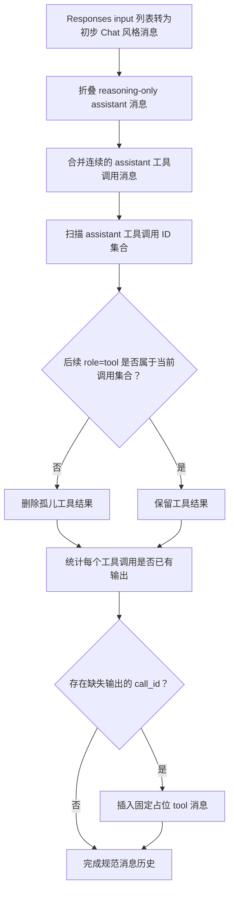
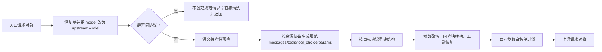
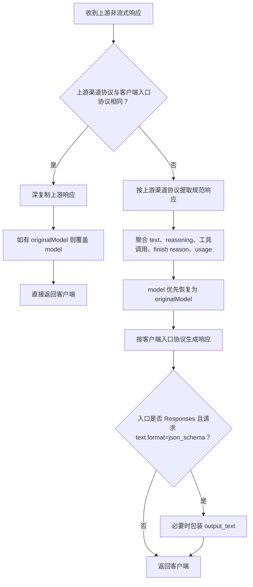
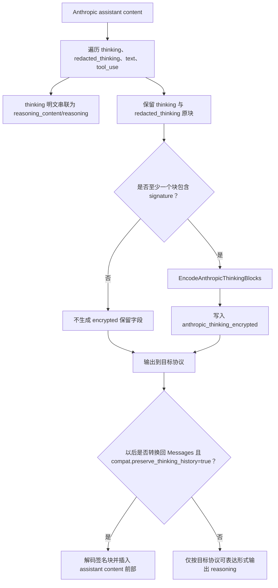

# 规范化中间数据模型

> 基线：当前文档依据仓库 HEAD `5851939ad08db9465a226cc18489756ff8cd6941` 整理。这里的“规范模型”是 `ProtocolConverter` 内部使用的弱类型 `Dictionary<string, object?>` 约定，不是一个公开 API DTO，也不是可独立版本化的持久化格式。

## 1. 适用范围

本文描述协议转换内部的三层数据形态：

1. HTTP JSON 被读取后的通用运行时值模型；
2. 跨协议请求使用的规范请求模型；
3. 跨协议非流式响应使用的规范响应模型。

本文同时明确两个容易产生误解的边界：

- **同协议请求/响应不会经过规范模型**，而是深复制后做少量改写；
- **跨协议流式事件不会逐事件经过本文的规范响应字典**，而是由专用 SSE 状态机转换；流结束后累计出的上游响应才可能再进入非流式响应转换，用于日志和计费。

## 2. 源码入口

### 2.1 JSON 运行时值

- `opencodex_proxy/src/Presentation/OpenCodex.Api/Infrastructure/RequestBodyReader.cs`
  - `ReadJsonObjectAsync`
  - `FromJsonElement`
  - `NumberValue`
- `opencodex_proxy/src/Libraries/OpenCodex.Core/Protocols/ProtocolConverter.Values.cs`
  - `NormalizeJsonValue`
  - `TryAsObject`
  - `TryAsList`
  - `DeepCopy`
  - `StringifyContent`
  - `ParseJsonObject`

### 2.2 规范请求

- `opencodex_proxy/src/Libraries/OpenCodex.Core/Protocols/ProtocolConverter.cs`
  - `ConvertRequest`
- `opencodex_proxy/src/Libraries/OpenCodex.Core/Protocols/ProtocolConverter.Requests.cs`
  - `ToCanonicalRequest`
  - `ResponsesRequestToCanonical`
  - `ChatRequestToCanonical`
  - `MessagesRequestToCanonical`
  - `FromCanonicalRequest`
  - 三个 `CanonicalTo...Request` 方法
- `opencodex_proxy/src/Libraries/OpenCodex.Core/Protocols/ProtocolConverter.ResponsesInput.cs`
  - `ResponsesInputItemToMessages`
  - `MessagesToResponsesInput`
- `opencodex_proxy/src/Libraries/OpenCodex.Core/Protocols/ProtocolConverter.ToolHistory.cs`
  - `NormalizeChatToolHistory`
- `opencodex_proxy/src/Libraries/OpenCodex.Core/Protocols/ProtocolConverter.Tools.cs`
  - 三种工具到规范工具、规范工具到三种协议的方法
- `opencodex_proxy/src/Libraries/OpenCodex.Core/Protocols/ProtocolConverter.Mcp.cs`
  - 原生远程 MCP 规范结构

### 2.3 规范响应

- `opencodex_proxy/src/Libraries/OpenCodex.Core/Protocols/ProtocolConverter.cs`
  - `ConvertResponse`
- `opencodex_proxy/src/Libraries/OpenCodex.Core/Protocols/ProtocolConverter.Responses.cs`
  - `ToCanonicalResponse`
  - 三个 `...ResponseToCanonical` 方法
  - `FromCanonicalResponse`
  - 三个 `CanonicalTo...Response` 方法
- `opencodex_proxy/src/Libraries/OpenCodex.Core/Protocols/ProtocolConverter.FinishReasons.cs`
- `opencodex_proxy/src/Libraries/OpenCodex.Core/Protocols/ProtocolConverter.Usage.cs`
- `opencodex_proxy/src/Libraries/OpenCodex.Core/Protocols/ProtocolConverter.Reasoning.cs`

## 3. 第一层：HTTP JSON 运行时值模型

### 3.1 根对象要求

`RequestBodyReader.ReadJsonObjectAsync` 只在 JSON 根节点是 object 时返回请求字典：

```text
JSON object → Dictionary<string, object?>
其他 JSON 根类型 → null
JSON 解析失败 → null
```

因此，数组、字符串、数字、布尔值和 `null` 即使是合法 JSON，也不构成代理请求对象。

### 3.2 JSON 类型映射

| JSON 类型 | .NET 运行时类型 | 规则 |
|---|---|---|
| object | `Dictionary<string, object?>` | 键比较器为 `StringComparer.Ordinal`，区分大小写 |
| array | `List<object?>` | 递归转换每一项 |
| string | `string?` | 使用 `JsonElement.GetString` |
| integer，Int32 范围内 | `int` | 先 `TryGetInt64`，再判断 Int32 范围 |
| integer，超出 Int32 但在 Int64 范围内 | `long` | 保留为 Int64 |
| 非 Int64 数字 | `double` | 使用 `GetDouble` |
| true/false | `bool` | 直接映射 |
| null/其他未覆盖 kind | `null` | 默认分支返回 null |

### 3.3 对转换器输入的兼容归一化

`ProtocolConverter.Values` 不只接受控制器产生的精确类型，还会处理测试或内部调用传入的：

- `JsonElement`；
- `JsonDocument`；
- `IDictionary<string, object?>`；
- 非泛型 `IDictionary`；
- `IList<object?>`；
- 非字符串、非字典的 `IEnumerable`。

最终目标仍是：

```text
对象 → Dictionary<string, object?>
列表 → List<object?>
标量 → 原标量或 JsonElement 归一化值
```

### 3.4 深复制语义

`DeepCopy`：

- 对象：递归创建新字典；
- 列表：递归创建新列表；
- 标量：直接返回值。

这保证转换器通常不修改调用方原始字典。但要注意：

- `ProxyEndpointService` 的 `payload`、`effectivePayload` 在某些步骤开始时可能引用同一对象；
- 是否创建新副本取决于后续重写器的实现；
- `ProtocolConverter.ConvertRequest` 自身会先深复制。

## 4. 规范模型不是公开类型

当前代码没有以下强类型：

```text
CanonicalRequest
CanonicalMessage
CanonicalTool
CanonicalResponse
CanonicalUsage
```

规范契约由一组私有方法和字符串键共同定义。维护时必须同时检查：

1. 生产端写入哪些键；
2. 消费端读取哪些键；
3. 哪些键只在特定协议来源出现；
4. 哪些键被目标协议忽略；
5. 哪些键只是为了往返恢复而保留。

不能仅凭某一个方法中的对象示例断言完整 Schema。

## 5. 规范请求顶层结构

跨协议请求在 `ToCanonicalRequest` 后近似为：

```json
{
  "model": "UPSTREAM_MODEL",
  "messages": [],
  "tools": [],
  "tool_choice": null,
  "params": {}
}
```

### 5.1 顶层字段

| 字段 | 运行时形态 | 来源 | 消费方式 |
|---|---|---|---|
| `model` | 通常为字符串 | `ConvertRequest` 已先替换为 `upstreamModel` | 目标请求的 `model` |
| `messages` | `List<object?>` | 三种来源协议各自规范化 | 生成 Responses `input/instructions`、Chat `messages`、Messages `messages/system` |
| `tools` | `List<object?>` | 三种工具方言规范化 | 生成目标协议工具定义 |
| `tool_choice` | 任意 JSON 值 | 原请求 `tool_choice` | 由 `ToolChoiceToResponses/Chat/Messages` 转换 |
| `params` | `Dictionary<string, object?>` | 除结构字段外的请求字段深复制 | 合并进目标请求，再做改名和白名单过滤 |

### 5.2 `model` 的真实主链路含义

在 `ConvertRequest` 中，进入规范化前先执行：

```csharp
converted["model"] = upstreamModel;
```

因此，正常代理主链路中的规范请求 `model` 不是客户端公共模型，而是路由解析后的上游模型。

客户端模型另由 `ProxyEndpointService` 的 `requestModel` 和 `ProxyRouteDto.OriginalModel` 保存，供日志和响应恢复使用。

## 6. 规范消息结构

规范消息以 Chat 风格为核心，但包含额外内部字段。常见变体如下。

### 6.1 普通消息

```json
{
  "role": "system | user | assistant",
  "content": "文本或内容块列表"
}
```

说明：

- Responses `developer` 角色会在输入规范化时转为 `system`；
- 规范模型也容许来自 Chat 的 `developer`，目标 Chat/Messages/Responses 输出时再做相应处理；
- Messages 顶层 `system` 被转换为第一条 system 消息；
- Responses 顶层 `instructions` 被转换为 system 消息。

### 6.2 带工具调用的 assistant 消息

```json
{
  "role": "assistant",
  "content": "",
  "tool_calls": [
    {
      "id": "CALL_ID",
      "type": "function",
      "function": {
        "name": "TOOL_NAME",
        "arguments": "{\"key\":\"value\"}"
      },
      "native_type": "mcp",
      "server_name": "SERVER"
    }
  ],
  "reasoning_content": "可选推理文本",
  "anthropic_thinking_encrypted": "可选签名 thinking 编码"
}
```

`native_type` 和 `server_name` 只在需要保留原生 MCP 等扩展语义时出现。普通函数调用没有这两个字段。

### 6.3 工具结果消息

```json
{
  "role": "tool",
  "tool_call_id": "CALL_ID",
  "content": "工具输出",
  "is_error": false,
  "native_type": "mcp"
}
```

说明：

- 普通工具结果通常只有 `role`、`tool_call_id`、`content`；
- Anthropic `mcp_tool_result` 会附加 `native_type = "mcp"`；
- `is_error` 仅在来源有该信息时保留。

### 6.4 内容字段的实际变体

规范消息的 `content` 不是单一字符串类型，可能是：

1. 字符串；
2. Chat 风格内容块列表；
3. 空字符串；
4. 经过 `StringifyContent` 压平的文本。

常见 Chat 风格块：

| `type` | 关键字段 | 含义 |
|---|---|---|
| `text` | `text` | 文本 |
| `image_url` | `image_url.url`、可选 `detail` | 图片 URL 或 data URL |
| `file` | `file.file_id/file_data/filename/file_url` | 文件 |
| 未识别块 | 原字段深复制 | 尽量延迟到目标转换处理 |

## 7. 三种请求来源如何进入规范消息

### 7.1 Responses → 规范消息

`ResponsesRequestToCanonical` 的顺序：

1. 读取 `instructions`，非空时生成 system 消息；
2. 读取 `input`：
   - 字符串：生成一条 user 消息；
   - 列表：逐项调用 `ResponsesInputItemToMessages`；
   - 其他类型：抛出 `responses input must be a string or list`；
3. 调用 `NormalizeChatToolHistory`；
4. 合并所有 system 消息为首条 system 消息；
5. 若 developer 输入或 instructions 中检测到 `<proposed_plan>`，追加 Plan Mode system 指令；
6. 规范化工具、tool choice、params。

Responses 输入项的重要分支：

| 输入项 | 规范结果 |
|---|---|
| 普通字符串 | user 文本消息 |
| `type = message` 或带 `role/content` | 普通规范消息 |
| `function_call`、`custom_tool_call` 等调用项 | assistant + `tool_calls` |
| `function_call_output` 等输出项 | role=tool 消息 |
| `mcp_call` | 原生 MCP assistant 调用；若已有 output/error，再追加 MCP 工具结果 |
| `reasoning` | assistant 的 `reasoning_content`，必要时保留 encrypted thinking |
| `web_search_call` | 有本地结果时变成工具调用/结果；否则可能压成 assistant 元数据文本 |
| 未知元数据型 item | 可能经 `ResponsesMetadataItemToText` 变为 assistant 文本，或被忽略 |

### 7.2 Chat → 规范消息

`ChatRequestToCanonical`：

1. 遍历 `messages`；
2. 只保留能识别为对象的元素；
3. 对每个消息执行深复制；
4. 不执行 Responses 专用的工具历史修复；
5. Chat 工具转换为规范工具；
6. 复制 `tool_choice` 和其他参数。

因此，Chat 来源的消息形态本身就是规范消息的基础方言。

### 7.3 Messages → 规范消息

`MessagesRequestToCanonical`：

1. 顶层 `system` 非空时生成 system 消息；
2. 遍历 `messages`；
3. 每条消息经 `AnthropicMessageToCanonicalMessages`；
4. 工具定义和 `mcp_servers` 联合转换为规范工具。

assistant 内容块判断：

| Anthropic 块 | 规范结果 |
|---|---|
| `text` | 进入规范 `content` |
| `tool_use` | 进入 assistant `tool_calls` |
| `mcp_tool_use` | 进入带 `native_type = mcp` 的 `tool_calls` |
| `thinking` | 文本并入 `reasoning_content`，原块用于签名保留 |
| `redacted_thinking` | 不形成明文 reasoning，但参与签名块保留 |

user 内容块判断：

- 普通内容先累计为 user 消息；
- 遇到 `tool_result` 或 `mcp_tool_result` 时先刷新普通内容；
- 工具结果拆成独立 role=tool 消息；
- 后续普通内容再形成下一条 user 消息。

一条 Anthropic user 消息因此可能拆成多条规范消息。

## 8. Responses 工具历史修复

`NormalizeChatToolHistory` 只在 Responses 请求进入规范模型时调用，顺序固定：

1. `FoldReasoningIntoToolCallMessages`；
2. `MergeConsecutiveAssistantToolCallMessages`；
3. `RemoveOrphanToolMessages`；
4. `EnsureToolCallsHaveOutputs`。

### 8.1 具体效果

| 步骤 | 判断 | 行为 |
|---|---|---|
| 推理折叠 | assistant 只有 reasoning、无内容、无工具调用 | 尝试合并到相邻 assistant 工具调用消息 |
| 连续调用合并 | 连续 assistant 消息均为空内容且含工具调用 | 合并为一条 assistant，拼接 `tool_calls` |
| 孤儿结果删除 | role=tool 的 `tool_call_id` 不属于当前有效 assistant 调用集 | 删除该工具结果 |
| 缺失结果补齐 | assistant 工具调用后没有对应 role=tool | 插入占位工具结果 |

缺失结果占位文本是：

```text
[tool output missing - no function_call_output was provided for this call_id]
```

这属于协议历史修复，不是上游真实工具输出。

### 8.2 细节流程图



## 9. 规范工具结构

### 9.1 普通函数工具

```json
{
  "name": "TOOL_NAME",
  "description": "说明",
  "parameters": {
    "type": "object"
  },
  "native_type": "function",
  "namespace": "可选命名空间"
}
```

来源差异：

- Responses function：直接映射 `name/description/parameters`；
- Chat function：从 `tool.function` 读取；
- Messages tool：从 `name/description/input_schema` 读取。

### 9.2 被包装的 Responses 原生/自定义工具

典型结构：

```json
{
  "name": "apply_patch",
  "description": "转换后的说明",
  "parameters": {},
  "native_type": "apply_patch | web_search | custom | local_shell | 其他类型",
  "compat": {},
  "raw": {}
}
```

关键点：

- `raw` 保留原始工具定义，以便回到 Responses 时尽量恢复；
- `native_type` 决定响应工具调用应恢复为何种 Responses item；
- 未提供显式 Schema 时，会按工具类型生成兼容参数 Schema；
- namespace 工具会被递归展开为规范工具，并保留 `namespace`；
- 规范工具按“native 类型作用域 + name”去重。

### 9.3 原生远程 MCP 工具

Responses MCP 进入规范模型的核心字段：

```json
{
  "name": "SERVER_LABEL",
  "description": "",
  "parameters": {},
  "native_type": "mcp",
  "mcp_kind": "remote",
  "mcp_dialect": "responses",
  "server_label": "SERVER_LABEL",
  "server_url": "可选",
  "connector_id": "可选",
  "tunnel_id": "可选",
  "authorization": "可选",
  "headers": "可选",
  "allowed_tools": "可选",
  "require_approval": "可选",
  "raw": {}
}
```

Anthropic `mcp_toolset` 进入规范模型时使用：

- `native_type = "mcp"`；
- `mcp_kind = "remote"`；
- `mcp_dialect = "anthropic"`；
- `mcp_server_name`；
- `server_label`；
- `default_config/configs`；
- 由匹配的 `mcp_servers` 补充 `server_url`、authorization 和 allowed-tools 信息；
- `raw`。

此结构的目标是保留安全约束并判断是否可等价输出，而不是把远程 MCP 降级成普通 function。

## 10. `params` 参数容器

### 10.1 排除的结构字段

`CopyCommonRequestParams` 不把以下字段放进 `params`：

- `model`；
- `messages`；
- `input`；
- `instructions`；
- `system`；
- `tools`；
- `tool_choice`。

其余字段深复制进入 `params`。

### 10.2 进入规范模型时的名称归一化

| 来源协议 | 条件 | 规范 `params` 变化 |
|---|---|---|
| Responses | 存在 `max_output_tokens` | 改名为 `max_tokens` |
| Chat | 存在 `max_completion_tokens` 且没有 `max_tokens` | 改名为 `max_tokens` |
| Messages | 无对应预改名 | 原样复制 |

### 10.3 从规范模型输出时的二次转换

| 目标协议 | 主要变换 |
|---|---|
| Responses | `max_tokens → max_output_tokens`；`reasoning_effort → reasoning.effort`；`response_format/output_config → text.format` |
| Chat | `max_output_tokens → max_tokens`；`reasoning.effort → reasoning_effort`；`text.format/output_config → response_format`；`stop_sequences → stop` |
| Messages | `max_output_tokens → max_tokens`；`text.format/response_format → output_config.format`；`stop → stop_sequences`；删除 Responses-only 参数；若缺少 `max_tokens`，默认写入 4096 |

最后执行目标协议参数白名单过滤。

## 11. 规范请求主流程



## 12. 规范响应顶层结构

跨协议非流式响应近似为：

```json
{
  "id": "RESPONSE_ID",
  "model": "CLIENT_VISIBLE_MODEL",
  "created": 0,
  "text": "",
  "reasoning": "",
  "anthropic_thinking_encrypted": null,
  "refusal": "",
  "annotations": [],
  "tool_calls": [],
  "tool_results": [],
  "finish_reason": "stop",
  "usage": {
    "input_tokens": 0,
    "output_tokens": 0,
    "total_tokens": 0,
    "cached_tokens": 0
  },
  "raw": {}
}
```

并非每个来源都写入所有键：

| 字段 | Responses 来源 | Chat 来源 | Messages 来源 |
|---|---|---|---|
| `id` | 是 | 是 | 是 |
| `model` | 是 | 是 | 是 |
| `created` | `created_at` 或当前时间 | `created` 或当前时间 | 当前时间 |
| `text` | 是 | 是 | 是 |
| `reasoning` | 是 | 是 | 是 |
| `anthropic_thinking_encrypted` | 通常无 | 通常无 | 有签名 thinking 时写入 |
| `refusal` | 是 | 是 | 当前方法未写入 |
| `annotations` | 是 | 是 | 当前方法未写入 |
| `tool_calls` | 是 | 是 | 是 |
| `tool_results` | 原生 MCP 可有 | 当前方法未写入 | MCP result 可有 |
| `finish_reason` | 是 | 是 | 是 |
| `usage` | 是 | 是 | 是 |
| `raw` | 是 | 是 | 是 |

### 12.1 ID 和时间默认值

- 缺失 ID 时通过 `NewId` 生成 `<prefix>_<GuidN>`；
- 缺失创建时间时使用当前 Unix 秒；
- Messages 响应没有读取来源创建时间，规范 `created` 直接使用当前时间。

### 12.2 文本聚合

- Responses：遍历所有 `output` message 内容块，将 `output_text/text` 文本串联；
- Chat：读取第一项 `choices` 的 `message.content`；
- Messages：遍历 `content`，串联所有 `text` 块；
- `StringifyContent` 对列表文本采用直接拼接，不自动插入分隔符。

### 12.3 推理聚合

- Responses `reasoning` item：由 `ResponsesReasoningToText` 提取；
- Chat：读取 `message.reasoning_content`；
- Messages：串联 `thinking` 块的 `thinking`；
- Messages thinking/redacted_thinking 中只要存在签名，就编码到 `anthropic_thinking_encrypted`，供往返恢复。

## 13. 规范工具调用与结果

### 13.1 规范响应工具调用

一般形态：

```json
{
  "id": "CALL_ID",
  "name": "TOOL_NAME",
  "namespace": "可选",
  "arguments": "JSON 字符串或自由文本",
  "native_type": "可选",
  "server_name": "MCP 可选"
}
```

来源处理：

- Responses：识别 function/custom/shell/apply_patch 等 `*_call`；
- Chat：读取第一 choice 的 `message.tool_calls`；
- Messages：读取 `tool_use/mcp_tool_use`；
- 请求阶段构建的 `ResponsesToolCallMapping` 用于把 Chat/Messages 返回的扁平函数调用恢复为 Responses 原生工具类型和命名空间。

### 13.2 规范响应工具结果

当前主要用于原生 MCP：

```json
{
  "id": "CALL_ID",
  "output": "结果",
  "is_error": false,
  "native_type": "mcp"
}
```

普通非 MCP 工具结果通常属于下一轮请求历史，而不是单次模型响应对象的一部分。

## 14. Finish reason 规范化

规范值集合主要为：

- `stop`；
- `length`；
- `tool_calls`；
- `content_filter`。

### 14.1 来源到规范值

| 来源 | 来源值 | 规范值 |
|---|---|---|
| Responses | `status = incomplete` 且 reason=`content_filter` | `content_filter` |
| Responses | `status = incomplete` 其他 reason | `length` |
| Responses | `status = failed/cancelled` | `content_filter` |
| Responses | completed 且有工具调用 | `tool_calls` |
| Responses | completed 且无工具调用 | `stop` |
| Chat | `length` | `length` |
| Chat | `tool_calls/function_call` | `tool_calls` |
| Chat | `content_filter` | `content_filter` |
| Chat | 其他/空 | `stop` |
| Messages | `max_tokens` | `length` |
| Messages | `tool_use` | `tool_calls` |
| Messages | `refusal` | `content_filter` |
| Messages | 其他/空 | `stop` |

### 14.2 规范值到 Messages

| 规范值 | Messages `stop_reason` |
|---|---|
| `length` | `max_tokens` |
| `tool_calls` | `tool_use` |
| `content_filter` | `refusal` |
| 其他 | `end_turn` |

Chat 直接使用规范值。Responses 将 `length/content_filter` 输出为 `status = incomplete`，并设置 `incomplete_details.reason`。

## 15. Usage 规范化

规范 usage：

```json
{
  "input_tokens": 0,
  "output_tokens": 0,
  "total_tokens": 0,
  "cached_tokens": 0
}
```

### 15.1 来源到规范 usage

| 来源 | 输入 | 输出 | 缓存 |
|---|---|---|---|
| Responses | `input_tokens`，回退 `prompt_tokens` | `output_tokens`，回退 `completion_tokens` | `input_tokens_details.cached_tokens` |
| Chat | `prompt_tokens`，回退 `input_tokens` | `completion_tokens`，回退 `output_tokens` | 优先 `prompt_tokens_details.cached_tokens`，再看 `input_tokens_details` |
| Messages | `input_tokens` | `output_tokens` | `cache_creation_input_tokens + cache_read_input_tokens` |

Messages 的 `total_tokens` 由输入加输出计算。

### 15.2 规范 usage 到目标协议

| 目标 | 输出字段 |
|---|---|
| Responses | `input_tokens/output_tokens/total_tokens`；缓存大于 0 时写 `input_tokens_details.cached_tokens` |
| Chat | `prompt_tokens/completion_tokens/total_tokens`；缓存大于 0 时写 `prompt_tokens_details.cached_tokens` |
| Messages | `input_tokens/output_tokens`；缓存大于 0 时统一写 `cache_read_input_tokens` |

因此，Messages 来源的 cache creation/read 拆分在规范层被合并，回到 Messages 之外再转回 Messages 时不能恢复原拆分。

## 16. 规范响应主流程



## 17. 复杂逻辑：Messages thinking 往返



补充判断：

- `preserve_thinking_history` 由渠道兼容重写器注入内部标记；
- 若确实插入 thinking 块且目标请求没有 `thinking` 参数，会自动注入；
- thinking budget 缺失或非正数时使用 10000；
- 如果跨协议语义预检直接拒绝来源 `thinking` 请求参数，则不会进入上述历史恢复分支。

## 18. 数据丢失、保留与显式拒绝

### 18.1 优先保留

当前规范层专门保留：

- 客户端可见模型；
- 工具命名空间；
- Responses 原生工具 `raw`；
- 原生 MCP 方言和安全约束；
- Anthropic thinking 签名编码；
- refusal 和 annotations（来源支持时）；
- cached token 总量；
- 原始响应 `raw`。

### 18.2 聚合后不可逆

以下数据会被聚合或简化：

- 多个文本块被串联为一个 `text`；
- 多个 reasoning 块被串联为一个 `reasoning`；
- Messages cache creation/read 被合并；
- Chat 只读取第一项 choice；
- Responses 多条 message 文本会进入同一个规范 `text`；
- 未被目标协议输出器消费的 `raw` 不会自动回注全部字段。

### 18.3 无等价语义时拒绝

当前实现对部分高风险语义选择抛出 `BadRequestException`，例如：

- 状态型请求参数；
- Messages `thinking/container` 到其他协议；
- native remote MCP 到 Chat；
- 无法保留 MCP 审批/允许列表/禁用语义的方言互转。

## 19. 边界与错误

### 19.1 Responses `input` 类型

仅接受：

- 字符串；
- 列表；
- 缺失时按空列表。

其他类型抛出：

```text
responses input must be a string or list
```

### 19.2 容错式读取会跳过部分非法元素

许多列表转换采用：

```text
如果元素不是对象 → continue
```

因此，某些嵌套数组中的非法标量会被跳过，而不是让整个请求失败。根请求不是对象则在端点层失败。

### 19.3 参数与字段名区分大小写

请求字典和规范字典使用 `StringComparer.Ordinal`。例如 `Model` 不等同于 `model`，`Stream` 不等同于 `stream`。

### 19.4 JSON 重复键边界

`RequestBodyReader.FromJsonElement` 对 object 使用 `ToDictionary`。语法上合法但包含重复属性名的 JSON 可能在构造字典时触发重复键异常；该方法只捕获 `JsonException`，没有将重复键异常归一为 `null`。这是当前实现边界，不应把“所有无法形成对象的输入都稳定返回 400”视为已验证契约。

### 19.5 `raw` 不是透传承诺

规范响应和部分规范工具保留 `raw`，但目标生成器只在特定场景读取它。`raw` 的存在不代表所有未知上游字段都会返回客户端。

### 19.6 规范模型仅为进程内瞬时结构

它：

- 不持久化为独立实体；
- 没有版本号；
- 不应由外部组件直接依赖；
- 变更时必须同步所有来源生成器、目标生成器、流式累计器和测试。

## 20. 测试锚点

### 20.1 请求规范结构

文件：`opencodex_proxy/tests/OpenCodex.Api.Tests/ProtocolStructuralCompatibilityTests.cs`

- `ResponsesToMessages_ConvertsTextFormatToOutputConfig`
- `MessagesToResponses_ConvertsOutputConfigToTextFormat`
- `ResponsesToMessages_WithoutMaxOutputTokens_UsesCompatibilityDefault`
- `MessagesToChat_PreservesToolUseAndToolResultHistory`
- `MessagesToResponses_PreservesToolUseAndToolResultHistory`
- `ChatToResponses_ConvertsImageUrlToInputImage`
- `ChatToMessages_ConvertsImageUrlToAnthropicImageSource`
- `MessagesToChat_ConvertsImageSourceToImageUrl`
- `ResponsesNamedFunctionChoice_MapsToChatNamedFunctionChoice`

### 20.2 内容、工具和历史

文件：`opencodex_proxy/tests/OpenCodex.Api.Tests/ProxyCompatibilityTests.cs`

- `ConvertRequest_ResponsesPlanModeTagInDeveloperInput_AppendsPlanInstruction`
- `ConvertRequest_ResponsesPlanModeTagInUserInput_DoesNotAppendPlanInstruction`
- `ConvertRequest_ResponsesInputImage_ConvertsToChatImageUrlContent`
- `ConvertRequest_ResponsesAdditionalToolsOnly_ConvertsToolsForMessages`
- `ConvertRequest_ResponsesToolSearchOutput_ConvertsToChatToolResult`
- `ConvertRequest_ResponsesNamespaceTool_FlattensForMessages`
- `ConvertRequest_ResponsesDeepNamespaceTool_FlattensRecursivelyForMessages`
- `ConvertRequest_ResponsesApplyPatchHistory_PreservesMultiTurnToolCallsAndResults`

### 20.3 Reasoning 与响应规范

文件：`opencodex_proxy/tests/OpenCodex.Api.Tests/SseStreamConverterTests.cs`

- `ReasoningContent_StoredInUpstreamResponse`
- `ConvertResponse_MessagesToResponses_WithJsonSchema_WrapsPlainText`
- `ConvertResponse_ChatToResponses_WithJsonSchema_WrapsPlainText`
- `ConvertResponse_MessagesToResponses_WithoutTextFormat_DoesNotWrap`
- `ChatUsageDetails_AreMappedToResponsesUsageDetails`
- `ResponsesStatus_IsMappedToTargetFinishReasons` 位于 `ProtocolStructuralCompatibilityTests.cs`

累计器测试：

- `opencodex_proxy/tests/OpenCodex.Api.Tests/ChatStreamResponseAccumulatorTests.cs`
- `opencodex_proxy/tests/OpenCodex.Api.Tests/MessagesStreamResponseAccumulatorTests.cs`
- `opencodex_proxy/tests/OpenCodex.Api.Tests/StreamResponseCaptureTests.cs`

### 20.4 MCP 规范结构

文件：

- `opencodex_proxy/tests/OpenCodex.Api.Tests/NativeMcpProtocolTests.cs`
- `opencodex_proxy/tests/OpenCodex.Api.Tests/NativeMcpConfigurationTests.cs`
- `opencodex_proxy/tests/OpenCodex.Api.Tests/NativeMcpHistoryTests.cs`
- `opencodex_proxy/tests/OpenCodex.Api.Tests/NativeMcpResponseTests.cs`

关键方法：

- `AnthropicMcpToolset_WithServerDefinition_EnrichesCanonicalTool`
- `ResponsesAllowedTools_BecomeAnthropicToolsetConfigs`
- `AnthropicEnabledConfigs_BecomeResponsesAllowedTools`
- `ResponsesMcpCallHistory_ToMessages_PreservesNativeBlocks`
- `MessagesMcpHistory_ToResponses_PreservesNativeItem`
- `MessagesMcpUseAndResultToResponses_BecomesCompletedMcpCall`

## 21. 当前测试边界

未发现针对 `RequestBodyReader` 通用 JSON 类型映射的专门测试，尤其包括：

1. Int32/Int64/double 三段数字映射；
2. 非 object 根节点；
3. malformed JSON；
4. 重复键；
5. 大小写字段名；
6. 深层混合数组/对象。

规范请求和响应的业务转换测试较多，但规范模型本身没有强类型 Schema 测试。维护时建议增加“规范结构快照 + 关键不变量”测试，避免私有字符串键在重构时漂移。
