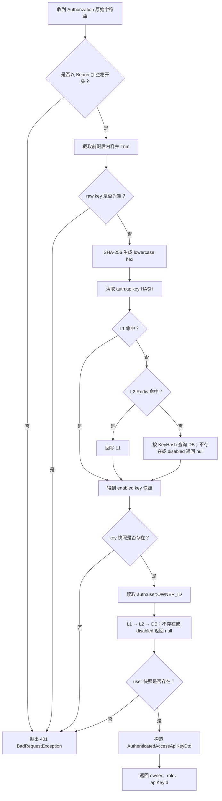
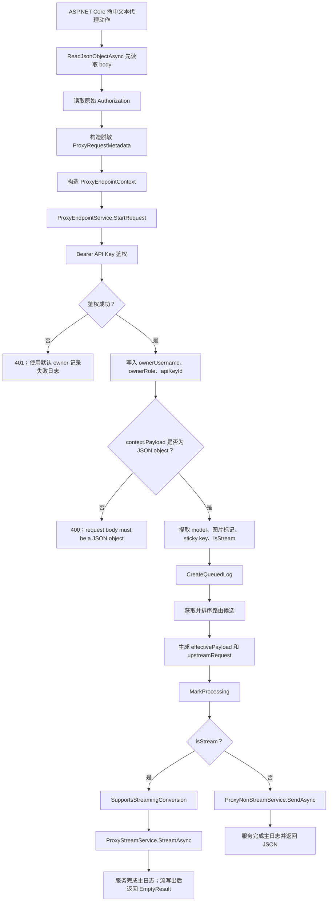
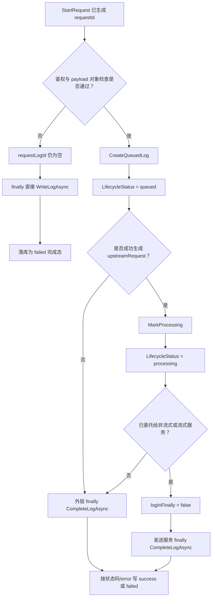

# 入口、鉴权与逐请求状态

> 基线：当前文档依据仓库 HEAD `5851939ad08db9465a226cc18489756ff8cd6941` 整理。本文覆盖文本协议代理入口；图片生成/编辑入口只作为边界对照。

## 1. 适用范围

本文详细描述一次文本代理请求从 ASP.NET Core 入口进入 `ProxyEndpointService` 前后的基础控制逻辑：

1. HTTP 路径如何确定入口协议；
2. 请求体何时读取、如何归一化；
3. 原始 Authorization 与脱敏请求元数据如何分离；
4. Bearer API Key 如何认证；
5. API Key/User 两级缓存如何参与认证；
6. `ProxyRequestState`、`ProxyEndpointContext` 和编排局部状态分别保存什么；
7. queued、processing、success/failed 日志生命周期如何推进；
8. 流式和非流式在何时分叉；
9. 入口阶段的错误优先级与当前边界。

本文不展开候选渠道排序、熔断、容量和故障转移算法；它们在鉴权和基础状态建立之后发生。

## 2. 源码入口

### 2.1 Web 入口与中间件

- `opencodex_proxy/src/Presentation/OpenCodex.Api/Program.cs`
- `opencodex_proxy/src/Presentation/OpenCodex.Api/Hosting/OpenCodexApplicationBuilderExtensions.cs`
  - `UseOpenCodexApi`
- `opencodex_proxy/src/Presentation/OpenCodex.Api/Hosting/OpenCodexServiceCollectionExtensions.cs`
  - `AddOpenCodexApi`
  - `AddOpenCodexServices`
  - `AddOpenCodexAuthentication`
- `opencodex_proxy/src/Presentation/OpenCodex.Api/Errors/ProxyErrorMiddleware.cs`
  - `InvokeAsync`

### 2.2 控制器与请求读取

- `opencodex_proxy/src/Presentation/OpenCodex.Api/Controllers/ProxyController.cs`
  - `Responses`
  - `ChatCompletions`
  - `Messages`
  - 私有方法 `Proxy`
  - `AuthorizationHeader`
- `opencodex_proxy/src/Presentation/OpenCodex.Api/Infrastructure/RequestBodyReader.cs`
  - `ReadJsonObjectAsync`
- `opencodex_proxy/src/Presentation/OpenCodex.Api/Infrastructure/ProxyRequestMetadataFactory.cs`
  - `FromHttpRequest`
  - `RedactedHeaders`
  - `Redact`

### 2.3 请求状态与鉴权

- `opencodex_proxy/src/Libraries/OpenCodex.Core/Services/Proxy/ProxyRequestService.cs`
  - `StartRequest`
  - `AuthenticateAccessKeyAsync`
- `opencodex_proxy/src/Libraries/OpenCodex.Core/Services/Proxy/ProxyAccessService.cs`
  - `AuthenticateBearerAsync`
  - `AuthenticateAccessApiKeyAsync`
  - `LoadAccessKeyByHash`
  - `LoadUserById`
- `opencodex_proxy/src/Libraries/OpenCodex.Core/Persistence/OpenCodexSecurity.cs`
  - `HashAccessApiKey`
- `opencodex_proxy/src/Libraries/OpenCodex.Core/Services/Caching/TwoLevelCacheService.cs`
  - `GetOrCreateAsync`
- `opencodex_proxy/src/Libraries/OpenCodex.CoreBase/Caching/CacheKeys.cs`
  - `AuthApiKey`
  - `AuthUser`

### 2.4 编排与日志状态

- `opencodex_proxy/src/Libraries/OpenCodex.Core/Services/Proxy/ProxyEndpointService.cs`
  - `ProxyAsync`
- `opencodex_proxy/src/Libraries/OpenCodex.CoreBase/Domain/Proxy/ProxyRequestState.cs`
- `opencodex_proxy/src/Libraries/OpenCodex.CoreBase/Domain/Proxy/ProxyEndpointContext.cs`
- `opencodex_proxy/src/Libraries/OpenCodex.CoreBase/Domain/Proxy/ProxyEndpointResult.cs`
- `opencodex_proxy/src/Libraries/OpenCodex.CoreBase/Domain/Proxy/ProxyRequestLifecycleStatus.cs`
- `opencodex_proxy/src/Libraries/OpenCodex.CoreBase/Domain/Proxy/ProxyRequestLogLifecycleContexts.cs`
- `opencodex_proxy/src/Libraries/OpenCodex.Core/Services/Proxy/ProxyLogService.cs`

## 3. HTTP 入口与协议绑定

### 3.1 文本代理入口

| HTTP 方法 | 路径 | `EntryProtocol` | 动作 |
|---|---|---|---|
| POST | `/responses` | `responses` | `ProxyController.Responses` |
| POST | `/v1/responses` | `responses` | `ProxyController.Responses` |
| POST | `/chat/completions` | `chat` | `ProxyController.ChatCompletions` |
| POST | `/v1/chat/completions` | `chat` | `ProxyController.ChatCompletions` |
| POST | `/messages` | `messages` | `ProxyController.Messages` |
| POST | `/v1/messages` | `messages` | `ProxyController.Messages` |

入口协议由路由动作固定指定。请求体中的字段不会改变入口协议。

例如：

- 向 `/v1/messages` 提交一个带 `messages` 的对象，入口是 Messages；
- 向 `/v1/responses` 提交同一个对象，入口仍是 Responses，后续会按 Responses 结构解释；
- 代理不会通过 `messages`、`input` 等字段自动探测协议。

### 3.2 `/models` 相邻入口

`ProxyController.Models` 同样要求访问 API Key，但它：

- 不读取代理请求体；
- 不构造 `ProxyEndpointContext`；
- 不调用 `ProxyEndpointService.ProxyAsync`；
- 直接调用 `AuthenticateAccessKeyAsync` 和模型路由列表。

因此它属于发现接口，不属于请求转换状态机。

### 3.3 管理 Cookie 与代理 Bearer 的边界

应用注册了 Cookie Authentication，主要服务于管理界面和管理接口。文本代理动作本身没有使用 `[Authorize]` 来接受管理会话，而是在业务服务中手动读取并验证 `Authorization`。

结论：

- 管理 Cookie 不替代代理访问 API Key；
- 代理鉴权只依据传入 `Authorization` 字符串；
- `HttpContext.User` 不是 `ProxyAccessService` 的认证输入。

## 4. 控制器阶段输入与输出

### 4.1 控制器实际执行顺序

`ProxyController.Proxy` 的顺序是：

1. 调用 `RequestBodyReader.ReadJsonObjectAsync` 读取并消费请求体；
2. 读取原始 `Authorization` 请求头；
3. 构造脱敏 `ProxyRequestMetadata`；
4. 构造 `ProxyStreamResponseWriter`；
5. 组装 `ProxyEndpointContext`；
6. 调用 `IProxyEndpointService.ProxyAsync`；
7. 根据 `ProxyEndpointResult.IsEmpty` 返回 `EmptyResult` 或普通状态码响应。

重要区别：

- **JSON 解析发生在鉴权之前**；
- **请求体是否为有效 JSON 对象的业务错误判断发生在鉴权之后**。

也就是说，缺少有效 Bearer 且请求体也非法时，请求体先被解析为 `null`，但 `ProxyEndpointService` 会先返回鉴权错误，而不是 body 错误。

### 4.2 `ProxyEndpointContext`

| 字段 | 是否可空 | 含义 |
|---|---|---|
| `EntryProtocol` | 否 | 控制器固定的入口协议 |
| `Payload` | 是 | JSON 根对象；解析失败或非对象时为 null |
| `AuthorizationHeader` | 是 | 原始 Authorization 值 |
| `RequestMetadata` | 否 | 方法、路径、IP、脱敏请求头 |
| `StreamWriter` | 否 | 下游流写入抽象 |
| `CancellationToken` | 否 | `RequestAborted` |

原始 Authorization 和 metadata headers 是两条不同数据通道：

- 前者用于鉴权；
- 后者用于日志和特定 Responses header 透传；
- metadata 中的 Authorization 已部分脱敏。

### 4.3 `ProxyEndpointResult`

| 字段 | 含义 |
|---|---|
| `StatusCode` | 控制器最终使用的 HTTP 状态码 |
| `Payload` | 非流式 JSON 或错误对象 |
| `IsEmpty` | 表示响应体是否已经由流写入器处理 |

控制器判断：

```text
IsEmpty = true  → EmptyResult
IsEmpty = false → StatusCode(StatusCode, Payload)
```

## 5. 请求体读取判断

### 5.1 判断表

| 输入 | `ReadJsonObjectAsync` 结果 | 鉴权成功后的代理结果 |
|---|---|---|
| 合法 JSON object | 字典 | 继续 |
| 合法 JSON array | null | 400，`request body must be a JSON object` |
| 合法 JSON string/number/bool/null | null | 同上 |
| malformed JSON | null | 同上 |
| 空 body | `JsonException` 被捕获，返回 null | 同上 |
| 合法 object，但重复键触发 `ToDictionary` 冲突 | 不是 `JsonException` 路径 | 可能逃逸为未处理异常 |

### 5.2 Content-Type

文本 `ProxyController` 没有像 `ImagesController.Generations` 那样显式检查 `application/json`。只要 body 能被 `JsonDocument.ParseAsync` 解析为 object，即使 Content-Type 不是 `application/json`，控制器代码本身也不会因 Content-Type 拒绝。

### 5.3 字段比较

读取出的对象字典使用 `StringComparer.Ordinal`：

- `model` 与 `Model` 不同；
- `stream` 与 `Stream` 不同；
- `prompt_cache_key` 与其他大小写拼法不同。

## 6. 请求元数据与头脱敏

### 6.1 `ProxyRequestMetadata` 字段

| 字段 | 来源 |
|---|---|
| `Method` | `HttpRequest.Method` |
| `Path` | `HttpRequest.Path.ToString()` |
| `ClientIp` | `HttpContext.Connection.RemoteIpAddress?.ToString()` |
| `Headers` | 遍历所有请求头后生成的字典 |

### 6.2 Authorization 的第一阶段脱敏

`ProxyRequestMetadataFactory.RedactedHeaders` 对 header 名进行大小写不敏感判断；只有 Authorization 在工厂阶段脱敏。

规则：

| 原值长度 | metadata 中的值 |
|---|---|
| 小于等于 12 | `...` |
| 大于 12 | 前 8 个字符 + `...` + 后 4 个字符 |

例：

```text
Bearer abcdefghijklmnop → Bearer a...mnop
```

这里仅表示格式；实际截取严格按字符串下标执行。

### 6.3 持久化前的第二阶段脱敏

`ProxyLogService.SerializeForLog` 会调用 `ImageLogSanitizer.CopyAndSanitize`。后者按大小写不敏感敏感键集合再次处理，包括：

- `authorization`；
- `authorization_token`；
- `api-key/api_key/apikey/x-api-key`；
- `cookie/set-cookie`；
- `password`；
- `access_token/refresh_token`。

对应值被替换为 `***REDACTED***`。

因此：

1. `ProxyRequestMetadata` 内存对象中 Authorization 是部分掩码；
2. 请求头写入持久化日志时，Authorization 通常变为完整占位符；
3. 原始 Authorization 仍只在 `ProxyEndpointContext.AuthorizationHeader` 中用于认证；
4. Responses 同协议 header 透传白名单不包含 Authorization。

### 6.4 其他头

工厂阶段除 Authorization 外不做统一脱敏。其他头是否在持久化时脱敏，取决于 `ImageLogSanitizer.SensitiveLogKeys` 是否匹配其键名。

## 7. `StartRequest`：逐请求默认状态

`ProxyEndpointService.ProxyAsync` 进入后立即调用：

```csharp
var requestState = _requests.StartRequest();
```

`ProxyRequestService.StartRequest` 每次读取当前运行时设置，构造：

| 字段 | 生成规则 | 用途 |
|---|---|---|
| `RequestId` | `RandomNumberGenerator.GetHexString(12).ToLowerInvariant()` | 日志关联、OCR/attempt 子记录关联 |
| `DefaultOwnerUsername` | 当前 `OpenCodexRuntimeSettings.AdminUsername` | 鉴权完成前或鉴权失败时的日志归属回退 |
| `DefaultTimeout` | 当前 `OpenCodexRuntimeSettings.DefaultTimeout` | 上游超时的默认回退值 |

### 7.1 默认值来源

`OpenCodexRuntimeSettingsProvider`：

- 管理员用户名配置为空时回退 `admin`；
- 默认超时读取 `OpenCodex:DefaultTimeout` 或 `OPENCODEX_DEFAULT_TIMEOUT`；
- 非正整数时回退 120 秒。

`DefaultTimeout` 不是所有渠道的强制超时。上游客户端后续会优先使用渠道 `timeout_seconds`，无有效渠道值时才使用该默认值。

### 7.2 请求 ID 性质

当前请求 ID 是 12 个小写十六进制字符。它不是数据库日志主键：

- `requestId`：跨主请求、OCR、attempt 的逻辑关联字符串；
- `requestLogId`：`RequestLog` 实体的 `Guid` 主键。

二者不可互换。

## 8. Bearer 鉴权判断

### 8.1 格式判断

`ProxyAccessService.AuthenticateBearerAsync` 使用固定前缀：

```text
Bearer<空格>
```

判断规则：

| Authorization | 结果 |
|---|---|
| 缺失/null | 401 |
| 不以 `Bearer ` 开头 | 401 |
| Bearer 大小写不同 | 接受，前缀比较忽略大小写 |
| `Bearer ` 后只有空白 | 401 |
| `Bearer   TOKEN` | 提取后 Trim，使用 `TOKEN` |
| `BearerTOKEN` | 401，因为缺少固定空格 |
| 任意非 `ocx_` 前缀 token | 不在格式阶段拒绝；仍计算 hash，通常查不到 |

失败统一构造：

- 异常类型：`BadRequestException`；
- HTTP 状态：401；
- `ErrorType`：`bad_request`；
- 消息：`valid bearer api key required`。

代理主链路返回的兼容错误近似：

```json
{
  "error": {
    "message": "valid bearer api key required",
    "type": "bad_request"
  }
}
```

### 8.2 Token 查找

提取 raw key 后：

1. Trim；
2. 空字符串直接失败；
3. 使用 SHA-256 计算 lowercase hex：
   - `OpenCodexSecurity.HashAccessApiKey`；
4. 用 hash 查找 AccessApiKey；
5. 再用 `OwnerUserId` 查找 User；
6. key 与 user 都存在且 enabled，认证成功。

认证读取的是 `AccessApiKey.KeyHash`，不使用 `KeyPlaintext` 进行比较。

### 8.3 Key/User 有效性决策表

| API Key 记录 | User 记录 | 结果 |
|---|---|---|
| 不存在 | 任意 | 401 |
| 存在但 `Enabled=false` | 任意 | 401 |
| 有效 | 不存在 | 401 |
| 有效 | 存在但 `Enabled=false` | 401 |
| 有效 | 有效 | 返回 `AuthenticatedAccessApiKeyDto` |

成功 DTO 向后续编排提供：

- `Id`：API Key ID；
- `OwnerUserId`；
- `OwnerUsername`；
- key 名称及掩码；
- `User.Role`；
- `User.Enabled`。

后续用途：

- `OwnerUsername`：隔离路由、亲和、容量、熔断、日志；
- `Id`：请求日志 API Key 维度；
- `User.Role`：Web Search 模拟权限判断。

## 9. 鉴权缓存逻辑

### 9.1 两个独立缓存键

| 缓存内容 | 键 |
|---|---|
| API Key 快照 | `auth:apikey:<SHA256_HASH>` |
| User 快照 | `auth:user:<OWNER_USER_ID>` |

二者都在 `ProxyAccessService` 中指定 60 秒 TTL。

### 9.2 读取层级

`TwoLevelCacheService.GetOrCreateAsync`：

1. L1 进程内内存；
2. L2 Redis；
3. DB factory 回源；
4. 成功值逐层回写。

Redis 不可用或读写异常时，缓存服务降级为纯 L1/DB，不让 Redis 故障中断认证主流程。

### 9.3 不缓存 null

API Key 不存在、被禁用，或 User 不存在、被禁用时，factory 返回 null。`TwoLevelCacheService` 不缓存 null，因此失败认证不会形成 60 秒负缓存。

### 9.4 失效

- API Key 启停、删除、导入/替换时，`ApiKeyService` 删除对应 `AuthApiKey` 缓存；
- User 更新或启停时，`UserService` 删除对应 `AuthUser` 缓存；
- 两级缓存失效会删本机 L1、Redis L2，并尽力通过 Pub/Sub 通知其他实例删 L1；
- Redis/广播失败时仍有本机删除和 TTL 兜底。

### 9.5 鉴权细节流程图



## 10. `ProxyEndpointService` 基础局部状态

`ProxyAsync` 在 try 外建立一组局部变量，确保 finally 能记录部分进度。

| 变量 | 初值 | 何时更新 |
|---|---|---|
| `started` | 当前 Stopwatch timestamp | 不变，用于总耗时 |
| `requestState` | `StartRequest` 结果 | 不变 |
| `requestId` | requestState ID | 不变 |
| `ownerUsername` | 默认管理员用户名 | 鉴权成功后换成 key owner |
| `defaultTimeout` | 运行时默认超时 | 不变 |
| `apiKeyId` | null | 鉴权成功后写入 |
| `payload` | null | 鉴权成功后赋值 `context.Payload` |
| `effectivePayload` | null | 图片回退、Web Search、compat 重写阶段推进 |
| `upstreamRequest` | null | 协议转换成功后写入 |
| `upstreamResponse` | null | 捕获错误体或服务回填 |
| `requestModel` | null | 从原始 payload 的 `model` 读取 |
| `upstreamModel` | null | 选中渠道后写入 |
| `channelId/channelType` | null | 选中候选后写入 |
| `ownerRole` | null | 鉴权成功后写入 |
| `statusCode` | 200 | 捕获 `ProxyException` 后更新 |
| `error/errorResponse` | null | 捕获代理错误后更新 |
| `logInFinally` | true | 交给 stream/nonstream 服务前改为 false |
| `streamResponseStarted` | false | 流错误/完成时从 tracking writer 判断 |
| `requestLogId` | null | queued 日志创建后写入 |

### 10.1 原始与有效载荷

三个载荷概念必须区分：

| 名称 | 含义 |
|---|---|
| `payload` | 客户端原始 JSON 对象，用于请求模型、stream、日志等 |
| `effectivePayload` | 经过图片 OCR 回退、Web Search mode 和渠道 compat 重写后，参与转换的有效载荷 |
| `upstreamRequest` | `ProtocolConverter.ConvertRequest` 输出的上游协议对象 |

日志中同时可能保存原始请求和上游请求，以便诊断重写差异。

## 11. 鉴权后的基础判断顺序

鉴权成功后，`ProxyEndpointService.ProxyAsync` 按以下顺序建立派生状态：

1. 将 `ownerUsername`、`ownerRole`、`apiKeyId` 替换为认证结果；
2. 将 `context.Payload` 赋给局部 `payload`；
3. 若 payload 为 null，抛出 400；
4. 提取 `requestModel`；
5. 检测请求是否包含图片；
6. 提取 `prompt_cache_key` 作为 sticky key；
7. 判断是否流式；
8. 创建 queued 主日志；
9. 查询并排序路由候选；
10. 逐候选执行健康、容量、重写、协议转换和发送。

### 11.1 派生字段判断

| 派生字段 | 代码判断 |
|---|---|
| `requestModel` | `JsonDictionaryValue.String(payload, "model")`，对值 `ToString` 后 Trim；缺失为空字符串 |
| `requestContainsImages` | `ProxyImageRequestDetector.ContainsImageInput(payload, entryProtocol)` |
| `stickyKey` | `JsonDictionaryValue.String(payload, "prompt_cache_key")` |
| `isStream` | 存在 `stream` 且值的运行时类型和值严格为 bool true |

因此：

- `"stream": "true"` 不是流式；
- `"stream": 1` 不是流式；
- compat 后续强制或改名字段不会改变已经计算出的 `isStream` 分支；
- `model` 若是数字，会因 `ToString` 成为路由字符串，而不是在此处报类型错误。

## 12. 入口主流程图



## 13. 请求日志生命周期

### 13.1 状态常量

`ProxyRequestLifecycleStatus`：

- `queued`；
- `processing`；
- `success`；
- `failed`。

### 13.2 创建 queued

只有在以下条件均满足后才创建 queued 主日志：

1. 鉴权成功；
2. payload 是 JSON object；
3. 已提取 model/stream 等基础信息。

queued 日志记录：

- requestId；
- owner；
- apiKeyId；
- 原始 payload；
- requestModel；
- isStream；
- method/path/clientIp/headers；
- request type，默认 `main`。

### 13.3 标记 processing

在某个候选渠道完成：

- 图片回退；
- Web Search mode；
- compat 重写；
- 协议请求转换；

并得到 `upstreamRequest` 后，调用 `MarkProcessing`。

记录或更新：

- upstream request；
- request/upstream model；
- channel；
- isStream；
- processing started time。

如果发生故障转移，同一个主日志可能在后续候选上再次被 `MarkProcessing` 更新；每个实际候选尝试另写 `attempt` 子日志。

### 13.4 完成

- 非流式：`ProxyNonStreamService` 在 finally 调用 `CompleteLogAsync`；
- 流式：`ProxyStreamService` 在 finally 调用 `CompleteLogAsync`；
- 在把职责交给上述服务之前，外层 `logInFinally` 被设为 false，避免重复完成；
- 认证失败、body 失败、路由失败等尚未交给发送服务的场景，由 `ProxyEndpointService` finally 完成或直接写日志。

`DetermineLifecycleStatus`：

```text
statusCode >= 400 或 error 非空 → failed
其他 → success
```

### 13.5 无 queued 日志的失败

认证失败和 body-null 失败发生在 `CreateQueuedLog` 前。finally 发现 `requestLogId` 为空时调用 `WriteLogAsync`，直接创建一条已完成日志，而不是经历 queued/processing 状态。

认证失败日志的局部状态特征：

- owner 使用 `StartRequest` 的默认管理员用户名；
- apiKeyId 为 null；
- 局部 `payload` 仍为 null，即使 `context.Payload` 原本已成功解析；
- 请求头来自 metadata，Authorization 已脱敏；
- statusCode 为 401；
- error 为固定 Bearer 错误。

### 13.6 生命周期细节流程图



## 14. 流式与非流式的状态分叉

### 14.1 非流式

`ProxyNonStreamContext` 接收：

- started timestamp；
- requestLogId/requestId；
- owner/apiKey；
- original payload；
- effective payload；
- upstream request；
- entry protocol；
- route/channel；
- owner role；
- upstream/request model；
- default timeout；
- request metadata；
- cancellation token。

成功返回 `ProxyNonStreamResult`，随后 `ProxyEndpointService` 生成非空 `ProxyEndpointResult`。

### 14.2 流式

`ProxyStreamContext` 在上述基础上还接收 `StreamWriter`。

外层用 `TrackingProxyStreamWriter` 包装，目的不是协议转换，而是记录是否已经向客户端写出任何内容。

状态影响故障处理：

| 状态 | 结果 |
|---|---|
| 上游失败且尚未写出下游字节 | 若 `ProxyFailoverPolicy` 允许，可换下一渠道 |
| 已写出下游字节 | 不再故障转移为另一个完整响应 |
| 流式成功 | 返回 200、Payload=null、IsEmpty=true |
| 所有流候选在首字节前失败 | 可返回普通 JSON 错误，响应不提前切为 SSE |

## 15. 错误优先级和响应形态

### 15.1 基础错误优先级

按当前执行顺序：

1. body 已尝试解析；
2. `StartRequest`；
3. Bearer 鉴权；
4. payload object 检查；
5. 路由和转换；
6. 上游调用。

所以客户端同时存在多个问题时，通常先看到更靠前的业务错误：

| 同时存在 | 优先返回 |
|---|---|
| 无效 Bearer + 非对象 body | 401 Bearer 错误 |
| 有效 Bearer + 非对象 body | 400 body object 错误 |
| 有效 Bearer + 合法 body + 无路由 | routing error |
| 合法路由 + 跨协议不等价参数 | 400 转换语义错误 |

### 15.2 `ProxyException`

`ProxyEndpointService` 捕获响应尚未开始的 `ProxyException`：

- `UpstreamException`：客户端状态统一改为 502；
- 其他代理异常：使用异常自身状态码；
- 返回 `exception.ToResponse()`；
- 上游原始错误 body 仅进入日志上下文。

### 15.3 中间件兜底

`ProxyErrorMiddleware` 位于控制器前：

- 若响应尚未开始且有 `ProxyException` 逃逸：
  - `/v1` 路径返回兼容 `error` 对象；
  - 非 `/v1` 路径返回 `ApiOpResult.Fail`；
- 未处理普通异常返回 500 和 `An unexpected error occurred.`；
- 若响应已经开始，中间件重新抛出，不清空响应。

代理主链路多数首字节前 `ProxyException` 已由 `ProxyEndpointService` 转成 `ProxyEndpointResult`；中间件主要处理控制器直接抛错、模型接口错误、服务外错误和流开始后的异常边界。

## 16. 重要边界与当前实现细节

### 16.1 JSON 解析在鉴权前发生

这意味着：

- 服务器会在确认 API Key 前读取整个 JSON body；
- 但不会在鉴权前把 payload 写入主请求日志；
- 大 body 的读取成本不受业务 Bearer 提前拦截。

本文只记录当前顺序，不推断反向代理层是否另有限制。

### 16.2 认证缓存 DTO 时间字段

`AuthenticateAccessApiKeyAsync` 构造 `AuthenticatedAccessApiKeyDto` 时：

- `CreatedAt` 来自 key 记录；
- `UpdatedAt` 使用当前时间；
- `LastUsedAt` 也使用当前时间。

该方法没有在此处持久化 AccessApiKey 的 `LastUsedAt`；DTO 中的当前时间不等同于数据库已更新。

### 16.3 失败结果不做负缓存

连续提交不存在的 token 会连续回源查询，而不是命中 60 秒“无此 key”缓存。连续提交被禁用 user/key 同理。

### 16.4 通用异常与日志状态的边界

`ProxyEndpointService` 外层只捕获 `ProxyException`。如果在尚未委托 stream/nonstream 服务前出现普通异常：

- 中间件最终可能返回 500；
- 外层 finally 仍会执行；
- 但外层 `statusCode/error` 不一定已同步为 500/异常文本。

因此，不能把所有未处理普通异常的持久化主日志状态都视为与最终 HTTP 500 严格一致；当前测试也未覆盖这一组合。

### 16.5 请求取消

`HttpContext.RequestAborted` 贯穿：

- JSON 读取；
- EndpointContext；
- 图片回退/OCR；
- 上游请求；
- SSE 枚举与写出。

取消异常不统一转换为普通代理错误。响应是否已开始会影响中间件能否写 JSON。

### 16.6 Header 字典大小写

`ProxyRequestMetadataFactory` 创建的 headers 字典使用 `StringComparer.Ordinal`，保留枚举得到的 key；后续需要大小写不敏感语义的逻辑会显式遍历并使用 `OrdinalIgnoreCase` 比较。

## 17. 判断逻辑速查表

| 判断 | 发生位置 | 真分支 | 假分支 |
|---|---|---|---|
| body 根节点是 object | `RequestBodyReader` | 返回字典 | 返回 null |
| Authorization 以 `Bearer ` 开头 | `ProxyAccessService` | 提取 token | 401 |
| token 非空 | `ProxyAccessService` | 计算 hash | 401 |
| key 快照有效 | `ProxyAccessService` | 查 user | 401 |
| user 快照有效 | `ProxyAccessService` | 返回认证 DTO | 401 |
| payload 非 null | `ProxyEndpointService` | 提取派生字段 | 400 |
| `stream is true` | `ProxyEndpointService` | 流式路径 | 非流式路径 |
| requestLogId 已创建 | finally | Complete 现有日志 | 直接写完成日志 |
| logInFinally 为 true | 外层 finally | 外层负责日志 | 发送服务负责日志 |
| stream writer 已写出 | 流错误处理 | 不再 failover/普通 JSON | 可按策略 failover |
| 异常为 UpstreamException | 客户端错误映射 | 统一 502 | 使用异常状态码 |

## 18. 测试锚点

### 18.1 Endpoint 状态与流首字节

文件：`opencodex_proxy/tests/OpenCodex.Api.Tests/ProxyEndpointServiceTests.cs`

- `ProxyAsync_NonStreamSuccess_ReleasesCapacity`
- `ProxyAsync_NonStreamFailure_ReleasesCapacity`
- `ProxyAsync_StreamSuccess_ReleasesCapacity`
- `ProxyAsync_StreamFailure_ReleasesCapacity`
- `ProxyAsync_StreamRetryableFailureBeforeFirstByte_FailsOverToNextChannel`
- `ProxyAsync_StreamRetryableFailureAfterFirstByte_DoesNotFailOver`
- `ProxyAsync_StreamAllCandidatesFail_DoesNotPrepareSseAndReturnsJsonError`
- `ProxyAsync_StreamFailoverSuccess_PrepareSseOnlyCalledAfterFailoverSucceeds`

### 18.2 请求头状态

同一文件：

- `ProxyAsync_ResponsesPassthrough_CopiesCodexHeadersToUpstreamChannel`
- `ProxyAsync_ResponsesPassthrough_AddsDefaultCodexHeadersWhenMissing`
- `ProxyAsync_ResponsesToChat_DoesNotCopyCodexHeaders`
- `ProxyAsync_ResponsesPassthrough_DoesNotReplaceConfiguredHeaders`

其中第一个测试明确断言客户端 Authorization 不会进入 Responses 上游透传 headers。

### 18.3 日志生命周期与脱敏

文件：`opencodex_proxy/tests/OpenCodex.Api.Tests/ProxyLogServiceTests.cs`

- `WriteLog_RedactsNestedMcpAuthorizationTokens`
- `WriteLog_RedactsNestedImageDataInObjectsAndArrays`
- `WriteLog_DoesNotModifyClientResponseWhileSanitizingStoredLog`
- `LifecycleMethods_PersistStatusesAndStreamLines`

### 18.4 集成入口

文件：`opencodex_proxy/tests/OpenCodex.Api.Tests/ProxyCompatibilityTests.cs`

- `ResponsesProxy_DropToolTypes_StripsImageGenerationToolsOnly`

该测试通过真实 `/v1/responses` 请求、Bearer access key 和测试宿主覆盖控制器到代理服务的集成路径。

路由暴露检查：

- `opencodex_proxy/tests/OpenCodex.Api.Tests/RouteTests.cs`
  - `ControllerRoutesDoNotUseAdminApiPrefix`
  - `OldAdminApiRoutesAreNotAvailable`

## 19. 当前测试边界

未发现针对以下基础入口行为的专门测试：

1. `ProxyAccessService.AuthenticateBearerAsync` 的前缀、空白、大小写和 disabled key/user 决策；
2. 鉴权 L1/L2/DB 顺序及 60 秒 TTL；
3. 认证失败不负缓存；
4. `RequestBodyReader` 的 malformed/non-object/数字类型/重复键；
5. `ProxyRequestMetadataFactory` 的“前 8 + 后 4”掩码；
6. 缺失 Bearer 与非法 body 同时存在时的错误优先级；
7. 认证失败日志是否使用默认 owner 且不保存已解析 payload；
8. 普通非 `ProxyException` 导致的最终 HTTP 状态与日志状态一致性；
9. 文本代理对非 `application/json` Content-Type 的当前接受行为；
10. 管理 Cookie 不能替代代理 Bearer 的端到端契约。

这些行为在本文中均按当前源码路径记录；维护时建议补充为独立的入口契约测试。
