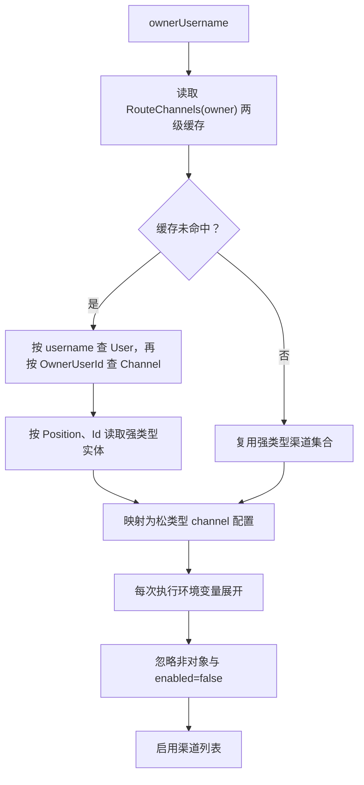
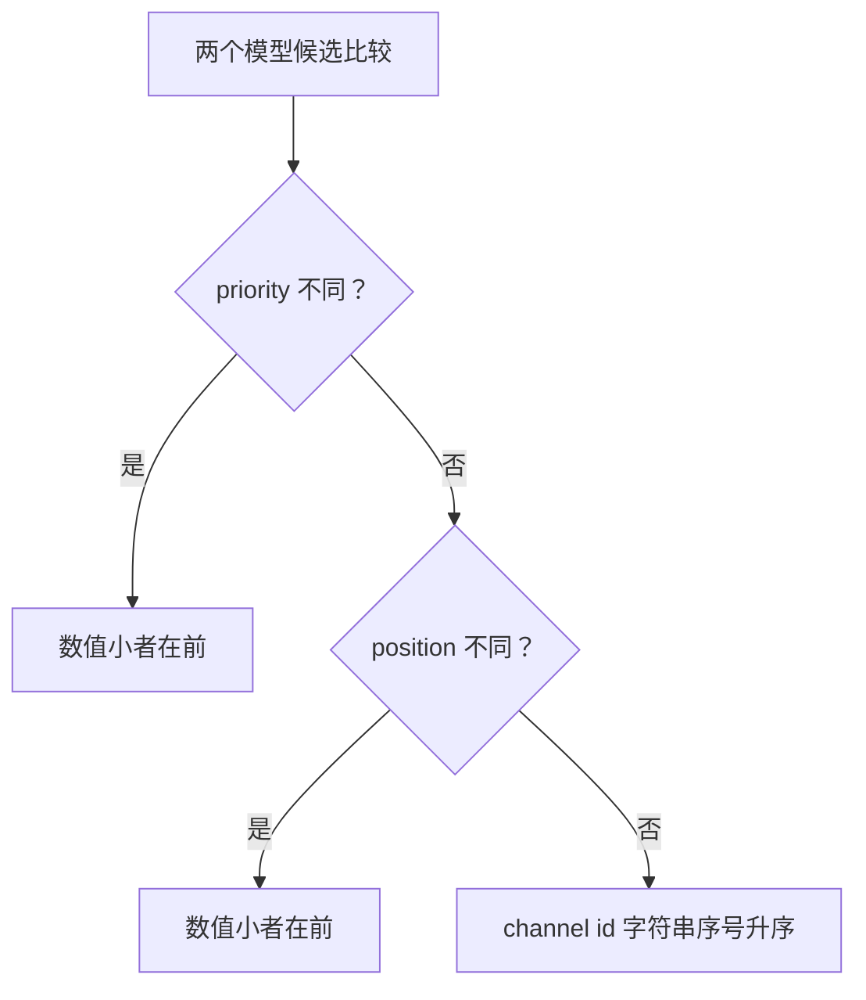
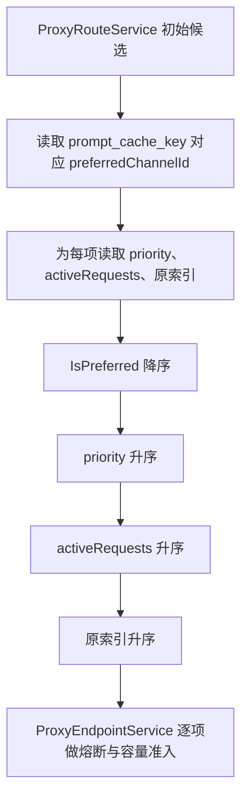
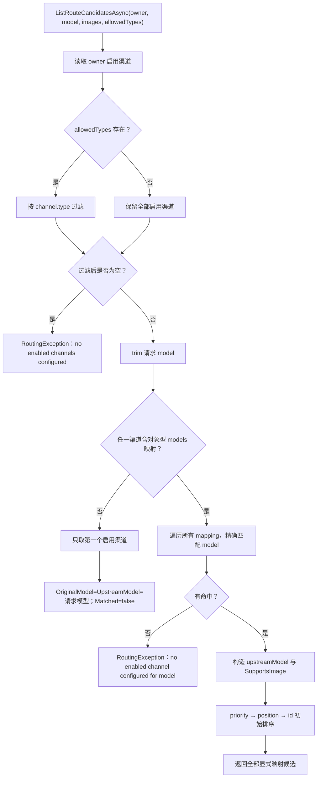
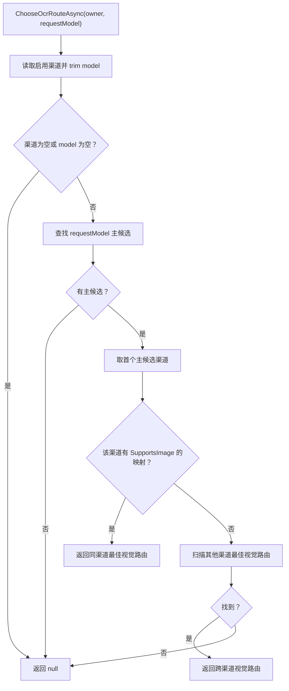

# 路由选择与模型映射

> 基准提交：`5851939ad08db9465a226cc18489756ff8cd6941`
> 本文说明候选渠道从哪里来、模型如何匹配、上游模型如何确定，以及“初始路由顺序”和“请求时最终顺序”为何不是同一个排序。

## 1. 适用范围

本文覆盖：

- `ProxyRouteService` 如何按访问密钥 owner 读取渠道；
- 渠道启用状态和允许渠道类型的过滤顺序；
- 有模型映射与无模型映射两种运行模式；
- 请求模型到上游模型的精确映射；
- 图片能力的来源；
- 路由候选的初始排序；
- `ProxyEndpointService.OrderCandidatesAsync` 如何结合亲和与负载形成最终尝试顺序；
- `/models` 如何从路由能力生成对外模型列表；
- OCR 视觉路由与主路由的差异。

亲和存储、容量租约和熔断状态机见[亲和、容量与熔断](02-affinity-capacity-and-circuit-breaker.md)；失败后何时进入下一候选见[故障转移、重试与超时](03-failover-retry-and-timeout.md)。

## 2. 源码入口

| 路径 | 类型/方法 | 责任 |
|---|---|---|
| `opencodex_proxy/src/Libraries/OpenCodex.Core/Services/Proxy/ProxyRouteService.cs` | `ListRouteCandidatesAsync` | 读取 owner 渠道、类型过滤、模型匹配、生成候选 |
| 同上 | `ChooseRouteAsync` | 返回候选列表第一个元素 |
| 同上 | `ListModelCapabilitiesAsync` | 为 `/models` 聚合每个对外模型的最佳能力候选 |
| 同上 | `ChooseOcrRouteAsync` | 为主模型寻找视觉 OCR 路由 |
| `opencodex_proxy/src/Libraries/OpenCodex.Core/Services/Proxy/ProxyEndpointService.cs` | `OrderCandidatesAsync` | 在初始候选上叠加亲和、priority 和活跃请求数排序 |
| `opencodex_proxy/src/Libraries/OpenCodex.Core/Services/ModelCatalogService.cs` | `SupportsImage` | 按渠道模型覆盖、全局模型目录和旧映射值判断图片能力 |
| `opencodex_proxy/src/Libraries/OpenCodex.Domain/Domain/Channel.cs` | `Channel` | 渠道持久化字段 |
| `opencodex_proxy/src/Libraries/OpenCodex.CoreBase/DTOs/Proxy/ProxyRouteDto.cs` | `ProxyRouteDto` | 路由结果契约 |

## 3. 输入与输出

### 3.1 `ListRouteCandidatesAsync` 输入

| 参数 | 来源 | 处理规则 |
|---|---|---|
| `ownerUsername` | 已认证访问密钥的 owner | trim 后用于用户查找、路由缓存键和渠道过滤 |
| `model` | 原始请求顶层 `model` | `null` 转为空串后 trim；匹配时区分大小写 |
| `requestContainsImages` | 协议感知的图片检测 | 当前主候选匹配实现不据此改选模型；保留在接口契约中供调用语义和后续演进 |
| `allowedChannelTypes` | 普通主代理传 `null`；图片端点等可传集合 | 在判断是否存在渠道和是否启用“无映射回退”之前过滤 |

### 3.2 `ProxyRouteDto` 输出

| 属性 | 来源 | 语义 |
|---|---|---|
| `Channel` | 展开后的渠道配置字典 | 含 ID、类型、Base URL、认证、超时、重试、优先级、容量、compat 和 models 等 |
| `OriginalModel` | 映射 `model`，或无映射回退时的请求模型 | 对外模型；响应转换时恢复给客户端 |
| `UpstreamModel` | 映射 `upstream_model`，为空时回退为 `model` | 实际发送给上游 |
| `SupportsImage` | 模型目录能力判断 | 当前候选映射的上游模型是否原生支持图片 |
| `MatchedModelMapping` | 显式映射候选为 `true`；兼容回退为 `false` | OCR 降级判断的重要条件 |

## 4. 渠道数据读取链路

### 4.1 持久化字段到运行时配置

`Channel` 实体的关键字段被 `MapToChannelDto` 和 `ChannelToConfig` 转成松类型配置：

| 实体字段 | 运行时键 | 路由用途 |
|---|---|---|
| `Id` | `id` | 确定性排序、亲和、容量、熔断、日志 |
| `OwnerUserId` + 用户查询 | `owner_username` | owner 隔离 |
| `Position` | `position` | 同 priority 候选次序 |
| `Priority` | `priority` | 首要配置排序，数值越小越优先 |
| `Type` | `type` | 上游协议及允许类型过滤 |
| `BaseUrl` | `baseurl` | 上游地址 |
| `ApiKey` | `apikey` | 上游认证 |
| `TimeoutSeconds` | `timeout_seconds` | 当前渠道单次上游超时 |
| `CircuitBreakDurationSeconds` | `circuit_break_duration_seconds` | 当前渠道熔断打开时长 |
| `RetryCount` | `retry_count` | 同渠道 HTTP 重试次数 |
| `Capacity` | `capacity` | 并发容量上限 |
| `CompatJson` | `compat` | 当前候选请求兼容重写 |
| `ModelsJson` | `models` | 对外模型到上游模型的映射数组 |
| `Enabled` | `enabled` | 静态启用过滤 |

### 4.2 缓存与环境变量展开

`ReadExpandedChannelValuesAsync` 的顺序：

1. 使用 `CacheKeys.RouteChannels(ownerUsername)` 读取两级缓存；TTL 固定 60 秒；
2. 缓存的是强类型 `Channel` 集合及 owner 名称映射，而不是环境变量展开后的松类型对象；
3. 每次调用都重新把实体映射为配置字典；
4. 每次调用都执行 `ConfigEnvironmentExpander.Expand`；
5. 要求展开结果是对象且包含列表形态的 `channels`。

设计结果是：数据库渠道变更最多受 60 秒路由缓存影响；环境变量引用每次路由都会重新展开，环境变量值不被 60 秒缓存固化。

### 4.3 owner 过滤

`LoadChannelSet` 对非空 owner：

1. 按 `User.Username == normalizedOwnerUsername` 精确查询用户；
2. 用户不存在时返回 `null`，并明确不缓存该空结果，以便随后创建用户后能立即回源；
3. 用户存在时只读取 `Channel.OwnerUserId == user.Id` 的渠道；
4. 数据库初始顺序为 OwnerUserId → Position → Id。

主代理总是使用已认证密钥的 owner，因此普通请求不会跨 owner 混用渠道。

### 4.4 启用过滤

`ListEnabledChannelConfigsAsync`：

- 忽略不是对象的 channel 元素；
- 仅当 `enabled` 明确为布尔 `false` 时跳过；
- 缺失 `enabled` 或其他非 false 运行时形态视为启用。

正常数据库映射会始终生成布尔 `enabled`，宽松规则主要保护松类型配置兼容。



## 5. 主路由判断逻辑

### 5.1 允许渠道类型先过滤

若 `allowedChannelTypes` 非空，先对启用渠道执行：

```text
allowedChannelTypes.Contains(channel["type"])
```

使用集合自身的比较器决定大小写行为。生产调用通常使用 `StringComparer.Ordinal`。过滤完成后若列表为空，抛出：

```text
RoutingException("no enabled channels configured")
```

“先过滤类型，再判断模型映射模式”非常关键：即使 owner 还有其他类型且带模型映射的渠道，也不会阻止被允许类型集合内的无映射回退。测试 `ListRouteCandidates_AllowedTypesFilterRunsBeforeUnmappedFallback` 固定了这一语义。

### 5.2 全局映射模式开关

`HasAnyModelMappings(enabledChannels)` 扫描过滤后的全部启用渠道：

- `models` 必须可解析为列表；
- 列表中只要存在至少一个对象元素，就返回 `true`；
- 不要求该映射有效、启用或命中当前模型；正常配置校验负责保障其结构。

这形成两种互斥模式：

| 模式 | 条件 | 路由行为 |
|---|---|---|
| 显式映射模式 | 任一启用渠道含对象型模型映射 | 当前请求必须至少命中一个 `mapping.model`，否则报错 |
| 无映射兼容模式 | 所有启用渠道都没有对象型映射 | 只返回启用渠道列表的第一个渠道，请求模型原样作为上游模型 |

不是“某渠道没有映射就对该渠道回退”。一旦任意启用渠道配置了映射，所有候选都进入显式匹配逻辑。

### 5.3 模型精确匹配

`ListMatchedRouteCandidates` 对每个映射执行：

```text
ConfigValue.PythonString(mapping["model"]).Trim() == normalizedModel
```

结论：

- 请求模型会 trim；
- 映射模型也会 trim；
- 比较为 C# 字符串 `==`，即区分大小写的序号相等语义；
- 不支持通配符、前缀、正则、别名回退或忽略大小写；
- 同一请求模型可以在多个渠道各自出现，生成多个故障转移候选。

若显式映射模式下没有命中，抛出：

```text
RoutingException($"no enabled channel configured for model: {normalizedModel}")
```

默认状态码为 400。

### 5.4 上游模型确定

`ToCandidate` 的回退顺序：

1. `model = Trim(mapping.model)`；
2. 若 `model` 为空，使用调用方传入的 `fallbackModel`；主匹配时即 normalized request model；
3. `upstreamModel = Trim(mapping.upstream_model)`；
4. 若 `upstreamModel` 为空，使用 `model`。

正常持久化配置在 `ConfigNormalizer.Normalize` 阶段已经：

- trim `model` 和 `upstream_model`；
- 为缺失的 `upstream_model` 回填 `model`；
- 删除映射中除这两个字段外的其他键。

路由层仍保留回退，是为了兼容旧数据或直接构造的测试/调用。

### 5.5 图片能力确定

`MappingSupportsImage` 先读取旧映射中的 `supports_image=true`，再调用：

```text
ModelCatalogService.SupportsImage(channelId, actualUpstreamModel, legacyMappingValue)
```

能力判断优先顺序：

1. 旧映射值为 `true`：立即支持；
2. 上游模型为空：不支持；
3. 存在渠道级模型信息覆盖：读取其 `CapabilitiesJson.supports_image`；
4. 否则查全局模型目录匹配并读取 `CapabilitiesJson.supports_image`；
5. 都未命中：不支持。

正常新配置的映射会被规范化为只含 `model` 与 `upstream_model`，所以长期权威来源是模型目录，而非映射上的旧布尔字段。

### 5.6 `requestContainsImages` 的当前语义

尽管方法签名包含 `requestContainsImages`，当前 `ListRouteCandidatesAsync` 不使用它改变主模型候选：

- 请求 `text-model` 即使含图，仍匹配 `text-model` 映射；
- 若该候选 `SupportsImage=false`，后续 `ProxyEndpointService` 执行 OCR 降级；
- 它不会在主路由阶段直接把请求模型替换成某个视觉模型。

测试 `ChooseRoute_ImageInput_KeepsOriginalTextModel` 和 `ChooseRoute_ImageInput_KeepsOriginalVisionModel` 固定了这一点。

## 6. 初始候选排序

每个 `ModelRouteCandidate` 的 `CompareTo` 顺序：

1. `Priority` 升序；
2. `Position` 升序；
3. `Channel["id"]` 转字符串后按 `StringComparison.Ordinal` 升序。



字段读取存在类型约束：

- 路由层 `PriorityValue` 只接受运行时 `int`，否则为 0；
- `PositionValue` 同样只接受 `int`，否则为 0；
- 正常数据库实体字段为 int，因此生产数据稳定；松类型手工调用需注意 long 不会被识别。

## 7. 最终请求时排序

`ProxyEndpointService.OrderCandidatesAsync` 在初始候选顺序上再计算：

| 排序键 | 方向 | 来源 |
|---|---|---|
| `IsPreferred` | `true` 在前 | `(owner, prompt_cache_key)` 的亲和渠道 ID |
| `Priority` | 升序 | 渠道 `priority`，该处支持 int/long/short/byte |
| `ActiveRequests` | 升序 | `ChannelCapacityService.GetActiveRequests` 的本实例计数 |
| `Order` | 升序 | 初始候选索引，间接保留 position 和 ID 次序 |

最终比较不是 priority → position → active，而是 priority → active → 初始顺序。于是同 priority 时，较空闲渠道会优先于更小 position；只有活跃数也相同时才恢复 position/ID 次序。

亲和命中又位于 priority 之前，所以亲和渠道即使 priority 数值更大，也会先尝试；但它仍可能因熔断或容量而跳过。



## 8. 完整主路由流程图



## 9. OCR 视觉路由

`ChooseOcrRouteAsync(ownerUsername, model)` 与主路由不同：

1. owner 没有启用渠道：返回 `null`，不抛异常；
2. 请求模型 trim 后为空：返回 `null`；
3. 先按请求模型获取主候选；无匹配返回 `null`；
4. 以主候选第一个渠道为 primary；
5. 优先在 primary 渠道的全部映射中寻找图片能力为 true 的最佳模型；
6. 若同渠道没有，再在其他启用渠道中寻找全局最佳图片模型；
7. 同一范围内仍按 priority → position → channel ID 比较。

OCR 视觉模型不要求对外模型名等于主请求模型；它的用途是内部图片识别。



## 10. `/models` 能力聚合

`ProxyController.Models` 先认证访问密钥，再调用 `ListModelCapabilitiesAsync(owner)`。

聚合逻辑：

1. 遍历 owner 的启用渠道和所有对象型模型映射；
2. `ToCandidate(channel, mapping, fallbackModel="")`；
3. 忽略最终 `candidate.Model` 为空的映射；
4. 按对外模型名使用 `StringComparer.Ordinal` 去重；
5. 同名模型保留 `CompareTo` 更优的候选；
6. 最终先按候选排序，再按模型名序号排序；
7. 输出模型名及最佳候选的 `SupportsImage`。

控制器随后将该列表同时投影成 OpenAI 风格 `data` 和 Codex 客户端风格 `models`。模型目录中的展示名称和 catalog 元数据可以补充输出，但只有路由映射中出现的对外模型会被列出。

## 11. 决策表

### 11.1 主候选生成

| 启用渠道 | 任意映射对象 | 当前模型命中 | 结果 |
|---:|---:|---:|---|
| 0 | 任意 | 任意 | 400 routing_error：没有启用渠道 |
| >0 | 否 | 不适用 | 仅第一个启用渠道，模型原样透传，`Matched=false` |
| >0 | 是 | 否 | 400 routing_error：没有为该模型配置渠道 |
| >0 | 是 | 是 | 返回所有命中映射，按 priority/position/id 排序 |

### 11.2 图片能力与后续行为

| 请求含图 | 路由 `SupportsImage` | `MatchedModelMapping` | 主路由行为 | 后续行为 |
|---|---|---|---|---|
| 否 | 任意 | 任意 | 按模型正常路由 | 不触发 OCR |
| 是 | true | true | 仍用原模型 | 原图直接进入协议转换 |
| 是 | false | true | 仍用原模型 | `ProxyImageFallbackService` 执行 OCR 并重写 |
| 是 | false | false | 无映射兼容回退 | 当前条件不会触发 OCR 分支 |

最后一行是当前源码的真实边界：OCR 条件明确要求 `MatchedModelMapping`。无映射兼容模式下即使候选不支持图片，也不会进入该 OCR 分支。

## 12. 边界与错误

1. **模型匹配区分大小写。** `gpt-5` 与 `GPT-5` 是不同对外模型。
2. **空模型不会自动选择默认模型。** 显式映射模式通常会因为无匹配而报错；无映射模式则可能把空字符串发送为上游模型，后续由上游或请求校验失败。
3. **无映射模式只返回一个渠道。** 即使配置了多个无映射渠道，也不会生成跨渠道故障转移候选。
4. **任何一个映射对象都会关闭全局无映射回退。** 迁移配置时应一次性为需要暴露的所有模型补齐映射。
5. **初始渠道读取顺序不是最终尝试顺序。** 请求时亲和和活跃请求数会重排。
6. **`GetActiveRequests` 是本实例近似值。** Redis 路径提供跨实例容量硬限制，但排序用的活跃数仍是当前实例计数，因此多实例间不保证全局最少连接排序。
7. **渠道 `enabled=false` 会在路由服务中提前消失。** `ProxyEndpointService` 仍把候选 `enabled` 传给熔断器，是接口防御；正常候选已是启用状态。
8. **环境变量展开失败可能产生 `BadRequestException`。** 展开后根不是对象时消息为 `expanded config must be an object`。
9. **OCR 路由不复用主候选的容量、熔断和故障转移循环。** 它只选择一个视觉路由，实际 OCR 上游调用走该渠道自身的 HTTP 重试。

## 13. 测试锚点

| 测试文件/方法 | 固定的行为 |
|---|---|
| `ProxyVisionRoutingTests.ListRouteCandidates_AllowedTypesFilterRunsBeforeUnmappedFallback` | 允许类型过滤先于无映射模式判断 |
| `ProxyVisionRoutingTests.ChooseRoute_ModelMappings_PrefersLowerPriority` | priority 数值小者优先 |
| `ProxyVisionRoutingTests.ChooseRoute_ModelMappings_SamePriorityFallsBackToPosition` | 同 priority 按 position |
| `ProxyVisionRoutingTests.ChooseRoute_ImageInput_KeepsOriginalTextModel` | 含图不改变主请求模型 |
| `ProxyVisionRoutingTests.ChooseRoute_ImageInput_KeepsOriginalVisionModel` | 已支持图片的原模型保持不变 |
| `ProxyVisionRoutingTests.ChooseOcrRoute_ImageInput_UsesSameChannelVisionModelFirst` | OCR 同渠道视觉模型优先 |
| `ProxyVisionRoutingTests.ChooseOcrRoute_ImageInput_FallsBackToLaterChannelVisionModel` | 同渠道无视觉模型时跨渠道寻找 |
| `ProxyEndpointServiceTests.ProxyAsync_SamePriorityPrefersLessBusyChannel` | 最终排序在同 priority 下优先较少活跃请求 |
| `ProxyEndpointServiceTests.ProxyAsync_StickyKeyRoutesToPreviouslyRememberedChannel` | 亲和优先于普通顺序 |
| `ModelCatalogServiceTests` 中渠道模型能力相关用例 | 渠道模型目录与全局目录解析 |
| `ImagesCoreContractTests.RouteInterfaceDefaultOverload_FiltersAllowedChannelTypes` | 接口默认重载也支持允许类型过滤 |

## 14. 维护检查清单

修改路由逻辑时至少核对：

- 是否改变 owner 隔离或缓存键；
- 是否改变允许类型过滤与映射模式判断顺序；
- 是否改变模型匹配的大小写或 trim 语义；
- 是否改变无映射模式返回候选数量；
- 是否同步 `/models` 能力聚合；
- 是否同步 OCR 路由的同渠道优先规则；
- 是否区分 `ProxyRouteService` 初始排序与 `ProxyEndpointService` 最终排序；
- 是否为多实例下“排序近似、容量全局”语义补充测试。
