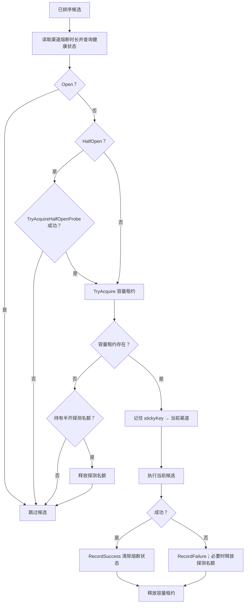
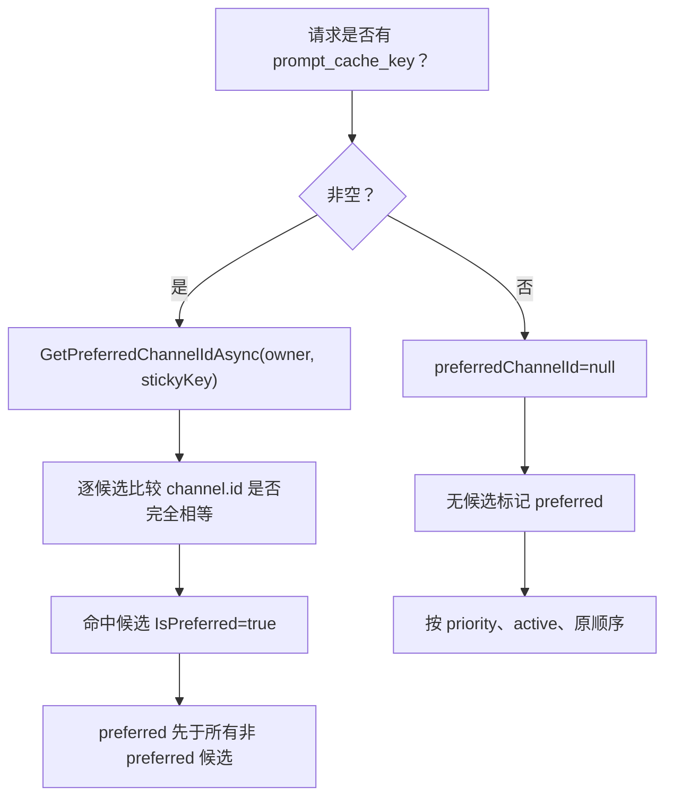
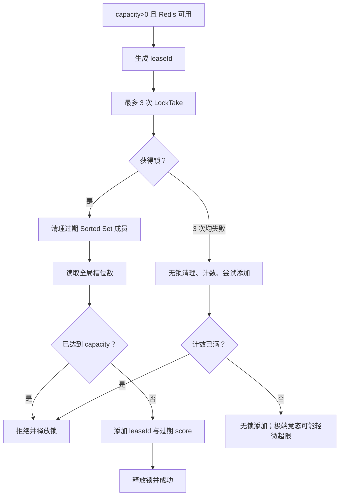
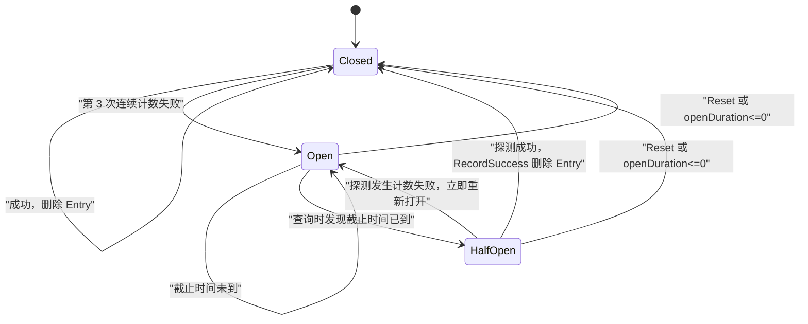
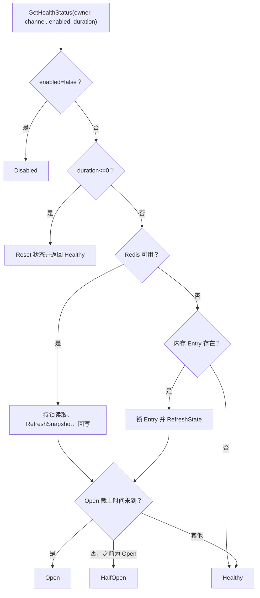
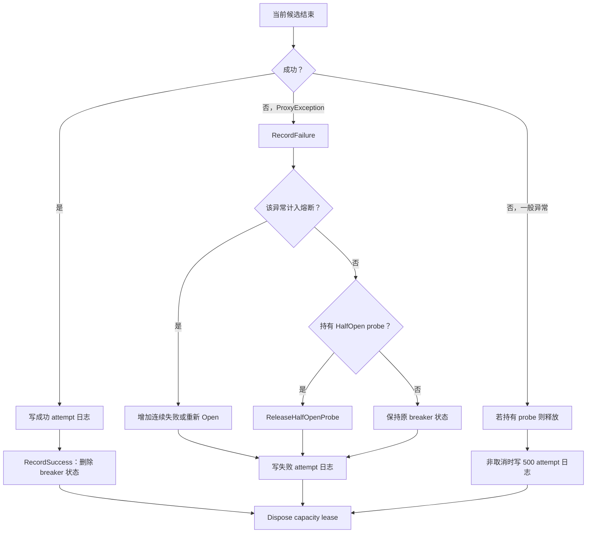

# 渠道亲和、容量与熔断

> 基准提交：`5851939ad08db9465a226cc18489756ff8cd6941`
> 本文描述三个相互独立但在候选准入阶段组合使用的运行时机制：渠道亲和、并发容量和熔断器。

## 1. 适用范围

本文覆盖：

- `prompt_cache_key` 如何形成会话到渠道的滑动过期亲和；
- 亲和在最终候选排序中的优先级及其非强制性质；
- 渠道 `capacity` 如何形成 Redis 分布式信号量或进程内计数器；
- 活跃请求与活跃模型用量如何记录；
- 熔断器的 Healthy/Open/HalfOpen/Disabled 状态；
- 哪些失败计入熔断；
- 半开探测名额的申请和释放；
- Redis 可用与不可用时的行为差异；
- 三种机制在 `ProxyEndpointService` 中的准确调用顺序。

## 2. 源码入口

| 路径 | 类型/方法 | 责任 |
|---|---|---|
| `opencodex_proxy/src/Libraries/OpenCodex.Core/Services/Proxy/ChannelAffinityService.cs` | `GetPreferredChannelIdAsync`、`RememberAsync` | 滑动过期亲和映射 |
| `opencodex_proxy/src/Libraries/OpenCodex.Core/Services/Proxy/ChannelCapacityService.cs` | `TryAcquireAsync`、`GetActiveRequests`、`GetActiveModelUsages` | 并发槽位与本实例计数 |
| `opencodex_proxy/src/Libraries/OpenCodex.Core/Services/Proxy/ChannelCircuitBreakerService.cs` | 健康查询、探测、成功、失败、重置 | 渠道运行时熔断状态 |
| `opencodex_proxy/src/Libraries/OpenCodex.Core/Services/Proxy/ProxyEndpointService.cs` | `OrderCandidatesAsync`、候选 foreach | 三种机制的编排顺序 |
| `opencodex_proxy/src/Libraries/OpenCodex.Core/Services/Caching/RedisConnectionProvider.cs` | Redis provider | 判断 Redis 是否可用并应用可选前缀 |
| `opencodex_proxy/src/Libraries/OpenCodex.CoreBase/Domain/Proxy/ChannelHealthStatus.cs` | `ChannelHealthStatus` | 对外健康状态枚举 |

## 3. 三种机制的职责边界

| 机制 | 回答的问题 | 是否跳过候选 | 是否改变候选顺序 | 是否跨实例共享 |
|---|---|---:|---:|---|
| 亲和 | “同一 sticky key 上次用了哪个渠道？” | 否 | 是，亲和候选排最前 | Redis 可用时是；否则仅本进程 |
| 容量 | “当前渠道是否还有并发槽位？” | 是 | 本实例活跃数还参与排序 | Redis 可用时硬上限跨实例；展示/排序计数仍是本实例 |
| 熔断 | “该渠道近期是否应暂时停止接流量？” | 是 | 否，排序后逐项检查 | Redis 可用时状态跨实例；否则仅本进程 |

亲和不是锁定。它只让候选更早被检查；熔断打开、半开名额不足或容量满时，编排器会继续下一个候选。

## 4. 组合准入顺序

### 4.1 排序前

1. `ProxyRouteService` 已按模型、priority、position、ID 生成初始候选；
2. `OrderCandidatesAsync` 读取 sticky key 对应的亲和渠道；
3. 按亲和 → priority → 本实例活跃请求数 → 初始顺序重排。

### 4.2 遍历候选时



注意亲和写入发生在获得容量之后、真正调用上游之前。当前候选即使随后失败，也已经成为该 sticky key 的记忆渠道。

## 5. 渠道亲和

### 5.1 输入与默认值

| 项 | 值/来源 |
|---|---|
| sticky key | 请求顶层 `prompt_cache_key` 字符串 |
| owner | 访问密钥所有者用户名 |
| channel ID | 当前候选 `channel["id"]` 字符串 |
| 默认 TTL | `ChannelAffinityService.DefaultTimeToLive`，30 分钟 |
| 过期模式 | 滑动过期；成功读取会延长 TTL |

只有 `string.IsNullOrEmpty(stickyKey)` 才视为无 sticky key。纯空格字符串不是 empty，会作为真实键使用。owner 构造键前会 trim。

### 5.2 Redis 路径

键和值：

```text
key   = affinity:{owner.Trim()}:{stickyKey}
value = channelId
```

读取流程：

1. `StringGetAsync`；
2. 未命中返回 `null`；
3. 命中后 `KeyExpireAsync(key, ttl)` 刷新过期；
4. 返回渠道 ID。

GET 与 EXPIRE 不是原子操作。源码明确接受该竞态：若两步之间键过期，当前读取仍可能返回旧值，但下一次会返回 `null`。

写入使用 `StringSetAsync(key, channelId, ttl)`，即带 TTL 覆盖写。

### 5.3 进程内路径

键：

```text
{owner.Trim()}\n{stickyKey}
```

字典值 `Entry` 含：

- `ChannelId`；
- `ExpiresAt`；
- 每条 Entry 自身的 `Sync` 锁。

读取：

- 不存在 → `null`；
- `ExpiresAt <= now` → 删除并返回 `null`；
- 未过期 → `ExpiresAt = now + ttl`，返回渠道 ID。

写入：

- 空 sticky key 或空 channel ID → 忽略；
- 新建或覆盖 Entry；
- 设置新的 `ExpiresAt`；
- 遍历字典清理全部过期项。

进程内写入的过期清理为 O(n)，但读取只处理当前键。

### 5.4 亲和排序逻辑



渠道 ID 比较使用 `StringComparison.Ordinal`。如果亲和中保存的渠道已不再是当前模型候选，没有任何项被标记 preferred，正常排序继续。

### 5.5 亲和边界

1. 亲和记录不检查渠道是否仍启用；候选列表天然排除了禁用渠道。
2. 亲和记录不在失败时删除；依赖 TTL、覆盖写、容量和熔断来纠偏。
3. 多实例且 Redis 不可用时，请求落到不同实例可能命中不同渠道。
4. Redis key 直接拼接 owner 和 sticky key，没有长度裁剪或转义；调用方应避免无界或含歧义分隔符的 sticky key。

## 6. 渠道容量

### 6.1 容量值解析

`TryAcquireAsync` 只在以下条件成立时启用硬限制：

```text
channel["capacity"] is int capacityInt && capacityInt > 0
```

其他情况容量视为 0，即不限流。正常数据库字段为 `int`，因此生产路径不会因 JSON long 类型丢失；直接构造松类型渠道时需注意。

### 6.2 租约输入

除 owner 和渠道外，容量服务还接收：

- `requestModel`：对外请求模型；
- `upstreamModel`：映射后模型。

两者 trim 后形成 `ModelUsageKey`。至少一个非空时记录活跃模型用量；该用量只用于观测，不参与硬容量判断。

### 6.3 Redis 分布式信号量

Redis 可用且 `capacity > 0` 时，每个 `(owner, channel)` 使用一个 Sorted Set：

```text
set key  = capacity:{owner.Trim()}:{channelId}
member   = leaseId（GUID 无连字符）
score    = 租约过期 Unix 秒
lock key = capacity:lock:{owner.Trim()}:{channelId}
```

常量：

| 项 | 值 |
|---|---:|
| 租约 TTL | 600 秒 |
| 分布式锁 TTL | 5 秒 |
| 锁尝试次数 | 3 |
| 锁重试间隔 | 10 毫秒 |

持锁临界区：

1. 删除 score `<= now` 的过期租约；
2. 读取 Sorted Set 长度；
3. `current >= capacity` 则拒绝；
4. 否则添加当前 lease ID，score 为 `now + 600s`。



锁最终获取失败时不会直接拒绝，而是执行无锁“清理 → 计数 → 添加”。这保证 Redis 锁短暂竞争时仍可服务，但多个实例可能同时看到未满并轻微超出容量。

### 6.4 Redis 不可用时的进程内限流

容量服务维护：

```text
ConcurrentDictionary<owner + "\n" + channelId, CounterEntry>
```

在 Entry 锁内：

1. 若无 Redis lease、`capacity > 0` 且 `ActiveRequests >= capacity`，返回 `null`；
2. 否则 `ActiveRequests++`；
3. 按模型键增加 `ActiveModelRequests`。

这在单进程内是锁保护的硬上限；多实例之间互不可见。

### 6.5 本实例计数始终维护

即使已经通过 Redis 获取全局槽位，也会增加当前进程 `CounterEntry`。原因：

- `GetActiveRequests` 用于请求时较空闲渠道排序；
- `GetActiveModelUsages` 用于管理/观测。

所以：

- Redis Sorted Set 是全局硬限制依据；
- `GetActiveRequests` 是当前实例近似负载；
- 不能把管理台显示的本实例活跃数当作 Redis 全局占用数。

### 6.6 释放

`IChannelCapacityLease.Dispose` 使用 `Interlocked.Exchange` 保证幂等：

1. Redis lease 存在时，fire-and-forget `SortedSetRemove`；
2. 进程内 `ActiveRequests--`，最低保持 0；
3. 模型用量减一，归零则删除；
4. ActiveRequests 与模型字典都为空时，从 ConcurrentDictionary 删除 Entry。

Redis 删除若丢失，最多由 600 秒租约 TTL 回收。

### 6.7 容量边界

1. 租约 TTL 不会在长请求期间续期。单次流式请求超过 600 秒时，Redis 全局槽位可能被其他请求清理并重新占用，而本实例计数仍保持到请求 Dispose。
2. `using var capacityLease` 包围 OCR、兼容重写、协议转换和完整上游响应，因此这些阶段都占用主渠道容量。
3. 容量满只跳过当前候选，不计熔断失败，也不产生 attempt 子日志。
4. 容量不限流时仍创建进程内租约并记录 ActiveRequests；因此排序和观测仍有效。

## 7. 渠道熔断器

### 7.1 默认参数与渠道覆盖

服务默认值：

| 参数 | 默认值 |
|---|---:|
| 连续失败阈值 | 3 |
| 打开时长 | 60 秒 |
| 半开最大并发探测 | 1 |

但主端点对每个候选总会从渠道读取 `circuit_break_duration_seconds`，将负数压为 0 后作为 `openDurationOverride` 传入。由此：

- 渠道值 `>0`：使用渠道级打开时长；
- 渠道值 `0`、缺失或无效：传入 0，主请求路径中等价于禁用熔断状态；
- 服务内置 60 秒只在调用方没有传 override 时生效，例如某些直接调用或测试。

### 7.2 对外状态

| `ChannelHealthStatus` | 内部含义 | 端点处理 |
|---|---|---|
| `Disabled` | 调用健康查询时 `enabled=false` | 当前端点逻辑只显式跳过 Open；但正常路由已经过滤 disabled 渠道 |
| `Healthy` | 内部 Closed，允许请求 | 直接进入容量申请 |
| `Open` | 打开截止时间未到 | 跳过候选 |
| `HalfOpen` | 打开截止时间已到，等待有限探测 | 必须先抢到探测名额 |

### 7.3 计入熔断的失败

`ShouldCountFailure` 只接受 `UpstreamException`，且状态码属于：

| 状态 | 是否计数 |
|---:|---:|
| 400 Bad Request（上游） | 是 |
| 403 Forbidden（上游） | 是 |
| 429 Too Many Requests | 是 |
| 500 Internal Server Error | 是 |
| 502 Bad Gateway | 是 |
| 503 Service Unavailable | 是 |
| 504 Gateway Timeout | 是 |
| 401 Unauthorized | 否 |
| 本地 `BadRequestException` | 否 |
| `RoutingException` | 否 |
| 一般异常/客户端取消 | 否 |

熔断计数集合与故障转移集合高度相似但不是同一函数，维护时不能只修改一处。

### 7.4 内存状态机

内部状态：Closed、Open、HalfOpen。



细节：

- 普通 Healthy 状态下每次计数失败使 `ConsecutiveFailures++`；
- 达到阈值后 `OpenedUntil = now + duration`；
- 查询 Open 且时间未到，保持 Open；
- 查询 Open 且有截止时间但已到，清空截止时间、探测计数归零并变 HalfOpen；
- HalfOpen 任一计数失败直接重新 Open，不需要再累计三次；
- 任一成功 `RecordSuccessAsync` 删除整个状态，恢复 Healthy；
- 非计数失败不会增加，也不会自动清空已有连续失败；只有成功或重置清空。

### 7.5 半开探测

`TryAcquireHalfOpenProbeAsync`：

1. 有效打开时长 `<=0` → 返回 false；
2. 刷新状态后必须是 HalfOpen；
3. 当前探测数达到最大值 → false；
4. 否则探测数加一 → true。

探测名额的回收路径：

| 场景 | 动作 |
|---|---|
| 获得探测名额，但容量租约失败 | `ReleaseHalfOpenProbeAsync` |
| 候选抛出的 ProxyException 不计入熔断 | 释放名额 |
| 候选抛出一般异常 | 释放名额 |
| 探测成功 | `RecordSuccessAsync` 删除状态，名额随状态消失 |
| 探测计数失败 | `RecordFailureAsync` 重新打开并把探测数归零 |

### 7.6 Redis 状态

Redis key：

```text
state key = breaker:{owner.Trim()}:{channelId}
lock key  = breaker:lock:{owner.Trim()}:{channelId}
```

状态以 JSON 字符串序列化 `BreakerSnapshot`：

- `State`：0 Closed、1 Open、2 HalfOpen；
- `ConsecutiveFailures`；
- `HalfOpenProbeRequests`；
- `OpenedUntil`：Unix 秒或 null。

写入状态时 Redis TTL 等于当前有效打开时长。所有读改写操作优先使用：

- 5 秒分布式锁；
- 最多 3 次；
- 间隔 10 毫秒。

不同操作在锁失败时的降级：

| 操作 | 锁失败降级 |
|---|---|
| 健康查询 | 无锁读取 Redis snapshot 并本地刷新，不回写 |
| 获取半开探测 | 返回 false，不放行探测 |
| 记录失败 | 降级到当前进程内熔断 Entry |
| 释放半开探测 | fire-and-forget 尝试对 Redis key 的 `probes` 字段做 HashDecrement |

最后一项与正常“JSON 字符串 snapshot”存储形态不同，是当前实现的最好努力降级路径；运维上不应依赖锁失败时探测计数一定被持久化修正。

### 7.7 Redis TTL 与半开边界

状态 key 的 TTL 等于打开时长，而 `OpenedUntil` 也设为同一截止时间：

- 若截止时 key 仍存在，刷新逻辑可把 Open 转为 HalfOpen；
- 若 Redis 已按 TTL 删除 key，下一次读取会得到空 snapshot，并表现为 Healthy；
- 因此 Redis 路径的半开窗口受 key 实际过期时机影响；内存路径则明确保留 Entry 并进入 HalfOpen。

这是理解多实例行为时必须保留的当前实现边界。

## 8. 熔断详细判断流程



## 9. 成功与失败回写的组合流程



## 10. 决策表

### 10.1 候选是否可进入

| 熔断状态 | 半开名额 | 容量 | 是否进入 |
|---|---|---|---:|
| Open | 不适用 | 任意 | 否 |
| HalfOpen | 未获得 | 任意 | 否 |
| HalfOpen | 已获得 | 满 | 否，且释放探测名额 |
| HalfOpen | 已获得 | 可用 | 是 |
| Healthy | 不适用 | 满 | 否 |
| Healthy | 不适用 | 可用/不限 | 是 |

### 10.2 Redis 降级语义

| 机制 | Redis 可用 | Redis 不可用 |
|---|---|---|
| 亲和 | 跨实例字符串映射，GET 后刷新 TTL | 本进程 ConcurrentDictionary |
| 容量硬限制 | Sorted Set 全局槽位 | 本进程锁保护计数 |
| 容量排序/模型观测 | 仍为本进程计数 | 本进程计数 |
| 熔断 | JSON snapshot 跨实例共享 | 本进程状态机 |

## 11. 边界与潜在问题

1. **亲和优先于 priority。** 这是为上游 prompt cache 命中服务的有意设计，不应误写为“priority 永远最高”。
2. **亲和在上游成功前写入。** 短暂故障渠道可能继续被亲和优先，但熔断和容量会阻止持续命中。
3. **容量租约 600 秒不续期。** 超长流式请求存在 Redis 全局槽位提前回收的可能。
4. **Redis 容量锁失败会无锁占位。** 极端并发可能轻微超限，而不是完全拒绝服务。
5. **排序负载不是全局负载。** 多实例时两个实例可能各自认为某渠道最空闲，但 Redis 仍在最终准入提供全局容量约束。
6. **主端点中的熔断时长 0 等于禁用。** 不会自动采用服务默认 60 秒。
7. **Disabled 状态正常不应出现在候选循环。** 路由层已过滤 `enabled=false`；若手工注入候选，端点只显式 `continue` Open，不专门 `continue` Disabled。
8. **Redis breaker key TTL 可能绕过显式 HalfOpen。** key 被删除后表现为 Healthy。
9. **失败计数是“连续但只由成功清零”。** 非计数失败不会清除之前的计数。
10. **外层跳过不产生 attempt 日志。** 诊断容量/熔断跳过需结合渠道健康与容量观测，不应只看 attempt 子日志。

## 12. 测试锚点

### 12.1 亲和

- `opencodex_proxy/tests/OpenCodex.Api.Tests/ChannelAffinityServiceTests.cs`
  - `Remember_ThenGet_ReturnsChannelId`
  - `DifferentOwners_DoNotShareMapping`
  - `Get_AfterTtlElapsed_ReturnsNull`
  - `Get_BeforeTtl_SlidesExpiration`
  - `Remember_Again_OverwritesChannelId`
- `ProxyEndpointServiceTests.ProxyAsync_StickyKeyRoutesToPreviouslyRememberedChannel`
- `ProxyEndpointServiceTests.ProxyAsync_StickyPreferredChannelAtCapacity_FallsBackToOtherChannel`

### 12.2 容量

- `ProxyEndpointServiceTests.ProxyAsync_AllCandidatesAtCapacity_ReturnsTooManyRequests`
- `ProxyEndpointServiceTests.ProxyAsync_SamePriorityPrefersLessBusyChannel`
- `ProxyEndpointServiceTests.ProxyAsync_NonStreamSuccess_ReleasesCapacity`
- `ProxyEndpointServiceTests.ProxyAsync_NonStreamFailure_ReleasesCapacity`
- `ProxyEndpointServiceTests.ProxyAsync_StreamSuccess_ReleasesCapacity`
- `ProxyEndpointServiceTests.ProxyAsync_StreamFailure_ReleasesCapacity`
- `RouteTests.ConfigEndpoint_ReturnsCurrentChannelCapacityUsage`

当前测试集中没有独立覆盖 Redis Sorted Set 容量路径、600 秒 TTL 或锁失败无锁降级的集成测试；这些属于已识别的未覆盖边界。

### 12.3 熔断

- `opencodex_proxy/tests/OpenCodex.Api.Tests/ChannelCircuitBreakerServiceTests.cs`
  - `RecordFailure_ReachesThreshold_OpensCircuit`
  - `OpenCircuit_ExpiresToHalfOpen`
  - `HalfOpen_Success_ClosesCircuit`
  - `HalfOpen_Failure_ReopensCircuit`
  - `RecordFailure_LocalBadRequest_DoesNotCount`
  - `RecordFailure_UpstreamForbidden_CountsAndOpensCircuit`
  - `RecordFailure_UpstreamUnauthorized_DoesNotCount`
  - `RecordFailure_ZeroDuration_DoesNotMarkCircuitOpen`
- `ProxyEndpointServiceTests.ProxyAsync_OpenCircuit_SkipsPrimaryChannel`
- `ProxyEndpointServiceTests.ProxyAsync_HalfOpenProbeSuccess_ClosesCircuit`
- `RouteTests.ConfigEndpoint_ReturnsOpenHealthStatusWhenCircuitIsOpen`
- `RouteTests.ResetChannelHealthEndpoint_ClearsOpenCircuit`

当前熔断单元测试使用进程内路径；Redis snapshot TTL、锁竞争和跨实例一致性未由现有测试直接固定。

## 13. 维护检查清单

修改三种机制时分别确认：

- 亲和：TTL 是否仍为滑动过期、owner 是否隔离、失败是否仍保留映射；
- 容量：Redis 与内存路径是否都维护本实例计数、Dispose 是否幂等、长流 TTL 是否可接受；
- 熔断：计数状态集合是否与故障转移策略协调、0 时长语义、HalfOpen 探测回收；
- 编排：准入顺序仍为熔断 → 半开探测 → 容量，且容量失败会释放探测；
- 观测：跳过候选没有 attempt 日志时，管理 API 是否仍能展示足够的健康与容量信息。
