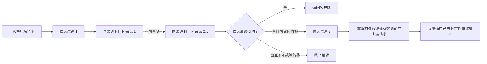
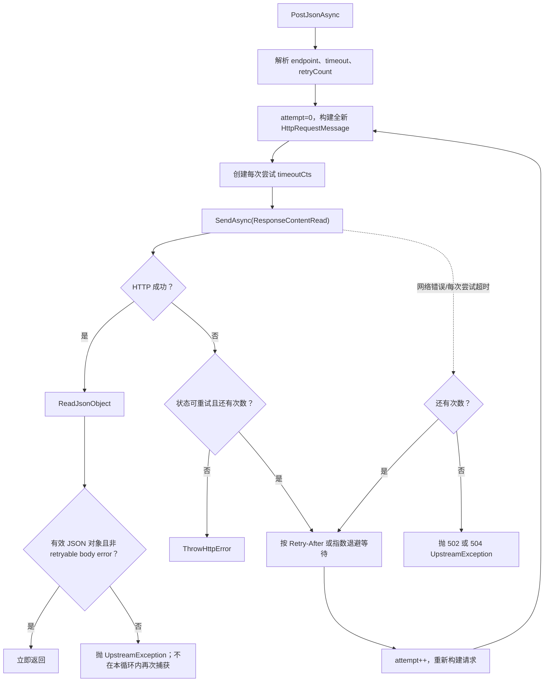
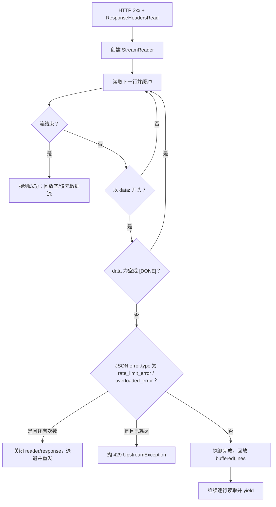
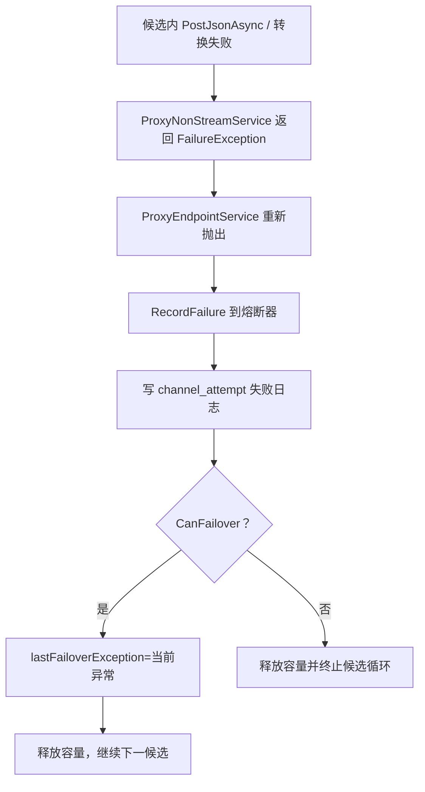
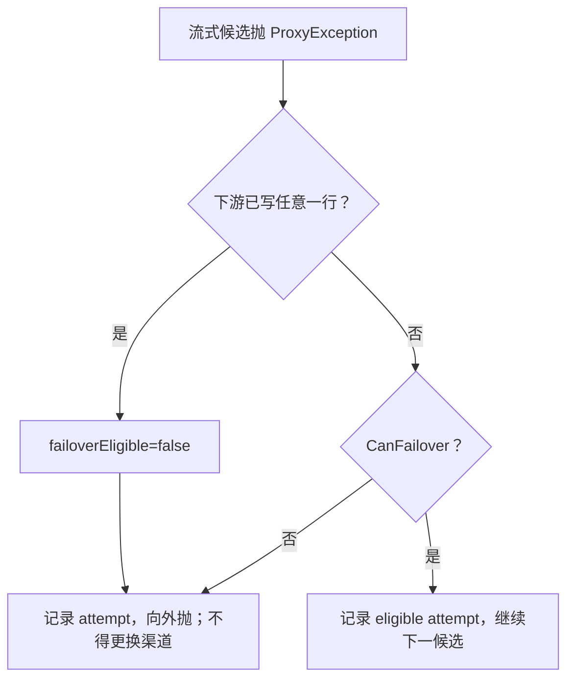

# 故障转移、重试与超时

> 基准提交：`5851939ad08db9465a226cc18489756ff8cd6941`
> 本文区分三类常被混为一谈的行为：同一渠道内重试、候选渠道间故障转移、单次上游尝试超时。

## 1. 适用范围

本文覆盖：

- `HttpUpstreamClient` 的非流式和流式单渠道重试；
- `retry_count`、`timeout_seconds` 的解析与总尝试次数；
- HTTP `Retry-After` 与指数退避；
- HTTP 200 但 JSON/SSE body 表示错误时的处理差异；
- `ProxyFailoverPolicy` 的跨渠道状态集合；
- 流式首字节前和首字节后的故障边界；
- 候选耗尽后的最终错误；
- 重试、故障转移、熔断计数和日志之间的差异。

## 2. 源码入口

| 路径 | 类型/方法 | 责任 |
|---|---|---|
| `opencodex_proxy/src/Libraries/OpenCodex.Core/ExternalIntegrations/HttpUpstreamClient.cs` | `PostJsonAsync`、`DelayBeforeRetry` | 非流式 HTTP 发送、状态重试、网络/超时重试、退避 |
| `opencodex_proxy/src/Libraries/OpenCodex.Core/ExternalIntegrations/HttpUpstreamClient.Streaming.cs` | `StreamJsonAsync`、`ProbeStreamForRetryableError` | 流式 HTTP 发送、首个 SSE data 错误探测、重试 |
| `opencodex_proxy/src/Libraries/OpenCodex.Core/ExternalIntegrations/HttpUpstreamClient.Responses.cs` | `RetryableStreamErrorTypes`、`ReadJsonObject`、`ThrowHttpError` | body 错误识别、错误体解码 |
| `opencodex_proxy/src/Libraries/OpenCodex.Core/ExternalIntegrations/HttpUpstreamClient.Requests.cs` | `TimeoutValue`、`RetryCountValue` | 渠道参数解析 |
| `opencodex_proxy/src/Libraries/OpenCodex.Core/Services/Proxy/ProxyFailoverPolicy.cs` | `CanFailover` | 跨渠道故障转移资格 |
| `opencodex_proxy/src/Libraries/OpenCodex.Core/Services/Proxy/ProxyEndpointService.cs` | 候选循环 catch 分支 | 实际继续下一候选、流式写出边界、attempt 日志 |
| `opencodex_proxy/src/Libraries/OpenCodex.Core/Services/Proxy/ProxyStreamService.cs` | `ConfirmUpstreamStreamStartedAsync` | 跨协议流在下游开始前预取第一行 |
| `opencodex_proxy/src/Libraries/OpenCodex.CoreBase/Abstractions/TrackingProxyStreamWriter.cs` | `HasWritten` | 判断下游是否已经收到流式行 |

## 3. 三层可靠性模型



| 层级 | 配置/判断 | 计数单位 | 是否换渠道 |
|---|---|---|---:|
| 单次超时 | `timeout_seconds` 或默认超时 | 一次 HTTP `SendAsync` 尝试 | 否 |
| 同渠道重试 | `retry_count` + HTTP/网络/SSE 首事件规则 | 同一候选的再次 HTTP 发送 | 否 |
| 跨渠道故障转移 | `ProxyFailoverPolicy` + 流式未写出 | `route_attempt_number` | 是 |

熔断器是旁路状态机制：外层候选最终失败后可能记一次熔断失败，但不会看到同渠道内部每次 HTTP 重试。

## 4. 渠道参数解析

### 4.1 超时

`TimeoutValue(channel["timeout_seconds"], defaultTimeout)` 接受：

| 运行时类型 | 有效条件 | 结果 |
|---|---|---|
| `int` | `>0` | 原值 |
| `long` | `>0 && <= int.MaxValue` | 转 int |
| `double` | `>0 && <= int.MaxValue` | 直接强制转 int，截去小数部分 |
| `string` | 可按 invariant culture 解析为正 int | 解析值 |
| 其他/无效 | 任意 | `defaultTimeout` |

正常数据库路径是 int。每次 HTTP 尝试都新建 linked cancellation token，并调用：

```text
timeoutCts.CancelAfter(TimeSpan.FromSeconds(timeout))
```

这是**每次尝试超时**，不是整条候选或整次客户端请求的总 deadline。

### 4.2 重试次数

`RetryCountValue(channel["retry_count"])`：

| 运行时类型 | 有效条件 | 结果 |
|---|---|---|
| `int` | `>=0` | 原值 |
| `long` | `>=0 && <= int.MaxValue` | 转 int |
| 其他/无效 | 任意 | 3 |

循环条件为：

```text
for attempt = 0; attempt <= retryCount; attempt++
```

因此：

| `retry_count` | 最大 HTTP 发送次数 |
|---:|---:|
| 0 | 1 |
| 1 | 2 |
| 3 | 4 |

`retry_count` 表示“首发之后允许再试几次”，不是总次数。

## 5. 非流式同渠道重试

### 5.1 可重试 HTTP 状态

固定集合 `RetryableStatuses`：

- 429 Too Many Requests；
- 500 Internal Server Error；
- 502 Bad Gateway；
- 503 Service Unavailable；
- 504 Gateway Timeout。

400、401、403、404 等不在同渠道 HTTP 状态重试集合中；它们会立即被 `ThrowHttpError` 转成 `UpstreamException`。其中 400 和 403 后续仍可能触发**跨渠道**故障转移。

### 5.2 网络和超时

| 异常 | 判断 | 未耗尽时 | 耗尽时 |
|---|---|---|---|
| `OperationCanceledException` | 原始客户端 cancellation token 未取消 | 退避后同渠道再试 | 抛 504 `UpstreamException("upstream request timed out")` |
| `OperationCanceledException` | 原始客户端 token 已取消 | catch filter 不匹配，直接传播取消 | 直接传播取消 |
| `HttpRequestException` | 任意 | 退避后同渠道再试 | 抛 502 `UpstreamException("failed to reach upstream: ...")` |

### 5.3 非流式主流程



### 5.4 HTTP 200 + JSON error body

`ReadJsonObject` 会识别以下结构：

```json
{
  "type": "error",
  "error": {
    "type": "rate_limit_error",
    "message": "..."
  }
}
```

或 `error.type=overloaded_error`，并抛出状态 429 的 `UpstreamException`。

关键边界：`PostJsonAsync` 在 `response.IsSuccessStatusCode` 分支直接 `return await ReadJsonObject(...)`，外层只捕获取消和 `HttpRequestException`。因此这里抛出的 429 **不会在同一渠道内部重试**；它会返回 `ProxyNonStreamService`，再由 `ProxyEndpointService` 判断跨渠道故障转移。

这与流式 HTTP 200 + SSE error 的处理不同。

## 6. 退避算法

`DelayBeforeRetry(attempt, response, cancellationToken)` 优先级：

1. `Retry-After: <delta>`：使用 delta，但最大 30 秒；
2. `Retry-After: <date>`：使用 `date - UtcNow`，过去时间视为 0，最大 30 秒；
3. 无 Retry-After：指数退避 `min(500ms × 2^attempt, 8000ms)`。

指数退避序列：

| 已失败 attempt 索引 | 等待 |
|---:|---:|
| 0 | 500 ms |
| 1 | 1000 ms |
| 2 | 2000 ms |
| 3 | 4000 ms |
| 4 及以后 | 最大 8000 ms |

没有随机抖动。等待使用原始客户端 cancellation token，不使用当前尝试的 timeout token；因此退避时间不计入 `timeout_seconds`，但客户端取消会中断等待。

### 6.1 总时间上界的理解

粗略最大时长不是单个 timeout，而是：

```text
(retry_count + 1) × 每次尝试 timeout
+ 各次尝试之间的退避
+ 流式成功建立后实际消费流的时间
```

对于非流式 `ResponseContentRead`，`SendAsync` 会等待响应内容读取完成，因此 timeout 覆盖建立连接、响应头和内容读取阶段。对流式分支则不同，见后文。

## 7. 流式同渠道重试

### 7.1 HTTP 层行为

`StreamJsonAsync` 使用 `HttpCompletionOption.ResponseHeadersRead`：

- 429/500/502/503/504 HTTP 状态按与非流式相同规则重试；
- 网络错误和在接收响应头阶段发生的每次尝试超时可重试；
- 非可重试 HTTP 状态立即转为 `UpstreamException`。

### 7.2 首个 SSE data 探测

HTTP 2xx 后不会立即把流暴露给调用方，而是：

1. 打开响应流与 `StreamReader`；
2. 从头逐行读取；
3. 所有已读行加入 `bufferedLines`；
4. 忽略非 `data:` 行；
5. 空 `data:` 或 `data: [DONE]` 继续读取；
6. 第一条有内容、非 `[DONE]` 的 `data:` 若为 JSON，则检查 retryable error；
7. 若是 `rate_limit_error` 或 `overloaded_error`，关闭本次响应并重试；
8. 若不是，探测结束，稍后原样回放全部缓冲行；
9. 探测到流结束但没有有效 data，也按正常空流处理。



### 7.3 探测范围

只检查第一条有意义的 data 行：

- 第一条 data 是正常 chunk，后续才出现 `rate_limit_error`：不会走同渠道重试；后续错误按普通 SSE 行交给透传/转换层；
- 第一条 data 是 `invalid_request_error`：不是可重试类型，原样回放给后续层；
- 第一条 data 是可重试 error：客户端不会看到该次错误行，除非重试耗尽后由外层生成错误响应。

### 7.4 流式超时边界

每次尝试的 `timeoutCts` 传给 `HttpClient.SendAsync(...ResponseHeadersRead...)`，但：

- `ReadAsStreamAsync` 使用原始客户端 token；
- `ProbeStreamForRetryableError` 使用原始客户端 token；
- 成功建立后的 `ReadLineAsync` 也使用原始客户端 token；
- `break` 离开尝试循环后 `timeoutCts` 被释放。

因此当前 `timeout_seconds` 对流式调用主要约束“发送请求并收到响应头”的阶段，不是整个 SSE 生命周期，也不保证首个 data 行或后续行在该时限内到达。若上游保持连接但长期不产出数据，只能由客户端取消或外层基础设施终止。

## 8. 跨渠道故障转移策略

### 8.1 `ProxyFailoverPolicy.CanFailover`

规则分两段：

1. 若是 `UpstreamException` 且原始状态为 400 或 403，返回 true；
2. 否则必须是 `ProxyException`，且状态为 429、500、502、503 或 504。

决策表：

| 异常类型 | 状态 | 可故障转移 |
|---|---:|---:|
| `UpstreamException` | 400 | 是 |
| `UpstreamException` | 403 | 是 |
| 任意 `ProxyException` | 429/500/502/503/504 | 是 |
| `UpstreamException` | 401 | 否 |
| `UpstreamException` | 404 或其他未列状态 | 否 |
| 本地 `BadRequestException` | 400 | 否 |
| `RoutingException` | 默认 400 | 否 |
| 一般异常 | 任意 | 否 |

第一段之所以检查具体异常类型，是为了区分“上游认为请求无效/禁止”与“OpenCodex 自己的请求语义校验失败”。本地 400 不应通过换渠道掩盖。

### 8.2 每个候选都会重新构造请求

跨渠道故障转移不是重复发送上一候选的 `upstreamRequest`。每个候选都会重新：

- 合并 Responses 同协议头；
- 判断当前候选图片能力并按需 OCR；
- 应用当前 Web Search 模式；
- 应用当前渠道 `compat`；
- 按当前渠道协议和上游模型执行 `ConvertRequest`。

因此不同候选可以使用不同协议、模型名、参数兼容规则和认证头。

### 8.3 非流式外层流程



## 9. 流式首字节边界

### 9.1 判定变量

`TrackingProxyStreamWriter`：

- `PrepareSse` 只调用一次；
- 在源异步序列产出每一行时，先确保准备 SSE，再设置 `HasWritten=true`；
- `ProxyEndpointService` 在 catch 中通过 `trackingWriter?.HasWritten == true` 判定响应是否开始。

### 9.2 跨协议预取

跨协议路径在进入写出循环前调用 `ConfirmUpstreamStreamStartedAsync`：

1. 创建上游行枚举器；
2. 先执行一次 `MoveNextAsync`；
3. 若异常，Dispose 枚举器并将异常抛回候选循环；
4. 若无行，返回空序列；
5. 若有行，构造重放首行和后续行的异步序列。

同协议透传没有额外 `ConfirmUpstreamStreamStartedAsync`，但 `TrackingProxyStreamWriter` 仍会在源序列真正产出第一行前保持响应未开始；而 `HttpUpstreamClient.StreamJsonAsync` 的 HTTP/SSE 首事件探测也发生在首个 yield 前。

### 9.3 流式故障转移公式

```text
failoverEligible = !trackingWriter.HasWritten
                   && ProxyFailoverPolicy.CanFailover(exception)
```



“首字节”在这里是应用层至少写出一行 SSE，不是 TCP 层测量。只准备响应头但未写行的状态在正常 Tracking writer 路径中不会先发生。

### 9.4 首字节后错误

若响应已开始：

- `ProxyEndpointService` 外层 catch 发现 `streamResponseStarted=true` 后重新抛出；
- `ProxyErrorMiddleware` 发现 `HttpResponse.HasStarted` 后也重新抛出；
- 不会追加一个新的 JSON error body；
- 不会切换渠道，因为两个上游流无法安全拼接成一个协议会话。

客户端只能依据已收到的协议错误事件、流中断或缺失终止事件识别失败。

## 10. 候选耗尽

候选循环结束后的两类结果：

### 10.1 有可转移异常

只要至少一个候选因可转移 `ProxyException` 失败，`lastFailoverException` 非空。全部候选失败后重新抛出最后一个异常。

若它是 `UpstreamException`：

- 日志保留原状态和上游 body；
- 客户端统一得到 HTTP 502；
- 错误消息泛化。

例如所有候选最后都返回上游 429，客户端仍得到 502。测试 `ProxyAsync_StreamAllCandidatesFailWith429_DoesNotPrepareSseAndReturns502` 固定了这一外部行为。

### 10.2 没有任何候选真正失败

如果候选全部因熔断 Open、半开名额或容量满被跳过，且没有 `lastFailoverException`，抛出状态 429 的 `RoutingException`：

```text
all enabled channels for model <模型> are at capacity
```

模型为空时消息使用 `requested route`。该消息概括所有准入不可用情况，即使其中部分候选实际是熔断打开，而不只是容量满。

## 11. 重试、故障转移与熔断的状态集合对照

| 状态/错误 | 同渠道 HTTP 重试 | 跨渠道故障转移 | 计入熔断 |
|---|---:|---:|---:|
| HTTP 400 上游 | 否 | 是 | 是 |
| HTTP 401 上游 | 否 | 否 | 否 |
| HTTP 403 上游 | 否 | 是 | 是 |
| HTTP 404 上游 | 否 | 否 | 否 |
| HTTP 429 | 是，直到该渠道耗尽 | 是 | 是 |
| HTTP 500/502/503/504 | 是，直到该渠道耗尽 | 是 | 是 |
| 网络异常 | 是；耗尽后包装 502 | 是 | 包装后是 `UpstreamException` 502，计入 |
| 每次尝试超时 | 是；耗尽后包装 504 | 是 | 包装后计入 |
| HTTP 200 JSON `rate_limit_error` | 否 | 是（包装 429） | 是 |
| HTTP 200 首个 SSE `rate_limit_error`/`overloaded_error` | 是 | 耗尽后是 | 耗尽后计入 |
| 后续 SSE 非首事件错误 | 不由上游客户端重试 | 只有在转换/捕获层抛 ProxyException 且未写出时才可能；原样事件通常不会 | 取决于是否形成 UpstreamException |
| 本地协议 400 | 否 | 否 | 否 |
| 客户端取消 | 否 | 否 | 否 |

## 12. attempt 日志语义

每个获得容量并进入候选处理的外层尝试写一条 `ProxyRequestTypes.Attempt` 子日志：

| 字段 | 含义 |
|---|---|
| `route_attempt_number` | 从 1 开始的外层候选序号 |
| `route_retry_number` | `max(0, route_attempt_number - 1)`；表示跨渠道重试序号 |
| `configured_retry_count` | 当前渠道的同渠道 retry_count 配置原值 |
| `channel_id/name/type` | 当前候选 |
| `upstream_model` | 当前候选上游模型 |
| `status_code` | 候选最终状态，不记录内部每个 HTTP attempt |
| `outcome` | 状态 >=400 或有 error 时为 failed，否则 success |
| `failover_eligible` | 该候选结束时外层是否允许继续 |
| `duration_ms` | 整个候选耗时，包含内部重试与退避 |

所以仅凭 attempt 数量无法得知上游实际 HTTP 调用次数。需要结合渠道 `retry_count`、上游访问日志或额外诊断。

## 13. 错误体与客户端可见性

### 13.1 上游错误体记录

非成功 HTTP 响应：

- body 是合法 JSON：转换为松类型对象；
- body 不是 JSON：保留最多前 2000 字符；
- 空 body：`null`。

封装进 `UpstreamException.Body`，日志进一步放在 `{ "error": body }` 中。

### 13.2 客户端响应

`UpstreamException.ToResponse()` 永远返回：

```json
{
  "error": {
    "message": "An upstream error occurred. Please try again later.",
    "type": "upstream_error"
  }
}
```

端点服务和错误中间件都把客户端 HTTP 状态固定为 502，避免暴露渠道内部状态和响应体。

## 14. 边界与潜在问题

1. **没有整请求总超时。** 多个候选、每候选多次重试和退避可以显著放大总时长。
2. **流式 timeout 不覆盖完整 SSE。** 响应头后或首 data 前长期挂起不受渠道 timeout 约束。
3. **退避无 jitter。** 大量同时间失败的请求可能同步重试。
4. **Retry-After 最大截断到 30 秒。** 即使上游要求更长等待，也会在 30 秒后重试。
5. **HTTP 200 JSON body error 不做同渠道重试。** 与首 SSE error 语义不对称。
6. **只探测第一条有意义 SSE data。** 后续出现过载错误时不会由 `HttpUpstreamClient` 自动重试。
7. **空流不是上游异常。** 跨协议预取发现没有首行会返回空序列；同协议累积器可能在日志中标记 incomplete，但外层不会因此故障转移。
8. **上游 400/403 可切渠道且计熔断。** 这假设错误可能来自特定渠道兼容差异，而非所有渠道都必然失败。
9. **上游 401 不切渠道。** 即使备用渠道密钥可能有效，当前策略仍立即终止；这是源码明确固定的边界。
10. **首字节后无法用 HTTP 状态表达失败。** 调用方必须正确处理 SSE error/中断。
11. **内部 HTTP 重试没有独立子日志。** 性能诊断只能从候选总时长间接推断。

## 15. 测试锚点

### 15.1 策略集合

- `opencodex_proxy/tests/OpenCodex.Api.Tests/ProxyFailoverPolicyTests.cs`
  - `CanFailover_UpstreamTransientOrForbiddenStatus_ReturnsTrue`
  - `CanFailover_UpstreamUnauthorized_DoesNotFailover`
  - `CanFailover_LocalBadRequest_DoesNotFailover`
  - `CanFailover_RoutingException_DoesNotFailover`
  - `CanFailover_NonProxyException_DoesNotFailover`

### 15.2 外层故障转移

- `ProxyEndpointServiceTests.ProxyAsync_NonStreamRetryableFailure_FailsOverToNextChannel`
- `ProxyEndpointServiceTests.ProxyAsync_NonStreamUpstreamBadRequest_FailsOverToNextChannel`
- `ProxyEndpointServiceTests.ProxyAsync_NonStreamBadRequest_DoesNotFailover`
- `ProxyEndpointServiceTests.ProxyAsync_StreamRetryableFailureBeforeFirstByte_FailsOverToNextChannel`
- `ProxyEndpointServiceTests.ProxyAsync_StreamUpstreamBadRequestBeforeFirstByte_FailsOverToNextChannel`
- `ProxyEndpointServiceTests.ProxyAsync_StreamRetryableFailureAfterFirstByte_DoesNotFailover`
- `ProxyEndpointServiceTests.ProxyAsync_StreamAllCandidatesFail_DoesNotPrepareSseAndReturnsJsonError`
- `ProxyEndpointServiceTests.ProxyAsync_StreamFailoverSuccess_PrepareSseOnlyCalledAfterFailoverSucceeds`
- `ProxyEndpointServiceTests.ProxyAsync_NonStreamRetryableFailure_WritesAttemptChildLogs`

### 15.3 流式同渠道重试

- `opencodex_proxy/tests/OpenCodex.Api.Tests/UpstreamStreamErrorRetryTests.cs`
  - `StreamJsonAsync_RateLimitError_RetriesAndSucceedsOnSecondAttempt`
  - `StreamJsonAsync_RateLimitError_RetriesExhausted_ThrowsUpstreamException`
  - `StreamJsonAsync_NormalStream_NotAffectedByProbe`
  - `StreamJsonAsync_OverloadedError_Retries`
  - `StreamJsonAsync_NonRetryableError_NotRetried_TransparentToClient`
  - `PostJsonAsync_RateLimitErrorInBody_ThrowsTooManyRequests`

### 15.4 流式响应边界

- `ProxyStreamServiceTests.StreamAsync_UpstreamFailure_DoesNotPrepareSseBeforeUpstreamReturns`
- `ProxyStreamServiceTests.StreamAsync_ConvertedUpstreamFailure_DoesNotPrepareSseBeforeUpstreamReturns`
- `ProxyStreamServiceTests.StreamAsync_PassThroughSuccess_PrepareSseDeferredUntilFirstLine`
- `ProxyStreamResponseWriterTests` 中终止事件和 `[DONE]` 补写测试

当前测试未直接覆盖：Retry-After 两种格式与 30 秒上限、指数退避时长、非流式网络异常的全部次数、流式响应头后无限等待、超长总请求时长。这些是后续可靠性测试的优先候选。

## 16. 维护检查清单

修改可靠性逻辑时必须同时核对：

- `RetryableStatuses`、`ProxyFailoverPolicy`、`ShouldCountFailure` 三个状态集合是否有意保持差异；
- `retry_count` 仍表示重试次数还是改成总次数；
- 非流式和流式 HTTP 200 body error 是否保持预期一致性；
- 流式首行前仍不准备下游 SSE；
- 任何新增流式预读是否会吞行或重复行；
- 超时 token 是否覆盖预期阶段；
- attempt 日志能否解释新增重试层级；
- 候选耗尽时对客户端仍统一隐藏上游错误详情。
