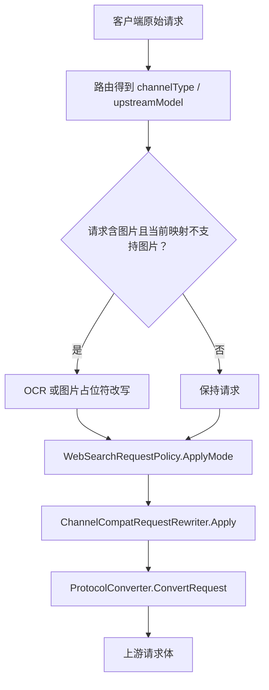
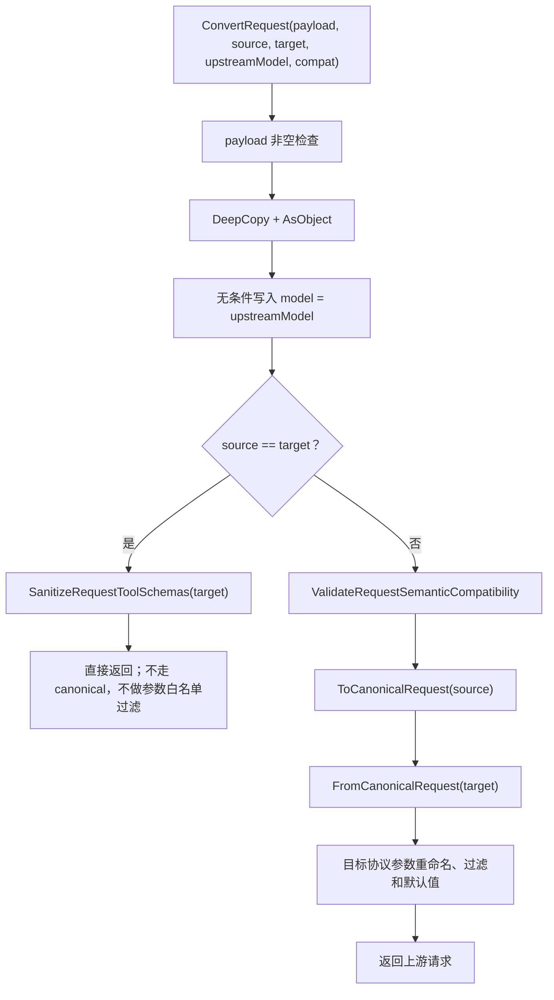
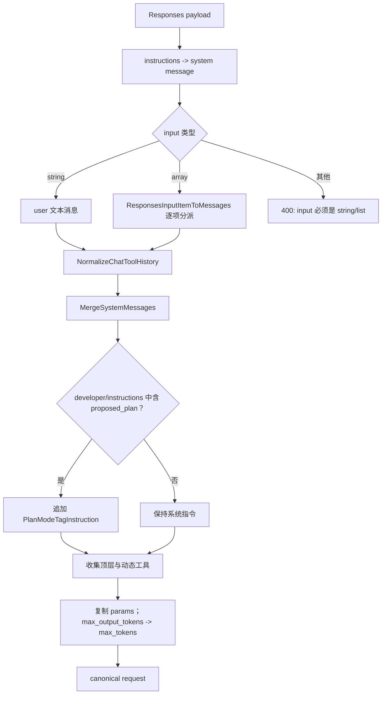
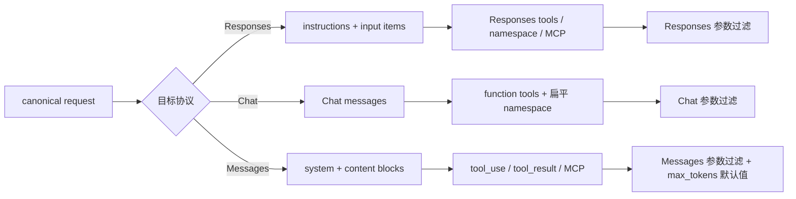

# 请求转换主流程

## 1. 适用范围

本文说明 OpenCodex 在**非流式与流式请求发往上游之前**，如何把客户端入口协议的请求转换为渠道所使用的上游协议。请求体转换本身不区分响应是否流式；`stream` 只是被保留或过滤的普通请求参数，真正的 SSE 处理在 `SseStreamConverter` 中完成。

本文覆盖三种协议：

- **Responses**：OpenAI Responses API，本文记为 `responses`。
- **Chat**：OpenAI Chat Completions API，本文记为 `chat`。
- **Messages**：Anthropic Messages API，本文记为 `messages`。

必须同时区分三个概念：

| 概念 | 在请求阶段的含义 | 对应变量 |
|---|---|---|
| 请求源协议 | 客户端实际提交的协议 | `sourceProtocol`、`ProxyEndpointContext.EntryProtocol` |
| 目标上游协议 | 选中渠道要求的协议 | `targetProtocol`、`channelType` |
| 模型名称 | 客户端模型会先完成路由映射，转换体内使用上游模型 | `upstreamModel` |

> 请求阶段 `ConvertRequest(payload, sourceProtocol, targetProtocol, upstreamModel, compat)` 的方向是“客户端 → 上游”。响应阶段同名参数的读取方式不同，详见 `06-response-conversion/01-response-conversion-main-flow.md`。

本文不负责：

- 渠道筛选、容量、熔断与故障转移；
- Web Search 是否模拟执行；
- 图片 OCR 降级；
- HTTP Header 构造；
- SSE 事件级转换。

这些步骤发生在请求转换之前或之后，但会影响传给转换器的最终载荷。

---

## 2. 源码入口与调用链

### 2.1 外部入口

核心公开入口：

- `opencodex_proxy/src/Libraries/OpenCodex.Core/Protocols/ProtocolConverter.cs`
  - `ProtocolConverter.ConvertRequest`
  - `ProtocolConverter.Responses`
  - `ProtocolConverter.Chat`
  - `ProtocolConverter.Messages`

主要调用方：

- `opencodex_proxy/src/Libraries/OpenCodex.Core/Services/Proxy/ProxyEndpointService.cs`
  - 选定路由后调用 `ChannelCompatRequestRewriter.Apply`；
  - 再调用 `ProtocolConverter.ConvertRequest`；
  - 转换结果成为 `upstreamRequest`。
- `opencodex_proxy/src/Libraries/OpenCodex.Core/Services/ChannelDiagnosticsService.cs`
  - 渠道诊断请求使用同一转换入口。
- `opencodex_proxy/src/Libraries/OpenCodex.Core/Services/Proxy/ProxyOcrService.cs`
  - OCR 子请求或 OCR 结果回注链路也会调用协议转换。

### 2.2 请求转换相关 partial 文件

| 文件 | 责任 |
|---|---|
| `ProtocolConverter.cs` | 入口、深拷贝、模型替换、同协议短路、跨协议编排 |
| `ProtocolConverter.Requests.cs` | 三种请求到/从规范化结构的主实现、参数过滤、格式与停止序列适配 |
| `ProtocolConverter.RequestValidation.cs` | 跨协议语义不可等价参数的前置拒绝 |
| `ProtocolConverter.ResponsesInput.cs` | Responses `input` item 与规范化消息历史互转 |
| `ProtocolConverter.Content.cs` | 文本、图片、文件、多模态 content block 互转 |
| `ProtocolConverter.Tools.cs` | 工具定义、工具选择、namespace、原生工具包装 |
| `ProtocolConverter.ToolHistory.cs` | Responses 历史转 Chat 形态后的调用/结果配对修复 |
| `ProtocolConverter.ToolNames.cs` | namespace 名称展平与恢复 |
| `ProtocolConverter.ToolSchemaSanitizer.cs` | Chat/Messages 目标工具 JSON Schema 清洗 |
| `ProtocolConverter.ApplyPatchTools.cs` | `apply_patch` 参数规范化 |
| `ProtocolConverter.Mcp.cs` | 原生远程 MCP 定义与历史的可转换性 |
| `ProtocolConverter.Reasoning.cs` | reasoning/thinking 历史表示 |
| `ProtocolConverter.Values.cs` | JSON 值规范化、深拷贝、序列化、类型读取 |

---

## 3. 转换前的实际流水线

`ProtocolConverter` 看到的请求不一定等于客户端原始请求。`ProxyEndpointService` 中的顺序是：

1. 根据路由结果确定 `channelType` 与 `upstreamModel`；
2. 必要时对不支持图片的文本模型执行 OCR/占位符改写；
3. 由 `WebSearchRequestPolicy.ApplyMode` 根据 Web Search 模式调整请求；
4. 由 `ChannelCompatRequestRewriter.Apply` 执行渠道兼容配置；
5. 调用 `ProtocolConverter.ConvertRequest`；
6. 将结果交给上游 HTTP 客户端或流式服务。



`ChannelCompatRequestRewriter` 与协议转换器的边界非常重要：

- `default_params`、`rename_params`、`drop_params`、`force_params`、`drop_tool_types`、`unsupported_params` 在**协议转换之前**执行；
- `compat` 对象同时传入 `ConvertRequest`，目前主要供 `apply_patch` 描述兼容使用；
- `_ocxp_preserve_thinking_history` 是兼容改写器注入的内部标记；只有**跨协议且目标为 Messages** 时，`CanonicalToMessagesRequest` 才会读取并移除。若源、目标协议相同，前面的同协议短路会使该字段原样进入上游请求，这是当前实现的泄漏边界。

---

## 4. `ConvertRequest` 的判断顺序

### 4.1 总流程



### 4.2 判断表

| 判断顺序 | 条件 | 动作 | 失败方式 |
|---:|---|---|---|
| 1 | `payload == null` | 停止 | `ArgumentNullException` |
| 2 | 任意输入 | 深拷贝，避免修改调用方对象 | 非对象会在 `AsObject` 中抛 `BadRequestException("expected object")` |
| 3 | 任意输入 | 覆盖 `model` 为路由后的 `upstreamModel` | 无 |
| 4 | 源、目标协议相同 | 仅对 Chat/Messages 工具 schema 做清洗并返回 | 不执行语义校验与目标白名单过滤 |
| 5 | 源、目标协议不同 | 拒绝不可无损表达的语义参数 | `BadRequestException` |
| 6 | 跨协议 | 源协议转规范化请求 | 未知源协议抛 `unsupported source protocol` |
| 7 | 跨协议 | 规范化请求转目标协议 | 未知目标协议抛 `unsupported target protocol` |

### 4.3 同协议短路的特殊性

同协议不是“完整重新序列化”，而是“深拷贝 + 替换模型 + schema 清洗”：

- Responses → Responses：不清洗工具 schema；请求其余字段原样保留。
- Chat → Chat：清洗 `tools[].function.parameters` 或扁平 `tools[].parameters`。
- Messages → Messages：清洗 `tools[].input_schema`。
- 同协议不会调用 `FilterRequestParameters`，因此渠道私有扩展字段可继续透传。
- 同协议不会调用 `ValidateRequestSemanticCompatibility`，因为不存在协议语义降级。
- 同协议也不会执行内部字段清理；例如 compat 注入的 `_ocxp_preserve_thinking_history` 会随请求透传。
- 协议名即使不属于 Responses/Chat/Messages，只要两个字符串完全相同，也会在协议枚举分派前短路返回；因此“未知协议”错误只属于跨协议路径。

这与跨协议路径有意不同，不能把同协议路径理解为“先 canonical 再还原”。

---

## 5. 规范化中间请求结构

跨协议转换统一经过一个以 `Dictionary<string, object?>` 表示的内部结构。它不是公开 DTO，也没有独立类型定义；实际约定由 `ProtocolConverter.Requests.cs`、`ProtocolConverter.ResponsesInput.cs`、`ProtocolConverter.Tools.cs` 共同形成。

```json
{
  "model": "upstream-model",
  "messages": [
    {
      "role": "system|developer|user|assistant|tool",
      "content": "string 或 Chat 风格 content block 数组",
      "tool_calls": [
        {
          "id": "call_1",
          "type": "function",
          "function": {
            "name": "tool_name",
            "arguments": "{\"x\":1}"
          },
          "native_type": "mcp 等内部标记，可选",
          "server_name": "远程 MCP 服务名，可选"
        }
      ],
      "tool_call_id": "call_1",
      "reasoning_content": "内部推理文本，可选",
      "anthropic_thinking_encrypted": "ocxp-thinking-v1:...，可选"
    }
  ],
  "tools": [
    {
      "name": "tool_name",
      "description": "...",
      "parameters": { "type": "object" },
      "native_type": "function|apply_patch|web_search|mcp|其他原生类型",
      "namespace": "命名空间，可选",
      "raw": { "原始 Responses 工具，可选": true },
      "compat": { "兼容配置，可选": true }
    }
  ],
  "tool_choice": "原始选择值或对象",
  "params": {
    "stream": true,
    "temperature": 0.2,
    "max_tokens": 128
  }
}
```

### 5.1 中间结构的设计特征

1. **消息主体采用 Chat 风格**：工具调用在 assistant 消息的 `tool_calls` 中，工具结果是 `role=tool` 消息。
2. **协议专属参数放入 `params`**：源请求除模型、消息、系统指令、工具与工具选择以外的顶层字段都会先复制到这里。
3. **工具定义另行规范化**：工具 schema 统一使用 `parameters`；是否为 Responses 原生工具由 `native_type`、`raw` 等内部字段记录。
4. **原生 MCP 不伪装成普通函数**：使用 `native_type=mcp`、`mcp_kind=remote` 等信息保留语义。
5. **该结构只保证本转换器内部可用**：不是稳定对外协议；新增 partial 逻辑时可能扩充内部字段。

---

## 6. 三种源协议如何进入规范化结构

### 6.1 Responses → canonical

入口：`ResponsesRequestToCanonical`。

执行顺序：

1. 读取 `instructions`；truthy 时生成首个 `role=system` 消息。
2. 检查 Plan Mode 标记；只检查 `instructions` 与 `input` 中 `role=developer` 的 item。
3. 读取 `input`：
   - 字符串：直接变为一个 user 消息；
   - 数组：逐 item 调用 `ResponsesInputItemToMessages`；
   - 其他类型：抛出 `responses input must be a string or list`。
4. 调用 `NormalizeChatToolHistory`：折叠 reasoning、合并连续工具调用、删除孤儿结果、补缺失结果。
5. 调用 `MergeSystemMessages`：所有 system 消息合并到开头，内容以两个换行连接。
6. 若检测到 Plan Mode 标记，调用 `AppendSystemInstruction` 注入固定指令。
7. 从顶层 `tools` 以及 `input` 中的 `additional_tools` / `tool_search_output.tools` 收集工具。
8. 复制其余参数到 `params`；`max_output_tokens` 先内部归一为 `max_tokens`。



### 6.2 Chat → canonical

入口：`ChatRequestToCanonical`。

逻辑相对直接：

- `messages` 中可识别为对象的项逐个深拷贝；非对象项跳过。
- 工具由 `ChatToolsToCanonical` 规范化。
- `tool_choice` 原样进入 canonical，目标序列化时再映射。
- 其余参数复制到 `params`。
- 若仅存在 `max_completion_tokens` 且没有 `max_tokens`，内部改名为 `max_tokens`。
- 不主动修复 Chat 源工具历史；`NormalizeChatToolHistory` 只在 Responses 源路径调用。

### 6.3 Messages → canonical

入口：`MessagesRequestToCanonical`。

执行顺序：

1. `system` truthy 时转换为 canonical system 消息；数组形式也会经 `StringifyContent` 串接为文本。
2. 遍历 `messages`，每个消息调用 `AnthropicMessageToCanonicalMessages`。
3. assistant 内容中的：
   - `text` 等普通块进入 canonical `content`；
   - `tool_use` → assistant `tool_calls`；
   - `mcp_tool_use` → 带 `native_type=mcp` 的 `tool_calls`；
   - `thinking` → `reasoning_content`，带签名的 thinking/redacted_thinking 额外编码为内部字符串。
4. user 内容中的 `tool_result`/`mcp_tool_result` 会切分成独立 canonical tool 消息；前后的普通块保持为 user 消息。
5. `tools` 与 `mcp_servers` 联合规范化，避免丢失原生远程 MCP 服务定义。
6. 其余参数进入 `params`。

一个 Messages user 消息可能拆成多个 canonical 消息，例如“文本 → 工具结果 → 文本”会拆成 user、tool、user 三条，保留顺序。

---

## 7. 规范化结构如何生成目标协议

### 7.1 canonical → Responses

入口：`CanonicalToResponsesRequest`。

主要动作：

- 合并 `params` 到顶层。
- `reasoning_effort` 在没有 `reasoning` 时转成 `reasoning: { effort }`。
- Chat `response_format` 或 Messages `output_config.format` 转成 `text.format`。
- 调用 `MessagesToResponsesInput`：
  - system/developer 内容合并为字符串 `instructions`；
  -普通消息变成 `type=message` item；
  -工具调用与结果变成 `function_call` / `function_call_output`；
  -原生 MCP 历史变成单个 `mcp_call`，结果嵌入 `output` 或 `error`；
  -reasoning 变成 `type=reasoning` item。
- 工具按 Responses function、namespace、原生工具或 MCP 形态还原。
- `max_tokens` → `max_output_tokens`。
- 最后使用 Responses 参数白名单过滤。

### 7.2 canonical → Chat

入口：`CanonicalToChatRequest`。

主要动作：

- 合并 `params`。
- `reasoning.effort` → `reasoning_effort`。
- `text.format` 或 `output_config.format` → `response_format`。
- 复制 canonical 消息允许的字段：`role`、`content`、`tool_calls`、`tool_call_id`、`name`、`reasoning_content`、`anthropic_thinking_encrypted`。
- `developer` 角色降级为 `system`。
- 若消息历史含原生 MCP 调用或结果，明确拒绝；Chat 没有等价原生远程 MCP 历史类型。
- 工具统一输出为 Chat function tool，namespace 名称使用 `__` 展平。
- `max_output_tokens` → `max_tokens`；`stop_sequences` → `stop`。
- 使用 Chat 参数白名单过滤。

### 7.3 canonical → Messages

入口：`CanonicalToMessagesRequest`。

主要动作：

- 合并 `params`。
- `text.format` 或 `response_format` → `output_config.format`。
- 删除 Responses 专属参数。
- system/developer 消息提取到顶层 `system`，以两个换行连接。
- tool 消息转换为 user 消息中的 `tool_result`；原生 MCP 结果使用 `mcp_tool_result`。
- assistant `tool_calls` 变为 `tool_use` 或 `mcp_tool_use` 内容块。
- 若启用 `preserve_thinking_history`，尝试恢复带签名的原始 Anthropic thinking block，并按需自动注入 `thinking` 参数。
- 工具输出为普通 Anthropic tool 或 `mcp_toolset`，并生成 `mcp_servers`。
- `max_output_tokens` → `max_tokens`；`stop` → `stop_sequences`。
- 使用 Messages 参数白名单过滤。
- 如果最终没有 `max_tokens`，设置兼容默认值 `4096`。



---

## 8. 九种协议组合的行为矩阵

| 请求源 → 目标上游 | 是否经 canonical | 关键行为 |
|---|---:|---|
| Responses → Responses | 否 | 深拷贝、替换模型；不清洗 Responses 工具 schema |
| Chat → Chat | 否 | 深拷贝、替换模型、清洗 Chat 工具 schema |
| Messages → Messages | 否 | 深拷贝、替换模型、清洗 Messages 工具 schema |
| Responses → Chat | 是 | input item → Chat 消息；原生工具包装为 function；拒绝有状态参数与原生远程 MCP |
| Responses → Messages | 是 | input item → Anthropic 内容块；系统指令提取；默认 `max_tokens=4096` |
| Chat → Responses | 是 | messages → `instructions`/`input`；Chat function tool → Responses function/namespace |
| Chat → Messages | 是 | Chat content → Anthropic block；拒绝 `reasoning_effort`、`parallel_tool_calls` |
| Messages → Responses | 是 | `system`/blocks/tool history → Responses item；原生 MCP 可保留 |
| Messages → Chat | 是 | Anthropic block → Chat content；原生 MCP 定义或历史拒绝 |

---

## 9. 完整 JSON 转换示例：Responses → Messages

### 9.1 客户端请求

```json
{
  "model": "public-codex",
  "instructions": "你是代码审查助手。",
  "input": [
    {
      "type": "message",
      "role": "user",
      "content": [
        { "type": "input_text", "text": "检查这张截图" },
        {
          "type": "input_image",
          "image_url": "data:image/png;base64,AAAA",
          "detail": "high"
        }
      ]
    }
  ],
  "tools": [
    {
      "type": "function",
      "name": "lookup_issue",
      "description": "查询问题单",
      "parameters": {
        "type": "object",
        "properties": { "id": { "type": "string" } },
        "required": ["id"]
      }
    }
  ],
  "tool_choice": "auto",
  "max_output_tokens": 256,
  "temperature": 0.2,
  "stream": false
}
```

路由结果：

```text
sourceProtocol = responses
targetProtocol = messages
upstreamModel  = claude-upstream
```

### 9.2 概念上的 canonical

```json
{
  "model": "claude-upstream",
  "messages": [
    {
      "role": "system",
      "content": "你是代码审查助手。"
    },
    {
      "role": "user",
      "content": [
        { "type": "text", "text": "检查这张截图" },
        {
          "type": "image_url",
          "image_url": {
            "url": "data:image/png;base64,AAAA",
            "detail": "high"
          }
        }
      ]
    }
  ],
  "tools": [
    {
      "name": "lookup_issue",
      "description": "查询问题单",
      "parameters": {
        "type": "object",
        "properties": { "id": { "type": "string" } },
        "required": ["id"]
      },
      "native_type": "function"
    }
  ],
  "tool_choice": "auto",
  "params": {
    "max_tokens": 256,
    "temperature": 0.2,
    "stream": false
  }
}
```

### 9.3 发往 Messages 上游的请求

```json
{
  "model": "claude-upstream",
  "system": "你是代码审查助手。",
  "messages": [
    {
      "role": "user",
      "content": [
        { "type": "text", "text": "检查这张截图" },
        {
          "type": "image",
          "source": {
            "type": "base64",
            "media_type": "image/png",
            "data": "AAAA"
          }
        }
      ]
    }
  ],
  "tools": [
    {
      "name": "lookup_issue",
      "description": "查询问题单",
      "input_schema": {
        "type": "object",
        "properties": { "id": { "type": "string" } },
        "required": ["id"]
      }
    }
  ],
  "tool_choice": { "type": "auto" },
  "max_tokens": 256,
  "temperature": 0.2,
  "stream": false
}
```

转换中的可见变化：

- 客户端模型被替换为 `claude-upstream`；
- `instructions` 被提取为 Messages 顶层 `system`；
- `input_text` → `text`；
- data URL 被拆成 Anthropic base64 source；
- Responses `parameters` → Messages `input_schema`；
- 字符串 `tool_choice=auto` → `{ "type": "auto" }`；
- `max_output_tokens` → `max_tokens`；
- 图片 `detail=high` 在 Messages 中没有等价字段，因此不输出。

---

## 10. 异常、降级与边界条件

### 10.1 明确抛错

| 条件 | 结果 |
|---|---|
| Responses `input` 既不是字符串也不是数组 | `BadRequestException("responses input must be a string or list")` |
| 未知源协议，且需要执行跨协议 `ToCanonicalRequest` | `unsupported source protocol` |
| 未知目标协议，且需要执行跨协议 `FromCanonicalRequest` | `unsupported target protocol` |
| 存在不可无损表达的语义参数 | 指明参数、源协议与目标协议的 `BadRequestException` |
| 原生远程 MCP 转 Chat | 明确拒绝，不伪装为普通 function |
| 原生 MCP 历史转 Chat | 明确拒绝 |
| MCP 配置会扩大权限或缺少服务地址 | 明确拒绝 |

若两个未知协议字符串相同，`sourceProtocol == targetProtocol` 会先命中同协议短路，不会执行上述未知协议检查。

### 10.2 跳过与信息损失

- 源消息数组中的非对象项通常被跳过，而不是抛错。
- 未知 content block 多数会深拷贝，但目标上游是否接受由上游决定。
- 跨协议后执行目标字段白名单，无法识别的普通参数会被删除。
- Messages 目标缺少 `max_tokens` 时自动设为 `4096`，这是兼容默认值，不是源请求真实语义。
- Chat 与 Messages 都不能完整表达 Responses 所有有状态字段，因此部分字段在前置阶段直接拒绝，而不是静默删除。
- canonical 是有损模型：它优先保持文本、工具调用、结果及常用参数，不保证保留所有协议扩展字段。

### 10.3 深拷贝保证

入口先调用 `DeepCopy`：

- 原始调用方 `payload` 不应因模型替换、参数删除或工具描述改写而被直接修改；
- `JsonElement`/`JsonDocument` 会先转换为普通字典、列表和基础类型；
- 对象键比较使用 `StringComparer.Ordinal`，协议字段大小写敏感。

---

## 11. 测试锚点

### 11.1 主流程与参数结构

文件：`opencodex_proxy/tests/OpenCodex.Api.Tests/ProtocolStructuralCompatibilityTests.cs`

- `ResponsesToChat_ConvertsSupportedParametersWithoutLeakingResponsesOnlyFields`
- `ResponsesToMessages_ConvertsTextFormatToOutputConfig`
- `MessagesToResponses_ConvertsOutputConfigToTextFormat`
- `ResponsesToMessages_WithoutMaxOutputTokens_UsesCompatibilityDefault`
- `MessagesToChat_PreservesToolUseAndToolResultHistory`
- `MessagesToResponses_PreservesToolUseAndToolResultHistory`
- `ResponsesNamedFunctionChoice_MapsToChatNamedFunctionChoice`

### 11.2 内容、工具与动态工具

文件：`opencodex_proxy/tests/OpenCodex.Api.Tests/ProxyCompatibilityTests.cs`

- `ConvertRequest_ResponsesPlanModeTagInDeveloperInput_AppendsPlanInstruction`
- `ConvertRequest_ResponsesPlanModeTagInUserInput_DoesNotAppendPlanInstruction`
- `ConvertRequest_ResponsesInputImage_ConvertsToChatImageUrlContent`
- `ConvertRequest_ResponsesAdditionalToolsOnly_ConvertsToolsForMessages`
- `ConvertRequest_ResponsesToolSearchOutput_ConvertsToChatToolResult`
- `ConvertRequest_ResponsesToolSearchOutput_ExposesDiscoveredNamespaceToolsToChat`
- `ConvertRequest_ResponsesFutureNativeToolInputItems_ConvertToMessagesToolCallAndResult`
- `ConvertRequest_ResponsesApplyPatchHistory_PreservesMultiTurnToolCallsAndResults`

### 11.3 MCP

- `opencodex_proxy/tests/OpenCodex.Api.Tests/NativeMcpProtocolTests.cs`
- `opencodex_proxy/tests/OpenCodex.Api.Tests/NativeMcpConfigurationTests.cs`
- `opencodex_proxy/tests/OpenCodex.Api.Tests/NativeMcpHistoryTests.cs`

重点测试：

- `ResponsesNativeMcpToChat_IsRejectedInsteadOfBecomingFakeFunction`
- `ResponsesNativeMcpToMessages_EmitsMcpToolsetWithoutFunctionWrapper`
- `MessagesMcpHistory_ToResponses_PreservesNativeItem`
- `NativeMcpHistory_ToChat_IsRejected`

---

## 12. 维护检查清单

修改请求转换时至少核对：

1. 新字段是否需要加入 `CopyCommonRequestParams` 的忽略集合；
2. 新字段跨协议是否可等价表达，是否应加入 `UnsupportedSemanticParameters`；
3. 新字段是否加入目标协议参数白名单；
4. 是否同时处理非流式和流式请求，因为两者共享请求转换；
5. 新 Responses input item 是否属于消息、工具调用、工具输出、metadata 还是动态工具定义；
6. 工具历史是否仍满足“assistant tool_calls 后紧跟对应 tool 结果”；
7. namespace 是否能在下游响应中恢复；
8. 原生 MCP 是否被错误降级为普通 function；
9. 同协议短路与跨协议路径是否都需要 schema 清洗；
10. 原始 `payload` 是否仍保持不可变。
