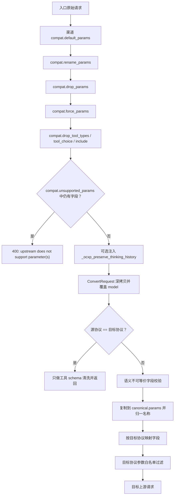
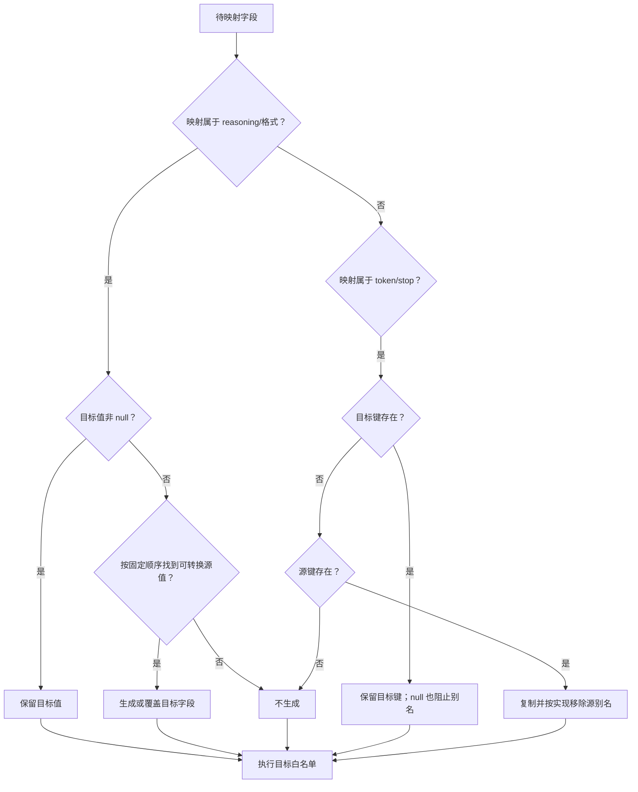

# 参数校验、兼容改写与目标协议过滤

## 1. 适用范围

本文专门说明请求从客户端协议转为上游协议时，顶层参数经历的四类处理：

1. **渠道兼容预改写**：默认值、改名、删除、强制值、工具类型删除；
2. **跨协议语义校验**：无法无损表达的字段直接拒绝；
3. **字段语义映射**：例如 token 上限、结构化输出、停止序列与推理强度；
4. **目标协议白名单过滤**：只向目标上游发送其允许字段。

本文中的方向定义：

- **请求源协议**：客户端入口协议；
- **目标上游协议**：渠道协议；
- 只有跨协议路径会执行 canonical 参数归一和白名单过滤；同协议路径只替换模型并清洗部分工具 schema。

---

## 2. 源码入口

### 2.1 协议转换器

- `opencodex_proxy/src/Libraries/OpenCodex.Core/Protocols/ProtocolConverter.cs`
  - `ConvertRequest`
- `opencodex_proxy/src/Libraries/OpenCodex.Core/Protocols/ProtocolConverter.RequestValidation.cs`
  - `ValidateRequestSemanticCompatibility`
  - `UnsupportedSemanticParameters`
- `opencodex_proxy/src/Libraries/OpenCodex.Core/Protocols/ProtocolConverter.Requests.cs`
  - `CopyCommonRequestParams`
  - `DropResponsesOnlyParamsForMessages`
  - `FilterRequestParameters`
  - `ResponsesFormatToChatResponseFormat`
  - `ChatResponseFormatToResponsesFormat`
  - `CanonicalToResponsesRequest`
  - `CanonicalToChatRequest`
  - `CanonicalToMessagesRequest`

### 2.2 转换器之前的兼容层

- `opencodex_proxy/src/Libraries/OpenCodex.Core/Services/Proxy/ChannelCompatRequestRewriter.cs`
  - `ChannelCompatRequestRewriter.Apply`
- 调用位置：`opencodex_proxy/src/Libraries/OpenCodex.Core/Services/Proxy/ProxyEndpointService.cs`

兼容层不是 `ProtocolConverter` 的 partial，但它决定了转换器实际接收的请求，因此判断顺序必须连在一起理解。

---

## 3. 参数处理总流程



这个顺序产生两个重要结论：

1. 渠道 `drop_params` 可以在语义校验前删除字段；被删除的字段不会再触发跨协议拒绝。
2. 渠道 `force_params` 可以在语义校验前注入字段；若该字段对目标协议不可等价表达，转换器会拒绝。

---

## 4. 渠道兼容预改写的精确顺序

`ChannelCompatRequestRewriter.Apply` 创建深拷贝后依次执行以下规则。

### 4.1 `default_params`

- 仅当请求字典中**没有该键**时写入。
- 键存在但值为 `null` 也视为“已存在”，不会应用默认值。
- 值会递归复制，避免与 compat 配置共享可变对象。

示例：

```json
{
  "payload": { "temperature": null },
  "compat": { "default_params": { "temperature": 0.2, "stream": false } }
}
```

结果：`temperature` 仍为 `null`，新增 `stream=false`。

### 4.2 `rename_params`

对每个 `source -> target`：

1. `target` 为空或源键不存在：跳过；
2. 目标键不存在：复制源值到目标键；
3. 无论目标键是否已存在，都删除源键。

因此若源、目标同时存在，**目标原值优先**，源值被丢弃。

特殊边界：若错误配置为 `source == target`，第 2 步会因目标键已存在而不复制，第 3 步仍会删除该键；也就是“自重命名”实际等价于删除参数。

### 4.3 `drop_params`

删除列出的顶层键。不存在的键无动作。

### 4.4 `force_params`

无条件写入并覆盖已有值。它发生在 `drop_params` 之后，所以可以重新添加刚删除的同名键。

### 4.5 `drop_tool_types`

同时处理三个位置：

- `tools`：删除 `tool.type` 命中的工具；全部删除后移除顶层 `tools`；
- `tool_choice`：字符串值或对象的 `type` 命中时移除整个字段；
- `include`：字符串 item 中只要包含被删除工具类型的文本即删除；全部删除后移除 `include`。

该判断是精确区分大小写的 `StringComparer.Ordinal`；`include` 使用字符串包含匹配。

当前 `drop_tool_types` 只检查顶层 `payload.tools`，不会递归删除 Responses `input.additional_tools.tools` 或 `tool_search_output.tools` 中的动态定义。另外，`tool_choice` 对象只按其顶层 `type` 判断；若选择已被包装为 `{type:"function", function:{name:"web_search"}}`，配置删除 `web_search` 不会仅凭内层名称命中。

### 4.6 `unsupported_params`

- 检查依据是 `result.ContainsKey(key)`，不是值是否非空；
- 因此值为 `null` 的字段也会触发渠道“不支持”错误；
- 报错前会按字典序排序字段名。

错误格式：

```text
upstream does not support parameter(s): FIELD_A, FIELD_B
```

### 4.7 `preserve_thinking_history`

若 compat 中值严格为布尔 `true`，注入：

```json
{ "_ocxp_preserve_thinking_history": true }
```

该字段是内部通信标记：

- 只有跨协议且目标为 Messages 时，才由 `CanonicalToMessagesRequest` 读取；
- 在该路径中随即从发往上游的请求中删除；
- 仅在恢复带签名 Anthropic thinking 历史时生效；
- 它不会进入 Messages 参数白名单。

同协议路径在进入 `CanonicalToMessagesRequest` 前已经短路，因此 Messages → Messages（乃至任意同名协议字符串）会把该内部字段原样发往上游。使用此 compat 时必须把这一透传边界纳入渠道测试。

### 4.8 `enable_apply_patch_prompt_compat`

该 compat 字段不由预改写器直接改请求顶层参数，而是随 `compat` 参数传入 `ProtocolConverter`，供工具转换阶段重写 `apply_patch` 描述。详见 `05-tools/02-apply-patch-native-and-custom-tools.md`。

---

## 5. 跨协议语义校验

入口：`ValidateRequestSemanticCompatibility`。

只有 `sourceProtocol != targetProtocol` 时执行。判断使用 `HasNonNullValue`：

- 键不存在：不拒绝；
- 键存在且值为 `null`：不拒绝；
- `false`、`0`、空字符串、空数组、空对象只要非 `null`：都会拒绝。

错误格式：

```text
request parameter 'PARAMETER' cannot be converted from SOURCE to TARGET without changing request semantics
```

### 5.1 完整拒绝矩阵

| 请求源 | 目标上游 | 被拒绝参数 | 原因大类 |
|---|---|---|---|
| Responses | Chat | `background` | 后台响应生命周期无 Chat 等价物 |
| Responses | Chat | `context_management` | Responses 上下文管理语义无 Chat 等价物 |
| Responses | Chat | `conversation` | 有状态会话引用无 Chat 等价物 |
| Responses | Chat | `previous_response_id` | Responses 链式状态无 Chat 等价物 |
| Responses | Chat | `prompt` | Responses Prompt 对象/引用无 Chat 等价物 |
| Responses | Messages | 上述五项 | 同上 |
| Responses | Messages | `parallel_tool_calls` | Messages 目标无法保证相同并行调用控制语义 |
| Responses | Messages | `reasoning` | Responses reasoning 配置与 Anthropic thinking 不是直接等价关系 |
| Messages | Responses | `container` | Anthropic container 生命周期无 Responses 等价物 |
| Messages | Responses | `thinking` | 显式 thinking 配置不能无损改写成 Responses reasoning |
| Messages | Chat | `container` | Chat 无等价物 |
| Messages | Chat | `thinking`（透传） | 不拒绝；作为兼容扩展参数透传，由 Chat 上游自行解释 |
| Chat | Messages | `parallel_tool_calls` | Messages 无直接等价开关 |
| Chat | Messages | `reasoning_effort` | 无法无损推导 `thinking.type/budget_tokens` |

### 5.2 为什么部分字段是拒绝，部分字段是过滤

原则不是“目标协议不认识就全部报错”，而是区分是否会改变重要语义：

- 会改变状态、上下文连续性、推理行为或工具并行性的字段：拒绝；
- 仅属于可选元数据、缓存提示或目标不接受的扩展字段：可能在白名单阶段删除；
- 有明确等价映射的字段：重命名或重组。

例如 Responses → Messages：

- `reasoning` 被静默移除；
- `include`、`prompt_cache_key`、`store` 被删除；
- `max_output_tokens` 映射为 `max_tokens`；
- `text.format` 映射为 `output_config.format`。

---

## 6. canonical 参数复制规则

入口：`CopyCommonRequestParams(payload, protocol)`。

以下顶层字段不会进入 `params`，因为它们由请求结构转换单独处理：

```text
model
messages
input
instructions
system
tools
tool_choice
```

其余字段全部先深拷贝到 `params`，再进行源协议内部归一。

### 6.1 源协议归一

| 源协议 | 条件 | canonical `params` 中的变化 |
|---|---|---|
| Responses | 有 `max_output_tokens` | 改名为 `max_tokens` |
| Chat | 有 `max_completion_tokens` 且无 `max_tokens` | 改名为 `max_tokens` |
| Chat | 同时有 `max_completion_tokens` 与 `max_tokens` | 两者都暂时保留；目标过滤阶段决定最终字段 |
| Messages | 任意 | 不在复制阶段改名 |

源协议复制不是目标协议过滤。某个字段即使进入 `params`，仍可能在目标序列化时删除。

---

## 7. 目标协议字段映射

### 7.1 目标 Responses

| canonical/源形态 | 输出形态 | 条件 |
|---|---|---|
| `reasoning_effort` | `reasoning: { "effort": ... }` | 仅当尚无 `reasoning` |
| Chat `response_format` | `text.format` | 仅当尚无 `text` |
| Messages `output_config.format` | `text.format` | 仅当尚无 `text` |
| `max_tokens` | `max_output_tokens` | 仅当尚无 `max_output_tokens` |
| system/developer 消息 | `instructions` | 多段以 `\n\n` 连接 |
| `stop`/`stop_sequences` | 无通用转换 | 最终通常因 Responses 白名单删除 |

结构化格式转换：

```jsonc
// Chat
{
  "response_format": {
    "type": "json_schema",
    "json_schema": {
      "name": "answer",
      "schema": { "type": "object" },
      "strict": true
    }
  }
}
```

转为：

```jsonc
// Responses
{
  "text": {
    "format": {
      "type": "json_schema",
      "name": "answer",
      "schema": { "type": "object" },
      "strict": true
    }
  }
}
```

非 `json_schema` 类型只保留 `type`。缺省 `name` 使用 `response`，缺省 `strict` 使用 `true`。

### 7.2 目标 Chat

| canonical/源形态 | 输出形态 | 条件 |
|---|---|---|
| `reasoning.effort` | `reasoning_effort` | 仅当尚无 `reasoning_effort` |
| Responses `text.format` | `response_format` | 仅当尚无 `response_format` |
| Messages `output_config.format` | `response_format` | 仅当尚无 `response_format` |
| `max_output_tokens` | `max_tokens` | 仅当尚无 `max_tokens` |
| `stop_sequences` | `stop` | 仅当尚无 `stop` |
| canonical `developer` 消息 | `system` | Chat 目标角色兼容 |

Responses `json_schema` 格式转 Chat 时嵌入 `json_schema` 子对象；非 schema 类型仅输出 `text` 或 `json_object`。

### 7.3 目标 Messages

| canonical/源形态 | 输出形态 | 条件 |
|---|---|---|
| Responses `text.format` | `output_config.format` | 仅当尚无 `output_config` |
| Chat `response_format` | `output_config.format` | 仅当尚无 `output_config` |
| `max_output_tokens` | `max_tokens` | 仅当尚无 `max_tokens` |
| Chat `stop` 字符串 | `stop_sequences: [stop]` | 仅当尚无 `stop_sequences` |
| Chat `stop` 数组 | 深拷贝为 `stop_sequences` | 同上 |
| 无有效 `max_tokens` | `max_tokens = 4096` | 白名单过滤之后以 `HasNonNullValue` 兜底；键存在但值为 `null` 也会补默认值 |

进入 Messages 前还会主动删除：

```text
include
reasoning
text
previous_response_id
client_metadata
parallel_tool_calls
prompt_cache_key
store
```

其中 `text` 在删除前已尝试转换成 `output_config`；`reasoning` 和 `parallel_tool_calls` 在 Responses → Messages 转换时静默移除。

---

## 8. 目标参数白名单

跨协议输出最后调用 `FilterRequestParameters`。以下集合来自代码中的静态 HashSet，是当前实现的实际允许范围。

### 8.1 Responses 目标允许字段

| 类别 | 字段 |
|---|---|
| 核心 | `model`, `input`, `instructions` |
| 输出控制 | `max_output_tokens`, `text`, `truncation`, `top_logprobs` |
| 采样 | `temperature`, `top_p` |
| 工具 | `tools`, `tool_choice`, `parallel_tool_calls`, `max_tool_calls` |
| 状态/上下文 | `background`, `conversation`, `previous_response_id`, `context_management` |
| Prompt/缓存 | `prompt`, `prompt_cache_key`, `prompt_cache_options`, `prompt_cache_retention` |
| 元数据/存储 | `metadata`, `store`, `user`, `safety_identifier` |
| 服务与安全 | `service_tier`, `moderation` |
| 流式 | `stream`, `stream_options` |
| 推理 | `reasoning` |
| 其他 | `include` |

完整集合：

```text
background, context_management, conversation, include, input, instructions,
max_output_tokens, max_tool_calls, metadata, model, moderation, parallel_tool_calls,
previous_response_id, prompt, prompt_cache_key, prompt_cache_options,
prompt_cache_retention, reasoning, safety_identifier, service_tier, store, stream,
stream_options, temperature, text, tool_choice, tools, top_logprobs, top_p,
truncation, user
```

### 8.2 Chat 目标允许字段

```text
messages, model, audio, frequency_penalty, function_call, functions, logit_bias,
logprobs, max_completion_tokens, max_tokens, metadata, modalities, moderation, n,
parallel_tool_calls, prediction, presence_penalty, prompt_cache_key,
prompt_cache_options, prompt_cache_retention, reasoning_effort, response_format,
safety_identifier, seed, service_tier, stop, store, stream, stream_options,
temperature, thinking, tool_choice, tools, top_logprobs, top_p, user, verbosity,
web_search_options
```

注意：兼容旧 Chat 的 `functions`、`function_call` 仍在白名单中，但跨协议工具主路径输出的是 `tools`、`tool_choice`。
`thinking` 是面向兼容 Chat 且扩展支持 Anthropic 风格思考配置的上游（如 DeepSeek 网关）保留的透传字段；标准 OpenAI Chat 上游如果不认识该字段，可通过渠道 `drop_params: ["thinking"]` 排除。

### 8.3 Messages 目标允许字段

```text
model, messages, max_tokens, cache_control, container, inference_geo, metadata,
output_config, service_tier, stop_sequences, stream, system, temperature,
thinking, tool_choice, tools, top_k, top_p, mcp_servers
```

### 8.4 同协议路径的例外

同协议短路不调用白名单过滤。因此：

- 自定义渠道扩展字段会保留；
- 目标协议白名单只描述**跨协议生成结果**；
- 若希望同协议也删除字段，应使用渠道 `drop_params` 或 `unsupported_params`，不能依赖 `FilterRequestParameters`。

---

## 9. 复杂判断流程：字段冲突时谁优先

这里不能统一理解为“目标键存在就保留”。源码使用两类不同谓词：

- reasoning 与结构化格式映射多用 `HasNonNullValue`：目标键存在但值为 `null`，仍视为没有有效目标值，允许别名覆盖；
- token 与 stop 别名映射用 `ContainsKey`/`TryGetValue`：只要目标键存在，即使值为 `null`，也会阻止别名覆盖。



结构化格式的实际固定优先级如下；“已有”均指目标值**非 null**：

1. 目标 Responses：已有 `text` > 可转换的 `response_format` > 可转换的 `output_config.format`；
2. 目标 Chat：已有 `response_format` > 可转换的 `text.format` > 可转换的 `output_config.format`；
3. 目标 Messages：已有 `output_config` > 可转换的 `text.format` > 可转换的 `response_format`。

token/stop 的优先规则则按键存在性判断：

- 目标已有 `max_output_tokens`/`max_tokens` 键时，不由另一侧 token 别名覆盖，即使目标值为 `null`；
- 目标 Chat 已有 `stop` 键时，不由 `stop_sequences` 覆盖；
- 目标 Messages 已有 `stop_sequences` 键时，不由 `stop` 覆盖；
- 映射完成后仍会执行目标白名单，未允许的源别名最终被删除。

---

## 10. 具体 JSON 示例：Responses → Chat

### 10.1 输入

```json
{
  "model": "public-model",
  "input": "hello",
  "reasoning": { "effort": "high" },
  "text": { "format": { "type": "text" } },
  "include": ["reasoning.encrypted_content"],
  "truncation": "auto",
  "max_output_tokens": 100,
  "temperature": 0.1,
  "stream": false
}
```

假设 `upstreamModel = chat-upstream`。

### 10.2 输出

```json
{
  "model": "chat-upstream",
  "messages": [
    { "role": "user", "content": "hello" }
  ],
  "reasoning_effort": "high",
  "response_format": { "type": "text" },
  "max_tokens": 100,
  "temperature": 0.1,
  "stream": false
}
```

判断过程：

1. `model` 被路由模型覆盖；
2. `reasoning.effort` 映射为 `reasoning_effort`；
3. `text.format.type=text` 映射为 Chat `response_format.type=text`；
4. `max_output_tokens` 经 canonical `max_tokens` 输出为 Chat `max_tokens`；
5. `include`、`truncation` 不在 Chat 白名单，删除；
6. 原 Responses 顶层 `reasoning`、`text` 不会泄漏到 Chat 输出。

若输入额外包含：

```json
{ "previous_response_id": "resp_1" }
```

则不会生成上述输出，而是在 canonical 转换前直接抛错。

---

## 11. 异常与边界条件

### 11.1 空值语义不一致

- 语义校验使用“值非 null”；`previous_response_id: null` 不会触发语义错误。
- compat `unsupported_params` 使用“键存在”；同一个 `previous_response_id: null` 仍可能触发渠道不支持错误。
- `default_params` 也使用“键存在”；已有 null 不会被默认值替换。

### 11.2 白名单不是能力验证

字段在白名单中不代表每个具体上游模型或供应商都支持。白名单只代表协议层允许输出；更细的供应商兼容应配置在 channel compat 中。

### 11.3 静默删除风险

跨协议时，未列入语义拒绝表、也没有显式映射、且不在目标白名单中的字段会被静默删除。新增重要参数时必须判断它应当：

- 映射；
- 拒绝；
- 通过 compat 明确处理；
- 或确认允许静默删除。

### 11.4 Messages 默认 token 上限

`max_tokens=4096` 是实现兼容值：

- 仅跨协议生成 Messages 请求时补充；
- Messages → Messages 同协议透传不会补充；
- 它可能与特定模型的最佳值不同。

### 11.5 `reasoning` 与 `thinking` 不自动互译

当前实现有意拒绝：

- Responses `reasoning` → Messages；
- Messages `thinking` → Responses；
- Chat `reasoning_effort` → Messages。

`Messages → Chat` 是显式例外：`thinking` 作为兼容扩展参数透传，不做 Anthropic 到 Chat 的语义改写。
唯一特殊路径是 `preserve_thinking_history`：它恢复**历史内容块与签名**，不是把本轮推理配置做通用等价转换。

---

## 12. 测试锚点

### 12.1 结构与语义拒绝

`opencodex_proxy/tests/OpenCodex.Api.Tests/ProtocolStructuralCompatibilityTests.cs`

- `ResponsesToChat_ConvertsSupportedParametersWithoutLeakingResponsesOnlyFields`
- `ResponsesToChat_StatefulParametersWithoutEquivalent_AreRejected`
- `RequestParametersThatChangeStateOrModelBehavior_AreRejectedWhenNoEquivalentExists`
- `ResponsesToMessages_ConvertsTextFormatToOutputConfig`
- `MessagesToResponses_ConvertsOutputConfigToTextFormat`
- `ResponsesToMessages_WithoutMaxOutputTokens_UsesCompatibilityDefault`

### 12.2 渠道 compat

`opencodex_proxy/tests/OpenCodex.Api.Tests/ProxyCompatibilityTests.cs`

- `ChannelCompatRequestRewriter_DropToolTypes_RemovesEmptyToolsIncludeAndStringToolChoice`
- `ResponsesProxy_DropToolTypes_StripsImageGenerationToolsOnly`
- `ConvertRequest_ResponsesToMessages_DropsUnsupportedMetadataAndPreservesSharedParams`

### 12.3 schema 与同协议短路

`opencodex_proxy/tests/OpenCodex.Api.Tests/ProxyCompatibilityTests.cs`

- `ConvertRequest_ResponsesToolSchemaWithEmptyStringEnum_SanitizesForChat`
- `ConvertRequest_ChatToolSchemaWithEmptyStringEnum_SanitizesForChat`
- `ConvertRequest_ResponsesToolSchemaWithEmptyStringEnum_SanitizesForMessages`

### 12.4 结构化输出

`opencodex_proxy/tests/OpenCodex.Api.Tests/SseStreamConverterTests.cs`

- `ExtractTextFormat_WithJsonSchemaFormat_ReturnsTextFormatInfo`
- `ExtractTextFormat_WithoutTextFormat_ReturnsNull`
- `ExtractTextFormat_WithNonJsonSchemaType_ReturnsNull`

---

## 13. 维护决策表

新增请求参数时，按以下顺序决定：

| 问题 | 是 | 否 |
|---|---|---|
| 三个协议是否有同义字段？ | 在目标生成函数中映射 | 继续判断 |
| 丢失它是否改变状态、模型行为或访问范围？ | 加入语义拒绝表 | 继续判断 |
| 只是特定供应商不支持？ | 放入 channel compat | 继续判断 |
| 目标协议规范允许透传？ | 加入目标白名单 | 明确接受静默删除并补测试 |
| 同协议也必须移除？ | 使用 compat；不要只改白名单 | 保持同协议扩展透传 |

任何修改都应至少覆盖：非 null 值、null 值、目标字段已存在、源目标字段同时存在、同协议与跨协议五类测试情形。
