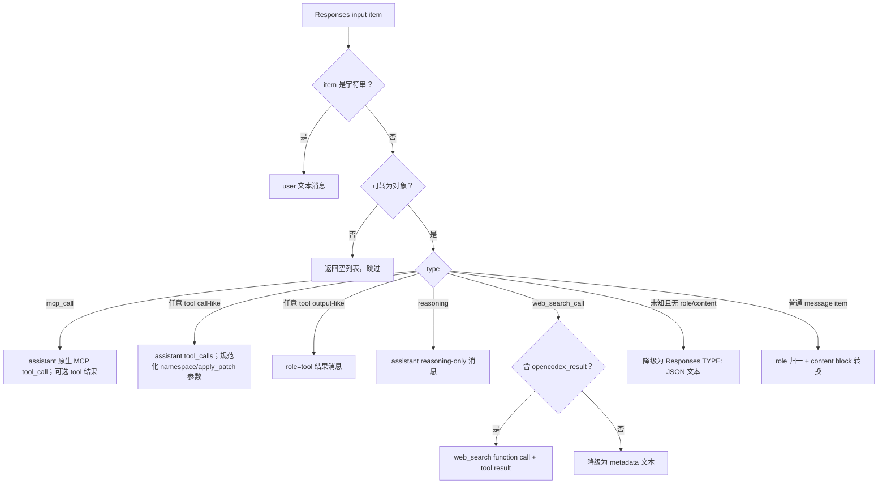
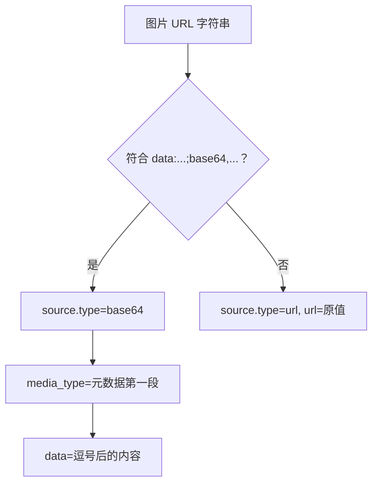
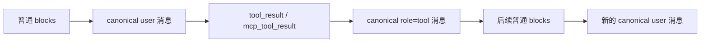
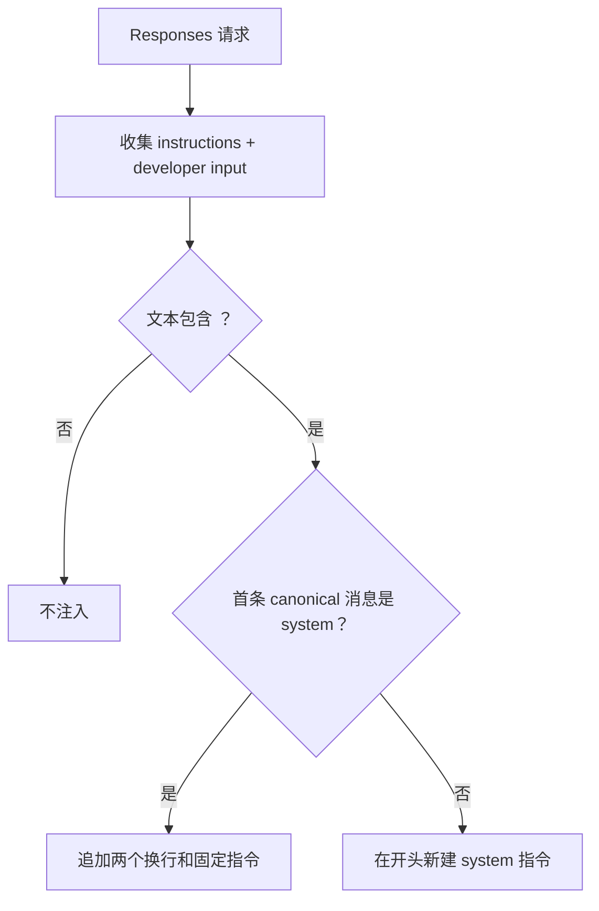

# 内容块、多模态、系统指令与消息历史转换

## 1. 适用范围

本文说明请求转换中的“消息与内容”层，包括：

- Responses `instructions`、`input` item；
- Chat `messages[].content`；
- Anthropic Messages `system`、`messages[].content` block；
- 文本、图片、文件/文档；
- assistant 工具调用与 user 工具结果的消息拆分；
- reasoning/thinking 历史；
- Responses metadata item 的降级表示；
- Plan Mode 系统指令注入。

工具定义本身见 `05-tools/01-tool-contract-name-and-schema.md`；工具历史配对见 `05-tools/03-web-search-mcp-and-tool-history.md`。

---

## 2. 源码入口

| 文件 | 关键符号 | 作用 |
|---|---|---|
| `opencodex_proxy/src/Libraries/OpenCodex.Core/Protocols/ProtocolConverter.ResponsesInput.cs` | `ResponsesInputItemToMessages` | Responses input item → canonical Chat 风格消息 |
| 同上 | `MessagesToResponsesInput` | canonical 消息 → Responses instructions/input |
| 同上 | `MergeSystemMessages` | 汇总多个 system 消息 |
| 同上 | `EnrichMcpToolCallArguments` | 当前为特定 MCP 调用补充参数 |
| `ProtocolConverter.Content.cs` | `ResponsesContentToChatContent` | Responses content block → Chat 内容 |
| 同上 | `ChatContentToResponsesContent` | Chat 内容 → Responses content block |
| 同上 | `AnthropicContentToChatContent` | Anthropic block → Chat 内容 |
| 同上 | `ChatContentToAnthropicContent` | Chat 内容 → Anthropic block |
| 同上 | `StringifyContent` | 将复杂内容折叠为文本 |
| `ProtocolConverter.Requests.cs` | `AnthropicMessageToCanonicalMessages` | Messages 消息拆分为 canonical 消息 |
| 同上 | `CanonicalMessageToAnthropicContent` | canonical assistant 内容与工具调用 → Anthropic block |
| 同上 | `AppendSystemInstruction` | 追加系统指令 |
| 同上 | `ResponsesPayloadHasPlanModeTag` | 限定范围检测 Plan Mode 标签 |
| `ProtocolConverter.Reasoning.cs` | thinking 编解码函数 | 保留 Anthropic 签名 thinking 历史 |
| `ProtocolConverter.Values.cs` | JSON 类型读取、深拷贝 | content 转换的基础设施 |

---

## 3. 内容转换的规范化中间结构

请求消息在 canonical 中使用 Chat 风格：

```json
{
  "role": "user|assistant|system|developer|tool",
  "content": "字符串或 content block 数组",
  "tool_calls": [
    {
      "id": "call_1",
      "type": "function",
      "function": {
        "name": "lookup",
        "arguments": "{\"query\":\"x\"}"
      }
    }
  ],
  "tool_call_id": "call_1",
  "reasoning_content": "推理文本",
  "anthropic_thinking_encrypted": "ocxp-thinking-v1:..."
}
```

这里的 `content` 允许两种形态：

- 只有一个文本块时，很多转换函数会折叠成纯字符串；
- 多模态或多个块时保持列表。

因此消费 canonical 内容时不能假设它始终是数组。

---

## 4. Responses `input` item 分派逻辑

入口：`ResponsesInputItemToMessages`。

### 4.1 总判断流程



### 4.2 具体分支表

| 输入形态 | canonical 输出 | 关键细节 |
|---|---|---|
| 字符串 | 一个 user 消息 | `content` 原样字符串 |
| 非对象 | 无消息 | 静默跳过 |
| `type=mcp_call` | assistant 原生 MCP 调用；有 `output/error` 时再加 tool 消息 | call id 优先 `call_id`、再 `id`、否则生成 |
| tool call-like | assistant `tool_calls` | `name`、`namespace`、`arguments/input/action` 统一 |
| tool output-like | tool 消息；缺少调用 id 时无消息 | id 从 `call_id/tool_call_id/tool_use_id` 读取，三者都为空则静默跳过 |
| `tool_search_output` | tool 消息；当 `output/content` 都为空时，content 回退为 `tools` 数组的 JSON 字符串 | 缺调用 id 时消息仍会跳过，但其中的动态工具定义会由另一条收集路径处理 |
| `reasoning` | reasoning-only assistant 消息 | 可保留 `ocxp-thinking-v1:` 加密内容 |
| `web_search_call` + `opencodex_result` | web_search function 调用与结果 | OpenCodex 模拟搜索续轮专用 |
| `web_search_call` 无结果 | assistant metadata 文本 | 不伪造工具结果 |
| 未知 metadata item | 通常降级为 assistant 文本，也可能无消息 | 丢弃 `content`、`encrypted_content` 后序列化其余字段；若导出后只剩 `type` 或没有可见内容，返回空列表 |
| 普通 message item | 对应角色消息 | `developer` 降为 canonical `system` |

### 4.3 tool call-like 的开放式识别

除已知类型外，未来原生工具也可被识别：

1. `type` 以 `_call` 结尾；
2. 有 `call_id` 或 `id`；
3. 至少有 `name`、`arguments`、`input`、`action` 之一。

`web_search_call` 被排除，走专门分支。

tool output-like 类似：

- 已知集合包括 `function_call_output`、`custom_tool_call_output`、`local_shell_call_output`、`shell_call_output`、`apply_patch_call_output`、`tool_result`、`tool_search_output`；
- 未知类型若以 `_call_output` 结尾，并同时含调用 id 与 `output/content`，也会识别。

---

## 5. Responses、Chat、Messages 文本块映射

### 5.1 Responses → canonical Chat 内容

函数：`ResponsesContentToChatContent`。

| Responses block | canonical/Chat block |
|---|---|
| `input_text` | `{ "type": "text", "text": ... }` |
| `output_text` | `{ "type": "text", "text": ... }` |
| `text` | `{ "type": "text", "text": ... }` |
| `input_image` | `{ "type": "image_url", "image_url": { "url": ..., "detail": ... } }` |
| `input_file` | `{ "type": "file", "file": { file_id/file_data/filename/file_url } }` |
| 未知 block | 深拷贝 |

若转换后只有一个文本块，则折叠为文本字符串。

### 5.2 canonical Chat → Responses

函数：`ChatContentToResponsesContent(content, role)`。

文本 block 类型由角色决定：

- assistant → `output_text`；
- 其他角色 → `input_text`。

| canonical/Chat block | Responses block |
|---|---|
| `text` / `input_text` / `output_text` | 目标角色对应的 text 类型 |
| `image_url` | `input_image`，URL 从 `image_url.url` 提取，保留 `detail` |
| `file` | `input_file`，复制 `file_id/file_data/filename/file_url` |
| 未知 block | 深拷贝 |

即使 assistant content 中出现图片或文件，也仍按 `input_image`/`input_file` 输出，因为 Responses 内容类型没有这里实现的 `output_image`/`output_file` 对应分支。

### 5.3 Anthropic → canonical Chat

函数：`AnthropicContentToChatContent`。

| Anthropic block | canonical/Chat |
|---|---|
| `text` | Chat `text` block |
| `tool_result` | 文本 block；更完整的工具结果拆分由 `AnthropicMessageToCanonicalMessages` 先处理 |
| `image` + URL source | `image_url.url = source.url` |
| `image` + base64 source | `image_url.url = data:MEDIA_TYPE;base64,DATA` |
| `document` + URL source | Chat `file.file_url` |
| `document` + base64 source | Chat `file.file_data` data URL |
| 未知 block | 深拷贝 |

只有一个文本块时同样折叠为字符串。

### 5.4 canonical Chat → Anthropic

函数：`ChatContentToAnthropicContent`。

| canonical/Chat block | Anthropic block |
|---|---|
| `text` / `input_text` / `output_text` | `{ "type": "text", "text": ... }` |
| `image_url` | `{ "type": "image", "source": ... }` |
| `input_image` | 同上 |
| `file` / `input_file` | `{ "type": "document", "source": ... }` |
| 未知 block | 深拷贝 |

空文本不会生成 Anthropic text block。

---

## 6. 图片 source 转换细节

### 6.1 URL 与 data URL

`DataUrlOrUrlToAnthropicSource`：



合法 data URL 必须满足：

- 以 `data:` 开头，大小写不敏感；
- 存在逗号分隔 metadata 与数据；
- metadata 中除 MIME type 外至少有一个 `base64` 标记；
- 数据部分非空。

不满足这些条件时不会报错，而是把整个字符串当远程 URL 输出。

### 6.2 Anthropic source 转回 data URL

`AnthropicSourceToDataUrl`：

- `type=url`：返回 `url`；
- `type=base64`：构造 `data:{media_type};base64,{data}`；
- 缺少 `media_type`：使用 `application/octet-stream`；
- base64 数据为空或未知 source 类型：返回空字符串，图片 block 被跳过。

### 6.3 `detail` 字段

- Responses ↔ Chat 会保留 `detail`；
- Chat/Responses → Messages 时不会输出 `detail`，因为当前 Anthropic source 映射没有等价字段；
- Messages → Chat 也不会生成 `detail`。

---

## 7. 文件与文档转换细节

### 7.1 Chat/Responses 文件 → Anthropic document

`ChatFileToAnthropicDocumentSource` 的优先级：

1. `file_data` 非空：
   - 若是合法 data URL，拆出 MIME type 与 base64；
   - 否则假定数据是裸 base64，MIME type 默认 `application/pdf`。
2. 否则读取 `file_url`，输出 URL source。
3. 两者都没有：返回空对象，该文件块不会输出到 Messages。

`filename` 会映射为 Anthropic document 的 `title`。

### 7.2 Anthropic document → Chat/Responses 文件

- URL source → `file_url`；
- base64 source → `file_data` data URL；
- 未知 source → 空对象，文档块被跳过。

### 7.3 明确边界

- 只有 `file_id` 而没有 `file_data/file_url` 的 Responses 文件，转 Messages 时没有可构建的 document source，会被跳过。
- Anthropic document 的 `title` 在反向转换中没有复制到 `filename`；当前实现可能丢失标题。
- 默认将裸 `file_data` 视为 PDF，若实际类型不是 PDF，调用方应提供完整 data URL。

---

## 8. Anthropic 消息拆分与工具结果

入口：`AnthropicMessageToCanonicalMessages`。

### 8.1 assistant 消息

一个 assistant 消息被整理为单个 canonical assistant 消息：

- 普通内容 block → `content`；
- `tool_use` → `tool_calls`；
- `mcp_tool_use` → 带 `native_type=mcp`、`server_name` 的 `tool_calls`；
- `thinking` 文本串接到 `reasoning_content`；
- thinking/redacted_thinking 中只要有任一 block 含 `signature`，全部 thinking block 编码到 `anthropic_thinking_encrypted`。

工具参数 `input` 会序列化为 JSON 字符串，适配 canonical Chat function call 结构。

### 8.2 user 消息

user 内容按工具结果边界拆分：



`tool_result` 变为：

```json
{
  "role": "tool",
  "tool_call_id": "toolu_1",
  "content": "结果文本",
  "is_error": false
}
```

`mcp_tool_result` 额外带 `native_type=mcp`。

空的普通块分组不会生成空 user 消息。

### 8.3 canonical → Messages

普通工具调用会构造成 assistant `tool_use`。当前内部字典固定包含 `server_name` 键；非 MCP 调用的值为 `null`：

```json
{
  "type": "tool_use",
  "id": "toolu_1",
  "name": "lookup",
  "server_name": null,
  "input": {}
}
```

工具结果重新构造成 user content；普通 `tool_result` 同样固定包含值为 `null` 的 `is_error`：

```json
{
  "role": "user",
  "content": [
    {
      "type": "tool_result",
      "tool_use_id": "toolu_1",
      "is_error": null,
      "content": "result"
    }
  ]
}
```

原生 MCP 使用 `mcp_tool_result`，并带 `is_error`。

这些 null 键不是仅存在于 canonical 的示意字段。当前 `HttpUpstreamClient` 序列化设置不会忽略 null，因此真实 Messages 上游 JSON 也会包含普通 `tool_use.server_name=null` 与普通 `tool_result.is_error=null`。

---

## 9. reasoning 与带签名 thinking 历史

### 9.1 Messages → canonical

带签名 block 不直接塞进 Chat content，而是：

1. 普通 `thinking` 文本合并到 `reasoning_content`；
2. 对请求历史中的 thinking 与 redacted_thinking block 执行 `DeepCopy`，把**完整副本**序列化为 JSON；此处不会裁剪扩展字段；
3. base64 后加前缀：

```text
ocxp-thinking-v1:<base64-json>
```

4. 写入 `anthropic_thinking_encrypted`。

只有响应解析侧的 `MessagesResponseToCanonical` 会把 block 清洗为受控字段集合；请求侧历史编码与响应侧编码不可混为同一策略。

### 9.2 canonical → Responses 历史

assistant 有 `reasoning_content` 时生成 Responses `type=reasoning` item：

- `summary` 保存可读文本；
- 若存在上述编码，写入 `encrypted_content`；
- 否则生成普通 reasoning item，不伪造 Anthropic 签名。

该分支首先要求 `reasoning_content` 非空。因此纯 `redacted_thinking` 即使已生成 `anthropic_thinking_encrypted`，也会在创建 Responses reasoning item 之前被跳过，编码不会进入 Responses 历史。

### 9.3 canonical → Messages 历史

默认只根据可见 content 与工具调用生成 Anthropic 内容。只有渠道 compat 开启 `preserve_thinking_history` 时：

1. 尝试解码 `anthropic_thinking_encrypted`；
2. 将原始 thinking block 插入 assistant content 前部；
3. 若请求本身没有**可转为对象的** `thinking` 参数且确实注入过 thinking block，自动生成：

```json
{
  "thinking": {
    "type": "enabled",
    "budget_tokens": 10000
  }
}
```

若内部 `_ocxp_thinking_budget_tokens` 可转为正整数，则使用该值；否则使用 `10000`。该预算内部字段之后会删除。

“已有 thinking”使用 `TryAsObject` 判断，而不是仅检查键或非 null。若上游参数里已有字符串、数字等非对象 `thinking` 值，仍会被视为未配置，并可能被自动注入的对象覆盖。

---

## 10. 系统指令与角色转换

### 10.1 Responses `instructions`

- truthy 时先形成 canonical system 消息；
- `instructions` 为对象或数组时通过 `StringifyContent` 折叠；
- 与 input 中 developer→system 消息最终经 `MergeSystemMessages` 合并。

### 10.2 Messages `system`

- 进入 canonical 时同样变成 system 消息；
- 转回 Messages 时，所有 canonical system/developer 消息提取到顶层 `system`，以两个换行连接。

### 10.3 Chat `developer`

- Chat 源进入 canonical 时角色原样保留；
- 转 Responses 时 developer 被视为 instructions 的一部分；
- 转 Messages 时 developer 被视为 system 的一部分；
- 转 Chat 目标时 developer 被降为 system。

### 10.4 多个系统消息

Responses 源路径在 canonical 阶段主动合并系统消息，并保证系统消息位于开头。Chat 和 Messages 源路径不统一调用该函数，但目标 Responses/Messages 会在输出时收集全部 system/developer 内容。

---

## 11. Plan Mode 标签判断

### 11.1 判断范围

`ResponsesPayloadHasPlanModeTag` 构建一个仅含以下内容的对象后调用 `StringifyContent`：

- 顶层 `instructions`；
- `input` 数组中所有 `role=developer` 的 item。

然后进行区分大小写的子串检查：

```text
<proposed_plan>
```

用户消息中的同名文本不参与检测，避免用户提问该标签时误触发。

### 11.2 注入位置

若检测到：

- 已有首个 system 消息：在其内容后加两个换行，再加固定 Plan Mode 指令；
- 没有 system 消息：在消息列表开头新建 system 消息。

固定指令要求最终正式计划整体包裹在 `<proposed_plan>` 与 `</proposed_plan>` 中，标签必须独占一行。



---

## 12. `StringifyContent` 的折叠规则

`StringifyContent` 用于系统指令、工具结果、metadata 和无法直接表示的内容：

| 输入 | 输出 |
|---|---|
| `null` | 空字符串 |
| 字符串 | 原字符串 |
| 列表 | 逐项连接，不自动插入分隔符 |
| 列表中的对象有 `text` | 追加其 `text` |
| 列表中的对象有 `content` | 递归处理 `content` |
| 列表中的其他对象 | 当前分支不追加文本 |
| 字典 | JSON 序列化字符串 |
| 数字/布尔等 | `Convert.ToString` |

这意味着：

- 多个文本 block 会直接拼接，不自动添加空格或换行；
- 列表中只含图片 block 时可能得到空字符串；
- 字典整体 stringify 与列表内字典处理不完全相同；
- 工具结果若是复杂对象，是否成为 JSON 取决于其进入该函数时是对象还是 block 列表。

---

## 13. 空内容判断

`IsEmptyChatContent` 用于避免生成无意义消息，并辅助工具历史折叠。

- `null`：空；
- 空字符串：空；
- 列表：所有 block 都空才为空；
- text/input_text/output_text block 的 `text` 非 truthy 时为空；
- 有 `content` 的 block 递归判断；
- 有一般 `text` 字段的 block按 truthy 判断；
- 其他未知对象默认不为空。

因此空图片 URL block仍通常被视为非空，因为它不是文本块，也没有直接 `content/text` 字段；但在具体图片 source 转换函数中可能因 URL 为空而被跳过。

---

## 14. 完整 JSON 示例：Chat → Messages 多模态请求

### 14.1 Chat 输入

```json
{
  "model": "public-chat",
  "messages": [
    {
      "role": "developer",
      "content": "只输出关键结论。"
    },
    {
      "role": "user",
      "content": [
        { "type": "text", "text": "分析图片和 PDF" },
        {
          "type": "image_url",
          "image_url": {
            "url": "data:image/jpeg;base64,BBBB",
            "detail": "low"
          }
        },
        {
          "type": "file",
          "file": {
            "filename": "spec.pdf",
            "file_data": "data:application/pdf;base64,CCCC"
          }
        }
      ]
    }
  ],
  "max_tokens": 300
}
```

### 14.2 Messages 上游输出请求

```json
{
  "model": "claude-upstream",
  "system": "只输出关键结论。",
  "messages": [
    {
      "role": "user",
      "content": [
        { "type": "text", "text": "分析图片和 PDF" },
        {
          "type": "image",
          "source": {
            "type": "base64",
            "media_type": "image/jpeg",
            "data": "BBBB"
          }
        },
        {
          "type": "document",
          "source": {
            "type": "base64",
            "media_type": "application/pdf",
            "data": "CCCC"
          },
          "title": "spec.pdf"
        }
      ]
    }
  ],
  "max_tokens": 300
}
```

注意：

- developer 角色被提升为顶层 system；
- 图片 data URL 被拆成 base64 source；
- `detail=low` 无 Anthropic 等价字段，丢失；
- 文件名变为 document `title`；
- `file_data` data URL 被拆分；
- 客户端模型改为路由后的 `claude-upstream`。

---

## 15. 异常与边界条件

| 场景 | 当前行为 |
|---|---|
| Responses `input` 为对象而非字符串/数组 | 抛 `BadRequestException` |
| content 列表含非对象 item | 多数转换分支跳过 |
| 未知 content block | 多数场景深拷贝；上游可能拒绝 |
| 未知 Responses metadata item | 可能降级成 assistant 文本，造成模型可见上下文变化 |
| 图片 base64 数据为空 | 转 Anthropic 时视为普通 URL或反向时跳过，取决于方向 |
| 只有 `file_id` 的文件转 Messages | 无 source，文件块跳过 |
| 裸 `file_data` | 假定 `application/pdf` |
| 多个 text block stringify | 直接拼接，无自动空格 |
| Anthropic user 中混合普通块与工具结果 | 拆成多条 canonical 消息 |
| Messages 原生 MCP 历史转 Chat | 明确拒绝 |
| 用户文本包含 `<proposed_plan>` | 不触发 Plan Mode 注入 |
| developer/instructions 包含标签 | 触发注入，即使标签只是其中的子串 |

---

## 16. 测试锚点

### 16.1 多模态

`opencodex_proxy/tests/OpenCodex.Api.Tests/ProtocolStructuralCompatibilityTests.cs`

- `ChatToResponses_ConvertsImageUrlToInputImage`
- `ChatToMessages_ConvertsImageUrlToAnthropicImageSource`
- `MessagesToChat_ConvertsImageSourceToImageUrl`

`opencodex_proxy/tests/OpenCodex.Api.Tests/ProxyCompatibilityTests.cs`

- `ConvertRequest_ResponsesInputImage_ConvertsToChatImageUrlContent`

### 16.2 系统指令与 Plan Mode

`opencodex_proxy/tests/OpenCodex.Api.Tests/ProxyCompatibilityTests.cs`

- `ConvertRequest_ResponsesPlanModeTagInDeveloperInput_AppendsPlanInstruction`
- `ConvertRequest_ResponsesPlanModeTagInUserInput_DoesNotAppendPlanInstruction`

### 16.3 工具调用与结果消息

`opencodex_proxy/tests/OpenCodex.Api.Tests/ProtocolStructuralCompatibilityTests.cs`

- `MessagesToChat_PreservesToolUseAndToolResultHistory`
- `MessagesToResponses_PreservesToolUseAndToolResultHistory`

`opencodex_proxy/tests/OpenCodex.Api.Tests/ProxyCompatibilityTests.cs`

- `ConvertRequest_ResponsesToolSearchOutput_ConvertsToChatToolResult`
- `ConvertRequest_ResponsesFutureNativeToolInputItems_ConvertToMessagesToolCallAndResult`
- `ConvertRequest_ResponsesApplyPatchHistory_PreservesMultiTurnToolCallsAndResults`

### 16.4 原生 MCP 历史

`opencodex_proxy/tests/OpenCodex.Api.Tests/NativeMcpHistoryTests.cs`

- `ResponsesMcpCallHistory_ToMessages_PreservesNativeBlocks`
- `MessagesMcpHistory_ToResponses_PreservesNativeItem`
- `NativeMcpHistory_ToChat_IsRejected`

---

## 17. 维护检查清单

新增 content block 或 input item 时应检查：

1. Responses → canonical 是否识别；
2. canonical → Responses 是否能恢复；
3. Chat 与 Messages 两侧是否有等价 block；
4. 单文本块是否会被意外折叠成字符串；
5. 空块是否应跳过；
6. data URL MIME type 与 base64 是否保留；
7. 文件 ID、URL、data、filename/title 各方向是否有损；
8. 未知 item 应深拷贝、降级成文本还是明确拒绝；
9. 工具结果是否保持调用 id 与顺序；
10. reasoning/thinking 签名是否需要跨历史轮次保存；
11. Plan Mode 检测范围是否仍限定于系统/开发者指令；
12. 非流式与流式响应是否对同类 content block 有一致语义。
