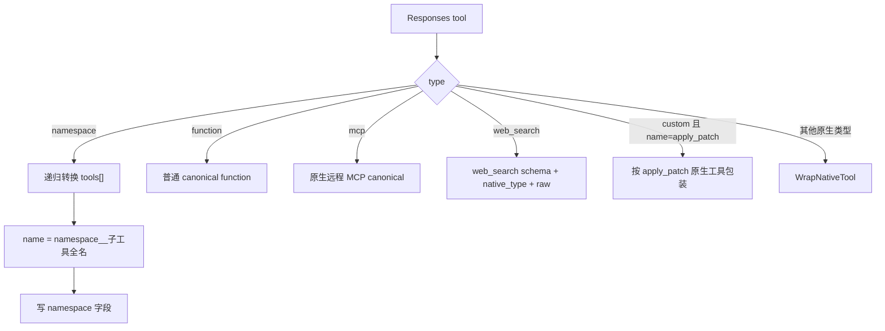
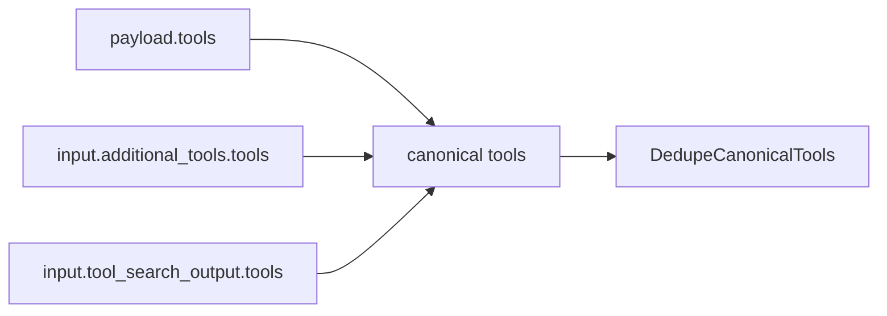
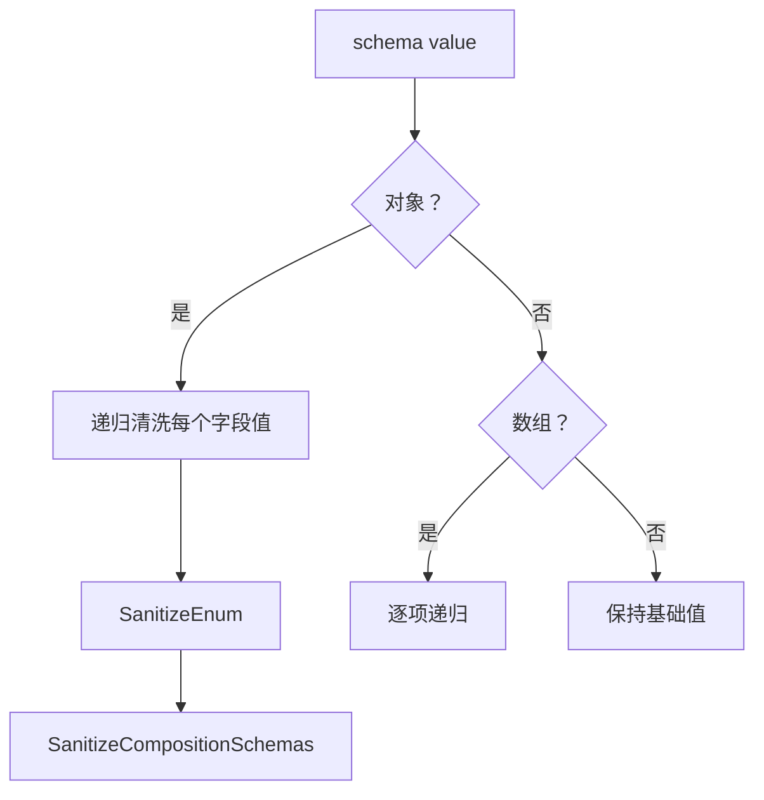

# 工具契约、名称空间、调用形态与 Schema 清洗

## 1. 适用范围

本文说明工具**定义与选择**如何在 Responses、Chat Completions、Anthropic Messages 三种协议间转换，重点覆盖：

- 规范化工具契约；
- Responses namespace 工具递归展开与恢复；
- `.`、`__` 两类历史名称表示；
- Responses 原生工具到 function wrapper 的兼容；
- 请求工具映射表如何帮助响应恢复原生调用类型；
- `tool_choice` 转换；
- JSON Schema 清洗、去重与扁平化；
- 动态 `additional_tools` / `tool_search_output.tools` 的工具收集。

`apply_patch` 特例见下一篇；Web Search、MCP 与工具历史见 `05-tools/03-web-search-mcp-and-tool-history.md`。

---

## 2. 源码入口

| 文件 | 关键符号 |
|---|---|
| `opencodex_proxy/src/Libraries/OpenCodex.Core/Protocols/ProtocolConverter.Tools.cs` | `ResponsesRequestToolsToCanonical`, `ChatToolsToCanonical`, `AnthropicToolsToCanonical`, `CanonicalToolsToResponses`, `CanonicalToolsToChat`, `CanonicalToolsToAnthropic` |
| 同上 | `ResponsesToolToCanonicalItems`, `WrapNativeTool`, `BuildCustomFreeformParameters`, `DedupeCanonicalTools` |
| 同上 | `ToolChoiceToChat`, `ToolChoiceToResponses`, `ToolChoiceToMessages` |
| `ProtocolConverter.ToolNames.cs` | `NamespaceNameToChat`, `NamespaceCallParts`, `SplitFlatNamespaceName`, `ResponsesFunctionCallNameFields` |
| `ProtocolConverter.ToolContracts.cs` | `ResponsesToolCallMapping`, `ResolveResponsesToolCallShape`, `ResponsesToolCallKind` |
| `ProtocolConverter.NativeToolCalls.cs` | 将 canonical 工具调用重建为 Responses item |
| `ProtocolConverter.ToolSchemaSanitizer.cs` | Chat/Messages 工具 schema 递归清洗 |
| `ProtocolConverter.Requests.cs` | 目标协议调用工具转换与最终参数过滤 |
| `ProtocolConverter.Values.cs` | 深拷贝、JSON 规范化、序列化 |

---

## 3. 规范化工具契约

普通函数工具的最小 canonical 形态：

```json
{
  "name": "lookup",
  "description": "查询数据",
  "parameters": {
    "type": "object",
    "properties": {
      "query": { "type": "string" }
    },
    "required": ["query"]
  },
  "native_type": "function"
}
```

原生或兼容工具可能额外带：

```json
{
  "namespace": "mcp__node_repl",
  "native_type": "tool_search|custom|apply_patch|web_search|mcp|其他原生类型",
  "raw": { "原始 Responses 工具定义": true },
  "compat": { "渠道兼容选项": true },
  "mcp_kind": "remote"
}
```

### 3.1 字段语义

| 字段 | 含义 |
|---|---|
| `name` | canonical 工具名；namespace 工具通常是展平后的全名 |
| `description` | 工具描述；缺失时使用空字符串或原生工具默认描述 |
| `parameters` | 统一 JSON Schema；Messages 的 `input_schema` 在此归一 |
| `native_type` | 区分普通 function 与 Responses 原生/自定义工具 |
| `namespace` | 原始 Responses namespace 的显式提示，可选 |
| `raw` | 原始 Responses 原生工具，用于回到 Responses 时无损恢复 |
| `compat` | 当前主要控制 apply_patch prompt 兼容 |

canonical 不是公开协议。工具转换的正确性依赖 `native_type`、`raw` 与请求期映射表共同工作，不能只看 `name`。

---

## 4. 源协议工具定义进入 canonical

### 4.1 Responses 工具

入口：`ResponsesToolToCanonicalItems`。



#### `type=function`

直接映射：

| Responses | canonical |
|---|---|
| `name` | `name` |
| `description` | `description`，缺省空字符串 |
| `parameters` | `parameters`，缺省空对象 |
| — | `native_type=function` |

Responses 工具定义的分派先看 `type`。因此即使 `type=function` 的名称精确为 `apply_patch`，也仍走本分支并得到 `native_type=function`；不会变成原生/custom patch。能够进入 Responses patch 定义特例的，是 `type=custom,name=apply_patch`，或工具类型本身为 `apply_patch`。`apply_patch_update_file` 等非精确名称当然也始终是普通 function。

这一点还形成一个响应恢复边界：`BuildResponsesToolCallMappings` 会跳过全部 `native_type=function`，所以 `type=function,name=apply_patch` 不会留下请求映射。若跨协议上游随后返回同名调用，响应侧无映射 fallback 又会按精确名称把它识别为 `CustomTool`，最终可能恢复成 `custom_tool_call`。也就是说，该输入存在“定义是 function、无映射响应却是 custom”的形态碰撞。

#### `type=namespace`

递归展开所有子工具：

```json
{
  "type": "namespace",
  "name": "mcp__computer_use",
  "tools": [
    { "type": "function", "name": "click" }
  ]
}
```

canonical 结果：

```json
{
  "name": "mcp__computer_use__click",
  "namespace": "mcp__computer_use",
  "native_type": "function"
}
```

嵌套 namespace 会递归拼接：

```text
mcp__computer_use + mouse + click
=> mcp__computer_use__mouse__click
```

#### 未来原生工具

任何未知非 function 类型会进入 `WrapNativeTool`：

- 名称优先显式 `name`，否则使用 `type`；
- 名称中的 `-` 替换为 `_`；
- schema 优先 `parameters`，其次 `input_schema`，其次 `schema`；
- 保留 `raw`，便于返回 Responses 目标时恢复原定义；
- 若无 schema，按工具类型生成兼容 schema。

### 4.2 Chat 工具

入口：`ChatToolsToCanonical`。

支持两种形态：

```json
{ "type": "function", "function": { "name": "lookup", "parameters": {} } }
```

以及扁平旧形态：

```json
{ "name": "lookup", "parameters": {} }
```

处理规则：

1. `type=function` 时读取内层 `function`，否则直接把外层当函数对象；
2. 保留原始名称到 `name`，但 namespace 名称可能改写；
3. 名称中的 `-` 仅用于识别 native type，不会普遍改写输出名称；
4. 精确 `apply_patch` 会标为 `native_type=apply_patch`，其他为 function；
5. 若名称含 `.`，按最后一个点拆 namespace，并将名称转为 `__` 形式；
6. 若名称含合法 `__`，通过 `NamespaceCallParts` 推断 namespace。

示例：

```text
github.search_repositories
=> name = github__search_repositories
=> namespace = github
```

### 4.3 Messages 工具

普通 Anthropic 工具：

```json
{
  "name": "lookup",
  "description": "...",
  "input_schema": { "type": "object" }
}
```

canonical：

```json
{
  "name": "lookup",
  "description": "...",
  "parameters": { "type": "object" },
  "native_type": "function"
}
```

Messages 普通工具名不会在定义转换阶段主动拆 namespace；如果名称本身已经是 `mcp__x__y`，它作为全名保留。响应回 Responses 时可由 `NamespaceCallParts` 从调用名恢复最后一层 namespace。

`type=mcp_toolset` 走原生 MCP 专用转换，而不是普通 function。

---

## 5. 动态工具收集

Responses 工具不一定只出现在顶层 `tools`。`ResponsesRequestToolsToCanonical` 的顺序：

1. 转换顶层 `tools`；
2. 若 `input` 是数组，遍历 item；
3. 对 `type=additional_tools` 或 `type=tool_search_output`，再转换其 `tools`；
4. 最后统一去重。



这使 Codex 延迟工具加载场景可以在转 Chat/Messages 时把已发现工具暴露给上游模型。

---

## 6. 工具去重

`DedupeCanonicalTools` 使用以下键：

```text
scope + U+001F + name
```

其中：

- 普通 function 的 `scope=function`；
- 其他工具的 `scope=native_type`。

结果：

- 相同名称的 function 重复项只保留第一次；
- 同名 function 与同名 custom/native 工具可同时存在，因为 scope 不同；
- 无名称工具被删除；
- 去重不比较 schema、描述或 raw，后出现的更完整定义不会覆盖前项。

---

## 7. canonical 工具输出到目标协议

### 7.1 目标 Responses

入口：`CanonicalToolsToResponses`。

判断顺序：

1. 原生远程 MCP：转 Responses `type=mcp`，失败则明确拒绝；
2. `native_type != function` 且有非空 `raw`：原样深拷贝 `raw`；
3. 有 `namespace`：按 namespace 分组，最终生成一个 Responses namespace tool；
4. 其他：生成普通 Responses function tool。

namespace 分组输出：

```json
{
  "type": "namespace",
  "name": "mcp__computer_use",
  "tools": [
    {
      "type": "function",
      "name": "click",
      "description": "...",
      "parameters": {}
    }
  ]
}
```

非 namespace 工具会在主循环中先加入结果；namespace group 在循环结束后统一追加，因此混合工具列表转 Responses 时，namespace 工具组可能被移动到列表末尾。

生成 bare name 时：

- 先移除显式 `namespace + "__"` 前缀；
- 若剩余名称仍含旧 `.` 分隔符，取最后一段。

### 7.2 目标 Chat

所有可表示工具都输出为 Chat function tool：

```json
{
  "type": "function",
  "function": {
    "name": "namespace__tool",
    "description": "...",
    "parameters": {}
  }
}
```

步骤：

1. 原生远程 MCP：拒绝；
2. 无 `name`：跳过；
3. 可选重写 apply_patch 描述；
4. `NamespaceNameToChat` 把旧 `namespace.tool` 改成 `namespace__tool`；
5. 对 parameters 调用 `SanitizeToolSchema`。

Responses 原生工具在 Chat 中只是兼容 function wrapper。为了在响应时恢复 `tool_search_call`、`custom_tool_call` 等类型，调用方必须保存请求期 `ResponsesToolCallMapping`。

### 7.3 目标 Messages

普通可表示工具输出：

```json
{
  "name": "namespace__tool",
  "description": "...",
  "input_schema": {}
}
```

步骤与 Chat 类似，但：

- 原生远程 MCP 可输出 `mcp_toolset`；
- schema 字段名为 `input_schema`；
- 不包 `type=function/function` 外壳；
- 名称使用 canonical 当前值，不额外调用 `NamespaceNameToChat`。

---

## 8. namespace 名称判断细节

常量：

```text
NamespaceSeparator       = "__"
LegacyNamespaceSeparator = "."
```

### 8.1 `NamespaceNameToChat`

只处理含 `.` 的名称，按**最后一个点**拆分并改为 `__`：

```text
a.b.c => a.b__c
```

已经使用 `__` 的名称原样返回。

### 8.2 `NamespaceCallParts`

优先级：

1. 若显式传入 `namespaceValue` 且非空：
   - 名称以 `namespace__` 开头则移除前缀得到 bare name；
   - 否则 bare name 使用原名。
2. 否则名称含 `.`：按最后一个点拆分。
3. 否则调用 `SplitFlatNamespaceName` 解析 `__`。
4. 均不满足：namespace 为 null，bare name 为原名。

### 8.3 `SplitFlatNamespaceName`

它扫描名称中的所有 `__`，保留最后一个“合法切点”：

- namespace 部分非空；
- bare 部分非空；
- namespace 部分不能以单个 `_` 结尾。

例如：

```text
mcp__computer_use__mouse__click
=> namespace = mcp__computer_use__mouse
=> bareName  = click
```

该策略允许多层 namespace，并尽量避免把名称内部连续下划线误当分隔符。

---

## 9. 请求期 Responses 工具映射表

入口：`BuildResponsesToolCallMappings(payload)`。

目的：Responses 原生工具被包装为 Chat/Messages 普通函数后，上游响应只会返回一个函数名。映射表记录原始契约，供响应转换恢复：

```json
{
  "tool_search": {
    "ChatName": "tool_search",
    "NativeType": "tool_search",
    "ResponsesName": "tool_search",
    "Namespace": null
  }
}
```

构建规则：

- 工具来源包括顶层与动态工具；
- 原生远程 MCP 不进入映射，它不是客户端执行的函数调用；
- `native_type=function` 不进入映射；
- 仅记录 native/custom/web_search/apply_patch 等需要恢复形态的工具；
- key 是 `NamespaceNameToChat(responsesName)` 后的上游函数名。

### 9.1 调用形态解析

`ResolveResponsesToolCallShape` 输出：

| kind | Responses item type | 参数字段 |
|---|---|---|
| Function | `function_call` | `arguments` |
| CustomTool | `custom_tool_call` | `input`；当前主要用于精确识别的 `apply_patch` |
| NativeTool，`native_type=custom/custom_tool` | `custom_tool_call` | `input`；仍走一般 native 参数序列化 |
| NativeTool | `{native_type}_call` 或已带 `_call` 的类型 | 通常 `input` |
| Native `tool_search` | `tool_search_call` | `arguments`，且为 JSON 对象 |

若没有映射：

- 名称精确识别为 apply_patch → CustomTool；
- 其他 → Function。

有映射时，普通 Responses `type=custom`（例如 `exec`）的 `native_type=custom` 会被归类为 NativeTool，但其 item type 仍由 `NativeToolCallItemType` 变为 `custom_tool_call`。只有 apply_patch 的 CustomTool 分支会额外从 JSON wrapper 中提取 patch 自由文本。

因此映射表是恢复未来原生工具的关键；丢失映射时它们会退化为 `function_call`。

---

## 10. `tool_choice` 映射

### 10.1 到 Chat

| canonical/source 值 | Chat 输出 |
|---|---|
| 字符串 | 原字符串 |
| apply_patch choice | named function `apply_patch` |
| web_search choice | named function `web_search` |
| 已是 `{type:function,function:{name}}` | 原对象 |
| `{type:function,name}` | `{type:function,function:{name}}` |
| `{type:custom,name}` | `{type:custom,custom:{name}}` |
| `auto` / `none` | 字符串 `auto` / `none` |
| 对象 `{type:required|tool|any}` 或无具体名的 `{type:function}` | 字符串 `required` |

注意：字符串 `"any"`/`"tool"` 在 `ToolChoiceToChat` 的首个字符串分支中会原样返回；只有上述**对象类型**才归一为 Chat 字符串 `required`。

### 10.2 到 Responses

| 输入 | Responses 输出 |
|---|---|
| 字符串 `any` / `tool` | `required` |
| 其他字符串 | 原值 |
| `{type:tool,name}` | `{type:function,name}` |
| `{type:function|custom,name 或嵌套 name}` | `{type, name}` |
| `auto` / `none` / `required` 对象 | 对应字符串 |
| `any` 对象 | `required` |
| 未识别对象 | 深拷贝 |

### 10.3 到 Messages

| 输入 | Messages 输出 |
|---|---|
| 字符串 `none` | `{ "type": "none" }` |
| 字符串 `required/any/tool` | `{ "type": "any" }` |
| 其他字符串 | `{ "type": "auto" }` |
| apply_patch/web_search choice | `{ "type": "tool", "name": ... }` |
| `{type:tool,name}` | 原对象深拷贝 |
| function/custom named choice | `{ "type": "tool", "name": ... }` |
| 对象 `none` | `{ "type": "none" }` |
| 对象 `required/any` | `{ "type": "any" }` |
| 其他对象 | `{ "type": "auto" }` |

不同协议中“必须调用任意工具”分别使用 `required` 与 `any`；转换器只保留可表达的共同语义。

---

## 11. 工具 JSON Schema 清洗

### 11.1 何时执行

- 跨协议到 Chat：`CanonicalToolsToChat` 对每个 schema 清洗；
- 跨协议到 Messages：`CanonicalToolsToAnthropic` 清洗；
- Chat → Chat 同协议：入口短路后清洗 `tools`；
- Messages → Messages 同协议：入口短路后清洗 `tools`；
- Responses → Responses：不清洗。

### 11.2 目标字段位置

- Chat：优先 `tools[].function.parameters`，兼容扁平 `tools[].parameters`；
- Messages：`tools[].input_schema`。

### 11.3 递归流程



### 11.4 空字符串 enum

若 `enum` 数组含空字符串：

1. 删除所有空字符串；
2. 若仍有值，保留过滤后的 enum；
3. 若没有值，删除 `enum`；
4. 若 schema 原本没有 `type`，尝试根据原 enum 值推断：
   - string → `string`；
   - bool → `boolean`；
   - 数字 → `number`。

示例：

```json
{ "enum": [""] }
```

变为：

```json
{ "type": "string" }
```

### 11.5 composition 清洗

支持键：

```text
anyOf, oneOf, allOf, any_of, one_of, all_of
```

对每个 composition：

1. 递归清洗 variant；
2. 删除 null variant；
3. 按 `JsonDumps(variant)` 去重；
4. 结果为空：删除 composition 键；
5. 只剩一个且该项是对象：删除 composition 键，并把该对象字段合并到外层；外层已有字段优先；
6. 多个：保留清洗后的数组。

示例：

```json
{
  "anyOf": [
    { "type": "string", "enum": [""] },
    { "type": "string" }
  ]
}
```

两个 variant 清洗后都变成 `{ "type": "string" }`，去重并扁平化为：

```json
{ "type": "string" }
```

### 11.6 清洗不做的事情

- 不验证完整 JSON Schema 合法性；
- 不删除供应商不支持的任意关键字；
- 不把 schema 自动设为 `additionalProperties=false`；
- 不修正 `required` 指向不存在 property；
- 不合并语义不同但 JSON 序列化相同顺序以外的等价 schema。

---

## 12. 完整 JSON 示例：Responses namespace → Chat

### 12.1 输入

```json
{
  "model": "public",
  "input": "点击按钮",
  "tools": [
    {
      "type": "namespace",
      "name": "mcp__computer_use",
      "tools": [
        {
          "type": "function",
          "name": "click",
          "description": "点击坐标",
          "parameters": {
            "type": "object",
            "properties": {
              "button": {
                "anyOf": [
                  { "type": "string", "enum": [""] },
                  { "type": "string" }
                ]
              }
            }
          }
        }
      ]
    }
  ],
  "tool_choice": {
    "type": "function",
    "name": "mcp__computer_use__click"
  }
}
```

### 12.2 Chat 上游请求片段

```json
{
  "model": "chat-upstream",
  "messages": [
    { "role": "user", "content": "点击按钮" }
  ],
  "tools": [
    {
      "type": "function",
      "function": {
        "name": "mcp__computer_use__click",
        "description": "点击坐标",
        "parameters": {
          "type": "object",
          "properties": {
            "button": { "type": "string" }
          }
        }
      }
    }
  ],
  "tool_choice": {
    "type": "function",
    "function": { "name": "mcp__computer_use__click" }
  }
}
```

关键判断：

- namespace 递归展开为 `mcp__computer_use__click`；
- Chat 没有 namespace tool 定义，使用扁平 function 名；
- 空字符串 enum 被清洗；
- 两个等价 anyOf variant 去重并扁平化；
- named tool choice 改成 Chat 的内嵌 `function.name` 形态。

---

## 13. 异常与边界条件

| 场景 | 行为 |
|---|---|
| 工具 item 不是对象 | 跳过 |
| 工具无名称 | canonical 去重阶段或目标生成阶段跳过 |
| 多个同 scope+name 工具定义不同 | 只保留第一个，不合并 |
| 原生远程 MCP → Chat | 明确抛错 |
| Responses 原生工具无 raw 且无 schema | 生成通用 `{input:string}` schema |
| local_shell/shell 无 schema | 生成 `{cmd:string}` schema |
| custom 自由格式无 schema | 生成 `{input:string}` schema；grammar 摘要写入生成 schema 的 `properties.input.description`，不是工具顶层 `description` |
| grammar 定义超过 4000 字符 | `properties.input.description` 中的定义片段截断并追加 `...[truncated]` |
| Responses `type=function,name=apply_patch` | 定义保持普通 function；请求映射跳过它，但无映射响应仍可能按名称 fallback 为 `custom_tool_call` |
| `tool_search` 响应参数不是 JSON 对象 | 响应恢复时抛稳定协议错误 |
| 未保存请求工具映射 | 原生工具响应可能退化为普通 `function_call` |
| 名称中多个 `__` | 按最后一个合法切点拆 namespace |
| 名称以异常下划线组合 | 可能不被识别为 namespace，保持普通名 |
| Responses 目标原生工具有 `raw` | 优先原样恢复，可能绕过 canonical schema 变化 |

---

## 14. 测试锚点

### 14.1 Schema 清洗

`opencodex_proxy/tests/OpenCodex.Api.Tests/ProxyCompatibilityTests.cs`

- `ConvertRequest_ResponsesToolSchemaWithEmptyStringEnum_SanitizesForChat`
- `ConvertRequest_ChatToolSchemaWithEmptyStringEnum_SanitizesForChat`
- `ConvertRequest_ResponsesToolSchemaWithEmptyStringEnum_SanitizesForMessages`

### 14.2 namespace

同一测试文件：

- `ConvertRequest_ResponsesNamespaceTool_FlattensForMessages`
- `ConvertRequest_ResponsesDeepNamespaceTool_FlattensRecursivelyForMessages`
- `ConvertResponse_MessagesNamespaceToolUse_RestoresNamespaceInResponses`
- `ConvertResponse_MessagesDeepNamespaceToolUse_RestoresFullNamespaceInResponses`

`opencodex_proxy/tests/OpenCodex.Api.Tests/NativeMcpProtocolTests.cs`

- `LegacyNamespaceMcp_RemainsFlattenedFunctionForChat`

### 14.3 动态与未来工具

`opencodex_proxy/tests/OpenCodex.Api.Tests/ProxyCompatibilityTests.cs`

- `ConvertRequest_ResponsesAdditionalToolsOnly_ConvertsToolsForMessages`
- `ConvertRequest_ResponsesToolSearchOutput_ExposesDiscoveredNamespaceToolsToChat`
- `ConvertRequest_ResponsesFutureNativeToolWithInputSchema_PreservesSchemaForMessages`
- `ConvertResponse_MessagesToolSearchWithRequestMapping_ReturnsNativeToolCall`
- `ConvertResponse_ChatToolSearchWithRequestMapping_ReturnsNativeToolCall`

### 14.4 工具选择

- `ProtocolStructuralCompatibilityTests.ResponsesNamedFunctionChoice_MapsToChatNamedFunctionChoice`
- `ProxyCompatibilityTests.ConvertRequest_ResponsesApplyPatchToolChoice_MapsToChatFunctionChoice`
- `ProxyCompatibilityTests.ConvertRequest_ResponsesWebSearchToolChoice_MapsToChatFunctionChoice`

---

## 15. 维护检查清单

新增工具类型时必须决定：

1. 它是 function、custom 还是原生 provider tool；
2. canonical `native_type` 使用什么稳定值；
3. 无显式 schema 时生成何种兼容 schema；
4. 回到 Responses 时能否使用 `raw` 无损恢复；
5. 转 Chat/Messages 是否会扩大能力或权限；
6. 是否必须进入 `BuildResponsesToolCallMappings`；
7. Responses item type 与参数字段是 `arguments`、`input` 还是专用对象；
8. tool choice 是否有专用类型；
9. namespace 工具是否能递归展平并在响应恢复；
10. schema 清洗是否会改变其合法输入集合；
11. 动态工具来源是否也能收集；
12. 同名去重是否可能保留错误版本。
