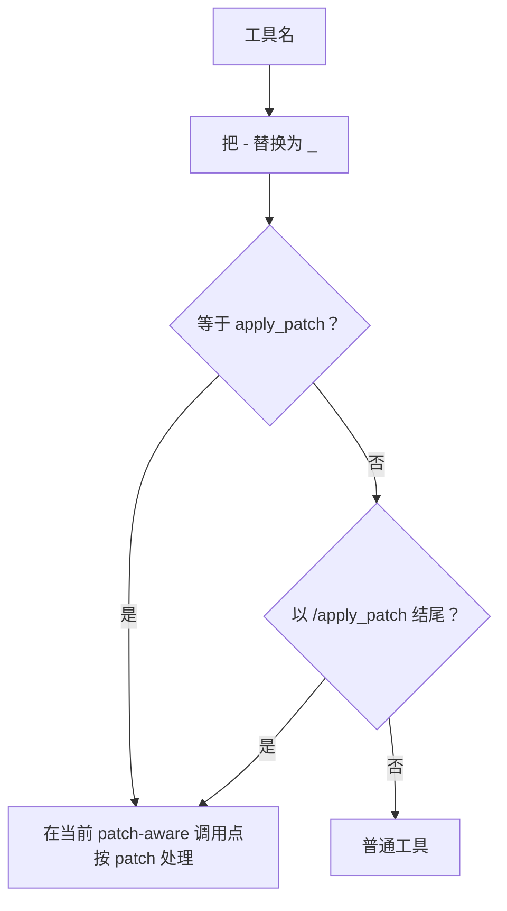
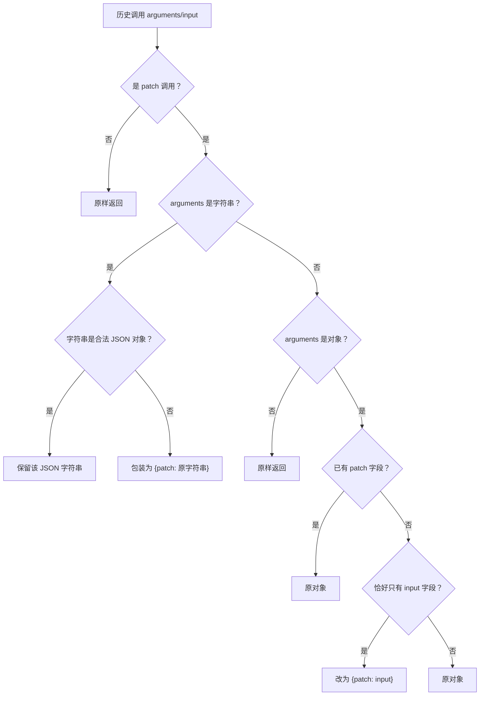

# `apply_patch`：原生工具、自定义工具与兼容函数转换

## 1. 适用范围

本文说明 `apply_patch` 在三种协议之间的完整生命周期：

- Responses 原生 `type=apply_patch`；
- Responses 自由格式 `type=custom,name=apply_patch`；
- Chat/Messages 中作为兼容 function/tool 的定义；
- 请求历史中的 `custom_tool_call`、`function_call` 与结果；
- 上游 Chat/Messages 工具调用恢复成 Responses `custom_tool_call`；
- patch 文本与 JSON 参数的规范化；
- 工具描述兼容改写与 `tool_choice`。

核心目标是：Responses 客户端看到的仍是自由格式 `custom_tool_call.input`，而不暴露上游为了兼容 Chat/Messages 所使用的 `{ "patch": "..." }` JSON wrapper。

---

## 2. 源码入口

| 文件 | 关键符号 |
|---|---|
| `opencodex_proxy/src/Libraries/OpenCodex.Core/Protocols/ProtocolConverter.ApplyPatchTools.cs` | `IsApplyPatchPublic`, `NormalizeApplyPatchArguments`, `ExtractPatchText` |
| `ProtocolConverter.ToolNames.cs` | `IsApplyPatchName` |
| `ProtocolConverter.Tools.cs` | `ResponsesToolToCanonicalItems`, `WrapNativeTool`, `RewriteApplyPatchToolDescription`, `IsApplyPatchToolChoice` |
| `ProtocolConverter.ToolContracts.cs` | `ResolveResponsesToolCallShape`, `CustomToolShape` |
| `ProtocolConverter.NativeToolCalls.cs` | `ResponsesToolCallItemFromToolCall`, `ResponsesToolCallStartedItem` |
| `ProtocolConverter.ResponsesInput.cs` | Responses 历史中的 patch 调用转 canonical |
| `ProtocolConverter.Requests.cs` | canonical 调用转 Messages `tool_use` / Responses item |
| `ProtocolConverter.Responses.cs` | 非流式响应中 patch 调用恢复 |

---

## 3. `apply_patch` 名称识别

底层判断：

```text
name == "apply_patch"
或
name 以 "/apply_patch" 结尾
```

公开辅助方法 `IsApplyPatchPublic` 与多个调用点会先把 `-` 替换为 `_`，因此下列名称可识别：

```text
apply_patch
apply-patch
tools/apply_patch
tools/apply-patch
```

下列名称**不**识别为原生 patch：

```text
apply_patch_update_file
apply_patch_delete_file
mcp__filesystem__apply_patch
my_apply_patch
```

这项边界是有意的：历史结构化函数 `apply_patch_update_file` 必须继续按普通 function 透传，不能被错误改成自由格式 custom tool。

名称辅助函数只回答“这个名字是否像 apply_patch”，并不替代各调用点自己的**类型分派**。尤其 `ResponsesToolToCanonicalItems` 先判断 `tool.type`：`type=function` 会直接结束在普通 function 分支，即使名称精确为 `apply_patch`；只有已经进入 custom/native patch 分支、历史参数规范化或响应 fallback 等 patch-aware 调用点时，下面的名称判断才决定 patch 语义。



---

## 4. 请求工具定义转换

### 4.1 Responses `type=custom,name=apply_patch`

该组合在 `ResponsesToolToCanonicalItems` 中不会走一般 custom schema，而是等价调用：

```text
WrapNativeTool("apply_patch", tool, compat)
```

canonical 关键字段：

```json
{
  "name": "apply_patch",
  "native_type": "apply_patch",
  "parameters": {
    "type": "object",
    "properties": {
      "patch": { "type": "string" }
    },
    "required": ["patch"]
  },
  "raw": {
    "type": "custom",
    "name": "apply_patch"
  }
}
```

即使 Responses custom tool 使用 grammar/freeform 格式，转 Chat/Messages 时也统一暴露一个 JSON 对象 schema，要求上游把 patch 放入 `patch` 字段。

### 4.2 Responses `type=apply_patch`

未知/原生工具通用分支调用 `WrapNativeTool("apply_patch", ...)`，得到相同 canonical schema。

### 4.3 Responses `type=function,name=apply_patch`

该组合先命中 `type=function` 分支，定义保持：

```json
{
  "name": "apply_patch",
  "native_type": "function"
}
```

它不会得到内建 patch schema，也不会进入 `BuildResponsesToolCallMappings`，因为映射构建器跳过普通 function。若上游响应仍返回名为 `apply_patch` 的调用，响应侧在缺少映射时会按精确名称 fallback 为 `CustomTool`，可能向 Responses 客户端输出 `custom_tool_call`。这是定义形态与响应恢复形态的已知碰撞。

### 4.4 Chat 工具名为 `apply_patch`

`ChatToolsToCanonical` 将其标记为：

```json
{
  "name": "apply_patch",
  "native_type": "apply_patch"
}
```

已有参数 schema 会保留；没有 schema 时，源 Chat 工具通常由此前 Responses 转换产生，已经包含 `patch` schema。

### 4.5 Messages 工具名为 `apply_patch`

Messages 普通工具定义进入 canonical 时默认 `native_type=function`。但在典型 Responses 客户端 → Messages 上游链路中，请求期会额外建立 `ResponsesToolCallMapping`，响应恢复时仍可知道它来自 custom/apply_patch。

即使缺少映射，只要返回调用名精确为 `apply_patch`，`ResolveResponsesToolCallShape` 也会识别为 CustomTool。

---

## 5. 兼容上游看到的工具定义

### 5.1 Chat 目标

```json
{
  "type": "function",
  "function": {
    "name": "apply_patch",
    "description": "Apply file edits using patch text...",
    "parameters": {
      "type": "object",
      "properties": {
        "patch": { "type": "string" }
      },
      "required": ["patch"]
    }
  }
}
```

### 5.2 Messages 目标

```json
{
  "name": "apply_patch",
  "description": "Apply file edits using patch text...",
  "input_schema": {
    "type": "object",
    "properties": {
      "patch": { "type": "string" }
    },
    "required": ["patch"]
  }
}
```

### 5.3 为什么使用 JSON wrapper

Responses custom tool 可以返回自由文本 `input`；Chat/Messages 的标准函数工具要求对象参数。转换器采用稳定桥接：

```text
Responses custom input: "*** Begin Patch ..."
            ↕
Chat/Messages arguments: { "patch": "*** Begin Patch ..." }
```

客户端协议层仍看到自由格式；wrapper 只存在于兼容上游边界与 canonical 历史中。

---

## 6. 默认工具描述

`WrapNativeTool` 对 apply_patch 不使用源工具描述，而设置内建描述。它至少强调：

- patch 必须以 `*** Begin Patch` 开始、`*** End Patch` 结束；
- 支持 Add/Update/Delete File；
- Update 使用 `@@` 上下文块与 `+/-` 行；
- 编辑前用 `grep -n` 验证实际内容；
- 上下文必须精确匹配，包括前导空白；
- 应用失败后重新读取文件，不根据记忆猜测。

因此 Responses custom tool 原描述中的“FREEFORM”“不要包 JSON”等措辞不会直接传给只支持 JSON 函数参数的 Chat/Messages 上游，避免模型生成与兼容 schema 冲突的输出。

---

## 7. `enable_apply_patch_prompt_compat` 描述重写

若 canonical 工具满足：

```text
native_type == apply_patch
且
compat.enable_apply_patch_prompt_compat 为 truthy
```

`RewriteApplyPatchToolDescription` 用更严格、示例更完整的描述覆盖默认描述。

重写内容明确要求：

- 工具调用只返回 patch payload；
- 不返回解释、Markdown fence、JSON wrapper 或命令数组；
- 禁止 unified diff 的 `---`、`+++`、`***************`；
- `@@` 行只能是 `@@`，不能带行号范围；
- 先用 `grep -n`/`rg -n` 核对；
- 上下文逐字符匹配；
- 提供 Add/Update/Delete 三个正确示例。

注意这个描述与实际 Chat/Messages 函数参数 schema `{patch:string}` 处于不同抽象层：描述强调 patch 负载本身的格式，传输层仍把它放入 `patch` 字段。

---

## 8. 请求历史中的 patch 参数规范化

入口：`NormalizeApplyPatchArguments(itemType, name, arguments)`。

只有名称识别为 apply_patch，或 item `type=apply_patch_call` 时执行。

### 8.1 判断流程



### 8.2 例子

自由 patch 文本：

```text
*** Begin Patch
*** Add File: a.txt
+hello
*** End Patch
```

规范化为：

```json
{
  "patch": "*** Begin Patch\n*** Add File: a.txt\n+hello\n*** End Patch"
}
```

输入：

```json
{ "input": "*** Begin Patch..." }
```

规范化为：

```json
{ "patch": "*** Begin Patch..." }
```

已经是 JSON 对象字符串：

```json
"{\"patch\":\"*** Begin Patch...\"}"
```

保持为字符串，随后 `JsonDumps` 对字符串不做二次 JSON 编码。

“合法 JSON 对象字符串保持原样”也意味着不会检查或改写其中的键。例如字符串 `{"input":"..."}` 不会变成 `{"patch":"..."}`；若目标工具定义要求 `{patch:string}`，这一历史参数可能与目标 schema 不一致。只有运行时对象（非字符串）且恰好只有 `input` 键时，才会改名为 `patch`。

---

## 9. Responses 历史 → Chat/Messages 历史

例如客户端历史中：

```json
{
  "type": "custom_tool_call",
  "call_id": "call_patch_1",
  "name": "apply_patch",
  "input": "*** Begin Patch\n*** Update File: notes.txt\n@@\n-old\n+new\n*** End Patch"
}
```

先变为 canonical assistant tool call：

```json
{
  "role": "assistant",
  "content": "",
  "tool_calls": [
    {
      "id": "call_patch_1",
      "type": "function",
      "function": {
        "name": "apply_patch",
        "arguments": "{\"patch\":\"*** Begin Patch...\"}"
      }
    }
  ]
}
```

到 Messages 时变成：

```json
{
  "role": "assistant",
  "content": [
    {
      "type": "tool_use",
      "id": "call_patch_1",
      "name": "apply_patch",
      "input": {
        "patch": "*** Begin Patch..."
      }
    }
  ]
}
```

后续 `function_call_output` 变为对应 `tool_result`，调用 id 不变。多轮失败重试不会被合并成一个调用；每个 call/result 对保持独立顺序。

---

## 10. 上游响应恢复为 Responses custom tool call

### 10.1 形态决策

`ResolveResponsesToolCallShape` 返回 CustomTool 的条件包括：

- 请求映射的 `native_type` 是 `apply_patch`；
- 映射的 Responses 原名识别为 apply_patch；
- 没有映射，但上游调用名本身识别为 apply_patch。

CustomTool 目标形态：

```json
{
  "id": "tc_generated",
  "type": "custom_tool_call",
  "status": "completed",
  "call_id": "call_patch",
  "name": "apply_patch",
  "input": "*** Begin Patch..."
}
```

### 10.2 `ExtractPatchText`

Chat/Messages 返回的 arguments 先序列化为字符串，然后尝试提取 patch：

1. 空字符串 → 无结果；
2. 尝试 JSON parse；
3. 根不是对象 → 无结果；
4. 遍历对象属性，遇到以下任一字符串字段即返回其值：
   - `patch`
   - `input`
   - `command`
5. JSON 解析失败 → 把原字符串直接当 patch 文本返回。

若 JSON 合法但没有上述字符串字段，Responses `input` 会退回整个序列化参数字符串，而不是抛错。

### 10.3 Chat 上游例子

上游：

```json
{
  "id": "chatcmpl_patch",
  "choices": [
    {
      "message": {
        "role": "assistant",
        "content": "",
        "tool_calls": [
          {
            "id": "call_patch",
            "type": "function",
            "function": {
              "name": "apply_patch",
              "arguments": "{\"patch\":\"*** Begin Patch\\n*** Add File: test.txt\\n+hello\\n*** End Patch\"}"
            }
          }
        ]
      },
      "finish_reason": "tool_calls"
    }
  ]
}
```

Responses 客户端得到：

```json
{
  "type": "custom_tool_call",
  "status": "completed",
  "call_id": "call_patch",
  "name": "apply_patch",
  "input": "*** Begin Patch\n*** Add File: test.txt\n+hello\n*** End Patch"
}
```

不会把 `{"patch":...}` wrapper 泄漏给 Responses custom tool 客户端。

---

## 11. `tool_choice` 转换

### 11.1 Responses → Chat

下列输入都可映射到 Chat named function：

```json
{ "type": "apply_patch" }
```

或：

```json
{ "type": "custom", "name": "apply_patch" }
```

输出：

```json
{
  "type": "function",
  "function": { "name": "apply_patch" }
}
```

### 11.2 到 Messages

输出：

```json
{ "type": "tool", "name": "apply_patch" }
```

### 11.3 到 Responses

一般 custom choice 会转为：

```json
{ "type": "custom", "name": "apply_patch" }
```

若输入来自 Messages `{type:tool,name:apply_patch}`，通用路径会先映射为 Responses function choice；工具定义和响应形态仍可通过名称识别恢复 custom 语义。

---

## 12. legacy `apply_patch_*` 的保护规则

结构化历史函数必须保持普通函数：

```json
{
  "type": "function",
  "name": "apply_patch_update_file",
  "parameters": {
    "type": "object",
    "properties": { "path": { "type": "string" } }
  }
}
```

转换到 Chat 后仍保持 `path` schema，不替换为 `patch` schema；其响应回 Responses 时仍为：

```json
{
  "type": "function_call",
  "name": "apply_patch_update_file",
  "arguments": "{\"path\":\"data.json\",...}"
}
```

不会生成：

- `custom_tool_call`；
- `cmd` 参数；
- `OPENCODEX_PATCH` 包装；
- 自由格式 `input`。

---

## 13. 完整请求与响应往返示例

### 13.1 Responses 客户端请求

```json
{
  "model": "codex",
  "input": "创建 hello.txt",
  "tools": [
    {
      "type": "custom",
      "name": "apply_patch",
      "format": {
        "type": "grammar",
        "syntax": "lark",
        "definition": "start: begin_patch"
      }
    }
  ],
  "tool_choice": { "type": "apply_patch" }
}
```

### 13.2 Chat 上游请求片段

```json
{
  "model": "chat-upstream",
  "messages": [
    { "role": "user", "content": "创建 hello.txt" }
  ],
  "tools": [
    {
      "type": "function",
      "function": {
        "name": "apply_patch",
        "parameters": {
          "type": "object",
          "properties": { "patch": { "type": "string" } },
          "required": ["patch"]
        }
      }
    }
  ],
  "tool_choice": {
    "type": "function",
    "function": { "name": "apply_patch" }
  }
}
```

### 13.3 Chat 上游响应

```json
{
  "id": "chat_1",
  "model": "chat-upstream",
  "choices": [
    {
      "message": {
        "role": "assistant",
        "content": null,
        "tool_calls": [
          {
            "id": "call_1",
            "type": "function",
            "function": {
              "name": "apply_patch",
              "arguments": "{\"patch\":\"*** Begin Patch\\n*** Add File: hello.txt\\n+hello\\n*** End Patch\"}"
            }
          }
        ]
      },
      "finish_reason": "tool_calls"
    }
  ]
}
```

### 13.4 Responses 客户端响应 item

```json
{
  "type": "custom_tool_call",
  "status": "completed",
  "call_id": "call_1",
  "name": "apply_patch",
  "input": "*** Begin Patch\n*** Add File: hello.txt\n+hello\n*** End Patch"
}
```

---

## 14. 异常与边界条件

| 场景 | 行为 |
|---|---|
| `apply_patch_update_file` | 普通 function，不触发 custom 语义 |
| `mcp__x__apply_patch` | 当前名称规则不识别为 patch |
| 自由 patch 字符串 | 包装为 `{patch:string}` 发兼容上游 |
| 合法 JSON 对象字符串 | 保持字符串，避免二次编码 |
| 参数对象只有 `input` | 改名为 `patch` |
| 参数对象含多个字段且无 `patch` | 原样保留 |
| 响应 arguments 是非法 JSON | 整段字符串作为 Responses `input` |
| 响应 arguments 是合法非对象 JSON | 无法提取，保留序列化字符串 |
| 响应对象 `patch` 非字符串 | 不提取，保留整个参数字符串 |
| 请求映射丢失但名称精确为 apply_patch | 仍可按 custom tool 恢复 |
| 名称被上游改写 | 可能退化为 function_call |
| compat 描述重写开启 | 只改描述，不改调用 id、schema 或输出 item 类型 |

---

## 15. 测试锚点

文件：`opencodex_proxy/tests/OpenCodex.Api.Tests/ProxyCompatibilityTests.cs`

### 15.1 工具定义与选择

- `ConvertRequest_ResponsesApplyPatchCustomTool_ExpandsForMessages`
- `ConvertRequest_ResponsesApplyPatchGrammarTool_UsesPatchSchemaForChat`
- `ConvertRequest_ResponsesNativeApplyPatchTool_UsesPatchSchemaForChat`
- `ConvertRequest_ResponsesApplyPatchToolChoice_MapsToChatFunctionChoice`
- `ConvertRequest_ResponsesLegacyApplyPatchFunctionTool_RemainsFunctionForChat`

### 15.2 非流式响应恢复

- `ConvertResponse_ChatLegacyApplyPatchProxy_PassesThroughAsFunctionCall`
- `ConvertResponse_ChatApplyPatchText_ReturnsCustomToolCall`
- `ConvertResponse_ChatApplyPatchToolCall_ReturnsCustomToolCallInputToClient`
- `ConvertResponse_MessagesLegacyApplyPatchToolUse_PassesThroughAsFunctionCall`

### 15.3 历史

- `ConvertRequest_ResponsesApplyPatchHistory_PreservesMultiTurnToolCallsAndResults`

### 15.4 流式一致性锚点

`opencodex_proxy/tests/OpenCodex.Api.Tests/SseStreamConverterTests.cs`

- `ToolUse_ApplyPatchTool_UsesCustomToolCallOutput`
- `ToolUse_ApplyPatchTool_StreamsCustomToolCallInputDeltas`
- `Chat_ApplyPatchTool_StreamsCustomToolCallInputDeltasAndDone`
- `Chat_ApplyPatchTool_DecodesEscapedPatchDeltas`
- `Chat_MixedApplyPatchAndFunctionTools_StreamCorrectEventTypesAndOutputIndexes`

---

## 16. 维护检查清单

修改 patch 兼容时至少验证：

1. 自由文本 → `{patch}` → 自由文本的往返；
2. JSON 对象字符串不会双重编码；
3. `input` 历史字段能改名为 `patch`；
4. legacy `apply_patch_*` 不被误判；
5. Chat 与 Messages 非流式响应都能恢复 `custom_tool_call`；
6. 流式 delta 与非流式最终 item 一致；
7. 请求映射存在与缺失两种情况；
8. tool choice 的三目标协议形态；
9. compat 描述不会与实际 schema 冲突；
10. patch 内容中的引号、反斜杠、换行与非 ASCII 字符不丢失。
