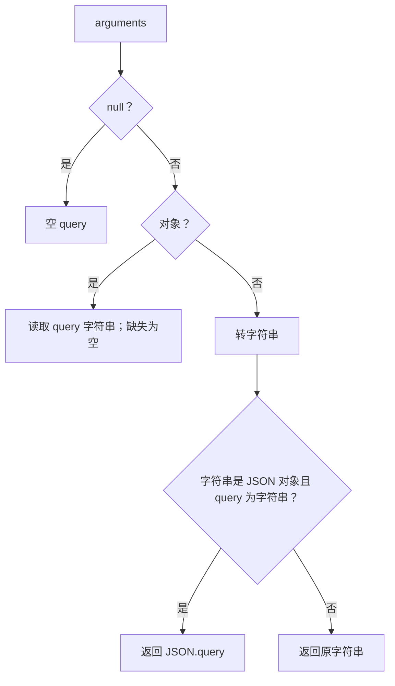
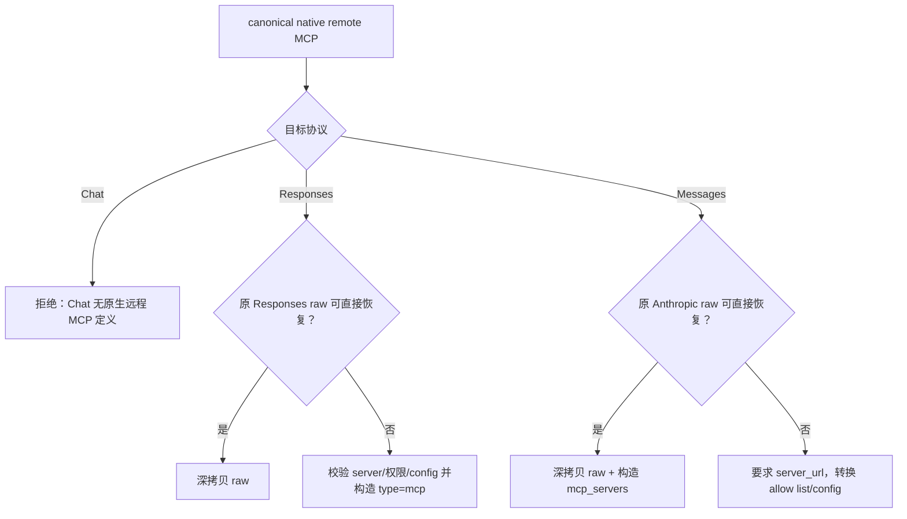
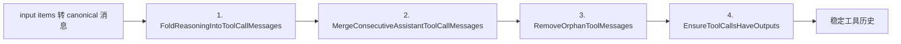

# Web Search、Tool Search、MCP 与工具历史规范化

## 1. 适用范围

本文聚合四类彼此相关但语义不同的复杂工具逻辑：

1. **Web Search**：Responses 原生 `web_search` 定义与 `web_search_call` 响应形态；
2. **Tool Search**：Codex 延迟工具发现用的 `tool_search` / `tool_search_output`；
3. **MCP**：原生远程 MCP 与历史 namespace MCP 的区别、协议可转换性与权限边界；
4. **工具历史修复**：reasoning 折叠、连续调用合并、孤儿结果删除、缺失结果补齐。

必须先区分：

| 名称 | 用途 | 是否同一工具 |
|---|---|---:|
| `web_search` | 搜索互联网内容 | 否 |
| `tool_search` | 搜索/加载可用工具定义 | 否 |
| `mcp` / `mcp_toolset` | 由模型供应商连接远程 MCP 服务 | 否 |
| `mcp__server__tool` | 已展平的普通 function namespace | 不是原生远程 MCP 定义 |

Web Search 的禁用/模拟/原生模式选择与多轮执行由 `WebSearchRequestPolicy`、`WebSearchSimulator` 完成；本文只详述与 `ProtocolConverter` 直接相关的协议形态和历史。

---

## 2. 源码入口

| 文件 | 关键符号 |
|---|---|
| `opencodex_proxy/src/Libraries/OpenCodex.Core/Protocols/ProtocolConverter.WebSearchTools.cs` | `IsWebSearchName`, `ResponsesWebSearchCallItem`, `WebSearchQueryFromArguments` |
| `ProtocolConverter.Tools.cs` | web_search/tool_search 工具定义、动态工具收集、映射表 |
| `ProtocolConverter.ResponsesInput.cs` | web_search、tool_search output、MCP 历史 item 转消息 |
| `ProtocolConverter.ToolHistory.cs` | `NormalizeChatToolHistory` 四阶段修复 |
| `ProtocolConverter.Mcp.cs` | 原生 MCP canonical、定义互转、权限约束与错误 |
| `ProtocolConverter.NativeToolCalls.cs` | tool_search/web_search/native call 的 Responses item 恢复 |
| `ProtocolConverter.Responses.cs` | MCP/tool 调用的非流式响应转换 |
| `ProtocolConverter.Requests.cs` | MCP/tool 历史输出到目标请求 |
| `ProtocolConverter.Reasoning.cs` | reasoning-only 消息与工具调用合并 |

相关边界实现：

- `opencodex_proxy/src/Libraries/OpenCodex.Core/Services/WebSearch/WebSearchSimulator.NonStream.cs`
- `opencodex_proxy/src/Libraries/OpenCodex.Core/Services/WebSearch/WebSearchSimulator.Streaming.cs`
- `opencodex_proxy/src/Libraries/OpenCodex.Core/Services/Proxy/ChannelCompatRequestRewriter.cs`

---

## 3. Web Search 工具定义转换

### 3.1 Responses 定义进入 canonical

输入：

```json
{
  "type": "web_search",
  "description": "Search the web."
}
```

canonical：

```json
{
  "name": "web_search",
  "description": "Search the web.",
  "parameters": {
    "type": "object",
    "additionalProperties": false,
    "properties": {
      "query": {
        "type": "string",
        "description": "The web search query."
      }
    },
    "required": ["query"]
  },
  "native_type": "web_search",
  "raw": {
    "type": "web_search",
    "description": "Search the web."
  }
}
```

若 description 缺失，使用：

```text
Search the web for current information.
```

### 3.2 输出到目标协议

| 目标 | 定义形态 |
|---|---|
| Responses | 若有 `raw`，恢复原生 `type=web_search` |
| Chat | function tool `name=web_search`，参数 `{query:string}` |
| Messages | 普通 Anthropic tool `name=web_search`，`input_schema` 为 query schema |

这只是协议包装。Chat/Messages 上游本身不会因为工具名叫 `web_search` 就自动拥有 Responses 原生搜索能力；OpenCodex 的 Web Search 模拟器可拦截该函数调用、执行搜索并继续对话。

### 3.3 tool choice

Responses：

```json
{ "type": "web_search" }
```

转 Chat：

```json
{
  "type": "function",
  "function": { "name": "web_search" }
}
```

转 Messages：

```json
{ "type": "tool", "name": "web_search" }
```

---

## 4. Web Search 调用恢复

请求期 `BuildResponsesToolCallMappings` 会记录：

```text
chatName=web_search
nativeType=web_search
responsesName=web_search
```

当 Chat/Messages 上游返回普通函数调用 `web_search` 时，响应转换通过映射识别它应恢复为 Responses 原生 item，而非 `function_call`。

### 4.1 完成 item

```json
{
  "id": "call_web",
  "type": "web_search_call",
  "status": "completed",
  "action": {
    "type": "search",
    "query": "OpenAI"
  }
}
```

该形态不输出：

- `name`；
- `arguments`；
- `input`；
- `call_id`。

`id` 优先使用显式 item id，否则使用上游 call id，再否则生成 `ws_*`。

### 4.2 查询提取

`WebSearchQueryFromArguments`：



因此纯文本 arguments 会直接作为 query；合法 JSON 但没有字符串 query 也会退回原 JSON 文本。

### 4.3 Responses 历史中的 `web_search_call`

若 item 含 `opencodex_result`，转换为：

1. assistant `web_search` function call；
2. 紧随其后的 tool result，content 为结果 JSON。

这是 Web Search 模拟续轮历史的内部桥接。

若不含 `opencodex_result`，转换器不会制造工具结果，而把可导出的 metadata 降级为 assistant 文本。

---

## 5. Tool Search：延迟工具发现

### 5.1 与 Web Search 的差异

`tool_search` 搜索的是“可供模型调用的工具定义”，不是互联网内容。Responses 原生调用期望：

```json
{
  "type": "tool_search_call",
  "execution": "client",
  "arguments": {
    "query": "node_repl js"
  }
}
```

结果：

```json
{
  "type": "tool_search_output",
  "call_id": "call_search",
  "execution": "client",
  "tools": [
    {
      "type": "function",
      "name": "node_repl",
      "parameters": { "type": "object" }
    }
  ]
}
```

### 5.2 工具定义

`type=tool_search` 走一般原生工具包装：

- `native_type=tool_search`；
- schema 优先使用输入定义中的 `parameters/input_schema/schema`；
- `raw` 保存原定义；
- 转 Chat/Messages 时成为普通 function/tool；
- 请求映射表记录其原生类型。

### 5.3 调用响应恢复

Responses item：

```json
{
  "id": "tc_generated",
  "type": "tool_search_call",
  "status": "completed",
  "call_id": "call_search",
  "name": "tool_search",
  "arguments": {
    "query": "browser",
    "limit": 3
  },
  "execution": "client"
}
```

与一般 native tool 不同：

- 参数字段是 `arguments`，不是 `input`；
- `arguments` 必须是 JSON **对象**，不是字符串；
- 自动附加 `execution=client`。

`ParseToolSearchArguments` 接受：

- 已是对象：深拷贝；
- JSON 对象字符串：解析为对象；
- null/空白：空对象；
- 非法 JSON、合法但根不是对象：抛 `BadRequestException("tool_search arguments must be a valid JSON object")`。

错误不会回显原始 payload，避免不稳定或敏感内容泄漏到错误信息。

### 5.4 `tool_search_output` 的双重作用

它同时影响消息历史与工具定义：

1. `ResponsesInputItemToMessages` 把 `tools` 数组 JSON 序列化为对应 tool result content；
2. `ResponsesRequestToolsToCanonical` 把 `tools` 中发现的定义加入当前上游请求工具列表。

这样上游既能看到“搜索工具调用已经返回了什么”，也能真正调用新发现的工具。

### 5.5 `additional_tools` 还可能生成模型可见消息

Responses `input[].type=additional_tools` 中的 `tools` 同样会被收集为动态工具定义。但该 input item 还会继续经过消息转换：它没有 `role/content` 时属于未知 metadata 分支，只要除 `type` 外仍有可导出字段（通常就是 `tools`），就会生成模型可见的 assistant 文本 `Responses additional_tools: ...`。因此“收集工具定义”不代表该 item 一定从消息历史中消失；只有导出后仅剩 `type` 时才无消息。

---

## 6. MCP 两种模型：原生远程与 legacy namespace

### 6.1 原生远程 MCP

canonical 判定必须同时满足：

```text
native_type == "mcp"
mcp_kind   == "remote"
```

它代表由 Responses 或 Anthropic provider 直接连接远程 MCP 服务，可能包含授权、服务 URL、工具 allow list 与审批要求。

### 6.2 legacy namespace MCP

例如：

```text
mcp__computer_use__click
```

它只是一个普通 function 名，实际 MCP 桥接可能已在代理侧或客户端侧完成。判定条件是 namespace/name 以 `mcp__` 开头，且不是原生远程 MCP。

### 6.3 为什么必须区分

| 项目 | 原生远程 MCP | legacy namespace function |
|---|---|---|
| 谁连接服务 | 上游 provider | 代理/客户端已有桥接 |
| 是否有 server_url/authorization | 通常有 | 工具定义中通常没有 |
| Chat 是否可原生表达 | 否 | 是，作为 function |
| 可否直接展平 | 不可，会丢权限/审批语义 | 可以 |
| canonical 标记 | `native_type=mcp,mcp_kind=remote` | `native_type=function` + 名称前缀 |

---

## 7. Responses 原生 MCP → canonical

输入例：

```json
{
  "type": "mcp",
  "server_label": "github",
  "server_url": "https://mcp.example.test/github",
  "authorization": "TOKEN",
  "allowed_tools": ["search_repositories"],
  "require_approval": "never"
}
```

`ResponsesMcpToolToCanonical` 要求 `server_label`，可退回使用 `name`。缺失时抛：

```text
Responses native MCP tool requires server_label
```

canonical 结构：

```json
{
  "name": "github",
  "description": "",
  "parameters": {},
  "native_type": "mcp",
  "mcp_kind": "remote",
  "mcp_dialect": "responses",
  "server_label": "github",
  "server_url": "https://mcp.example.test/github",
  "authorization": "TOKEN",
  "allowed_tools": ["search_repositories"],
  "require_approval": "never",
  "raw": { "type": "mcp", "...": "..." }
}
```

保留字段包括：

```text
server_url, connector_id, tunnel_id, authorization, headers,
allowed_tools, require_approval
```

---

## 8. Anthropic MCP → canonical

Messages 使用两个关联位置：

1. `tools[].type=mcp_toolset`；
2. `mcp_servers[]` 中的服务连接信息。

工具先变为：

```json
{
  "name": "github",
  "native_type": "mcp",
  "mcp_kind": "remote",
  "mcp_dialect": "anthropic",
  "mcp_server_name": "github",
  "server_label": "github",
  "default_config": {},
  "configs": {},
  "raw": { "type": "mcp_toolset", "mcp_server_name": "github" }
}
```

`EnrichCanonicalMcpToolsWithAnthropicServers` 再按 server name 补充：

- `mcp_server` 原始对象；
- `server_url`；
- `authorization` ← `authorization_token`；
- `mcp_server_enabled` ← `tool_configuration.enabled`；
- `allowed_tools` ← `tool_configuration.allowed_tools`。

若 `mcp_servers` 中同名项重复，构建 `serversByName` 时后出现的 server 覆盖先出现的 server，enrichment 使用最后一项。反向生成 Messages `mcp_servers` 时规则不同：`BuildAnthropicMcpServers` 用 `seenNames` 去重，按 canonical 工具顺序保留第一个同名 server。

没有匹配 server 时不会立即报错；只有真正转换到需要服务信息的目标时才判断可转换性。

---

## 9. 原生 MCP 目标转换决策

### 9.1 总流程



### 9.2 转 Responses 的必要条件

当不能直接恢复 Responses raw 时：

1. 必须有 server label/name；
2. 必须至少有一个：
   - `server_url`
   - `connector_id`
   - `tunnel_id`
3. `mcp_server_enabled=false` 拒绝，因为 Responses 没有等价“禁用整个服务但保留定义”的表达；
4. Anthropic config 必须能转换成 allow list；
5. `allowed_tools` 必须是支持的字符串列表或简单 `tool_names` 过滤器。

生成基础形态：

```json
{
  "type": "mcp",
  "server_label": "weather",
  "server_url": "https://mcp.example.test",
  "require_approval": "never",
  "allowed_tools": ["forecast"]
}
```

### 9.3 转 Messages 的必要条件

当不能直接恢复 Anthropic raw 时：

1. 必须有 server name；
2. 必须有 `server_url`，因为还要构建 `mcp_servers`；
3. `connector_id/tunnel_id` 没有 Anthropic 等价物，只有这些字段而无 URL 时拒绝；
4. `require_approval` 只允许缺失或字符串 `never`；其他值拒绝；
5. allow list 可转成 Anthropic `default_config/configs`；
6. canonical `headers` 没有被复制到 Anthropic `mcp_toolset` 或 `mcp_servers`。即使 Responses → canonical 已保留 headers，转 Messages 时也会静默丢失，目前不会据此拒绝。

工具：

```json
{
  "type": "mcp_toolset",
  "mcp_server_name": "weather",
  "default_config": {
    "enabled": false,
    "defer_loading": false
  },
  "configs": {
    "forecast": { "enabled": true }
  }
}
```

服务：

```json
{
  "type": "url",
  "name": "weather",
  "url": "https://mcp.example.test",
  "authorization_token": "TOKEN"
}
```

---

## 10. MCP allow list 与权限边界

### 10.1 支持的 `allowed_tools`

数组：

```json
["forecast", "current"]
```

或简单对象：

```json
{
  "tool_names": ["forecast", "current"],
  "read_only": false
}
```

规则：

- 元素必须全是字符串；
- 空字符串删除；
- 名称去重；
- 对象只允许 `tool_names`、`read_only` 两个键；
- `read_only=true` 拒绝，因为目标 Anthropic toolset 没有此复合限制的等价表达；
- 其他复合约束拒绝。

### 10.2 Anthropic config → Responses allow list

`default_config.enabled != false`：

- 默认所有工具启用；
- 若 `configs` 中存在单独 `enabled=false` 覆盖，拒绝；Responses allow list 无法表达“全部允许但排除少数”。

`default_config.enabled == false`：

- 只收集 `configs[tool].enabled=true` 的工具；
- 形成明确 allow list。

### 10.3 两个 allow list 同时存在

若 server `allowed_tools` 与 Anthropic configs 都形成过滤器，取交集，而不是并集，避免扩大访问范围。

### 10.4 禁用配置与审批

以下场景明确拒绝而非静默放宽：

- Anthropic server `tool_configuration.enabled=false` → Responses；
- Anthropic 默认启用但有禁用覆盖 → Responses；
- Responses `require_approval=always` 等 → Messages；
- Responses `read_only` 复合约束 → Messages。

---

## 11. MCP 请求历史

### 11.1 Responses `mcp_call` → canonical

一个 item 生成 assistant 原生 MCP tool call：

```json
{
  "role": "assistant",
  "content": "",
  "tool_calls": [
    {
      "id": "mcp_1",
      "type": "function",
      "native_type": "mcp",
      "server_name": "weather",
      "function": {
        "name": "forecast",
        "arguments": "{\"city\":\"Shanghai\"}"
      }
    }
  ]
}
```

若 item 有 `output` 或 `error`，再生成 canonical tool 消息，并标记 `is_error`、`native_type=mcp`。

### 11.2 canonical → Responses

assistant 原生 MCP 调用与对应 tool 结果重新合成**一个** `mcp_call`：

```json
{
  "type": "mcp_call",
  "id": "mcp_1",
  "server_label": "weather",
  "name": "forecast",
  "arguments": "{\"city\":\"Shanghai\"}",
  "output": "sunny",
  "status": "completed"
}
```

错误结果写入 `error`。需要区分两条构造路径：Messages 请求历史经 `MessagesToResponsesInput` 重建时，错误结果把 `status` 设为 `failed`；非流式响应经 `CanonicalToResponsesResponse` 重建时，`mcp_call.status` 固定为 `completed`，即使同时输出了 `error`。

### 11.3 canonical → Messages

调用：`mcp_tool_use`；结果：`mcp_tool_result`。`server_name` 与 `is_error` 保留。

### 11.4 转 Chat

无论是原生 MCP 工具定义还是原生 MCP 历史都明确拒绝：

```text
native MCP history cannot be represented by Chat Completions; use Responses or Messages protocol
```

不能把它伪装为 function，因为这样会错误地改变“由谁执行工具”和授权边界。

---

## 12. 工具历史四阶段规范化

仅 Responses 源请求在 input item 转 canonical 消息后调用 `NormalizeChatToolHistory`。



### 12.1 阶段一：reasoning 折叠

reasoning-only 消息定义：

- `role=assistant`；
- `reasoning_content` truthy；
- `content` 为空；
- 无 `tool_calls`。

判断：

1. reasoning-only 紧跟在已有 assistant tool call 后：追加到前一调用消息；
2. 否则暂存为 pending reasoning；
3. 下一条若是 assistant tool call：把 pending reasoning 追加到该调用；
4. 下一条不是 tool call：先把 pending reasoning作为独立消息输出；
5. 多个 pending reasoning 直接串接，不插入分隔符。

目的：兼容只允许 reasoning 与工具调用处于同一 assistant turn 的上游。

折叠实现只调用 `AppendReasoningContent`，不会复制 reasoning-only 消息上的 `anthropic_thinking_encrypted`。因此带签名 reasoning-only 历史一旦折叠进工具调用消息，可读 `reasoning_content` 会保留，但 Anthropic 签名编码会丢失。

### 12.2 阶段二：合并连续 assistant 工具调用

只合并“tool-call-only”消息：

- `role=assistant`；
- content 为空；
- 至少一个 `tool_calls`。

连续多条的 `tool_calls` 按出现顺序追加到第一条。遇到任何其他消息即结束合并。

实现只追加后续消息的 `tool_calls` 列表，不合并后续消息上的其他扩展字段。因此如果连续 tool-call-only 消息各自还带 `reasoning_content` 等字段，第一条之外的这些扩展字段可能丢失；当前历史生成逻辑应尽量在进入此阶段前完成 reasoning 折叠。

### 12.3 阶段三：删除孤儿 tool 消息

扫描规则：

- 遇到 assistant 有工具调用：建立当前合法 call id 集合；
- 遇到 assistant 无工具调用：清空合法集合；
- 紧随其后的 tool 消息只有 id 属于当前集合才保留；
- 遇到普通 user/system 等消息：清空合法集合；
- 其他位置的 tool 消息删除。

这要求 tool result 与对应 assistant 调用相邻成组。

### 12.4 阶段四：补齐缺失结果

对每个 assistant tool call 消息：

1. 扫描其后连续的 tool 消息；
2. 记录已有 `tool_call_id`；
3. 对每个未出现结果的 call id，在连续 tool 结果块末尾插入占位消息。

占位内容固定为：

```text
[tool output missing - no function_call_output was provided for this call_id]
```

占位示例：

```json
{
  "role": "tool",
  "tool_call_id": "call_missing",
  "content": "[tool output missing - no function_call_output was provided for this call_id]"
}
```

占位消息只含 `role/tool_call_id/content`，不会从原调用复制 `native_type=mcp`。若缺结果的是原生 MCP 调用，之后转 Messages 时这个占位会被序列化成普通 `tool_result`，而不是 `mcp_tool_result`。

该修复优先保证上游工具历史结构合法，而不是悄悄删除未完成调用。

---

## 13. MCP namespace 调用参数补全

`EnrichMcpToolCallArguments` 是当前临时兼容逻辑：

- 只处理名称以 `mcp__` 开头的工具；
- arguments 必须可识别为对象；
- 名称以 `mcp__node_repl__` 开头且缺少 `sandboxPolicy` 时，补：

```json
{ "sandboxPolicy": "use_default" }
```

已有 `sandboxPolicy` 不覆盖。该逻辑在 Responses input tool call 转 canonical 时执行，源码注释计划未来迁移到专用 `McpToolCallEnricher` 服务。

---

## 14. 完整 JSON 示例：Responses MCP → Messages

### 14.1 Responses 请求

```json
{
  "model": "gpt",
  "input": "查询上海天气",
  "max_output_tokens": 100,
  "tools": [
    {
      "type": "mcp",
      "server_label": "weather",
      "server_url": "https://mcp.example.test/weather",
      "authorization": "TOKEN",
      "headers": { "X-Tenant": "TENANT" },
      "require_approval": "never",
      "allowed_tools": ["forecast", "current"]
    }
  ]
}
```

### 14.2 Messages 上游请求

```json
{
  "model": "claude-upstream",
  "max_tokens": 100,
  "messages": [
    {
      "role": "user",
      "content": [
        { "type": "text", "text": "查询上海天气" }
      ]
    }
  ],
  "tools": [
    {
      "type": "mcp_toolset",
      "mcp_server_name": "weather",
      "default_config": {
        "enabled": false,
        "defer_loading": false
      },
      "configs": {
        "forecast": { "enabled": true },
        "current": { "enabled": true }
      }
    }
  ],
  "mcp_servers": [
    {
      "type": "url",
      "name": "weather",
      "url": "https://mcp.example.test/weather",
      "authorization_token": "TOKEN"
    }
  ]
}
```

若原请求把 `require_approval` 改成 `always`，转换会拒绝，不会静默删除审批要求。示例中的 `headers` 则不同：它在 canonical 中保留，但 Messages 输出没有对应字段，因此被静默丢弃。

---

## 15. 异常与边界条件

### 15.1 Web/Tool Search

| 场景 | 行为 |
|---|---|
| web_search 没有请求映射 | Chat/Messages 返回调用可能退化为 `function_call` |
| web_search arguments 非 JSON 文本 | 文本直接作为 query |
| tool_search arguments 非对象 JSON | 明确抛错 |
| tool_search_output 没有 `output/content` | 使用 `tools` 数组作为结果 |
| 动态发现工具重复 | canonical 按 scope+name 保留第一项 |

### 15.2 MCP

| 场景 | 行为 |
|---|---|
| Responses MCP 缺 server_label/name | 拒绝 |
| Anthropic MCP 转 Responses 缺 URL/connector/tunnel | 拒绝 |
| Responses connector_id/tunnel_id 转 Messages但无 URL | 拒绝 |
| 原生 MCP 转 Chat | 拒绝 |
| allow list 含非字符串 | 拒绝 |
| 复合 read_only 约束 | 拒绝 |
| 默认允许 + 局部禁用转 Responses | 拒绝，避免扩大访问 |
| server 整体 disabled 转 Responses | 拒绝 |
| require_approval 非 never 转 Messages | 拒绝 |
| Responses MCP headers 转 Messages | canonical 保留，但生成的 `mcp_toolset/mcp_servers` 不携带，静默丢失 |
| Anthropic 输入同名多个 MCP server | enrichment 字典后者覆盖前者 |
| canonical 同名多个 MCP 工具生成 server | `BuildAnthropicMcpServers` 只保留第一个 |
| Messages → Responses 历史有重复 MCP `tool_call_id` | `ToDictionary` 直接抛 `ArgumentException` |
| MCP 错误结果转非流式 Responses 响应 | 输出 `error`，但 `status` 仍固定为 `completed` |

### 15.3 历史修复

| 场景 | 行为 |
|---|---|
| tool result 不紧跟对应 assistant 调用 | 删除为孤儿 |
| 调用缺结果 | 插入占位结果 |
| 连续 assistant 调用消息含非空 content | 不合并 |
| 连续 tool-call-only 消息各自带额外字段 | 只合并 tool_calls，后续额外字段可能丢失 |
| reasoning 与调用之间有普通消息 | reasoning 保持独立，不折叠到后续调用 |
| 重复普通 tool result id | 规范化阶段不去重，只要在合法集合内均保留 |
| 重复原生 MCP tool result id 且目标为 Responses | `MessagesToResponsesInput` 建索引时抛 `ArgumentException` |
| reasoning-only 折叠到工具调用 | 只复制 `reasoning_content`，不复制 `anthropic_thinking_encrypted` |
| 缺结果的原生 MCP 调用 | 占位消息缺 `native_type=mcp`，转 Messages 时会成为普通 `tool_result` |

---

## 16. 测试锚点

### 16.1 Web Search 与 Tool Search

`opencodex_proxy/tests/OpenCodex.Api.Tests/ProxyCompatibilityTests.cs`

- `ConvertRequest_ResponsesWebSearchTool_ConvertsForMessages`
- `ConvertRequest_ResponsesWebSearchToolChoice_MapsToChatFunctionChoice`
- `ConvertResponse_ChatWebSearchWithRequestMapping_ReturnsWebSearchCall`
- `ConvertRequest_ResponsesAdditionalToolsOnly_ConvertsToolsForMessages`
- `ConvertResponse_MessagesToolSearchWithRequestMapping_ReturnsNativeToolCall`
- `ConvertRequest_ResponsesToolSearchOutput_ConvertsToChatToolResult`
- `ConvertRequest_ResponsesToolSearchOutput_ExposesDiscoveredNamespaceToolsToChat`
- `ConvertResponse_ChatToolSearchWithRequestMapping_ReturnsNativeToolCall`

Web Search 多轮模拟锚点：

- `WebSearchContinuation_RemovesRequiredToolChoiceBeforeFinalAnswer`
- `WebSearchContinuation_MessagesUpstream_RemovesRequiredToolChoiceBeforeFinalAnswer`
- `WebSearchStream_ExecutesRepeatedWebSearchCallsBeforeFinalAnswer`
- `WebSearchStream_MessagesUpstream_ExecutesWebSearchBeforeFinalAnswer`

### 16.2 MCP 定义与配置

`opencodex_proxy/tests/OpenCodex.Api.Tests/NativeMcpProtocolTests.cs`

- `ResponsesNativeMcpToChat_IsRejectedInsteadOfBecomingFakeFunction`
- `AnthropicMcpToolset_WithServerDefinition_EnrichesCanonicalTool`
- `ResponsesNativeMcpToMessages_EmitsMcpToolsetWithoutFunctionWrapper`
- `LegacyNamespaceMcp_RemainsFlattenedFunctionForChat`
- `AnthropicConnectorWithoutServerUrl_CannotBeConvertedToResponses`

`opencodex_proxy/tests/OpenCodex.Api.Tests/NativeMcpConfigurationTests.cs`

- `ResponsesAllowedTools_BecomeAnthropicToolsetConfigs`
- `ResponsesMcpApprovalRequirement_IsNotSilentlyDroppedForMessages`
- `AnthropicEnabledConfigs_BecomeResponsesAllowedTools`
- `AnthropicDisabledOverride_IsRejectedInsteadOfBroadeningResponsesAccess`
- `ResponsesCompositeAllowedTools_IsRejectedWhenConstraintHasNoAnthropicEquivalent`
- `AnthropicDisabledServerConfiguration_IsRejectedInsteadOfBroadeningResponsesAccess`

### 16.3 MCP 历史与响应

- `NativeMcpHistoryTests.ResponsesMcpCallHistory_ToMessages_PreservesNativeBlocks`
- `NativeMcpHistoryTests.MessagesMcpHistory_ToResponses_PreservesNativeItem`
- `NativeMcpHistoryTests.NativeMcpHistory_ToChat_IsRejected`
- `NativeMcpResponseTests.ResponsesMcpCallToMessages_PreservesUseResultAndServer`
- `NativeMcpResponseTests.MessagesMcpUseAndResultToResponses_BecomesCompletedMcpCall`
- `NativeMcpResponseTests.ResponsesMcpCallToChat_IsExplicitlyRejected`

### 16.4 流式形态一致性

`opencodex_proxy/tests/OpenCodex.Api.Tests/SseStreamConverterTests.cs`

- `Chat_ToolSearchWithRequestMapping_StreamsNativeToolCall`
- `Messages_ToolSearchWithRequestMapping_StreamsNativeToolCall`
- `Chat_WebSearchWithRequestMapping_StreamsWebSearchCall`

---

## 17. 维护检查清单

1. 不要混淆 `web_search` 与 `tool_search`；
2. 新原生工具必须进入请求映射表，否则响应无法恢复；
3. 原生 MCP 与 `mcp__` function 必须保持不同 canonical 标记；
4. MCP 转换不得扩大 allow list、取消禁用或删除审批要求；
5. provider-specific connector/tunnel 是否有目标协议等价物；
6. 工具历史中调用 id、结果 id、顺序必须成组；
7. 缺失结果占位符是否会被目标模型误当真实输出；
8. 动态工具既要进入工具列表，也要保留搜索结果历史；
9. tool_search arguments 必须维持对象形态；
10. Web Search 模拟完成后最终回答轮应重新评估强制 tool choice；
11. MCP 授权 token 只能在上游请求中出现，日志层必须继续脱敏；
12. 非流式与流式恢复出的 Responses item 类型应一致。
