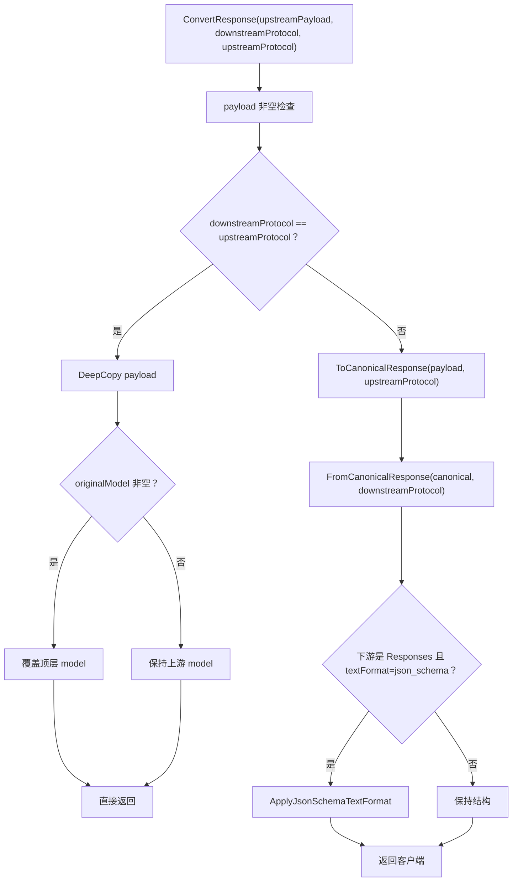
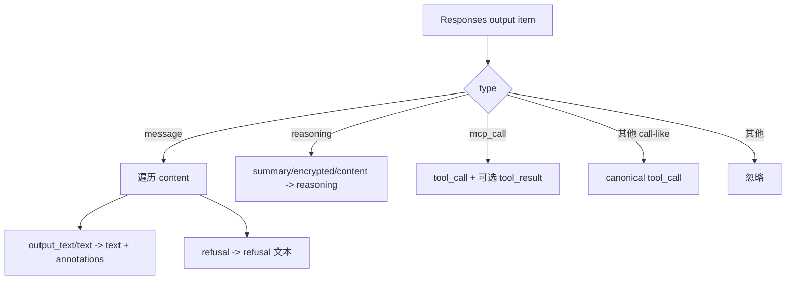

# 非流式响应转换主流程

## 1. 适用范围

本文说明上游返回完整 JSON 响应后，OpenCodex 如何把它转换回客户端入口协议。覆盖：

- Responses、Chat Completions、Anthropic Messages 三种上游响应；
- 同协议透传与跨协议 canonical 转换；
- 客户端可见模型名恢复；
- 文本、推理、拒绝、注释、工具调用、MCP 结果、结束原因与 usage 的主编排；
- Responses `text.format=json_schema` 的非流式后处理入口。

本文只讨论**非流式最终 JSON**。流式链路先由 `SseStreamConverter` 转事件，同时累计出上游完整响应，日志阶段可能再次调用本文入口生成最终下游结构。

---

## 2. 参数方向：最容易混淆的关键点

入口：

```csharp
ProtocolConverter.ConvertResponse(
    payload,
    sourceProtocol,
    targetProtocol,
    originalModel,
    textFormat,
    toolCallMappings)
```

在响应阶段：

| 参数 | 实际含义 |
|---|---|
| `payload` | 上游返回的完整响应 JSON |
| `sourceProtocol` | **客户端入口/期望下游响应协议** |
| `targetProtocol` | **实际上游渠道响应协议** |
| `originalModel` | 客户端请求时的公开模型名，用于覆盖上游模型名 |
| `textFormat` | 原始 Responses 客户端请求中提取的 json_schema 配置 |
| `toolCallMappings` | 请求转换时记录的 Responses 原生工具 → 上游函数名映射 |

因此调用：

```csharp
ConvertResponse(upstream, Responses, Chat, "public-model")
```

表示：**上游 payload 是 Chat，客户端希望收到 Responses**。

这与请求阶段 `ConvertRequest(source=客户端, target=上游)` 的变量名称一致，但 `ToCanonicalResponse` 读取的是 `targetProtocol`，`FromCanonicalResponse` 输出的是 `sourceProtocol`。

---

## 3. 源码入口

| 文件 | 关键符号 | 责任 |
|---|---|---|
| `opencodex_proxy/src/Libraries/OpenCodex.Core/Protocols/ProtocolConverter.cs` | `ConvertResponse`, `ExtractTextFormat`, `ApplyJsonSchemaTextFormat` | 总编排、同协议短路、模型恢复、结构化文本后处理 |
| `ProtocolConverter.Responses.cs` | `ToCanonicalResponse`, `FromCanonicalResponse` | 三协议解析与三协议输出 |
| `ProtocolConverter.Content.cs` | `StringifyContent` | 内容折叠 |
| `ProtocolConverter.NativeToolCalls.cs` | Responses 原生/custom/function 调用 item | 工具响应重建 |
| `ProtocolConverter.ToolContracts.cs` | 工具调用形态解析 | 请求映射恢复原生类型 |
| `ProtocolConverter.Reasoning.cs` | reasoning、thinking、annotations | 推理与引用元数据 |
| `ProtocolConverter.FinishReasons.cs` | 结束原因映射 | status/finish_reason/stop_reason 统一 |
| `ProtocolConverter.Usage.cs` | token usage 统一 | 输入、输出、总量、缓存 token |
| `ProtocolConverter.Mcp.cs` | MCP 判断 | 原生 MCP 不可转 Chat 的边界 |
| `ProtocolConverter.Values.cs` | JSON 值与深拷贝 | 基础设施 |

主要调用方：

- `opencodex_proxy/src/Libraries/OpenCodex.Core/Services/Proxy/ProxyNonStreamService.cs`
  - 获取上游 JSON 后直接调用；
  - 原始 Responses 请求会提前提取 `textFormat` 和工具映射。
- `opencodex_proxy/src/Libraries/OpenCodex.Core/Services/Proxy/ProxyStreamService.cs`
  - 流完成后，对累计的完整上游响应调用，用于最终响应体/日志。
- `opencodex_proxy/src/Libraries/OpenCodex.Core/Services/WebSearch/WebSearchSimulator.NonStream.cs`
  - Web Search 多轮模拟的最终响应转换。

---

## 4. 总判断流程



### 4.1 同协议短路

同协议响应只做：

1. 深拷贝；
2. 若 `originalModel` 非空，覆盖顶层 `model`；
3. 直接返回。

不会执行：

- canonical 聚合；
- finish reason 重新映射；
- usage 格式修正；
- 工具调用形态恢复；
- json_schema 文本包装。

同协议假定上游本身已经符合客户端协议；代理只隐藏上游模型别名。

---

## 5. 规范化中间响应结构

跨协议使用以下事实结构：

```json
{
  "id": "response-id",
  "model": "client-visible-model",
  "created": 1700000000,
  "text": "所有可见文本拼接结果",
  "reasoning": "所有推理文本拼接结果",
  "anthropic_thinking_encrypted": "ocxp-thinking-v1:...，可选",
  "refusal": "拒绝文本",
  "annotations": [
    {
      "type": "url_citation",
      "url": "https://example.test",
      "title": "Example"
    }
  ],
  "tool_calls": [
    {
      "id": "call_1",
      "name": "lookup",
      "namespace": "可选",
      "arguments": "{\"query\":\"x\"}",
      "native_type": "custom|tool_search|mcp 等，可选",
      "server_name": "MCP 服务，可选"
    }
  ],
  "tool_results": [
    {
      "id": "mcp_1",
      "output": "result",
      "is_error": false,
      "native_type": "mcp"
    }
  ],
  "finish_reason": "stop|length|tool_calls|content_filter",
  "usage": {
    "input_tokens": 10,
    "output_tokens": 5,
    "total_tokens": 15,
    "cached_tokens": 2
  },
  "raw": { "完整上游响应深拷贝": true }
}
```

### 5.1 规范化的有损特征

该结构有意面向“单个 assistant 最终结果”：

- 多个 Responses message item 的文本会拼接到一个 `text`；
- 多个 reasoning item 会拼接；
- output item 的原始交错顺序不会完整保留；
- 下游重建顺序固定为其目标序列化逻辑；
- Chat 只读取第一个可识别 `choice`；
- 普通函数工具结果通常属于下一轮请求历史，不作为模型响应 `tool_results`；当前 `tool_results` 主要保存内嵌 MCP 结果。

`raw` 保存原响应供内部诊断，但跨协议输出不会直接透传 `raw`。

---

## 6. 上游 Responses → canonical

入口：`ResponsesResponseToCanonical`。

### 6.1 `output` 遍历



### 6.2 字段来源

| canonical | Responses 来源 |
|---|---|
| `id` | `payload.id`，缺失生成 `resp_*` |
| `model` | 优先 `originalModel`，否则 `payload.model` |
| `created` | `created_at`，缺失当前 Unix 秒 |
| `text` | 所有 message content 的 `output_text/text.text` 拼接 |
| `reasoning` | 所有 reasoning item 提取结果拼接 |
| `refusal` | 所有 `type=refusal.refusal` 拼接 |
| `annotations` | 每个文本 block 的 annotations 规范化后合并 |
| `tool_calls` | `mcp_call` 和所有 call-like item |
| `tool_results` | 仅 `mcp_call` 内嵌 `output/error` |
| `finish_reason` | `status/incomplete_details` 与是否有工具调用 |
| `usage` | Responses usage 规范化 |

一般 `function_call_output` 出现在下一轮请求 input，不是当前模型响应的 assistant output，因此这里不会作为普通工具结果重建。

---

## 7. 上游 Chat → canonical

入口：`ChatResponseToCanonical`。

### 7.1 choice 选择

- 从 `choices` 中取第一个可转为对象的项；
- 没有可识别 choice 时使用空对象；
- 不合并多 choice；`n > 1` 的其他候选会丢失。

### 7.2 消息字段

| canonical | Chat 来源 |
|---|---|
| `text` | `choice.message.content` 经 `StringifyContent` |
| `reasoning` | `message.reasoning_content` |
| `refusal` | `message.refusal` |
| `annotations` | `message.annotations` 规范化 |
| `finish_reason` | `choice.finish_reason` |
| `usage` | 顶层 `usage` |

### 7.3 工具调用

遍历 `message.tool_calls`：

- `type=custom`：读取 `custom.name/input`；
- 其他：读取 `function.name/arguments`；
- `toolCallMappings` 决定它是 Responses function、custom 还是原生工具；
- namespace 通过映射或名称拆分恢复；
- 缺 call id 时生成 `call_*`。

工具参数在 canonical 中保持字符串或源值，不强制在此解析成对象。

---

## 8. 上游 Messages → canonical

入口：`MessagesResponseToCanonical`。

遍历 `content` block：

| block type | canonical 行为 |
|---|---|
| `text` | 拼接到 `text` |
| `thinking` | 拼接 `thinking` 文本；保存精简 thinking block |
| `redacted_thinking` | 保存精简 block，不增加可见 reasoning 文本 |
| `tool_use` | canonical tool call；请求映射可恢复 native type/namespace |
| `mcp_tool_use` | `native_type=mcp`、保存 `server_name` |
| `mcp_tool_result` | canonical MCP tool result |
| 其他 | 当前忽略 |

若保存的 thinking/redacted block 中至少一个含 `signature`，编码到 `anthropic_thinking_encrypted`。

字段差异：

- `created` 总是转换时当前 Unix 秒；Messages 响应没有在此读取创建时间字段；
- `model` 优先使用 `originalModel`；
- `stop_reason` 映射为 canonical finish reason；
- usage 的 total token 由输入加输出计算。

---

## 9. canonical 输出为 Responses

入口：`CanonicalToResponsesResponse`。

### 9.1 output item 顺序

输出顺序固定：

1. reasoning item；
2. text message item；
3. refusal message item；
4. tool call items，按 canonical `tool_calls` 顺序。

这不一定等于上游原始 item 的交错顺序。

### 9.2 顶层结构

```json
{
  "id": "...",
  "object": "response",
  "created_at": 1700000000,
  "status": "completed|incomplete",
  "model": "public-model",
  "output": [],
  "usage": {}
}
```

`finish_reason` 为 `length` 或 `content_filter` 时：

- `status=incomplete`；
- `incomplete_details.reason` 分别为 `max_output_tokens` 或 `content_filter`。

其他原因，包括 `tool_calls`，顶层状态都是 `completed`。

### 9.3 工具

- 原生 MCP：输出一个 `mcp_call`，并内嵌匹配结果；
- 其他工具：调用 `ResponsesToolCallItemFromToolCall`；
- canonical `native_type` 会临时构建映射，恢复 custom/native item 类型；
- namespace 最终拆成 Responses `namespace` + bare `name`。

---

## 10. canonical 输出为 Chat

入口：`CanonicalToChatResponse`。

顶层：

```json
{
  "id": "...",
  "object": "chat.completion",
  "created": 1700000000,
  "model": "public-model",
  "choices": [
    {
      "index": 0,
      "message": {
        "role": "assistant",
        "content": "..."
      },
      "finish_reason": "stop"
    }
  ],
  "usage": {}
}
```

消息规则：

- canonical text truthy 时作为 content，否则 `null`；
- reasoning → `reasoning_content`；
- Anthropic 签名编码 → `anthropic_thinking_encrypted`；
- refusal → `refusal`；
- URL citation annotations → Chat `annotations[].url_citation`；
- 工具调用统一输出为 `type=function`；namespace 展平进函数名。

若任一 canonical 工具调用 `native_type=mcp`，明确拒绝，不能生成 Chat 响应。

---

## 11. canonical 输出为 Messages

入口：`CanonicalToMessagesResponse`。

顶层：

```json
{
  "id": "...",
  "type": "message",
  "role": "assistant",
  "model": "public-model",
  "content": [],
  "stop_reason": "end_turn|max_tokens|tool_use|refusal",
  "stop_sequence": null,
  "usage": {}
}
```

内容输出顺序：

1. 若有 text，先输出一个 `text` block；
2. 逐个输出工具调用；
3. 原生 MCP 调用后若有匹配结果，立即输出 `mcp_tool_result`。

普通工具调用输出 `tool_use`，arguments 必须经 `ParseJsonObject` 转成对象。

当前非流式 `CanonicalToMessagesResponse` **不输出**：

- canonical reasoning/thinking；
- refusal 文本；
- annotations。

因此 Chat/Responses 上游的这些字段转 Messages 下游时存在信息损失。Messages 上游 → Responses/Chat 则可保留 reasoning。

---

## 12. 九种响应组合矩阵

| 客户端期望 ← 上游实际 | canonical | 主要行为 |
|---|---:|---|
| Responses ← Responses | 否 | 深拷贝，恢复公开模型；不做 json_schema wrapper |
| Chat ← Chat | 否 | 深拷贝，恢复公开模型 |
| Messages ← Messages | 否 | 深拷贝，恢复公开模型 |
| Responses ← Chat | 是 | Chat 首 choice → Responses output；可恢复 custom/native 工具；可包装 json_schema 文本 |
| Responses ← Messages | 是 | Messages blocks → Responses output；保留 thinking 文本/签名与 MCP |
| Chat ← Responses | 是 | Responses output 聚合成单 Chat message；原生 MCP 拒绝 |
| Chat ← Messages | 是 | text/thinking/tool_use → Chat message/tool_calls |
| Messages ← Responses | 是 | text/tool call → Messages blocks；reasoning/refusal/annotations 不输出 |
| Messages ← Chat | 是 | Chat text/tool calls → Messages blocks；reasoning/refusal/annotations 不输出 |

---

## 13. 完整 JSON 示例：Chat 上游 → Responses 客户端

### 13.1 上游 Chat 响应

```json
{
  "id": "chatcmpl_1",
  "object": "chat.completion",
  "created": 1700000000,
  "model": "upstream-model",
  "choices": [
    {
      "index": 0,
      "message": {
        "role": "assistant",
        "content": "我需要查询问题单。",
        "reasoning_content": "先读取 issue。",
        "tool_calls": [
          {
            "id": "call_1",
            "type": "function",
            "function": {
              "name": "lookup_issue",
              "arguments": "{\"id\":\"ISSUE-7\"}"
            }
          }
        ]
      },
      "finish_reason": "tool_calls"
    }
  ],
  "usage": {
    "prompt_tokens": 10,
    "completion_tokens": 5,
    "total_tokens": 15
  }
}
```

调用：

```text
downstream/sourceProtocol = responses
upstream/targetProtocol   = chat
originalModel             = public-codex
```

### 13.2 canonical 概念结果

```json
{
  "id": "chatcmpl_1",
  "model": "public-codex",
  "created": 1700000000,
  "text": "我需要查询问题单。",
  "reasoning": "先读取 issue。",
  "tool_calls": [
    {
      "id": "call_1",
      "name": "lookup_issue",
      "arguments": "{\"id\":\"ISSUE-7\"}"
    }
  ],
  "finish_reason": "tool_calls",
  "usage": {
    "input_tokens": 10,
    "output_tokens": 5,
    "total_tokens": 15,
    "cached_tokens": 0
  }
}
```

### 13.3 Responses 客户端响应

```json
{
  "id": "chatcmpl_1",
  "object": "response",
  "created_at": 1700000000,
  "status": "completed",
  "model": "public-codex",
  "output": [
    {
      "type": "reasoning",
      "status": "completed",
      "summary": [
        { "type": "summary_text", "text": "先读取 issue。" }
      ],
      "encrypted_content": "先读取 issue。"
    },
    {
      "type": "message",
      "status": "completed",
      "role": "assistant",
      "content": [
        { "type": "output_text", "text": "我需要查询问题单。" }
      ]
    },
    {
      "type": "function_call",
      "status": "completed",
      "call_id": "call_1",
      "name": "lookup_issue",
      "arguments": "{\"id\":\"ISSUE-7\"}"
    }
  ],
  "usage": {
    "input_tokens": 10,
    "output_tokens": 5,
    "total_tokens": 15
  }
}
```

生成的 output item `id` 是运行时新 ID，示例省略其具体值。

---

## 14. 异常与边界条件

| 场景 | 行为 |
|---|---|
| `payload=null` | `ArgumentNullException` |
| 未知上游协议，且需要跨协议解析 | `unsupported upstream protocol` |
| 未知下游协议，且需要跨协议输出 | `unsupported response protocol` |
| Chat `choices` 为空 | 生成空文本与 `stop` 的 canonical，再输出客户端/下游协议；顶层 `usage` 仍照常解析，只有 usage 本身缺失时才为零 |
| Chat 多 choices | 只处理第一个对象 choice |
| Responses 多 message items | 文本拼接，item 边界丢失 |
| Responses 输出交错 reasoning/text/tools | 下游按固定顺序重建 |
| Messages 未知 content block | 当前忽略 |
| 普通工具 arguments 非 JSON 对象转 Messages | `ParseJsonObject` 包装为 `{input:...}`，而非抛错 |
| tool_search arguments 非对象 | 专门路径抛错 |
| 原生 MCP 转 Chat | 明确抛错 |
| 同协议 + json_schema textFormat | 不执行 wrapper |
| `originalModel == null` | 保留/读取上游模型 |
| `originalModel == ""` | 同协议路径因 `IsNullOrEmpty` 不覆盖；跨协议路径使用空字符串，因为 parser 采用 null 合并而不是空字符串判断 |
| `created` 缺失 | 使用转换时当前 Unix 秒 |

同请求转换一样，协议合法性检查发生在同协议短路之后。若两个未知协议字符串完全相同，`sourceProtocol == targetProtocol` 会直接深拷贝返回，不会触发上述 unsupported 错误。

---

## 15. 测试锚点

### 15.1 主协议结构与 finish reason

`opencodex_proxy/tests/OpenCodex.Api.Tests/ProtocolStructuralCompatibilityTests.cs`

- `ResponsesStatus_IsMappedToTargetFinishReasons`

### 15.2 工具响应

`opencodex_proxy/tests/OpenCodex.Api.Tests/ProxyCompatibilityTests.cs`

- `ConvertResponse_MessagesNamespaceToolUse_RestoresNamespaceInResponses`
- `ConvertResponse_MessagesDeepNamespaceToolUse_RestoresFullNamespaceInResponses`
- `ConvertResponse_ResponsesFutureNativeToolCall_ConvertsToMessagesToolUse`
- `ConvertResponse_ChatToolSearchWithRequestMapping_ReturnsNativeToolCall`
- `ConvertResponse_ChatWebSearchWithRequestMapping_ReturnsWebSearchCall`
- `ConvertResponse_ChatApplyPatchToolCall_ReturnsCustomToolCallInputToClient`

### 15.3 MCP

`opencodex_proxy/tests/OpenCodex.Api.Tests/NativeMcpResponseTests.cs`

- `ResponsesMcpCallToMessages_PreservesUseResultAndServer`
- `MessagesMcpUseAndResultToResponses_BecomesCompletedMcpCall`
- `ResponsesMcpCallToChat_IsExplicitlyRejected`

### 15.4 json_schema

`opencodex_proxy/tests/OpenCodex.Api.Tests/SseStreamConverterTests.cs`

- `ConvertResponse_MessagesToResponses_WithJsonSchema_WrapsPlainText`
- `ConvertResponse_ChatToResponses_WithJsonSchema_WrapsPlainText`
- `ConvertResponse_MessagesToResponses_WithoutTextFormat_DoesNotWrap`

---

## 16. 维护检查清单

1. 始终明确“客户端下游协议”和“上游 payload 协议”；
2. 同协议短路是否需要新增后处理，不能假设 canonical 会执行；
3. 新 output/content block 是否进入 canonical；
4. 多 item/多 choice 的聚合是否符合预期；
5. 新 native tool 是否需要请求映射恢复；
6. Messages 目标是否需要补 reasoning/refusal/annotation 支持；
7. 原生 MCP 是否仍保持执行方与授权语义；
8. originalModel 是否在所有方向覆盖上游别名；
9. finish reason 与顶层 status/incomplete_details 是否一致；
10. usage 总量与缓存 token 是否在往返后合理；
11. json_schema 后处理是否仅作用于 Responses 下游；
12. 流式累计响应与直接非流式响应是否能得到一致最终结构。
