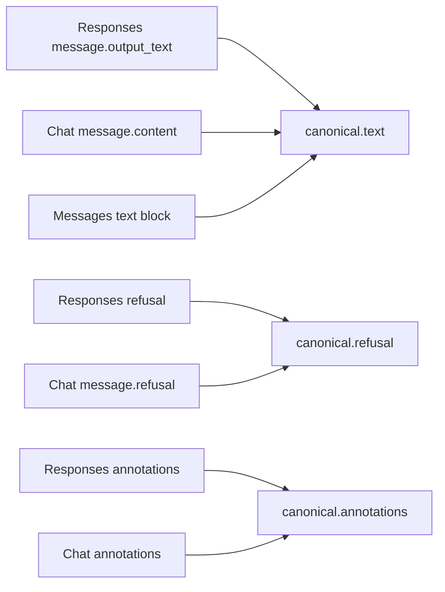
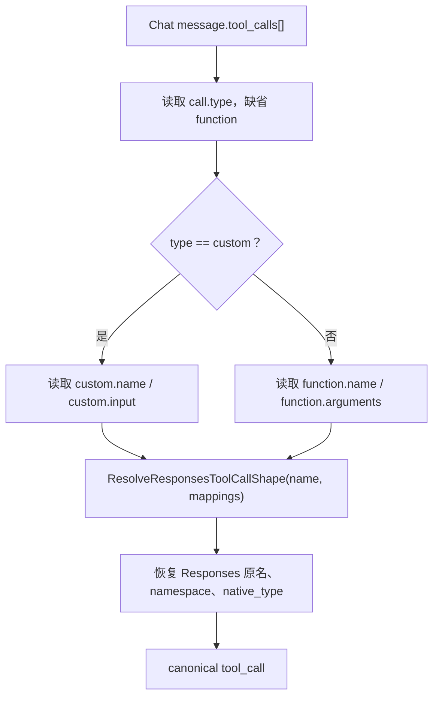
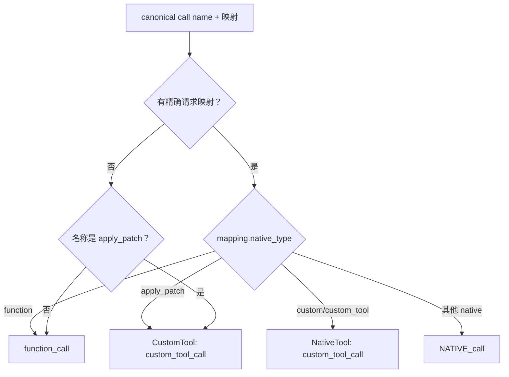

# 响应内容、引用、工具调用与结果映射

## 1. 适用范围

本文深入说明非流式响应中的两条数据线：

1. **可见内容线**：文本、拒绝、引用 annotations；
2. **工具线**：普通函数、自定义工具、未来原生工具、Web Search、Tool Search、`apply_patch`、原生 MCP 调用与 MCP 结果。

推理、结束原因、usage 与 json_schema 见 `06-response-conversion/03-reasoning-finish-usage-and-json-schema.md`。

方向术语：

- **上游协议**：当前 JSON payload 的真实协议；
- **下游协议**：客户端期望的响应协议；
- 工具请求映射来自原始 Responses 客户端请求，只在上游被包装为 Chat/Messages 函数时用于恢复原生 Responses item。

---

## 2. 源码入口

| 文件 | 责任 |
|---|---|
| `opencodex_proxy/src/Libraries/OpenCodex.Core/Protocols/ProtocolConverter.Responses.cs` | 三种响应解析、三种响应重建、MCP 与工具结果主逻辑 |
| `ProtocolConverter.NativeToolCalls.cs` | function/custom/native/tool_search/web_search Responses item 构造 |
| `ProtocolConverter.ToolContracts.cs` | `ResponsesToolCallShape` 与请求映射解析 |
| `ProtocolConverter.ToolNames.cs` | namespace 拆分与名称字段 |
| `ProtocolConverter.WebSearchTools.cs` | `web_search_call` 构造 |
| `ProtocolConverter.ApplyPatchTools.cs` | custom input 提取 |
| `ProtocolConverter.Reasoning.cs` | annotation 规范化与 Chat citation 输出 |
| `ProtocolConverter.Values.cs` | `JsonDumps`, `ParseJsonObject`, `StringifyContent` |

---

## 3. canonical 内容与工具结构

### 3.1 内容字段

```json
{
  "text": "最终可见文本",
  "refusal": "拒绝文本",
  "annotations": [
    {
      "type": "url_citation",
      "url": "https://example.test",
      "title": "Example",
      "start_index": 0,
      "end_index": 7,
      "snippet": "可选摘要"
    }
  ]
}
```

### 3.2 工具字段

```json
{
  "tool_calls": [
    {
      "id": "call_1",
      "name": "click",
      "namespace": "mcp__computer_use",
      "arguments": "{\"x\":12,\"y\":34}",
      "native_type": "custom|tool_search|web_search|mcp 等，可选",
      "server_name": "weather，可选"
    }
  ],
  "tool_results": [
    {
      "id": "mcp_1",
      "output": "sunny",
      "is_error": false,
      "native_type": "mcp"
    }
  ]
}
```

`tool_results` 当前主要用于**内嵌在同一模型响应中的 MCP 结果**。普通 function call 的执行结果通常由客户端/代理执行后放入下一轮请求历史，不属于当前 assistant 响应。

---

## 4. 上游可见内容如何进入 canonical

### 4.1 Responses 上游

只从 `output[].type=message` 的 content 中读取：

| content type | 行为 |
|---|---|
| `output_text` | `text` 追加 `text` 字段；收集 annotations |
| `text` | 与 `output_text` 相同 |
| `refusal` | `refusal` 追加 `refusal` 字段 |
| 其他 | 当前忽略 |

多个文本块、多个 message item 直接 `string.Concat`，不插入换行。多个 refusal 同样直接拼接。

### 4.2 Chat 上游

- 只读取第一个 choice 的 `message`；
- `message.content` 通过 `StringifyContent` 折叠；
- `message.refusal` 通过同一函数折叠；
- `message.annotations` 进入规范化引用列表。

如果 Chat content 是 block 数组，`StringifyContent` 主要拼接 block 的 `text` 或递归 `content`；图片等非文本 block 不会成为响应 text。

### 4.3 Messages 上游

- 只读取 `content[].type=text` 的 `text`；
- 当前没有专门处理 Messages refusal content block；
- Messages annotations/citations 也没有在此解析；
- thinking 与工具 block 走其他分支。



---

## 5. annotation 规范化

入口：`NormalizeAnnotations`。

### 5.1 支持两种输入形态

扁平：

```json
{
  "type": "url_citation",
  "url": "https://example.test",
  "title": "Example",
  "start_index": 0,
  "end_index": 7
}
```

Chat 嵌套：

```json
{
  "type": "url_citation",
  "url_citation": {
    "url": "https://example.test",
    "title": "Example",
    "start_index": 0,
    "end_index": 7
  }
}
```

### 5.2 canonical 字段优先级

| canonical 字段 | 读取顺序 |
|---|---|
| `type` | 外层 `type`，否则 `url_citation` |
| `url` | 外层 `url`，否则内层 `url`，否则空字符串 |
| `title` | 外层 `title`，否则内层 `title`，否则空字符串 |
| `start_index` 等 | 外层优先，内层其次 |
| `snippet` | 外层 `snippet`，其次外层 `summary` |

额外可复制字段：

```text
start_index, end_index, file_id, filename, container_id, index
```

非对象 annotation 被跳过。

### 5.3 输出差异

| 下游协议 | annotation 行为 |
|---|---|
| Responses | 直接把 canonical annotation 深拷贝到 `output_text.annotations` |
| Chat | 只输出 `type=url_citation`，构造嵌套 `url_citation`；缺索引使用 0 |
| Messages | 当前不输出 annotations |

Chat 输出会丢失 snippet、file_id、filename、container_id、index 等非 URL citation 基础字段。

---

## 6. refusal 输出差异

### 6.1 到 Responses

拒绝文本单独成为 message item：

```json
{
  "type": "message",
  "status": "completed",
  "role": "assistant",
  "content": [
    {
      "type": "refusal",
      "refusal": "..."
    }
  ]
}
```

如果同时有普通 text，会生成两个 message item：一个 output_text，一个 refusal。

### 6.2 到 Chat

写入同一个 assistant message：

```json
{
  "role": "assistant",
  "content": null,
  "refusal": "..."
}
```

### 6.3 到 Messages

当前 `CanonicalToMessagesResponse` 不读取 canonical refusal；只有 finish reason `content_filter` 会映射为 `stop_reason=refusal`。拒绝文本本身会丢失。

---

## 7. 上游 Responses 工具调用解析

### 7.1 已知与未来 call-like

`IsResponsesToolCallLike` 已知类型：

```text
function_call
custom_tool_call
local_shell_call
shell_call
apply_patch_call
```

未来类型也可识别，条件是：

- `type` 以 `_call` 结尾；
- 有 `call_id` 或 `id`；
- 有 `name/arguments/input/action` 至少一个。

`web_search_call` 被明确排除，转 Chat/Messages 时不会作为普通工具调用暴露。

### 7.2 名称与参数

- 名称优先 item `name`；没有时从 `type` 去掉 `_call`；
- 参数优先 `arguments`，其次 `input`，其次 `action`，最后空对象；
- canonical id 优先 `call_id`，其次 item `id`，最后生成；
- item `namespace` 单独保存；
- arguments 经 `JsonDumps`：对象变 JSON 字符串，字符串保持原样。

### 7.3 apply_patch

若名称解析为 apply_patch，参数会先通过 `NormalizeApplyPatchArguments` 统一到 `{patch:...}` 兼容形态。

普通 `custom_tool_call` 有一个不同边界：`ResponsesResponseToCanonical` 不接收请求工具映射，`GetResponsesToolCallKind` 在无映射时只把名称精确为 apply_patch 的调用判为 `CustomTool`。因此其他 custom 调用虽然能被 call-like 识别，进入 canonical 时不会保留 custom kind，之后转 Chat/Messages 会退化为普通 function/tool call。只有同协议 Responses → Responses 的早期深拷贝路径会原样保留其 custom 结构。

### 7.4 MCP

`type=mcp_call` 走专门分支：

- `id` 作为 canonical call id；
- `server_label` → `server_name`；
- `output/error` 变成 canonical `tool_results`；
- `error` 存在即 `is_error=true`。

---

## 8. 上游 Chat 工具调用解析

### 8.1 分支



### 8.2 请求映射的影响

假设 Responses 客户端定义 `type=tool_search`，转 Chat 时上游只看到 function `tool_search`。响应映射使 canonical 重新标记：

```json
{
  "native_type": "tool_search"
}
```

否则它会被当成普通 function。

### 8.3 custom Chat call

若上游原生支持：

```json
{
  "type": "custom",
  "custom": {
    "name": "exec",
    "input": "console.log(1)"
  }
}
```

canonical `native_type=custom`。回 Responses 时使用 `custom_tool_call.input`。

---

## 9. 上游 Messages 工具调用与结果解析

### 9.1 `tool_use`

```json
{
  "type": "tool_use",
  "id": "toolu_1",
  "name": "lookup",
  "input": { "query": "x" }
}
```

canonical：

```json
{
  "id": "toolu_1",
  "name": "lookup",
  "arguments": "{\"query\":\"x\"}"
}
```

请求映射可补 `native_type` 与 namespace。

### 9.2 `mcp_tool_use`

额外写入：

```json
{
  "native_type": "mcp",
  "server_name": "weather"
}
```

### 9.3 `mcp_tool_result`

```json
{
  "type": "mcp_tool_result",
  "tool_use_id": "mcp_1",
  "is_error": false,
  "content": [
    { "type": "text", "text": "sunny" }
  ]
}
```

canonical result：

```json
{
  "id": "mcp_1",
  "output": "sunny",
  "is_error": false,
  "native_type": "mcp"
}
```

普通 `tool_result` 通常属于请求历史，不在 Messages assistant 响应内容中处理。

---

## 10. canonical 工具调用 → Responses

### 10.1 形态决策

`ResolveResponsesToolCallShape`：



### 10.2 function item

```json
{
  "id": "fc_generated",
  "type": "function_call",
  "status": "completed",
  "call_id": "call_1",
  "name": "lookup",
  "namespace": "可选",
  "arguments": "{\"query\":\"x\"}"
}
```

### 10.3 custom item

```json
{
  "id": "tc_generated",
  "type": "custom_tool_call",
  "status": "completed",
  "call_id": "call_1",
  "name": "exec",
  "input": "自由文本或回退 JSON 字符串"
}
```

这里有两条内部路径：

- **apply_patch** 被解析为 `ResponsesToolCallKind.CustomTool`，会调用 `ExtractPatchText`，从兼容 wrapper 的 `patch/input/command` 字符串中提取自由 patch；
- **一般 Responses custom/custom_tool** 通过请求映射被解析为 `ResponsesToolCallKind.NativeTool`，虽然最终 item type 也是 `custom_tool_call`，但不会执行 patch 提取，而是把参数按一般 native 路径序列化到 `input`。若上游直接返回 custom `input` 字符串，可保持自由文本；若上游用 function wrapper 返回 `{"input":"..."}`，该 JSON wrapper 可能保留在 Responses `input` 中。

### 10.4 future native item

例如 `native_type=browser_action`：

```json
{
  "type": "browser_action_call",
  "call_id": "call_browser",
  "name": "open_tab",
  "input": "{\"url\":\"https://example.com\"}",
  "status": "completed"
}
```

原生类型已带 `_call` 时不重复追加。

### 10.5 Tool Search 与 Web Search 特例

- `tool_search_call.arguments` 必须是对象，并加 `execution=client`；
- `web_search_call` 改成 `action:{type:search,query}`，不输出 name/arguments/input。

### 10.6 namespace 输出

`ResponsesFunctionCallNameFields` 把全名拆为：

```text
mcp__computer_use__mouse__click
=> namespace = mcp__computer_use__mouse
=> name = click
```

显式 namespace 值优先于自动拆分。

---

## 11. canonical 工具调用 → Chat

原生 MCP 之外，所有工具调用输出为 Chat function：

```json
{
  "id": "call_1",
  "type": "function",
  "function": {
    "name": "namespace__lookup",
    "arguments": "{\"query\":\"x\"}"
  }
}
```

规则：

- 有 `namespace` 时先拼成 `namespace__name`；
- 再把旧 `.` namespace 表示转为 `__`；
- arguments 不解析，保持 canonical 值或默认 `{}` 字符串；
- canonical native type 不映射到 Chat call type，统一 function；
- 任一 MCP call 使整个响应转换失败，不进行部分输出。

---

## 12. canonical 工具调用与结果 → Messages

### 12.1 普通工具

```json
{
  "type": "tool_use",
  "id": "call_1",
  "name": "namespace__lookup",
  "input": { "query": "x" }
}
```

`ParseJsonObject(arguments)` 规则：

| arguments | Messages `input` |
|---|---|
| 已是对象 | 原对象 |
| 合法 JSON 对象字符串 | 解析对象 |
| 合法 JSON 数组/数字/布尔/null 字符串 | `{ "input": 解析后的值 }` |
| 非法 JSON 字符串 | `{ "input": 原字符串 }` |
| 非字符串非对象 | 空对象 |

因此一般工具不会因 arguments 不是对象而抛错；它会被包入 `input` 字段。`tool_search` 恢复到 Responses 时有更严格的对象要求。

### 12.2 MCP

先输出：

```json
{
  "type": "mcp_tool_use",
  "id": "mcp_1",
  "name": "forecast",
  "server_name": "weather",
  "input": { "city": "Shanghai" }
}
```

再查找相同 id 的 canonical result；找到后紧接输出：

```json
{
  "type": "mcp_tool_result",
  "tool_use_id": "mcp_1",
  "is_error": false,
  "content": [
    { "type": "text", "text": "sunny" }
  ]
}
```

未找到结果时只输出 use block。

---

## 13. 内容与工具的重建顺序

### 13.1 到 Responses

```text
reasoning → text message → refusal message → tool calls
```

### 13.2 到 Chat

所有内容合入一个 assistant message：

```text
content + reasoning_content + refusal + annotations + tool_calls
```

### 13.3 到 Messages

```text
text block → tool_use/mcp_tool_use → 匹配的 mcp_tool_result
```

因此跨协议后，原上游“先工具、后文本”或多个 message item 的相对位置不一定保留。

---

## 14. 完整 JSON 示例：Messages → Responses，含 namespace 与 MCP

### 14.1 上游 Messages 响应

```json
{
  "id": "msg_1",
  "type": "message",
  "role": "assistant",
  "model": "claude-upstream",
  "content": [
    { "type": "text", "text": "需要调用两个工具。" },
    {
      "type": "tool_use",
      "id": "toolu_click",
      "name": "mcp__computer_use__mouse__click",
      "input": { "x": 12, "y": 34 }
    },
    {
      "type": "mcp_tool_use",
      "id": "mcp_1",
      "name": "forecast",
      "server_name": "weather",
      "input": { "city": "Shanghai" }
    },
    {
      "type": "mcp_tool_result",
      "tool_use_id": "mcp_1",
      "is_error": false,
      "content": [
        { "type": "text", "text": "sunny" }
      ]
    }
  ],
  "stop_reason": "tool_use",
  "usage": {
    "input_tokens": 10,
    "output_tokens": 8
  }
}
```

### 14.2 Responses 客户端结果

```json
{
  "id": "msg_1",
  "object": "response",
  "status": "completed",
  "model": "public-model",
  "output": [
    {
      "type": "message",
      "status": "completed",
      "role": "assistant",
      "content": [
        {
          "type": "output_text",
          "text": "需要调用两个工具。"
        }
      ]
    },
    {
      "type": "function_call",
      "status": "completed",
      "call_id": "toolu_click",
      "namespace": "mcp__computer_use__mouse",
      "name": "click",
      "arguments": "{\"x\":12,\"y\":34}"
    },
    {
      "type": "mcp_call",
      "id": "mcp_1",
      "name": "forecast",
      "server_label": "weather",
      "arguments": "{\"city\":\"Shanghai\"}",
      "output": "sunny",
      "status": "completed"
    }
  ],
  "usage": {
    "input_tokens": 10,
    "output_tokens": 8,
    "total_tokens": 18
  }
}
```

运行时生成的 output item id 与 `created_at` 在示例中省略。

---

## 15. 异常与边界条件

| 场景 | 行为 |
|---|---|
| Responses `web_search_call` 转 Chat/Messages | 不作为普通工具调用输出；通常仅保留最终文本 |
| Responses 未知 `_call` 无 id 或调用字段 | 不识别，忽略 |
| Responses 普通 `custom_tool_call` 跨协议输出 | 除 apply_patch 外不保留 custom kind，退化为普通 function/tool call |
| Chat 多 tool calls | 全部按原顺序进入 canonical |
| Messages tool input 包含不可序列化运行时对象 | 取决于 `JsonSerializer`，可能抛异常 |
| 普通 arguments 非 JSON 转 Messages | 包装到 `{input:string}` |
| tool_search arguments 非对象转 Responses | 明确抛错 |
| apply_patch wrapper 无 `patch/input/command` 字符串 | Responses input 使用完整 JSON 字符串 |
| namespace 与 name 已重复拼接 | 显式 namespace 路径可能产生异常名称；调用方应保持 canonical name 为 bare 或一致全名 |
| MCP result id 找不到调用 | 结果不会单独输出到 Responses/Messages |
| MCP 调用转 Chat | 整体拒绝 |
| annotations 非 URL citation 转 Chat | 丢弃 |
| refusal 转 Messages | 文本丢失，仅 stop_reason 可反映拒绝 |
| 多 Responses message item | 合并成单 text，再按目标重建 |

---

## 16. 测试锚点

### 16.1 namespace 与未来原生工具

`opencodex_proxy/tests/OpenCodex.Api.Tests/ProxyCompatibilityTests.cs`

- `ConvertResponse_MessagesNamespaceToolUse_RestoresNamespaceInResponses`
- `ConvertResponse_MessagesDeepNamespaceToolUse_RestoresFullNamespaceInResponses`
- `ConvertResponse_ResponsesFutureNativeToolCall_ConvertsToMessagesToolUse`
- `ConvertResponse_MessagesToolSearchWithRequestMapping_ReturnsNativeToolCall`
- `ConvertResponse_ChatToolSearchWithRequestMapping_ReturnsNativeToolCall`
- `ConvertResponse_ChatWebSearchWithRequestMapping_ReturnsWebSearchCall`

### 16.2 apply_patch/custom

- `ConvertResponse_ChatLegacyApplyPatchProxy_PassesThroughAsFunctionCall`
- `ConvertResponse_ChatApplyPatchText_ReturnsCustomToolCall`
- `ConvertResponse_ChatApplyPatchToolCall_ReturnsCustomToolCallInputToClient`
- `ConvertResponse_MessagesLegacyApplyPatchToolUse_PassesThroughAsFunctionCall`

### 16.3 MCP

`opencodex_proxy/tests/OpenCodex.Api.Tests/NativeMcpResponseTests.cs`

- `ResponsesMcpCallToMessages_PreservesUseResultAndServer`
- `MessagesMcpUseAndResultToResponses_BecomesCompletedMcpCall`
- `ResponsesMcpCallToChat_IsExplicitlyRejected`

### 16.4 引用、拒绝与流式一致性参考

`opencodex_proxy/tests/OpenCodex.Api.Tests/SseStreamConverterTests.cs`

- `RefusalDelta_EmitsOutputTextAndPersistsRefusal`
- `OutputTextEvents_IncludeCompatibilityFields`

`opencodex_proxy/tests/OpenCodex.Api.Tests/ResponsesOutboundStreamingCompatibilityTests.cs`

- 覆盖 refusal 与 annotations 的 Responses → Chat/Messages 流式映射，可用于核对非流式语义差异。

---

## 17. 维护检查清单

1. 新响应 content block 是否应进入 text、refusal、annotation 还是专用字段；
2. 多 item 的顺序是否需要从字符串聚合升级为块级 canonical；
3. 新工具类型是否需要 request mapping；
4. Responses item 的 `name/namespace/call_id/id` 是否正确区分；
5. native 参数字段是 `arguments`、`input` 还是结构化 `action`；
6. custom 自由文本能否从兼容 JSON wrapper 中恢复；
7. 普通工具与 MCP 结果的生命周期是否混淆；
8. MCP 结果是否严格按 call id 关联；
9. Chat 目标不应伪造原生 MCP；
10. Messages 目标的 reasoning/refusal/annotations 信息损失是否可接受；
11. 非流式与 SSE 最终累计结果是否保持同一工具 item 形态；
12. 引用索引和文本拼接后的 offset 是否仍有意义。
