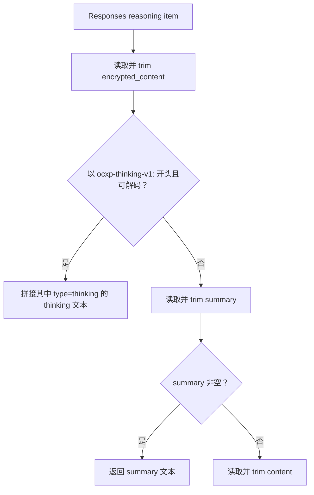
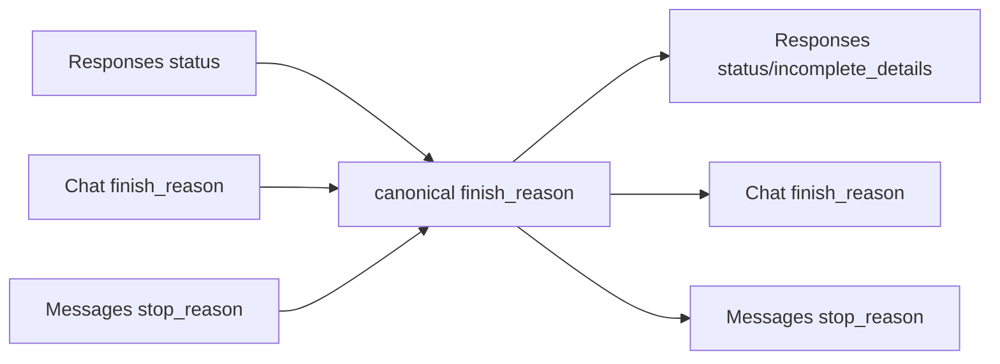
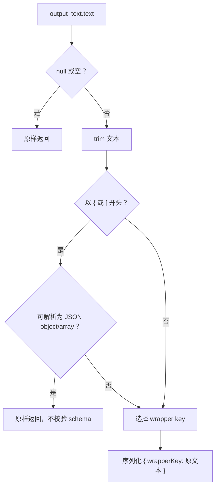

# Reasoning、结束原因、Usage 与 JSON Schema 响应兼容

## 1. 适用范围

本文说明非流式响应转换中四组横跨三协议的语义：

1. Responses reasoning、Chat `reasoning_content`、Anthropic thinking/redacted thinking；
2. Responses status、Chat `finish_reason`、Messages `stop_reason`；
3. token usage 与 cached token；
4. Responses 客户端请求 `text.format.type=json_schema` 时，对不支持结构化输出的 Chat/Messages 上游响应进行文本包装。

方向约定：上游响应先进入 canonical，再输出为客户端下游协议；同协议响应不经过本文大部分逻辑。

---

## 2. 源码入口

| 文件 | 关键符号 |
|---|---|
| `opencodex_proxy/src/Libraries/OpenCodex.Core/Protocols/ProtocolConverter.Reasoning.cs` | `ResponsesReasoningToText`, `ResponsesReasoningItem`, thinking 编解码 |
| `ProtocolConverter.FinishReasons.cs` | 三种上游结束原因 → canonical；canonical → Messages |
| `ProtocolConverter.Usage.cs` | 三种 usage → canonical → 三种目标 usage |
| `ProtocolConverter.Responses.cs` | reasoning、finish、usage 在响应解析/重建中的调用位置 |
| `ProtocolConverter.cs` | `ExtractTextFormat`, `ApplyJsonSchemaTextFormat`, `ConvertResponse` 后处理条件 |
| `opencodex_proxy/src/Libraries/OpenCodex.Core/Protocols/SseStreamConverter.cs` | `TextFormatInfo`, `WrapTextForJsonSchema`, `ExtractFirstSchemaField` |
| `ProtocolConverter.Values.cs` | `StringifyContent`, `ToInt`, JSON 规范化 |

---

## 3. canonical 结构

```json
{
  "reasoning": "可读推理文本",
  "anthropic_thinking_encrypted": "ocxp-thinking-v1:BASE64，可选",
  "finish_reason": "stop|length|tool_calls|content_filter",
  "usage": {
    "input_tokens": 100,
    "output_tokens": 20,
    "total_tokens": 120,
    "cached_tokens": 30
  }
}
```

canonical 只保留一个聚合 reasoning 字符串和一份可选 Anthropic thinking block 编码；不会保留 Responses 多个 reasoning item 的独立边界。

---

## 4. Responses reasoning 读取优先级

入口：`ResponsesReasoningToText(item)`。



### 4.1 `summary` 折叠

Responses 常见：

```json
{
  "summary": [
    { "type": "summary_text", "text": "先检查文件。" },
    { "type": "summary_text", "text": "再修改。" }
  ]
}
```

`StringifyContent` 会直接拼接为：

```text
先检查文件。再修改。
```

不自动插入空格或换行。

### 4.2 非 OpenCodex encrypted content

只有 `ocxp-thinking-v1:` 格式会解码。其他任意 `encrypted_content` 不会作为可读 reasoning 使用，而会继续尝试 summary/content。

若编码可以成功解码，但数组中只有 `redacted_thinking`、没有任何 `thinking` 文本，解码函数仍返回成功并得到空字符串；此时不会继续回退到 summary/content。

---

## 5. Anthropic thinking 的签名保留

### 5.1 上游 Messages → canonical

处理两类 block：

`thinking`：

```json
{
  "type": "thinking",
  "thinking": "Consider this.",
  "signature": "SIGNATURE"
}
```

`redacted_thinking`：

```json
{
  "type": "redacted_thinking",
  "data": "ENCRYPTED",
  "signature": "SIGNATURE"
}
```

规范化时只保留：

- thinking：`type`、`thinking`、可选 `signature`；
- redacted：`type`、可选 `data`、可选 `signature`。

可见 thinking 文本拼接到 canonical `reasoning`。

### 5.2 编码格式

只要收集到的 block 中至少一个带 `signature`，全部 block JSON 序列化后 base64，并加前缀：

```text
ocxp-thinking-v1:<base64(JSON_ARRAY)>
```

写入：

```json
{
  "anthropic_thinking_encrypted": "ocxp-thinking-v1:..."
}
```

没有任何签名时只保留可读 reasoning，不生成编码。

### 5.3 解码健壮性

`TryDecodeAnthropicThinkingBlocks` 在以下情况返回 false，不抛错：

- 前缀不匹配；
- base64 非法；
- JSON 非法；
- JSON 根不是数组；
- 数组为空；
- 其他运行时异常。

这样损坏的历史签名不会让普通响应转换崩溃，但会退化为 summary/content 文本。

---

## 6. 三种下游 reasoning 输出

### 6.1 到 Responses

canonical reasoning 非空时生成：

```json
{
  "id": "rs_generated",
  "type": "reasoning",
  "status": "completed",
  "summary": [
    { "type": "summary_text", "text": "可读推理" }
  ],
  "encrypted_content": "..."
}
```

`encrypted_content` 选择：

1. 有 `anthropic_thinking_encrypted`：使用带签名编码；
2. 否则直接使用可读 reasoning 字符串。

第二种情况并不表示文本真的经过加密；它是当前 Responses 兼容结构的实现行为。

### 6.2 到 Chat

```json
{
  "role": "assistant",
  "reasoning_content": "可读推理",
  "anthropic_thinking_encrypted": "ocxp-thinking-v1:..."
}
```

两个字段独立：有可读文本则输出 `reasoning_content`，有 Anthropic 编码则额外输出内部扩展字段。

### 6.3 到 Messages

当前非流式 `CanonicalToMessagesResponse` 不生成 thinking/redacted thinking block。因此：

- Responses/Chat 上游 reasoning → Messages 客户端时丢失；
- Messages 上游 → Messages 客户端同协议短路时原 block 保留；
- Messages 上游 → Responses/Chat 跨协议时 reasoning 与签名可保留。

请求历史中的 thinking 恢复是另一条逻辑，由 `preserve_thinking_history` 控制，不等同于响应输出支持。

---

## 7. 上游结束原因 → canonical

canonical 只使用：

```text
stop
length
tool_calls
content_filter
```

### 7.1 Responses status

`ResponsesStatusToCanonicalFinishReason(payload, hasToolCalls)`：

| Responses 条件 | canonical |
|---|---|
| `status=incomplete` 且 `incomplete_details.reason=content_filter` | `content_filter` |
| `status=incomplete` 且其他/缺失 reason | `length` |
| `status=failed` | `content_filter` |
| `status=cancelled` | `content_filter` |
| 其他状态且有工具调用 | `tool_calls` |
| 其他状态且无工具调用 | `stop` |

“其他状态”包括缺失状态，因为默认按 `completed` 处理。

### 7.2 Chat finish reason

| Chat | canonical |
|---|---|
| `length` | `length` |
| `tool_calls` | `tool_calls` |
| `function_call` | `tool_calls` |
| `content_filter` | `content_filter` |
| 其他、null | `stop` |

### 7.3 Messages stop reason

| Messages | canonical |
|---|---|
| `max_tokens` | `length` |
| `tool_use` | `tool_calls` |
| `refusal` | `content_filter` |
| 其他、null | `stop` |

---

## 8. canonical 结束原因 → 下游

### 8.1 到 Responses

| canonical | `status` | `incomplete_details` |
|---|---|---|
| `length` | `incomplete` | `{ "reason": "max_output_tokens" }` |
| `content_filter` | `incomplete` | `{ "reason": "content_filter" }` |
| `tool_calls` | `completed` | 不输出 |
| `stop`/其他 | `completed` | 不输出 |

Responses 顶层没有写 canonical `finish_reason` 字段。

### 8.2 到 Chat

直接将 canonical 值写入 `choices[0].finish_reason`：

```text
stop | length | tool_calls | content_filter
```

### 8.3 到 Messages

| canonical | Messages `stop_reason` |
|---|---|
| `length` | `max_tokens` |
| `tool_calls` | `tool_use` |
| `content_filter` | `refusal` |
| `stop`/其他 | `end_turn` |



### 8.4 语义损失

- Responses `failed` 与 `cancelled` 都折叠成 `content_filter`，无法恢复原状态；
- 未知 Chat/Messages 原因折叠成 `stop`；
- Responses incomplete 的未知 reason 折叠成 `length`；
- canonical 不保留原始 `stop_sequence`，Messages 输出固定 `stop_sequence=null`。

---

## 9. 上游 Usage → canonical

### 9.1 Responses usage

```json
{
  "input_tokens": 100,
  "output_tokens": 20,
  "total_tokens": 120,
  "input_tokens_details": {
    "cached_tokens": 30
  }
}
```

映射：

| canonical | 读取 |
|---|---|
| `input_tokens` | `input_tokens`，否则 `prompt_tokens` |
| `output_tokens` | `output_tokens`，否则 `completion_tokens` |
| `total_tokens` | `total_tokens`；缺失为 0 |
| `cached_tokens` | `input_tokens_details.cached_tokens` |

### 9.2 Chat usage

| canonical | 读取 |
|---|---|
| `input_tokens` | `prompt_tokens`，否则 `input_tokens` |
| `output_tokens` | `completion_tokens`，否则 `output_tokens` |
| `total_tokens` | `total_tokens`；缺失为 0 |
| `cached_tokens` | 先 `prompt_tokens_details.cached_tokens`，再 `input_tokens_details.cached_tokens` |

只要第一个 details 对象存在，就返回其 cached 值；即使为 0，也不会继续尝试第二个 details。

### 9.3 Messages usage

```json
{
  "input_tokens": 100,
  "output_tokens": 20,
  "cache_creation_input_tokens": 10,
  "cache_read_input_tokens": 30
}
```

canonical：

```json
{
  "input_tokens": 100,
  "output_tokens": 20,
  "total_tokens": 120,
  "cached_tokens": 40
}
```

`cached_tokens` 把 cache creation 与 cache read 相加；canonical 不再区分两者。

---

## 10. canonical Usage → 下游

### 10.1 Responses

```json
{
  "input_tokens": 100,
  "output_tokens": 20,
  "total_tokens": 120,
  "input_tokens_details": {
    "cached_tokens": 30
  }
}
```

若 canonical `total_tokens == 0`，自动使用 `input + output`。只有 cached > 0 时输出 details。

### 10.2 Chat

```json
{
  "prompt_tokens": 100,
  "completion_tokens": 20,
  "total_tokens": 120,
  "prompt_tokens_details": {
    "cached_tokens": 30
  }
}
```

同样在 total 为 0 时重算。

### 10.3 Messages

```json
{
  "input_tokens": 100,
  "output_tokens": 20,
  "cache_read_input_tokens": 30
}
```

Messages 输出：

- 不包含 `total_tokens`；
- canonical cached 全部写成 `cache_read_input_tokens`；
- 无法恢复其中有多少来自 `cache_creation_input_tokens`。

### 10.4 `ToInt` 转换边界

支持：

- `int`；
- `long`，使用 checked 转 int；超范围会抛 `OverflowException`；
- `double`/`decimal`，截断小数部分；其中 decimal 转 int 超范围同样会抛 `OverflowException`；
- 可解析十进制整数字符串；
- 其他或 null → 0。

token 计数理论上应为非负整数，但转换器不显式拒绝负数。

---

## 11. Usage 字段损失矩阵

| 信息 | canonical 是否保留 | 说明 |
|---|---:|---|
| input/prompt token | 是 | 统一为 input_tokens |
| output/completion token | 是 | 统一为 output_tokens |
| total token | 是 | 缺失时可能在目标重算 |
| cached token 总量 | 是 | 统一为 cached_tokens |
| cache creation vs read | 否 | Messages 两者相加 |
| reasoning tokens details | 否 | 非流式 `ProtocolConverter.Usage` 未保留 |
| audio token details | 否 | 未保留 |
| accepted/rejected prediction tokens | 否 | 未保留 |
| 其他供应商 usage 扩展 | 否 | 跨协议删除；同协议透传保留 |

流式 `SseStreamConverter` 某些方向可能有更丰富的 usage details 事件处理，不能反推非流式 canonical 也会保留这些字段。

---

## 12. JSON Schema 请求信息提取

入口：`ExtractTextFormat(payload)`。

只有以下精确结构返回 `TextFormatInfo`：

```json
{
  "text": {
    "format": {
      "type": "json_schema",
      "name": "answer",
      "schema": {
        "type": "object",
        "properties": {
          "title": { "type": "string" }
        },
        "required": ["title"]
      }
    }
  }
}
```

判断：

1. `text` 必须是 `Dictionary<string, object?>`；
2. `format` 必须是同类字典；
3. `format.type` 必须精确等于 `json_schema`；
4. `name` 可为空；
5. `schema` 只有是字典时才保存，否则为 null。

`type=text/json_object`、缺 `text`、缺 `format` 都返回 null。

在 `ProxyNonStreamService` 中从 `context.OriginalPayload` 提取，确保渠道 compat/协议转换删除 `text` 后仍知道客户端原始结构化输出要求。

---

## 13. JSON Schema 后处理触发条件

`ConvertResponse` 只有同时满足以下条件才调用 `ApplyJsonSchemaTextFormat`：

1. 上游协议与下游协议不同；同协议已提前返回；
2. 下游/客户端协议 `sourceProtocol == Responses`；
3. `textFormat.Type == "json_schema"`。

典型用途：

```text
Responses 客户端
  → 请求被转为 Chat/Messages 上游
  → 上游只返回普通文本
  → 响应转回 Responses
  → 把普通文本包装成一个 JSON 对象字符串
```

Responses → Responses 同协议上游假定自己执行 schema 约束，不做兼容包装。

---

## 14. `ApplyJsonSchemaTextFormat` 遍历范围

只处理：

```text
response.output[]
  item.type == message
    item.content[]
      part.type == output_text
        part.text 非 null 且长度 > 0
```

不处理：

- refusal；
- reasoning summary；
- tool call input/arguments；
- 非 message item；
- 非 `output_text` content；
- 空文本。

如果 output/content 不是实际 `List<object?>`，直接返回原响应。

---

## 15. 文本包装判断逻辑

入口：`SseStreamConverter.WrapTextForJsonSchema(text, textFormat)`。



### 15.1 已经是 JSON

只要文本是合法 JSON object 或 array 就原样返回：

```json
{"title":"hello"}
```

或：

```json
[1,2,3]
```

即使 schema 要求 object，而文本是 array，也不会做 schema 验证或重新包装。

合法 JSON 字符串、数字、布尔值因为不以 `{`/`[` 开头，会被当普通文本包装。

### 15.2 无效 JSON

文本以 `{`/`[` 开头但解析失败时，仍按普通文本包装：

```text
{broken json
```

可变为：

```json
{"description":"{broken json"}
```

---

## 16. wrapper key 选择

`ExtractFirstSchemaField` 初始默认：

```text
title
```

决策优先级：

1. schema 有 `properties` 字典，并且 `required` 是非空列表、首项是字符串：使用第一个 required 字段；
2. 否则 schema `properties` 非空：使用字典迭代顺序中的第一个 property；
3. 否则若 `SchemaName` 非空：使用 schema name；
4. 否则使用 `title`。

细节：

- 不检查第一个 required 字段是否真的存在于 properties；
- 只生成一个字段，不补齐其他 required 字段；
- properties 存在但为空时，当前分支保持默认 `title`，不会改用 property；随后因为已进入 schema properties 分支，具体是否使用 SchemaName取决于条件整体是否命中；代码中空字典仍满足 properties 类型条件，因此保持 `title`；
- 字典顺序取决于输入构造/JSON 解析后的插入顺序。

---

## 17. 完整 JSON Schema 示例

### 17.1 原始 Responses 请求格式

```json
{
  "text": {
    "format": {
      "type": "json_schema",
      "name": "codex_output_schema",
      "schema": {
        "type": "object",
        "properties": {
          "title": { "type": "string" },
          "detail": { "type": "string" }
        },
        "required": ["title", "detail"]
      }
    }
  }
}
```

### 17.2 Messages 上游响应

```json
{
  "id": "msg_1",
  "model": "claude-upstream",
  "content": [
    {
      "type": "text",
      "text": "修复登录问题"
    }
  ],
  "stop_reason": "end_turn",
  "usage": {
    "input_tokens": 100,
    "output_tokens": 10
  }
}
```

### 17.3 Responses 客户端输出片段

```json
{
  "type": "message",
  "role": "assistant",
  "content": [
    {
      "type": "output_text",
      "text": "{\"title\":\"修复登录问题\"}"
    }
  ]
}
```

虽然 schema 还要求 `detail`，兼容包装只写第一个 required 字段，不保证最终 JSON 完整符合 schema。这是“使纯文本至少变成结构化 JSON”的兼容层，不是 JSON Schema 校验器或自动补全器。

---

## 18. Reasoning + Usage + Finish 完整示例

### 18.1 Messages 上游

```json
{
  "id": "msg_reasoning",
  "model": "claude-upstream",
  "content": [
    {
      "type": "thinking",
      "thinking": "先读取日志。",
      "signature": "SIG"
    },
    {
      "type": "text",
      "text": "需要继续调用工具。"
    },
    {
      "type": "tool_use",
      "id": "toolu_1",
      "name": "read_logs",
      "input": {}
    }
  ],
  "stop_reason": "tool_use",
  "usage": {
    "input_tokens": 80,
    "output_tokens": 20,
    "cache_creation_input_tokens": 5,
    "cache_read_input_tokens": 15
  }
}
```

### 18.2 Responses 下游关键结果

```json
{
  "status": "completed",
  "output": [
    {
      "type": "reasoning",
      "status": "completed",
      "summary": [
        { "type": "summary_text", "text": "先读取日志。" }
      ],
      "encrypted_content": "ocxp-thinking-v1:BASE64"
    },
    {
      "type": "message",
      "status": "completed",
      "role": "assistant",
      "content": [
        { "type": "output_text", "text": "需要继续调用工具。" }
      ]
    },
    {
      "type": "function_call",
      "status": "completed",
      "call_id": "toolu_1",
      "name": "read_logs",
      "arguments": "{}"
    }
  ],
  "usage": {
    "input_tokens": 80,
    "output_tokens": 20,
    "total_tokens": 100,
    "input_tokens_details": {
      "cached_tokens": 20
    }
  }
}
```

`stop_reason=tool_use` → canonical `tool_calls` → Responses `status=completed`，而不是 incomplete。

---

## 19. 异常与边界条件

### 19.1 Reasoning

| 场景 | 行为 |
|---|---|
| Anthropic 编码损坏 | 解码 false，退回 summary/content |
| thinking 无签名 | 保留可读 reasoning，不保留原 block 编码 |
| 只有 redacted_thinking 且有签名 | canonical 可生成编码，但可读 reasoning 为空；Responses 输出要求 reasoning 非空才创建 reasoning item，因此纯 redacted 编码一定不会输出。Chat 目标仍可通过 `anthropic_thinking_encrypted` 字段携带该编码 |
| Chat reasoning 转 Responses | `encrypted_content` 直接等于明文 reasoning |
| Responses/Chat reasoning 转 Messages | 非流式下丢失 |
| 多 reasoning item | 文本直接拼接，item 边界丢失 |

### 19.2 Finish reason

| 场景 | 行为 |
|---|---|
| Responses failed/cancelled | 统一 content_filter |
| incomplete 未知 reason | 统一 length |
| Chat/Messages 未知原因 | 统一 stop |
| 有工具调用但 Responses status=incomplete | incomplete 原因只覆盖 finish reason；canonical 与 Chat/Messages 输出仍保留工具调用，但结束原因是 `length`/`content_filter` 而不是 `tool_calls`/`tool_use` |

### 19.3 Usage

| 场景 | 行为 |
|---|---|
| Responses/Chat total 缺失 | canonical 为 0；到 Responses/Chat 时重算 |
| Responses/Chat total 显式非零但与 input+output 不一致 | 保留显式值 |
| Messages usage 的 total | 不读取上游 `total_tokens`；canonical 始终使用 `input_tokens + output_tokens` |
| cached <= 0 | Responses/Chat details 与 Messages cache read 字段均不输出 |
| 超过 int 范围的 long/decimal | 可能 `OverflowException` |
| 小数 token | 截断 |
| 负 token | 不拒绝 |

### 19.4 JSON Schema

| 场景 | 行为 |
|---|---|
| 同协议 Responses | 不包装 |
| 下游不是 Responses | 不包装 |
| text format 不是 json_schema | 不包装 |
| 已是合法 object/array | 原样保留，不验证 schema |
| 多个 output_text | 每个 part 独立包装为一个 JSON 字符串 |
| required 有多个字段 | 只使用第一个 |
| required 首项不是字符串 | 尝试第一个 property |
| schema 缺 properties，有 name | 使用 name |
| 无 schema/name | 使用 `title` |
| 顶层 `output` 运行时不是 List | 整个后处理直接返回，不修改响应 |
| 单个 message 的 `content` 运行时不是 List | 只跳过该 message item，继续处理其他 output item |

---

## 20. 测试锚点

### 20.1 结束原因

`opencodex_proxy/tests/OpenCodex.Api.Tests/ProtocolStructuralCompatibilityTests.cs`

- `ResponsesStatus_IsMappedToTargetFinishReasons`

流式映射参考：

- `SseStreamConverterTests.Chat_LengthFinishReason_SetsIncompleteDetails`
- `SseStreamConverterTests.Chat_StopFinishReason_IncompleteDetailsIsNull`
- `SseStreamConverterTests.ChatToMessages_FinishReason_MapsStopReason`
- `SseStreamConverterTests.MessagesToChat_StopReason_MapsFinishReason`
- `SseStreamConverterTests.ResponsesToChat_Status_MapsFinishReason`
- `SseStreamConverterTests.ResponsesToMessages_Status_MapsStopReason`

### 20.2 Reasoning 与拒绝

`opencodex_proxy/tests/OpenCodex.Api.Tests/SseStreamConverterTests.cs`

- `ReasoningContent_EmitsEvents`
- `ReasoningContent_StoredInUpstreamResponse`
- `ChatToMessages_ReasoningContent_EmitsThinkingBlockWithoutSignature`
- `MessagesToChat_Thinking_EmitsReasoningContent`
- `ResponsesToChat_Reasoning_EmitsReasoningContent`
- `ResponsesToMessages_Reasoning_EmitsThinkingBlockWithoutSignature`
- `RefusalDelta_EmitsOutputTextAndPersistsRefusal`

这些主要覆盖流式转换；当前非流式 Anthropic 签名编码及 Messages 目标 reasoning 信息损失缺少同等直接测试，应视为测试补强点。

### 20.3 Usage

- `SseStreamConverterTests.ChatUsageDetails_AreMappedToResponsesUsageDetails`
- `MessagesStreamResponseAccumulatorTests` 中 cache read usage 累积测试
- `NativeMcpResponseTests`、`ProxyCompatibilityTests` 的非流式响应样例包含基础 input/output usage

当前 `ProtocolConverter.Usage.cs` 的各方向 cached/total 边界缺少独立、完整的非流式参数化测试。

### 20.4 JSON Schema

`opencodex_proxy/tests/OpenCodex.Api.Tests/SseStreamConverterTests.cs`

- `WrapTextForJsonSchema_ValidJsonObject_ReturnsAsIs`
- `WrapTextForJsonSchema_ValidJsonArray_ReturnsAsIs`
- `WrapTextForJsonSchema_PlainText_WrapsInSchemaStructure`
- `WrapTextForJsonSchema_InvalidJson_WrapsInSchemaStructure`
- `WrapTextForJsonSchema_EmptyText_ReturnsAsIs`
- `WrapTextForJsonSchema_UsesFirstRequiredField`
- `WrapTextForJsonSchema_NoRequiredFields_UsesFirstProperty`
- `ExtractFirstSchemaField_DefaultIsTitle`
- `ExtractFirstSchemaField_UseSchemaNameWhenNoSchema`
- `ExtractTextFormat_WithJsonSchemaFormat_ReturnsTextFormatInfo`
- `ExtractTextFormat_WithoutTextFormat_ReturnsNull`
- `ExtractTextFormat_WithNonJsonSchemaType_ReturnsNull`
- `ConvertResponse_MessagesToResponses_WithJsonSchema_WrapsPlainText`
- `ConvertResponse_ChatToResponses_WithJsonSchema_WrapsPlainText`
- `ConvertResponse_MessagesToResponses_WithoutTextFormat_DoesNotWrap`

---

## 21. 维护检查清单

1. 新 reasoning block 是否需要可读文本与不可见签名两条通道；
2. 纯 redacted thinking 是否应在 reasoning 为空时仍输出；
3. Messages 目标是否应补非流式 thinking/refusal/annotations；
4. 新 finish reason 是映射、拒绝还是降级；
5. failed/cancelled 是否需要独立 canonical 状态；
6. usage 是否要从固定四字段升级为可扩展 details；
7. cache creation/read 是否应分开保存；
8. token 数值是否需要 long，避免 int 溢出；
9. json_schema 兼容是否应执行真正 schema 校验；
10. 多 required 字段是否应补默认值或直接报错；
11. 合法 JSON array 与 object 是否都应无条件通过；
12. 同协议 Responses 是否也需要可配置 wrapper；
13. 非流式与流式 reasoning/usage/finish 输出是否一致；
14. 新测试必须覆盖 null、空、未知枚举值、溢出值和多块聚合。
