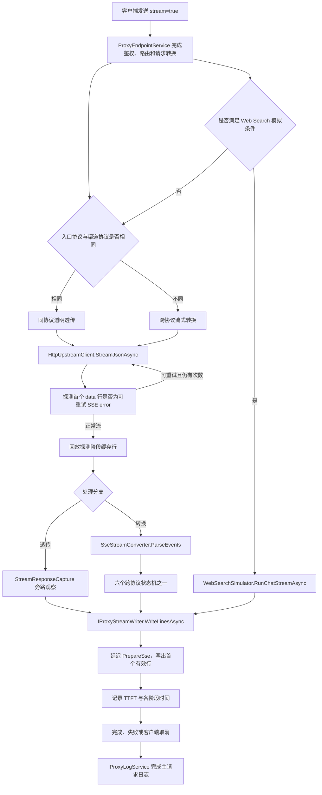
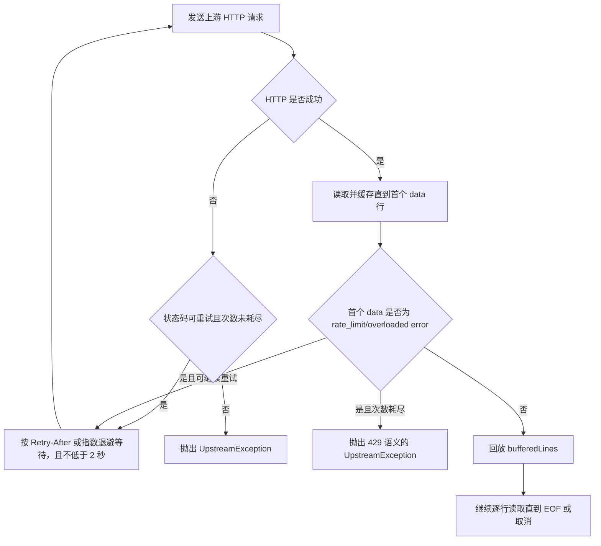
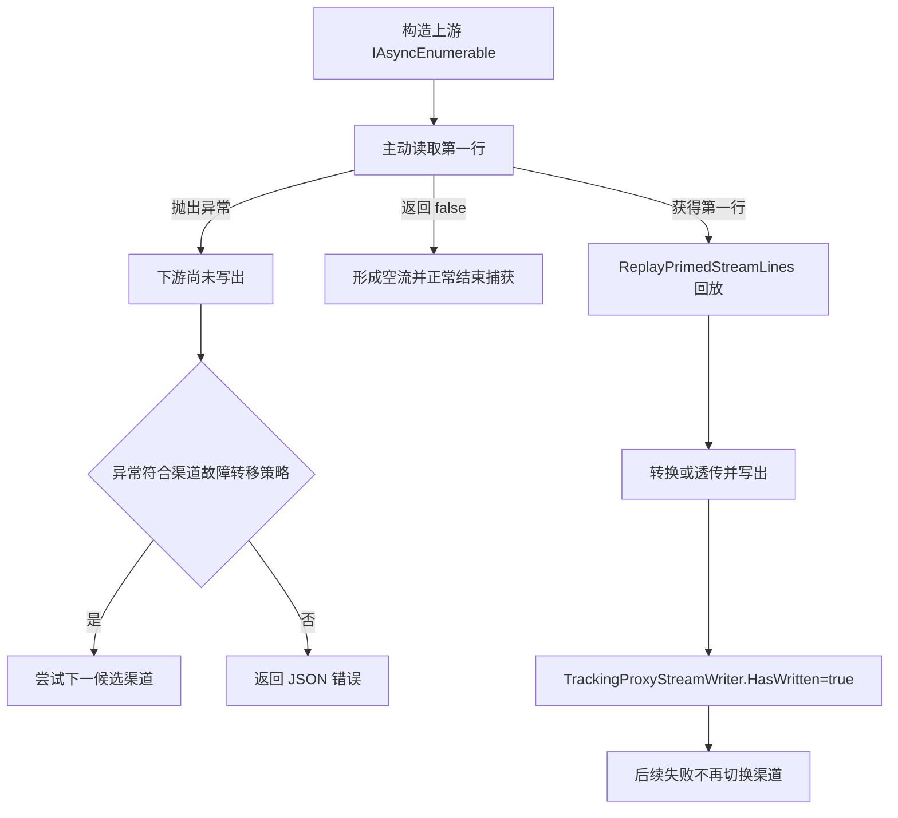
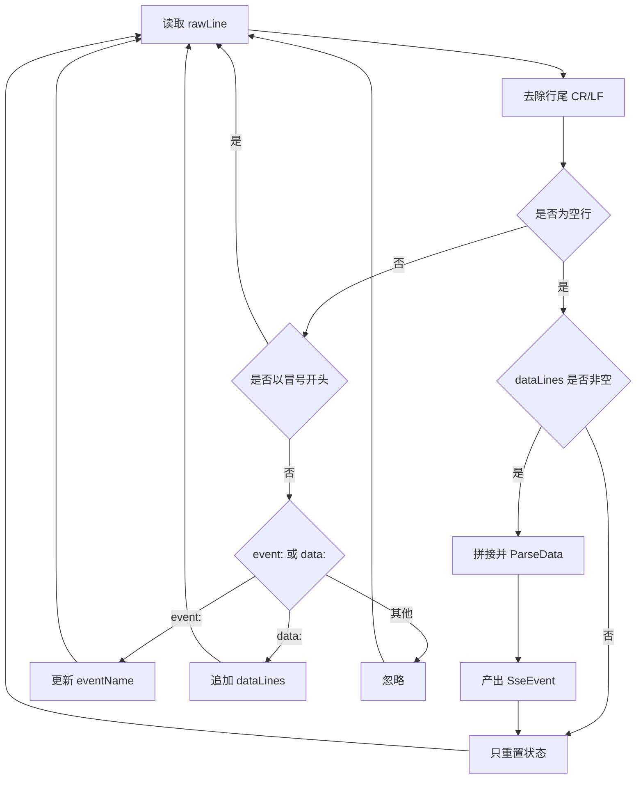
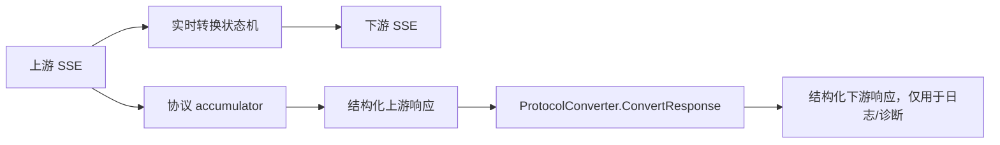

# 流式代理管线与 SSE 解析

## 1. 文档目的

本文描述代理收到 `stream=true` 后，从入口请求到上游 SSE、协议转换、下游写出和日志落库的完整路径。重点解释：

- 什么时候直接透传，什么时候进入跨协议转换器；
- 为什么正式写出前要先确认上游流已经启动；
- SSE 行如何组合为事件；
- TTFT、首 SSE、首文本、首推理和完成事件如何计时；
- 上游失败发生在“首字节之前”和“首字节之后”时为何有不同处理结果。

对应核心源码：

- `opencodex_proxy/src/Libraries/OpenCodex.Core/Services/Proxy/ProxyEndpointService.cs`
- `opencodex_proxy/src/Libraries/OpenCodex.Core/Services/Proxy/ProxyStreamService.cs`
- `opencodex_proxy/src/Libraries/OpenCodex.Core/ExternalIntegrations/HttpUpstreamClient.Streaming.cs`
- `opencodex_proxy/src/Libraries/OpenCodex.Core/Protocols/SseStreamConverter.Parsing.cs`
- `opencodex_proxy/src/Presentation/OpenCodex.Api/Infrastructure/ProxyStreamResponseWriter.cs`
- `opencodex_proxy/src/Libraries/OpenCodex.CoreBase/Abstractions/TrackingProxyStreamWriter.cs`

---

## 2. 入口条件

`ProxyEndpointService.ProxyAsync` 仅在请求体中的 `stream` 值严格为布尔值 `true` 时进入流式路径：

```csharp
var isStream = payload.TryGetValue("stream", out var streamValue)
    && streamValue is true;
```

字符串 `"true"` 不会在这里被视为流式请求。进入流式服务前，代理已经完成：

1. 访问 API Key 鉴权；
2. 原始模型读取；
3. 图片输入检测；
4. 候选渠道排序；
5. 熔断状态与容量租约检查；
6. 图片 OCR 降级、Web Search 模式处理和渠道兼容重写；
7. `ProtocolConverter.ConvertRequest` 请求协议转换；
8. `ProtocolConverter.SupportsStreamingConversion` 支持性校验。

因此 `ProxyStreamService.StreamAsync` 接收的 `UpstreamRequest` 已经是目标渠道协议，随后只需强制设置：

```text
upstreamRequest.stream = true
```

---

## 3. 总体流程



### 3.1 分支优先级

`ProxyStreamService.StreamAsync` 的判断顺序不是简单的“同协议/跨协议”二选一，而是：

| 顺序 | 条件 | 处理器 | 说明 |
|---|---|---|---|
| 1 | `IWebSearchSimulator.CanSimulate(...) == true` | `RunChatStreamAsync` | 仅 Responses 入口、Chat/Messages 渠道、超级管理员、声明 `web_search` 且模式为 `simulate` |
| 2 | `EntryProtocol == ChannelType` | 透明透传 | 下游收到原上游协议事件，旁路累积完整响应用于日志 |
| 3 | 其他已支持组合 | `SseStreamConverter` | 根据 `(入口协议, 渠道协议)` 派发到六个转换器 |
| 4 | 未登记组合 | `BadRequestException` | 正常情况下已在 `ProxyEndpointService` 被前置拦截 |

Web Search 模拟优先级最高，因为它需要自行执行“模型调用 → 搜索 → 续轮模型调用”的多轮流式循环。

---

## 4. 上游流建立与重试

### 4.1 HTTP 请求设置

`HttpUpstreamClient.StreamJsonAsync` 根据渠道类型选择端点：

| 渠道类型 | 上游路径 |
|---|---|
| `responses` | `/responses` |
| `chat` | `/chat/completions` |
| `messages` | `/messages` |

请求使用 `HttpCompletionOption.ResponseHeadersRead`，意味着响应头到达后即可开始读取响应体，不等待整个响应结束。

### 4.2 重试层判断

流式上游存在两类可重试失败：

1. HTTP 层状态：`429`、`500`、`502`、`503`、`504`；
2. HTTP 200 但首个 SSE JSON 是：
   - `error.type = rate_limit_error`
   - `error.type = overloaded_error`

第二类由 `ProbeStreamForRetryableError` 处理。探测过程中读到的行保存在 `bufferedLines`；若首个有效 `data:` 不是可重试错误，这些行会原样回放，避免吞掉流首部。



### 4.3 退避时间

优先使用上游 `Retry-After`：

- Delta 或绝对日期都支持；
- 最大等待 30 秒；
- 未提供时使用 `min(2s × 2^attempt, 8s)`；
- 所有路径再叠加 0 到 20% 的向上抖动，并保证不低于 2 秒。

渠道 `retry_count` 表示额外重试次数，因此总尝试次数为 `retry_count + 1`。非法或缺失值默认按 `3` 处理。

---

## 5. 首行确认与延迟启动下游响应

跨协议路径会调用 `ConfirmUpstreamStreamStartedAsync`：

1. 获取上游异步枚举器；
2. 主动执行一次 `MoveNextAsync()`；
3. 若第一行获取失败，异常在任何下游 SSE 写出前抛出；
4. 若流为空，返回空异步流；
5. 若成功，使用 `ReplayPrimedStreamLines` 先回放第一行，再继续读取余下行。

这一步与 `TrackingProxyStreamWriter`、`ProxyStreamResponseWriter` 的延迟 `PrepareSse` 共同保证：

- 上游在首行前失败时，仍可切换其他渠道；
- 所有渠道都失败时，客户端仍可收到普通 JSON 错误；
- 只有真正准备输出 SSE 时才提交响应头；
- 一旦客户端已经收到任何流内容，就不再跨渠道重试。



---

## 6. SSE 解析规则

`SseStreamConverter.ParseEvents` 将上游“行序列”解析为 `SseEvent(EventName, Data)`。

### 6.1 状态变量

| 状态 | 初始值 | 更新规则 |
|---|---|---|
| `eventName` | `message` | 遇到 `event:` 时替换；事件边界后恢复 `message` |
| `dataLines` | 空列表 | 每个 `data:` 去掉前缀并追加 |

### 6.2 行判断

| 行形态 | 行为 |
|---|---|
| 空行 | 若存在 `dataLines`，组合并产出一个事件；随后重置状态 |
| `:` 开头 | SSE 注释/心跳，忽略 |
| `event:` | 保存事件名 |
| `data:` | 保存数据行，允许一个事件包含多行 data |
| 其他字段 | 当前实现忽略 |
| EOF 时仍有 data | 仍产出最后一个事件 |

多行 data 使用换行符拼接。拼接内容首先尝试 JSON 解析；解析成功转为字典、列表或基础类型，失败则保留字符串。因此 Chat 的 `[DONE]` 会作为字符串进入转换器。



### 6.3 与日志捕获解析器的区别

`ParseEvents` 服务于实时协议转换，策略偏简单；`StreamResponseCapture` 服务于日志重建，额外处理：

- 被拆成多个 chunk 的 SSE 行；
- 多行 JSON 的可恢复拼接；
- 待解析数据的字节数和行数上限；
- malformed 计数；
- 截断预算；
- 终止原因元数据。

两者职责不同，不应互相替代。

---

## 7. 同协议透传

当 `EntryProtocol == ChannelType` 时，代理不重写事件内容：

```text
上游行
  → CaptureLoggableStreamLines(source=upstream)
  → CapturePassThroughResponse
  → StreamResponseCapture.Accept
  → 下游 WriteLinesAsync
```

`CapturePassThroughResponse` 每收到一个 chunk 会：

1. 将 chunk 交给 `StreamResponseCapture`；
2. 原样 `yield return` 给客户端；
3. 如果捕获器已识别终止事件，则主动结束枚举，防止上游已经发出终止事件但连接迟迟不关闭。

三种协议的完成判断：

| 协议 | 正常终止信号 | 错误终止信号 |
|---|---|---|
| Responses | `response.completed` / `response.incomplete` | `response.failed` |
| Chat | `[DONE]` | JSON `error` 由累积器捕获；是否有 `[DONE]` 决定完整性 |
| Messages | `message_stop` | `error` |

透传仍会重建结构化上游响应，用于 Usage、日志详情和故障排查，但不会用重建结果替换客户端收到的原始 SSE。

---

## 8. 跨协议转换派发

`ProxyStreamService` 以 `(入口协议, 渠道协议)` 作为键。入口协议决定下游格式，渠道协议决定上游格式。

| 入口协议（下游） | 渠道协议（上游） | 转换器 |
|---|---|---|
| Responses | Chat | `ChatToResponsesEvents` |
| Responses | Messages | `MessagesToResponsesEvents` |
| Messages | Chat | `ChatToMessagesEvents` |
| Chat | Messages | `MessagesToChatEvents` |
| Chat | Responses | `ResponsesToChatEvents` |
| Messages | Responses | `ResponsesToMessagesEvents` |

转换器在实时产出下游事件的同时，使用对应 accumulator 重建“转换前的上游完整响应”，写入 `ConvertedStreamResult.UpstreamResponse`。流结束后，`ProxyStreamService` 再调用一次非流式 `ProtocolConverter.ConvertResponse`，生成日志中的结构化下游响应。

这意味着有两条并行数据路径：



---

## 9. 写出指标与 TTFT

`IProxyStreamWriter.WriteLinesAsync` 返回 `StreamWriteMetrics`。当前日志会保存：

- `TtftMs`：第一个满足计数谓词的输出时间；
- `FirstSseEventMs`：首次 SSE 写出时间；
- `FirstOutputTextDeltaMs`：首个 `response.output_text.delta`；
- `FirstReasoningSummaryTextDeltaMs`：首个推理摘要增量；
- `CompletedEventMs`：完成事件时间。

跨协议 Responses 输出使用 `SseStreamConverter.CountsForTtft`，以下事件可计入 TTFT：

- `response.output_text.delta`
- `response.reasoning_summary_text.delta`
- `response.function_call_arguments.delta`
- `response.custom_tool_call_input.delta`
- `response.output_item.done`

`response.created` 和 `response.in_progress` 不算有效首 Token，避免把协议外壳时间误认为模型首输出时间。

同协议透传使用“非空行”作为计时条件，因此其 TTFT 语义更接近“上游首个可见 SSE 行”。比较不同路径指标时必须注意这一差异。

---

## 10. 异常与取消

### 10.1 `ProxyStreamService` 内部

| 异常 | 捕获结果 |
|---|---|
| `OperationCanceledException` | `StreamCaptureTermination.ClientCancelled` |
| `ProxyException` | 保存真实内部状态码、标准错误响应和可能的上游错误体，然后继续向外抛出 |
| 其他异常 | 保存错误文本，尽量保留已捕获响应，然后继续向外抛出 |

无论成功失败，`finally` 都会调用 `ProxyLogService.CompleteLogAsync`。

### 10.2 `ProxyEndpointService` 外层

- 尚未写出任何下游字节：可根据 `ProxyFailoverPolicy` 尝试下一渠道；
- 已写出任何下游字节：原响应已经提交，异常继续传播，不执行渠道切换；
- `UpstreamException` 在返回客户端时统一映射为 HTTP 502，但日志保留上游真实状态码和错误体；
- 中间件若发现 `Response.HasStarted == true`，不会尝试覆盖已开始的流。

---

## 11. 关键边界条件

1. **空上游流**：不会产生转换事件；捕获结果标记为不完整。
2. **首行前超时**：仍可进行渠道故障转移。
3. **首行后超时**：不会切换渠道，避免拼接两个不同上游的响应。
4. **Chat 缺少 `[DONE]`**：可能已有部分结构化响应，但捕获元数据标记未完整结束。
5. **Responses 终止后连接不关闭**：旁路捕获识别终止事件后主动停止继续读取。
6. **SSE data 非 JSON**：实时解析保留为字符串；日志捕获会增加 malformed 计数或使用 Usage-only 降级。
7. **客户端主动取消**：通过关联 CancellationToken 传递给 HTTP 读取、转换器和下游 writer。
8. **Web Search 多轮流**：只允许首轮输出 `response.created`；后续轮次复用 sequence/output index，最终只输出一个完成事件。

---

## 12. 测试锚点

| 测试文件 | 主要覆盖 |
|---|---|
| `ProxyStreamServiceTests.cs` | 透传、转换、延迟 PrepareSse、日志捕获、TTFT、错误体 |
| `UpstreamStreamErrorRetryTests.cs` | HTTP 200 + SSE rate-limit/overloaded 探测与重试 |
| `StreamingIntegrationTests.cs` | 实时产出、事件完整性、无整体缓冲 |
| `StreamResponseCaptureTests.cs` | 多行 data、截断、malformed、取消、响应重建 |
| `ProxyEndpointServiceTests.cs` | 首字节前后故障转移差异 |
| `ChannelDiagnosticsLogTests.cs` | 诊断流的透明上游捕获与转换后输出 |

建议重点回归：

```bash
dotnet test opencodex_proxy/OpenCodex.sln \
  --filter "FullyQualifiedName~ProxyStreamServiceTests|FullyQualifiedName~UpstreamStreamErrorRetryTests|FullyQualifiedName~StreamResponseCaptureTests"
```

---

## 13. 相关文档

- [六种跨协议流式状态机](02-six-cross-protocol-state-machines.md)
- [响应累积、捕获、终止与 TTFT](03-accumulators-capture-termination-and-ttft.md)
- [故障转移、重试与超时](../03-routing/03-failover-retry-and-timeout.md)
- [Web Search 模式与模拟循环](../08-special-flows/02-web-search-modes-and-simulation.md)
- [错误、日志与诊断](../09-reference/01-errors-logging-and-diagnostics.md)
