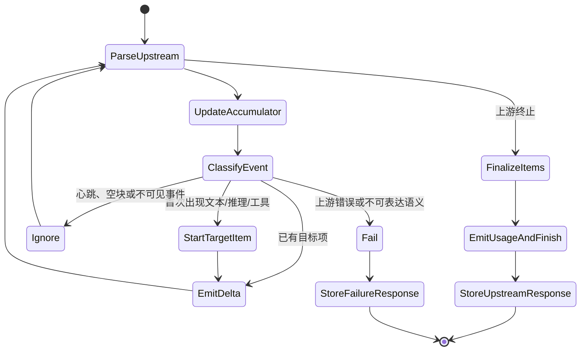
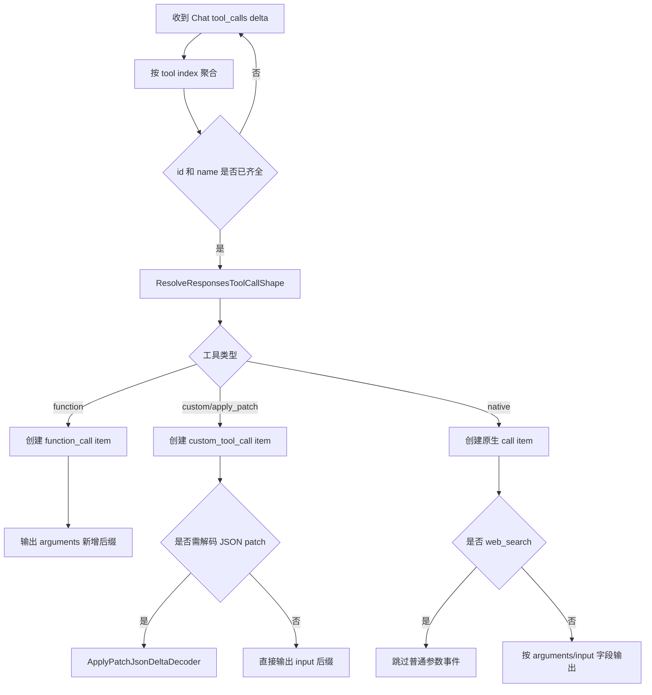
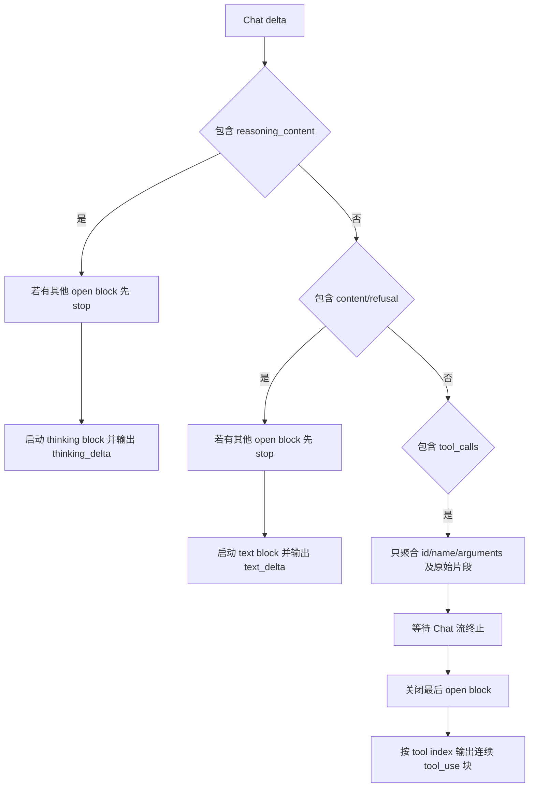
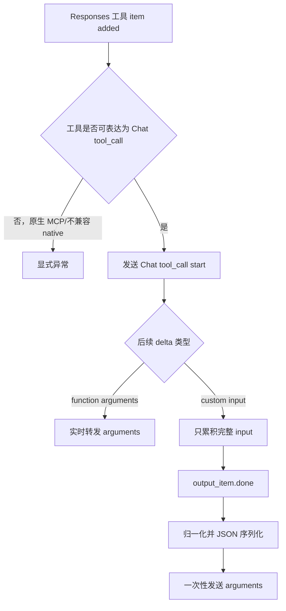

# 六种跨协议流式转换状态机

## 1. 阅读方法

三种协议形成六个跨协议方向。文件名采用“上游协议 → 下游协议”，而 `ProxyStreamService` 的派发键采用“入口协议（下游）在前、渠道协议（上游）在后”。例如：

```text
(EntryProtocol=responses, ChannelType=chat)
    → 上游 Chat
    → 下游 Responses
    → ChatToResponsesEvents
```

| 上游 | 下游 | 转换器源码 |
|---|---|---|
| Chat | Responses | `SseStreamConverter.Chat.cs` |
| Messages | Responses | `SseStreamConverter.Messages.cs` |
| Chat | Messages | `SseStreamConverter.ChatToMessages.cs` |
| Messages | Chat | `SseStreamConverter.MessagesToChat.cs` |
| Responses | Chat | `SseStreamConverter.ResponsesToChat.cs` |
| Responses | Messages | `SseStreamConverter.ResponsesToMessages.cs` |

所有转换器共同遵循三个原则：

1. **先保证目标协议事件顺序合法，再追求逐字符实时性**；
2. **无法无损表达的语义显式报错或记录限制，不伪造签名和 MCP 语义**；
3. **实时下游流与结构化上游响应累积同时进行**。

---

## 2. 总状态机



---

## 3. Chat → Responses

### 3.1 输入与输出

输入是 OpenAI Chat SSE：

```json
{
  "choices": [{
    "index": 0,
    "delta": {
      "content": "hello",
      "reasoning_content": "think",
      "tool_calls": []
    },
    "finish_reason": null
  }]
}
```

输出是 Responses 事件序列，主要包含：

```text
response.created
response.in_progress
response.output_item.added
response.content_part.added
response.output_text.delta
...
response.output_text.done
response.content_part.done
response.output_item.done
response.completed
```

### 3.2 核心状态

| 状态 | 作用 |
|---|---|
| `sequenceNumber` | 每个 Responses 事件递增；Web Search 续轮可传入初始值 |
| `nextOutputIndex` | 为 reasoning、message、tool call 分配全局 output index |
| `textStarted` / `messageOutputIndex` | 保证 message item 与 content part 仅创建一次 |
| `reasoningStarted` / `reasoningOutputIndex` | 保证 reasoning item 仅创建一次 |
| `toolCalls[index]` | 按 Chat tool index 累积 id、name、arguments |
| `toolStreamStates[index]` | 保存 Responses item id、output index、已流参数长度与工具种类 |
| `outputByIndex` | 构造最终 `response.completed.response.output` |
| `ChatStreamResponseAccumulator` | 重建原始 Chat 完整响应 |

### 3.3 文本与推理判断

| Chat delta 字段 | Responses 输出 |
|---|---|
| `content` | `response.output_text.delta` |
| `refusal` | 当前方向合并为 `response.output_text.delta`，同时在上游累积响应保留 refusal |
| `reasoning_content` | `response.reasoning_summary_text.delta` |

首次文本出现前依次创建 `message` output item 和 `output_text` content part。首次推理出现前依次创建 `reasoning` output item 和 `summary_text` part。

### 3.4 工具调用判断

Chat 工具参数可能被拆成多个 delta，转换器先聚合完整前缀，再仅发送“尚未发送的后缀”：

```text
aggregate.Arguments = 之前参数 + 新片段
newDelta = aggregate.Arguments[state.StreamedArgumentsLength..]
state.StreamedArgumentsLength = aggregate.Arguments.Length
```

工具形态由请求期保存的 `ResponsesToolCallMapping` 与工具名共同决定：

| 形态 | Responses item | 实时参数事件 |
|---|---|---|
| 普通函数 | `function_call` | `response.function_call_arguments.delta` |
| Responses 自定义工具 | `custom_tool_call` | `response.custom_tool_call_input.delta` |
| `apply_patch` 被代理为 Chat function | `custom_tool_call` | 经 `ApplyPatchJsonDeltaDecoder` 解码后输出 input delta |
| 可映射原生工具 | 原生 `*_call` | 根据参数字段选择 function arguments 或 custom input 事件 |
| `web_search` 原生调用 | `web_search_call` | 本转换器不发送普通参数事件，生命周期由 Web Search 流处理 |



### 3.5 收尾

上游 `[DONE]` 后：

1. 如有 `text.format=json_schema`，对合并文本进行结构化包装；
2. 发送 reasoning 的 done/part done/item done；
3. 发送文本的 text done/content part done/item done；
4. 对每个工具发送参数 done 与 item done；
5. 将 Chat usage 转为 Responses usage；
6. `finish_reason=length` 映射为 `status=incomplete` 和 `incomplete_details.reason=max_output_tokens`；
7. 其余情况发送 `response.completed`。

---

## 4. Messages → Responses

### 4.1 输入事件

Anthropic Messages 的典型结构：

```text
message_start
content_block_start
content_block_delta
content_block_stop
message_delta
message_stop
```

### 4.2 事件映射

| Messages 事件/块 | Responses 输出 |
|---|---|
| `thinking` + `thinking_delta` | reasoning item 与 `response.reasoning_summary_text.delta` |
| `text` + `text_delta` | message item 与 `response.output_text.delta` |
| `tool_use` | function/custom/native tool item |
| `input_json_delta.partial_json` | function arguments 或 custom input delta |
| `mcp_tool_use` | Responses MCP call |
| `mcp_tool_result` | 合并到对应 MCP call 的执行结果 |
| `message_delta.stop_reason=max_tokens` | `response.incomplete` |
| `error` | `response.failed` 并立即结束 |

### 4.3 内容块状态

`contentBlocks[index]` 保存每个 Messages block 的起始信息；`inputJsonParts[index]` 保存工具参数片段；`toolStates[index]` 保存目标 Responses item 的 output index 和工具形态。

Messages 允许工具输入以 `input_json_delta` 逐段出现。转换器会按 block index 找到目标工具状态，然后：

- 普通函数：输出 `response.function_call_arguments.delta`；
- 自定义工具：按需要通过 `ApplyPatchJsonDeltaDecoder` 解码，输出 `response.custom_tool_call_input.delta`；
- 原生工具：选择对应参数字段；
- Web Search：不重复输出普通参数生命周期。

### 4.4 Usage 映射

Messages usage 中：

```text
total input = input_tokens
            + cache_creation_input_tokens
            + cache_read_input_tokens
cached_tokens = cache_creation_input_tokens + cache_read_input_tokens
```

最终写入 Responses：`input_tokens`、`output_tokens`、`total_tokens`、`input_tokens_details.cached_tokens`。

### 4.5 终止

| Messages stop reason | Responses 结果 |
|---|---|
| `max_tokens` | `response.incomplete` |
| 其他正常结束 | `response.completed` |
| `error` | `response.failed` |

`tool_use` 不会把 Responses 状态改成 incomplete；工具项仍出现在 output 中，由客户端继续工具循环。

---

## 5. Chat → Messages

### 5.1 目标协议约束

Anthropic 要求每个 content block 的事件必须连续：

```text
content_block_start(index=N)
content_block_delta(index=N)*
content_block_stop(index=N)
```

已经 stop 的块不允许再次追加 delta。Chat 则允许多个工具的参数 delta 交错出现。因此转换器采用两种策略：

- thinking 和 text：实时输出，但切换类型时关闭当前 block；
- tool_calls：先聚合，等 Chat 流结束后按 tool index 顺序逐块输出。

### 5.2 块管理状态

| 状态 | 作用 |
|---|---|
| `nextBlockIndex` | 分配 Messages content block index |
| `openBlockIndex` | 当前可继续追加 delta 的块 |
| `thinkingStarted` / `thinkingIndex` | thinking 块状态 |
| `textStarted` / `textIndex` | text 块状态 |
| `toolAggregates` | 按 Chat tool index 聚合工具 |
| `toolArgumentDeltas` | 保留每次 arguments 原始片段，收尾时顺序回放 |



### 5.3 字段映射

| Chat | Messages |
|---|---|
| `delta.reasoning_content` | `thinking_delta.thinking` |
| `delta.content` | `text_delta.text` |
| `delta.refusal` | 归入 `text_delta.text` |
| `tool_call.id` | `tool_use.id` |
| `function.name` | `tool_use.name` |
| `function.arguments` 片段 | `input_json_delta.partial_json` |

Chat 不携带 Anthropic thinking signature，因此只生成普通 `thinking` block，不生成 `signature_delta` 或 `redacted_thinking`。

### 5.4 完成原因

| Chat finish reason | Messages stop reason |
|---|---|
| `stop` | `end_turn` |
| `length` | `max_tokens` |
| `tool_calls` / `function_call` | `tool_use` |
| 其他 | `end_turn` |

最后依次输出 `message_delta` 和 `message_stop`。`message_start.usage.input_tokens` 固定为 0，因为输入 token 通常只在上游末尾 usage 中出现，不能回填已经发出的首事件。

---

## 6. Messages → Chat

### 6.1 角色首块

Chat 客户端通常期望首个 choice delta 包含：

```json
{"role":"assistant"}
```

`EnsureRoleChunk` 保证该块最多输出一次。即使整个 Messages 响应没有文本或工具，也会在结束前补出角色块。

### 6.2 事件映射

| Messages | Chat chunk delta |
|---|---|
| `thinking_delta` | `reasoning_content` |
| thinking block 上的 `text_delta` | 同样映射到 `reasoning_content` |
| `text_delta` | `content` |
| `tool_use` start | `tool_calls[index].id/type/function.name`，arguments 为空 |
| `input_json_delta` | `tool_calls[index].function.arguments` |
| `content_block_stop` | 无对应事件，忽略 |
| `message_delta.stop_reason` | 最终 Chat `finish_reason` |
| `message_stop` | 结束读取 |

每个 Messages block index 会映射到连续的 Chat tool index，避免 Anthropic content block index 与 Chat tool index 混用。

### 6.3 Usage 控制

仅当入口 Chat 请求包含：

```json
{"stream_options":{"include_usage":true}}
```

`ProxyStreamService` 才以 `IncludeUsage=true` 调用转换器，随后在 finish chunk 之后、`[DONE]` 之前输出一个 `choices=[]` 的 usage chunk。

### 6.4 停止原因

| Messages stop reason | Chat finish reason |
|---|---|
| `end_turn` | `stop` |
| `max_tokens` | `length` |
| `tool_use` | `tool_calls` |
| `stop_sequence` | `stop` |
| 其他 | `stop` |

上游 `error` 会被转换为 `data: {"error":...}`，随后直接结束，不输出正常 finish chunk 或 `[DONE]`。

---

## 7. Responses → Chat

### 7.1 主要状态

| 状态 | 用途 |
|---|---|
| `firstRoleEmitted` | Chat assistant role 只发送一次 |
| `toolStates[outputIndex]` | Responses output index 到 Chat tool index、call id、name、kind 的映射 |
| `outputByIndex` | 保存完成后的 Responses output，用于上游响应重建 |
| `textParts/refusalParts/reasoningParts/annotations` | 重建终端 Responses 响应 |
| `ResponsesStreamResponseAccumulator` | 捕获真实 Responses 终端 envelope 与增量 |

### 7.2 输出项加入判断

`response.output_item.added` 到达时：

1. 若是原生 MCP item，Chat 无法保持其服务端执行语义，显式抛出异常；
2. 若是服务端执行的原生工具，例如已由上游完成的 Web Search，保存 output 但不伪造成客户端函数；
3. 若能取得客户端工具名与形态，创建 Chat `tool_calls` 起始 chunk；
4. 若属于其他不可表达的 Responses 原生调用，显式抛出异常；
5. 普通 message/reasoning item 不在这里创建 Chat 内容块，等待相应 delta。

### 7.3 内容映射

| Responses 事件 | Chat delta |
|---|---|
| `response.output_text.delta` | `content` |
| `response.refusal.delta/done` | `refusal`，done 仅补未出现的后缀 |
| `response.output_text.annotation.added` | `annotations` |
| `response.reasoning_summary_text.delta` | `reasoning_content` |
| `response.function_call_arguments.delta` | Chat function arguments 增量 |
| `response.custom_tool_call_input.delta` | 只累积，不立即发送 |

### 7.4 自定义工具为何延迟发送

Responses 自定义工具可传递任意文本，例如原始 patch；Chat `function.arguments` 必须是 JSON 字符串。逐字符把原始 patch 当 JSON 参数发送会产生长期无效的 JSON 片段。

因此在 `response.output_item.done` 时：

1. 取得完整 `item.input`；
2. 若是公开 `apply_patch` 且输入为字符串，转换为 `{ "patch": "..." }`；
3. JSON 序列化；
4. 一次性作为 Chat function arguments delta 发出。

普通 function call 的 arguments 本身已经是 JSON 片段，可以实时转发。



### 7.5 结束

| Responses 终态 | Chat finish reason |
|---|---|
| `incomplete` | `length` |
| 存在待客户端执行工具调用 | `tool_calls` |
| 正常 completed | `stop` |
| `response.failed` | 输出错误 data 后结束，不发送正常 `[DONE]` |

正常结束会依次发送 finish chunk、可选 usage chunk和 `data: [DONE]`。

---

## 8. Responses → Messages

### 8.1 文本块与 thinking 块

转换器使用 `openBlockIndex` 确保 Anthropic block 顺序合法。首次 reasoning delta 创建 thinking block；首次文本或 refusal 创建 text block；二者切换时先停止上一个 block。

| Responses | Messages |
|---|---|
| reasoning summary delta | `thinking_delta` |
| output text delta | `text_delta` |
| refusal delta/done | `text_delta` |
| URL citation annotation | Anthropic citation block/字段 |

Responses reasoning 没有 Anthropic 的 signature，因此不生成签名。

### 8.2 工具与 MCP

`response.output_item.added` 可能产生：

| Responses item | Messages block |
|---|---|
| function/custom/client native call | `tool_use` |
| 原生 MCP call | `mcp_tool_use`，保留 server name |
| MCP call 完成且带 output/error | 追加 `mcp_tool_result` block |
| 服务端执行的 Web Search | 保留于最终 Responses 累积，不伪造成客户端 tool_use |
| 无兼容表示的原生调用 | 显式异常 |

工具输入遵循与 Responses → Chat 相同的策略：function 参数可实时输出 `input_json_delta`，custom input 在 item done 时完整序列化后一次性输出。

`pendingToolUseCount` 用于决定最终 stop reason：

- MCP 已含服务端结果时会减少 pending 计数；
- 仍有未完成客户端工具使用时，completed 映射为 `tool_use`；
- incomplete 始终优先映射为 `max_tokens`。

### 8.3 完成原因

```text
status == incomplete         → max_tokens
status == completed 且有工具 → tool_use
其他 completed              → end_turn
```

最终关闭仍打开的 content block，再发出 `message_delta` 和 `message_stop`。`response.failed` 转换为 Anthropic `error` 事件，不发送正常 `message_stop`。

---

## 9. 同类字段的方向差异

### 9.1 Reasoning

| 方向 | 处理方式 |
|---|---|
| Chat → Responses | `reasoning_content` → reasoning summary |
| Messages → Responses | thinking 文本 → reasoning summary；签名只保存在上游响应，不伪造为 Responses 签名语义 |
| Chat → Messages | reasoning → thinking，无 signature |
| Messages → Chat | thinking → `reasoning_content`，丢失 signature/redacted 语义 |
| Responses → Chat | reasoning summary → `reasoning_content` |
| Responses → Messages | reasoning summary → thinking，无 signature |

### 9.2 Refusal

| 目标协议 | 表达方式 |
|---|---|
| Responses | Chat refusal 当前归并到 output text；Responses 原生 refusal 在出站方向仍保留结构 |
| Chat | Responses refusal → `delta.refusal` |
| Messages | 无专用 refusal 块，归入 text block |

### 9.3 工具参数

| 源形态 | 目标处理 |
|---|---|
| 已是 JSON 参数片段 | 可实时透传 |
| 任意自定义文本 | 缓冲至完整后 JSON 序列化 |
| apply_patch JSON 包装 | 入站 Responses 时可用 delta decoder 解出原始 patch |
| 多工具交错且目标 Messages | 为保证块连续性，必要时延迟至上游结束后顺序输出 |

---

## 10. 不可无损表示时的策略

| 场景 | 策略 |
|---|---|
| Responses 原生 MCP → Chat | 抛出明确异常，不伪造成普通函数 |
| Responses 不兼容 native call → Chat/Messages | 抛出明确异常 |
| Anthropic thinking signature → Chat | 不输出签名，只输出纯 reasoning 文本 |
| Responses reasoning → Messages | 不伪造 Anthropic signature |
| Messages block stop → Chat | Chat 无对应事件，忽略 |
| Chat refusal → Messages | 合并为文本 |
| 服务端已执行 Web Search → Chat/Messages | 保留最终答案流，不要求客户端再次执行 |

---

## 11. 测试覆盖

| 测试文件 | 覆盖方向 |
|---|---|
| `SseStreamConverterTests.cs` | 六方向基础文本、推理、工具、usage、终态 |
| `ChatMessagesStreamingCompatibilityTests.cs` | Chat ↔ Messages 块顺序、错误和 usage 控制 |
| `InboundStreamingCompatibilityTests.cs` | Chat/Messages → Responses 的 incomplete、自定义工具、MCP |
| `ResponsesOutboundStreamingCompatibilityTests.cs` | Responses → Chat/Messages 的 refusal、annotation、MCP、失败 |
| `StreamingIntegrationTests.cs` | Chat/Messages → Responses 端到端和实时性 |
| `ProxyCompatibilityTests.cs` | apply_patch、tool_search、Web Search 多轮与命名空间 |

---

## 12. 相关文档

- [流式代理管线与 SSE 解析](01-stream-pipeline-and-sse-parsing.md)
- [响应累积、捕获、终止与 TTFT](03-accumulators-capture-termination-and-ttft.md)
- [工具契约、名称和 Schema](../05-tools/01-tool-contract-name-and-schema.md)
- [Apply Patch、原生工具与自定义工具](../05-tools/02-apply-patch-native-and-custom-tools.md)
- [Web Search、MCP 与工具历史](../05-tools/03-web-search-mcp-and-tool-history.md)
