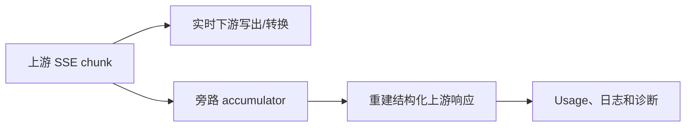
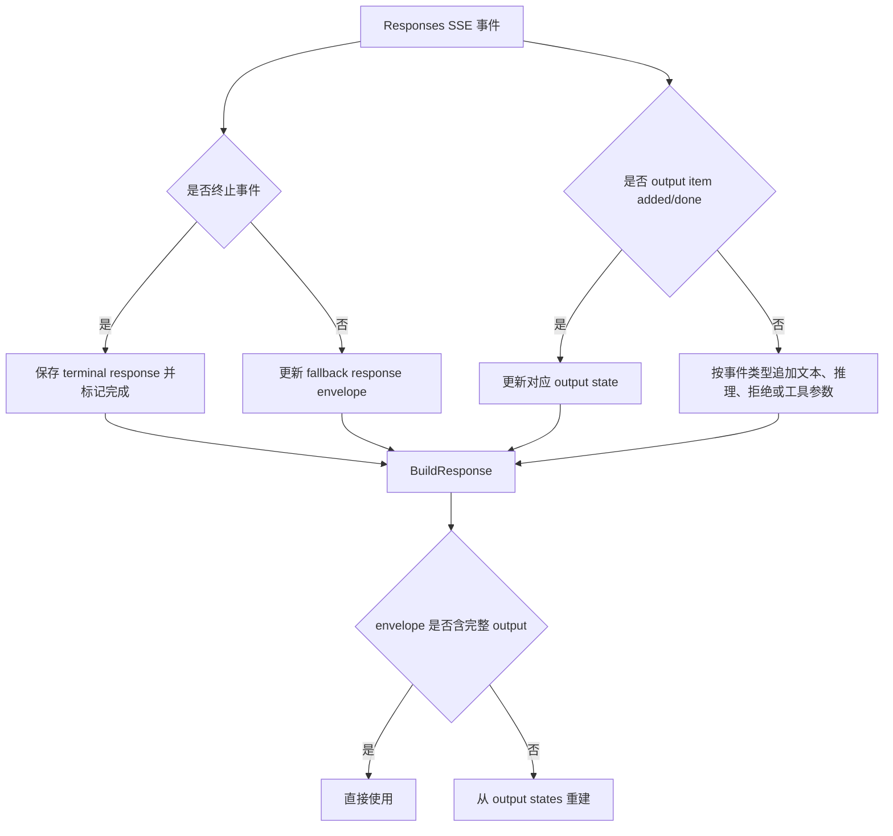
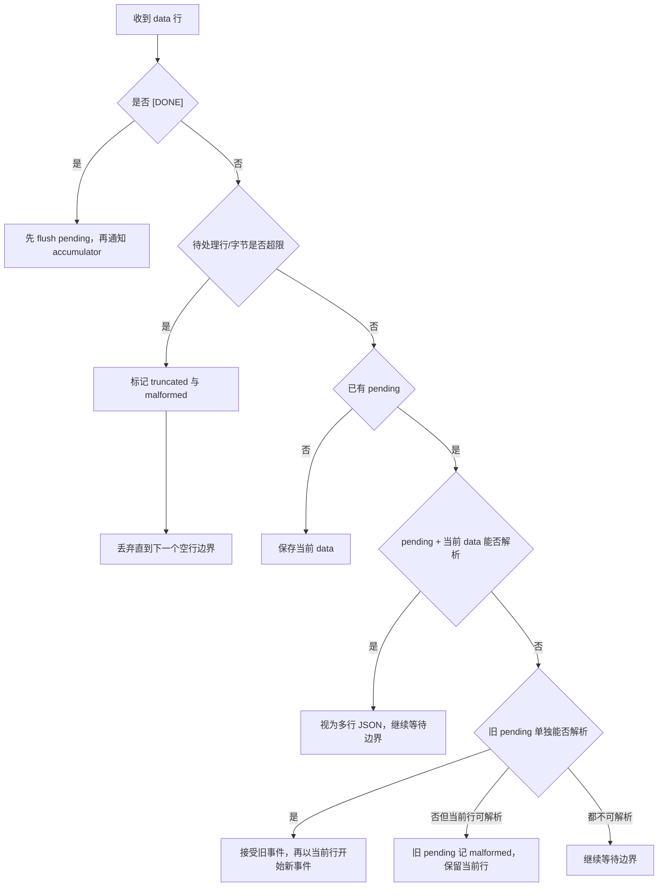
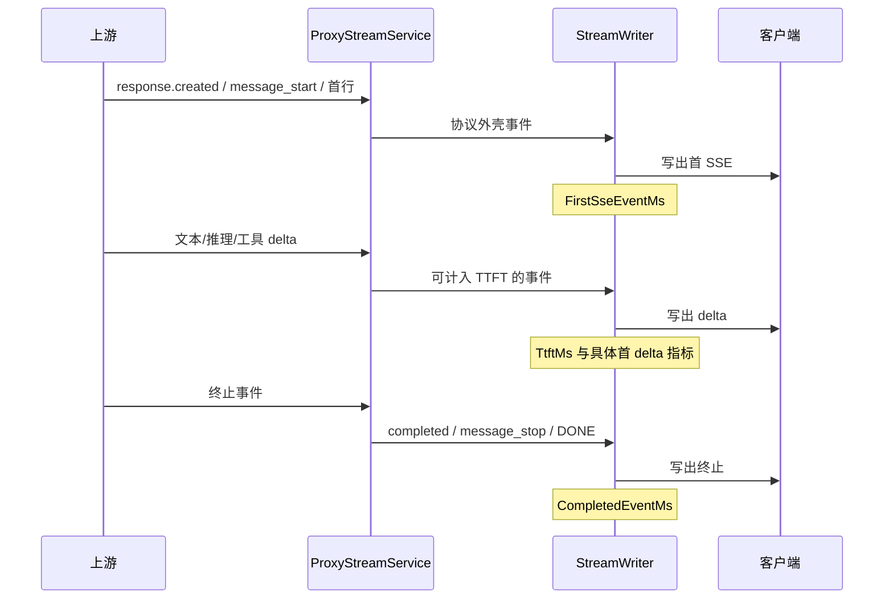

# 响应累积、流捕获、终止检测与 TTFT

## 1. 为什么需要“旁路累积”

流式响应天然是增量数据，但日志、Usage 统计、诊断页面和转换后结构化响应需要一个完整对象。OpenCodex 没有为了记录日志而把整个流先缓冲后再返回，而是同时运行两条路径：



相关源码：

- `Protocols/ChatStreamResponseAccumulator.cs`
- `Protocols/MessagesStreamResponseAccumulator.cs`
- `Protocols/ResponsesStreamResponseAccumulator.cs`
- `Protocols/StreamResponseCapture.cs`
- `Services/Proxy/ProxyStreamService.cs`
- `CoreBase/Abstractions/StreamWriteMetrics.cs`

---

## 2. 两种累积使用方式

### 2.1 跨协议转换器内部累积

六个 `SseStreamConverter` 在解析 `SseEvent` 后，直接把事件交给对应 accumulator：

| 上游协议 | accumulator |
|---|---|
| Chat | `ChatStreamResponseAccumulator` |
| Messages | `MessagesStreamResponseAccumulator` |
| Responses | `ResponsesStreamResponseAccumulator` |

这里使用近似无限预算：

```text
StreamCaptureBudget(int.MaxValue, int.MaxValue)
```

转换结束后写入 `ConvertedStreamResult.UpstreamResponse`。

### 2.2 同协议透传的 `StreamResponseCapture`

同协议透传拿到的是原始字符串 chunk，`StreamResponseCapture` 先执行更健壮的 SSE 拼装，再将结构化事件交给 accumulator。默认捕获预算：

| 限制 | 数值 |
|---|---|
| 总捕获字节 | 1 MiB |
| 集合最大项数 | 256 |
| 单个待解析 SSE data | 256 KiB |
| 单个待解析 SSE data 行数 | 1024 |

超过预算不会影响客户端收到原始流，只会让日志捕获结果标记 `truncated=true`。

---

## 3. 统一接口

三个协议累积器都实现：

```csharp
internal interface IStreamResponseAccumulator
{
    bool IsComplete { get; }
    void Accept(SseEvent streamEvent);
    Dictionary<string, object?>? BuildResponse();
}
```

语义：

- `Accept`：消费一个结构化 SSE 事件；
- `IsComplete`：是否已经观察到协议终止信号；
- `BuildResponse`：在当前已有信息基础上重建响应，允许部分响应。

`BuildResponse` 不保证完整，完整性由 `StreamResponseCaptureResult.Completed` 和 `_opencodex_capture` 元数据说明。

---

## 4. Chat 响应累积器

### 4.1 完成条件

收到字符串 `[DONE]` 时设置 `IsComplete=true`。

### 4.2 envelope 捕获

Chat chunk 中以下信息只需保留首次或最新有效值：

- `id`
- `object`
- `model`
- `created`
- `system_fingerprint`
- `service_tier`
- `usage`

### 4.3 choice 状态

每个 `choices[].index` 对应一个 `ChoiceState`：

| 字段 | 累积策略 |
|---|---|
| `role` | 首个非空值 |
| `content` | 顺序追加 delta |
| `reasoning_content` | 顺序追加 delta |
| `refusal` | 顺序追加 delta |
| `finish_reason` | 最新非空值 |
| `logprobs` | 有界复制 |
| `tool_calls` | 按 tool index 继续累积 |

工具状态继续拆为：`type`、`id`、`name`、`arguments`。`id` 和 `name` 某些上游可能重复出现在多个 chunk 中，`AppendOnce` 避免重复拼接同一标识符；arguments 则必须逐段追加。

### 4.4 重建输出

最终生成类似非流式 Chat completion：

```json
{
  "id": "chatcmpl_...",
  "object": "chat.completion",
  "model": "MODEL",
  "choices": [{
    "index": 0,
    "message": {
      "role": "assistant",
      "content": "完整文本",
      "reasoning_content": "完整推理",
      "tool_calls": []
    },
    "finish_reason": "stop"
  }],
  "usage": {}
}
```

若只观察到 usage 而没有 choice，仍可生成可供计费统计使用的响应对象。

---

## 5. Messages 响应累积器

### 5.1 完成条件

| 事件 | 完成状态 |
|---|---|
| `message_stop` | 完成 |
| `error` | 完成，但结果为错误对象 |

### 5.2 message envelope

只保留：

```text
id, type, role, model, stop_reason, stop_sequence
```

Usage 允许字段：

```text
input_tokens
output_tokens
cache_creation_input_tokens
cache_read_input_tokens
cache_creation
server_tool_use
```

`message_start.usage` 与 `message_delta.usage` 合并，后到值覆盖同名字段。

### 5.3 ContentBlockCapture

每个 block index 对应独立捕获器，支持：

| block/delta | 累积内容 |
|---|---|
| `text` / `text_delta` | 文本 |
| `thinking` / `thinking_delta` | thinking 文本 |
| `signature_delta` | 签名字符串 |
| `input_json_delta` | 工具 JSON 参数片段 |
| `tool_use` | id、name、input |
| `mcp_tool_use` / `mcp_tool_result` | 原生 MCP 字段 |
| 其他字段 | 在预算允许时保留 |

若先收到 delta、未收到 start，`InferContentBlock` 会根据 delta 类型推断块类型，以尽量重建部分响应。

工具 input JSON 在 `Build()` 时解析：

- 合法 JSON：返回结构化值；
- 空字符串：返回空对象；
- 非法 JSON：保留原始字符串，避免丢失排障信息。

---

## 6. Responses 响应累积器

### 6.1 完成条件

以下任何事件都会结束捕获：

- `response.completed`
- `response.incomplete`
- `response.failed`

### 6.2 terminal 与 fallback envelope

Responses 流可能：

1. 终止事件包含完整 `response.output`；
2. 终止事件包含 response 但省略 output；
3. 只有 created/in_progress envelope 和增量；
4. 终止前连接中断。

累积器分别维护：

- `_terminalResponse`：终止事件里的 response 投影；
- `_fallbackResponse`：非终止 envelope 的最新投影；
- `_outputStates`：从 item 和 delta 重建的 output。

`BuildResponse` 优先 terminal，其次 fallback；若所选 envelope 缺少有效 output，则使用 `_outputStates` 重建。

### 6.3 output state

每个 `output_index` 可重建：

| 事件 | 目标字段 |
|---|---|
| `response.output_item.added` | item 基础字段 |
| `response.output_item.done` | 完整 item 覆盖/补全 |
| `response.output_text.delta/done` | message content 中的 output_text |
| `response.refusal.delta/done` | refusal part |
| `response.reasoning_summary_text.delta/done` | reasoning summary |
| `response.function_call_arguments.delta/done` | function_call.arguments |
| `response.custom_tool_call_input.delta/done` | custom_tool_call.input |
| `response.content_part.added/done` | content part 元数据 |

如果 response 有 model 但无 usage，构建结果会补空 usage 对象，保证日志 Usage 提取逻辑有稳定结构。



---

## 7. `StreamResponseCapture` 的 SSE 恢复逻辑

### 7.1 chunk 与 line

传入 `Accept(string chunk)` 的字符串不保证正好是一行。捕获器会：

1. 把 CRLF 和 CR 统一为 LF；
2. 按 LF 拆分；
3. 将每行交给 `AcceptLine`；
4. 保留没有行尾换行的最后部分，等待后续 chunk 拼接语义由调用方行边界保证。

### 7.2 待处理 data

捕获器不会每看到一条 `data:` 就立即认为事件完成，因为：

- SSE 允许多条 data 行；
- 某些上游会把 JSON 拆为多行；
- 某些测试/代理层可能把两个独立 JSON data 紧邻传入。

核心判断：



### 7.3 观察器失败隔离

捕获器是旁路观察器，其失败不应中断客户端流。除 `OutOfMemoryException`、`StackOverflowException`、`AccessViolationException` 外，捕获异常会设置 `_observerFailed=true`，随后停止捕获，但上游 chunk 仍继续传给客户端。

---

## 8. 捕获预算

`StreamCaptureBudget` 同时控制字符串追加与对象复制。

### 8.1 字符串截断

当剩余字节不足时，使用二分搜索找到按 UTF-8 字节计算能容纳的最大字符前缀，并避免在 UTF-16 surrogate pair 中间切断。

因此：

- 截断依据是 UTF-8 字节，不是 `.Length`；
- Emoji 等字符不会留下半个 surrogate；
- `Truncated=true` 会记录到捕获元数据。

### 8.2 对象复制

`Fits(value)` 先 JSON 序列化计算字节数：

- 能放入预算：扣减预算并复制；
- 超出预算：跳过该大字段并标记截断。

Responses 的 `output`、`error`、`incomplete_details` 等大对象采用此策略，因此日志可能保留 envelope 和 Usage，但省略超大 output。

---

## 9. 完成结果与 `_opencodex_capture`

`Complete(StreamCaptureTermination termination)` 是幂等操作；重复调用返回同一个结果。

只有同时满足以下条件才算 `Completed=true`：

1. 外部终止原因是 `Completed`；
2. accumulator 识别到协议终止信号；
3. 观察器没有失败。

只要存在异常情况，就在响应中加入：

```json
{
  "_opencodex_capture": {
    "completed": false,
    "termination": "UnexpectedEnd",
    "truncated": false,
    "malformed_events": 1,
    "observer_failed": false
  }
}
```

`termination` 可为：

| 值 | 含义 |
|---|---|
| `Completed` | 外层认为流正常完成 |
| `UpstreamError` | 上游或转换过程中失败 |
| `ClientCancelled` | 客户端取消 |
| `UnexpectedEnd` | 未明确完成就结束 |

若 accumulator 没能重建任何协议字段，但需要记录异常元数据，会创建只含 `_opencodex_capture` 的对象。

---

## 10. TTFT 与写出时间

`StreamWriteMetrics` 记录“代理真正写出”的时间，而不是仅记录上游到达时间。其时间基准由调用方提供的 `elapsedMsProvider` 统一计算。

### 10.1 Responses 转换路径

`CountsForTtft` 只把具有用户可见或工具可执行意义的事件视为首输出：

```text
response.output_text.delta
response.reasoning_summary_text.delta
response.function_call_arguments.delta
response.custom_tool_call_input.delta
response.output_item.done
```

### 10.2 透传路径

透传采用 `line.Trim().Length > 0`，因此 event 行、data 行都可能触发 TTFT。

### 10.3 指标解释

| 指标 | 解释 | 常见误区 |
|---|---|---|
| `TtftMs` | 首个满足路径特定谓词的写出时间 | 不同协议路径的谓词不同，不宜直接横向比较 |
| `FirstSseEventMs` | 首次写出合法 SSE 事件 | Responses created 可能早于真正 token |
| `FirstOutputTextDeltaMs` | 首文本增量 | 纯工具调用响应可能为空 |
| `FirstReasoningSummaryTextDeltaMs` | 首 reasoning 增量 | 非 reasoning 模型为空 |
| `CompletedEventMs` | 完成事件写出 | Chat `[DONE]` 与 Messages `message_stop` 的识别取决于 writer 实现 |



---

## 11. 日志中保存什么

流式主请求完成时，`ProxyLogContext` 可包含：

- 原始客户端请求；
- 转换后的上游请求；
- accumulator 重建的上游响应；
- 再经 `ProtocolConverter.ConvertResponse` 得到的结构化下游响应；
- 错误响应；
- TTFT 和 `StreamWriteMetrics`；
- 经过筛选的上游/下游 SSE 行；
- Web Search 详情。

`ProxyStreamService.CaptureLoggableStreamLines` 不记录所有配置快照，而优先记录文本、推理、工具增量、终止和错误事件。`response.completed` 只保留允许的 envelope 字段，防止日志重复保存整个大 output。

---

## 12. 典型异常案例

### 12.1 Responses 完成事件缺少 output

处理：从 `output_item.done` 或各类 delta 重建 output。

### 12.2 上游已经发出终止事件但连接仍保持

处理：`CapturePassThroughResponse` 看到 `capture.IsComplete` 后停止枚举。

### 12.3 多行 data JSON

处理：组合多行后解析，不改变协议 payload。

### 12.4 超大 output

处理：客户端仍收到完整流；日志捕获跳过超大字段并标记 truncated。

### 12.5 首 envelope 前取消

处理：结果可能只含 `_opencodex_capture`，termination 为 `ClientCancelled`。

### 12.6 仅有 usage 的 Chat 流

处理：`UsageOnlyStreamResponseAccumulator` 或 Chat accumulator 保存最新 Usage，保证计费统计尽量可用。

---

## 13. 测试锚点

| 测试 | 关注点 |
|---|---|
| `StreamResponseCaptureTests.ResponsesCompleted_ReconstructsOutputFromDeltasWhenTerminalAndDoneItemsOmitIt` | 仅靠增量重建 output |
| `StreamResponseCaptureTests.MultilineData_IsParsedWithoutChangingProtocolPayload` | 多行 data |
| `StreamResponseCaptureTests.MalformedAndInterruptedStream_IsMarkedIncomplete` | malformed 与意外结束 |
| `StreamResponseCaptureTests.OversizedResponsesOutput_IsDroppedAndMarkedTruncated` | 预算截断 |
| `StreamResponseCaptureTests.Utf8Budget_DoesNotSplitSurrogatePairs` | UTF-8/UTF-16 边界 |
| `ProxyStreamServiceTests.CapturePassThroughResponse_StopsAfterResponsesTerminalEventWhenUpstreamStaysOpen` | 终止后主动停止 |
| `ProxyStreamServiceTests.StreamAsync_ConvertedMessages_StreamsReasoningAndUsesItForTtft` | reasoning 计入 TTFT |
| `ProxyLogServiceTests.WriteLog_PersistsStreamTimingsJson` | 指标持久化 |

---

## 14. 相关文档

- [流式代理管线与 SSE 解析](01-stream-pipeline-and-sse-parsing.md)
- [六种跨协议流式状态机](02-six-cross-protocol-state-machines.md)
- [错误、日志与诊断](../09-reference/01-errors-logging-and-diagnostics.md)
- [测试覆盖、已知边界与维护](../09-reference/03-test-coverage-known-boundaries-and-maintenance.md)
