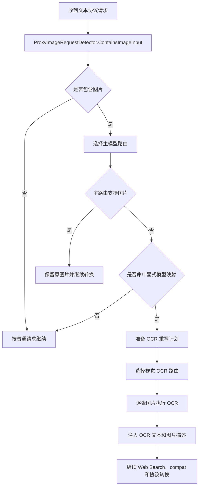
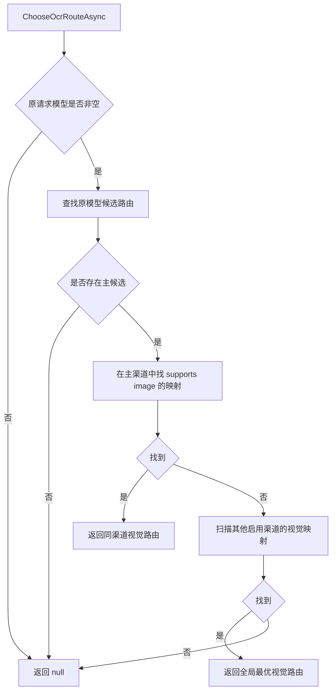
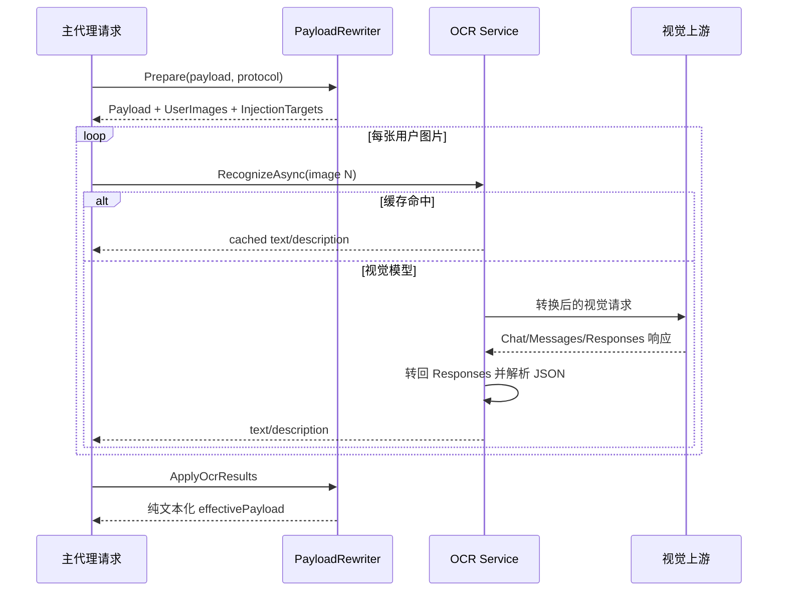

# 图片检测、OCR 降级与 Images API 边界

## 1. 两条不同的图片链路

仓库中存在两类容易混淆的图片能力：

1. **文本模型请求中的图片输入**：入口仍是 `/responses`、`/chat/completions` 或 `/messages`。当目标文本模型不支持图片时，代理先调用视觉模型做 OCR/描述，再把图片替换为文本后继续原主请求。
2. **独立图片生成/编辑 API**：入口是 `/images/generations` 和 `/images/edits`，渠道类型为 `images`，使用独立的请求/响应流，不经过 `ProtocolConverter` 的 Responses/Chat/Messages canonical 转换。

本文重点解释第一条链路，并明确第二条链路与代理转换主线的边界。

---

## 2. 图片 OCR 降级的触发条件

在 `ProxyEndpointService.ProxyAsync` 中，只有同时满足以下条件才调用 `IProxyImageFallbackService.RewriteAsync`：

```text
requestContainsImages == true
AND route.SupportsImage == false
AND route.MatchedModelMapping == true
```

| 条件 | 原因 |
|---|---|
| 检测到图片 | 没有图片无需处理 |
| 当前主路由不支持图片 | 支持图片时应原样交给主模型 |
| 路由来自显式模型映射 | 未配置模型映射的旧式 fallback 路由缺少可靠能力元数据，不自动触发 OCR |

OCR 不会把主请求改路由到视觉模型。视觉模型只作为子请求提取文本，主请求仍发送给原文本渠道。



---

## 3. 三种入口协议的图片检测

`ProxyImageRequestDetector.ContainsImageInput` 只按明确协议结构判断：

| 入口协议 | 遍历位置 | 图片块类型 |
|---|---|---|
| Responses | `input[]` 中 `type=message` 的 `content[]` | `input_image` |
| Responses | `input[]` 中 `type=function_call_output` 的 `output[]` | `input_image` |
| Chat | `messages[].content[]` | `image_url` |
| Messages | `messages[].content[]` | `image` |

注意：检测器只负责回答“是否存在图片”，不会验证 URL、base64 或 role。真正解析与校验发生在 `ProxyImagePayloadRewriter.Prepare`。

---

## 4. 重写计划

`ProxyImagePayloadRewriter.Prepare` 首先深拷贝请求，保证：

- 原始日志请求不被修改；
- 后续渠道尝试可以重新使用原始 payload；
- OCR 注入只作用于当前候选路由的 `effectivePayload`。

输出 `ProxyImagePayloadRewritePlan`：

| 字段 | 含义 |
|---|---|
| `Payload` | 已去除或替换图片块的请求副本 |
| `UserImages` | 需要执行 OCR 的用户图片，按出现顺序编号 |
| `InjectionTargets` | OCR 结果应插入到哪个 content block 列表、使用什么文本块类型 |

### 4.1 Role 判断

只有 `role == "user"` 的图片进入 OCR：

| 图片所在位置 | 行为 |
|---|---|
| 用户消息 | 删除原图片块、建立 OCR 任务和注入位置 |
| assistant/developer/system 等非用户消息 | 替换为“非用户消息中的图片不会参与 OCR”占位文本 |
| 工具结果图片 | 替换为“工具结果图片已省略”占位文本 |

这是为了避免把模型历史输出或工具内部二进制内容再次送入视觉模型，并保持工具历史结构可转换。

### 4.2 协议差异

| 协议 | 原图片块 | 注入文本块 |
|---|---|---|
| Responses 用户输入 | `input_image` | `input_text` |
| Responses assistant 内容 | `input_image` | `output_text` |
| Chat | `image_url` | `text` |
| Messages | `image` | `text` |

---

## 5. 图片来源解析

支持两种来源：

1. `data:` URL，且必须包含 `;base64`；
2. 绝对 `http://` 或 `https://` URL。

### 5.1 Responses 与 Chat

`image_url` 可为：

```json
"data:image/png;base64,..."
```

或：

```json
{
  "url": "https://example.test/image.png",
  "media_type": "image/png"
}
```

### 5.2 Messages

支持：

```json
{
  "type": "image",
  "source": {
    "type": "base64",
    "media_type": "image/png",
    "data": "..."
  }
}
```

以及 `source.type=url`。

### 5.3 校验错误

| 情况 | 错误语义 |
|---|---|
| 引用为空 | image reference is empty |
| 非 data/http/https | only data URLs and http(s) URLs are supported |
| data URL 缺少逗号 | invalid data URL |
| data URL 不是 base64 | only base64 data URLs are supported |
| base64 解码失败 | invalid base64 image data |
| Messages source 类型未知 | unsupported image source in messages image block |

data URL 会保存解码后的 `ImageBytes`；远程 URL 只保存引用。媒体类型缺失时默认 `image/png`。

---

## 6. 视觉路由选择

`ProxyRouteService.ChooseOcrRouteAsync(owner, requestModel)` 的顺序：

1. 找到原请求模型的候选主路由；
2. 在主候选渠道内寻找最优的图片模型映射；
3. 若同渠道没有，再在其他启用渠道中寻找最优图片模型；
4. 没有任何视觉模型则返回 `null`。

最优规则沿用模型路由比较：

```text
priority 升序
→ position 升序
→ channel id 字典序
```



---

## 7. OCR 执行

`ProxyImageFallbackService` 按 `ImageNumber` 升序逐张调用 `ProxyOcrService.RecognizeAsync`。当前实现是串行执行，任何一张失败都会中止主请求。

### 7.1 缓存优先

缓存 key：

| 来源 | SHA-256 输入 |
|---|---|
| data URL | 解码后的图片字节 |
| URL | URL 字符串的 UTF-8 字节 |

缓存文件位于：

```text
<OcrCacheDir>/results/<sha256>.json
```

相对 `OcrCacheDir` 以当前工作目录解析。缓存读取异常、JSON 损坏或未知 engine 会被当作未命中，不中断请求。

### 7.2 缓存命中

命中后不再访问上游，直接返回缓存中的：

- OCR 文本；
- 图片描述；
- engine/source kind；
- 原模型、上游模型、渠道标识等日志信息。

### 7.3 视觉模型请求

未命中且存在视觉路由时，代理构造一个 Responses 规范的内部请求：

```json
{
  "model": "VISION_MODEL",
  "input": [
    {
      "type": "message",
      "role": "developer",
      "content": [{
        "type": "input_text",
        "text": "要求只返回 {text, description} JSON 的指令"
      }]
    },
    {
      "type": "message",
      "role": "user",
      "content": [
        {"type":"input_text","text":"Analyze this image..."},
        {"type":"input_image","image_url":"IMAGE_REFERENCE"}
      ]
    }
  ]
}
```

随后再通过 `ProtocolConverter.ConvertRequest` 转成视觉渠道协议。上游响应经 `ProtocolConverter.ConvertResponse(... source=Responses, target=channelType ...)` 恢复为 Responses 结构，从 message/output/content 等候选位置提取文本。

### 7.4 OCR JSON 解析

解析顺序：

1. 去除完整 Markdown 代码围栏；
2. 尝试把整个文本解析为 JSON object；
3. 失败时截取首个 `{` 到最后一个 `}` 再解析；
4. 仍失败则抛出 `vision OCR returned invalid JSON`，内部状态为 502。

只读取 `text` 和 `description` 字符串；缺失字段变为空字符串。

### 7.5 无视觉路由

当前源码明确要求配置视觉模型：

```text
OCR requires a configured vision model. Local OCR has been removed.
```

`ProxyOcrEngines` 仍保留 `paddleocr` 常量，缓存读取也接受历史 `paddleocr` 记录，但当前 `RecognizeAsync` 不再执行新的本地 OCR。

---

## 8. OCR 结果注入

每张图片向原位置追加两个文本块：

```text
[图片 N OCR文字]
<识别文本或“未识别到可提取文字”>

[图片 N 描述]
<描述或“未生成图片描述”>
```

`ApplyOcrResults` 要求每个 injection target 都能找到同编号结果，否则抛出内部一致性异常。注入顺序按图片编号，而非 OCR 完成时间。



---

## 9. 日志关系

每张 OCR 图片会写一条 `request_type=ocr` 日志，内容包括：

- 与主请求相同的 `requestId`；
- OCR 内部请求与上游请求；
- 上游响应和解析结果；
- engine、source kind、cache hit；
- 原模型/上游模型/视觉渠道；
- 内部路径 `/internal/ocr/vision`；
- `parent_request_id`。

主请求日志仍记录原客户端 payload 和最终上游请求。图片正文进入日志前会经 `ImageLogSanitizer`，base64、data URL 和二进制内容会被替换，避免日志膨胀和敏感图片留存。

当前 `ProxyOcrService` 写入 OCR 日志时 `ParentRequestLogId` 初始为 null；`ProxyLogService` 会在主请求完成阶段尝试根据相同 request id 关联并回填。

---

## 10. 独立 Images API 的边界

### 10.1 入口契约

| API | Content-Type | 流式 |
|---|---|---|
| `/v1/images/generations` | 仅 `application/json` | 拒绝 `stream=true` |
| `/v1/images/edits` | multipart，由 `ImageEditRequestReader` 解析 | 非流式 |

### 10.2 与文本协议转换的不同

独立图片 API：

- 使用 `ImageProxyParameters` 保留未知参数，只替换 model；
- 只选择 `type=images` 渠道；
- 由 `IImagesUpstreamClient` 发送；
- 上游响应作为字节流和 Content-Type 返回；
- 不经过 Responses/Chat/Messages canonical request/response；
- 不参与本文前述 OCR 回退。

### 10.3 dialect

渠道 `compat.images_api_dialect` 支持：

| dialect | 生成 | 编辑 |
|---|---|---|
| `openai` | JSON `/images/generations` | multipart `/images/edits` |
| `xai` | JSON，校验不支持字段 | JSON，图片转 data URI；1–3 张；不支持 mask |

xAI 不支持字段包括：`size`、`quality`、`background`、`output_format`、`output_compression`、`moderation`、`style`。

图片上游请求不执行普通文本请求的重试循环，即使渠道 `retry_count` 很大也只发送一次；错误正文最多读取 64 KiB。仅向客户端转发安全响应头：request id 和 retry-after 类字段。

### 10.4 当前源码边界提示

当前 HEAD 已包含：

- `ImagesController`；
- `IProxyImagesEndpointService` 契约；
- 图片请求模型与 multipart reader；
- `IImagesUpstreamClient` 和 HTTP 实现；
- 配置校验与单元测试。

在当前服务注册文件中没有看到 `IProxyImagesEndpointService` 的具体实现注册。因此本套“代理转换”文档只把它作为独立边界记录，不把其端点编排描述成已经由文本代理主链路完成。

---

## 11. 关键边界条件

1. 多张图片串行 OCR，延迟随图片数线性增加。
2. 任一图片失败，主请求失败；当前没有“跳过失败图片继续”的策略。
3. URL 缓存 key 基于 URL 字符串，不感知远程内容变化。
4. data URL 缓存基于实际字节，相同图片即使命名不同也可命中。
5. 非用户图片不会 OCR，只用占位文本保留历史结构。
6. 图片检测只识别标准块类型，非标准供应商字段不会触发回退。
7. 主模型支持图片时不会调用 OCR，也不会提前验证图片 URL 是否可访问。
8. 历史测试名中可能仍出现本地 PaddleOCR 场景，维护判断应以当前 `ProxyOcrService` 源码为准。

---

## 12. 测试锚点

| 文件 | 覆盖 |
|---|---|
| `ProxyImageFallbackTests.cs` | 三协议重写、占位、视觉 OCR、缓存与错误日志 |
| `ProxyVisionRoutingTests.cs` | 图片检测、能力模型、视觉路由优先级 |
| `ProxyLogServiceTests.cs` | 图片/data/base64 日志脱敏 |
| `ImagesCoreContractTests.cs` | 独立图片 API 的参数和文件契约 |
| `ImagesControllerTests.cs` | Content-Type、stream 拒绝、multipart 入口 |
| `ImagesUpstreamClientTests.cs` | OpenAI/xAI dialect、响应所有权、错误上限、无重试 |

---

## 13. 相关文档

- [内容、多模态与指令转换](../04-request-conversion/03-content-multimodal-and-instructions.md)
- [路由选择与模型映射](../03-routing/01-route-selection-and-model-mapping.md)
- [错误、日志与诊断](../09-reference/01-errors-logging-and-diagnostics.md)
- [测试覆盖、已知边界与维护](../09-reference/03-test-coverage-known-boundaries-and-maintenance.md)
