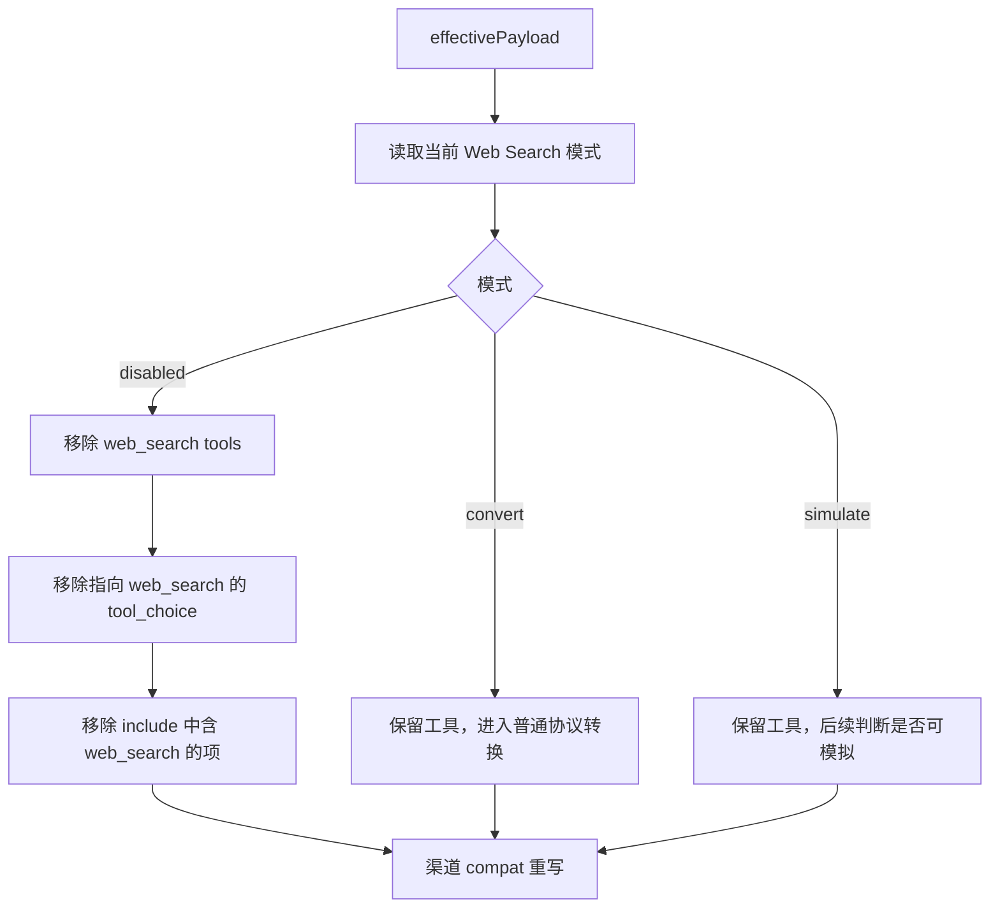
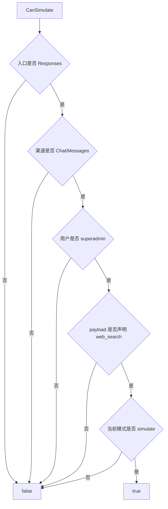
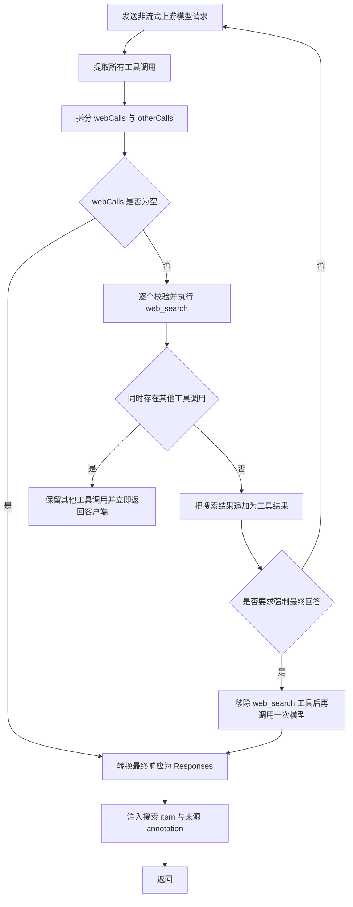
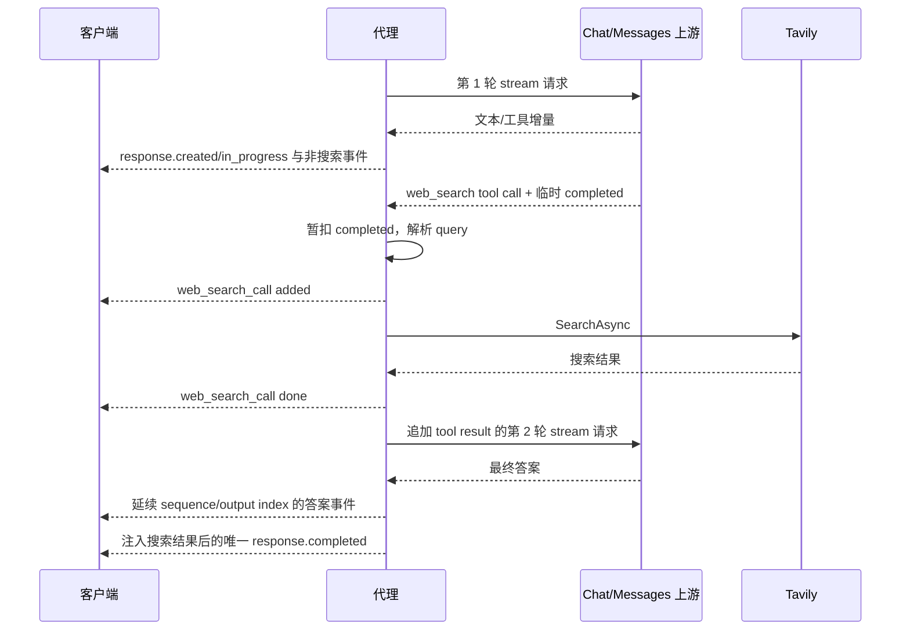

# Web Search 模式、请求策略与模拟循环

## 1. 三种模式

Web Search 的运行模式保存在 `WebSearchSettings.Mode`，合法值：

| 模式 | 常量 | 行为 |
|---|---|---|
| 模拟 | `simulate` | 代理拦截模型产生的 `web_search` 工具调用，使用 Tavily Key 搜索，再把结果作为工具结果续轮提交给上游模型 |
| 转换 | `convert` | 不在代理内执行搜索；`web_search` 像其他 Responses 工具一样转换给目标协议/上游 |
| 关闭 | `disabled` | 请求发送前移除 Web Search 工具、相关 tool choice 和 include |

数据库为空、值非法或未知时，`CurrentMode()` 回退为 `convert`。

相关源码：

- `CoreBase/Domain/WebSearch/WebSearchModes.cs`
- `Services/WebSearch/WebSearchRequestPolicy.cs`
- `Services/WebSearch/WebSearchSimulator.cs`
- `Services/WebSearch/WebSearchSimulator.NonStream.cs`
- `Services/WebSearch/WebSearchSimulator.Streaming.cs`
- `Services/WebSearch/WebSearchContinuationRequest.cs`
- `Services/WebSearch/WebSearchToolCallParser.cs`
- `Services/WebSearch/WebSearchResponsePayload.cs`
- `Services/WebSearch/WebSearchStreamEventState.cs`

---

## 2. 模式应用顺序

`ProxyEndpointService` 在协议转换之前执行：

```text
图片 OCR 降级
→ WebSearchRequestPolicy.ApplyMode
→ ChannelCompatRequestRewriter.Apply
→ ProtocolConverter.ConvertRequest
```

关闭模式因此直接修改入口协议 payload；转换和模拟模式只返回深拷贝，不在该阶段移除工具。



---

## 3. 关闭模式的精确删除逻辑

### 3.1 tools

识别以下任一形态：

```json
{"type":"web_search"}
```

```json
{"name":"web_search"}
```

```json
{"type":"function","function":{"name":"web_search"}}
```

仅删除 Web Search，其他工具保留。删除后 tools 为空则移除整个字段。

### 3.2 tool_choice

若 `tool_choice`：

- 是字符串 `web_search`；
- 或本身符合上述 Web Search 工具对象形态；

则移除整个 `tool_choice`，避免留下指向不存在工具的强制选择。

### 3.3 include

过滤所有包含子串 `web_search` 的字符串项。过滤后为空则移除 `include`。

---

## 4. 模拟条件

`WebSearchSimulator.CanSimulate` 必须同时满足：

| 条件 | 要求 |
|---|---|
| 入口协议 | `responses` |
| 上游渠道协议 | `chat` 或 `messages` |
| 调用用户角色 | `superadmin` |
| 原始有效 payload | 声明 `type=web_search` 工具 |
| 当前模式 | `simulate` |

任何条件不满足，都走普通非流式/流式上游路径。特别注意：

- Responses → Responses 不模拟；上游可原生处理；
- Chat 或 Messages 入口不模拟；
- 普通用户即使模式全局为 simulate 也不触发；
- 仅在工具列表中声明 `web_search` 才触发，历史中出现工具结果不算声明。



---

## 5. 调用上限与迭代上限

搜索调用上限来自 Responses 请求 `max_tool_calls`：

- 缺失、非法或布尔值：默认 15；
- 数值：转换为非负整数；
- 负数：归零。

内部模型迭代上限：

```text
maxIterations = max(webLimit + 3, 3)
```

这两个上限目的不同：

| 上限 | 控制对象 |
|---|---|
| `webLimit` | 实际外部搜索次数 |
| `maxIterations` | 模型反复要求搜索的总轮数，防止逻辑死循环 |

达到搜索上限时不会直接丢弃工具调用，而是构造失败的工具结果，并要求下一轮模型直接给最终答案。

---

## 6. Tool Call 提取

模拟器只需要从上游完整响应中提取 Chat 或 Messages 工具调用。

### 6.1 Chat

读取：

```text
choices[0].message.tool_calls[]
```

提取：`id`、顺序 index、`function.name`、`function.arguments` 和原始对象。

### 6.2 Messages

遍历：

```text
content[type=tool_use]
```

提取：`id`、顺序 index、`name`，并把 `input` JSON 序列化为 arguments 字符串。

未提供 id 时生成 `call_<guid>`。

---

## 7. 搜索参数校验

`web_search` 只接受：

```json
{"query":"搜索词"}
```

判断顺序：

1. arguments 空字符串按 `{}`；
2. 必须为合法 JSON；
3. 根必须是 object；
4. 除 `query` 外不允许其他 key；
5. query 转字符串、Trim 后必须非空。

| 错误 | 结果 |
|---|---|
| 非 JSON | `web_search arguments must be valid JSON` |
| 根不是 object | `web_search arguments must be an object` |
| 多余字段 | `web_search only supports the query argument` |
| query 缺失/空 | `web_search query is required` |

参数错误会变成工具失败结果交回模型，而不是直接让整个代理请求返回 HTTP 400。

---

## 8. Tavily Key 预留

`ReserveTavilyKey` 从数据库选择：

```text
Enabled == true
AND UsageCount < UsageLimit
ORDER BY Position, Id
```

选中后立即：

```text
UsageCount += 1
UpdatedAt = now
repository.Update
```

若没有可用 Key，生成“搜索不可用”的失败结果，并设置 `forceFinalAnswer=true`。

Key 的 usage 在搜索请求发出前预扣；当前代码未在搜索失败时回滚。

---

## 9. 非流式模拟循环

### 9.1 主循环



### 9.2 为什么遇到其他工具要返回

如果同一轮模型同时请求：

- `web_search`；
- 以及 shell、apply_patch、MCP 等其他客户端工具；

代理只执行 Web Search，不执行其他客户端工具。搜索结果注入响应后，其他工具调用仍返回客户端，由客户端决定后续工具循环。代理不会越权替客户端执行所有工具。

### 9.3 续轮请求

`WebSearchContinuationRequest.AppendToolResults` 会先：

- 删除 `tool_choice`，防止继续强制同一工具；
- 若 `forceFinalAnswer=true`，从 tools 中删除 Web Search。

Chat 续轮：

```text
追加 assistant 消息（role/content/tool_calls/reasoning_content）
→ 每个结果追加 role=tool, tool_call_id, content
```

Messages 续轮：

```text
追加 assistant content
→ 每个结果追加 user 消息中的 tool_result block
```

### 9.4 上游异常

`PostUpstream` 捕获 `ProxyException` 后构造 `WebSearchSimulationUpstreamException`，保留：

- 最后一次上游请求；
- 已执行的搜索结果；
- 每轮上游工具调用；
- 上游错误文本。

`ProxyNonStreamService` 将其转换为失败结果，同时确保日志记录最终上游请求和搜索详情。

---

## 10. 流式模拟循环

流式模拟的核心困难是保持一个连续、合法的 Responses SSE 序列，同时中间可能进行多次 Chat/Messages 上游调用。

### 10.1 每轮模型流

每轮上游 Chat/Messages SSE 先转换为 Responses SSE，但：

- `web_search` 工具名通过 `SkipToolNames` 从普通工具事件中排除；
- 中间轮的 `response.completed` 暂不下发；
- 首轮输出 `response.created/in_progress`；
- 后续轮设置 `SkipResponseCreated=true`。

### 10.2 连续序号

`WebSearchStreamEventState` 从已输出事件计算：

- 下一个 `sequence_number`；
- 下一个 `output_index`。

后续轮把这两个值传给 `ChatToResponsesEvents` 或 `MessagesToResponsesEvents`，避免：

- sequence number 从 0 重新开始；
- Web Search item 与模型文本/工具 item 使用相同 output index；
- 多轮出现多个 created 事件。

### 10.3 搜索生命周期事件

代理为每个搜索调用生成：

```text
response.output_item.added
  item.type = web_search_call
  item.status = in_progress
  item.action.type = search

response.output_item.done
  item.status = completed/failed
  item.action/results = 搜索结果
```



### 10.4 强制最终回答

以下情况设置 `forceFinalAnswer`：

- 达到调用上限；
- 没有可用 Tavily Key；
- provider 返回失败。

代理追加失败工具结果，并从下一轮请求移除 Web Search 工具。该轮之后无论模型是否仍返回工具信息，模拟循环都会结束并输出最终完成事件。

### 10.5 最终 completed

只有循环结束后才输出 `completedLine`。输出前调用 `InjectWebSearchIntoCompleted`，把所有搜索 items 注入 `response.output`。日志用的结构化响应还会：

- prepend/replace Web Search items；
- 添加来源 annotations；
- 保存 `WebSearchSimulationLog`。

---

## 11. 搜索结果在响应中的表示

模拟结果同时服务两个目标：

1. 客户端看到标准 Responses `web_search_call` item；
2. 最终文本包含可追踪来源 annotation。

主要处理函数：

| 函数 | 作用 |
|---|---|
| `BuildWebSearchItem` | 构造单个 `web_search_call` output item |
| `PrependWebSearchItems` | 在最终 output 前插入搜索项 |
| `ReplaceOrPrependWebSearchItems` | 替换已有搜索项或新增 |
| `AddSourceAnnotations` | 向输出文本增加 URL citation annotations |
| `InjectWebSearchIntoCompleted` | 修改流式 `response.completed` data |

非流式普通完成通常设置 `includeResult=false`，减少完整 provider 结果在 output 中的重复；流式最终结构化日志可使用 `includeResult=true`。

---

## 12. Convert 模式与协议转换

Convert 模式不执行 Tavily。请求中的 Web Search 工具进入 `ProtocolConverter`：

- Responses → Chat：通常转换为函数工具或恢复为可识别的 native call mapping；
- Responses → Messages：转换为 Anthropic tool/tool choice；
- 工具响应再从 Chat/Messages 恢复为 Responses `web_search_call`；
- 若上游本身执行服务端 Web Search，出站流转换保留最终答案流程，不让客户端重复执行。

具体映射见工具文档，模拟器和转换器职责必须区分：

```text
simulate = 代理实际执行搜索
convert  = 代理只改协议形态
disabled = 代理在请求前删除能力
```

---

## 13. 关键边界条件

1. 仅超级管理员可触发模拟，普通用户保留 `convert` / `disabled` 行为。
2. `max_tool_calls` 是所有工具语义中的字段，但模拟器把它用作 Web Search 上限。
3. query 只允许一个字段，供应商扩展参数会被当作失败工具结果。
4. Key 使用次数预扣，不因 provider 失败回滚。
5. 非流式遇到其他工具调用时停止代理内循环，把控制权交回客户端。
6. 流式中间 `response.completed` 被暂扣，客户端只看到一个最终完成事件。
7. 若转换器无法重建 `UpstreamResponse`，流式模拟直接结束，不继续猜测工具调用。
8. 迭代守卫触发时仍返回当前最佳响应，并在详情中记录 `web_search simulation stopped after iteration guard`。
9. 上游 Responses 渠道不进入模拟分支，即使模式为 simulate。

---

## 14. 测试锚点

| 测试 | 覆盖 |
|---|---|
| `ProxyCompatibilityTests.WebSearchRequestPolicy_DisabledMode_RemovesWebSearchOnly` | 关闭模式精确删除 |
| `ProxyCompatibilityTests.WebSearchContinuation_RemovesRequiredToolChoiceBeforeFinalAnswer` | Chat 续轮 |
| `ProxyCompatibilityTests.WebSearchContinuation_MessagesUpstream_RemovesRequiredToolChoiceBeforeFinalAnswer` | Messages 续轮 |
| `ProxyCompatibilityTests.WebSearchStream_ExecutesRepeatedWebSearchCallsBeforeFinalAnswer` | 多轮流式模拟 |
| `ProxyCompatibilityTests.WebSearchStream_MessagesUpstream_ExecutesWebSearchBeforeFinalAnswer` | Messages 上游模拟 |
| `ProxyCompatibilityTests.WebSearchStream_ChatUpstream_PreservesNativeToolSearchCall` | 搜索与其他原生工具并存 |
| `ProxyStreamServiceTests.StreamAsync_MessagesWebSearchSimulation_UsesSimulatorBranch` | 流式服务分支派发 |

---

## 15. 相关文档

- [Web Search、MCP 与工具历史](../05-tools/03-web-search-mcp-and-tool-history.md)
- [流式代理管线与 SSE 解析](../07-streaming/01-stream-pipeline-and-sse-parsing.md)
- [六种跨协议流式状态机](../07-streaming/02-six-cross-protocol-state-machines.md)
- [错误、日志与诊断](../09-reference/01-errors-logging-and-diagnostics.md)
