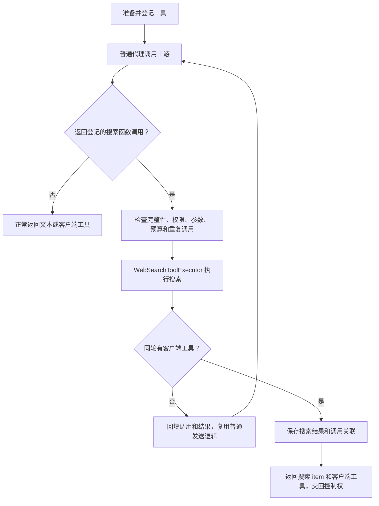
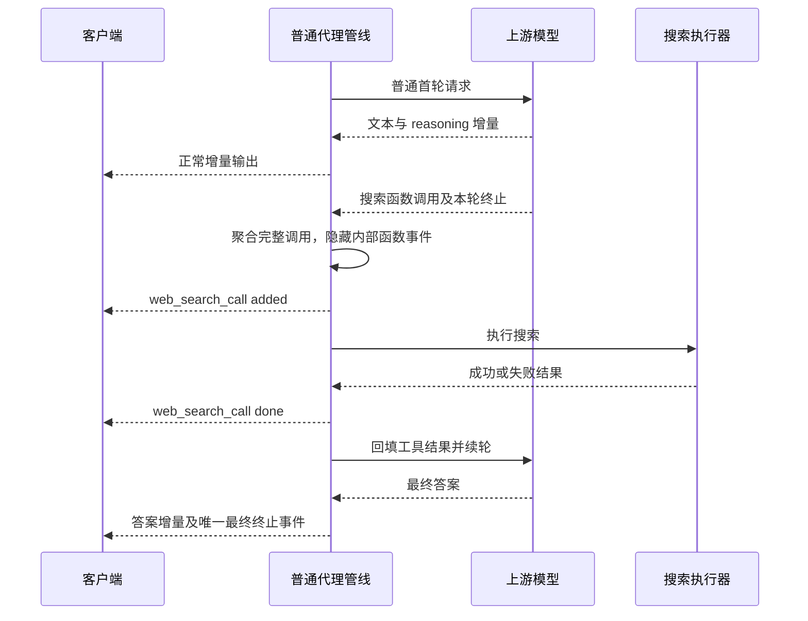

# Web Search 模式与代理内置工具

## 1. 执行模型

Web Search 是普通代理管线中的托管工具。请求阶段只替换工具声明并登记执行权；只有上游模型实际返回相应函数调用，代理才执行搜索。

`WebSearchSimulator`、`IWebSearchSimulator` 和流式/非流式专用模拟循环已删除。`simulate` 配置值保持兼容，不代表请求进入另一条模拟管线。

| 模式 | 行为 |
| --- | --- |
| `simulate` | 对符合条件的原生搜索声明注册代理函数，按配置的 provider 调用 Tavily 或 Keenable。 |
| `convert` | 保持现有工具协议转换，不由代理执行搜索。 |
| `disabled` | 删除原生搜索声明及关联选择和 include，不删除同名普通函数。 |

无配置或配置值非法时，`CurrentMode()` 仍回退为 `convert`。

当前支持 Tavily 与 Keenable 两类搜索 provider，Key 按配置顺序预留并路由到对应客户端。

## 2. 适用范围

同时满足以下条件才注册本地搜索：

- 入口协议为 Responses。
- 上游协议为 Chat 或 Messages。
- 访问 Key 所属用户角色为 `superadmin`。
- 模式为 `simulate`。
- 顶层 tools 中声明一个原生 `web_search` 或 `web_search_preview`。

Responses 上游、Chat/Messages 入口和普通用户不扩展模拟范围。历史中的搜索 item 不授权当前轮执行。普通函数 `name=web_search` 和工具发现 `tool_search` 不属于本地搜索。

## 3. 请求准备

入口顺序：

```text
鉴权和路由
→ 图片降级
→ WebSearchRequestPolicy.ApplyMode
→ ChannelCompatRequestRewriter.Apply
→ WebSearchRequestPolicy.RegisterBuiltin
→ WebSearchContinuationStore.RestoreAsync
→ ProtocolConverter.ConvertRequest
→ WebSearchRequestPolicy.FinalizeUpstreamRequest
→ 普通流式或非流式服务
```

只修改有效载荷，原始 payload 保留用于日志。渠道已经删除的原生工具不会被重新注入。

原生声明替换为函数：

```json
{
  "type": "function",
  "name": "opencodex_web_search",
  "description": "Search the web for current information when needed. Results contain source URLs; cite relevant URLs in the answer.",
  "strict": true,
  "parameters": {
    "type": "object",
    "properties": { "query": { "type": "string" } },
    "required": ["query"],
    "additionalProperties": false
  }
}
```

名称冲突时使用稳定的 `_2`、`_3` 等后缀；也检查动态工具声明。`BuiltinToolRequestContext` 在代理内部记录最终名称、预算、执行许可、来源选项和是否已经执行工具，不作为客户端可伪造的 payload 标记。

`tool_choice` 的处理：

| 输入 | 行为 |
| --- | --- |
| 缺省/`auto` | 模型可以不搜索。 |
| `none` | 保留禁用语义，不允许执行。 |
| `required` | 必须调用允许的工具，不等于必须搜索。 |
| 指定原生搜索 | 映射到内部函数名称。 |
| 指定其他工具 | 保留选择，本地搜索不执行。 |
| `allowed_tools` | 映射搜索引用，并限制最终上游工具定义，避免跨协议转换放宽允许集合。 |

续轮只解除已经满足的强制调用条件。无搜索预算却强制要求搜索时返回 400，不静默降级。

## 4. 普通响应与工具拦截



核心职责：

| 组件 | 职责 |
| --- | --- |
| `WebSearchRequestPolicy` | 模式、原生声明替换、选择约束、名称和选项校验。 |
| `BuiltinToolSession` | 流式/非流式共用的调用归属、执行账本、续轮、预算和 usage 汇总。 |
| `WebSearchToolExecutor` | 查询校验、原子预留 Key、调用 `IWebSearchClient`、限制结果大小。 |
| `WebSearchContinuationRequest` | 保留 assistant 原始字段、thinking 和工具调用，按当前上游协议回填结果。 |
| `WebSearchContinuationStore` | 受访问主体隔离的短期搜索历史恢复。 |
| `WebSearchResponsePayload` | 内部函数投影成原生搜索 item，并为真实文本中的来源 URL 添加引用。 |
| `WebSearchStreamEventState` | 统一公开 response ID、序号、输出索引和跨轮 output。 |

执行器不依赖 `IUpstreamClient`。首轮请求始终由普通代理发送；只声明搜索但直接回答时，模型请求一次、搜索 provider 零次、Key 计数不变。

## 5. 流式规则



- 普通文本和客户端工具及时输出，不缓存整个回答等待搜索判断。
- 内部函数名称分片与参数分片先聚合，不暴露为客户端待执行函数。
- 保留首包确认，首轮未发出下游数据、未执行工具时仍可按现有规则切换渠道。
- 检查上游终止标记和工具调用的停止原因，不凭半个 JSON 或单独 `[DONE]` 执行搜索。
- 后续轮次不重复 created；公开 response ID 不改变，sequence 单调递增，output index 不复用。
- 最终 output 按实际发出顺序汇总各轮文本、reasoning、客户端工具和搜索 item。
- incomplete/failed 保留真实终态，不在断流后制造 completed。
- 客户端取消中止搜索及续轮，日志记为 499；请求超时记录 504，并沿用上游错误映射。

## 6. 混合工具与历史

同轮返回搜索和客户端工具时，代理执行搜索，但不替客户端执行其他工具，也不在其他结果缺失时请求下一轮模型。

搜索的公开 ID 使用 `ws_ocxp_` 前缀，与上游 call ID 分开。响应的 `web_search_call` 携带兼容字段 `opencodex_result`，同时把结果按公开搜索 ID、待完成客户端 call ID 保存。

恢复策略：

1. 按用户名和访问 Key ID 隔离结果，缓存键使用哈希。
2. 客户端回传历史后，优先读取已保存结果，恢复函数调用与匹配输出。
3. 客户端裁剪扩展字段时，仍可通过搜索 ID 恢复；同轮客户端调用关联可补齐缺失搜索项。
4. 调用和结果按合法分组进入现有协议转换器，不再次执行历史中的搜索。
5. 状态缺失、过期且没有完整结果可回放时明确返回 400。

保存期限为 30 分钟，进程内缓存容量为 32 MiB；Redis 可用时共享保存。多实例需要 Redis 或实例亲和性。Redis 的实际读写错误明确报错，不能把失败的写入当作已可靠保存。

这不是完整 Responses 会话存储，不扩展 Chat/Messages 对 `previous_response_id`、`conversation` 或后台请求的支持。

## 7. 边界与错误

| 项目 | 当前规则 |
| --- | --- |
| 查询 schema | 只接受字符串 `query`，去除首尾空白后必须非空。 |
| 参数大小 | 最多 16 KiB JSON，query 最多 2048 字符；拒绝重复字段、多余字段和类型转换。 |
| 搜索预算 | `max_tool_calls` 默认 15，接受 0–64 的整数；只约束代理内置搜索，不约束客户端函数。 |
| 轮次预算 | 重复 call ID 也消费模型轮次预算；达到守卫后移除搜索工具，只允许受控收尾。 |
| 去重 | 同一 call ID 和相同参数复用结果；同 ID 改参数明确失败。 |
| 参数纠正 | 两次失败后关闭后续搜索；提供商不可用直接关闭本批及后续搜索。 |
| 结果大小 | 最多 5 个来源；answer、title、URL、content 分别有字符上限。 |
| Key 预留 | 用数据库比较更新原子递增；搜索失败不自动回滚已预留额度。 |
| 请求时限 | 搜索与续轮共享请求时限，非每轮重新获得完整超时预算。 |
| 输出预算 | 显式 max_output_tokens 按各轮消耗扣减；耗尽时返回 incomplete。 |
| 渠道切换 | 工具已开始执行后，不从入口重放请求，防止重复搜索与扣费。 |

只支持现有 Tavily/Keenable 查询能力。允许的原生默认选项包括 `external_web_access=true`、`search_context_size=medium`、`return_token_budget=default` 和仅 text 的 `search_content_types`。非默认/不能等价处理的过滤、位置、离线搜索等选项明确拒绝，不静默丢弃。尚不支持 open_page、find_in_page 或图片搜索。

## 8. 来源与日志

- 按 `include=web_search_call.action.sources` 返回有效的 HTTP/HTTPS 来源。
- 仅对输出文本中出现的来源 URL 添加 url_citation；来源去重，引用按 Unicode 字符索引计算。
- 不向 JSON 输出追加“来源”段落，也不把全部检索结果伪装成正文引用。
- 模型工具结果不包含 Key。诊断保存工具 ID、提供商、额度快照、错误及模型轮次。
- 下游 usage 汇总各轮 Responses 形式的用量。
- 计费另外汇总原上游协议的 usage，保留缓存写入/读取区别；最后一次原始上游响应不被篡改。
- 未实际处理搜索调用时，不生成搜索执行日志；取消中的调用保留失败诊断。

## 9. 验证入口

主要测试：

- `WebSearchRequestPolicyTests`：注册范围、同名函数、名称冲突、choice、允许列表和预算。
- `WebSearchToolExecutorTests`：无效参数、取消、结果边界、额度及并发预留。
- `BuiltinToolSessionTests`：无调用、混合调用、历史恢复、去重、轮次守卫、失败和输出预算。
- `WebSearchResponsePayloadTests`：JSON、Unicode 引用与 sources。
- `ProxyCompatibilityTests`：通过真实代理服务覆盖 Chat/Messages 多轮搜索和客户端工具。
- `ProxyStreamServiceTests`：无搜索普通路径、断流、取消与超时状态。
- `ProxyEndpointServiceTests`：入口只做准备、执行后禁止重放。
- `ProxyLogServiceTests`：多轮计费且保留原响应。

真实上游 LLM/搜索 provider 联调、跨进程故障期间的 Redis 行为和 Responses 上游托管扩展，需要独立验证，不由这些测试替代。
