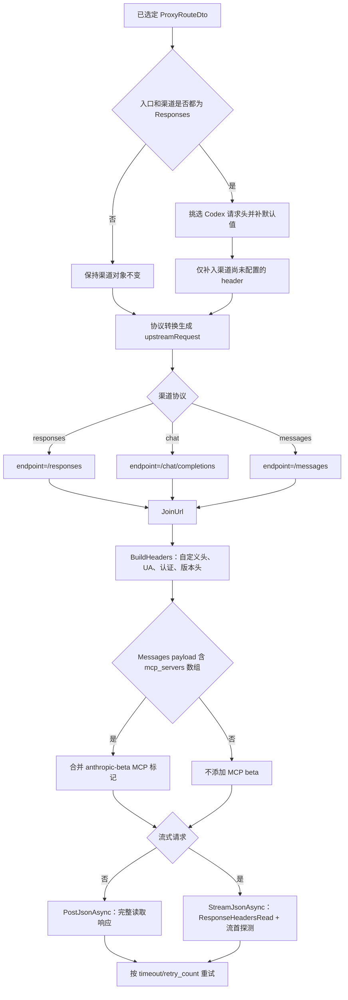
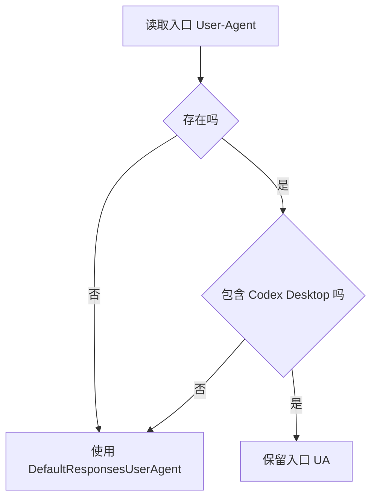
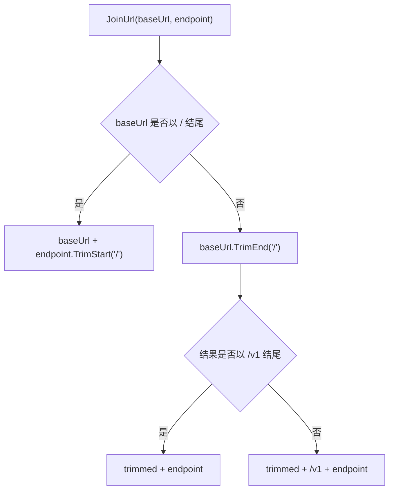
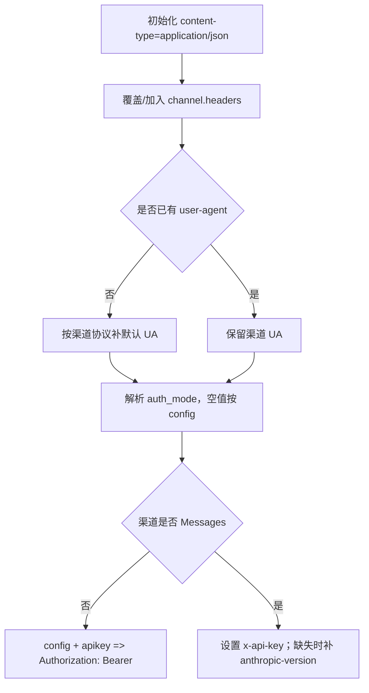
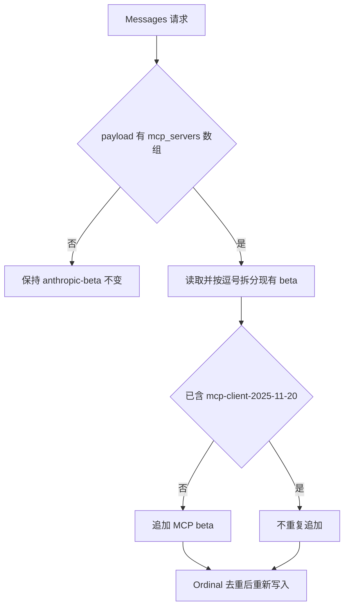
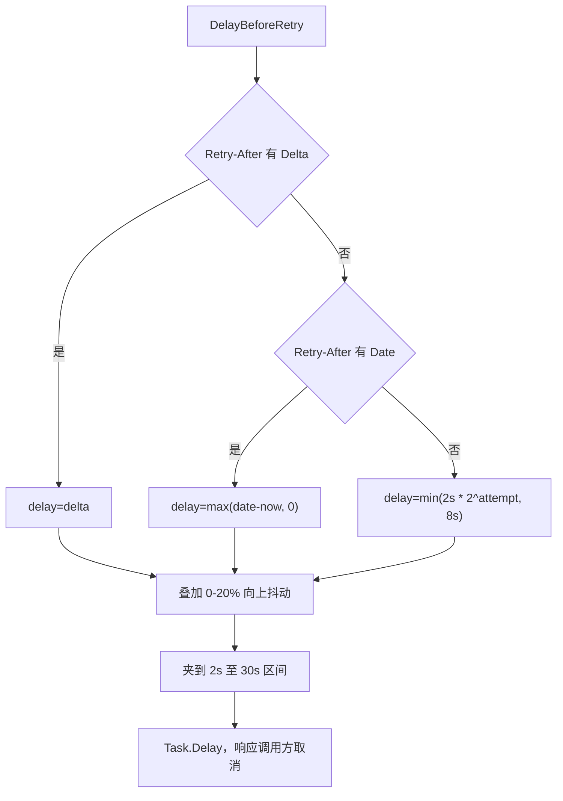
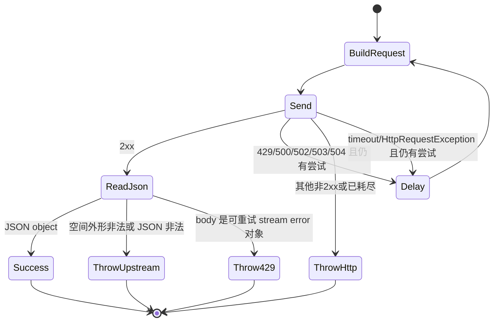
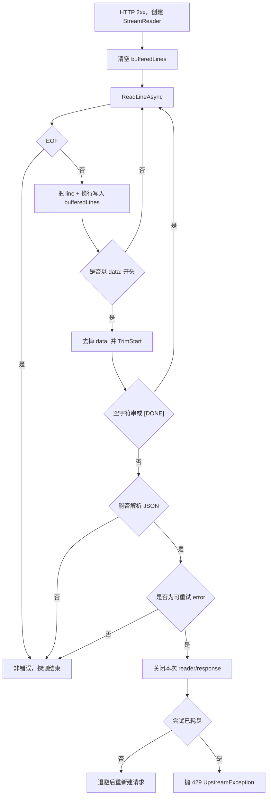

# 请求头转发、上游请求构造与重试

## 1. 本章边界

本章描述代理完成路由与协议转换之后，如何把 `ProxyRouteDto.Channel` 和转换后的 JSON payload 变成真正的 HTTP 请求，以及在超时、HTTP 错误和流首错误下如何重试。

需要区分三层数据：

| 层 | 数据 | 作用 |
|---|---|---|
| 客户端入口 | `ProxyRequestMetadata.Headers` | 原始下游请求头；默认不直接转发 |
| 路由渠道 | `route.Channel.headers` | 管理端明确配置的上游附加头 |
| HTTP 请求 | `HttpRequestMessage.Headers` / `Content.Headers` | 合并默认值、认证、MCP beta 后真正发送给上游的头 |

只有 **Responses 入口 → Responses 渠道** 会从第一层挑选 Codex 相关头补入第二层；其他协议组合只使用渠道配置与客户端内部默认值。

核心源码：

- `OpenCodex.Core/Services/Proxy/ProxyEndpointService.cs`
- `OpenCodex.Core/ExternalIntegrations/HttpUpstreamClient.cs`
- `OpenCodex.Core/ExternalIntegrations/HttpUpstreamClient.Requests.cs`
- `OpenCodex.Core/ExternalIntegrations/HttpUpstreamClient.Responses.cs`
- `OpenCodex.Core/ExternalIntegrations/HttpUpstreamClient.Streaming.cs`
- `OpenCodex.Core/Config/ConfigValidator.cs`

---

## 2. 总流程



这里的两个“合并”发生在不同阶段：

1. `ApplyResponsesPassthroughHeaders`：把允许透传的入口头补到一个**深拷贝渠道**中；
2. `BuildHeaders`：把渠道 `headers`、默认 User-Agent 和认证头构造成最终 HTTP headers。

---

## 3. Responses 同协议的入口头转发

### 3.1 开关判断

`ApplyResponsesPassthroughHeaders` 的判断是严格的字符串相等：

```text
entryProtocol == "responses"
AND channelType == "responses"
```

| 入口协议 | 渠道协议 | 是否执行 Codex 头转发 |
|---|---|---|
| Responses | Responses | 是 |
| Responses | Chat | 否 |
| Responses | Messages | 否 |
| Chat | Responses | 否 |
| Messages | Responses | 否 |
| 其他同协议 | 同协议 | 否 |

该限制避免把 Codex Desktop 的私有上下文头发送给并不理解这些头的 Chat 或 Anthropic Messages 上游。

### 3.2 白名单

当前白名单为：

| 头名 | 缺失时是否生成默认值 | 说明 |
|---|---:|---|
| `User-Agent` | 是 | Codex Desktop UA |
| `x-oai-attestation` | 是 | 当前实现填充测试值 |
| `x-codex-turn-metadata` | 是 | 当前实现填充测试 session/thread/turn JSON |
| `x-codex-window-id` | 是 | 当前实现填充测试 window id |
| `x-client-request-id` | 是 | 当前实现填充测试 request id |
| `originator` | 是 | `Codex Desktop` |
| `session-id` | 是 | 当前实现填充测试 session id |
| `thread-id` | 是 | 当前实现填充测试 thread id |
| `x-codex-beta-features` | 是 | `terminal_resize_reflow,remote_compaction_v2` |

注意：这里不做“存在才转发”；对白名单中的每个头都会先尝试读取入口值，缺失时再调用 `DefaultResponsesHeaderValue`。因此当前同协议链路通常会形成完整的一组 Codex 头。

### 3.3 User-Agent 特殊判断

入口存在 `User-Agent` 时仍需判断它是否包含大小写不敏感的 `Codex Desktop`：



这意味着浏览器、curl 或其他 SDK 的 UA 不会原样伪装成 Responses 上游客户端；它会被替换为服务内置的 Codex Desktop UA。

### 3.4 渠道配置优先

转发逻辑先深拷贝 `route.Channel`，再取得其 `headers`。对于每个白名单头，仅在渠道中不存在大小写不敏感的同名 key 时才补入：

```text
if !ContainsHeader(channel.headers, incomingHeaderName):
    channel.headers[incomingHeaderName] = incomingOrDefaultValue
```

优先级因此是：

```text
渠道显式 headers
> 客户端入口白名单值
> Responses 内置默认值
```

例如渠道配置：

```json
{
  "headers": {
    "X-Client-Request-ID": "fixed-by-admin"
  }
}
```

即使入口传入 `x-client-request-id: client-value`，最终仍保留 `fixed-by-admin`。大小写不同也视为同一 header。

### 3.5 不修改共享路由对象

方法使用 `WebSearchPayload.DeepCopyObject(route.Channel)`，并返回新的 `ProxyRouteDto`：

```text
新 Channel
+ 原 OriginalModel
+ 原 UpstreamModel
+ 原 SupportsImage
+ 原 MatchedModelMapping
```

这样单个请求的 session、thread 和 attestation 信息不会污染配置缓存或泄漏到下一次请求。

---

## 4. endpoint 与 URL 拼接

### 4.1 协议 endpoint

`HttpUpstreamClient.Endpoints`：

| 渠道 `type` | endpoint |
|---|---|
| `responses` | `/responses` |
| `chat` | `/chat/completions` |
| `messages` | `/messages` |

`PostJsonAsync` 和 `StreamJsonAsync` 遇到未注册类型时抛出：

```text
BadRequestException("unsupported upstream protocol: <type>")
```

Images 使用独立 partial client 和独立 endpoint 规则，不属于本章三文本协议映射。

### 4.2 `JoinUrl` 决策表



典型结果：

| `baseurl` | Chat 最终 URL | 规则含义 |
|---|---|---|
| `https://example.test` | `https://example.test/v1/chat/completions` | 自动补 `/v1` |
| `https://example.test/v1` | `https://example.test/v1/chat/completions` | 已是标准 API 根 |
| `https://example.test/v1/` | `https://example.test/v1/chat/completions` | 末尾 `/` 表示完整 API 根 |
| `https://host/api/coding/v3/` | `https://host/api/coding/v3/chat/completions` | 自定义根，不额外补 `/v1` |
| `https://host/api/coding/v3` | `https://host/api/coding/v3/v1/chat/completions` | 无尾 `/` 且不以 `/v1` 结尾，会补 `/v1` |

因此，对非标准 API 根的渠道配置，尾部斜杠具有语义：**带 `/` 表示 baseurl 已经是完整根路径**。

`BuildGetRequest(channel, "/models")` 使用同一规则。

---

## 5. JSON body 构造

`BuildRequest` 使用：

```text
JsonSerializer.Serialize(payload, JsonOptions)
StringContent(body, UTF-8, "application/json")
```

`JsonOptions.Encoder` 为 `JavaScriptEncoder.UnsafeRelaxedJsonEscaping`，因此中文等字符不会被强制写成 `\uXXXX`。最终 body 是协议转换、兼容重写和模型替换全部完成后的 `upstreamRequest`。

请求头写入顺序：

1. 先由 `StringContent` 建立 `Content-Type: application/json; charset=utf-8`；
2. 遍历 `BuildHeaders` 结果；
3. 优先尝试写入 `request.Headers`；
4. 若该 header 不允许出现在普通 request headers 中，并且不是 `content-type`，再尝试写入 `request.Content.Headers`；
5. `content-type` 不用重复覆盖 `StringContent` 已建立的值。

---

## 6. 最终 headers 构造

### 6.1 合并顺序

`BuildHeaders` 的顺序为：



字典使用 `StringComparer.OrdinalIgnoreCase`，因此渠道的 `User-Agent`、`user-agent` 等会覆盖同一个键。

### 6.2 User-Agent

仅当渠道没有显式配置 `user-agent` 时补默认值：

| 渠道协议 | 默认 User-Agent |
|---|---|
| Responses | `Codex Desktop/0.138.0-alpha.7 ...` |
| Chat | `Codex Desktop/0.138.0-alpha.7 ...` |
| Messages | `claude-cli/2.1.145 (external, claude-vscode)` |
| 未知类型 | `OpenCodex-Proxy/0.1` |

需要注意有两处 Responses UA 常量：

- `ProxyEndpointService.DefaultResponsesUserAgent`：用于 Responses → Responses 入口头补全；
- `HttpUpstreamClient.CodexDesktopUserAgent`：用于所有 Responses/Chat 渠道的最终默认 UA。

正常 Responses 同协议请求在前一阶段已把第一处值放入 `channel.headers`，因此第二处不会覆盖它。跨协议或内部调用可能直接使用第二处默认值。

### 6.3 `auth_mode`

配置校验允许：

```text
config | none
```

运行时空字符串按 `config`。对 Responses 和 Chat：

| auth_mode | apikey | 最终自动认证头 |
|---|---|---|
| `config` 或空 | 非空 | `Authorization: Bearer <apikey>` |
| `config` 或空 | 空 | 无 |
| `none` | 任意 | 无自动 `Authorization` |

渠道 `headers` 先于自动认证写入，但当 `auth_mode=config` 且 `apikey` 非空时，自动赋值会覆盖渠道中同名的 `Authorization`。若需要完全自定义认证头，应使用 `auth_mode=none` 并在 `headers` 配置目标头。

### 6.4 Messages 的认证与版本头

Messages 不使用自动 `Authorization: Bearer`，而是写 `x-api-key`：

```text
authValue = auth_mode == config && apikey 非空
    ? "Bearer " + apikey
    : null

if authValue 以 Bearer 开头:
    x-api-key = 去掉 Bearer 前缀后的值
else if apikey 非空:
    x-api-key = apikey
```

按当前源码，第二个分支没有再次检查 `auth_mode`。所以：

| auth_mode | apikey | 当前 Messages 行为 |
|---|---|---|
| `config` | 非空 | 自动 `x-api-key: <apikey>` |
| `none` | 非空 | 仍自动 `x-api-key: <apikey>` |
| 任意 | 空 | 不自动添加 `x-api-key` |

这与 Chat/Responses 的 `none` 语义并不完全对称。文档维护或行为调整时应以该源码分支和回归测试为准。

`anthropic-version`：

- 渠道已配置时保留配置；
- 未配置时补 `2023-06-01`。

### 6.5 Native MCP beta

仅当以下条件同时成立时追加 beta：

```text
channel.type == "messages"
AND payload.mcp_servers 存在
AND mcp_servers 可枚举为 IEnumerable<object?>
```

追加值：

```text
mcp-client-2025-11-20
```

合并步骤：

1. 读取现有 `anthropic-beta` 所有 header 值；
2. 按逗号拆分并 Trim；
3. 若不存在 MCP beta，则追加；
4. 用 `Distinct(StringComparer.Ordinal)` 去重；
5. 以 `, ` 重新连接并替换原 header。



普通 Messages 请求没有 `mcp_servers` 时不会无条件添加该 beta。

---

## 7. timeout 与 retry_count

### 7.1 timeout 解析

渠道 `timeout_seconds` 由 `TimeoutValue` 读取，支持运行时对象类型：

| 类型 | 接受条件 | 结果 |
|---|---|---|
| `int` | `> 0` | 原值 |
| `long` | `> 0 && <= int.MaxValue` | 转 int |
| `double` | `> 0 && <= int.MaxValue` | 直接转 int，存在截断语义 |
| `string` | 可按 invariant culture 解析为正 int | 解析值 |
| 缺失/非法/非正数 | — | `defaultTimeout` |

正常持久化配置会先经 `ConfigValidator`，要求正 `int`；更宽松的运行时解析主要服务于字典输入、历史配置或测试。

每次 HTTP 尝试都会创建：

```text
linked CTS = caller cancellation + timeout cancellation
CancelAfter(timeout seconds)
```

判断：

- 调用方 cancellation 已触发：保留 `OperationCanceledException` 语义，不包装成超时；
- 仅内部 timeout 触发：可重试，耗尽后抛 `UpstreamException("upstream request timed out", 504)`。

### 7.2 retry_count 解析与尝试次数

`RetryCountValue`：

| 值 | 结果 |
|---|---|
| 非负 `int` | 原值 |
| 范围内非负 `long` | 转 int |
| 其他 | 默认 `3` |

循环条件是：

```text
for attempt = 0; attempt <= retryCount; attempt++
```

所以：

```text
总尝试次数 = retry_count + 1
```

`retry_count=0` 表示首次失败后不重试，而不是不发送请求。

### 7.3 可重试 HTTP 状态

仅以下 HTTP 状态进入客户端内部重试：

| 状态 | 含义 |
|---:|---|
| 429 | Too Many Requests |
| 500 | Internal Server Error |
| 502 | Bad Gateway |
| 503 | Service Unavailable |
| 504 | Gateway Timeout |

其他非 2xx 状态立即读取 body 并抛 `UpstreamException`。重试耗尽时也读取最后响应并抛异常。

### 7.4 退避算法

优先使用响应 `Retry-After`：



无 `Retry-After` 时，从 `attempt=0` 起的指数项依次为（实际等待再加最多 20% 抖动）：

```text
2s, 4s, 8s, 8s, ...
```

任何重试路径都不会零间隔重发：`Retry-After: 0`、已过期的 `Retry-After: <date>`、网络错误和每次尝试超时都至少等待 2 秒。

---

## 8. 非流式请求状态机



成功响应处理：

1. 完整读取 body；
2. 空 body 返回空字典；
3. JSON 必须解析；
4. 若根对象是 `{type:"error", error:{type:"rate_limit_error"|"overloaded_error"}}`，抛 429 `UpstreamException`；
5. 正常根必须转换成字典；数组、字符串等根被视为 invalid JSON 响应外形并抛 502。

`ListModelsAsync` 例外：模型列表根若是数组，会规范化为：

```json
{"data": [{"id": "MODEL_ID"}]}
```

### 8.1 HTTP 错误 body

`ThrowHttpError` 将上游真实状态和 body 放进 `UpstreamException`：

- 合法 JSON：递归转换为字典/列表/标量；
- 非 JSON 文本：最多保留前 2000 字符；
- 空 body：`null`。

该真实状态供故障转移、熔断、attempt 日志与诊断使用；主代理端点最终给普通客户端的错误封装见错误日志章节。

---

## 9. 流式请求与流首错误探测

### 9.1 为什么需要探测

部分上游在并发超限或过载时返回：

```text
HTTP 200
Content-Type: text/event-stream
data: {"type":"error","error":{"type":"rate_limit_error",...}}
```

只看 HTTP 状态会误判为成功。一旦错误行已经写给下游，也无法再透明切换到新的 HTTP 尝试。因此 `StreamJsonAsync` 在向调用方 yield 任何行之前探测流首。

### 9.2 探测算法



只检查**第一条有实际 JSON 内容的 `data:` 行**。在此之前的 `event:`、注释、空行、空 data 和 `[DONE]` 都可以继续读取。

### 9.3 可重试 SSE error

必须满足完整结构：

```json
{
  "type": "error",
  "error": {
    "type": "rate_limit_error | overloaded_error",
    "message": "..."
  }
}
```

可重试类型只有：

- `rate_limit_error`；
- `overloaded_error`。

`invalid_request_error` 等其他 error 不触发该层重试，会作为正常 SSE 行回放给后续转换/透传层。

### 9.4 bufferedLines 回放

探测期所有读取行都暂存在 `bufferedLines`：

- 若发现可重试错误：丢弃整个缓冲，不让下游看到该失败尝试；
- 若第一条数据正常：先原样 yield 缓冲行，再持续读剩余流；
- 每行统一带 `\n`，保留 SSE 行边界。

这保证流首探测不会吞掉 `event:` 行、注释、空行或第一个正常 data 事件。

### 9.5 两层重试不要混淆

| 层级 | 配置/策略 | 发生位置 | 是否换渠道 |
|---|---|---|---|
| HTTP client retry | 渠道 `retry_count` | `HttpUpstreamClient` 内，对同一渠道重新请求 | 否 |
| route failover | `ProxyFailoverPolicy` + 候选路由 | `ProxyEndpointService` | 是 |

流首错误若在 client retry 内耗尽，会抛 `UpstreamException` 给端点层；只要下游尚未写出字节，端点层仍可能继续尝试下一个渠道。详见流式管线和路由章节。

---

## 10. 异常决策表

| 故障 | 当前尝试未耗尽 | 当前尝试已耗尽 | 上层看到的状态 |
|---|---|---|---|
| HTTP 429/500/502/503/504 | 同渠道退避重试 | `UpstreamException(真实状态)` | 可供路由故障转移 |
| HTTP 400/401/403/404 等 | 不重试 | 立即 `UpstreamException(真实状态)` | 通常不可故障转移，取决于上层策略 |
| 连接 `HttpRequestException` | 同渠道重试 | `UpstreamException(502)` | 可供路由故障转移 |
| 内部 timeout | 同渠道重试 | `UpstreamException(504)` | 可供路由故障转移 |
| 调用方取消 | 不包装 | 不包装 | 请求终止 |
| 2xx + 非法 JSON（非流） | 不在 client 内重试 | `UpstreamException(502)` | 交上层 |
| 2xx + 首个 SSE 为 rate limit/overload | 同渠道重试并丢弃失败流 | `UpstreamException(429)` | 交上层 |
| 2xx + 首个 SSE 为其他 error | 不重试 | 原样进入下游流 | 转换器/客户端处理 |

---

## 11. 配置示例

### 11.1 标准 Responses 渠道

```json
{
  "type": "responses",
  "baseurl": "https://api.example.test/v1",
  "apikey": "<secret>",
  "auth_mode": "config",
  "timeout_seconds": 120,
  "retry_count": 3,
  "headers": {
    "X-Tenant": "tenant-a"
  }
}
```

最终关键部分：

```text
POST https://api.example.test/v1/responses
Authorization: Bearer <secret>
Content-Type: application/json; charset=utf-8
User-Agent: <入口 Codex UA / 同协议默认 UA>
X-Tenant: tenant-a
```

### 11.2 自定义认证 Chat 渠道

```json
{
  "type": "chat",
  "baseurl": "https://gateway.example.test/openai/",
  "apikey": "",
  "auth_mode": "none",
  "headers": {
    "X-Api-Token": "<secret>",
    "User-Agent": "custom-client/1.0"
  }
}
```

尾部 `/` 使 URL 成为：

```text
https://gateway.example.test/openai/chat/completions
```

### 11.3 Messages + Native MCP

渠道：

```json
{
  "type": "messages",
  "baseurl": "https://api.anthropic.example/v1",
  "apikey": "<secret>",
  "auth_mode": "config",
  "headers": {
    "anthropic-beta": "prompt-caching-2024-07-31"
  }
}
```

payload 含 `mcp_servers` 时最终关键头：

```text
x-api-key: <secret>
anthropic-version: 2023-06-01
anthropic-beta: prompt-caching-2024-07-31, mcp-client-2025-11-20
User-Agent: claude-cli/2.1.145 (external, claude-vscode)
```

---

## 12. 测试锚点

| 行为 | 主要测试 |
|---|---|
| `/v1` 与尾斜杠 URL 规则 | `ProxyCompatibilityTests.PostJsonAsync_TrailingSlashTreatsBaseUrlAsCompleteApiRoot` |
| `/models` 数组根规范化 | `ProxyCompatibilityTests.ListModelsAsync_NormalizesArrayRootResponses` |
| 三协议默认 User-Agent | `ProxyCompatibilityTests.PostJsonAsync_UsesChannelSpecificUserAgent` |
| Responses 同协议头透传及默认值 | `ProxyEndpointServiceTests` 中 Responses passthrough 相关用例 |
| Messages MCP beta 自动添加 | `NativeMcpHeaderTests.MessagesMcpRequest_AddsCurrentAnthropicBetaHeader` |
| 普通 Messages 不加 MCP beta | `NativeMcpHeaderTests.NormalMessagesRequest_DoesNotAddMcpBetaHeader` |
| beta 合并与去重 | `NativeMcpHeaderTests.MessagesMcpRequest_MergesCurrentMcpBetaWithExistingBeta`、`...DeduplicatesCurrentMcpBeta` |
| HTTP 200 + rate limit SSE 重试 | `UpstreamStreamErrorRetryTests.StreamJsonAsync_RateLimitError_RetriesAndSucceedsOnSecondAttempt` |
| 重试耗尽抛 429 | `UpstreamStreamErrorRetryTests.StreamJsonAsync_RateLimitError_RetriesExhausted_ThrowsUpstreamException` |
| 正常流经探测后不丢事件 | `UpstreamStreamErrorRetryTests.StreamJsonAsync_NormalStream_NotAffectedByProbe` |
| overload 重试 | `UpstreamStreamErrorRetryTests.StreamJsonAsync_OverloadedError_Retries` |
| 非可重试 SSE error 透明传递 | `UpstreamStreamErrorRetryTests.StreamJsonAsync_NonRetryableError_NotRetried_TransparentToClient` |
| 非流式 200 error body 识别 | `UpstreamStreamErrorRetryTests.PostJsonAsync_RateLimitErrorInBody_ThrowsTooManyRequests` |

---

## 13. 维护检查清单

修改上游请求层时至少检查：

1. 新协议是否加入 endpoint，并明确 URL 规则；
2. 新 header 是入口透传、渠道配置还是内部默认，优先级是否清晰；
3. header 比较是否应大小写不敏感；
4. `auth_mode=none` 在各协议上的语义是否一致；
5. 是否会把单请求 header 写回共享渠道配置；
6. Native MCP beta 的版本值、合并和去重是否同步测试；
7. 新错误类型应在 HTTP 层重试、流首探测、路由故障转移中的哪一层处理；
8. 重试前是否已有任何字节对下游可见；
9. `Retry-After`、指数退避和调用方取消是否仍可组合；
10. 日志中认证头和敏感 body 是否会被脱敏。

相关延伸阅读：

- [流式管线与 SSE 解析](../07-streaming/01-stream-pipeline-and-sse-parsing.md)
- [六个跨协议流式状态机](../07-streaming/02-six-cross-protocol-state-machines.md)
- [路由选择与模型映射](../03-routing/01-route-selection-and-model-mapping.md)
- [错误、日志与诊断](../09-reference/01-errors-logging-and-diagnostics.md)
