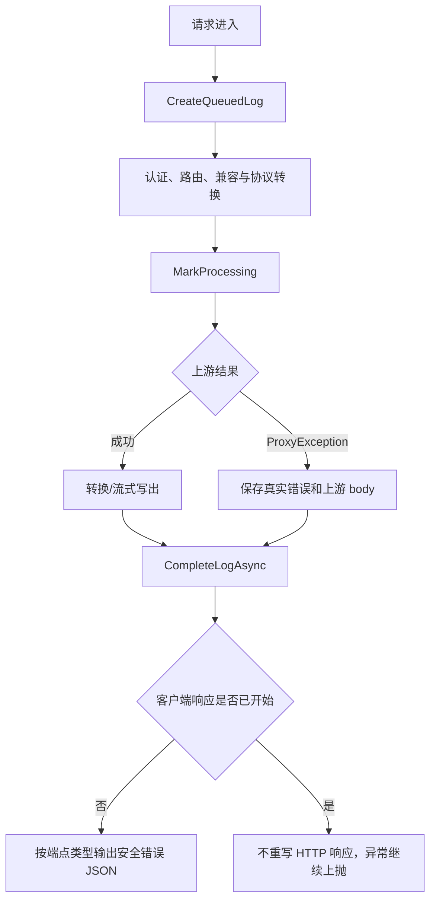
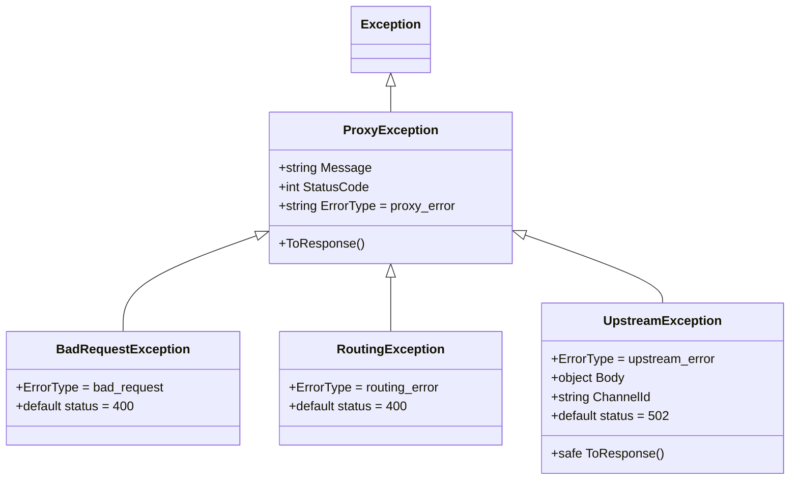
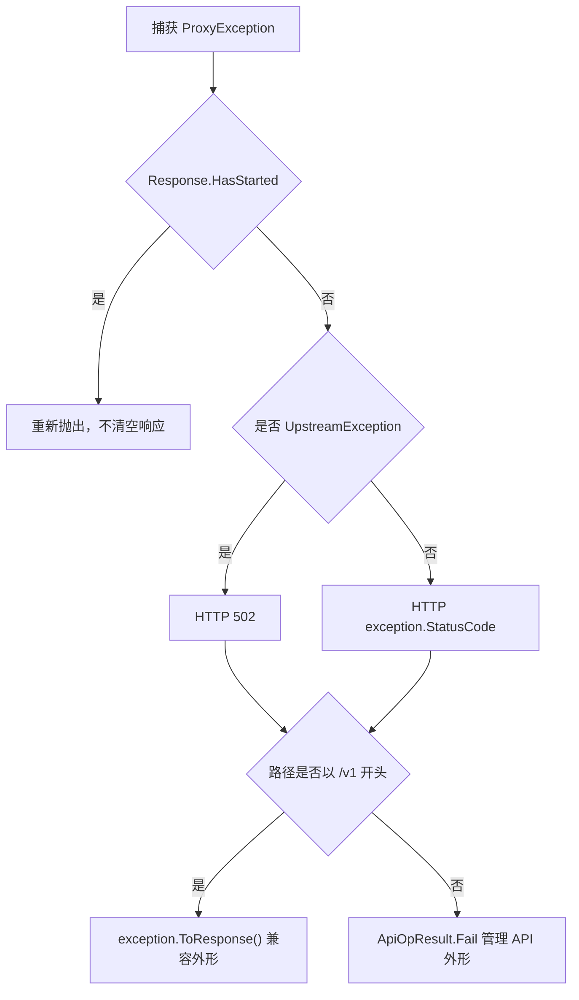
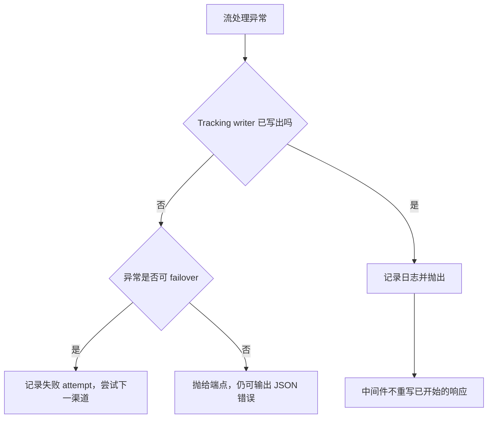
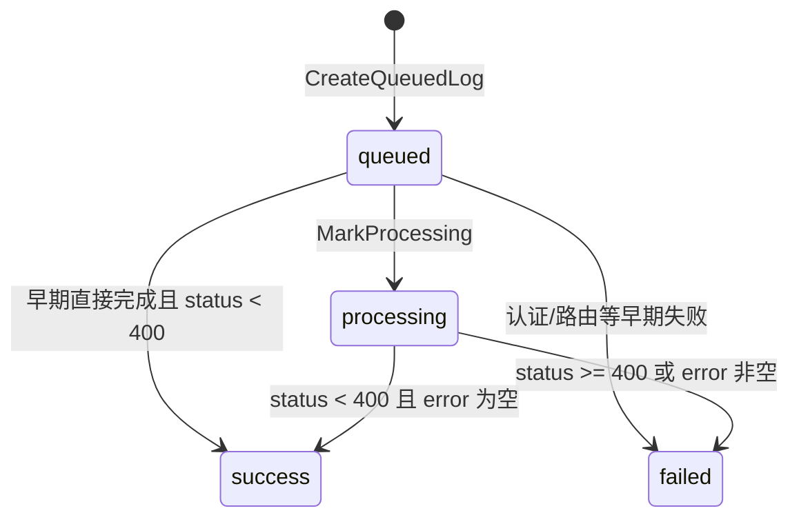
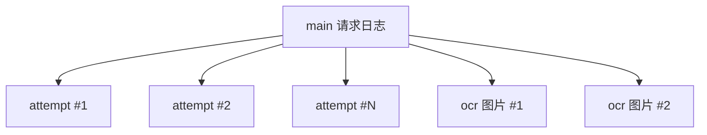
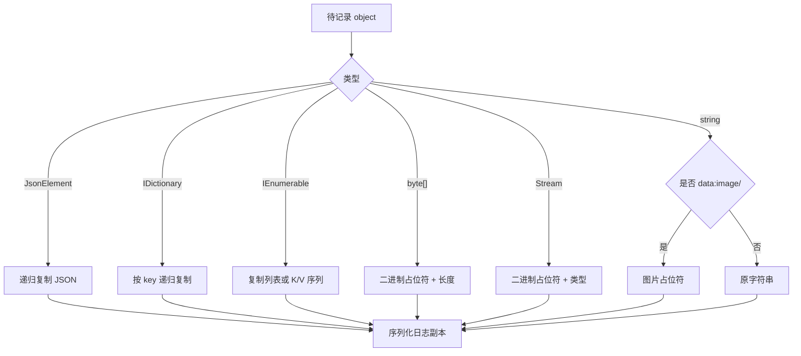
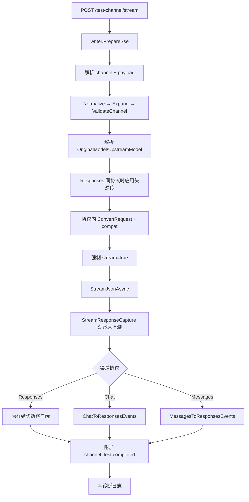

# 错误、日志、脱敏与渠道诊断

## 1. 观测体系总览

代理转换链路的可观测性由四个相互独立的机制组成：

| 机制 | 目的 | 主要输出 |
|---|---|---|
| 异常类型 | 在调用栈中携带错误类别、真实状态和上游 body | `ProxyException` 及子类 |
| 客户端错误封装 | 控制暴露给 `/v1` 客户端和管理 API 的内容 | HTTP status + JSON |
| 请求日志生命周期 | 记录入口、路由、上游、下游、usage、费用和时序 | `RequestLog` + `RequestLogDetail` |
| 渠道诊断 | 直接测试草稿渠道，同时返回 SSE 诊断事件 | `channel_test.*` + 独立日志 |



核心源码：

- `OpenCodex.Core/Errors/*.cs`
- `OpenCodex.Api/Errors/ProxyErrorMiddleware.cs`
- `OpenCodex.Core/Services/Proxy/ProxyEndpointService.cs`
- `OpenCodex.Core/Services/Proxy/ProxyLogService.cs`
- `OpenCodex.Core/Services/Proxy/ImageLogSanitizer.cs`
- `OpenCodex.Core/Services/Proxy/ProxyStreamService.cs`
- `OpenCodex.Core/Services/ChannelDiagnosticsService*.cs`

---

## 2. 异常类型层次



### 2.1 `ProxyException`

基础响应外形：

```json
{
  "error": {
    "message": "具体错误消息",
    "type": "proxy_error"
  }
}
```

它保存 `StatusCode`，默认 500。子类只需覆盖 `ErrorType` 或 `ToResponse()`。

### 2.2 `BadRequestException`

用于请求外形、参数兼容、未支持协议/转换等客户端可修正问题：

```json
{
  "error": {
    "message": "request body must be a JSON object",
    "type": "bad_request"
  }
}
```

默认 HTTP 400，但构造函数允许显式状态。

### 2.3 `RoutingException`

用于无可用路由、容量耗尽、模型无法匹配等路由层问题。默认 400，也可使用 429 等状态。例如所有匹配渠道都无容量时，端点构造状态 429 的 `RoutingException`。

### 2.4 `UpstreamException`

除 `Message` 和 `StatusCode` 外还携带：

| 字段 | 用途 |
|---|---|
| `Body` | 上游 JSON/text 错误体，供日志和诊断 |
| `ChannelId` | 发生错误的渠道标识，供故障转移/诊断 |

其客户端响应固定为：

```json
{
  "error": {
    "message": "An upstream error occurred. Please try again later.",
    "type": "upstream_error"
  }
}
```

不会把 `Message`、`Body` 或 `ChannelId` 直接放进普通兼容 API 响应。

---

## 3. 真实状态、日志状态与客户端状态

上游异常有意维护两种状态码：

```text
exception.StatusCode = 上游真实状态或代理判断状态
clientStatusCode     = 502
```

### 3.1 在 `ProxyEndpointService` 中

端点捕获 `ProxyException` 后：

```text
statusCode = exception is UpstreamException ? 502 : exception.StatusCode
errorResponse = exception.ToResponse()
upstreamResponse = UpstreamErrorBody(exception)
```

进入 `ProxyNonStreamService` 或 `ProxyStreamService` 后发生的上游异常，会先由该服务以 `exception.StatusCode` 完成 main 日志，再回到端点转换成客户端 502；每次 `attempt` 日志也使用真实状态。因此常规上游调用失败时，main 与 attempt 都可保留 429/500/503 等真实状态，而客户端仍只看到 502。若异常发生在进入流/非流服务之前，main 由 `ProxyEndpointService.finally` 完成，此时可能记录已经归一化的客户端状态；排障时应同时查看 main、attempt 和错误发生阶段。

### 3.2 在中间件中

若异常越过控制器/服务进入 `ProxyErrorMiddleware`：



### 3.3 决策表

| 场景 | 内部状态 | `/v1` 客户端 HTTP | `/v1` body | attempt 日志 |
|---|---:|---:|---|---:|
| 客户端参数错误 | 400 | 400 | 具体 `bad_request` | 若尚未进入渠道尝试则无 attempt |
| 无路由 | 400/429 | 400/429 | 具体 `routing_error` | 已发生的尝试各自记录 |
| 上游 401 | 401 | 502 | 安全 `upstream_error` | 401 |
| 上游 429 | 429 | 502 | 安全 `upstream_error` | 429 |
| 上游 timeout | 504 | 502 | 安全 `upstream_error` | 504 |
| 连接失败 | 502 | 502 | 安全 `upstream_error` | 502 |
| 未处理异常 | 500 | 500 | 管理通用 unexpected error 外形 | 视发生位置而定 |

“客户端统一 502”只针对 `UpstreamException`；路由和请求错误仍保留自身状态。

---

## 4. 流已经开始时的错误边界

HTTP headers/body 一旦开始写出，就不能再安全地清空并改成 JSON 错误：

- `ProxyErrorMiddleware` 发现 `Response.HasStarted` 后直接重新抛出；
- `ProxyEndpointService` 通过 `TrackingProxyStreamWriter.HasWritten` 判断下游是否已看到字节；
- 只有未写出时才允许路由故障转移；
- 已写出后的异常仍在 `ProxyStreamService.finally` 中完成日志，但网络层只能表现为流中断或已存在的协议错误事件。



---

## 5. 请求日志生命周期

### 5.1 状态集合

`ProxyRequestLifecycleStatus`：

```text
queued → processing → success | failed
```



`DetermineLifecycleStatus` 只判断：

```text
statusCode >= 400 OR error 非空白 => failed
否则 => success
```

它不解析 response body，也不根据 finish reason 判断成功失败。

### 5.2 `CreateQueuedLog`

在认证成功且 payload 是 JSON object 后、列举路由候选前调用。立即持久化：

`RequestLog`：

- request id；
- created timestamp；
- method/path/client IP；
- 原请求模型；
- `request_type`；
- parent id；
- is stream；
- owner/api-key 关联；
- `lifecycle_status=queued`。

`RequestLogDetail`：

- 已脱敏入口 headers；
- 已脱敏入口 payload。

提前写 queued 的价值是：即使后续路由、容量或上游处理很慢，观测端仍可看到正在排队的请求。

### 5.3 `MarkProcessing`

每次候选渠道完成图片/Web Search/compat 重写和协议转换后，在真正调用流/非流服务前更新主日志：

- owner、api key；
- `Model = RequestModel`；
- `UpstreamModel`；
- 可解析的 `ChannelId`；
- is stream；
- `lifecycle_status=processing`；
- `processing_started_at`；
- 已脱敏 `UpstreamRequestBody`。

如果发生路由故障转移，下一候选的 `MarkProcessing` 会覆盖主日志的 upstream model、channel 和上游请求，使主日志最终指向最后实际处理/失败的候选；每次历史尝试由独立 attempt 子日志保留。

### 5.4 `CompleteLogAsync`

成功、已知代理异常和多数早期失败最终都会进入完成逻辑。它：

1. 从**上游响应协议**提取 usage；
2. 解析响应模型，缺失时回退 `UpstreamModel`，再回退 `RequestModel`；
3. 计算成本和价格快照；
4. 更新主行状态、时序、tokens、费用、错误；
5. 更新 detail 的全部 payload；
6. 替换并排序保存 SSE line；
7. 把同 request id 的孤立 OCR 日志挂到主日志。

若给定 id 已不存在，则回退到一次性 `WriteCompletedLogAsync`，避免日志完全丢失。

---

## 6. 日志类型与父子关系

### 6.1 类型

| `request_type` | 生成位置 | 含义 |
|---|---|---|
| `main` | `ProxyEndpointService` | 一次客户端代理请求 |
| `attempt` | 每个渠道候选结束时 | route failover 的一次渠道尝试 |
| `ocr` | `ProxyOcrService` | 图片降级所调用的一次视觉识别 |

### 6.2 关系图



### 6.3 attempt 日志内容

`ResponsePayload` 中保存诊断对象：

```json
{
  "kind": "channel_attempt",
  "route_attempt_number": 2,
  "route_retry_number": 1,
  "channel_id": "...",
  "channel_name": "Channel B",
  "channel_type": "messages",
  "upstream_model": "claude-...",
  "configured_retry_count": 3,
  "status_code": 429,
  "outcome": "failed",
  "failover_eligible": true,
  "duration_ms": 123,
  "error": "..."
}
```

注意两个“重试”概念：

- `route_retry_number` 是候选渠道序号减一；
- `configured_retry_count` 是该渠道 HTTP client 内部重试次数。

一个 attempt 日志可能已经包含多次同渠道 HTTP 请求。

### 6.4 OCR 后挂父日志

OCR 可能发生在 main queued 日志 id 对 OCR 服务尚不可见的阶段，因此 OCR 初始写入：

```text
request_type=ocr
request_id=<与 main 相同>
parent_request_log_id=null
ocr_json.parent_request_log_id=null
```

main 完成时查找相同 `RequestId` 且 parent 为空的 OCR 日志，批量：

- 设置 `RequestLog.ParentRequestLogId = main.Id`；
- 更新 `OcrJson.parent_request_log_id = main.Id`。

该关联逻辑只在 `request_type=main` 的日志完成/一次性写入时执行。

---

## 7. 持久化结构

### 7.1 `RequestLog`：可筛选摘要

| 维度 | 字段 |
|---|---|
| 身份 | `RequestId`, `OwnerUserId`, `ApiKeyId` |
| 生命周期 | `CreatedAt`, `ProcessingStartedAt`, `CompletedAt`, `LifecycleStatus` |
| HTTP | `Method`, `Path`, `ClientIp`, `StatusCode` |
| 路由 | `Model`, `UpstreamModel`, `ChannelId` |
| 类型关系 | `RequestType`, `ParentRequestLogId` |
| 流式 | `IsStream`, `TtftMs`, `DurationMs` |
| usage | `InputTokens`, `OutputTokens`, cache 相关四字段 |
| 费用 | `Cost`, `CostCurrency`, pricing ids/snapshot |
| 错误 | `Error` |

### 7.2 `RequestLogDetail`：大字段

| 字段 | 内容 |
|---|---|
| `RequestHeaders` | 入口请求头 |
| `RequestBody` | 入口 payload |
| `UpstreamRequestBody` | 最终发送上游的 payload |
| `UpstreamResponseBody` | 上游协议完整/累计响应 |
| `ResponseBody` | 下游转换结果；错误时为 error response |
| `WebSearchJson` | Web Search 模拟诊断 |
| `OcrJson` | OCR 引擎、来源、cache 和父关系 |
| `StreamTimingsJson` | 首 SSE、首 reasoning、首文本、首工具参数、completed 等时序 |

所有这些 JSON 字符串写入前都经过 `SerializeForLog` 和深拷贝脱敏。

### 7.3 `RequestLogStreamLine`

每条：

```text
RequestLogId + Sequence + OccurredAt + Source + RawLine
```

`Source` 当前主要为：

- `upstream`：上游原始 SSE；
- `downstream`：转换后/模拟后写给客户端的 SSE。

完成日志时按 `Sequence` 排序；若本次有新 captures，先删除该日志已有行再插入，避免重复。

---

## 8. 上游响应、下游响应与 usage 真值

### 8.1 非流式

```text
UpstreamResponseBody = HttpUpstreamClient 返回的渠道协议 JSON
ResponseBody         = ProtocolConverter.ConvertResponse 后的入口协议 JSON
```

Web Search 模拟时记录最终轮上游请求、最终上游响应、合成的 Responses 输出和模拟详情。

### 8.2 流式跨协议

转换器的 `ConvertedStreamResult.UpstreamResponse` 保存由渠道协议 accumulator 重建的完整响应。之后根据入口协议生成 `responsePayload`，所以日志仍能区分：

- 转换前上游协议响应；
- 转换后下游协议响应。

### 8.3 同协议透传

`StreamResponseCapture` 在透明转发过程中累计当前协议的完整响应，并记录终止原因。即使上游中途异常或客户端取消，也尽量保留已经观察到的部分响应。

### 8.4 usage 提取始终按渠道协议

| 渠道协议 | input | cache | output |
|---|---|---|---|
| Responses | `usage.input_tokens` | `input_tokens_details.cached_tokens`，计入 cache read | `usage.output_tokens` |
| Chat | `usage.prompt_tokens` | 优先 `prompt_tokens_details.cached_tokens`，回退 `input_tokens_details.cached_tokens` | `usage.completion_tokens` |
| Messages | `input_tokens + cache_creation_input_tokens + cache_read_input_tokens` | creation + read；另行拆分 write/read | `usage.output_tokens` |

未知/缺少 usage 时全部为 0。usage 数值转换失败或溢出也回退 0。

价格计算显式同时传入：

```text
RequestModel
UpstreamModel
ResponseModel
ModelUsageVector
```

不能把三种模型字段合并为一个概念。

---

## 9. 流时序与 SSE line 捕获

### 9.1 `StreamWriteMetrics`

只在 `HasValues=true` 时持久化。可能包含：

- `ttft_ms`；
- `first_sse_event_ms`；
- `first_reasoning_summary_text_delta_ms`；
- `first_output_text_delta_ms`；
- `first_function_call_arguments_delta_ms`；
- `completed_event_ms`。

主 `RequestLog.TtftMs` 单独保存最常用的 TTFT，详细字段写入 `StreamTimingsJson`。

### 9.2 为什么不保存每一行

`CaptureLoggableStreamLines` 是有选择的诊断捕获，避免日志被 metadata、完整 final response output 或无意义 keep-alive 淹没。

Responses 可记录事件：

```text
response.completed
response.content_part.added / done
response.custom_tool_call_input.delta / done
response.error
response.function_call_arguments.delta / done
response.output_item.added / done
response.output_text.delta / done
response.reasoning_summary_part.added / done
response.reasoning_summary_text.delta / done
```

明确忽略：

```text
response.created
response.in_progress
response.metadata
```

Messages 可记录：

```text
message_start
content_block_start
content_block_delta
content_block_stop
message_delta
message_stop
error
```

Chat 没有显式 event name 时，只要：

- `choices[].delta` 非空；
- `finish_reason` 非 null；
- 或根含 `usage` object；

就记录原 `data:` 行。

`data: [DONE]` 总会记录。

### 9.3 `response.completed` 摘要化

为了不在 SSE line 表里重复保存完整 output，捕获时只保留其 `response` 下：

```text
id, object, created_at, completed_at, status, model,
usage, error, incomplete_details
```

原完整响应仍可由 accumulator 放入 `UpstreamResponseBody`，这是两个不同的观测层。

### 9.4 事件空行

当某个可记录事件已经打开，后续空行会作为 `RawLine=""` 保存，以保留 SSE event 边界。无已记录事件的空行不会单独写日志。

---

## 10. 深拷贝脱敏

### 10.1 总原则

`ImageLogSanitizer.CopyAndSanitize` 构造新对象，不修改业务 payload、上游响应或实际客户端响应。日志脱敏与传输数据彼此隔离。



### 10.2 敏感 key

大小写不敏感匹配：

```text
authorization
authorization_token
api-key
api_key
apikey
x-api-key
cookie
set-cookie
password
access_token
refresh_token
```

值替换为：

```text
***REDACTED***
```

该判断递归生效，包括 MCP tool/server 内的 authorization token 和嵌套 headers。

### 10.3 图片和二进制

| 输入 | 日志值 |
|---|---|
| key 为 `b64_json` | `***IMAGE_DATA_REDACTED***` |
| 任意字符串以 `data:image/` 开头 | `***IMAGE_DATA_REDACTED***` |
| `byte[]` | `***BINARY_DATA_REDACTED*** (<N> bytes)` |
| `Stream` | `***BINARY_DATA_REDACTED*** (<TypeName>)` |

普通远程图片 URL 并不会仅因 key 是 `image_url` 就被替换；只有 data URI 内容会被移除。

### 10.4 当前脱敏边界

脱敏是 key/前缀驱动，不是通用秘密扫描器。以下值若放在非敏感 key 下可能仍被记录：

- 自定义名字如 `tenant_secret`；
- 普通文本中嵌入 token；
- 非 `data:image/` 的其他 data URI；
- URL query 中的签名参数。

渠道诊断在通用 sanitizer 前还有一层 `RedactObject`，把已知敏感值替换成 `...`；最终持久化时仍会再次经过通用 sanitizer。

---

## 11. 渠道诊断流程

### 11.1 目标

渠道诊断允许管理用户用尚未保存的渠道草稿测试：

- 配置规范化和环境变量展开；
- endpoint、认证头、timeout/retry；
- 模型映射；
- compat 参数处理；
- 上游 SSE 可用性；
- Chat/Messages 到 Responses 的流式兼容；
- 转换前上游完整响应捕获。

### 11.2 流程图



### 11.3 转换方向容易误读

`PrepareTestChannel` 调用：

```text
ConvertRequest(payload, channelType, channelType, upstreamModel)
```

也就是说诊断 payload 本身按被测渠道协议构造，不先假定为公共 Responses 请求再转为渠道协议。Chat/Messages 的客户端诊断输出之后统一转换为 Responses SSE，便于前端使用同一事件消费逻辑。

### 11.4 诊断完成事件

正常流结束前追加：

```text
event: channel_test.completed
data: {...}
```

数据可含：

- `status_code`, `duration_ms`；
- `request_model`, `upstream_model`；
- `channel_id`, `channel_type`；
- 已脱敏 `upstream_request`；
- 已脱敏 `upstream_response`；
- 可选 `response`、`error_response`、`error`。

对于 Responses 原生上游，`channel_test.completed` 在上游 `[DONE]` 前插入的具体顺序由 `AppendTestCompletedEventAsync` 与源流结束事件共同决定，现有测试要求 completed 出现在 `[DONE]` 之前。

### 11.5 错误事件

配置错误：

```text
event: channel_test.error
data: {"error":{"message":"...","type":"config_error"}}
```

随后仍写 `channel_test.completed`，内部 status 400。

代理/上游异常同样写 error + completed。外层 HTTP 因已准备 SSE，通常仍为 200；真实 400/429 等放在事件和日志的 `status_code` 中。

### 11.6 日志记录转换前响应

Chat/Messages 渠道的诊断客户端看到 Responses 事件，但：

```text
RequestLogDetail.UpstreamResponseBody
= StreamResponseCapture 对原 Chat/Messages SSE 的累计结果
```

因此排查协议转换时，可以比较：

1. 原 `UpstreamRequestBody`；
2. 原协议 `UpstreamResponseBody`；
3. 客户端实际收到的 Responses SSE；
4. `StreamTimingsJson`。

当前渠道诊断没有把逐行 SSE captures 传入 `ProxyLogContext.StreamLines`；它依赖完整响应捕获和时序日志。

---

## 12. 诊断与普通代理的行为差异

| 维度 | 普通代理 | 渠道诊断 |
|---|---|---|
| 路由候选 | 从已保存渠道列表选择，可 failover | 单个草稿渠道 |
| 请求协议 | 由入口端点决定 | payload 按渠道协议构造 |
| Chat/Messages 下游 | 保持客户端入口协议 | 统一转换成 Responses SSE |
| HTTP error 暴露 | UpstreamException 对客户端统一 502 | SSE 内保留真实 status |
| 完成信号 | 协议自身完成事件 | 额外 `channel_test.completed` |
| 请求日志生命周期 | queued → processing → complete | 一次性 completed log |
| attempt 子日志 | 有 | 无 |
| SSE line 明细 | 主流服务可保存 | 当前未保存逐行表 |
| secrets | 通用深拷贝脱敏 | 诊断预脱敏 + 通用脱敏 |

---

## 13. 排障顺序

### 13.1 客户端看到 502

1. 查 main 日志的 request id、最终 channel、upstream model；
2. 查其 attempt 子日志，寻找真实 status 和 `failover_eligible`；
3. 查 attempt 的 `UpstreamResponseBody` 是否保留上游 error body；
4. 对同渠道执行渠道诊断；
5. 比较 `UpstreamRequestBody` 与预期字段映射；
6. 若是流式，检查 line 来源与 `StreamTimingsJson`；
7. 再检查渠道 timeout/retry 和熔断状态。

### 13.2 客户端流中途断开

1. 看 main 是否 `failed`，error 是取消、上游错误还是转换异常；
2. 看已写出的 downstream line 最后事件；
3. 看 upstream line 是否有对应完成/错误；
4. 比较 `first_sse_event_ms` 与 `completed_event_ms`；
5. 检查 `StreamResponseCapture` 的部分响应与终止元数据；
6. 注意已写字节后没有 route failover。

### 13.3 usage 或费用异常

1. 确认日志 `ChannelType`；
2. 查看**转换前** `UpstreamResponseBody.usage`；
3. 按渠道协议字段规则核算；
4. 区分 cache write 和 cache read；
5. 核对 `RequestModel`、`UpstreamModel`、响应 model；
6. 查看 pricing snapshot，而不是仅按请求模型猜测。

---

## 14. 测试锚点

| 行为 | 测试 |
|---|---|
| 嵌套 MCP 认证脱敏 | `ProxyLogServiceTests.WriteLog_RedactsNestedMcpAuthorizationTokens` |
| request 中图片 data URI / b64 脱敏 | `ProxyLogServiceTests.WriteLog_RedactsNestedImageDataInObjectsAndArrays` |
| 上游错误图片脱敏 | `ProxyLogServiceTests.WriteLog_RedactsImageDataInUpstreamErrorResponse` |
| 脱敏不修改客户端 response | `ProxyLogServiceTests.WriteLog_DoesNotModifyClientResponseWhileSanitizingStoredLog` |
| 长 base64 不留存且不修改源 | `ProxyLogServiceTests.WriteLog_DoesNotRetainLongBase64SentinelOrMutateSource` |
| byte[]/Stream 占位 | `ProxyLogServiceTests.WriteLog_ReplacesBinaryValuesWithoutEnumeratingThem` |
| 流时序持久化 | `ProxyLogServiceTests.WriteLog_PersistsStreamTimingsJson` |
| queued/processing/completed + SSE 行 | `ProxyLogServiceTests.LifecycleMethods_PersistStatusesAndStreamLines` |
| 渠道诊断日志 secrets | `ChannelDiagnosticsLogTests.TestChannelStreamWritesRequestLogWithoutSecrets` |
| completed 诊断事件 | `ChannelDiagnosticsLogTests.TestChannelStreamEmitsDiagnosticDetailEvent` |
| Chat 转 Responses、日志留原响应 | `ChannelDiagnosticsLogTests.TestChannelStreamForChatChannelExtractsOutputText` |
| Messages 转 Responses、日志留原响应 | `ChannelDiagnosticsLogTests.TestChannelStreamForMessagesChannelCapturesOriginalResponse` |
| 配置错误 SSE | `ChannelDiagnosticsLogTests.TestChannelStreamForConfigErrorEmitsErrorEvent` |
| 上游错误真实状态 SSE/日志 | `ChannelDiagnosticsLogTests.TestChannelStreamForUpstreamErrorEmitsErrorEvent` |

---

## 15. 维护检查清单

1. 新异常属于 bad request、routing 还是 upstream；
2. 内部真实状态、客户端状态和 attempt 状态是否分别正确；
3. 流已开始后是否尝试非法重写响应；
4. 新协议 usage 字段是否加入 `ExtractUsage`；
5. 新敏感 header/body key 是否加入 sanitizer；
6. 新多模态二进制形态是否会被枚举或完整持久化；
7. 日志脱敏是否通过深拷贝，不修改业务对象；
8. 新 SSE 事件是否应进入逐行日志白名单；
9. completed 大事件是否需要摘要化；
10. 新子流程是否建立 `request_type` 和 parent 关系；
11. 诊断 SSE 是否同时发 error 和 completed；
12. 渠道诊断日志是否仍捕获转换前响应。

相关延伸阅读：

- [流式累积、捕获、终止与 TTFT](../07-streaming/03-accumulators-capture-termination-and-ttft.md)
- [请求头转发与上游重试](../08-special-flows/03-header-forwarding-and-upstream-request.md)
- [图片检测与 OCR 降级](../08-special-flows/01-image-detection-ocr-fallback-and-images-boundary.md)
- [测试覆盖、已知边界与维护](./03-test-coverage-known-boundaries-and-maintenance.md)
