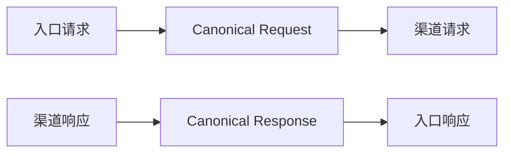
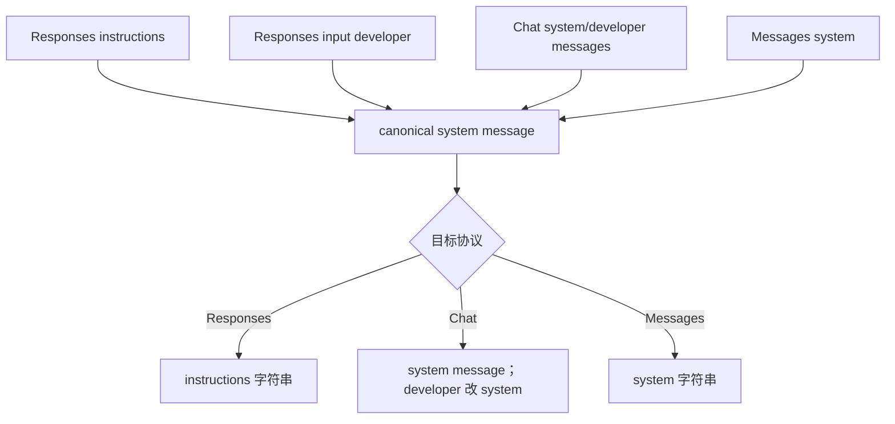

# 字段、内容块、事件映射与源码索引

## 1. 使用方式

本文是三协议转换的速查索引，集中回答：

1. 某个入口字段在渠道协议中会变成什么；
2. 某种内容块、工具调用和 usage 如何表示；
3. 六个跨协议 SSE 方向分别监听和发出哪些事件；
4. 需要修改某一行为时应从哪个源码文件开始。

术语固定为：

- **入口协议**：客户端调用协议，也是最终下游响应协议；
- **渠道协议**：选中上游渠道的 `type`；
- **请求方向**：入口 → 渠道；
- **响应方向**：渠道 → 入口。

> `ConvertResponse(payload, sourceProtocol, targetProtocol, ...)` 的形参名容易误读。调用方仍把入口协议放在第二个参数、渠道协议放在第三个参数；实现内部按渠道协议解析，再按入口协议输出。

---

## 2. 规范化中间结构

跨协议非流式转换不是 6×6 套直接字段拷贝，而是“两段式”：



### 2.1 Canonical Request

顶层形态：

```text
model
messages[]
tools[]
tool_choice
params{}
```

`messages[]` 使用 Chat 风格作为内部会话骨架，可能含：

```text
role: system | developer | user | assistant | tool
content
tool_calls[]
tool_call_id
name
reasoning_content
anthropic_thinking_encrypted
native_type
is_error
```

工具规范项常见字段：

```text
name, namespace, description, parameters,
native_type, raw, compat,
mcp_kind, mcp_dialect, ...
```

### 2.2 Canonical Response

核心字段：

```text
id
model
created
text
reasoning
refusal
annotations[]
tool_calls[]
tool_results[]
finish_reason
usage{}
raw
anthropic_thinking_encrypted（按需）
```

统一 finish reason：

```text
stop | length | tool_calls | content_filter
```

统一 usage：

```text
input_tokens
output_tokens
total_tokens
cached_tokens
```

流式转换器不会简单逐事件调用非流式转换，而是维护同等语义的增量状态机，并在终止时重建完整上游响应。

---

## 3. 顶层请求字段矩阵

### 3.1 核心字段

| 语义 | Responses | Chat Completions | Messages | 转换规则 |
|---|---|---|---|---|
| 模型 | `model` | `model` | `model` | 所有目标请求最终写 `UpstreamModel` |
| 会话输入 | `input` | `messages` | `messages` | 统一到 canonical `messages` |
| 系统指令 | `instructions` | `messages[system/developer]` | `system` | 合并多段时以空行分隔 |
| 输出上限 | `max_output_tokens` | `max_tokens` / 入站 `max_completion_tokens` | `max_tokens` | canonical 内暂用 `max_tokens`，目标再规范化 |
| 停止序列 | 无专用转换规则/保留允许字段 | `stop` | `stop_sequences` | Chat ↔ Messages 映射；字符串到 Messages 包成数组 |
| 流式 | `stream` | `stream` | `stream` | 主端点只有运行时布尔 `true` 才进入流式服务 |
| 工具 | `tools` | `tools` | `tools` + `mcp_servers` | 统一 canonical tool contract |
| 工具选择 | `tool_choice` | `tool_choice` | `tool_choice` | 见第 8 节 |
| 结构化输出 | `text.format` | `response_format` | `output_config.format` | JSON Schema 形态互转 |
| 推理配置 | `reasoning.effort` | `reasoning_effort` | `thinking` | Responses ↔ Chat 显式映射；Messages thinking 另有历史保留逻辑 |
| 并行工具 | `parallel_tool_calls` | `parallel_tool_calls` | 无等价字段 | 转 Messages 前作为 Responses-only 参数移除 |
| cache key | `prompt_cache_key` | `prompt_cache_key` | 无同名等价 | 转 Messages 前移除；路由亲和读取发生在转换前 |
| include | `include` | 无 | 无 | 转非 Responses 时通常经白名单删除 |
| 服务层级 | `service_tier` | `service_tier` | `service_tier` | 三目标允许 |
| 温度 | `temperature` | `temperature` | `temperature` | 三目标允许 |
| top-p | `top_p` | `top_p` | `top_p` | 三目标允许 |
| metadata | `metadata` | `metadata` | `metadata` | 三目标允许，具体上游限制另由 compat 处理 |

### 3.2 指令和 role



精确规则：

- Responses `instructions` 非空时先建立 system message；
- Responses `input` 中 `role=developer` 转入 canonical 时改为 system；
- Responses 源的多个 system 消息由 `MergeSystemMessages` 合成一个；
- Chat → Chat/其他时 developer 在目标 Chat 中改为 system；
- Messages `system` 可是复杂内容，但进入 canonical 时通过 `StringifyContent` 文本化；
- 生成 Messages 时，所有 system/developer 文本收集到顶层 `system`，不放入 `messages`。

### 3.3 Plan Mode 特殊指令

Responses 输入中若检测到约定的 `<proposed_plan>` 提示标记，会向合并后的 system 指令追加固定 Plan Mode 约束。这是请求规范化阶段的语义增强，不是普通字段一对一映射。

---

## 4. 目标协议参数白名单

跨协议请求最终执行 `FilterRequestParameters`。同协议请求不经过该白名单，只做深拷贝、模型替换和工具 Schema 清理。

### 4.1 Responses 允许字段

```text
background, context_management, conversation, include, input, instructions,
max_output_tokens, max_tool_calls, metadata, model, moderation, parallel_tool_calls,
previous_response_id, prompt, prompt_cache_key, prompt_cache_options,
prompt_cache_retention, reasoning, safety_identifier, service_tier, store,
stream, stream_options, temperature, text, tool_choice, tools, top_logprobs,
top_p, truncation, user
```

### 4.2 Chat 允许字段

```text
messages, model, audio, frequency_penalty, function_call, functions,
logit_bias, logprobs, max_completion_tokens, max_tokens, metadata, modalities,
moderation, n, parallel_tool_calls, prediction, presence_penalty,
prompt_cache_key, prompt_cache_options, prompt_cache_retention,
reasoning_effort, response_format, safety_identifier, seed, service_tier,
stop, store, stream, stream_options, temperature, tool_choice, tools,
top_logprobs, top_p, user, verbosity, web_search_options
```

### 4.3 Messages 允许字段

```text
model, messages, max_tokens, cache_control, container, inference_geo,
metadata, output_config, service_tier, stop_sequences, stream, system,
temperature, thinking, tool_choice, tools, top_k, top_p, mcp_servers
```

### 4.4 Messages 目标的预删除

在通用白名单前，明确删除 Responses-only 参数：

```text
include, reasoning, text, previous_response_id, client_metadata,
parallel_tool_calls, prompt_cache_key, store
```

`output_config` 会先从 Responses `text.format` 或 Chat `response_format` 生成，所以删除 `text` 不会丢掉已经提取的结构化输出配置。

Messages 目标若最后缺少 `max_tokens`，默认补 `4096`。

---

## 5. 文本、多模态和文件内容块

### 5.1 文本

| 语境 | Responses | Chat | Messages |
|---|---|---|---|
| 用户/系统输入 | `{type:"input_text", text}` | 字符串或 `{type:"text", text}` | `{type:"text", text}` |
| 助手输出 | `{type:"output_text", text}` | 字符串或 `{type:"text", text}` | `{type:"text", text}` |

简化规则：转换到 Chat 时，若内容最终只有一个 text block，会折叠为字符串；多个/多模态块保留数组。

### 5.2 图片

| Responses | Chat | Messages |
|---|---|---|
| `{type:"input_image", image_url, detail?}` | `{type:"image_url", image_url:{url, detail?}}` | `{type:"image", source:{type:"url",url}}` 或 `{type:"image", source:{type:"base64",media_type,data}}` |

data URL 转 Messages：

```text
data:<media_type>;base64,<data>
→ source.type=base64
→ source.media_type=<media_type>
→ source.data=<data>
```

普通 URL 转 `source.type=url`。从 Messages base64 返回 Chat/Responses 时重新组装 data URL。

`detail` 在 Responses ↔ Chat 间保留；Messages image source 没有该目标字段，因此跨到 Messages 时不保留这一提示。

### 5.3 文件/文档

| Responses | Chat | Messages |
|---|---|---|
| `input_file`，可含 `file_id/file_data/filename/file_url` | `file` + `file{...}` | `document` + `source` |

可互转的 Messages source：

- URL → `{type:"url", url}`；
- data URL 或裸 base64 file data → `{type:"base64", media_type, data}`；
- 文件名可映射成 Messages document `title`。

仅有 provider `file_id` 而没有 data/url 时，Messages 无直接等价表示；语义验证和目标能力应优先阻止不可表示请求，而不是假定 provider 间 file id 可通用。

### 5.4 未知块

内容转换器对部分未知对象采取深拷贝保留，但最终目标参数/上游可能仍拒绝。深拷贝不等于语义兼容保证。

---

## 6. Reasoning、Thinking、Refusal 与 Annotation

### 6.1 请求历史中的推理

| 源 | canonical | 目标 |
|---|---|---|
| Responses `reasoning.summary` | assistant `reasoning_content` | Chat `reasoning_content`；Responses reasoning item |
| Responses `encrypted_content` 为 Anthropic 编码 | `anthropic_thinking_encrypted` | 开启 compat 时可恢复 Messages thinking blocks |
| Messages `thinking` | `reasoning_content` + 可选加密 blocks | Responses reasoning；Chat reasoning_content |
| Messages `redacted_thinking` | 只进入加密 block 集 | 不能作为普通明文推理伪造 |
| Chat `reasoning_content` | 原字段 | Responses reasoning；Messages 当前不会从纯 reasoning 文本生成 thinking |

Messages thinking signature 只有在保留原加密块时才可恢复。仅当 assistant 历史含可解码的 `anthropic_thinking_encrypted`，且渠道 compat 开启 thinking 历史保留时，才会向 Messages 恢复原 thinking/redacted-thinking blocks；代理不会把 Responses/Chat 生成的纯 reasoning 文本伪造成 Anthropic thinking 或 signature。

### 6.2 非流式响应

| 渠道 → 入口 | 行为 |
|---|---|
| Messages → Responses | `thinking` 合成 Responses reasoning output；签名块编码进 `encrypted_content` |
| Messages → Chat | `reasoning_content`，并可带内部 `anthropic_thinking_encrypted` |
| Chat → Responses | `message.reasoning_content` → Responses reasoning output |
| Responses → Chat | reasoning summary → `message.reasoning_content` |
| Responses/Chat → Messages | 当前非流式 `CanonicalToMessagesResponse` 不生成 thinking block；主要生成 text/tool blocks |

### 6.3 流式响应

流式 Messages 目标有专门 thinking block 状态机，因此 Responses/Chat reasoning delta 可以实时映射成 `thinking_delta`。这与当前非流式 Messages 输出存在实现层面的不对称。

### 6.4 Refusal

| 目标 | 表示 |
|---|---|
| Responses | message content `{type:"refusal", refusal}`；部分 Chat 入站流当前合并为 output text |
| Chat | `message.refusal` / `delta.refusal` |
| Messages | 无独立 refusal content block；流式转换通常归入 text，非流式仅通过 `stop_reason=refusal` 表达 content-filter 终态 |

### 6.5 Annotation / Citation

- Responses 非流式 output text annotations 可进入 canonical；
- 生成 Chat 时写 `message.annotations`；
- Chat annotations 可规范化回 Responses；
- Responses → Messages 流式对 URL citation 有专门映射；
- 当前非流式 `CanonicalToMessagesResponse` 不输出 annotation/citation，需注意流/非流差异。

---

## 7. 工具定义矩阵

### 7.1 普通函数

| Responses | canonical | Chat | Messages |
|---|---|---|---|
| `{type:"function",name,description,parameters}` | `{name,description,parameters,native_type:"function"}` | `{type:"function",function:{name,description,parameters}}` | `{name,description,input_schema}` |

Chat/Messages 目标会调用 `SanitizeToolSchema` 清理不兼容 JSON Schema 结构。

### 7.2 Namespace

Responses 可以使用：

```json
{
  "type": "namespace",
  "name": "fs",
  "tools": [
    {"type":"function","name":"read_file","parameters":{}}
  ]
}
```

进入 canonical 后：

```text
name = fs__read_file
namespace = fs
```

Chat 无 namespace 容器，使用扁平名 `fs__read_file`。历史 `fs.read_file` 会规范化为双下划线形式。回到 Responses 时按 `namespace` 重新分组为 namespace tool。

Messages 工具名当前直接使用 canonical `name`，因此通常保留扁平的 `fs__read_file`。

### 7.3 Responses 原生/自定义工具

Responses 非 function tool 会被包装为 canonical tool：

| 源 type | canonical `native_type` | 默认参数形态 |
|---|---|---|
| `custom` / `custom_tool` | `custom` 等 | `{input:string}`；可把 grammar 描述写入 schema |
| `local_shell` / `shell` | 同 type | `{cmd:string}` |
| `apply_patch` | `apply_patch` | `{patch:string}` |
| 其他 native type | 同 type | `{input:string}`，除非源提供 schema |

若目标协议没有原生表达，通常作为函数工具代理；响应转换依靠 `ResponsesToolCallMapping` 恢复原 Responses item type。无法安全恢复的调用会显式报错。

### 7.4 Web Search

Responses `{type:"web_search"}` 规范化为名为 `web_search`、只接受 `query` 的工具，并保留 `native_type=web_search` 和 raw 定义。

其最终处理由全局模式决定：

- `convert`：按普通/native 工具转换；
- `simulate`：满足条件时由代理执行多轮搜索；
- `disabled`：转换前移除。

### 7.5 Native Remote MCP

| Responses | Messages | Chat |
|---|---|---|
| `type=mcp` 工具定义 | Anthropic MCP toolset + `mcp_servers` | 没有原生 remote MCP 定义 |

canonical 用 `native_type=mcp`、`mcp_kind=remote`、`mcp_dialect` 等字段区分方言。Responses ↔ Messages 只有在 server、allowed tools、config 等语义可表达时转换；否则抛出详细 `BadRequestException`。

转换到 Chat 时不会把 remote MCP 默默伪装成普通 function：

```text
Chat Completions has no native remote MCP tool definition
```

---

## 8. Tool Choice 映射

| 统一语义 | Responses | Chat | Messages |
|---|---|---|---|
| 自动 | `"auto"` | `"auto"` | `{type:"auto"}` |
| 禁用 | `"none"` | `"none"` | `{type:"none"}` |
| 必须调用任意工具 | `"required"` | `"required"` | `{type:"any"}` |
| 指定函数 | `{type:"function",name}` | `{type:"function",function:{name}}` | `{type:"tool",name}` |
| 指定 custom | `{type:"custom",name}` | custom 或代理函数形态 | `{type:"tool",name}` |
| Web Search | `{type:"web_search"}` 等 | 指向 `web_search` function | `{type:"tool",name:"web_search"}` |
| apply_patch | custom/native choice | 指向 `apply_patch` function | `{type:"tool",name:"apply_patch"}` |

Messages 的 `any`、Responses/Chat 的 `required` 表达同一“必须使用某个工具”语义。

---

## 9. 工具调用与工具结果

### 9.1 调用

| Responses output/input item | Chat assistant | Messages assistant |
|---|---|---|
| `function_call` | `tool_calls[].type=function` | `content[].type=tool_use` |
| `custom_tool_call` | 映射/代理为 tool call，保留 mapping | `tool_use` |
| `local_shell_call`、`apply_patch_call` 等 | 代理函数 tool call | `tool_use` |
| `mcp_call` | 不可表示，显式拒绝 | `mcp_tool_use` |
| `web_search_call` | 视服务端执行/转换模式处理 | 通常不伪造成客户端需再次执行的普通工具 |

共同身份字段：

```text
Responses: call_id 或 id
Chat: tool_calls[].id
Messages: tool_use.id
```

共同参数字段：

```text
Responses: arguments / input / action
Chat: function.arguments JSON 字符串
Messages: input JSON object
```

### 9.2 结果

| Responses | Chat | Messages |
|---|---|---|
| `function_call_output` 等，`call_id + output` | `role=tool, tool_call_id, content` | user message 内 `tool_result{tool_use_id,content}` |
| MCP call 内嵌 `output/error` 或 MCP output | 无原生表示 | `mcp_tool_result{tool_use_id,is_error,content}` |

`tool_search_output` 特殊读取 `tools` 数组，并序列化成 tool message content。

### 9.3 历史正规化

`NormalizeChatToolHistory` 负责使 assistant tool calls 与后续 tool results 形成可发送历史。缺失输出时可插入：

```text
[tool output missing - no function_call_output was provided for this call_id]
```

这样可避免部分上游因孤立 tool call 拒绝整段历史；具体策略和工具名恢复见工具专题文档。

---

## 10. 非流式响应 Envelope

### 10.1 Responses

```json
{
  "id": "resp_...",
  "object": "response",
  "created_at": 0,
  "status": "completed | incomplete",
  "model": "<OriginalModel>",
  "output": [],
  "usage": {}
}
```

canonical `length/content_filter` 生成 `status=incomplete`：

```text
length         → incomplete_details.reason=max_output_tokens
content_filter → incomplete_details.reason=content_filter
```

文本、reasoning、refusal 和 tool call 分别成为独立 output item。

### 10.2 Chat

```json
{
  "id": "chatcmpl_...",
  "object": "chat.completion",
  "created": 0,
  "model": "<OriginalModel>",
  "choices": [{
    "index": 0,
    "message": {"role":"assistant"},
    "finish_reason": "stop | length | tool_calls | content_filter"
  }],
  "usage": {}
}
```

### 10.3 Messages

```json
{
  "id": "msg_...",
  "type": "message",
  "role": "assistant",
  "model": "<OriginalModel>",
  "content": [],
  "stop_reason": "end_turn | max_tokens | tool_use | refusal",
  "stop_sequence": null,
  "usage": {}
}
```

### 10.4 模型可见性

同协议响应会深拷贝并直接覆盖 `model=OriginalModel`；跨协议 canonical 建立时也优先使用 `originalModel`。上游实际模型只保留在日志的 `UpstreamModel`/上游响应中，不应泄露为客户端可见模型。

---

## 11. 完成原因映射

### 11.1 入 canonical

| 源 | 值 | canonical |
|---|---|---|
| Responses | `status=incomplete, reason=content_filter` | `content_filter` |
| Responses | `status=incomplete, 其他 reason` | `length` |
| Responses | `status=failed/cancelled` | `content_filter` |
| Responses | completed 且有 tool call | `tool_calls` |
| Responses | completed 且无 tool call | `stop` |
| Chat | `length` | `length` |
| Chat | `tool_calls/function_call` | `tool_calls` |
| Chat | `content_filter` | `content_filter` |
| Chat | 其他/null | `stop` |
| Messages | `max_tokens` | `length` |
| Messages | `tool_use` | `tool_calls` |
| Messages | `refusal` | `content_filter` |
| Messages | 其他/null | `stop` |

### 11.2 从 canonical 到 Messages

| canonical | Messages stop reason |
|---|---|
| `length` | `max_tokens` |
| `tool_calls` | `tool_use` |
| `content_filter` | `refusal` |
| `stop`/其他 | `end_turn` |

Chat 目标直接使用 canonical 四值；Responses 目标通过 completed/incomplete envelope 表达。

---

## 12. Usage 映射

### 12.1 入 canonical

| 源协议 | input | output | cached | total |
|---|---|---|---|---|
| Responses | `input_tokens`，回退 `prompt_tokens` | `output_tokens`，回退 `completion_tokens` | `input_tokens_details.cached_tokens` | `total_tokens` |
| Chat | `prompt_tokens`，回退 `input_tokens` | `completion_tokens`，回退 `output_tokens` | `prompt_tokens_details.cached_tokens`，回退 input details | `total_tokens` |
| Messages | `input_tokens` | `output_tokens` | `cache_creation_input_tokens + cache_read_input_tokens` | input + output |

### 12.2 从 canonical 输出

| 目标 | 字段 |
|---|---|
| Responses | `input_tokens`, `output_tokens`, `total_tokens`; cached>0 时写 `input_tokens_details.cached_tokens` |
| Chat | `prompt_tokens`, `completion_tokens`, `total_tokens`; cached>0 时写 `prompt_tokens_details.cached_tokens` |
| Messages | `input_tokens`, `output_tokens`; cached>0 时统一写 `cache_read_input_tokens` |

Messages source 的 cache creation/read 在通用 canonical response 中只聚合为 `cached_tokens`，因此转换到其他协议后不再区分 write/read；转换回 Messages 时也按 cache read 表达。费用日志另有专门的渠道协议 usage 提取，可保留 Messages 的 write/read 拆分。

---

## 13. 六方向 SSE 总表

| 入口 → 渠道 | 实际上游 → 下游 | 转换方法 | 目标终止 |
|---|---|---|---|
| Responses → Chat | Chat → Responses | `ChatToResponsesEvents` | `response.completed/incomplete/failed` + `[DONE]` |
| Responses → Messages | Messages → Responses | `MessagesToResponsesEvents` | `response.completed/incomplete/failed` + `[DONE]` |
| Messages → Chat | Chat → Messages | `ChatToMessagesEvents` | `message_delta` + `message_stop` |
| Chat → Messages | Messages → Chat | `MessagesToChatEvents` | finish chunk + 可选 usage + `[DONE]` |
| Chat → Responses | Responses → Chat | `ResponsesToChatEvents` | finish chunk + `[DONE]` |
| Messages → Responses | Responses → Messages | `ResponsesToMessagesEvents` | `message_delta` + `message_stop` |

这里第一列沿用路由矩阵的入口→渠道写法；第二列才是响应字节真实转换方向。

---

## 14. Chat 上游 → Responses 下游

| Chat chunk | Responses 事件 |
|---|---|
| 第一有效事件 | `response.created`、`response.in_progress` |
| `delta.reasoning_content` | reasoning item/part start + `response.reasoning_summary_text.delta` |
| `delta.content` | message/content part start + `response.output_text.delta` |
| `delta.refusal` | 当前转换为 output text delta，同时 accumulator 保留 refusal |
| function arguments delta | `response.function_call_arguments.delta` |
| custom freeform input | `response.custom_tool_call_input.delta` |
| tool 首次出现 | `response.output_item.added` |
| tool 完成 | argument/input done + `response.output_item.done` |
| 文本完成 | output text/content part/message done |
| 正常结束 | `response.completed` |
| 长度/过滤等 | 相应 incomplete/终态 envelope |

apply_patch 的 Chat JSON 参数增量可经 `ApplyPatchJsonDeltaDecoder` 解出原始 patch 文本，再作为 custom input delta 输出。

---

## 15. Messages 上游 → Responses 下游

| Messages SSE | Responses SSE |
|---|---|
| `message_start` | `response.created` + `response.in_progress` |
| thinking block start | reasoning output item + summary part added |
| `thinking_delta` | `response.reasoning_summary_text.delta` |
| text block start | message item + content part added |
| `text_delta` | `response.output_text.delta` |
| `tool_use` start | function/custom/native output item added |
| `input_json_delta.partial_json` | function arguments/custom input delta |
| `mcp_tool_use` | MCP call output item |
| `mcp_tool_result` | 合并进 MCP call result |
| `message_delta.stop_reason=max_tokens` | 标记 incomplete |
| `error` | `response.failed` 并停止 |
| `message_stop` | 完成所有开放块并发终态 |

usage 会从 `message_start` 与 `message_delta` 合并，再规范成 Responses usage。

---

## 16. Chat 上游 → Messages 下游

| Chat | Messages |
|---|---|
| 流开始 | `message_start` |
| `reasoning_content` | thinking block + `thinking_delta` |
| `content` | text block + `text_delta` |
| refusal | text block + `text_delta` |
| tool call 首片 | `content_block_start(type=tool_use)` |
| arguments 片段 | `content_block_delta(type=input_json_delta)` |
| 块切换/结束 | `content_block_stop` |
| finish `stop` | `message_delta.stop_reason=end_turn` |
| finish `length` | `max_tokens` |
| finish `tool_calls/function_call` | `tool_use` |
| 总结束 | `message_stop` |

Messages 要求同一个 content block 的增量连续。多工具交错时转换器可能先聚合，收尾阶段按块顺序重放参数 delta。

---

## 17. Messages 上游 → Chat 下游

| Messages | Chat chunk delta |
|---|---|
| `message_start` | 首 chunk，`role=assistant` |
| thinking `thinking_delta` | `reasoning_content` |
| thinking block 的 text delta | 同样归 `reasoning_content` |
| text `text_delta` | `content` |
| `tool_use` start | `tool_calls[index].id/type/function.name`，arguments 空 |
| `input_json_delta` | `function.arguments` 片段 |
| `content_block_stop` | 无对应 chunk，忽略 |
| `message_delta.stop_reason` | 最终 `finish_reason` |
| `message_stop` | 结束读取 |

若入口请求 `stream_options.include_usage=true`，可在结束前输出单独 usage chunk。

---

## 18. Responses 上游 → Chat 下游

| Responses | Chat delta |
|---|---|
| `response.created/in_progress` | 建立内部 accumulator；首需输出时补 assistant role |
| `response.reasoning_summary_text.delta` | `reasoning_content` |
| `response.output_text.delta` | `content` |
| `response.refusal.delta/done` | `refusal`；done 只补未出现后缀 |
| `response.output_text.annotation.added` | `annotations` |
| function call item + args delta | Chat function tool call delta |
| custom tool input delta | 先累积，完成后构造可表示参数 |
| native MCP call | 显式异常，不伪装为普通 function |
| `response.incomplete` | finish `length` |
| completed 且有客户端工具 | finish `tool_calls` |
| completed 无工具 | finish `stop` |
| `response.failed` | 输出 error data，停止正常完成流程 |

custom freeform 输入不是天然 JSON object，故不能总是逐片直接写入 Chat `function.arguments`；转换器需要完成后序列化。

---

## 19. Responses 上游 → Messages 下游

| Responses | Messages |
|---|---|
| 首事件 | `message_start` |
| reasoning summary delta | thinking block + `thinking_delta` |
| output text delta | text block + `text_delta` |
| refusal delta/done | text block + `text_delta` |
| URL citation annotation | Messages citation 结构 |
| function/custom/client native call | `tool_use` block |
| MCP call | `mcp_tool_use`；完成结果追加 `mcp_tool_result` |
| 服务端 Web Search | 留在累计响应，不要求客户端重新执行 |
| 不可表示 native call | 显式异常 |
| incomplete | `message_delta.stop_reason=max_tokens` |
| 有客户端工具 | `tool_use` |
| 正常完成 | `end_turn` |
| 最终 | `message_stop` |

---

## 20. 信息损失与非对称速查

| 场景 | 当前策略 |
|---|---|
| Responses/Chat → Messages 非流式 reasoning | 不生成 thinking block；流式方向可以生成 |
| Responses → Messages 非流式 annotations | 当前不生成 citation；流式有 URL citation 映射 |
| Messages thinking signature → Chat | 明文进 reasoning；签名仅通过内部加密字段保存，不原生展示 |
| Responses/Chat reasoning → Messages | 不伪造 Anthropic signature |
| Chat refusal → Messages | 流式归文本；非流式无独立 refusal 文本块 |
| Responses native MCP → Chat | 抛错 |
| remote MCP definition → Chat | 抛错 |
| Messages cache write/read → canonical | 合并为 cached tokens；通用响应转换失去拆分 |
| Messages block stop → Chat | 无等价事件，忽略 |
| Responses custom freeform → Chat | 缓冲后 JSON 序列化，不能保证原始 delta 时序 |
| provider file id 跨提供方 | 不假定通用 |
| 图片 `detail` → Messages | 无等价字段 |

---

## 21. 源码导航：HTTP 与编排

| 需求 | 路径 | 入口 |
|---|---|---|
| 三协议 HTTP 入口 | `opencodex_proxy/src/Presentation/OpenCodex.Api/Controllers/ProxyController.cs` | `Responses`、`ChatCompletions`、`Messages`、`Proxy` |
| JSON body 读取 | `opencodex_proxy/src/Presentation/OpenCodex.Api/Infrastructure/RequestBodyReader.cs` | `ReadJsonObjectAsync` |
| 请求元数据 | `opencodex_proxy/src/Presentation/OpenCodex.Api/Infrastructure/ProxyRequestMetadataFactory.cs` | `FromHttpRequest` |
| 流写出 | `opencodex_proxy/src/Presentation/OpenCodex.Api/Infrastructure/ProxyStreamResponseWriter.cs` | `PrepareSse`、`WriteLinesAsync` |
| 主编排 | `opencodex_proxy/src/Libraries/OpenCodex.Core/Services/Proxy/ProxyEndpointService.cs` | `ProxyAsync` |
| 非流式调用 | `opencodex_proxy/src/Libraries/OpenCodex.Core/Services/Proxy/ProxyNonStreamService.cs` | `SendAsync` |
| 流式调用 | `opencodex_proxy/src/Libraries/OpenCodex.Core/Services/Proxy/ProxyStreamService.cs` | `StreamAsync` |
| 上游 HTTP | `opencodex_proxy/src/Libraries/OpenCodex.Core/ExternalIntegrations/HttpUpstreamClient*.cs` | `PostJsonAsync`、`StreamJsonAsync` |

---

## 22. 源码导航：请求转换

| 主题 | 文件 | 关键入口 |
|---|---|---|
| 公共入口、支持矩阵 | `Protocols/ProtocolConverter.cs` | `ConvertRequest`、`SupportsStreamingConversion` |
| canonical 请求 | `Protocols/ProtocolConverter.Requests.cs` | `ToCanonicalRequest`、`FromCanonicalRequest` |
| Responses input item/history | `Protocols/ProtocolConverter.ResponsesInput.cs` | `ResponsesInputItemToMessages`、`MessagesToResponsesInput` |
| 文本/图片/文件块 | `Protocols/ProtocolConverter.Content.cs` | 四组 content 转换方法 |
| 参数语义校验 | `Protocols/ProtocolConverter.RequestValidation.cs` | `ValidateRequestSemanticCompatibility` |
| reasoning/thinking | `Protocols/ProtocolConverter.Reasoning.cs` | reasoning 文本和 Anthropic block 编解码 |
| 工具历史 | `Protocols/ProtocolConverter.ToolHistory.cs` | `NormalizeChatToolHistory` |

上述 `Protocols/` 文件完整根路径为：

```text
opencodex_proxy/src/Libraries/OpenCodex.Core/Protocols/
```

---

## 23. 源码导航：工具

| 主题 | 文件 | 关键入口 |
|---|---|---|
| 工具定义互转 | `ProtocolConverter.Tools.cs` | `ResponsesToolsToCanonical`、`CanonicalToolsTo*` |
| 工具种类/mapping | `ProtocolConverter.ToolContracts.cs` | `ResponsesToolCallKind`、`ResolveResponsesToolCallShape` |
| 工具名 namespace | `ProtocolConverter.ToolNames.cs` | `NamespaceNameToChat`、`NamespaceCallParts` |
| Responses call item | `ProtocolConverter.NativeToolCalls.cs` | `ResponsesToolCallItemFromToolCall` |
| Remote MCP | `ProtocolConverter.Mcp.cs` | `EnsureRemoteMcpToolsConvertible`、方言互转 |
| Web Search tool | `ProtocolConverter.WebSearchTools.cs` | `ResponsesWebSearchCallItem` |
| apply_patch | `ProtocolConverter.ApplyPatchTools.cs` | patch 参数规范化 |
| apply_patch 流 delta | `ApplyPatchJsonDeltaDecoder.cs` | JSON 包装增量解码 |
| Schema 清洗 | `ProtocolConverter.ToolSchemaSanitizer.cs` | `SanitizeToolSchema` |

---

## 24. 源码导航：非流式响应与 usage

| 主题 | 文件 | 关键入口 |
|---|---|---|
| 响应 canonical | `ProtocolConverter.Responses.cs` | `ToCanonicalResponse`、`FromCanonicalResponse` |
| 完成原因 | `ProtocolConverter.FinishReasons.cs` | 四组 reason 映射 |
| usage | `ProtocolConverter.Usage.cs` | `*UsageToCanonical`、`CanonicalUsageTo*` |
| JSON Schema 输出修正 | `ProtocolConverter.cs` | `ExtractTextFormat`、`ApplyJsonSchemaTextFormat` |
| 值/深拷贝辅助 | `ProtocolConverter.Values.cs` | `DeepCopy`、`TryAsObject`、`Obj` 等 |

---

## 25. 源码导航：流式转换

| 实际响应方向 | 文件 | 方法 |
|---|---|---|
| Chat → Responses | `SseStreamConverter.Chat.cs` | `ChatToResponsesEvents` |
| Messages → Responses | `SseStreamConverter.Messages.cs` | `MessagesToResponsesEvents` |
| Chat → Messages | `SseStreamConverter.ChatToMessages.cs` | `ChatToMessagesEvents` |
| Messages → Chat | `SseStreamConverter.MessagesToChat.cs` | `MessagesToChatEvents` |
| Responses → Chat | `SseStreamConverter.ResponsesToChat.cs` | `ResponsesToChatEvents` |
| Responses → Messages | `SseStreamConverter.ResponsesToMessages.cs` | `ResponsesToMessagesEvents` |
| SSE 解析和事件构造 | `SseStreamConverter.Parsing.cs`、`SseStreamConverter.cs` | parse/emit/TTFT 辅助 |
| Chat 完整响应累计 | `ChatStreamResponseAccumulator.cs` | `Accept`、`Complete` |
| Messages 完整响应累计 | `MessagesStreamResponseAccumulator.cs` | `Accept`、`Complete` |
| Responses 完整响应累计 | `ResponsesStreamResponseAccumulator.cs` | `Accept`、`Complete` |
| 同协议/诊断捕获 | `StreamResponseCapture.cs` | 按协议派发 accumulator |

---

## 26. 源码导航：特殊链路与观测

| 主题 | 路径 |
|---|---|
| 图片输入检测 | `Services/Proxy/ProxyImageRequestDetector.cs` |
| OCR 降级编排 | `Services/Proxy/ProxyImageFallbackService.cs` |
| OCR 执行/日志 | `Services/Proxy/ProxyOcrService.cs` |
| Web Search 模式 | `Services/WebSearch/WebSearchRequestPolicy.cs` |
| Web Search 模拟 | `Services/WebSearch/WebSearchSimulator*.cs` |
| compat 重写 | `Services/Proxy/ChannelCompatRequestRewriter.cs` |
| 日志 | `Services/Proxy/ProxyLogService.cs` |
| 脱敏 | `Services/Proxy/ImageLogSanitizer.cs` |
| 渠道诊断 | `Services/ChannelDiagnosticsService*.cs` |
| 错误中间件 | `opencodex_proxy/src/Presentation/OpenCodex.Api/Errors/ProxyErrorMiddleware.cs` |

除最后一项外，表中 `Services/` 根为：

```text
opencodex_proxy/src/Libraries/OpenCodex.Core/
```

---

## 27. 修改行为时的反向索引

| 想修改的行为 | 第一检查点 | 第二检查点 | 必测范围 |
|---|---|---|---|
| 新增顶层请求字段 | `CopyCommonRequestParams` / 参数白名单 | 语义校验 | 三目标请求结构测试 |
| 新增内容块 | `ProtocolConverter.Content.cs` | Responses input item 处理 | 三协议多模态测试 |
| 新增工具类型 | Tools/ToolContracts/NativeToolCalls | 六个流式方向 | 工具历史 + 非流/流测试 |
| 新增 MCP 字段 | `ProtocolConverter.Mcp.cs` | Header beta 构造 | NativeMcp 全套测试 |
| 修改 finish reason | `ProtocolConverter.FinishReasons.cs` | 六个流式收尾 | 非流+流终态测试 |
| 修改 usage | `ProtocolConverter.Usage.cs` | `ProxyLogService.ExtractUsage` | 转换 usage + 费用日志 |
| 新增 Responses SSE 事件 | 对应出站/入站 converter | 日志 line 白名单 | 流式兼容测试 |
| 修改 model 可见性 | `ConvertResponse` | accumulator/模拟结果 | OriginalModel/UpstreamModel 测试 |
| 修改 JSON Schema | Requests format helpers | 流式 `WrapTextForJsonSchema` | 结构化输出测试 |
| 修改 refusal/reasoning | 非流 response canonical | 六方向 converter | 每协议流/非流对照测试 |

---

## 28. 最小定位示例

### 28.1 “Responses 的某参数为何没到 Messages？”

```text
ProtocolConverter.RequestValidation.cs
→ ResponsesRequestToCanonical / CopyCommonRequestParams
→ CanonicalToMessagesRequest
→ DropResponsesOnlyParamsForMessages
→ MessagesRequestParameterNames
→ ChannelCompatRequestRewriter
```

### 28.2 “流式文本到了，但最终 usage 不对”

```text
具体 SseStreamConverter 方向
→ 对应 accumulator
→ ConvertedStreamResult.UpstreamResponse
→ ProtocolConverter.Usage.cs
→ ProxyLogService.ExtractUsage
```

### 28.3 “工具名从 namespace 恢复错误”

```text
BuildResponsesToolCallMappings
→ ProtocolConverter.ToolNames.cs
→ ResolveResponsesToolCallShape
→ ResponsesToolCallItemFromToolCall
→ 对应流式 tool state
```

### 28.4 “客户端看到了上游模型名”

```text
ProxyRouteDto.OriginalModel / UpstreamModel
→ ConvertResponse(originalModel)
→ 对应 accumulator model
→ Web Search final response
→ 同协议深拷贝覆盖 model
```

---

## 29. 相关文档

- [协议支持矩阵](../02-foundation/01-protocol-support-matrix.md)
- [规范化数据模型](../02-foundation/02-canonical-data-model.md)
- [请求转换主流程](../04-request-conversion/01-request-conversion-main-flow.md)
- [内容、多模态与指令](../04-request-conversion/03-content-multimodal-and-instructions.md)
- [工具契约、名称与 Schema](../05-tools/01-tool-contract-name-and-schema.md)
- [六个跨协议流式状态机](../07-streaming/02-six-cross-protocol-state-machines.md)
- [错误、日志与诊断](./01-errors-logging-and-diagnostics.md)
