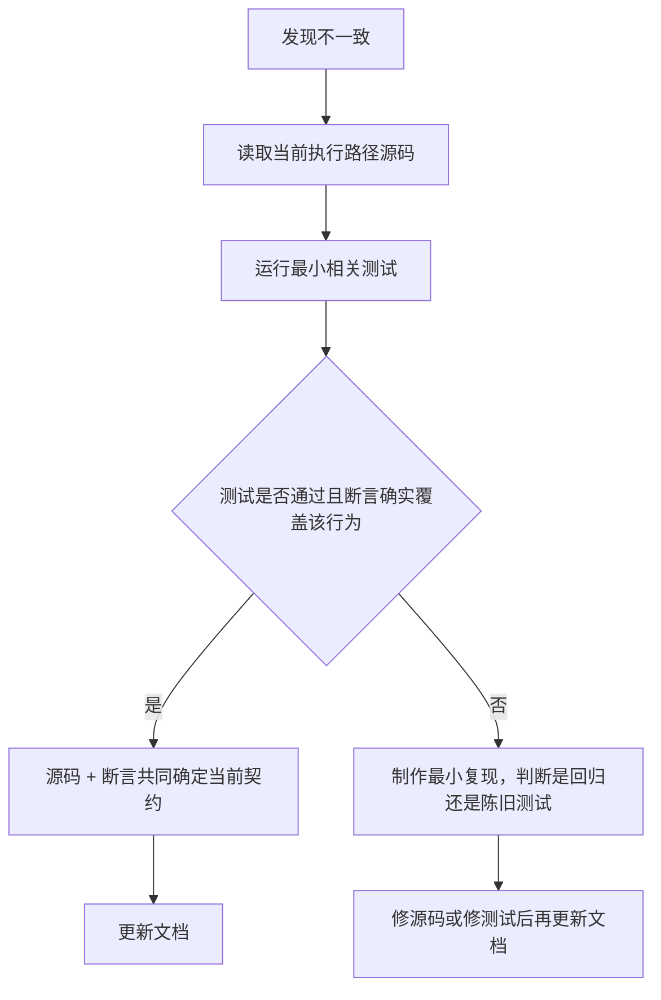
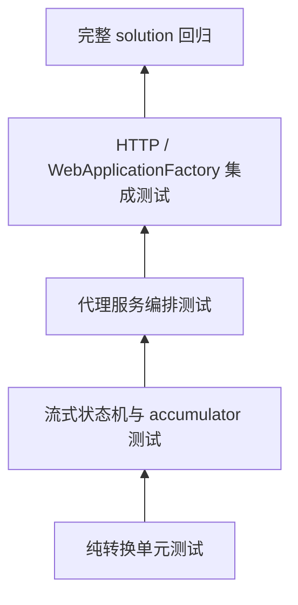
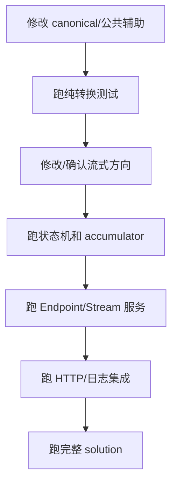

# 测试覆盖、已知边界与维护手册

## 1. 文档目的

代理转换同时涉及：协议语义、弱类型 JSON、工具历史、SSE 增量状态、路由可靠性、图片/OCR、Web Search 和日志。任何一个局部改动都可能出现“非流式正确、流式错误”或“请求正确、历史轮次错误”的情况。

本章给出：

- 当前测试分层与文件职责；
- 3×3 请求/响应和六方向流式覆盖矩阵；
- 改动类型对应的最小回归集合；
- 当前实现的明确边界和测试空白；
- 文档与代码同步维护流程。

基准提交：`5851939ad08db9465a226cc18489756ff8cd6941`。

---

## 2. 行为真值的判定顺序

当源码、测试名、注释和文档看起来不一致时，按以下顺序调查：



原则：

1. **当前执行源码**决定服务实际行为；
2. **测试断言**决定已有回归契约；
3. 测试方法名、注释和被注释掉的用例只能作为历史线索；
4. 文档必须描述当前代码，不因历史命名推断已不存在的能力；
5. 发现 bug 时先写复现测试或最小复现步骤，再修实现。

典型例子：源码明确写明本地 OCR 已移除，必须配置视觉模型；`ProxyOcrEngines.PaddleOcr` 和被注释掉的 Paddle 测试只是历史缓存/迁移痕迹，不能据此写成当前支持本地 PaddleOCR。

---

## 3. 测试技术栈和执行入口

| 项 | 当前配置 |
|---|---|
| Target Framework | `net10.0` |
| 测试框架 | xUnit 2.9.3 |
| Runner | Microsoft.NET.Test.Sdk 17.14.1 + VS runner |
| HTTP 集成 | `Microsoft.AspNetCore.Mvc.Testing` / `WebApplicationFactory` |
| 数据库集成 | 临时 SQLite 文件 + EF migrations |
| 测试项目 | `opencodex_proxy/tests/OpenCodex.Api.Tests/OpenCodex.Api.Tests.csproj` |
| Solution | `opencodex_proxy/OpenCodex.sln` |

完整执行：

```bash
DOTNET_ROOT="$HOME/.dotnet" PATH="$HOME/.dotnet:$PATH" \
dotnet test opencodex_proxy/OpenCodex.sln
```

只运行测试项目：

```bash
DOTNET_ROOT="$HOME/.dotnet" PATH="$HOME/.dotnet:$PATH" \
dotnet test opencodex_proxy/tests/OpenCodex.Api.Tests/OpenCodex.Api.Tests.csproj
```

按类过滤：

```bash
DOTNET_ROOT="$HOME/.dotnet" PATH="$HOME/.dotnet:$PATH" \
dotnet test opencodex_proxy/OpenCodex.sln \
  --filter 'FullyQualifiedName~SseStreamConverterTests'
```

组合过滤：

```bash
DOTNET_ROOT="$HOME/.dotnet" PATH="$HOME/.dotnet:$PATH" \
dotnet test opencodex_proxy/OpenCodex.sln \
  --filter 'FullyQualifiedName~ProtocolStructuralCompatibilityTests|FullyQualifiedName~ProxyCompatibilityTests'
```

---

## 4. 测试分层



| 层 | 主要特征 | 失败通常说明 |
|---|---|---|
| 纯转换 | 直接调用 `ProtocolConverter`，无网络/数据库 | 字段、内容块、工具或终态映射回归 |
| 流式状态机 | 输入内存 SSE 行，检查输出顺序与累计响应 | 增量时序、块生命周期、终止或 usage 回归 |
| 服务编排 | fake upstream/log/writer，调用 Endpoint/Stream 服务 | 路由、首字节、failover、日志上下文回归 |
| HTTP 集成 | 启动测试 API、临时 SQLite、真实 middleware/controller | 路由、认证外形、序列化、数据库和 SSE 输出组合回归 |
| 完整回归 | solution 全部测试 | 跨模块意外影响或编译问题 |

任何协议改动至少应覆盖前两层；涉及主链路时再覆盖服务编排；涉及 HTTP 外形、DI、数据库或 middleware 时增加 HTTP 集成。

---

## 5. 3×3 结构覆盖

### 5.1 请求与非流式响应

当前代码结构上支持三种同协议复制和六种跨协议 canonical 转换：

| 入口 \ 渠道 | Responses | Chat | Messages |
|---|---|---|---|
| Responses | 同协议复制；工具 schema/模型 | canonical 双向 | canonical 双向 |
| Chat | canonical 双向 | 同协议复制；工具 schema/模型 | canonical 双向 |
| Messages | canonical 双向 | canonical 双向 | 同协议复制；工具 schema/模型 |

主要测试分工：

| 测试文件 | 覆盖 |
|---|---|
| `ProtocolStructuralCompatibilityTests.cs` | 跨协议参数、结构化输出、图像、工具历史、完成原因 |
| `ProxyCompatibilityTests.cs` | 复杂工具、namespace、apply_patch、tool search、Web Search、schema 清理和上游 HTTP 基础 |
| `NativeMcpProtocolTests.cs` | MCP 定义可表示性和 Chat 拒绝 |
| `NativeMcpConfigurationTests.cs` | MCP allow-list/config 约束不被静默放宽 |
| `NativeMcpHistoryTests.cs` | MCP 历史 Responses ↔ Messages，Chat 拒绝 |
| `NativeMcpResponseTests.cs` | MCP 响应 use/result 恢复 |

### 5.2 同协议边界

同协议分支不会进入 canonical 或语义校验，因此应单独测试：

- payload 深拷贝，不修改调用方对象；
- `model` 替换为 `UpstreamModel`；
- Chat/Messages 工具 schema 清理；
- 同协议响应恢复 `OriginalModel`；
- 非法但目标 provider 可能接受的扩展字段不会被跨协议白名单删除。

当前测试对同协议工具 schema 和 model/HTTP 行为有覆盖，但没有枚举所有自定义扩展字段。

---

## 6. 六个跨协议流式方向

| 实际上游 → 下游 | 基础状态机 | 专项兼容 | 集成层 |
|---|---|---|---|
| Chat → Responses | `SseStreamConverterTests` | `InboundStreamingCompatibilityTests` | `StreamingIntegrationTests` |
| Messages → Responses | `SseStreamConverterTests` | `InboundStreamingCompatibilityTests` | `StreamingIntegrationTests` |
| Chat → Messages | `SseStreamConverterTests` | `ChatMessagesStreamingCompatibilityTests` | 主要为 converter 级 |
| Messages → Chat | `SseStreamConverterTests` | `ChatMessagesStreamingCompatibilityTests` | 主要为 converter 级 |
| Responses → Chat | `SseStreamConverterTests` | `ResponsesOutboundStreamingCompatibilityTests` | 主要为 converter/service 级 |
| Responses → Messages | `SseStreamConverterTests` | `ResponsesOutboundStreamingCompatibilityTests` | 主要为 converter/service 级 |

### 6.1 `SseStreamConverterTests.cs`

覆盖最广，包括：

- created/in-progress/complete 顺序；
- text、reasoning、refusal；
- function/custom/native tool；
- namespace 恢复；
- apply_patch delta；
- JSON Schema 文本包装；
- Chat ↔ Messages 块生命周期；
- Responses 出站两个方向；
- finish/stop reason；
- usage；
- 六方向登记。

### 6.2 `ChatMessagesStreamingCompatibilityTests.cs`

重点不是基础字段，而是容易出错的状态约束：

- 并行工具交错时，`content_block_stop` 后不能再写该块 delta；
- `include_usage=false` 不应输出 Chat usage chunk；
- error 后不能再输出正常 completion/message_stop。

### 6.3 `InboundStreamingCompatibilityTests.cs`

聚焦 Chat/Messages 上游转 Responses：

- `max_tokens` → `response.incomplete`；
- custom tool 保持 custom；
- MCP use/result → completed MCP call。

### 6.4 `ResponsesOutboundStreamingCompatibilityTests.cs`

聚焦 Responses 上游转 Chat/Messages：

- function/tool terminal reason；
- incomplete；
- failed 不发送正常结束；
- refusal 与 annotation；
- native MCP 支持/拒绝；
- apply_patch raw input；
- tool search 与已执行 Web Search。

### 6.5 `StreamingIntegrationTests.cs`

验证 converter 之外的端到端属性：

- 首个文本 delta 立即产出而非等待完整流；
- sequence 正确；
- Vision 内容不丢失；
- apply_patch freeform；
- 历史 legacy patch 工具；
- 无缺失/重复事件。

目前完整 HTTP/服务集成最强的是 Chat/Messages → Responses；其他出站方向更多依靠内存 converter 和服务测试。

---

## 7. 流式累计与捕获测试

### 7.1 协议 accumulator

| 文件 | 作用 |
|---|---|
| `ChatStreamResponseAccumulatorTests.cs` | Chat chunk 重建 message/tool/usage |
| `MessagesStreamResponseAccumulatorTests.cs` | Messages block、usage 和终态重建 |
| `StreamResponseCaptureTests.cs` | SSE 分块解析、Responses 重建、预算和终止元数据 |

### 7.2 `StreamResponseCaptureTests.cs` 的关键边界

已有测试覆盖：

- terminal response 缺 output 时从 done item 重建；
- done item 也缺时从 delta 重建；
- refusal delta 重建；
- 多行 `data:`；
- `event:` 出现在 data 后的块边界；
- malformed/interrupted；
- 首 envelope 前取消；
- output 超预算被丢弃并标 truncated；
- UTF-8 截断不切断 surrogate pair；
- 超大 pending event 丢弃到下一边界。

实现预算：

```text
完整捕获默认上限：1 MiB
集合元素上限：256
单个 pending SSE data：256 KiB
单个 pending event data 行数：1024
```

### 7.3 `ProxyStreamServiceTests.cs`

覆盖服务层：

- reasoning 计入 TTFT；
- Web Search 流模拟分支；
- 上游真实状态和 body 写日志；
- 首个上游行前不准备 SSE；
- 同协议/跨协议延迟 PrepareSse；
- 原始和下游 SSE line 来源捕获；
- 完整、部分、空流响应重建；
- 请求配置快照不进入逐行事件日志；
- Responses terminal 后上游不关闭时主动停止观察。

### 7.4 `ProxyStreamResponseWriterTests.cs`

应在修改写出器时覆盖：

- `PrepareSse` 时机；
- 响应 headers；
- TTFT 判定；
- completed 与 `[DONE]` 补全；
- cancellation/flush。

---

## 8. 路由、容量、熔断和故障转移测试

| 测试文件 | 主要覆盖 |
|---|---|
| `RouteTests.cs` | 配置 CRUD/校验、模型映射、路由 HTTP 行为 |
| `ProxyVisionRoutingTests.cs` | 模型映射、图片能力、视觉 OCR 路由、Images dialect |
| `ChannelAffinityServiceTests.cs` | sticky key 记忆与 owner 隔离 |
| `ChannelCircuitBreakerServiceTests.cs` | closed/open/half-open 和失败计数 |
| `ProxyFailoverPolicyTests.cs` | 哪些状态允许跨渠道 failover |
| `ProxyEndpointServiceTests.cs` | 排序、容量释放、sticky、熔断、流首前后 failover、attempt 日志、Responses headers |

### 8.1 `ProxyEndpointServiceTests.cs` 必须关注的分界

已有直接用例：

```text
非流式 retryable failure → 下一渠道
非流式上游 bad request → 下一渠道
本地 BadRequestException → 不 failover
流式首字节前 failure → 下一渠道
流式首字节后 failure → 不 failover
所有流候选失败 → 尚未 PrepareSse，返回 JSON
429 上游异常 → 客户端 502
open circuit → 跳过首选渠道
Responses→Responses Codex headers；跨协议不复制
```

### 8.2 两层重试测试分开

- `UpstreamStreamErrorRetryTests.cs`：同一渠道 HTTP/SSE client retry；
- `ProxyEndpointServiceTests.cs`：单渠道最终失败后 route failover。

不要用一个 mock call count 同时推断两层：

```text
总上游 HTTP 次数
= 各 route attempt 内部的 retry_count + 1 之和
```

---

## 9. 上游 HTTP、headers 与流首错误

### 9.1 `ProxyCompatibilityTests.cs`

除转换外还覆盖：

- `/models` 数组根规范化；
- `baseurl` `/v1` 与尾斜杠语义；
- 三协议默认 User-Agent。

### 9.2 `NativeMcpHeaderTests.cs`

覆盖 Messages payload 含 `mcp_servers` 时：

- 自动加入 `mcp-client-2025-11-20`；
- 普通请求不加入；
- 与已有 beta 合并；
- 去重。

### 9.3 `UpstreamStreamErrorRetryTests.cs`

覆盖 HTTP 200 + SSE body error：

- `rate_limit_error` 重试后成功；
- 重试耗尽抛 429；
- 正常流不被 probe 吞行；
- `overloaded_error` 重试；
- `invalid_request_error` 不重试、透明传递；
- 非流式 200 error body 识别。

`UpstreamRetryBackoffTests` 覆盖了 `Retry-After` delta、30 秒上限、`Retry-After: 0` 兜到最小间隔、指数退避序列，以及流式网络错误和可重试状态的退避。仍未覆盖 `Retry-After` 的 HTTP-date 格式和流式每次尝试超时路径的退避。

---

## 10. 图片、OCR 与 Images API 测试

### 10.1 文本协议图片与 OCR

| 文件 | 覆盖 |
|---|---|
| `ProxyImageFallbackTests.cs` | 三协议用户图片重写、非用户/工具图片占位、Vision OCR、OCR 子日志、无视觉模型错误 |
| `ProxyVisionRoutingTests.cs` | 图片检测、主模型保持、同渠道/后续渠道视觉模型选择 |

当前真实行为：

```text
请求含图片
AND 主路由不支持图片
AND 命中显式模型映射
→ 必须找到已配置视觉模型执行 OCR
```

本地 OCR 已移除。`ProxyImageFallbackTests.cs` 中 Paddle 相关大段代码被注释，不能视为可执行覆盖。

### 10.2 独立 Images API

| 文件 | 覆盖 |
|---|---|
| `ImagesCoreContractTests.cs` | Core 接口/DTO 契约 |
| `ImagesControllerTests.cs` | generation/edit 控制器输入输出 |
| `ImageEditRequestReaderTests.cs` | multipart 编辑请求读取 |
| `ImagesUpstreamClientTests.cs` | 上游 dialect、multipart/JSON、headers |

当前 HEAD 可见控制器、接口和上游客户端，但文档审查未定位到 `IProxyImagesEndpointService` 的具体实现注册。测试中的 fake/contract 覆盖不等同于生产 DI 路径已有完整实现；维护时应单独验证应用启动后的真实 Images endpoint。

---

## 11. Web Search 测试

`ProxyCompatibilityTests.cs` 中主要覆盖：

- disabled 模式只移除 Web Search；
- Chat/Messages continuation 在最终答案前移除 required tool choice；
- 多轮重复搜索后最终答案；
- Chat 与 Messages 两类上游；
- 搜索轮次间保留 native tool search；
- namespace/deep namespace 工具保留；
- 长工具链顺序。

建议新增或修改 Web Search 行为时同时覆盖：

1. `simulate/convert/disabled`；
2. superadmin 与普通用户；
3. `max_tool_calls=0/1/缺失/非法`；
4. Tavily key 不可用、参数非法和搜索失败；
5. 流式/非流式；
6. 最终轮不再强制 Web Search；
7. 原有非搜索工具不丢失。

当前测试主要使用 fake 搜索/上游，不验证 Tavily 真实网络、限流和供应商响应漂移。

---

## 12. 日志、脱敏与诊断测试

### 12.1 `ProxyLogServiceTests.cs`

覆盖：

- MCP 嵌套 Authorization/token；
- data image 与 `b64_json`；
- error response 图片；
- 深拷贝不修改客户端对象；
- 长 base64；
- byte[]/Stream；
- stream timings；
- queued → processing → complete 和 stream lines。

### 12.2 `ChannelDiagnosticsLogTests.cs`

覆盖：

- 草稿渠道 secrets 不落日志/不进诊断 SSE；
- `channel_test.completed` 内容与顺序；
- Chat/Messages 客户端输出转 Responses；
- 日志保存转换前完整上游响应；
- config error/upstream error 的 SSE 和真实日志状态。

### 12.3 尚需注意

逐行 `RequestLogStreamLine.RawLine` 当前由选择性事件捕获器直接持久化，没有经过 `ImageLogSanitizer.CopyAndSanitize`。现有测试覆盖“过滤哪些事件”，但未直接覆盖 raw SSE delta 中的 token、data URI 或其他敏感内容脱敏。

此外，完整响应捕获有 1 MiB 预算，逐行 capture list 当前没有同等的总字节/条数预算；超长高频输出可能造成较大的日志集合。若调整，应先添加压力和脱敏回归用例。

---

## 13. 改动类型 → 最小测试集合

| 改动 | 最小必跑 |
|---|---|
| 请求顶层字段/参数白名单 | `ProtocolStructuralCompatibilityTests` + 相关 `ProxyCompatibilityTests` |
| 内容块/图片/文件 | 上述两类 + `StreamingIntegrationTests` + 图片测试 |
| 工具定义/历史/namespace | `ProxyCompatibilityTests` + `SseStreamConverterTests` |
| Native MCP | 全部 `NativeMcp*Tests` + inbound/outbound streaming |
| finish reason/status | `ProtocolStructuralCompatibilityTests` + `SseStreamConverterTests` + 两个专项 streaming 文件 |
| usage/cache | `SseStreamConverterTests` + accumulator + `ProxyLogServiceTests` + model pricing tests |
| SSE parser/accumulator | `StreamResponseCaptureTests` + accumulator + `ProxyStreamServiceTests` |
| PrepareSse/首字节 | `ProxyStreamResponseWriterTests` + `ProxyStreamServiceTests` + `ProxyEndpointServiceTests` |
| route/failover | `ProxyEndpointServiceTests` + failover/circuit/affinity + Route tests |
| 上游 retry/header/url | `ProxyCompatibilityTests` + `NativeMcpHeaderTests` + `UpstreamStreamErrorRetryTests` |
| OCR | `ProxyImageFallbackTests` + `ProxyVisionRoutingTests` +日志测试 |
| Web Search | `ProxyCompatibilityTests` 中 WebSearch 系列 + stream service |
| 日志/脱敏 | `ProxyLogServiceTests` + `ChannelDiagnosticsLogTests` |
| HTTP error outer shape | WebApplicationFactory 集成 + middleware/endpoint 相关测试 |

完成局部集合后仍应运行完整 solution，防止工具/usage 等共享 canonical 逻辑影响其他方向。

---

## 14. 新增字段的测试模板

假设新增语义字段 `X`：

```text
1. 每个合法源协议构造最小请求
2. 对每个目标协议调用 ConvertRequest
3. 断言 X 的目标字段、值和类型
4. 断言源 payload 未被修改
5. 构造目标协议完整响应
6. ConvertResponse 回入口协议
7. 断言 OriginalModel、finish reason 和 usage 不受影响
8. 为六个相关流向加入增量事件
9. 断言首增量即时产出、终态完整且 accumulator 正确
10. 加一条不可表示目标的显式拒绝测试
```

推荐不要只断言序列化字符串包含某片段；结构测试优先解析成字典/JSON，分别断言字段存在、类型和值。

---

## 15. 新增工具类型的测试模板

至少构造：

1. 工具定义；
2. tool choice；
3. 单轮 tool call；
4. tool result；
5. 多轮历史；
6. 两个工具并行/交错；
7. 非流式响应；
8. 流式 call start、参数 delta、done、terminal；
9. Responses request mapping 恢复；
10. 不可表示目标明确抛错。

矩阵：

| 项 | Responses | Chat | Messages |
|---|---:|---:|---:|
| definition | 必测 | 必测 | 必测 |
| choice | 必测 | 必测 | 必测 |
| history call/result | 必测 | 必测 | 必测 |
| non-stream response | 必测 | 必测 | 必测 |
| stream delta | 必测 | 必测 | 必测 |
| namespace/mapping | 按类型 | 按类型 | 按类型 |

apply_patch、tool_search、Web Search 和 MCP 的既有测试可以作为复杂工具范例。

---

## 16. 流式状态机测试断言清单

不要只检查“最终包含文本”。至少断言：

### 16.1 顺序

```text
created/start
< item/block added
< delta
< delta done / block stop
< item done
< terminal
< [DONE]（协议适用时）
```

### 16.2 唯一性

- role/start 只发一次；
- item/block index 不重复；
- terminal 不重复；
- error 后没有正常终态；
- tool done 后没有后续 delta。

### 16.3 实时性

使用可控异步输入：第一 delta 到达后，在未结束源流前就应观察到对应下游事件。否则可能发生意外缓冲。

### 16.4 完整响应

同时断言 `ConvertedStreamResult.UpstreamResponse`：

- 协议 envelope；
- text/reasoning/refusal；
- tool arguments；
- finish reason；
- usage；
- model。

### 16.5 错误

- 首事件前异常；
- 已写 delta 后异常；
- 协议 error event；
- EOF 无 terminal；
- malformed JSON；
- cancellation。

---

## 17. 当前实现边界清单

### 17.1 协议与参数

1. 同协议请求跳过跨协议语义校验和参数白名单；
2. 跨协议只保留目标 allow-list 字段；
3. Messages 目标默认 `max_tokens=4096`；
4. Responses/Chat → Messages 的非流式 reasoning/annotation 表达弱于流式方向；
5. provider file id 不被视为跨 provider 通用；
6. Responses native/remote MCP 到 Chat 明确拒绝；
7. custom freeform tool 到 Chat 需要完整缓冲/JSON 包装，delta 时序不完全等价；
8. Messages cache write/read 进入通用 response canonical 后合并。

### 17.2 上游 HTTP

1. 非标准 API 根是否补 `/v1` 取决于尾斜杠；
2. 流首重试只探测第一条有效 JSON `data:`；后续 error 不回滚已开始流；
3. 只有 429/500/502/503/504 自动 HTTP 重试；
4. `Retry-After` 最多等待 30 秒；
5. `retry_count=N` 表示总尝试 `N+1`；
6. Responses 同协议入口头会补带测试占位语义的默认 attestation/session/thread 值；
7. Messages 当前在 `auth_mode=none` 且 `apikey` 非空时仍会写 `x-api-key`，与 Chat/Responses 不对称；
8. 渠道显式 header 优先于 Responses 入口透传，但自动认证可能覆盖同名 Authorization/x-api-key。

### 17.3 流式

1. 只有下游未写字节时可 route failover；
2. 同协议透传和跨协议转换的 TTFT 判定函数不同；
3. 完整响应 capture 有预算，超限带 `_opencodex_capture.truncated=true`；
4. 原始逐行日志不受同一 capture budget 约束；
5. malformed/取消/意外 EOF 会生成捕获元数据，不等于协议成功；
6. Responses terminal 后即使上游 socket 不关闭，捕获层可停止。

### 17.4 特殊链路

1. Web Search 模拟只适用于 Responses 入口、Chat/Messages 渠道、superadmin、声明工具且模式 simulate；
2. OCR 只处理用户图片；助手/工具图片写占位符；
3. OCR 必须有视觉模型，本地 OCR 已移除；
4. `PaddleOcr` 名称仅用于历史缓存兼容；
5. 独立 Images API 不经过三协议 canonical；
6. 当前 HEAD 的 Images endpoint 生产服务注册需要单独核验。

### 17.5 日志和错误

1. UpstreamException 对普通客户端统一 HTTP 502；
2. attempt 日志保留真实上游状态；
3. 敏感 JSON key 和 data image 会脱敏；
4. 自定义秘密 key、URL query secret 和普通文本内 token 不会被通用扫描；
5. raw SSE line 当前未走通用 sanitizer；
6. 渠道诊断 HTTP 流通常为 200，真实错误状态在 SSE 和日志内；
7. 渠道诊断保存转换前完整响应，但当前不保存逐行 table。

---

## 18. 当前直接测试不足的边界

以下是维护时优先补充的用例，不代表当前行为一定有错误：

| 边界 | 建议测试 |
|---|---|
| `Retry-After` delta/date/上限 | fake handler + 可注入 delay/clock，避免真实等待 |
| timeout 后重试与调用方取消区别 | 分别触发 linked timeout 和 caller token |
| Messages `auth_mode=none` + apikey | 明确断言期望 x-api-key 语义 |
| Responses 默认 attestation/session 值 | 断言是否应为生产值、缺失或动态值 |
| 第二条及之后 SSE error | 证明不重试且如何下游表现 |
| raw SSE secret/image | 日志脱敏测试 |
| raw SSE 总量上限 | 大量小 delta 压力测试 |
| Responses/Chat → Messages 非流 reasoning | 与流式结果对照契约测试 |
| Responses → Messages 非流 citation | 与流式 citation 对照 |
| 真实生产 DI 的 Images endpoint | WebApplicationFactory 不替换服务的启动/请求测试 |
| Redis 多实例容量/亲和 | 容器化 Redis 并发测试 |
| 熔断半开竞争 | 并发 probe 测试 |
| Tavily 真实响应漂移 | 可选 contract fixture，而非默认联网测试 |
| baseurl 含 query/fragment/大小写 `/V1` | URL 拼接边界用例 |
| 超大工具 schema/深嵌套 JSON | 性能和最大深度测试 |
| 多 choice Chat 响应 | 明确只取 choice 0 的契约测试 |

---

## 19. 维护流程

### 19.1 修改前

1. 从用户可观察行为写一句目标；
2. 标出入口协议、渠道协议、流/非流；
3. 判断是字段、工具、状态机、路由还是日志问题；
4. 找到现有最接近测试；
5. 若是 bug，先让新测试在旧代码上失败；
6. 列出可能影响的其他五个方向。

### 19.2 修改中



### 19.3 修改后

必须记录：

- 本次改变的用户可见行为；
- 修改的协议方向；
- 新增/更新的测试；
- 测试命令与结果；
- 仍未覆盖的边界；
- 是否更新字段索引、流程图和测试矩阵。

---

## 20. 文档同步规则

| 代码改变 | 至少更新的文档 |
|---|---|
| 协议支持方向 | `02-foundation/01-protocol-support-matrix.md`、流式文档 |
| canonical 字段 | `02-foundation/02-canonical-data-model.md`、本字段索引 |
| 参数校验/compat | `04-request-conversion/02-parameter-validation-and-compat.md` |
| 内容块 | `04-request-conversion/03-content-multimodal-and-instructions.md` |
| 工具 | `05-tools/` 全部相关章节 + 本索引 |
| 非流式响应 | `06-response-conversion/` |
| SSE 事件 | `07-streaming/02-six-cross-protocol-state-machines.md` + 本索引 |
| capture/TTFT | `07-streaming/03-accumulators-capture-termination-and-ttft.md` |
| OCR/Web Search/header | `08-special-flows/` 对应章节 |
| 错误/日志 | `09-reference/01-errors-logging-and-diagnostics.md` |
| 测试新增/边界变化 | 本文 |

文档 Mermaid 图若改变节点含义，应同步修改相邻判断表，避免图和文字描述两套逻辑。

---

## 21. 文档静态检查

### 21.1 文件数量和空文档

```bash
find doc/proxy-conversion -type f -name '*.md' | sort
find doc/proxy-conversion -type f -name '*.md' -empty
```

### 21.2 Markdown 相对链接

建议用脚本提取 `](relative/path.md)`，以源文档目录为基准解析并检查存在性。忽略：

- `http://` / `https://`；
- `#anchor`；
- 图片 data URI。

### 21.3 围栏

检查每个文件三反引号数量为偶数；Mermaid 块必须闭合。仅计数不能验证 Mermaid 语法，因此复杂图仍需人工查看节点引号、括号和箭头。

### 21.4 源码引用

文档中的路径应使用仓库相对形式，且目标存在。最终用户回复引用本地文件时使用绝对路径。

### 21.5 禁止残留

```bash
rg -n 'TODO|TBD|待补|占位|placeholder' doc/proxy-conversion
rg -n '/Users/|/home/' doc/proxy-conversion
```

源码历史事实中的 `TODO` 可被解释性引用，但文档自身不能留下未完成占位。

---

## 22. 发布前总检查清单

### 22.1 结构

- [ ] README 导航能到达全部章节；
- [ ] 文件数符合规划；
- [ ] 无空文件；
- [ ] 相对链接全部存在；
- [ ] Mermaid/代码围栏闭合。

### 22.2 术语

- [ ] 入口协议 = 客户端/下游协议；
- [ ] 渠道协议 = 上游协议；
- [ ] 请求方向和响应方向没有写反；
- [ ] `OriginalModel` 与 `UpstreamModel` 分开；
- [ ] HTTP retry 与 route failover 分开；
- [ ] OCR 与独立 Images API 分开。

### 22.3 行为

- [ ] 同协议与跨协议分支分别说明；
- [ ] 非流式和流式差异已标注；
- [ ] tool call/result 和历史均覆盖；
- [ ] finish reason、usage、error 均覆盖；
- [ ] 首字节前后 failover 边界明确；
- [ ] 日志脱敏边界明确。

### 22.4 验证

- [ ] 相关最小测试通过；
- [ ] 完整 `dotnet test` 通过，或已记录与本次文档无关的既有失败；
- [ ] `git diff --check` 通过；
- [ ] 只修改约定的 `doc/` 目录。

---

## 23. 测试文件快速索引

| 类别 | 文件 |
|---|---|
| 结构转换 | `ProtocolStructuralCompatibilityTests.cs` |
| 综合转换/工具/Web Search | `ProxyCompatibilityTests.cs` |
| 六方向 SSE | `SseStreamConverterTests.cs` |
| Chat ↔ Messages 专项 | `ChatMessagesStreamingCompatibilityTests.cs` |
| 入站到 Responses 专项 | `InboundStreamingCompatibilityTests.cs` |
| Responses 出站专项 | `ResponsesOutboundStreamingCompatibilityTests.cs` |
| 流式集成 | `StreamingIntegrationTests.cs` |
| 流服务 | `ProxyStreamServiceTests.cs` |
| capture | `StreamResponseCaptureTests.cs` |
| Endpoint/路由尝试 | `ProxyEndpointServiceTests.cs` |
| failover policy | `ProxyFailoverPolicyTests.cs` |
| route/config | `RouteTests.cs` |
| affinity/circuit | `ChannelAffinityServiceTests.cs`、`ChannelCircuitBreakerServiceTests.cs` |
| 图片/OCR | `ProxyImageFallbackTests.cs`、`ProxyVisionRoutingTests.cs` |
| Images API | `ImagesControllerTests.cs`、`ImagesCoreContractTests.cs`、`ImagesUpstreamClientTests.cs`、`ImageEditRequestReaderTests.cs` |
| Native MCP | `NativeMcpConfigurationTests.cs`、`NativeMcpHeaderTests.cs`、`NativeMcpHistoryTests.cs`、`NativeMcpProtocolTests.cs`、`NativeMcpResponseTests.cs` |
| 上游流首重试 | `UpstreamStreamErrorRetryTests.cs` |
| 日志 | `ProxyLogServiceTests.cs` |
| 渠道诊断 | `ChannelDiagnosticsLogTests.cs` |
| 观测/费用 | `ObservabilityServiceTests.cs`、`ModelCatalogServiceTests.cs`、`ModelPricingServiceTests.cs` |

测试文件完整根：

```text
opencodex_proxy/tests/OpenCodex.Api.Tests/
```

---

## 24. 相关文档

- [协议支持矩阵](../02-foundation/01-protocol-support-matrix.md)
- [规范化数据模型](../02-foundation/02-canonical-data-model.md)
- [入口鉴权与请求状态](../02-foundation/03-entry-auth-and-request-state.md)
- [六个跨协议流式状态机](../07-streaming/02-six-cross-protocol-state-machines.md)
- [累积、捕获、终止与 TTFT](../07-streaming/03-accumulators-capture-termination-and-ttft.md)
- [错误、日志与诊断](./01-errors-logging-and-diagnostics.md)
- [字段、事件映射与源码索引](./02-field-event-mapping-and-code-index.md)
