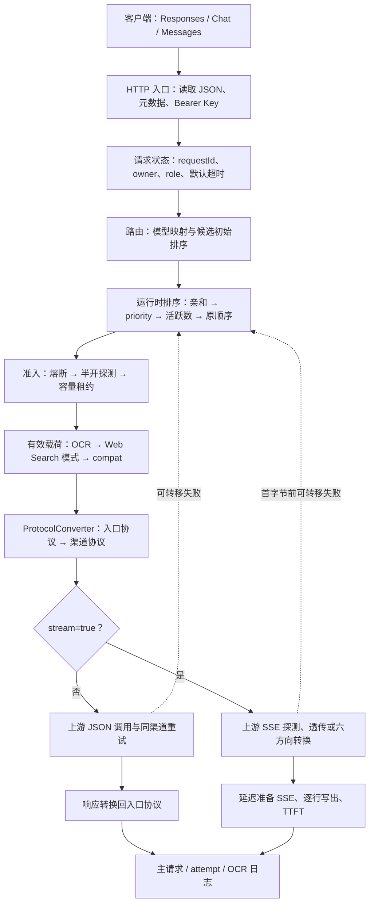

# OpenCodex 代理转换文档

> 文档基准提交：`5851939ad08db9465a226cc18489756ff8cd6941`
> 适用代码：`opencodex_proxy/` 中 Responses、Chat Completions、Messages 三协议代理主链路及其路由、流式、工具、图片 OCR 降级、Web Search 和日志配套逻辑。

## 1. 文档目标

这套文档不是只罗列字段映射，而是从源码可验证的判断顺序出发，完整回答：

1. 客户端请求从哪个端点进入，如何认证和形成请求状态；
2. 请求模型如何映射到渠道与上游模型；
3. 亲和、优先级、负载、容量和熔断如何共同决定候选顺序；
4. 原始载荷经过哪些重写后才进入协议转换；
5. Responses、Chat Completions、Messages 如何经规范化中间结构互转；
6. 工具声明、工具调用、工具结果、原生工具和 MCP 历史如何保持关联；
7. 非流式响应如何恢复客户端协议、可见模型、Reasoning、Usage 和结束原因；
8. 六种跨协议 SSE 转换如何维护事件序号、内容块索引和累积状态；
9. 图片输入、OCR 降级、Web Search 模式和特殊请求头何时介入；
10. 同渠道重试、跨渠道故障转移、超时、错误隐藏与日志如何配合；
11. 哪些行为已有测试固定，哪些边界仍缺少直接覆盖。

## 2. 一页总览



## 3. 文档目录

### 3.1 总览

| 文档 | 重点 |
|---|---|
| [01-overview/01-system-boundary-and-terms.md](01-overview/01-system-boundary-and-terms.md) | 系统边界、三协议方向、原始/有效/上游载荷、模型、流式、重试和日志术语 |
| [01-overview/02-architecture-and-end-to-end-flow.md](01-overview/02-architecture-and-end-to-end-flow.md) | 分层架构、组件关系、`ProxyEndpointService` 判断顺序、非流式/流式端到端流程 |

### 3.2 协议基础

| 文档 | 重点 |
|---|---|
| [02-foundation/01-protocol-support-matrix.md](02-foundation/01-protocol-support-matrix.md) | 3×3 请求、响应与流式支持矩阵；六个跨协议方向和三个同协议方向 |
| [02-foundation/02-canonical-data-model.md](02-foundation/02-canonical-data-model.md) | 请求/响应规范化中间结构、消息、内容、工具、Usage、Reasoning 的内部形态 |
| [02-foundation/03-entry-auth-and-request-state.md](02-foundation/03-entry-auth-and-request-state.md) | HTTP 入口、JSON 解析、Bearer Key、两级缓存、owner 隔离、请求元数据和生命周期状态 |

### 3.3 路由与可靠性

| 文档 | 重点 |
|---|---|
| [03-routing/01-route-selection-and-model-mapping.md](03-routing/01-route-selection-and-model-mapping.md) | owner 渠道读取、模型精确匹配、上游模型、图片能力、初始/最终候选排序、OCR 路由 |
| [03-routing/02-affinity-capacity-and-circuit-breaker.md](03-routing/02-affinity-capacity-and-circuit-breaker.md) | sticky 亲和、Redis/内存容量租约、熔断状态机、半开探测及降级语义 |
| [03-routing/03-failover-retry-and-timeout.md](03-routing/03-failover-retry-and-timeout.md) | 单渠道重试、Retry-After、SSE 首事件探测、跨渠道故障转移、首字节边界和超时 |

### 3.4 请求转换

| 文档 | 重点 |
|---|---|
| [04-request-conversion/01-request-conversion-main-flow.md](04-request-conversion/01-request-conversion-main-flow.md) | `ConvertRequest` 总流程、同协议与跨协议分支、规范化和目标协议生成 |
| [04-request-conversion/02-parameter-validation-and-compat.md](04-request-conversion/02-parameter-validation-and-compat.md) | 参数保留、重命名、删除、默认/强制值、不等价语义拒绝和渠道 compat |
| [04-request-conversion/03-content-multimodal-and-instructions.md](04-request-conversion/03-content-multimodal-and-instructions.md) | system/developer/instructions、文本、图片、文件、内容块与 Plan Mode 标签 |

### 3.5 工具转换

| 文档 | 重点 |
|---|---|
| [05-tools/01-tool-contract-name-and-schema.md](05-tools/01-tool-contract-name-and-schema.md) | 工具契约规范化、命名空间展开/恢复、Schema 清洗、tool_choice |
| [05-tools/02-apply-patch-native-and-custom-tools.md](05-tools/02-apply-patch-native-and-custom-tools.md) | `apply_patch` 的 function/custom/freeform/grammar 兼容、增量参数与结果 |
| [05-tools/03-web-search-mcp-and-tool-history.md](05-tools/03-web-search-mcp-and-tool-history.md) | Web Search、MCP、tool_search、调用结果配对、历史修复与缺失输出补偿 |

### 3.6 非流式响应转换

| 文档 | 重点 |
|---|---|
| [06-response-conversion/01-response-conversion-main-flow.md](06-response-conversion/01-response-conversion-main-flow.md) | `ConvertResponse` 总流程、同协议模型恢复、规范化响应到入口协议 |
| [06-response-conversion/02-content-and-tool-result-mapping.md](06-response-conversion/02-content-and-tool-result-mapping.md) | 文本/拒绝/注解内容、工具调用与结果、原生工具输出映射 |
| [06-response-conversion/03-reasoning-finish-usage-and-json-schema.md](06-response-conversion/03-reasoning-finish-usage-and-json-schema.md) | Reasoning、finish reason、Usage/缓存 Token、JSON Schema 文本包装 |

### 3.7 流式转换

| 文档 | 重点 |
|---|---|
| [07-streaming/01-stream-pipeline-and-sse-parsing.md](07-streaming/01-stream-pipeline-and-sse-parsing.md) | 上游流启动、SSE 解析、延迟写出、透传捕获、事件日志与 TTFT |
| [07-streaming/02-six-cross-protocol-state-machines.md](07-streaming/02-six-cross-protocol-state-machines.md) | Responses↔Chat、Responses↔Messages、Chat↔Messages 六个转换状态机 |
| [07-streaming/03-accumulators-capture-termination-and-ttft.md](07-streaming/03-accumulators-capture-termination-and-ttft.md) | 三类响应累积器、终止检测、incomplete/error、捕获摘要和时序指标 |

### 3.8 特殊链路

| 文档 | 重点 |
|---|---|
| [08-special-flows/01-image-detection-ocr-fallback-and-images-boundary.md](08-special-flows/01-image-detection-ocr-fallback-and-images-boundary.md) | 三协议图片检测、OCR 重写、视觉路由、缓存及独立 Images API 边界 |
| [08-special-flows/02-web-search-modes-and-simulation.md](08-special-flows/02-web-search-modes-and-simulation.md) | `disabled` / `convert` / `simulate` 模式、工具循环、继续请求、流式模拟与限制 |
| [08-special-flows/03-header-forwarding-and-upstream-request.md](08-special-flows/03-header-forwarding-and-upstream-request.md) | Responses Codex 头、渠道自定义头、上游认证、User-Agent、URL 拼接与 MCP beta 头 |

### 3.9 参考与维护

| 文档 | 重点 |
|---|---|
| [09-reference/01-errors-logging-and-diagnostics.md](09-reference/01-errors-logging-and-diagnostics.md) | 异常类型、客户端状态、主/attempt/OCR 日志、脱敏、流式行与诊断 |
| [09-reference/02-field-event-mapping-and-code-index.md](09-reference/02-field-event-mapping-and-code-index.md) | 字段与事件速查、源码类型/方法索引、协议方向定位 |
| [09-reference/03-test-coverage-known-boundaries-and-maintenance.md](09-reference/03-test-coverage-known-boundaries-and-maintenance.md) | 测试覆盖矩阵、已知边界、回归建议和文档维护检查单 |

## 4. 推荐阅读顺序

### 4.1 第一次理解整个系统

1. [系统边界与术语](01-overview/01-system-boundary-and-terms.md)
2. [架构与端到端流程](01-overview/02-architecture-and-end-to-end-flow.md)
3. [协议支持矩阵](02-foundation/01-protocol-support-matrix.md)
4. [规范化数据模型](02-foundation/02-canonical-data-model.md)
5. [路由选择与模型映射](03-routing/01-route-selection-and-model-mapping.md)
6. [请求转换主流程](04-request-conversion/01-request-conversion-main-flow.md)
7. [响应转换主流程](06-response-conversion/01-response-conversion-main-flow.md)
8. [流式管线与 SSE 解析](07-streaming/01-stream-pipeline-and-sse-parsing.md)

### 4.2 排查“为什么请求走了这个渠道”

1. [入口认证与请求状态](02-foundation/03-entry-auth-and-request-state.md)
2. [路由选择与模型映射](03-routing/01-route-selection-and-model-mapping.md)
3. [亲和、容量与熔断](03-routing/02-affinity-capacity-and-circuit-breaker.md)
4. [故障转移、重试与超时](03-routing/03-failover-retry-and-timeout.md)
5. [错误、日志与诊断](09-reference/01-errors-logging-and-diagnostics.md)

### 4.3 排查“为什么字段或工具丢失/改变”

1. [规范化数据模型](02-foundation/02-canonical-data-model.md)
2. [请求转换主流程](04-request-conversion/01-request-conversion-main-flow.md)
3. [参数校验与兼容](04-request-conversion/02-parameter-validation-and-compat.md)
4. [内容、多模态与指令](04-request-conversion/03-content-multimodal-and-instructions.md)
5. [工具契约、名称与 Schema](05-tools/01-tool-contract-name-and-schema.md)
6. [Web Search、MCP 与工具历史](05-tools/03-web-search-mcp-and-tool-history.md)
7. [字段、事件与源码索引](09-reference/02-field-event-mapping-and-code-index.md)

### 4.4 排查流式兼容问题

1. [流式管线与 SSE 解析](07-streaming/01-stream-pipeline-and-sse-parsing.md)
2. [六种跨协议状态机](07-streaming/02-six-cross-protocol-state-machines.md)
3. [累积器、终止与 TTFT](07-streaming/03-accumulators-capture-termination-and-ttft.md)
4. [Reasoning、结束原因与 Usage](06-response-conversion/03-reasoning-finish-usage-and-json-schema.md)
5. [故障转移、重试与超时](03-routing/03-failover-retry-and-timeout.md)
6. [测试覆盖与已知边界](09-reference/03-test-coverage-known-boundaries-and-maintenance.md)

### 4.5 排查图片或搜索特殊行为

- 图片：先读[图片检测、OCR 降级与 Images 边界](08-special-flows/01-image-detection-ocr-fallback-and-images-boundary.md)，再读[内容、多模态与指令](04-request-conversion/03-content-multimodal-and-instructions.md)。
- Web Search：先读[Web Search 模式与模拟](08-special-flows/02-web-search-modes-and-simulation.md)，再读[Web Search、MCP 与工具历史](05-tools/03-web-search-mcp-and-tool-history.md)。
- 请求头/认证：读[Header 转发与上游请求](08-special-flows/03-header-forwarding-and-upstream-request.md)。

## 5. 文档约定

### 5.1 协议方向

本套文档把方向写成：

```text
入口协议 → 上游渠道协议
```

例如“Responses→Messages”表示：客户端调用 Responses，OpenCodex 将请求转换成 Messages 发给上游，再把 Messages 响应转换回 Responses。

### 5.2 路径与源码定位

- 源码路径一律相对仓库根目录，例如 `opencodex_proxy/src/Libraries/OpenCodex.Core/Protocols/ProtocolConverter.cs`；
- 优先引用类型和方法名，不依赖易漂移行号；
- 测试锚点写成 `测试文件.测试方法`；
- 文档中的“当前实现”均指顶部基准提交。

### 5.3 松类型对象

代理转换大量使用：

```csharp
Dictionary<string, object?>
List<object?>
```

文档中的 `payload["field"]` 指松类型字典字段，不表示存在同名强类型属性。运行时类型判断（例如“必须严格为 bool true”或“只接受 int”）会明确写出。

### 5.4 三层请求载荷

| 文档名称 | 常见代码名 | 定义 |
|---|---|---|
| 原始载荷 | `payload`、`OriginalPayload` | 客户端 JSON 解析结果 |
| 有效载荷 | `effectivePayload`、`Payload` | OCR、Web Search 和渠道 compat 处理后的请求 |
| 上游请求 | `upstreamRequest`、`UpstreamRequest` | 替换上游模型并转换成渠道协议后的请求 |

### 5.5 模型名称

- **请求模型/对外模型**：客户端发送的 `model`；
- **上游模型**：渠道映射的 `upstream_model`；
- **客户端可见模型**：响应转换后应恢复的对外模型。

### 5.6 流式术语

- **首字节前**：`TrackingProxyStreamWriter.HasWritten=false`；
- **首字节后**：至少一行已交给下游写入器；
- **TTFT**：协议感知的首个有效内容/推理/工具增量时间，不等同第一条非空 SSE 行；
- **透传**：协议相同，但仍可能进行模型恢复、请求 Schema 清洗和响应捕获，并不总是逐字节完全不处理。

### 5.7 Mermaid 约定

- 含标点、括号、斜线或较长中文的节点标签使用引号；
- 主流程图描述跨模块顺序；
- 细节流程图聚焦单个复杂判断；
- 状态机使用 `stateDiagram-v2`；
- 图中的简化不得覆盖正文决策表中的精确条件。

### 5.8 事实、边界与建议

每篇文档尽量区分：

- **当前事实**：可以由当前源码或测试直接验证；
- **边界/潜在问题**：由当前实现直接推导的限制；
- **维护建议**：修改该区域时需要同步验证的事项。

不会把未来设想写成已实现能力。

## 6. 关键入口速查

| 目标 | 首选源码入口 |
|---|---|
| 找 HTTP 路由 | `opencodex_proxy/src/Presentation/OpenCodex.Api/Controllers/ProxyController.cs` |
| 找整条请求编排 | `opencodex_proxy/src/Libraries/OpenCodex.Core/Services/Proxy/ProxyEndpointService.cs` |
| 找模型路由 | `opencodex_proxy/src/Libraries/OpenCodex.Core/Services/Proxy/ProxyRouteService.cs` |
| 找请求/响应转换分派 | `opencodex_proxy/src/Libraries/OpenCodex.Core/Protocols/ProtocolConverter.cs` |
| 找请求规范化 | `opencodex_proxy/src/Libraries/OpenCodex.Core/Protocols/ProtocolConverter.Requests.cs` |
| 找响应规范化 | `opencodex_proxy/src/Libraries/OpenCodex.Core/Protocols/ProtocolConverter.Responses.cs` |
| 找六种流式方向 | `opencodex_proxy/src/Libraries/OpenCodex.Core/Protocols/SseStreamConverter*.cs` |
| 找上游重试/超时 | `opencodex_proxy/src/Libraries/OpenCodex.Core/ExternalIntegrations/HttpUpstreamClient*.cs` |
| 找图片 OCR 降级 | `opencodex_proxy/src/Libraries/OpenCodex.Core/Services/Proxy/ProxyImageFallbackService.cs` |
| 找 Web Search 模拟 | `opencodex_proxy/src/Libraries/OpenCodex.Core/Services/WebSearch/WebSearchSimulator*.cs` |
| 找日志 | `opencodex_proxy/src/Libraries/OpenCodex.Core/Services/Proxy/ProxyLogService.cs` |

## 7. 支持范围摘要

### 7.1 三协议转换

| 客户端入口 \ 上游渠道 | Responses | Chat | Messages |
|---|---:|---:|---:|
| Responses | 同协议 | 跨协议 | 跨协议 |
| Chat | 跨协议 | 同协议 | 跨协议 |
| Messages | 跨协议 | 跨协议 | 同协议 |

请求和非流式响应覆盖全部 3×3 组合；当前 `SupportsStreamingConversion` 也显式放行三个同协议方向和六个跨协议方向。具体语义限制以[协议支持矩阵](02-foundation/01-protocol-support-matrix.md)为准。

### 7.2 不在三协议矩阵内

- 独立图片生成 `/images/generations`；
- 独立图片编辑 `/images/edits`；
- 模型列表 `/models`；
- 管理后台 API；
- Tavily 搜索 API 本身。

其中 OCR 和 Web Search 会作为特殊子流程嵌入三协议主链路，因此仍有专题文档。

## 8. 重要的当前实现边界

1. 任一启用渠道存在对象型模型映射后，所有主请求都必须显式命中映射；无映射回退不再逐渠道生效。
2. `prompt_cache_key` 亲和优先于渠道 priority，但不会绕过熔断或容量。
3. Redis 提供容量硬限制时，最少连接排序使用的活跃数仍是本实例近似值。
4. 主端点把渠道熔断时长 0 解释为禁用熔断，不自动采用服务默认 60 秒。
5. `retry_count=N` 表示每个候选最多发送 `N+1` 次 HTTP 请求。
6. 流式渠道超时主要约束收到响应头之前，不覆盖整个 SSE 生命周期。
7. HTTP 200 JSON body 的 rate-limit error 不做同渠道重试；首个 SSE data 中同类错误会做同渠道重试。
8. 流式首行写出后不再故障转移，也不能改写为 JSON 错误。
9. 上游错误对客户端统一为 HTTP 502 与泛化消息；原状态和 body 只进入日志与内部策略。
10. 同协议请求/响应仍会深拷贝、替换/恢复模型并执行必要清洗，不等于绝对原样透传。

## 9. 测试入口

主要测试项目：

```text
opencodex_proxy/tests/OpenCodex.Api.Tests/OpenCodex.Api.Tests.csproj
```

按主题优先查看：

| 主题 | 测试文件 |
|---|---|
| 主编排、容量、亲和、熔断、故障转移 | `ProxyEndpointServiceTests.cs` |
| 路由与图片能力 | `ProxyVisionRoutingTests.cs` |
| 熔断状态机 | `ChannelCircuitBreakerServiceTests.cs` |
| 亲和 TTL | `ChannelAffinityServiceTests.cs` |
| 故障转移状态集合 | `ProxyFailoverPolicyTests.cs` |
| SSE 首事件重试 | `UpstreamStreamErrorRetryTests.cs` |
| 协议结构转换 | `ProtocolStructuralCompatibilityTests.cs` |
| 复杂工具与 Web Search | `ProxyCompatibilityTests.cs` |
| SSE 核心转换 | `SseStreamConverterTests.cs` |
| 三组跨协议流式专项 | `InboundStreamingCompatibilityTests.cs`、`ResponsesOutboundStreamingCompatibilityTests.cs`、`ChatMessagesStreamingCompatibilityTests.cs` |
| 流服务、捕获和日志 | `ProxyStreamServiceTests.cs`、`StreamResponseCaptureTests.cs` |

完整覆盖矩阵见[测试覆盖、已知边界与维护](09-reference/03-test-coverage-known-boundaries-and-maintenance.md)。

## 10. 更新本文档时的最低要求

当代理转换源码发生变化时：

1. 记录新的基准提交；
2. 先更新对应专题文档的源码入口、判断表和流程图；
3. 更新[字段、事件与源码索引](09-reference/02-field-event-mapping-and-code-index.md)；
4. 更新[测试覆盖、已知边界与维护](09-reference/03-test-coverage-known-boundaries-and-maintenance.md)；
5. 检查 README 导航中的文件与相对链接；
6. 对新增协议方向同时核对请求、非流式响应、流式、工具、Reasoning、Usage 和错误事件；
7. 对可靠性策略修改同时核对同渠道重试、故障转移和熔断三个状态集合；
8. 运行相关 .NET 测试，避免只凭代码阅读更新文档。
