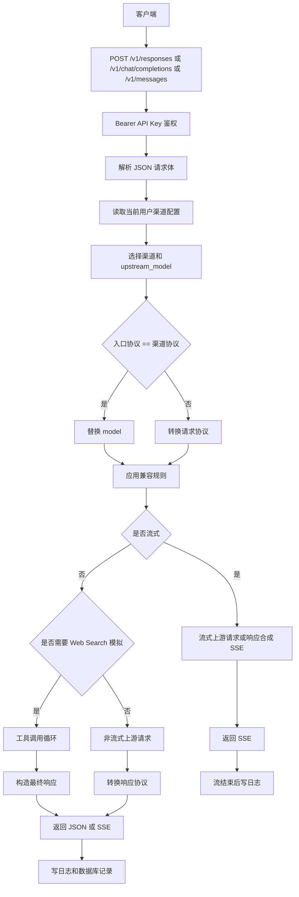
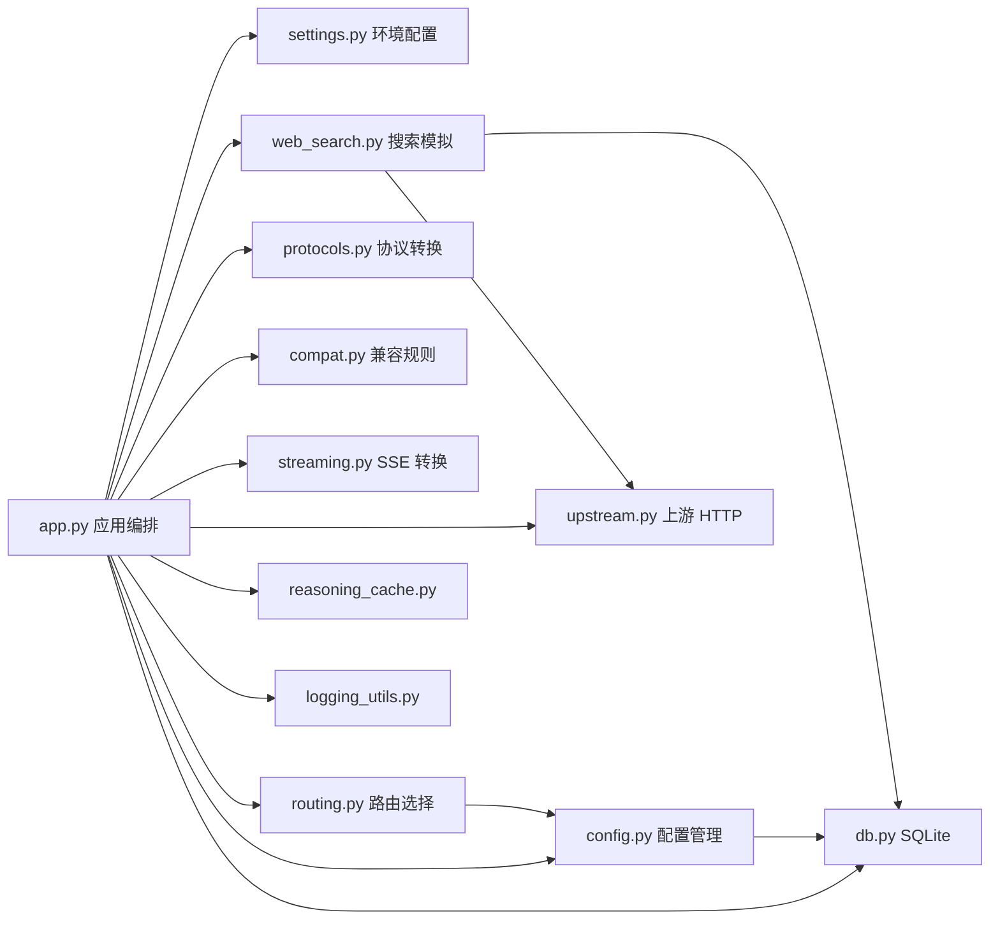

# 系统流程图与交互

## 3.1 核心流程总览

## 3.2 模块间交互

## 3.3 数据流说明

### 管理配置数据流

1. 管理员登录 `/admin`。
2. 前端调用 `/admin/api/config` 读取渠道配置。
3. 后端根据用户角色返回全部渠道或当前用户渠道。
4. 保存配置时，后端校验结构、字段类型、渠道 ID、模型映射和 compat 配置。
5. 合法配置写入 `channels` 表。
6. `ConfigManager.reload` 重新读取数据库并刷新内存缓存。

### 代理请求数据流

1. 客户端使用访问 API Key 调用代理入口。
2. 后端认证 Key，确定用户和 API Key ID。
3. 请求体被脱敏后保存到日志上下文。
4. 后端选择用户自己的启用渠道。
5. 请求转换到渠道协议，模型名转换为 `upstream_model`。
6. 应用 compat 规则。
7. 发起上游请求或上游流式请求。
8. 上游响应转换回入口协议。
9. 统计 Token、费用、状态码、耗时和 TTFT。
10. 元数据写入 `request_logs`，大字段写入 `request_log_details`。

### Web Search 数据流

1. Responses 请求声明 `web_search` 工具。
2. 代理确认当前用户是超级管理员且 Web Search 已启用。
3. 上游模型先返回工具调用。
4. 代理解析工具调用中的 `query`。
5. 从 `tavily_keys` 预留可用 Key，并递增使用次数。
6. 调用 Tavily 搜索接口。
7. 将搜索结果包装为工具结果追加到上游请求。
8. 上游继续生成最终回答。
9. 代理将搜索调用变成 Responses `web_search_call` 输出项，并追加来源 annotation。

### 日志和统计数据流

1. 请求完成后生成日志记录。
2. `AsyncDBWriter` 异步写入 SQLite。
3. 管理台日志列表读取 `request_logs` 元数据。
4. 日志详情读取 `request_log_details`。
5. 统计接口按时间桶聚合 `request_logs`。

## 关键边界

- 普通用户只能读取和使用自己的渠道，不能使用超级管理员渠道作为 fallback。
- 代理访问 Key 和上游 API Key 是两类 Key，代理不会把客户端 Bearer Key 透传给上游。
- Web Search 模拟当前只对超级管理员开放。
- Reasoning 缓存是内存态，重启后不会保留。
- 流式响应开始后发生的错误无法重新改写 HTTP 状态码，只能在日志中记录。

