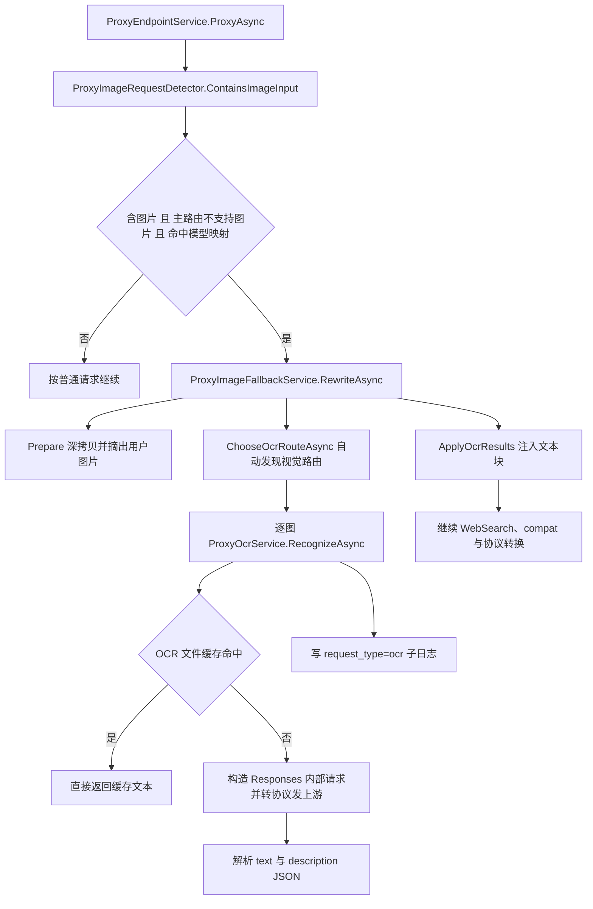
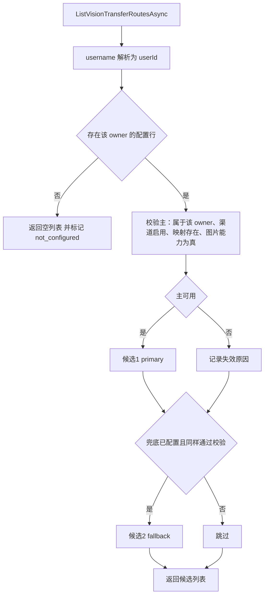

# 纯文本模型图片输入：视觉转移模型（按 owner 配置主 + 兜底）

> 状态：方案 v3，全部决策已确认，可直接开工
> 已定决策：按 owner 各配一份；**完全移除自动发现**（含历史代码）；兜底必须手动配置且**可留空**；主调用失败时重试兜底；`supports_image=false` 拒绝保存；**普通 user 有自助入口**（菜单放开，页面内把全局项与 per-owner 项分开）；相邻死代码随 U2 一并清掉
> 影响面：路由解析、OCR 降级执行、系统设置 API 与权限模型、管理台菜单裁剪与系统设置页、数据库（双 provider 迁移）

## 1. 背景

### 1.1 这条链路解决什么问题

客户端把图片发给一个**不支持图片输入的文本模型**时，代理不会直接失败，而是先用一个**视觉模型**把图片转成文字（OCR 文本 + 图片描述），再把纯文本请求发给原来的文本渠道。这就是"图片识别转移模型"。

它与 `/images/generations`、`/images/edits`（渠道类型 `images`）是两条完全独立的链路，本文只讨论前者。

### 1.2 触发条件（当前实现，三条同时成立）

```text
requestContainsImages == true
AND route.SupportsImage == false
AND route.MatchedModelMapping == true
```

见 `ProxyEndpointService.ProxyAsync` 第 107 行与第 202-216 行。

### 1.3 现在的痛点

视觉模型不是配出来的，是**算出来的**：`ChooseOcrRouteAsync` 在运行时按"同渠道优先、全局最优"扫描所有启用渠道，用 `priority → position → channel id` 排序挑第一个"标记为支持图片"的模型映射。由此产生五个具体问题：

| 问题 | 具体后果 |
|---|---|
| 不可预测 | 新增渠道、调整 `priority`/`position`、导入模型能力元数据，都会静默改变实际使用的视觉模型 |
| 成本不可控 | 无法指定"用便宜快的视觉模型做 OCR"，可能选中最贵的旗舰视觉模型 |
| 能力元数据强耦合 | `supports_image` 未在 catalog 标注时视觉路由为 null，主请求直接 400 |
| 单点无兜底 | 选中的视觉渠道上游报错、超时或返回非法 JSON 时 OCR 抛 502，**整个主请求失败**，没有第二次机会 |
| 租户维度受限 | 视觉路由只在**请求发起者自己的渠道**里找；普通 user 没有视觉渠道就必然 400 |

## 2. 已有实现

### 2.1 调用链



### 2.2 关键代码位置

| 职责 | 文件 | 要点 |
|---|---|---|
| 图片检测 | `Services/Proxy/ProxyImageRequestDetector.cs` | 只认标准块：Responses `input_image`、Chat `image_url`、Messages `image` |
| 降级编排 | `Services/Proxy/ProxyImageFallbackService.cs` | 解析一次视觉路由，逐图串行 OCR，任一失败即中止 |
| 视觉路由发现 | `Services/Proxy/ProxyRouteService.cs` 第 111-137 行 | `ChooseOcrRouteAsync`：同渠道最优、跨渠道最优、null |
| 能力判定 | `Services/ModelCatalogService.cs` 第 789 行 | `SupportsImage(channelId, upstreamModel, legacyMappingValue)`，读 `ChannelModelInfo` 与全局 `ModelInfo` 的 `capabilities.supports_image` |
| OCR 执行 | `Services/Proxy/ProxyOcrService.cs` | 缓存、视觉子请求、JSON 解析、写 `request_type=ocr` 日志；`VisionRoute == null` 时抛 400 |
| 载荷重写 | `Services/Proxy/ProxyImagePayloadRewriter.cs` | 只处理 `role=user` 图片，其余替换为占位文本 |

运行时细节：OCR 子请求走 `IUpstreamClient.PostJsonAsync`，**超时取视觉渠道自己的 `timeout_seconds`**（缺失才用全局默认）；该路径**完全绕过熔断、容量与亲和**，这三者只作用于主请求候选循环。

### 2.3 OCR 缓存与日志

- 缓存文件 `<OcrCacheDir>/results/<sha256>.json`；key 只由**图片内容字节**（data URL）或 **URL 字符串**决定，**不含渠道、模型、owner**。
- 日志：每张图一条 `request_type=ocr`，`path=/internal/ocr/vision`，带 `parent_request_id`、`engine`、`cache_hit`；图片正文经 `ImageLogSanitizer` 脱敏。
- 失败**不进缓存**，所以重试不会被缓存挡住（4.4 的失败记忆因此是必需的）。

### 2.4 系统设置页现状

| 项 | 现状 |
|---|---|
| 接口 | `GET/PUT /system-settings`，`RequireSuperadmin` |
| 字段 | `access_mode`、`bind_host`、`port`、`intercept_probe_requests` |
| 存储 | `DesktopSystemSettingsStore` 写 JSON 文件 `desktop-settings.json`（cwd 或 `OPENCODEX_DESKTOP_SETTINGS_PATH`） |
| 前端 | `frontend/src/SystemSettings.vue`；菜单项 `system-settings` 是 `superadminOnly: true`；非 Tauri 运行时只显示"拦截探测请求" |

顺带确认的既有缺陷（不属于本需求）：服务器 compose 只挂载 `./logs:/app/logs`，而设置文件写在 `/app/desktop-settings.json`，属于容器层。每次 `update_remote_image.sh` 重建容器，`intercept_probe_requests` 都会回落默认值。**所以新配置不能存进这个文件。**

### 2.5 本次必须删除的历史代码

| 位置 | 删除内容 |
|---|---|
| `ProxyRouteService` | `ChooseOcrRouteAsync` 旧实现、`FindImageRouteInChannel`、`FindImageRoute` |
| `IProxyRouteService` | `ChooseOcrRouteAsync` 签名（替换为 `ListVisionTransferRoutesAsync`） |
| `ProxyVisionRoutingTests` | `ChooseOcrRoute_ImageInput_UsesSameChannelVisionModelFirst`、`ChooseOcrRoute_ImageInput_FallsBackToLaterChannelVisionModel`、`ChooseOcrRoute_ImageInput_ReturnsNullWhenNoVisionModelExists` 三个自动发现测试 |
| 三处测试替身 | `ProxyControllerTests`、`ProxyEndpointServiceTests`、`ImagesCoreContractTests` 中的 `ChooseOcrRouteAsync` 实现 |
| 文档 | `doc/proxy-conversion` 与 `prd` 中"同渠道优先、全局最优"的描述 |

### 2.6 顺带扫出的相邻死代码（已确认随 U2b 一并清掉）

1. `requestContainsImages` 从 `ProxyEndpointService` 一路传到 `ProxyRouteService.ListRouteCandidatesAsync`，**方法体从未读取它**；4 个重载加接口默认实现都在传这个参数。
2. `IProxyRouteService.ChooseRouteAsync`（两个重载）与带 `allowedChannelTypes` 的 `ListRouteCandidatesAsync`：**生产代码零调用**，只有测试在用。
3. `IProxyRouteService.ListModelsAsync`：生产代码零调用，`/models` 走的是 `ListModelCapabilitiesAsync`。
4. `MappingSupportsImage` 的 `legacyMappingValue` 分支：`ConfigNormalizer` 已把模型映射规范成只剩 `model` 与 `upstream_model`，`supports_image` 永远读不到，该分支恒为 false。

这四项与本需求同处一个调用面，不清理的话新代码会继续沿着死参数往下传。清理后的接口最终形态见 4.3。

## 3. 已确认的行为语义

| 编号 | 决策点 | 结论 |
|---|---|---|
| D1 | 配置作用域 | **按 owner 各一份**：配置行以 `OwnerUserId` 唯一；主与兜底渠道必须属于该 owner。跨 owner 借用渠道密钥的问题因此不存在 |
| D2 | 解析顺序 | 主 → 兜底 → 失败。**自动发现连同历史代码一起删除** |
| D3 | 兜底来源 | 只能手动配置，不做任何推导；允许留空，留空即"主失败则请求失败" |
| D4 | 兜底触发 | ①主不可用：渠道被删或禁用、模型映射被删、模型图片能力被撤销、渠道已不属于该 owner；②主执行失败：上游非 2xx、超时、响应非法 JSON |
| D5 | 能力校验 | 保存时 `supports_image` 必须为 `true`，否则 400 拒绝 |
| D6 | 自环保护 | **不需要额外代码**：触发 OCR 的前提是主文本路由 `SupportsImage == false`，而 D5 保证配置项能力为 true，两者按同一 `(channelId, upstreamModel)` 判定，结构上不可能是同一个路由 |
| D7 | 存储 | 数据库 per-owner 单行，保存即生效，不需重启 |
| D8 | 总开关 | 不引入布尔开关；没有配置行即未启用 |
| D9 | 未配置的行为 | 400，且文案区分"未配置"与"配置已失效（附失效原因）" |
| D10 | 运行时 owner 取值 | 取 **access key 的 owner**（`accessKey.OwnerUsername`），不是登录管理台的用户 |
| D11 | 管理入口 | 普通 user 可自助配置**自己那一份**；superadmin 可代任意 owner 配置。系统设置页对所有登录用户可见，页面内分成"全局设置"（superadmin 独占）与"我的图片识别转移模型"（per-owner）两块 |
| D12 | 越权规则 | 非 superadmin 提交的 `owner_username` 一律**忽略并强制改写为自己**，不返回他人配置也不写他人配置；`candidates` 同样只在自己名下的渠道里取 |
| D13 | 并发写 | `OwnerUserId` 唯一索引兜住并发；服务层先查后写，捕获唯一约束冲突后重读一次再写，仍冲突返回 409 |

### 3.1 明确不做

- 不改主请求的路由与失败转移逻辑；
- 不放宽 `route.MatchedModelMapping` 这一触发条件（渠道完全没有模型映射时，图片仍原样直传上游）；
- 不改图片检测规则与三协议注入格式；
- 不恢复本地 OCR；
- 不动 `/images/generations`、`/images/edits`。

## 4. 实现方案

### 4.1 数据契约

新表 `VisionTransferSettings`（按 AGENTS.md 用 `class`，不用 `record`）：

| 列 | 类型 | 说明 |
|---|---|---|
| `Id` | Guid | 主键 |
| `OwnerUserId` | Guid | **唯一索引**，一个 owner 最多一行 |
| `PrimaryChannelId` | Guid | 非空 |
| `PrimaryModel` | string | 非空，取渠道 `models[].model` 的对外名 |
| `FallbackChannelId` | Guid? | 可空 |
| `FallbackModel` | string | 与 `FallbackChannelId` 同时为空或同时非空 |
| `CreatedAt` / `UpdatedAt` | double | Unix 秒，与现有设置表一致 |

两条不变式：**有行必有主**（主必填）；**清除配置就是删除整行**。

`ConfigValidator` 已禁止同一渠道内重复的 `model` 映射，所以 `(channelId, model)` 能唯一定位一条映射，`upstream_model` 由它推出，不入库。

设置服务契约（`CoreBase/Services`，实现在 `Core/Services`）：

```csharp
public interface IVisionTransferSettingsService
{
    ApiOpResult<VisionTransferSettingsResponse> Read(string? ownerUsername);

    ApiOpResult<VisionTransferCandidateListResponse> ListCandidates(string? ownerUsername);

    ApiOpResult<VisionTransferSettingsResponse> Save(VisionTransferSettingsUpdateRequest request);

    ApiOpResult Delete(string? ownerUsername);

    VisionTransferSettingsSnapshot? GetSnapshot(Guid ownerUserId);
}
```

前四个方法给管理端用，内部按 `CurrentScope()` 收敛 owner（D12）；`GetSnapshot` 给运行时路由用，不看登录态，只按 `OwnerUserId` 读一行。

### 4.2 接口契约

四个端点，与桌面文件设置解耦，权限用 `RequireUser()` 加 owner 归属收敛（沿用 `ConfigService.CurrentScope()` 那套 `(currentUsername, isSuperadmin)` 模式）。`owner_username` 缺省为当前登录用户；非 superadmin 传别人也会被强制改写成自己。

```text
GET    /system-settings/vision-transfer?owner_username=alice
GET    /system-settings/vision-transfer/candidates?owner_username=alice
PUT    /system-settings/vision-transfer
DELETE /system-settings/vision-transfer?owner_username=alice
```

权限矩阵：

| 端点 | 普通 user | superadmin |
|---|---|---|
| `GET /system-settings`（全局项） | 403（保持 `RequireSuperadmin`） | 可读写 |
| `PUT /system-settings`（全局项） | 403 | 可读写 |
| `GET/PUT/DELETE /system-settings/vision-transfer` | 仅自己那一份，`owner_username` 被强制改写为自己 | 任意 owner |
| `GET /system-settings/vision-transfer/candidates` | 只列自己名下渠道 | 指定 owner 名下渠道 |

注意 `SystemSettingsController` 目前是"整个类都 `RequireSuperadmin`"的写法，改造时要逐方法声明权限，别把新端点顺手也锁成 superadmin。

`candidates` 是关键一环：由后端列出该 owner 下**所有 `supports_image=true` 且渠道启用**的 `(渠道, 模型)` 组合，前端下拉直接用它。这样保存校验与界面可选项共用同一份判定，避免前后端各判一次导致漂移。

```jsonc
// GET /system-settings/vision-transfer?owner_username=alice
{
  "owner_username": "alice",
  "configured": true,
  "primary": {
    "channel_id": "5f0e...", "channel_name": "openrouter", "channel_type": "chat",
    "model": "qwen-vl-plus", "upstream_model": "qwen/qwen-vl-plus",
    "available": true, "reason": ""
  },
  "fallback": {
    "channel_id": "9a11...", "channel_name": "openai-main", "channel_type": "responses",
    "model": "gpt-4o-mini", "upstream_model": "gpt-4o-mini",
    "available": false, "reason": "channel_disabled"
  },
  "updated_at": 1774000000
}

// GET /system-settings/vision-transfer/candidates?owner_username=alice
{
  "owner_username": "alice",
  "candidates": [
    { "channel_id": "5f0e...", "channel_name": "openrouter", "channel_type": "chat",
      "model": "qwen-vl-plus", "upstream_model": "qwen/qwen-vl-plus" }
  ]
}

// PUT /system-settings/vision-transfer
{
  "owner_username": "alice",
  "primary": { "channel_id": "5f0e...", "model": "qwen-vl-plus" },
  "fallback": { "channel_id": "9a11...", "model": "gpt-4o-mini" }
}
```

`reason` 取值：`channel_deleted`、`channel_disabled`、`channel_owner_changed`、`model_mapping_missing`、`image_capability_revoked`。

保存校验（全部 400，除注明）：

| 情况 | 结果 |
|---|---|
| `owner_username` 指向的用户不存在 | 404 |
| 主的 `channel_id` 与 `model` 只给其一 | 400 |
| 兜底的 `channel_id` 与 `model` 只给其一 | 400 |
| 渠道不存在 | 400 |
| 渠道不属于目标 owner | 400 |
| 渠道当前 `enabled=false` | 400（保持严格：不允许把已知不可用的东西写进配置） |
| 该渠道 `models` 中没有此 `model`（trim 后精确匹配） | 400 |
| 该模型 `supports_image != true` | 400，文案引导先去"模型信息"标注图片能力 |
| 兜底与主完全相同 | 400 |

### 4.3 运行时解析

`IProxyRouteService.ChooseOcrRouteAsync` 删除，改为 `ListVisionTransferRoutesAsync(ownerUsername)` 返回**有序候选（0 到 2 个）**：

U2 完成后 `IProxyRouteService` 的最终形态（连带 2.6 的死代码一起收敛，只剩三个方法、零死参数）：

```csharp
public interface IProxyRouteService
{
    Task<IReadOnlyList<ProxyRouteDto>> ListRouteCandidatesAsync(string ownerUsername, string? model);

    Task<VisionTransferRoutesDto> ListVisionTransferRoutesAsync(string ownerUsername);

    Task<IReadOnlyList<ProxyModelCapabilityDto>> ListModelCapabilitiesAsync(string ownerUsername);
}
```

`VisionTransferRoutesDto` 同时带回候选与失效信息，避免调用方再查一次：

```csharp
public sealed class VisionTransferRoutesDto
{
    public bool Configured { get; }

    public IReadOnlyList<ProxyRouteDto> Candidates { get; }

    public string UnavailableReason { get; }
}
```

注意 `ListVisionTransferRoutesAsync` 不再需要 `requestModel` 参数：配置是 per-owner 的，与请求模型无关；D6 已经论证自环不可能，所以也不需要拿请求模型做排除。

读取路径的实现说明：`ProxyRouteService` 已经注入了 `IRepository<User>`，可以直接把 `ownerUsername` 解析成 `OwnerUserId`（`LoadChannelSet` 里已有同样的查询）；配置行按唯一索引单行读取，**不加缓存**，与 `WebSearchSimulator.CurrentMode()` 的做法一致——OCR 路径本身要发上游请求，一次单行查询的开销可以忽略，换来的是"保存即生效、无需跨实例失效"。渠道集合仍走现有的 `CacheKeys.RouteChannels(owner)` 缓存（60 秒 TTL），所以刚改完渠道最多有 60 秒的可用性判定滞后，这一点与主路由的现有行为一致。



错误语义：

| 情形 | 结果 |
|---|---|
| 无配置行 | 400 `vision transfer model is not configured for owner '<owner>'` |
| 有配置行但主与兜底都失效 | 400 `configured vision transfer route is unavailable: <reason>` |
| 候选存在但全部执行失败 | 502，保留最后一次上游错误体，两次尝试各留一条 OCR 日志 |

为了让上面两种 400 的文案不同，`ProxyOcrContext` 需要新增一个 `UnavailableReason` 字段：候选为空时，`ProxyImageFallbackService` 仍以 `VisionRoute = null` 加上 reason 调一次 `RecognizeAsync`，保留失败日志与可诊断文案。`ProxyOcrService` 里现有的 `VisionRoute == null` 分支据此改写，不再输出 `OCR requires a configured vision model.`。

### 4.4 兜底重试的作用域（最容易漏的一点）

主请求本身有失败转移循环，**每换一个主候选渠道就会重新调用一次 `RewriteAsync`**。如果"哪个视觉路由已经失败"只是 `RewriteAsync` 内的局部变量，主请求换渠道重试时会再撞一次那个坏的视觉渠道；而 OCR 失败不写缓存，所以缓存挡不住。

做法：在 `ProxyEndpointService` 请求入口创建一个请求级 `HashSet<string>`（key 为 `channelId + "/" + upstreamModel`），通过 `ProxyImageFallbackContext` 传给 `ProxyImageFallbackService`，同一请求内共享。

重试规则：

- `UpstreamException`（非 2xx、超时、非法 JSON）→ 记入失败集合，换下一个候选；
- `BadRequestException`（配置类）→ 不重试，直接上抛；
- `OperationCanceledException`（客户端断开）→ 不重试；
- 多图时按图片编号串行，每张图都从"未失败的第一个候选"开始。

日志：`ocr_details` 增加 `route_kind`（`primary` / `fallback`）与 `attempt`，让兜底是否生效在日志里可见。

### 4.5 引用完整性与失效判定

| 事件 | 处理 |
|---|---|
| 删除渠道 | 同一操作内清理引用：主被删则删除整行；兜底被删则清空兜底两列 |
| 删除用户 | 删除该 owner 的配置行（`UserService.DeleteUser` 已级联删渠道与 apikey，这里补一处） |
| 渠道禁用 | 不动配置；读接口 `available=false`、`reason=channel_disabled`；运行时落兜底 |
| 渠道 `models` 删掉被引用的 model | 同上，`reason=model_mapping_missing` |
| 撤销模型图片能力 | 同上，`reason=image_capability_revoked` |

原则：**保存时严格拒绝，运行时宽容降级**。配置写入那一刻必须完全可用，之后被外部改动破坏则落兜底并在界面标红。

### 4.6 OCR 缓存 key（本次一并做）

现在 key 只含图片内容，换视觉模型或走兜底都会读到旧模型的结果。改为把候选身份并入 key：`sha256(image bytes | url) + channelId + upstreamModel`。代价是换配置后旧缓存整体失效，图片 OCR 的缓存命中率本就不高，可以接受。

### 4.7 任务拆分（每单元可独立编译并测试）

| 单元 | 目标 | 涉及文件 | 风险 |
|---|---|---|---|
| U1 | 数据与设置服务 | `Domain/VisionTransferSettings.cs`、`OpenCodexDbContextBase.cs`、SQLite 与 Postgres 迁移各一份、`CoreBase/DTOs/SystemSettings/*`、`CoreBase/Services/IVisionTransferSettingsService.cs`、`Core/Services/VisionTransferSettingsService.cs`、DI 注册 | 中：双 provider 迁移；per-owner 唯一约束下的 upsert |
| U2a | 路由改造并删除自动发现 | `IProxyRouteService.cs`、`ProxyRouteService.cs`、三个测试替身、`ProxyVisionRoutingTests` | 中：接口签名变更；删除后未配置的 owner 立刻 400（破坏性） |
| U2b | 清理 2.6 的相邻死代码（紧接 U2a，单独提交） | 同 U2a 加 `ProxyEndpointService.cs` 与相关测试 | 中：一次改掉 4 个公共签名，只改一轮测试替身 |
| U3 | 兜底执行与请求级失败记忆 | `ProxyImageFallbackService.cs`、`ProxyImageFallbackModels.cs`、`ProxyOcrService.cs`、`ProxyEndpointService.cs` | 中：重试放大上游调用；400 与 502 语义不能串 |
| U4 | 管理端 API 与权限拆分 | `SystemSettingsController.cs`（逐方法权限）、DTO、`frontend/src/api/systemSettings.js` | 中：越权收敛（D12）是安全边界，必须有测试 |
| U5 | 引用完整性 | `ConfigService.DeleteChannelAsync`、`UserService.DeleteUser` | 低：注意与现有级联删除同一事务 |
| U6 | 管理台菜单与 UI | `frontend/src/App.vue`（菜单裁剪与 `is-superadmin` 透传）、`frontend/src/SystemSettings.vue`、新增 `frontend/src/visionTransferState.js` 与同名 `.test.js` | 中：菜单放开后普通 user 会看到系统设置页，页面内必须严格分区 |
| U7 | OCR 缓存 key 并入路由身份 | `ProxyOcrService.cs` | 低 |

把死代码清理并进 U2 的理由：U2a 与原 U8 改的是同一批文件和同一批测试替身，分成两次做等于把签名和替身改两轮，收益为零。

### 4.7.1 系统设置页的分区与菜单

`App.vue` 的 `menuItems` 里 `system-settings` 去掉 `superadminOnly`，并像 `Channels`、`Logs` 那样把 `:is-superadmin="isSuperadmin"` 传进 `SystemSettings.vue`。页面自上而下分成两个区：

| 区块 | 可见性 | 内容 |
|---|---|---|
| 全局设置 | 仅 superadmin | 访问范围、后端端口（仅 Tauri）、拦截探测请求、监听地址与管理台地址等只读信息 |
| 图片识别转移模型 | 所有登录用户 | 主渠道与主模型（必填）、兜底渠道与兜底模型（可留空）、失效提示、独立保存与清除按钮 |

加载策略很关键：普通 user **不能**去请求 `GET /system-settings`，那个端点仍是 403，页面必须按角色决定发哪些请求，否则一进页面就弹错误。两个区各自独立保存，互不影响。

per-owner 区的细节：

- owner 选择器**只对 superadmin 显示**，数据取 `GET /users/options`（现有端点，`RequireUser`）；普通 user 不显示选择器，标题直接写"我的图片识别转移模型"；
- 选择器旁标注"这里选的是 access key 的所属用户"，避免把配置挂到错误的人身上（D10）；
- 两组「渠道 + 模型」级联选择，选项全部来自 `candidates`，不自己拼能力数据；
- 兜底留空时给出"主失败即请求失败"的提示条；
- 失效项标红并显示 `reason` 文案；
- `candidates` 为空时直接提示"该用户名下没有已启用且标注支持图片的模型"，superadmin 引导去"模型信息"或"渠道"页，普通 user 引导去"渠道"页并提示联系管理员标注能力；
- 纯逻辑（草稿归一化、可用性判断、提示文案、角色可见性）抽到 `visionTransferState.js`，用 `node:test` 单测，与 `modelCatalogImportState.js` 同一套路。

### 4.8 升级与上线（这是破坏性变更）

移除自动发现之后，**未配置的 owner 一旦发来带图请求就直接 400**。这次不做自动迁移：迁移脚本要填出"旧算法会选谁"，就必须把旧算法留下来，与"不留死代码"冲突。

补偿手段放在前端：`candidates` 列表按"与该 owner 的文本渠道同渠道优先"排序并给出建议标记，让人工一次配对。这是界面提示，后端不保留任何发现算法。

上线顺序：

1. staging 先跑一遍迁移与配置流程，确认两个 provider 的 `dotnet ef migrations list` 无 pending；
2. 统计生产上有图片流量的 owner（可用日志按 `request_type=ocr` 反查）；
3. 发布新镜像；
4. **立刻**为这些 owner 配置主与兜底；
5. 用一次带图请求验证，日志里应能看到 `route_kind=primary`。

另外这次会让**普通 user 第一次看到"系统设置"菜单**。发布说明里要写清楚：他们在那里只能配置自己的图片识别转移模型，全局的监听与探测拦截设置仍然只有 superadmin 能看能改。

### 4.9 实现后需同步的文档

- `doc/proxy-conversion/08-special-flows/01-image-detection-ocr-fallback-and-images-boundary.md` 第 6、7 节；
- `doc/proxy-conversion/03-routing/01-route-selection-and-model-mapping.md` 的 `ChooseOcrRouteAsync` 段；
- `prd/09-tools-multimodal-and-special-flows.md` 7.2、7.3；
- `prd/07-routing-and-reliability.md` 的图片 OCR 路由行。

## 5. 测试计划

设置服务（U1、U4）：

1. 首次保存插入行，二次保存复用同一行且 `UpdatedAt` 前进；`OwnerUserId` 唯一约束生效。
2. 主只给一半、兜底只给一半、渠道不存在、渠道不属于该 owner、渠道被禁用、映射不存在、主与兜底相同 → 全部 400。
3. `supports_image != true` → 400，且错误文案包含能力标注引导。
4. `owner_username` 指向不存在的用户 → 404。
5. `DELETE` 后 `configured=false`，运行时回到"未配置"400 分支。
6. `candidates` 只返回该 owner、已启用渠道、`supports_image=true` 的组合；跨 owner 的渠道不出现。

路由解析（U2）：

7. 配好主之后，即使同渠道存在"更优"的其他视觉映射，也必须选中配置的主。
8. 主渠道被禁用 → 落兜底；主与兜底都失效 → 空候选 + `reason`。
9. 无配置行 → 空候选 + `not_configured`。
10. owner A 的配置不会被 owner B 的请求使用（per-owner 隔离）。
11. 配置引用了另一个 owner 的渠道（历史数据或渠道换主）→ 视为失效，不使用。
12. 自动发现彻底不存在：删掉所有配置后，即便渠道里明明有视觉模型也不会被选中。

OCR 兜底执行（U3）：

13. 主上游 502 → 兜底成功，主请求正常完成，两条 OCR 日志的 `route_kind` 分别为 `primary` 与 `fallback`。
14. 主与兜底都失败 → 主请求 502，最后一次上游错误体保留。
15. 未配置兜底且主失败 → 主请求 502，只有一条 OCR 日志。
16. 多图：第 1 张主失败后，第 2 张直接从兜底开始。
17. 主请求失败转移换渠道重试时，不再重复尝试已失败的视觉路由（请求级失败记忆）。
18. 客户端取消不触发兜底重试。
19. 缓存命中时不产生上游调用；换配置后同一张图不再命中旧缓存（U7）。

权限与越权（U4，安全边界）：

20. 普通 user `GET /system-settings/vision-transfer?owner_username=alice` → 只返回**自己**的配置，不返回 alice 的（D12）。
21. 普通 user `PUT` 时 body 带 `owner_username=alice` → 写入的是自己那行，alice 的配置不受影响。
22. 普通 user `DELETE ?owner_username=alice` → 删掉的是自己那行。
23. 普通 user 请求 `candidates?owner_username=alice` → 只返回自己名下渠道的组合。
24. 普通 user 配置引用他人渠道的 `channel_id` → 400（渠道不属于该 owner）。
25. 普通 user 访问 `GET/PUT /system-settings`（全局项）→ 403 `superadmin required`。
26. superadmin 代 alice 配置 → 写入 alice 的行，自己的行不受影响。
27. 未登录访问四个端点 → 401。
28. 同一 owner 并发两次 `PUT` → 不产生第二行，唯一约束生效（D13）。

引用完整性与前端（U5、U6）：

29. 删除被引用的渠道：主被删 → 整行消失；兜底被删 → 兜底清空、主保留。
30. 删除用户 → 其配置行一并消失。
31. `visionTransferState.js`：换渠道时清空失效模型、兜底清空、`candidates` 为空时的提示文案、按角色决定 owner 选择器与全局区是否可见。
32. 普通 user 打开系统设置页时不发起 `GET /system-settings`（用 stub api 断言请求列表）。

回归：`dotnet test opencodex_proxy/OpenCodex.sln`；`node --test frontend/src`。

## 6. 风险与未覆盖边界

1. **破坏性变更**：升级后未配置的 owner，带图请求立即 400。上线步骤见 4.8。
2. **能力元数据成为硬前置**：`supports_image` 没标注就配不出来（D5 的直接后果）。首次落地必须先把视觉模型的能力标注补齐，否则 `candidates` 为空。
3. **最坏耗时翻倍**：N 张图最多 2N 次上游调用且串行；建议给视觉渠道配较小的 `timeout_seconds`。
4. **OCR 仍绕过熔断与容量**：主视觉渠道处于熔断状态时依然会被试一次，靠失败后转兜底兜住。
5. **缓存跨租户复用未解决**：key 仍不含 owner，U7 只解决模型维度不一致，租户隔离要另立需求。
6. **双 provider 迁移**：SQLite 与 Postgres 各一份，需在 staging 演练恢复。
7. **系统设置页对普通 user 开放**：菜单裁剪与页面分区是这次的新增攻击面。全局项的后端权限没动（仍 `RequireSuperadmin`），所以即使前端分区写错也不会泄露全局设置；反过来 per-owner 端点的越权收敛（D12）只在后端做，前端不做安全判断。
8. **`GET /users/options` 的既有暴露**：该端点只要求 `RequireUser`，会把全部用户名返回给任何登录用户。我们只在 superadmin 界面调用它，不引入新暴露，但这是既存问题，值得另立需求收紧。
9. **`route.MatchedModelMapping` 边界不变**：owner 的渠道完全没有模型映射时，图片仍会原样直传上游，不进入本链路。

## 7. 开工顺序与完成判定

### 7.1 决策回执

| 问题 | 结论 |
|---|---|
| 配置作用域 | 按 owner 各一份（D1） |
| 自动发现 | 完全移除，历史代码一并删（D2、2.5） |
| 兜底 | 手动配置，可留空（D3） |
| 兜底触发 | 含主执行失败后重试（D4） |
| 能力校验 | `supports_image=false` 拒绝保存（D5） |
| 管理入口 | 普通 user 自助 + superadmin 代配，页面按角色分区（D11、D12） |
| 相邻死代码 | 随 U2b 一并清（2.6） |

### 7.2 顺序

`U1 → U2a → U2b → U3 → U4 → U5 → U6 → U7`

依赖关系：U2a 需要 U1 的设置服务才能解析候选；U3 依赖 U2a 的候选列表；U4 依赖 U1 的校验；U6 依赖 U4 的四个端点；U5 与 U7 相对独立，可穿插。U2b 紧跟 U2a，避免两轮改签名。

### 7.3 每个单元的完成判定

- 代码：`dotnet build` 零警告新增，`dotnet test opencodex_proxy/OpenCodex.sln` 全绿；
- 前端：`node --test frontend/src` 全绿，`npm --prefix frontend run build` 通过；
- 迁移单元额外要求：SQLite 与 Postgres 的 `dotnet ef migrations list` 均无 pending；
- 涉及权限的单元（U4）必须带上 §5 的 20 到 28 号用例，缺一不算完成；
- 全部单元完成后再按 4.9 同步 `doc/` 与 `prd/`，文档与代码不同步不算收尾。
