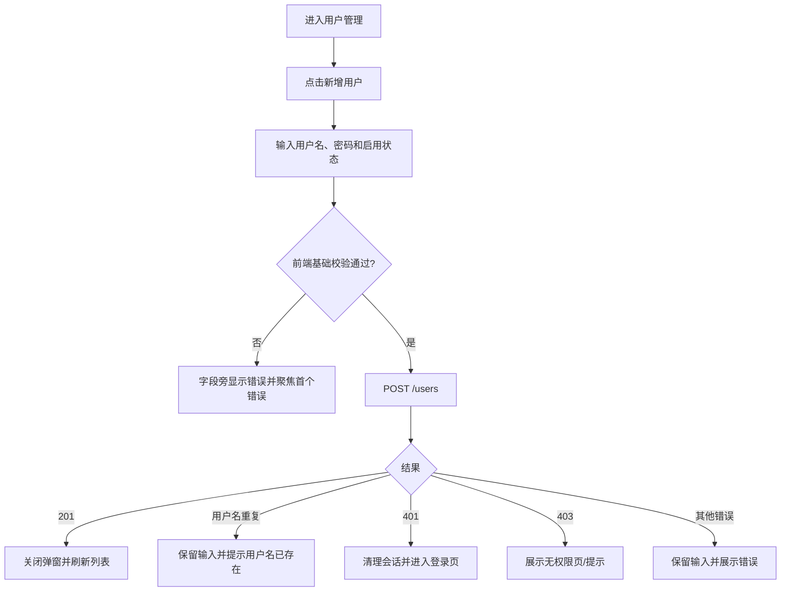
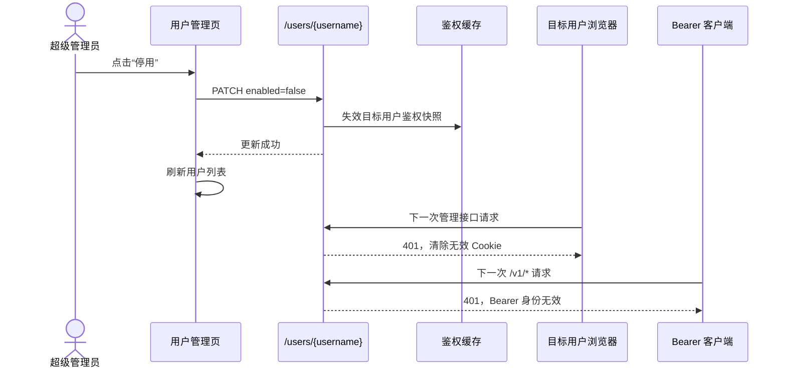
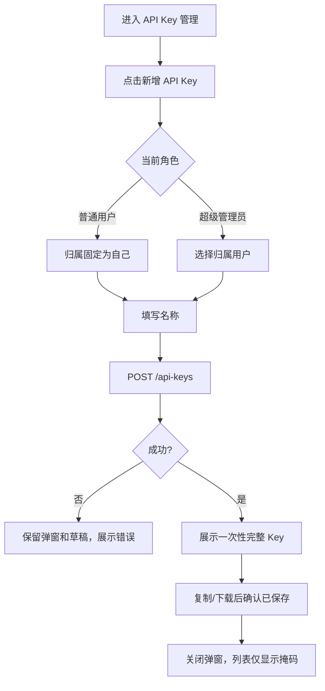

# 02 用户、角色、权限与访问密钥 PRD

## 0. 文档元数据

| 项目 | 内容 |
|---|---|
| 文档 ID | PRD-02 |
| 需求编号前缀 | `REQ-USR` |
| 文档状态 | Draft，基于现状反推并补齐产品化要求 |
| 版本 | 1.0 |
| 基线 | `main@3827590` |
| 编写日期 | 2026-08-17 |
| 适用端 | OpenCodex Web 管理台、Tauri 桌面管理台、`/v1/*` 代理接口 |
| 主要读者 | 产品、交互/UI、前端、后端、安全、测试、运维 |
| 关联文档 | [05 初始化与认证](./05-initialization-and-auth.md)、[10 管理台体验](./10-admin-console.md) |

### 0.1 事实与要求标记

本文使用以下标记，禁止混读：

- **当前实现事实**：基线代码已经存在、可通过源码或测试验证的行为。
- **产品化要求**：面向正式产品必须达到的目标行为；以 `REQ-USR-*` 编号。
- **已知限制**：当前实现与产品化目标之间的差距、缺陷或不稳定边界。
- **TBD**：需要产品、安全或架构负责人作出决策后才能封板的事项。

### 0.2 关键词

- **MUST**：发布阻断项；不满足则本需求不验收。
- **SHOULD**：强烈建议；若不实现，必须记录理由、负责人和补齐计划。
- **管理台身份**：通过 Cookie 登录管理台形成的用户会话。
- **代理调用身份**：客户端通过 `Authorization: Bearer <Access API Key>` 调用 `/v1/*` 时形成的身份。
- **上游凭证**：渠道中的 `apikey` 或自定义请求头，仅用于 OpenCodex 调用上游模型供应商。

---

## 1. 背景与问题定义

OpenCodex 同时承担两类完全不同的身份认证：

1. 人通过浏览器进入管理台，使用用户名和密码建立 Cookie 会话；
2. Codex CLI、SDK 或其他客户端使用 Bearer API Key 调用代理接口。

此外，渠道还保存第三类“上游 API Key”。三类凭证在用途、生命周期、暴露范围和权限作用域上均不同。若产品文案、接口或权限判断将它们混为一谈，将直接造成：

- 用户误把上游 Key 当作代理访问 Key；
- 管理台 Cookie 被错误用于 `/v1/*` 调用；
- 普通用户跨租户查看或操作他人资源；
- API Key 明文被长期保存、列表返回或导出，形成高风险泄漏面；
- 停用用户后已有管理台会话或 Bearer Key仍短暂可用；
- 超级管理员被停用、重置或删除，导致系统失去管理入口。

本 PRD定义用户、角色、资源归属、权限矩阵、超级管理员保护、访问 API Key 生命周期和权限拒绝行为。

---

## 2. 目标、范围与非目标

### 2.1 产品目标

1. 明确区分管理台 Cookie 身份、Bearer API Key 身份和渠道上游凭证。
2. 使普通用户只能查看、管理和调用自己名下的资源。
3. 使超级管理员可以执行跨用户管理，但关键破坏性操作受保护。
4. 保证停用、删除用户或访问 Key后，相关身份尽快且可验证地失效。
5. 形成可测试、可审计、前后端一致的权限拒绝语义。
6. 在产品化前解决访问 API Key 明文保存与展示策略冲突。

### 2.2 范围

- 用户角色和状态。
- 用户 CRUD、密码重置和超级管理员保护。
- 管理台页面与接口的角色权限。
- 渠道、访问 API Key、日志等资源的数据作用域。
- 访问 API Key 创建、查看、复制、启停、删除、导入、导出。
- Cookie 会话与 Bearer 身份的关系和隔离。
- 桌面端与移动端的用户管理、API Key 管理交互。

### 2.3 非目标

- 企业 SSO、OIDC、SAML、LDAP 的具体接入方案。
- 细粒度 RBAC 自定义角色编辑器。
- 渠道路由、计费、日志字段的完整业务规则。
- 上游供应商 API Key 的轮换协议。
- 多组织、多工作区计费结算。

这些能力可作为后续版本扩展，但不得破坏本文定义的身份隔离和资源归属模型。

---

## 3. 身份域与凭证隔离

### 3.1 三类凭证

| 凭证 | 使用者 | 传输位置 | 目标接口 | 当前作用 | 是否决定资源归属 |
|---|---|---|---|---|---|
| 管理台 Cookie | 浏览器中的人 | Cookie `opencodex_admin_auth` | `/session`、`/users`、`/channels`、`/api-keys` 等管理接口 | 管理台登录和角色权限 | 是，来自 Cookie 中用户并回查数据库 |
| Access API Key | CLI、SDK、客户端 | `Authorization: Bearer ...` | `/v1/responses`、`/v1/chat/completions`、`/v1/messages`、图片接口等代理入口 | 代理调用鉴权 | 是，Key 归属用户决定可用渠道和日志归属 |
| 渠道上游 Key | OpenCodex 服务端 | 渠道 `apikey` 或自定义 headers | 上游模型服务 | 上游鉴权 | 否，不应改变调用者身份 |

### 3.2 当前实现事实

- 管理接口调用 `RequireUser()` 或 `RequireSuperadmin()`，依据 Cookie 会话。
- `/v1/*` 代理入口调用 Bearer 鉴权，缺少有效 Bearer 时返回 401，错误为 `valid bearer api key required`。
- Bearer Key 查询采用哈希；Key 和用户鉴权快照缓存 TTL 为 60 秒。
- 禁用或删除 Key 时会主动失效 Key 缓存。
- 禁用或删除用户时会失效用户鉴权缓存，因此其 Bearer Key下一次鉴权应失败。
- 客户端 Bearer 值不会作为渠道上游凭证透传；渠道认证使用渠道自身配置。

### 3.3 产品化要求

- 管理台不得接受 Bearer API Key代替 Cookie 登录。
- `/v1/*` 不得接受管理台 Cookie代替 Bearer API Key。
- 管理台页面必须持续使用“访问 API Key”或“代理访问 Key”描述 Bearer 凭证，使用“上游 API Key”描述渠道凭证。
- 日志、审计信息和错误文案不得输出完整 Cookie、密码、访问 Key或上游 Key。

---

## 4. 用户与角色模型

### 4.1 用户字段

| 字段 | 类型 | 当前事实 | 产品语义 |
|---|---|---|---|
| `id` | UUID | 后端主键，管理台列表未展示 | 稳定用户标识，不因用户名变化而改变 |
| `username` | string | 去除首尾空格；数据库按当前比较规则判重 | 登录名和资源展示名 |
| `password_hash` | string | 使用安全哈希保存 | 不得返回前端或日志 |
| `role` | enum | `superadmin`、`user` | 超级管理员、普通用户 |
| `enabled` | boolean | 停用用户无法登录，受保护接口会使其会话失效 | 用户整体启停开关 |
| `created_at` | Unix 秒 | 列表展示本地化时间 | 创建时间 |
| `updated_at` | Unix 秒 | 后端返回，当前用户页未展示 | 最近更新时间 |

### 4.2 角色定义

#### 超级管理员 `superadmin`

拥有全局管理权限，包括：

- 查看全部用户、渠道、访问 API Key和日志；
- 创建、停用、删除普通用户和重置普通用户密码；
- 配置 Web Search、模型目录、系统设置；
- 清除全部请求日志；
- 对其他用户名下资源执行管理操作。

#### 普通用户 `user`

仅可：

- 登录管理台；
- 查看仪表盘中后端按其权限返回的数据；
- 管理自己名下的渠道；
- 管理自己名下的访问 API Key；
- 查看自己名下的请求日志；
- 使用自己名下启用的访问 API Key调用代理。

### 4.3 环境变量超级管理员

#### 当前实现事实

- 当运行配置存在 `OPENCODEX_ADMIN_PASSWORD` 时，系统判定已配置环境变量超级管理员。
- 每次登录前，系统会确保该用户名对应用户存在，并强制：
  - 角色为 `superadmin`；
  - 状态为启用；
  - 密码哈希与当前环境变量密码一致。
- 环境变量超级管理员密码不能通过用户管理接口修改。
- 环境变量超级管理员不能通过用户更新接口停用。
- 环境变量超级管理员被其他超级管理员删除的后端保护不完整；后续登录会重新创建，这是已知限制而非可接受产品行为。

### 4.4 首次初始化超级管理员

- 数据库无用户且没有环境变量超级管理员时，允许初始化。
- 初始化创建一个数据库超级管理员，角色固定为 `superadmin`，状态固定启用。
- 初始化完成后立即建立管理台 Cookie 会话。
- 重复初始化返回 409。

---

## 5. 权限矩阵

### 5.1 管理台页面

| 页面/能力 | 未登录 | 普通用户 | 超级管理员 |
|---|---:|---:|---:|
| 初始化页 | 仅满足 setup_required | 否 | 否 |
| 登录页 | 是 | 否 | 否 |
| 仪表盘 | 否 | 是，数据需按用户作用域 | 是，全局数据 |
| 渠道配置 | 否 | 自己 | 全部 |
| API Key 管理 | 否 | 自己 | 全部 |
| 用户管理 | 否 | 否 | 是 |
| Web Search | 否 | 否 | 是 |
| 模型信息 | 否 | 否 | 是 |
| 系统设置 | 否 | 否 | 是 |
| 请求日志 | 否 | 自己 | 全部 |
| 清除全部日志 | 否 | 否 | 是 |

### 5.2 用户操作

| 操作 | 普通用户 | 超级管理员 | 保护规则 |
|---|---:|---:|---|
| 列出用户 | 否 | 是 | 后端必须校验 |
| 创建普通用户 | 否 | 是 | 当前接口不允许指定 role，固定创建普通用户 |
| 停用普通用户 | 否 | 是 | 停用后 Cookie/Bearer 均失效 |
| 启用普通用户 | 否 | 是 | 原 Cookie 不应自动恢复，需重新登录 |
| 重置普通用户密码 | 否 | 是 | 不应泄露旧密码或新密码 |
| 删除普通用户 | 否 | 是 | 同步处理其资源和身份 |
| 修改环境变量超级管理员密码 | 否 | 否 | 仅由运行环境配置 |
| 停用环境变量超级管理员 | 否 | 否 | 永久禁止 |
| 删除当前登录用户 | 否 | 否 | 永久禁止 |

### 5.3 资源作用域

| 资源 | 普通用户 | 超级管理员 | 当前实现要点 |
|---|---|---|---|
| 渠道 | 仅自己的渠道 | 全部渠道 | 服务端按 OwnerUserId 过滤；更新时保留原 owner |
| 访问 API Key | 仅自己的 Key | 全部 Key或指定 owner | 服务端按 OwnerUserId 过滤 |
| 请求日志 | 仅自己的日志 | 全部日志 | 普通用户不得使用 owner_username 绕过 |
| 统计数据 | 仅自己的统计 | 全局统计 | 必须与日志作用域一致 |
| Web Search 配置 | 不可管理 | 可管理 | 仅超级管理员页面可见且接口必须校验 |
| 模型目录/系统设置 | 不可管理 | 可管理 | 仅超级管理员 |

---

## 6. 关键任务流

### 6.1 超级管理员创建普通用户

#### 当前实现事实

- 前端没有行内规则，直接提交服务端。
- 用户名和密码会去除首尾空格。
- 用户名空、密码空、用户名重复均由后端返回 400。
- 创建成功后关闭弹窗并重新加载列表，但没有明确成功 Toast。

#### 产品化要求

- 用户名、密码必须在提交前完成基础校验。
- 创建成功必须有明确、可被辅助技术感知的反馈。
- 服务端仍必须执行全部校验，禁止仅依赖前端。

### 6.2 停用用户

#### 产品规则

- 停用用户后，其所有访问 API Key无需逐条修改数据库状态也必须立即不可用。
- 已打开管理台页面允许保留静态画面，但下一次受保护请求必须进入会话失效流程。
- 重新启用用户后，旧管理台 Cookie不得自动重新获得权限；用户必须重新登录。
- 原有启用 Key是否恢复可用取决于 Key自身状态；当前实现会在用户重新启用后恢复，这是产品默认事实。

### 6.3 删除用户

1. 超级管理员点击删除。
2. UI 展示目标用户名、影响范围和不可恢复提示。
3. 用户再次确认。
4. 后端验证：目标存在、目标不是当前用户、目标不属于受保护超级管理员。
5. 删除用户并处理其渠道、访问 API Key及其他关联资源。
6. 失效鉴权缓存。
7. 返回删除结果，UI 刷新。

#### 当前实现事实

- 删除用户会显式删除该用户的访问 API Key和渠道，再删除用户。
- 当前用户不能删除自己。
- 前端删除确认仅显示“删除用户 X？”，没有列出资源影响。
- 请求日志等历史审计数据的保留/匿名化策略没有在当前用户服务中明确体现。

#### TBD-USR-001：用户删除后的历史日志

必须选择并记录一种策略：

- A：保留历史日志与用户名快照，删除外键关系；
- B：保留日志但匿名化用户信息；
- C：级联删除日志和内容；
- D：先软删除用户，按保留期清理。

正式发布建议采用 D 或 A，以保留审计链路。

### 6.4 创建访问 API Key

#### 当前实现事实

- 后端当前生成 Key、保存哈希，同时也保存 `KeyPlaintext`。
- 列表 DTO 当前返回完整 `key`，因此页面可在列表复制并导出完整 Key。
- UI 文案为“可在列表复制完整 Key”，导出提示“含明文”。
- 仓库 README 仍描述“只在创建成功时显示一次明文、数据库只保存哈希”，与代码冲突。
- 创建接口 DTO 接收 `owner_user_id`，但当前前端提交 `owner_username`；超级管理员在 UI 选择的归属用户可能被后端忽略并回落到当前超级管理员。

#### 已知限制：超级管理员归属字段不一致

| 层 | 当前字段 |
|---|---|
| 前端创建请求 | `owner_username` |
| 后端创建 DTO | `owner_user_id` |
| 后端导入请求 | `owner_username` |

该不一致必须在产品化要求中修复并加入端到端测试。

### 6.5 使用访问 API Key调用代理

1. 客户端发送 `Authorization: Bearer <key>`。
2. 服务端提取 Bearer，计算 Key 哈希。
3. 校验 Key存在且启用。
4. 校验 Key所属用户存在且启用。
5. 以所属用户作为调用身份选择该用户渠道、写入日志和统计。
6. 更新 Key最后使用时间。
7. 无有效渠道时返回明确错误，不得回退使用其他用户渠道。

### 6.6 导入访问 API Key

- JSON可为 `{ "keys": [...] }` 或前端兼容的数组根节点。
- 每项包括 `owner_username`、`name`、`key`、`enabled`。
- 普通用户导入时，无论文件 owner 如何，都归当前用户。
- 超级管理员按 `owner_username` 分配；缺省归当前用户。
- 当前合并键为 `(ownerUserId, name)`：同名项更新明文、哈希和状态，否则新增。
- 当前为整体失败语义；任一项无名称、无 Key或 owner 不存在都会返回错误。

产品化后必须提供导入前预览，显示新增、覆盖、跳过和错误数量，并要求用户确认覆盖。

---

## 7. 页面、字段、校验与状态

### 7.1 用户管理页

#### 页面结构

- 标题：“用户管理”。
- 说明：“普通用户由超级管理员创建、停用和删除”。
- 操作：刷新、新增用户。
- 桌面表格：用户名、角色、状态、创建时间、操作。
- 移动卡片：用户名、角色、状态、创建时间、三个操作按钮。

#### 新增用户字段

| 字段 | 控件 | 当前默认 | MUST 校验 |
|---|---|---|---|
| 用户名 | 文本输入 | 空 | 去除首尾空格后非空；不得与已有用户重复；长度和字符集见 TBD-USR-002 |
| 密码 | 密码输入、可显示 | 空 | 非空；产品化应满足密码策略 |
| 启用 | Switch | 开 | 布尔值 |

#### 重置密码字段

| 字段 | 控件 | 行为 |
|---|---|---|
| 用户名 | 禁用文本框 | 不可编辑 |
| 新密码 | 密码输入、可显示 | 非空并满足密码策略 |

#### 行级操作规则

- 角色为 `superadmin` 时，当前前端禁用“停用/启用”和“重置密码”。
- 当前用户禁用“删除”。
- 对其他超级管理员的删除，前端未统一禁用；后端也只保护当前用户和部分环境变量规则，属于产品化缺口。

### 7.2 API Key 管理页

#### 页面结构

- 标题：“API Key 管理”。
- 说明必须改为能明确区分代理访问 Key与渠道上游 Key的文案。
- 统计：Key 总数、启用 Key、最近使用。
- 操作：刷新、导出、导入、新增。
- 列表：用户（仅超级管理员）、名称、掩码 Key、最近使用、状态、操作。

#### 新增字段

| 字段 | 控件 | 权限 | 校验 |
|---|---|---|---|
| 归属用户 | 可搜索 Select | 仅超级管理员 | 必须是存在且启用的用户；若不选，需明确默认归属当前用户 |
| 名称 | 文本输入 | 全部已登录用户 | MUST 非空；同一 owner 下是否允许重名见 TBD-USR-003 |

#### 操作状态

- 列表加载：遮罩；首次加载不得误显示空态。
- 空态：“暂无 API Key”，提供新增入口。
- 创建中：按钮 loading，阻止重复提交。
- 创建成功：展示完整 Key、复制按钮和“仅此一次”提示（若采用推荐策略）。
- 启停、删除成功：刷新列表并显示成功反馈。
- 导入中：文件选择后显示解析/上传状态；禁止重复导入。
- 导出：执行敏感操作确认和重新认证策略取决于明文策略决策。

---

## 8. 桌面端与移动端规则

### 8.1 当前实现事实

- 用户管理、API Key 管理在 `max-width: 600px` 下从桌面表格切换为移动卡片。
- 移动卡片操作按钮最小高度约 44px。
- 新增用户、重置密码、API Key弹窗宽度限制为 `min(520/560px, 100vw - 24px)`。
- 弹窗主体可滚动，底部处理安全区。
- API Key移动卡片仍可复制完整 Key，前提是后端列表返回 `key`。

### 8.2 产品化要求

- 手机端不得通过横向滚动才能完成核心用户和 Key操作。
- 危险操作必须有文本按钮，不得仅用颜色或图标表达。
- 移动端确认弹窗必须完整展示目标用户/Key名称和影响范围。
- 完整 Key显示区域必须支持自动换行、显式复制反馈和屏幕阅读器提示。
- 软键盘弹出时提交按钮不得被遮挡。

---

## 9. 加载、空态、错误态、权限拒绝与会话失效

### 9.1 加载态

- 用户列表、Key列表使用局部 loading，不阻断导航。
- 保存按钮进入 loading并禁止重复提交。
- 删除、启停等单项操作 SHOULD 使用行级 loading，避免整个页面冻结。

### 9.2 空态

| 场景 | 文案 | 主操作 |
|---|---|---|
| 无普通用户 | 暂无用户 | 新增用户 |
| 无访问 Key | 暂无 API Key | 新增 API Key |
| 无可选归属用户 | 暂无可用用户 | 返回用户管理创建/启用用户 |

### 9.3 错误态

- 400：映射为可理解的字段错误，保留草稿。
- 401：进入统一会话失效流程，不只显示 Toast。
- 403：展示“当前账号无权执行此操作”，不得伪装成资源不存在。
- 404：提示目标已不存在，并刷新列表。
- 409：提示状态冲突，例如重复初始化或并发修改。
- 5xx/网络失败：保留当前页面数据和草稿，提供重试。

### 9.4 会话失效

当用户被停用、删除、Cookie过期或数据保护密钥变化时：

1. 当前请求返回 401；
2. 前端清空 `currentUser` 和本地敏感草稿；
3. 关闭包含完整 Key、密码或敏感 JSON的弹窗；
4. 跳转登录页；
5. 登录后默认回到安全首页；是否恢复原路径见 [10 管理台体验](./10-admin-console.md)；
6. 不得在 URL、localStorage 或错误日志中保存完整 Key。

---

## 10. 可访问性要求

- 所有用户和 Key行级操作必须可通过键盘到达和触发。
- 角色、状态不得只用颜色区分，必须有文字。
- 打开弹窗后焦点进入首个可编辑字段；关闭后回到触发按钮。
- 校验失败后将焦点移到首个错误字段，并通过 `aria-describedby` 关联错误说明。
- 创建 Key成功消息使用 `aria-live="assertive"` 或等效机制播报。
- 完整 Key代码块必须能被屏幕阅读器按字符读取，同时提供独立“复制”按钮。
- 禁用按钮应提供原因，例如“环境变量超级管理员由运行环境管理”。
- 移动端触控目标最小 44×44 CSS 像素。

---

## 11. 产品化需求与逐条验收标准

### 11.1 身份隔离

#### REQ-USR-001（MUST）管理台身份与代理身份隔离

**要求**：管理台 Cookie仅用于管理接口；Bearer Access API Key仅用于代理接口，两者不得互相替代。

**验收标准**：
1. 仅携带有效管理台 Cookie调用 `/v1/responses`，返回 401。
2. 仅携带有效 Bearer Key调用 `/users`，返回 401。
3. 同时携带两者时，各接口只使用其所属身份域。
4. 日志能标识代理调用的 Key owner，但不记录完整凭证。

#### REQ-USR-002（MUST）上游凭证隔离

**要求**：客户端 Bearer不得作为上游认证值透传；上游认证仅来自渠道配置。

**验收标准**：
1. 上游抓包中不存在客户端 Bearer原值。
2. `auth_mode=config` 使用渠道 Key；`auth_mode=none` 不自动附加渠道 Bearer。
3. 管理台文案明确区分两类 Key。

#### REQ-USR-003（MUST）服务端权限为最终裁决

**要求**：菜单隐藏和按钮禁用仅用于体验，所有权限必须由服务端再次校验。

**验收标准**：
1. 普通用户手工调用 `/users`、系统设置、模型目录等接口均返回 403。
2. 修改前端状态或直接构造请求不能绕过。
3. 资源作用域由当前认证身份计算，不信任请求中的 owner 字段。

### 11.2 角色与资源作用域

#### REQ-USR-004（MUST）固定基础角色

**要求**：当前版本仅允许 `superadmin` 与 `user` 两种角色；普通用户创建接口固定生成 `user`。

**验收标准**：
1. UI 不提供创建超级管理员入口。
2. 构造非法 role 请求被忽略或返回 400。
3. 会话和列表仅返回合法角色值。

#### REQ-USR-005（MUST）普通用户数据隔离

**要求**：普通用户只能读取和修改自己的渠道、访问 Key、日志和统计。

**验收标准**：
1. 以用户 A身份请求用户 B资源返回 404或403，且不泄露资源元数据。
2. owner 查询参数不能扩大普通用户作用域。
3. 用户 A Bearer不会路由到用户 B渠道。
4. 仪表盘与日志汇总数字一致地遵守相同作用域。

#### REQ-USR-006（MUST）超级管理员全局视图

**要求**：超级管理员可查看全部用户作用域资源，并能按 owner筛选。

**验收标准**：
1. 渠道、Key、日志列表返回 owner信息。
2. owner筛选只返回目标用户数据。
3. 未指定 owner时返回全部可管理数据。

#### REQ-USR-007（MUST）owner不可被普通用户伪造

**要求**：普通用户创建或导入资源时，服务端强制归属当前用户。

**验收标准**：
1. 普通用户提交其他 `owner_username`/`owner_user_id`，最终 owner仍为自己。
2. 响应和数据库均反映真实 owner。

### 11.3 超级管理员保护

#### REQ-USR-008（MUST）禁止删除当前用户

**验收标准**：
1. UI禁用当前用户删除按钮并说明原因。
2. 直接调用删除接口返回 400/409。
3. 并发情况下服务端仍能阻止。

#### REQ-USR-009（MUST）保护环境变量超级管理员

**要求**：环境变量超级管理员不得被停用、删除、降级或通过 UI重置密码。

**验收标准**：
1. 四类操作均在前端不可用并有原因提示。
2. 直接请求均被服务端拒绝。
3. 拒绝后用户数据不发生暂态改变。
4. 登录同步不会成为弥补删除漏洞的唯一机制。

#### REQ-USR-010（MUST）至少保留一个可登录超级管理员

**要求**：任何停用、删除或角色变更操作后，系统必须仍有至少一个启用且可登录的超级管理员。

**验收标准**：
1. 对最后一个超级管理员执行破坏性操作被拒绝。
2. 并发执行两个删除请求时最多成功一个。
3. 返回明确错误“必须保留至少一个启用的超级管理员”。

#### REQ-USR-011（SHOULD）超级管理员敏感操作重新认证

**要求**：删除用户、导出明文 Key、修改系统级权限等操作应要求近期重新输入密码或具备等效的近期认证证明。

**验收标准**：
1. 超过近期认证窗口后触发重新认证。
2. 认证失败不执行原操作。
3. 重新认证成功后仅在短窗口内有效。

### 11.4 用户生命周期

#### REQ-USR-012（MUST）创建用户校验

**验收标准**：
1. 空用户名、空密码前后端均拒绝。
2. 重复用户名返回可定位到用户名字段的错误。
3. 提交失败保留草稿，密码不得写入日志。
4. 成功后列表出现新用户并有成功反馈。

#### REQ-USR-013（MUST）用户停用立即影响 Cookie与Bearer

**验收标准**：
1. 停用后目标用户下一次管理请求返回 401。
2. 停用后目标用户所有 Bearer Key下一次请求返回 401。
3. 缓存不得使权限继续有效超过一次受保护请求。
4. 管理员列表及时显示停用状态。

#### REQ-USR-014（MUST）重新启用不恢复旧管理台会话

**验收标准**：
1. 重新启用后旧 Cookie仍不能直接访问管理接口。
2. 重新登录成功后建立新会话。
3. Key自身仍启用时，重新启用用户后 Bearer恢复；Key已停用时仍不可用。

#### REQ-USR-015（MUST）密码重置

**验收标准**：
1. 空新密码被拒绝。
2. 环境变量超级管理员重置被拒绝。
3. 重置成功后旧密码登录失败，新密码成功。
4. 是否使已有 Cookie立即失效见 TBD-USR-004；决策前测试必须记录当前行为。

#### REQ-USR-016（MUST）用户删除影响清单

**要求**：删除确认必须列出将受影响的渠道数、Key数及日志处理策略。

**验收标准**：
1. 确认弹窗展示真实统计。
2. 取消不产生任何变更。
3. 删除成功后渠道和 Key不可访问。
4. 历史日志按选定保留策略处理。

### 11.5 Access API Key生命周期

#### REQ-USR-017（MUST）创建 Key归属字段统一

**要求**：前端与后端必须统一使用一种稳定字段，推荐 `owner_user_id`；显示层继续返回 `owner_username`。

**验收标准**：
1. 超级管理员选择用户 B后创建的 Key数据库 owner为 B。
2. 返回对象 owner_username为 B。
3. 用户 B可查看和使用，用户 A不可查看。
4. 有覆盖该场景的端到端测试。

#### REQ-USR-018（MUST）Key名称非空

**验收标准**：
1. 去除首尾空格后为空时前后端拒绝。
2. 错误绑定到名称字段。
3. 不创建匿名 Key。

#### REQ-USR-019（MUST）安全生成与哈希鉴权

**验收标准**：
1. Key使用密码学安全随机数生成。
2. 鉴权通过哈希查找，不以明文比较。
3. Key前后缀仅用于掩码展示，不足以重建完整 Key。

#### REQ-USR-020（MUST）Key停用和删除即时失效

**验收标准**：
1. 停用后原 Key请求返回 401。
2. 删除后原 Key请求返回 401。
3. 启用后恢复使用，不生成新值。
4. 缓存被精准失效。

#### REQ-USR-021（MUST）Key使用归属

**验收标准**：
1. 日志记录 Key ID、Key名称和 owner，不记录完整值。
2. 最近使用时间在成功鉴权后更新。
3. Key owner停用时 Key不可用。

#### REQ-USR-022（MUST）解决明文策略冲突

**要求**：正式发布前必须选择并实现唯一策略，文档、数据库、接口和 UI保持一致。

**推荐策略 A：一次性明文**

- 数据库只保存哈希、前缀和后缀；
- 完整 Key只在创建或导入结果中返回一次；
- 列表无 `key` 字段，复制按钮仅存在于创建成功页；
- 不支持导出既有完整 Key，只支持导出元数据或重新生成。

**备选策略 B：可恢复密钥**

- 明文不得直接入库，必须使用独立密钥加密；
- 查看/导出要求近期重新认证并记录审计；
- 接口默认不返回明文，必须调用独立 reveal/export接口；
- 支持密钥轮换和加密密钥迁移。

**验收标准**：
1. 安全负责人签字确认策略。
2. README、PRD、UI文案和接口契约一致。
3. 数据库检查不存在未批准的明文字段或值。
4. 列表接口不意外返回完整 Key。
5. 日志、错误和监控中不存在完整 Key。

#### REQ-USR-023（MUST）导入预览与覆盖确认

**验收标准**：
1. 上传后先解析，不立即写入。
2. 展示新增、覆盖、错误、忽略数量。
3. 覆盖以 owner+名称或选定唯一键明确标识。
4. 用户确认后才提交。
5. 导入失败不会留下部分不明确状态；若支持部分成功必须逐项报告。

#### REQ-USR-024（SHOULD）Key轮换

**要求**：支持为同一用途生成新 Key、短期双 Key并行、确认客户端切换后停用旧 Key。

**验收标准**：
1. 轮换不改变资源 owner。
2. 新旧 Key状态清晰可见。
3. 停用旧 Key后立即失效。

### 11.6 错误、会话与审计

#### REQ-USR-025（MUST）统一401处理

**验收标准**：
1. 任意管理接口返回 401时前端清空会话状态。
2. 关闭敏感弹窗并跳转登录。
3. 不重复弹出多个错误 Toast。
4. 登录成功后不恢复密码或完整 Key草稿。

#### REQ-USR-026（MUST）统一403处理

**验收标准**：
1. 普通用户访问超级管理员接口返回 403。
2. UI展示无权限而不是“网络错误”。
3. 403不清除仍有效的登录会话。

#### REQ-USR-027（MUST）敏感操作审计

**要求**：创建/导入/导出/揭示/启停/删除 Key、创建/停用/删除用户、重置密码均必须形成审计事件。

**验收标准**：
1. 记录操作者、目标、动作、结果、时间和请求 ID。
2. 不记录密码或完整 Key。
3. 审计失败不得静默；关键操作的失败策略由安全设计确定。

#### REQ-USR-028（SHOULD）并发冲突提示

**验收标准**：
1. 目标已被其他管理员删除时返回 404并刷新列表。
2. 状态已变化时 UI显示最新状态。
3. 不因陈旧页面覆盖 owner、角色等不可编辑字段。

### 11.7 移动端与可访问性

#### REQ-USR-029（MUST）移动端功能等价

**验收标准**：
1. 手机端可完成用户和 Key全部核心操作。
2. 无需横向滚动。
3. 危险操作确认内容不截断。
4. 触控目标不小于 44×44。

#### REQ-USR-030（MUST）键盘与读屏支持

**验收标准**：
1. 所有操作可键盘完成。
2. 焦点顺序与视觉顺序一致。
3. 状态和错误有文本及可访问名称。
4. 创建 Key成功和复制结果可被读屏感知。

---

## 12. 接口与数据依赖

### 12.1 管理台用户接口

| 方法 | 路径 | 身份 | 主要请求/响应 | 当前状态 |
|---|---|---|---|---|
| GET | `/users` | Cookie + superadmin | `users[]` | 已实现 |
| POST | `/users` | Cookie + superadmin | username/password/enabled | 已实现 |
| PATCH | `/users/{username}` | Cookie + superadmin | enabled或password | 已实现 |
| DELETE | `/users/{username}` | Cookie + superadmin | 删除结果 | 已实现 |

### 12.2 访问 Key接口

| 方法 | 路径 | 身份 | 主要请求/响应 | 当前状态 |
|---|---|---|---|---|
| GET | `/api-keys` | Cookie | keys[]，按角色作用域 | 已实现，当前返回完整 key |
| POST | `/api-keys` | Cookie | `owner_user_id`、name | 已实现；与前端 owner_username 不一致 |
| PATCH | `/api-keys/{uuid}` | Cookie | enabled | 已实现 |
| DELETE | `/api-keys/{uuid}` | Cookie | deleted | 已实现 |
| POST | `/api-keys/import` | Cookie | owner_username/name/key/enabled | 已实现 |
| POST | `/v1/*` | Bearer | 代理请求 | 已实现，独立身份域 |

### 12.3 缓存依赖

- `AuthApiKey(hash)`：Key鉴权快照，TTL 60秒。
- `AuthUser(userId)`：用户鉴权快照，TTL 60秒。
- Key启停、删除、导入更新必须失效 Key缓存。
- 用户启停、删除必须失效用户缓存。

---

## 13. 当前实现事实、已知限制与TBD汇总

### 13.1 当前实现事实

- 用户角色仅有 `superadmin` 和 `user`。
- 管理台使用持久化 Cookie；代理使用 Bearer Key。
- 普通用户资源按 owner隔离。
- 删除用户显式删除其渠道和访问 Key。
- 当前访问 Key明文保存到 `KeyPlaintext` 并由列表接口返回。
- 移动端用户和 Key列表采用卡片布局。

### 13.2 已知限制

1. API Key创建 owner字段前后端不一致。
2. Key明文策略与 README冲突。
3. 用户/密码缺少产品级前端校验和密码策略。
4. 环境变量超级管理员删除保护不完整。
5. 未统一保证“至少一个启用超级管理员”。
6. 当前会话过期主要表现为单次请求 Toast，前端没有全局401跳转。
7. 删除用户对历史日志的影响没有明确产品契约。
8. 用户敏感操作缺少完整审计和重新认证。

### 13.3 TBD

| 编号 | 事项 | 推荐 | 决策方 |
|---|---|---|---|
| TBD-USR-001 | 用户删除后的历史日志策略 | 软删除或保留审计快照 | 产品+安全+数据 |
| TBD-USR-002 | 用户名字符集、大小写、最大长度 | 3–64字符，明确是否大小写敏感 | 产品+后端 |
| TBD-USR-003 | 同一用户下 API Key名称是否唯一 | 建议唯一，便于导入和审计 | 产品 |
| TBD-USR-004 | 重置密码是否立即使现有 Cookie失效 | 建议全部会话失效 | 安全 |
| TBD-USR-005 | API Key明文策略 A/B | 推荐一次性明文 A | 安全+产品 |
| TBD-USR-006 | 删除用户使用软删除还是硬删除 | 推荐软删除+保留期 | 数据+合规 |
| TBD-USR-007 | 超级管理员敏感操作近期认证窗口 | 建议 10分钟 | 安全 |

---

## 14. 源码与测试追溯

### 14.1 前端源码

- `frontend/src/App.vue`：角色菜单、当前用户、退出、普通用户页面限制。
- `frontend/src/Users.vue`：用户列表、创建、启停、重置密码、删除及移动卡片。
- `frontend/src/AccessKeys.vue`：访问 Key列表、明文复制、导入导出、归属用户选择。
- `frontend/src/Login.vue`：管理台用户名密码登录。
- `frontend/src/style.css`：管理台通用移动端、弹窗和工具栏规则。

### 14.2 后端源码

- `opencodex_proxy/src/Presentation/OpenCodex.Api/Controllers/AuthController.cs`
- `opencodex_proxy/src/Presentation/OpenCodex.Api/Controllers/UsersController.cs`
- `opencodex_proxy/src/Presentation/OpenCodex.Api/Controllers/ApiKeysController.cs`
- `opencodex_proxy/src/Presentation/OpenCodex.Api/Controllers/SessionState.cs`
- `opencodex_proxy/src/Presentation/OpenCodex.Api/Infrastructure/WebWorkContext.cs`
- `opencodex_proxy/src/Libraries/OpenCodex.Core/Services/AuthService.cs`
- `opencodex_proxy/src/Libraries/OpenCodex.Core/Services/UserService.cs`
- `opencodex_proxy/src/Libraries/OpenCodex.Core/Services/ApiKeyService.cs`
- `opencodex_proxy/src/Libraries/OpenCodex.Core/Services/SessionService.cs`
- `opencodex_proxy/src/Libraries/OpenCodex.Core/Services/Proxy/ProxyAccessService.cs`
- `opencodex_proxy/src/Libraries/OpenCodex.Domain/Domain/User.cs`
- `opencodex_proxy/src/Libraries/OpenCodex.Domain/Domain/AccessApiKey.cs`

### 14.3 现有测试

- `opencodex_proxy/tests/OpenCodex.Api.Tests/SetupRoutesTests.cs`
  - 无用户且无环境超级管理员时需要初始化。
  - 初始化创建超级管理员并拒绝重复初始化。
- `opencodex_proxy/tests/OpenCodex.Api.Tests/RouteTests.cs`
  - 管理接口真实路径、普通用户访问超级管理员接口、持久化 Cookie、重启后 Cookie有效。
- `opencodex_proxy/tests/OpenCodex.Api.Tests/ProxyCompatibilityTests.cs`
  - Cookie登录后创建访问 Key，再以 Bearer Key调用代理。
- `opencodex_proxy/tests/OpenCodex.Api.Tests/ProxyEndpointServiceTests.cs`
  - 客户端 Authorization不透传上游。

### 14.4 必补测试

1. 超级管理员为指定普通用户创建 Key，验证 owner字段端到端一致。
2. 普通用户不能跨 owner操作渠道、Key、日志。
3. 停用用户后 Cookie与Bearer即时失效。
4. 重新启用用户后旧 Cookie不恢复。
5. 环境变量超级管理员不可删除。
6. 最后一个超级管理员不可停用或删除。
7. Key列表是否返回明文，按最终策略锁定契约。
8. 用户删除时渠道、Key、日志按选定策略处理。
9. 401/403前端全局行为。
10. 移动端键盘、读屏和危险操作确认。

---

## 15. 文档自检

- `REQ-USR-001` 至 `REQ-USR-030`：编号连续、无重复。
- 所有 MUST/SHOULD 均包含可执行验收标准。
- 已明确区分 Cookie 管理台身份、Bearer代理身份、渠道上游凭证。
- 已覆盖普通用户作用域、超级管理员保护、用户生命周期和 Key生命周期。
- 已记录 API Key明文策略冲突及 owner字段不一致。
- 已链接 [05 初始化与认证](./05-initialization-and-auth.md) 和 [10 管理台体验](./10-admin-console.md)。
