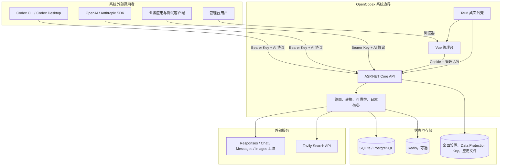
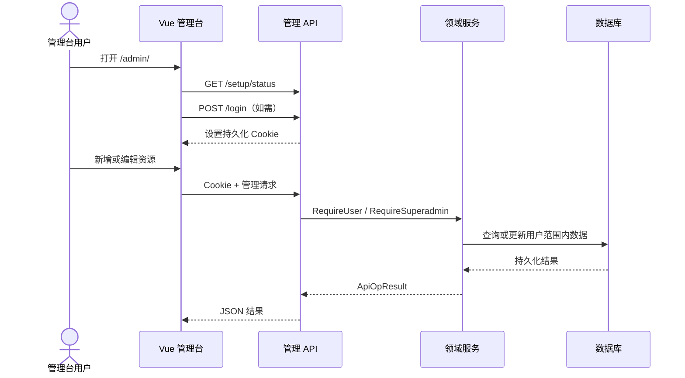
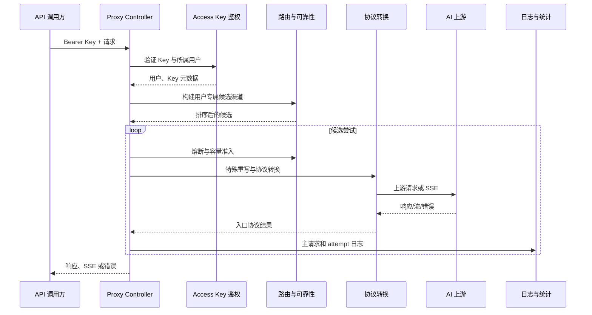
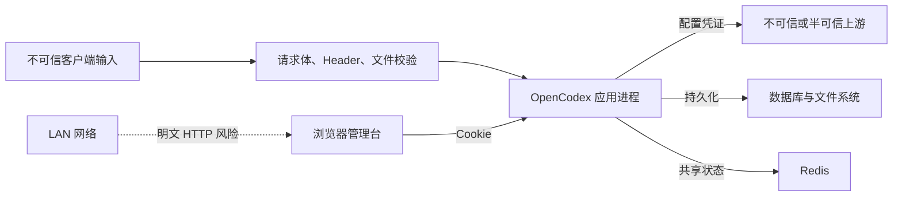

# 03. 系统边界

> 需求前缀：`REQ-SYS`  
> 代码基线：`main@3827590`  
> 目标：明确 OpenCodex 的系统上下文、内部组件、部署形态、外部依赖、数据流和信任边界

## 1. 范围定义

OpenCodex 是位于 API 调用方与一个或多个 AI 上游之间的中间系统，同时向管理台用户提供配置和观测能力。

系统范围内包括：

- 模型代理 HTTP API；
- 管理 HTTP API；
- Web 管理台静态资源和浏览器交互；
- 认证、用户、访问 Key 和资源归属；
- 渠道配置、模型映射和路由；
- 协议、工具、多模态和 SSE 转换；
- Web Search 模拟调用；
- 日志、统计、内容存储和计费；
- SQLite/PostgreSQL 数据访问和迁移；
- 可选 Redis 缓存与共享运行时状态；
- Docker 运行环境；
- Tauri 桌面外壳、托盘和 .NET sidecar 生命周期。

系统范围外包括：

- 上游模型自身的推理质量和可用性；
- 上游账号、余额、账单和服务条款；
- Tavily 服务的搜索质量和可用性；
- 网络层 TLS 终止、WAF 和公网防护（当前需由部署环境提供）；
- PostgreSQL、Redis 的集群、高可用和备份系统；
- 操作系统级密钥库、MDM 和桌面软件分发；
- 客户端工具对 OpenCodex 返回结果的最终展示。

## 2. 系统上下文

## 3. 外部参与者

### 3.1 管理台用户

- 通过 `/admin/` 加载前端；
- 通过用户名、密码登录；
- 登录态使用持久化 Cookie；
- 根据角色访问管理 API；
- 不因管理台已登录而自动获得模型代理调用权限。

### 3.2 API 调用方

- 通过 `/v1/models`、`/v1/responses`、`/v1/chat/completions`、`/v1/messages` 调用；Images 路由虽存在于控制器，但当前缺少生产实现和 DI 注册，不能作为可用入口；
- 必须携带 OpenCodex 访问 Key；
- 请求租户由访问 Key 所属用户决定；
- 不获得任何管理台权限。

### 3.3 AI 上游服务

- 由渠道的 Base URL、类型、认证模式、Key 和自定义 Header 定义；
- 可使用 Responses、Chat、Messages 或 Images 协议；
- 可能返回非标准字段、错误或 SSE；
- OpenCodex 负责超时、重试、协议转换和错误包装，但不控制上游服务本身。

### 3.4 Tavily

- 仅在 Web Search `simulate` 模式下由 OpenCodex 直接调用；
- 使用超级管理员配置的 Tavily Key；
- Key 有排序、启用、使用计数和使用上限；
- 其他模式不应触发本地 Tavily 请求。

### 3.5 数据库

- SQLite：单文件数据库，适用于桌面或单实例；
- PostgreSQL：面向服务端和多实例；
- EF Core 在应用启动时执行迁移和默认数据播种；
- 数据库保存用户、访问 Key 哈希及当前明文副本、渠道/Web Search 凭证、模型、价格、日志及内容寻址对象。

### 3.6 Redis

- 可选依赖；
- 用作二级缓存以及跨实例亲和、容量和熔断状态；
- 不可用时当前实现降级到进程内状态；
- 降级后不同实例之间不再共享这些运行时状态。

## 4. 内部逻辑组件

| 组件 | 主要职责 | 生命周期/位置 |
|---|---|---|
| Controllers | HTTP 路由、输入读取、权限前置、响应状态 | ASP.NET Core Presentation |
| WorkContext | 从 Cookie 会话获得当前管理用户 | Scoped |
| Auth/Session | 初始化、登录、用户有效性和 Cookie 会话 | Core Service |
| Config/User/ApiKey | 管理领域数据和权限范围 | Core Service |
| ProxyAccess | Bearer Key 鉴权和代理租户确定 | Core Proxy Service |
| ProxyRoute | 模型匹配、候选构建和排序 | Core Proxy Service |
| Capacity/Affinity/CircuitBreaker | 并发容量、亲和和熔断 | Singleton + Redis/内存 |
| ProxyEndpoint | 单次代理请求的总编排 | Scoped |
| ProtocolConverter | 请求、响应、工具和字段转换 | Core Protocols |
| SseStreamConverter | 六个跨协议流式转换方向 | Core Protocols |
| WebSearchSimulator | 本地 Web Search 工具循环 | Core Web Search |
| ImageFallback/OCR | 图片能力检测、视觉路由和文本重写 | Core Proxy Service |
| ProxyLog/Observability | 请求生命周期、正文、统计和实时数据 | Core Service |
| EF DbContext | 数据持久化与迁移 | Scoped |
| Tauri Host | sidecar 启停、窗口、托盘和设置重启 | Rust/Tauri |

## 5. 运行形态

### 5.1 Web 开发模式

- 后端通常运行在 `https://localhost:8443`；
- Vite 管理台运行在 `http://127.0.0.1:5173/admin/`；
- Vite 将管理请求代理到后端；
- 浏览器管理请求必须通过 Vite 的同源 `/admin/*` 代理进入后端；直接跨 origin 访问后端不会自动复用该管理台 Cookie；
- Swagger 仅 Development 环境开放。

### 5.2 单机服务模式

- ASP.NET Core 同时托管管理台静态资源和 API；
- 默认 SQLite 连接串为 `Data Source=logs/opencodex.db`；
- Redis 可为空；
- 适合单实例或低复杂度部署；
- 运行目录需要可写，以保存数据库、Data Protection Key 和设置文件。

### 5.3 Docker SQLite 模式

- 当前 Compose 将宿主端口映射到 `127.0.0.1`；
- `/app/logs` 挂载到宿主目录；
- 数据库和 Data Protection Key 应位于持久卷；
- 容器重建不应丢失登录 Cookie 解密能力或业务数据。

### 5.4 Docker PostgreSQL + Redis 模式

- OpenCodex、PostgreSQL、Redis 组成同一网络；
- PostgreSQL 保存持久数据；
- Redis 保存共享缓存和运行时协调状态；
- OpenCodex 可扩展到多实例的前提是所有实例共享数据库、Redis 和关键配置；
- 当前 Compose 使用固定示例凭据，生产必须替换。

### 5.5 Tauri 桌面模式

- Tauri 启动 self-contained .NET sidecar；
- 默认管理地址为 `http://127.0.0.1:18080/admin/`；
- 用户可切换 LAN 模式，使 sidecar 监听 `0.0.0.0`；
- 设置变更可通过 Tauri 命令重启 sidecar；
- 关闭主窗口时应用驻留托盘；
- 退出托盘动作终止 sidecar；
- 数据库、Data Protection 密钥和 OCR 缓存位于桌面应用数据目录，`desktop-settings.json` 位于桌面应用配置目录。

## 6. HTTP 边界

### 6.1 公共入口

| 接口 | 身份要求 | 用途 |
|---|---|---|
| `GET /` | 无 | 服务标识 |
| `GET /health` | 无 | 浅层进程存活 |
| `GET /setup/status` | 无 | 判断首次初始化状态 |
| `POST /setup` | 仅未初始化状态可成功 | 创建首个超级管理员并保存设置 |
| `POST /login` | 无 | 管理台登录 |
| `GET /session` | Cookie 可选 | 查询当前管理台会话 |
| `POST /logout` | Cookie 可选 | 清除当前会话 |

### 6.2 管理入口

管理 API 使用 Cookie 身份，并按 `RequireUser` 或 `RequireSuperadmin` 执行授权。主要资源包括：

- `/users`
- `/api-keys`
- `/config`、`/channels`
- `/model-providers`、`/model-infos`
- `/model-catalog/export`、`/model-catalog/import`（仅超级管理员）
- `/pricing`
- `/web-search`
- `/logs`、`/stats`
- `/system-settings`

### 6.3 代理入口

代理 API 使用 Bearer 访问 Key：

- `/models`、`/v1/models`
- `/responses`、`/v1/responses`
- `/chat/completions`、`/v1/chat/completions`
- `/messages`、`/v1/messages`
- `/images/generations`、`/v1/images/generations`
- `/images/edits`、`/v1/images/edits`

`REQ-SYS-001`（MUST）：同一路径别名必须具有一致的鉴权、路由、转换和错误语义。

验收标准：

- `/responses` 与 `/v1/responses` 使用相同请求产生等价结果；
- 无有效访问 Key 时两者均被拒绝；
- 日志保留实际请求路径，但业务处理一致。

## 7. 关键数据流

### 7.1 管理配置流

### 7.2 代理调用流

### 7.3 日志正文流

1. 请求生命周期先创建主日志元数据；
2. 处理开始后更新状态；
3. 每个渠道尝试记录 attempt；
4. 请求头、原始请求、上游请求、响应和流内容进入内容存储；
5. 内容按哈希、分块、压缩和去重保存；
6. 主日志保存内容引用和统计字段；
7. 管理台按权限读取元数据和详细正文。

## 8. 信任边界

主要边界和要求：

### 8.1 客户端到代理

- 所有请求体均视为不可信输入；
- Bearer Key不得直接透传到上游；
- JSON、multipart、文件数量和大小必须校验；
- 请求错误不得导致跨用户资源查询。

### 8.2 浏览器到管理 API

- Cookie 为 HttpOnly、SameSite=Lax；
- 当前 SecurePolicy 随请求协议决定；
- LAN HTTP 模式下 Cookie 和管理流量缺少传输加密；
- 当前没有独立 CSRF Token 和全局登录限流。

### 8.3 应用到上游

- 上游 Key来自渠道配置；
- 自定义 Header 可能包含敏感信息；
- 上游响应不可信，必须限制 SSE 缓冲、集合大小和解析资源；
- 上游错误只能按定义暴露摘要或兼容错误结构。

### 8.4 应用到存储

- 数据库包含密码哈希、访问 Key 哈希及当前实现中的部分明文凭证；
- 日志正文可能包含用户内容、代码、图片描述和上游响应；
- 数据库、卷、备份和导出必须按敏感数据保护；
- 内容哈希用于完整性与去重，不等于加密。

`REQ-SYS-002`（MUST）：生产部署必须在 OpenCodex 前提供 TLS 终止，或仅允许受信任本机网络访问；LAN 模式不得被默认宣传为安全公网入口。

`REQ-SYS-003`（MUST）：所有外部输入、上游输出和持久化内容必须有明确大小、超时或资源边界；未定义的边界必须在非功能需求中标为 TBD 并进入压力测试。

## 9. 依赖故障与降级边界

| 依赖 | 故障影响 | 当前行为 | 产品要求 |
|---|---|---|---|
| 数据库 | 所有持久化与大部分管理/代理鉴权失败 | 启动迁移或运行查询报错 | 必须区分未就绪与进程存活 |
| Redis | 跨实例缓存、亲和、容量、熔断不可共享 | 降级到进程内 | 必须记录降级状态并说明多实例一致性影响 |
| 单个 AI 上游 | 当前尝试失败 | 可重试或切换渠道 | 仅在错误分类和流首边界允许时转移 |
| 所有候选渠道 | 请求不可完成 | 返回统一错误或容量 429 | 不跨用户兜底 |
| Tavily | simulate 搜索失败 | Web Search 工具循环失败 | `convert`/`disabled` 模式不应受影响 |
| 日志正文存储 | 详情可能无法写入 | 依实现错误传播 | 必须定义是否影响主请求及告警方式 |
| Tauri sidecar | 桌面管理台不可用 | 启动等待后报错 | 必须给出可诊断错误并可退出/重试 |
| Data Protection Key | 旧 Cookie 无法解密 | 用户需重新登录 | 数据持久卷必须保存密钥目录 |

`REQ-SYS-004`（MUST）：Redis 故障时系统可以继续以单实例状态运行，但必须避免宣称仍具备跨实例一致的容量、亲和或熔断语义。

`REQ-SYS-005`（SHOULD）：系统应提供能够反映数据库、迁移和关键写路径状态的 readiness 接口，与现有浅层 `/health` 分离。

## 10. 部署边界规则

### 10.1 SQLite

- 同一数据库文件不应由多个独立容器无协调共享写入；
- 应用目录或挂载卷必须可写；
- 备份应包含数据库、Data Protection Key 和必要设置；
- 适用容量和并发上限目前为 `TBD`。

### 10.2 PostgreSQL

- 所有实例必须连接同一逻辑数据库；
- 自动迁移只能由受控实例或发布阶段执行，避免多实例竞争；
- 凭据不得使用示例固定密码；
- 备份、PITR 或恢复方式由部署方定义并验证。

### 10.3 Redis

- 多实例部署应使用共享 Redis；
- Redis Prefix 用于隔离环境；
- 当前示例未启用认证，生产必须增加访问控制；
- Redis 数据丢失不应破坏持久业务数据，但会清空运行时协调状态。

### 10.4 桌面端

- sidecar 端口冲突必须给出明确错误；
- 设置文件修改网络参数后需要重启；
- 关闭窗口与退出应用是不同操作；
- 发布版 DevTools、CSP、签名和自动更新策略需单独确认。

## 11. 系统级功能需求

| 编号 | 级别 | 需求 | 当前状态 |
|---|---|---|---|
| `REQ-SYS-006` | MUST | 管理台静态资源和管理 API 必须使用一致的基础路径规则 | 部分实现：生产管理 API 位于根路径，开发经 `/admin/*` 代理重写；需持续用路由测试保证语义等价 |
| `REQ-SYS-007` | MUST | 代理入口必须在路由前完成访问 Key 鉴权 | CURRENT |
| `REQ-SYS-008` | MUST | 管理资源访问必须在服务层继续验证归属，不能只依赖前端隐藏 | CURRENT，控制器多采用手工 Require 调用 |
| `REQ-SYS-009` | MUST | 上游 Key与客户端访问 Key必须分离 | CURRENT |
| `REQ-SYS-010` | MUST | 多实例部署必须共享数据库；若需要一致亲和/容量/熔断，还必须共享 Redis | 产品化要求 |
| `REQ-SYS-011` | MUST | 任何失败不得导致请求路由到其他用户渠道 | CURRENT 核心规则 |
| `REQ-SYS-012` | SHOULD | 管理接口权限应采用集中式声明或自动化覆盖检查，降低遗漏风险 | GAP |
| `REQ-SYS-013` | SHOULD | 所有运行形态应公开版本、构建提交和就绪状态 | GAP |
| `REQ-SYS-014` | MUST | 系统配置、数据迁移和文档必须使用同一组有效环境变量 | GAP，现有 README 漂移 |
| `REQ-SYS-015` | MUST | 正文内容存储损坏或哈希不一致时不得返回伪造内容 | CURRENT 有哈希校验基础，产品错误语义需确认 |

## 12. 系统级验收标准

### 12.1 身份边界

- Cookie 与 Bearer Key交叉使用均不能越权；
- 普通用户不能访问超级管理员接口；
- 普通用户不能通过直接构造 ID 访问其他用户资源；
- 访问 Key停用或所属用户停用后不能继续代理调用。

### 12.2 部署形态

- 本地开发、SQLite Docker、PostgreSQL + Redis Docker、Tauri 至少各完成一次启动冒烟；
- 数据卷重挂载后业务数据和 Cookie 解密密钥仍存在；
- Redis 停止后单实例仍能按降级规则工作；
- 多实例 Redis 缺失时必须在运行状态或日志中可识别。

### 12.3 依赖故障

- 数据库不可用时 readiness 失败；
- 单上游故障不影响其他候选渠道；
- Tavily 故障只影响 simulate 流程；
- 流式首字节写出后不执行跨渠道切换；
- 日志详情读取到损坏内容时返回明确错误而非不完整静默结果。

### 12.4 网络和安全

- HTTPS 入口下 Cookie 具有 Secure 属性；
- LAN HTTP 模式展示明确的传输风险说明；
- 生产 Compose 不使用示例固定数据库密码；
- Redis 不对非受信网络暴露；
- 管理台和代理接口均有请求大小、速率和超时测试计划。

## 13. 开放决策

| 编号 | 决策项 | 影响 |
|---|---|---|
| `TBD-SYS-01` | 是否正式支持公网直接暴露 OpenCodex | TLS、限流、WAF、CSRF 和运维责任 |
| `TBD-SYS-02` | SQLite 支持的最大用户、渠道、日志量和并发 | 产品规格与性能测试 |
| `TBD-SYS-03` | 多实例自动迁移由应用还是独立 Job 执行 | 发布可靠性 |
| `TBD-SYS-04` | Redis 降级时是否允许继续接收新请求 | 一致性与可用性取舍 |
| `TBD-SYS-05` | Images API 是补齐生产实现后正式支持，还是移除当前不可用契约 | 实现/DI、真实上游集成、兼容迁移和验收范围 |
| `TBD-SYS-06` | 桌面 LAN 模式是否保留，以及是否内置 TLS | 桌面安全边界 |

## 14. 源码追溯

| 边界 | 源码/配置 |
|---|---|
| 应用启动 | `opencodex_proxy/src/Presentation/OpenCodex.Api/Program.cs` |
| 依赖注册 | `opencodex_proxy/src/Presentation/OpenCodex.Api/Hosting/OpenCodexServiceCollectionExtensions.cs` |
| 中间件和静态资源 | `OpenCodexApplicationBuilderExtensions.cs` |
| HTTP 控制器 | `opencodex_proxy/src/Presentation/OpenCodex.Api/Controllers/` |
| 运行时设置 | `Configuration/OpenCodexRuntimeSettingsProvider.cs` |
| 桌面设置 | `Configuration/DesktopSystemSettingsStore.cs` |
| 数据初始化 | `Infrastructure/OpenCodexDatabaseInitializer.cs` |
| 数据库 | `opencodex_proxy/src/Libraries/OpenCodex.Data/` |
| Redis | `OpenCodex.Core/Services/Caching/`、`Services/Proxy/Channel*Service.cs` |
| 桌面外壳 | `src-tauri/src/lib.rs`、`src-tauri/tauri.conf.json` |
| Docker | `Dockerfile`、`docker-compose-sqlite.yml`、`docker-compose-pgsql.yml` |
