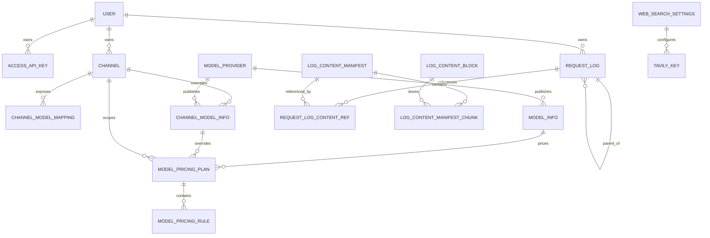
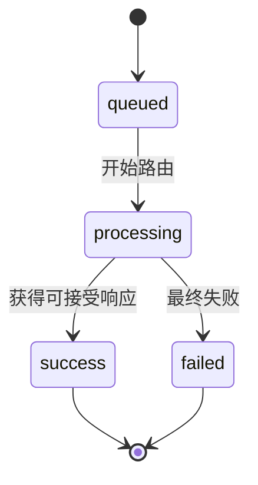

# 04. 领域模型与数据字典

> 需求前缀：`REQ-DAT`  
> 代码基线：`main@3827590`  
> 持久化基线：SQLite 与 PostgreSQL 双迁移

## 1. 建模原则

OpenCodex 的持久化模型围绕“用户拥有资源、资源参与路由、请求产生观测和成本”组织。数据模型需要同时支持：

- 管理台配置和代理运行时查询；
- 用户级隔离与超级管理员全局视图；
- 一个主请求对应多个渠道尝试或 OCR 子请求；
- 大段正文去重、压缩、完整性校验和按需读取；
- 全局模型目录、渠道级覆盖和多层价格继承；
- SQLite 单机和 PostgreSQL 服务端的同一业务语义。

## 2. 实体关系总览

## 3. 实体清单

| 实体 | 作用 | 归属/隔离 | 主要生命周期 |
|---|---|---|---|
| `User` | 管理台用户和代理租户主体 | 全局唯一用户名 | 创建、启停、删除 |
| `AccessApiKey` | 调用代理的 Bearer 凭证 | 一个用户 | 创建、启停、删除、轮换 |
| `Channel` | 上游服务连接与路由策略 | 一个用户 | 创建、编辑、启停、删除 |
| `ChannelModelMapping` | 请求模型到上游模型的映射 | 一个渠道 | 新增、编辑、停用、删除 |
| `ModelProvider` | 全局模型供应商 | 全局 | 创建、启停 |
| `ModelInfo` | 全局模型元数据与能力 | 全局/供应商 | 创建、编辑、停用 |
| `ChannelModelInfo` | 渠道级模型元数据覆盖 | 一个渠道 | 覆盖、恢复全局 |
| `ModelPricing` | 兼容旧模型价格的扁平定义 | 全局 | 播种/维护 |
| `ModelPricingPlan` | 模型、渠道或渠道模型的价格计划 | 多层作用域 | 创建、启用/停用 |
| `ModelPricingRule` | 价格计划中的计费规则 | 一个价格计划 | 创建、编辑、启用/停用 |
| `WebSearchSettings` | Web Search 模式和全局限制 | 全局 | 单例更新 |
| `TavilyKey` | Tavily 搜索凭证和用量 | 全局 | 新增、编辑、启停、删除 |
| `RequestLog` | 主请求、渠道尝试或 OCR 子请求的元数据 | 一个用户 | 排队、处理、完成、清理 |
| `LogContentBlock` | 内容寻址压缩块 | 全局共享 | 写入、复用、孤立清理 |
| `LogContentManifest` | 一个完整正文的分块清单 | 全局共享 | 写入、引用、孤立清理 |
| `LogContentManifestChunk` | Manifest 到 Block 的顺序关系 | Manifest | 随 Manifest 创建/清理 |
| `RequestLogContentRef` | 日志正文槽位到 Manifest 的引用 | 一个请求日志 | 写入、替换、删除 |

## 4. 用户和凭证模型

### 4.1 User

| 字段 | 类型 | 规则 | 产品含义 |
|---|---|---|---|
| `Id` | UUID | 主键 | 用户内部标识 |
| `Username` | string | 全局唯一、非空 | 登录名和展示名 |
| `PasswordHash` | string | 非空，不保存明文密码 | PBKDF2-SHA256 哈希 |
| `Role` | string | 当前为 `superadmin` 或 `user` | 管理角色 |
| `Enabled` | bool | 默认 `true` | 停用后不能登录或调用 |
| `CreatedAt` | epoch/double | 创建时间 | 审计和展示 |
| `UpdatedAt` | epoch/double | 更新时间 | 审计和缓存失效 |

业务约束：

- 用户名大小写、空白和允许字符必须在服务端统一规范化；
- 环境超级管理员由运行时配置维护，不能通过普通用户 API 降级或删除；
- 当前登录用户不能删除自己；
- 删除用户时同步清理或明确处理其渠道、访问 Key 和日志；
- 停用用户应立即阻止新登录和代理调用；
- 已存在的 Cookie 不能绕过服务端用户启用状态校验。

### 4.2 AccessApiKey

| 字段 | 类型 | 规则 | 产品含义 |
|---|---|---|---|
| `Id` | UUID | 主键 | Key 管理对象 |
| `OwnerUserId` | UUID | 必须指向 User | 租户归属 |
| `Name` | string | 非空 | 调用用途标签 |
| `KeyHash` | string | 唯一 | Bearer 校验索引 |
| `KeyPlaintext` | string? | 当前实现存在 | 明文保存策略冲突点 |
| `KeyPrefix` | string | 用于掩码展示 | 识别 Key 类型 |
| `KeySuffix` | string | 用于掩码展示 | 末尾识别 |
| `Enabled` | bool | 默认 `true` | 即时启停 |
| `CreatedAt` | epoch/double | 必填 | 创建时间 |
| `UpdatedAt` | epoch/double | 必填 | 修改时间 |
| `LastUsedAt` | epoch/double? | 可空 | 最近成功/尝试使用时间 |

产品规则：

1. Key 前缀为 `ocx_`，随机部分由安全随机数生成；
2. 客户端使用 `Authorization: Bearer <key>`；
3. 列表默认只展示掩码和元数据；
4. 创建响应是否展示完整 Key必须与安全策略统一；
5. 停用或删除后，缓存失效必须在产品承诺的时间窗口内生效；
6. 超级管理员创建 Key时可选择启用用户作为归属；
7. 普通用户只能创建和管理自己的 Key；
8. Key不能被用于管理台 Cookie 认证。

`REQ-DAT-001`（MUST）：访问 Key 的持久化、展示、导出和轮换策略必须在产品和安全评审中统一；不得同时宣称“仅创建时可见”和“数据库保留可恢复明文”而没有标注差异。

### 4.3 凭证字段分类

| 凭证 | 当前存储/使用 | 最低产品要求 |
|---|---|---|
| 管理员密码 | PBKDF2 哈希 | 禁止明文日志和 API 返回 |
| 管理 Cookie | Data Protection 加密 Cookie | 持久化密钥目录，支持失效 |
| OpenCodex 访问 Key | 哈希 + 当前实体含明文字段 | 统一单次展示/加密存储策略 |
| 渠道上游 API Key | `Channel.ApiKey` | 管理台掩码，禁止日志透传 |
| 自定义 Header | JSON 字符串 | 按 Header 名称和日志级别脱敏 |
| Tavily Key | `TavilyKey.ApiKey` | 测试和导出需要显式权限 |
| Secret Key | 配置值，用于 Data Protection 应用名隔离 | 生产不得使用示例值 |

## 5. 渠道模型

### 5.1 Channel

| 字段 | 类型 | 规则/默认 | 作用 |
|---|---|---|---|
| `OwnerUserId` | UUID | 必填 | 资源隔离 |
| `Position` | int | 同用户内排序 | 最终稳定排序 |
| `Priority` | int | 数字越小越优先 | 候选排序主因素 |
| `Name` | string | 同用户内应唯一 | 管理台名称 |
| `GroupName` | string | 可为空/默认未分组 | 管理台归并视图 |
| `Type` | string | `responses/chat/messages/images` | 上游协议方言 |
| `BaseUrl` | string | 必填、合法 URL | 上游地址 |
| `ApiKey` | string | 由认证模式决定 | 上游凭证 |
| `AuthMode` | string | `config` 或 `none` | 是否注入上游认证 |
| `HeadersJson` | JSON | 默认 `{}` | 自定义请求头 |
| `TimeoutSeconds` | int | 正数或运行时默认 | 单次上游超时 |
| `CircuitBreakDurationSeconds` | int | 正数 | 熔断开放时间 |
| `RetryCount` | int | 非负 | 同渠道重试次数 |
| `Capacity` | int | 当前校验要求正数 | 并发槽位数 |
| `CompatJson` | JSON | 默认 `{}` | 参数、工具和历史兼容规则 |
| `ModelsJson` | JSON 数组 | 默认 `[]` | 旧/兼容模型映射载荷 |
| `Enabled` | bool | 默认 `true` | 是否参与路由 |
| `CreatedAt/UpdatedAt` | epoch/double | 必填 | 生命周期 |

渠道业务规则：

- 只有启用渠道才进入候选列表；
- `images` 渠道不参与聊天流测试；
- Images 渠道重试次数固定为 0；
- Images 渠道必须有模型映射和图片 API 方言；
- 渠道字段中的 `${ENV_NAME}`/`$ENV_NAME` 可按配置展开；
- 导入通常以用户和名称作为合并语义，不应误当作无条件全量替换；
- 删除渠道后不能再被路由、展示为活跃或写入新的 attempt；
- 熔断健康状态属于运行时状态，不应被误写成持久化启用状态。

### 5.2 ChannelModelMapping

| 字段 | 类型 | 规则 | 作用 |
|---|---|---|---|
| `ChannelId` | UUID | 必填 | 所属渠道 |
| `Position` | int | 渠道内排序 | 同模型多个映射时稳定排序 |
| `RequestModel` | string | 非空 | 客户端模型名 |
| `UpstreamModel` | string | 非空 | 上游模型名 |
| `SupportsImage` | bool | 明确值 | 视觉能力路由和降级 |
| `ModelInfoId` | UUID? | 可选 | 关联全局模型 |
| `PricingMode` | string | 持久化值可为 `inherit_global` / `override_pricing` / `private_model` | 当前仅保存；成本解析器未读取该字段 |
| `PricingPlanId` | UUID? | 可选 | 当前仅保存和建索引；成本解析器未通过映射读取该字段 |
| `Enabled` | bool | 默认 `true` | 是否命中 |

模型映射规则：

1. 如果任一启用渠道存在模型映射，请求模型原则上必须精确命中启用映射；
2. 若所有启用渠道均无映射，系统可使用排序后的首个启用渠道并原样传递模型名；
3. 一旦进入映射模式，未配置映射的通用渠道不自动成为兜底；
4. 图片请求只有在候选映射明确支持图片时才直接路由；
5. 模型映射的请求名、上游名和能力状态必须在日志中可见。

## 6. 模型目录和价格

### 6.1 ModelProvider

| 字段 | 类型 | 规则 |
|---|---|---|
| `Code` | string | 全局唯一，推荐小写字母、数字、点、下划线、连字符 |
| `Name` | string | 非空展示名 |
| `Enabled` | bool | 是否显示/参与目录 |
| `SortOrder` | int | 供应商展示顺序 |
| `Source` | string | 内置、用户或导入来源 |

### 6.2 ModelInfo

| 字段 | 类型 | 说明 |
|---|---|---|
| `Scope` | string | 当前主要为 global |
| `ProviderId` | UUID | 供应商 |
| `ChannelId` | UUID? | 局部作用域时可用 |
| `ModelKey` | string | 对外模型标识 |
| `DisplayName` | string | 展示名 |
| `Description` | string | 描述 |
| `MatchType` | string | 服务层只接受 `exact/prefix/suffix/contains` |
| `MatchPattern` | string | 匹配键 |
| `CatalogJson` | JSON | Codex/客户端目录字段 |
| `CapabilitiesJson` | JSON | 图片等能力 |
| `Enabled` | bool | 删除操作实际通常是停用 |
| `Source` | string | 官方、默认、用户等 |

### 6.3 ChannelModelInfo

渠道级模型信息用于覆盖上游模型的展示、能力、Catalog 和定价；删除覆盖时恢复全局定义，而不是删除上游模型。

### 6.4 ModelPricingPlan 与 Rule

`ModelPricingPlan` 的实体字段允许携带 `ModelInfoId`、`ChannelModelInfoId` 和 `ChannelId`。当前服务实际创建和解析的组合只有：

- 全局模型计划：`ModelInfoId` 非空，`ChannelModelInfoId` 与 `ChannelId` 为空；
- 渠道模型覆盖计划：`ChannelModelInfoId` 与对应 `ChannelId` 非空，`ModelInfoId` 为空。

当前成本解析不会读取 `ChannelModelMapping.PricingMode/PricingPlanId`，也没有独立的“仅绑定渠道”价格回退层。解析顺序为：先按渠道与上游模型精确查找启用的 `ChannelModelInfo` 及其计划；不存在渠道覆盖时，再按 `exact → prefix → suffix → contains` 查找启用的全局 `ModelInfo` 及其计划。若命中渠道覆盖但覆盖没有有效计划，当前实现直接生成零成本快照，不再回退到全局计划。

每个计划包含多个计费规则，当前计费项包括：

- `input`；
- `output`；
- `cache_write`；
- `cache_read`。

计费模式包括：

- `per_request`：按请求计费；
- `per_million_tokens`：按百万 Token；
- `tiered_tokens`：按阶梯 Token。

价格规则必须保存币种、单位价格、阶梯 JSON、启用状态和来源，并在请求完成时形成定价快照，避免未来改价重算历史成本。

## 7. Web Search 模型

### 7.1 WebSearchSettings

| 字段 | 取值 | 说明 |
|---|---|---|
| `Mode` | `simulate` / `convert` / `disabled` | 全局 Web Search 处理策略；缺失或非法持久值在读取执行路径回退为 `convert` |
| `KeyUsageLimit` | 正整数 | 无设置行时 API 使用默认值 1000；保存/导入接口要求大于 0 |
| `CreatedAt/UpdatedAt` | 时间 | 配置生命周期 |

当前配置只允许超级管理员读取和修改。普通用户不能为自己选择模式。

### 7.2 TavilyKey

| 字段 | 说明 |
|---|---|
| `Position` | Key 选择顺序 |
| `Provider` | 当前主要为 `tavily` |
| `ApiKey` | 第三方搜索凭证 |
| `Enabled` | 是否可选 |
| `UsageCount` | 已使用次数 |
| `UsageLimit` | 单 Key 上限 |
| `CreatedAt/UpdatedAt` | 生命周期 |

可用 Key 定义为：启用且 `UsageCount < UsageLimit`。达到上限的 Key 不得继续用于模拟搜索。

## 8. 请求日志模型

### 8.1 RequestLog

| 字段组 | 字段 | 产品含义 |
|---|---|---|
| 标识 | `Id`、`RequestId` | 数据库 ID 与调用链 ID |
| 时间 | `CreatedAt`、`ProcessingStartedAt`、`CompletedAt` | 请求生命周期 |
| HTTP | `Method`、`Path`、`ClientIp` | 入口信息 |
| 模型 | `Model`、`UpstreamModel` | 请求/上游模型 |
| 渠道 | `ChannelId` | 命中渠道 |
| 类型 | `RequestType` | `main`、`attempt`、`ocr` |
| 父子 | `ParentRequestLogId` | 主请求与子请求关联 |
| 会话 | `ConversationKey`、`ConversationTurnId`、`ConversationWindowId`、`PreviousResponseId` | Codex/会话链路 |
| 流式 | `IsStream`、`TtftMs` | 是否流式和首字延迟 |
| 结果 | `DurationMs`、`StatusCode`、`LifecycleStatus`、`Error` | 状态和错误 |
| Usage | `InputTokens`、`CachedTokens`、`CacheWriteTokens`、`CacheReadTokens`、`OutputTokens` | Token 统计 |
| 计费 | `Cost`、`CostCurrency`、`PricingModelInfoId`、`PricingPlanId`、`PricingSnapshotJson` | 成本和计算依据 |
| 归属 | `OwnerUserId`、`ApiKeyId` | 租户和调用凭证 |

主请求生命周期：

当前持久化状态常量只有 `queued`、`processing`、`success`、`failed`。客户端取消没有独立的 `cancelled` 状态；流式取消会留下错误文本，并按现有完成判定落为 `failed`。

请求类型语义：

- `main`：客户端可见的一次完整请求；
- `attempt`：主请求选择某个渠道的一次尝试，可有多个；
- `ocr`：为图片降级生成的内部视觉识别请求；
- 子日志必须通过 `ParentRequestLogId` 可回到主请求；
- attempt 失败不等于主请求失败，最终状态以主请求为准。

### 8.2 内容寻址实体

| 实体 | 关键字段 | 规则 |
|---|---|---|
| `LogContentBlock` | `Sha256`、`RawLength`、`StoredLength`、`Compression`、`Data` | 相同哈希复用；压缩后更小时保存 Brotli |
| `LogContentManifest` | `Sha256`、`RawLength`、`ChunkCount`、`Encoding` | 描述一个完整正文 |
| `LogContentManifestChunk` | `ManifestId`、`Ordinal`、`BlockId`、`RawLength` | 按序重组正文 |
| `RequestLogContentRef` | `RequestLogId`、`Slot`、`ManifestId` | 将请求日志槽位映射到正文 |

当前持久化枚举严格定义 8 个槽位，枚举值属于数据库契约，只能追加：

| 枚举值 | 槽位 | 内容 |
|---:|---|---|
| 1 | `RequestHeaders` | 客户端请求头 |
| 2 | `RequestBody` | 原始客户端请求正文或序列化后的入口载荷 |
| 3 | `UpstreamRequestBody` | 转换后的上游请求正文 |
| 4 | `UpstreamResponseBody` | 上游响应正文 |
| 5 | `ResponseBody` | 客户端响应或错误响应正文 |
| 6 | `WebSearchJson` | Web Search 模拟详情 |
| 7 | `OcrJson` | OCR 元数据 |
| 8 | `StreamLinesJson` | 带 sequence/source/raw_line 的流式原始行集合 |

内容存储必须满足：

1. 写入与引用更新使用事务；
2. 读取时校验哈希和分块顺序；
3. 替换引用后清理不再被引用的 Manifest/Block；
4. 删除日志不能破坏仍被其他日志引用的共享块；
5. 内容损坏时返回可诊断错误，不返回静默截断正文。

## 9. 约束和索引

当前数据库索引重点包括：

- User.Username 唯一；
- AccessApiKey.KeyHash 唯一；
- Channel 按 Owner + Position、Owner + Priority + Position；
- ChannelModelInfo 按 Channel + UpstreamModel 唯一；
- ModelProvider.Code 唯一；
- ModelPricing.ModelId 唯一；
- RequestLog 按创建时间、模型、上游模型、渠道、类型、状态、父 ID、会话字段、路径、状态码、Key、Owner + Id；
- LogContentBlock.Sha256 唯一；
- LogContentManifest.Sha256 唯一。

`REQ-DAT-002`（MUST）：所有租户资源查询必须在数据库查询或服务层使用 Owner/User 约束，不能只在前端隐藏记录。

`REQ-DAT-003`（MUST）：历史请求成本必须使用完成请求时的价格快照，不得因后续修改模型价格而改变历史账单。

`REQ-DAT-004`（MUST）：删除或停用操作必须明确区分软删除、硬删除和恢复语义；模型“删除”若实际是停用，产品文案和验收必须统一使用“停用”。

`REQ-DAT-005`（SHOULD）：凭证和日志正文应支持加密存储或外部密钥管理；当前明文字段和导出能力必须进入安全风险评审。

## 10. 数据生命周期

### 10.1 用户删除

必须定义以下对象如何处理：

- 访问 Key：默认撤销后删除；
- 渠道：停止路由并删除或转移；
- 渠道模型映射：随渠道处理；
- 日志元数据：保留、匿名化或删除（`TBD`）；
- 日志正文引用：级联删除引用，保留仍被使用的共享内容；
- 定价快照：历史统计若保留，则随日志保留；
- 会话 Cookie：用户被删除后立即失效。

### 10.2 日志清理

当前提供超级管理员清空日志的入口，但没有产品化保留期。正式规则至少需要定义：

- 元数据和正文是否同一保留期；
- 是否支持按时间、用户、容量清理；
- 清理前是否需要导出或二次确认；
- 清理过程中如何避免共享块悬挂；
- 清理对统计结果的影响；
- 是否记录清理操作审计。

### 10.3 价格变更

1. 管理员新增或修改价格计划；
2. 新请求使用最新有效计划；
3. 完成请求生成定价快照；
4. 历史日志保留原快照；
5. 删除/停用旧计划不应使历史成本失去解释。

## 11. 数据验收标准

| 编号 | 验收 |
|---|---|
| `AC-DAT-01` | 创建用户后只能在其 Owner 范围内看到渠道、Key 和日志 |
| `AC-DAT-02` | 删除/停用 Key 后缓存和实际鉴权均在约定窗口内失效 |
| `AC-DAT-03` | 一个主请求可关联多个 attempt 和 OCR 子日志 |
| `AC-DAT-04` | 日志详情可从内容引用重建原始正文并校验哈希 |
| `AC-DAT-05` | 相同正文不会重复存储相同内容块 |
| `AC-DAT-06` | 删除日志不会删除仍被其他日志引用的共享内容 |
| `AC-DAT-07` | 价格变更不改变已有日志成本 |
| `AC-DAT-08` | SQLite 与 PostgreSQL 的实体约束和业务结果一致 |
| `AC-DAT-09` | 模型级覆盖删除后可恢复全局模型信息 |
| `AC-DAT-10` | 用户删除、停用和超级管理员保护规则均有测试 |

## 12. 源码和测试追溯

| 模型区域 | 源码 |
|---|---|
| 用户、Key、渠道 | `opencodex_proxy/src/Libraries/OpenCodex.Domain/Domain/` |
| 模型和价格 | `ModelInfo.cs`、`ModelPricingPlan.cs`、`ModelPricingRule.cs`、`ModelCatalogService.cs`、`ModelPricingService.cs` |
| 日志实体 | `RequestLog.cs`、`LogContent.cs` |
| EF 模型 | `opencodex_proxy/src/Libraries/OpenCodex.Data/OpenCodexDbContextBase.cs` |
| 迁移 | `opencodex_proxy/src/Libraries/OpenCodex.Data/Migrations/` |
| 内容编码 | `OpenCodex.Core/Services/Proxy/LogContentCodec.cs` |
| 内容存储 | `OpenCodex.Core/Services/Proxy/LogContentStore.cs` |
| 日志写入 | `OpenCodex.Core/Services/Proxy/ProxyLogService.cs` |
| 相关测试 | `LogContentCodecTests.cs`、`LogContentStoreTests.cs`、`ObservabilityServiceTests.cs`、`ModelPricingServiceTests.cs`、`ModelCatalogServiceTests.cs` |
