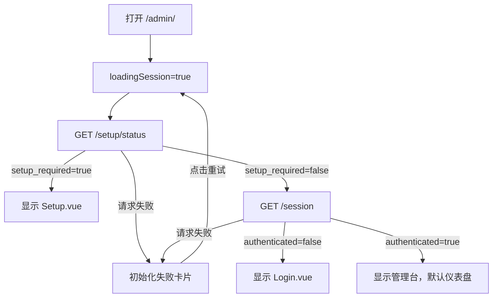
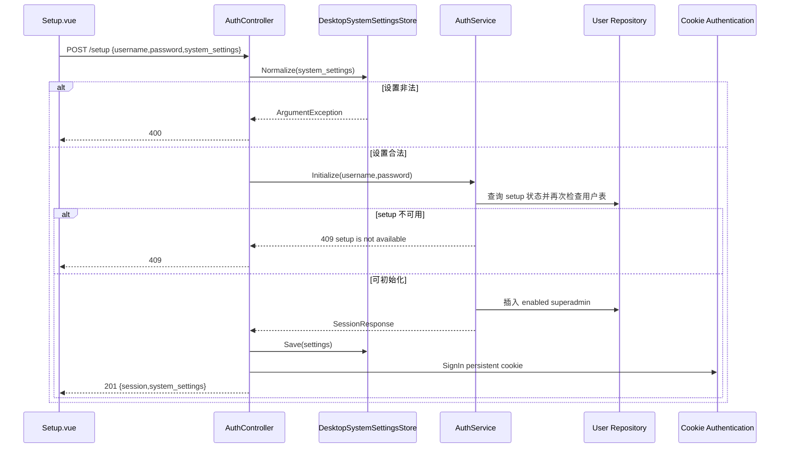
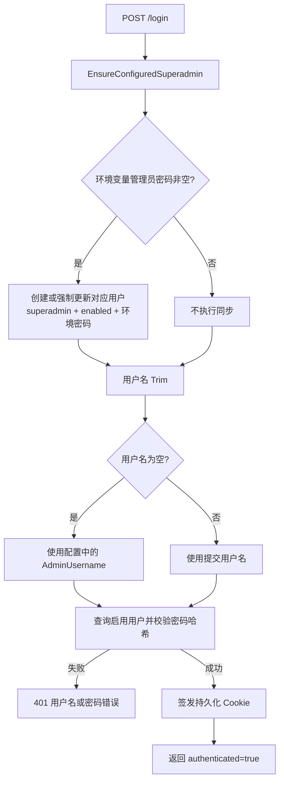
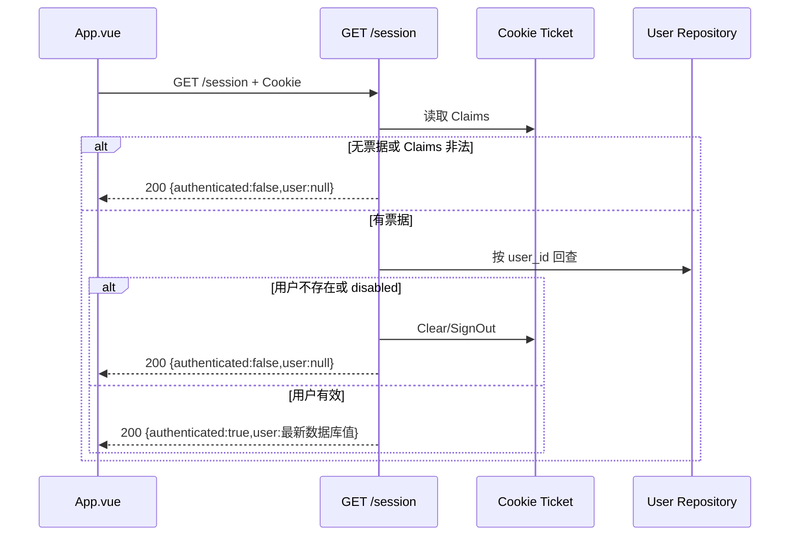

# 05 初始化、登录与管理台会话 PRD

## 0. 文档元数据

| 项目 | 内容 |
|---|---|
| 文档 ID | PRD-05 |
| 需求编号前缀 | `REQ-AUTH` |
| 文档状态 | Draft，基于当前代码反向梳理并补齐产品化要求 |
| 版本 | 1.0 |
| 代码基线 | `main@3827590` |
| 编写日期 | 2026-08-17 |
| 适用端 | Web 管理台、Tauri 桌面端、管理 API |
| 主要读者 | 产品、交互/UI、前端、后端、安全、测试、运维 |
| 关联文档 | [02 用户与权限](./02-users-and-permissions.md)、[03 系统边界](./03-system-boundary.md)、[10 管理台](./10-admin-console.md)、[12 配置](./12-configuration.md) |

### 0.1 事实与要求标记

本文对四类内容作严格区分：

- **当前实现事实**：基线源码、运行配置或自动化测试已经能够证明的行为。
- **产品化要求**：正式产品必须或应当满足的目标行为，以 `REQ-AUTH-*` 编号。
- **已知限制**：当前实现与目标行为之间的缺口、竞态、风险或体验问题。
- **TBD**：无法仅根据现有代码确定、需要产品/安全/架构负责人决策的事项。

### 0.2 规范关键词

- **MUST**：发布阻断项，不满足即验收失败。
- **SHOULD**：原则上应实现；不实现时必须记录原因、影响、负责人和补齐计划。
- **管理台会话**：用户名密码认证成功后，通过 Cookie `opencodex_admin_auth` 维持的人机管理身份。
- **代理访问身份**：客户端通过 Bearer Access API Key 调用 `/v1/*` 时形成的身份，不属于本文的 Cookie 会话。
- **环境变量超级管理员**：由运行配置中的管理员用户名/密码维护、登录时同步到用户表的超级管理员。

---

## 1. 背景与问题定义

OpenCodex 同时支持服务端部署和 Tauri 桌面部署。一个全新实例在可用前，需要解决三件事：

1. 判断实例是否允许首次初始化；
2. 创建第一个可登录的超级管理员；
3. 确定后端监听范围、端口和 Probe 拦截设置，并在桌面端需要时重启后端。

初始化完成后，管理台还必须稳定处理登录、会话恢复、Cookie 续期、退出、用户停用或删除后的会话失效，以及浏览器刷新、后端重启和多实例部署时的票据验证。

当前代码已经形成了可工作的主链路，但仍存在以下产品化问题：

- 首次初始化写用户与写系统设置不在同一事务内，后半段失败可能留下“已有用户但设置未保存”的半初始化状态；
- 用户名和密码只做“去首尾空格后非空”校验，没有长度、字符集、弱密码和泄漏密码规则；
- 登录没有速率限制、失败锁定、验证码或风险检测；
- Cookie 虽持久化并支持滑动续期，但没有会话版本、安全戳或服务端会话清单；密码重置后旧 Cookie 仍可能继续有效；
- 管理台没有全局 401/403 拦截，页面内 API 遇到会话失效通常只弹出错误 Toast；
- 没有 Vue Router，登录后无法可靠恢复原访问页面或浏览器历史；
- Cookie 使用 `SecurePolicy=SameAsRequest`，在 HTTP 或局域网模式下不会携带 `Secure`；
- 缺少显式 CSRF 令牌和统一的认证安全审计；
- Tauri 的 Rust 设置结构不包含 `intercept_probe_requests`，重启时可能把该字段从设置文件中移除并恢复为 `false`。

本文定义从应用启动到会话终止的完整产品契约。

---

## 2. 目标、范围与非目标

### 2.1 产品目标

1. 让全新实例能够安全、可恢复、可验证地完成一次且仅一次初始化。
2. 让用户在 Web、Docker 和 Tauri 形态下获得一致的登录与会话体验。
3. 明确 Cookie 属性、过期、续期、撤销、密钥持久化和多实例共享规则。
4. 让停用、删除、重置密码和角色变化及时作用于已有会话。
5. 为 401、403、后端不可达、后端重启和初始化竞态提供一致反馈。
6. 保持管理台 Cookie 与代理 Bearer Access API Key 完全隔离。
7. 为产品、研发和测试提供逐条可执行的验收标准与源码追溯。

### 2.2 范围

- `/admin/` 首次加载状态机。
- `/setup/status` 初始化资格判断。
- 首次超级管理员创建。
- 初始化页的系统监听设置。
- `/login`、`/session`、`/logout`。
- Cookie 票据、Data Protection 密钥和会话有效期。
- 环境变量超级管理员在登录时的同步行为。
- 用户停用、删除、密码重置对会话的影响。
- Tauri 后端重启及管理台地址切换。
- 登录/初始化页的桌面、移动、错误和无障碍规范。
- 认证相关安全、审计、测试和开放决策。

### 2.3 非目标

- 企业 SSO、OIDC、SAML、LDAP 的具体实现。
- MFA、Passkey 或硬件安全密钥的具体交互方案。
- 自定义 RBAC 角色编辑器。
- `/v1/*` Bearer API Key 的完整生命周期；详见 [02 用户与权限](./02-users-and-permissions.md)。
- 渠道上游凭证认证；详见 [06 渠道管理](./06-channel-management.md)。
- TLS 证书自动签发的具体技术选型。

上述能力可以后续扩展，但不得破坏本文定义的初始化唯一性、会话撤销和身份域隔离。

---

## 3. 身份域、信任边界与角色

### 3.1 身份域

| 身份域 | 凭证 | 使用入口 | 当前用途 | 本文要求 |
|---|---|---|---|---|
| 管理台身份 | Cookie `opencodex_admin_auth` | `/session`、用户、渠道、日志、配置等管理 API | 浏览器中的人机管理身份 | 仅管理 API 接受；每次敏感请求回查用户状态 |
| 代理访问身份 | `Authorization: Bearer ocx_...` | `/v1/*` 兼容接口 | CLI/SDK/应用调用代理 | 不得登录管理台，不得替代 Cookie |
| 上游身份 | 渠道 API Key/Headers | OpenCodex 到模型供应商 | 上游请求认证 | 不得出现在管理台会话和认证日志中 |

### 3.2 角色与认证能力

| 主体 | 查看 setup 状态 | 执行首次 setup | 登录 | 建立管理台 Cookie | 退出 |
|---|---:|---:|---:|---:|---:|
| 未认证访问者 | 是 | 仅 `setup_required=true` 时 | 是 | 登录/setup 成功后 | 是，幂等 |
| 普通用户 | 是 | 否 | 是，且用户启用 | 是 | 是 |
| 超级管理员 | 是 | 否 | 是，且用户启用 | 是 | 是 |
| Bearer API Key 调用方 | 不赋予额外权限 | 否 | 否 | 否 | 否 |

### 3.3 当前服务端权限机制

- `/setup/status`、`/setup`、`/login`、`/session`、`/logout` 位于 `AuthController`，不依赖 `[Authorize]` 特性。
- 其他管理控制器通过 `IWorkContext.RequireUser()` 或 `RequireSuperadmin()` 执行服务端最终鉴权。
- Cookie 内含用户 ID、用户名、角色和 enabled Claim。
- 受保护请求不会只信任 Cookie Claim；`SessionService` 会按用户 ID 回查用户表，并拒绝不存在或已停用的用户。
- 角色由回查后的数据库值返回，因此后端权限判定可感知角色变更。

---

## 4. 应用启动与页面分流

### 4.1 当前前端启动状态机

`App.vue` 挂载后执行 `initApp()`：



### 4.2 当前实现事实

- 初始 `activeTab` 固定为 `dashboard`。
- 初始化状态请求完成前显示“正在加载管理台”的 `el-empty`。
- 任一启动请求抛错时显示“初始化失败”卡片、错误文本和“重试”按钮。
- 当 `setup_required=true` 时不继续请求 `/session`。
- 当 `setup_required=false` 且 `/session` 返回未认证时显示登录页。
- 当前没有 Vue Router；URL 不表示当前页面，刷新后始终回到启动状态机并最终进入仪表盘。
- 当前 API helper 未配置显式 `credentials`；同源 fetch 默认发送 `same-origin` Cookie，开发代理也维持同源 `/admin/*` 请求。

### 4.3 产品化页面状态

| 状态 | 触发条件 | 主内容 | 允许操作 | 禁止行为 |
|---|---|---|---|---|
| 启动加载 | 正在查询 setup/session | 品牌加载态或骨架屏 | 无，必要时允许取消重试 | 不短暂闪现登录或管理页 |
| 初始化失败 | setup 状态或 session 请求失败 | 错误摘要、重试、诊断 ID | 重试、复制诊断信息 | 不把原始堆栈直接展示给用户 |
| 需要初始化 | `setup_required=true` | 初始化表单 | 完成初始化 | 不显示普通登录入口绕过 setup |
| 未登录 | `setup_required=false` 且 session 未认证 | 登录表单 | 登录 | 不显示受保护页面数据 |
| 已登录 | session 已认证且用户有效 | 角色对应的管理台 | 业务操作、退出 | 不允许通过前端状态访问越权页 |
| 会话失效 | 业务请求返回 401 | 会话失效提示和登录页 | 重新登录 | 不保留密码、完整 Key 等敏感草稿 |

---

## 5. 首次初始化资格

### 5.1 判定公式

当前后端的初始化资格为：

```text
setup_required = (用户表中没有任何用户) AND (未配置环境变量超级管理员密码)
```

### 5.2 `/setup/status` 返回字段

| 字段 | 类型 | 当前语义 |
|---|---|---|
| `setup_required` | boolean | 是否允许并要求首次初始化 |
| `has_users` | boolean | 用户表是否至少存在一条用户记录，不区分启停或角色 |
| `environment_superadmin_configured` | boolean | 运行配置中的管理员密码是否非空 |
| `system_settings` | object | 当前监听设置，包括访问模式、绑定地址、端口、桌面托管、重启标识、Probe 拦截等 |

### 5.3 判定矩阵

| 用户表 | 环境变量管理员密码 | `setup_required` | 启动页面 | 说明 |
|---|---|---:|---|---|
| 空 | 空 | true | 初始化页 | 唯一允许 setup 的状态 |
| 空 | 非空 | false | 登录页 | 环境变量超级管理员在首次登录时创建 |
| 非空 | 空 | false | 登录页 | 使用数据库用户登录 |
| 非空 | 非空 | false | 登录页 | 登录前会同步环境变量超级管理员 |

### 5.4 当前边界

- `has_users` 只判断是否有记录；即使所有用户均停用或没有超级管理员，setup 仍不可用。
- 环境变量管理员仅以“密码非空”判定已配置；用户名为空时登录同步逻辑回退为 `admin`。
- `/setup/status` 是公开接口，会返回部分系统监听信息。
- 删除全部数据库用户后，如果没有环境变量超级管理员，实例会重新进入可 setup 状态；是否允许生产环境“二次初始化”当前没有单独锁定标识。

---

## 6. 初始化页面与字段规范

### 6.1 页面结构

当前 `Setup.vue` 使用居中的卡片：

1. 标题：`OpenCodex 初始化`；
2. 说明：`创建超级管理员并设置本机服务`；
3. 超级管理员用户名；
4. 超级管理员密码；
5. 访问范围；
6. LAN 风险提示；
7. 后端端口；
8. 拦截探测请求开关；
9. 完成初始化按钮。

### 6.2 字段定义

| 字段 | UI 控件 | 当前默认值 | 当前前端约束 | 当前后端约束 | 产品化要求 |
|---|---|---|---|---|---|
| `username` | 文本输入 | `admin` | 无显式 rule；Enter 可提交 | Trim 后非空 | 字符集、长度、大小写规则明确；显示内联错误 |
| `password` | 密码输入，可显隐 | 空 | 无显式 rule；Enter 可提交 | Trim 后非空；保存安全哈希 | 强度、最小长度、泄漏密码与确认输入策略明确 |
| `access_mode` | 分段选择 | 设置值，否则 `localhost` | `localhost`/`lan` | 兼容 `local`/`network`，最终归一化 | UI 只提交规范值 |
| `port` | 数字输入 | 设置值，否则 `18080` | 1024–65535，步长 1 | 1024–65535 | 校验端口占用并给出可恢复错误 |
| `intercept_probe_requests` | 开关 | 设置值，否则 false | boolean | 缺失时沿用当前值 | 文案解释对 Probe 请求的影响 |

### 6.3 密码当前事实

- 初始化和登录均对密码执行 `Trim()`。
- 仅包含空格的密码会被视为空并拒绝。
- 用户实际意图使用的首尾空格不会成为密码的一部分。
- 当前没有确认密码字段、最小长度、复杂度提示或 Caps Lock 提示。
- 密码提交后，前端会把本地 `password` 置空。

### 6.4 LAN 模式

- `localhost` 映射到 `127.0.0.1`。
- `lan` 映射到 `0.0.0.0`。
- 选择 LAN 时当前页面显示 warning：同一网络内设备可连接当前服务。
- 当前 Tauri 和默认服务监听使用 HTTP；LAN 模式并不自动配置 TLS、防火墙或可信网段。

### 6.5 提交状态

| 状态 | 当前行为 | 产品化要求 |
|---|---|---|
| 初始 | 显示表单 | 首个无效字段应可见但不抢焦点 |
| 提交中 | 主按钮显示 loading | 禁止重复提交；字段锁定或说明仍在保存 |
| 字段错误 | Toast 显示后端 message | 字段级错误就近展示，并保留非敏感输入 |
| 成功且无需重启 | 触发 `setup-complete` | 进入已认证管理台 |
| 成功且 Tauri 需重启 | 调用 `restart_backend` 并跳转 | 展示重启进度、超时与恢复入口 |
| 成功但重启失败 | 当前只 Toast，最终 loading 结束 | 明确“账号已创建/设置已保存”，提供再次重启或新地址 |

---

## 7. 初始化后端流程、原子性与竞态

### 7.1 当前执行顺序



### 7.2 当前实现事实

- 系统设置先归一化，后创建用户，可避免明显非法设置先写用户。
- `AuthService.Initialize` 在插入前两次检查 setup/用户表。
- 创建用户时角色固定 `superadmin`、状态固定 enabled。
- 重复初始化返回 HTTP 409，message 为 `setup is not available`。
- 设置保存成功后才签发 Cookie，接口成功状态为 201。
- 当前测试覆盖首次创建成功和第二次调用返回 409。

### 7.3 已知原子性问题

用户写入数据库、设置文件写入和 Cookie 签发不在同一原子事务中：

1. 用户已插入后，若设置文件写入失败，接口会异常失败；
2. 后续 `/setup/status` 因已有用户而返回不再需要 setup；
3. 用户可能仍可用提交的账号登录，但用户会认为初始化失败；
4. 并发请求仍可能同时通过“无用户”检查，最终行为依赖数据库约束和异常处理；
5. 当前没有持久化的 `installation_initialized` 标志或 setup 锁。

### 7.4 产品化恢复原则

- 初始化操作必须可判定为“未开始、已完成、可恢复失败”之一。
- 不得让用户在没有明确提示的情况下陷入半初始化状态。
- 并发 setup 只能有一个成功，其他请求应得到稳定 409，不得返回未处理的 500。
- 若用户创建成功而设置保存失败，系统应补偿删除新用户，或记录可恢复 setup 状态并允许继续。
- Cookie 签发失败不得回滚已经成功的安全初始化，但必须提供显式重新登录路径。

---

## 8. 初始化成功、自动登录与 Tauri 重启

### 8.1 成功响应

`POST /setup` 成功返回：

```json
{
  "ErrorCode": 0,
  "ErrorMsg": null,
  "succeeded": true,
  "Data": {
    "session": {
      "authenticated": true,
      "user": {
        "user_id": "UUID",
        "username": "admin",
        "role": "superadmin",
        "enabled": true
      }
    },
    "system_settings": {
      "access_mode": "localhost",
      "bind_host": "127.0.0.1",
      "port": 18080,
      "managed_by_desktop": true,
      "restart_required": false,
      "intercept_probe_requests": false,
      "admin_url": "http://127.0.0.1:18080/admin/"
    }
  }
}
```

字段以实际 DTO 序列化为准；上例用于表达契约结构。

### 8.2 无需重启

- 前端清空密码。
- `needsSetup=false`。
- 直接用响应中的 `session` 设置认证用户。
- `activeTab` 设为 `dashboard`。
- 管理台不额外调用一次 `/login`。

### 8.3 Tauri 需要重启

当 `system_settings.restart_required=true` 且检测到 Tauri runtime：

1. 前端动态导入 `@tauri-apps/api/core`；
2. 调用 `invoke("restart_backend")`；
3. Rust 侧停止当前 sidecar；
4. 从桌面设置文件重新加载访问模式和端口；
5. 用新 `ASPNETCORE_URLS` 启动 sidecar；
6. 最多等待 15 秒，按 `127.0.0.1:newPort` 探测端口；
7. 返回 `http://127.0.0.1:<port>/admin/`；
8. 页面用 `window.location.href` 导航到新地址。

### 8.4 Tauri 当前边界

- 后端重启会造成短暂不可用。
- 管理台 origin 的端口发生变化后，旧 origin 的 Cookie 不一定能无缝作用于新 origin；Cookie 不按端口隔离，但 host、scheme、path 和浏览器策略仍需验证。
- Rust `DesktopSettings` 当前只有 `access_mode`、`bind_host`、`port`；C# 文件中的 `intercept_probe_requests` 会在 Rust 读取并重写时丢失。
- `wait_for_backend` 只验证 TCP 端口可连接，不验证数据库迁移、管理台静态文件或 `/session` 可用。
- 重启失败后初始化账号可能已经创建，用户不应被引导重复 setup。

---

## 9. 登录流程

### 9.1 登录页面

当前 `Login.vue` 包含：

- 标题：`OpenCodex 管理台`；
- 说明：`请输入用户名和密码`；
- 用户名输入，`autocomplete=username`；
- 密码输入，可显隐，`autocomplete=current-password`；
- 登录按钮；
- 用户名或密码输入框按 Enter 均可提交。

### 9.2 请求契约

| 项目 | 当前实现 |
|---|---|
| 方法 | `POST` |
| 路径 | `/login` |
| Content-Type | `application/x-www-form-urlencoded` |
| 请求字段 | `username`、`password` |
| 成功 | HTTP 200 + authenticated session + Set-Cookie |
| 失败 | HTTP 401，统一文案“用户名或密码错误” |

### 9.3 服务端登录逻辑



### 9.4 当前实现事实

- 登录前会同步环境变量超级管理员。
- 环境变量超级管理员已存在时，其密码、角色和 enabled 会被每次登录强制覆盖。
- 提交用户名为空时，后端回退到运行配置的管理员用户名；前端没有主动使用这一能力。
- 用户不存在、已停用或密码错误统一返回 401 和相同文案，避免直接枚举具体原因。
- 登录成功后清空前端密码并切换到仪表盘。
- 当前没有“记住我”开关；所有成功登录均签发持久 Cookie。
- 当前没有登录失败次数、限流、锁定时间、验证码、设备管理或异常登录通知。

### 9.5 产品化登录交互

| 场景 | 要求 |
|---|---|
| 字段为空 | 阻止提交，在字段下显示错误，焦点移动到首个错误字段 |
| 正在登录 | 按钮 loading；禁止重复提交；允许保留用户名，不显示明文密码 |
| 凭据错误 | 使用统一文案，不暴露用户是否存在；密码字段清空 |
| 账户停用 | 对外仍可使用统一凭据错误；管理员审计中记录停用原因 |
| 429 | 告知稍后再试和可用等待时间，不自动高频重试 |
| 网络失败 | 区分“服务不可达”与“凭据错误”，保留用户名 |
| 成功 | 清理登录错误，恢复允许的原目标页或默认仪表盘 |

---

## 10. 管理台会话与 Cookie 契约

### 10.1 Cookie 当前配置

| 属性 | 当前值/行为 | 说明 |
|---|---|---|
| Scheme | `OpenCodexAdmin` | ASP.NET Cookie Authentication scheme |
| Name | `opencodex_admin_auth` | 管理台会话 Cookie 名称 |
| HttpOnly | true | JS 无法直接读取 |
| SameSite | Lax | 限制部分跨站请求携带 |
| SecurePolicy | SameAsRequest | HTTPS 请求签发 Secure；HTTP 请求不签发 Secure |
| IsEssential | true | 标记为必要 Cookie |
| 默认寿命 | 30 天 | 可由 `OPENCODEX_ADMIN_COOKIE_DAYS` 等配置改变，非法值回退 30 |
| SlidingExpiration | true | 活跃会话可滑动续期 |
| IsPersistent | true | Set-Cookie 包含 Expires 或 Max-Age |
| AllowRefresh | true | 允许刷新认证票据 |
| 登录重定向 | 关闭 | 未认证返回 401，不跳 HTML 登录页 |
| 拒绝重定向 | 关闭 | 无权限返回 403 |

### 10.2 Cookie Claims

| Claim | 当前值 | 用途 |
|---|---|---|
| `opencodex_admin_user_id` | 用户 UUID | 稳定回查用户 |
| `ClaimTypes.Name` | username | 展示和身份信息 |
| `ClaimTypes.Role` | role | 票据内角色快照 |
| `opencodex_admin_enabled` | true/false | 票据内状态快照；最终仍需回查数据库 |

### 10.3 `/session` 行为



### 10.4 当前实现事实

- `/session` 未登录时返回 HTTP 200，而不是 401。
- Cookie Claims 缺失、user ID 非 UUID或票据未认证时视为未登录。
- 用户被删除或停用时，`/session` 清除 Cookie 并返回未登录。
- 受保护管理 API 遇到同样情况返回 401，并同步清除 Cookie。
- 会话票据不依赖服务端 session 表，属于受 Data Protection 保护的自包含 Cookie。
- 当前角色回查使用数据库最新值，因此权限降级可在下一次受保护请求生效。
- 密码重置不会改变用户 ID、Cookie 版本或安全戳，旧 Cookie 不会因此自动失效。

### 10.5 Data Protection 密钥

- 密钥持久化到配置路径；默认 `logs/.keys`。
- Tauri 把应用数据目录下的 `keys` 作为 `OPENCODEX_DATA_PROTECTION_KEYS_PATH`。
- Application Name 为 `OpenCodex.Admin.<digest-prefix>`。
- digest 来自 `OPENCODEX_SECRET_KEY` 的 SHA-256 前 16 个十六进制字符。
- secret 未配置或空时使用默认值 `change-me-session-secret`。
- 测试证明：数据库路径和 Data Protection keys 路径不变时，应用重启后原 Cookie 仍有效。

### 10.6 多实例含义

若多个实例需要接受同一管理台 Cookie，至少必须共享：

1. 同一 Data Protection key ring；
2. 同一 Application Name，即相同 secret；
3. 兼容的 Cookie 名、认证 scheme 和域/path 配置；
4. 同一用户数据源或一致用户状态；
5. 时间同步。

当前默认文件系统 key ring 更适合单实例；多实例共享路径、密钥轮换和并发写入策略需部署规范明确。

---

## 11. 会话续期、撤销与退出

### 11.1 会话状态变化矩阵

| 事件 | 当前 Cookie 本身 | 下一次 `/session` | 下一次受保护 API | 产品化目标 |
|---|---|---|---|---|
| 正常活跃 | 可滑动续期 | authenticated | 允许 | 受绝对时长和空闲时长共同约束 |
| 用户停用 | 浏览器仍可能暂存 | 清除并返回未登录 | 401并清除 | 尽快全局失效 |
| 用户删除 | 浏览器仍可能暂存 | 清除并返回未登录 | 401并清除 | 尽快全局失效 |
| 角色修改 | 旧票据含旧 role | 返回数据库最新 role | 权限按数据库最新 role | UI同步刷新菜单 |
| 密码重置 | 保持有效 | 仍 authenticated | 仍可能允许 | 默认撤销该用户全部既有会话 |
| secret 更改 | 无法解密 | 未登录 | 401 | 作为全局强制下线手段，需受控 |
| key ring 丢失 | 无法解密 | 未登录 | 401 | 部署升级不得意外发生 |
| 点击退出 | SignOut 删除 Cookie | 未登录 | 401 | 幂等并清理前端敏感状态 |

### 11.2 当前退出流程

1. 前端 `POST /logout`，body 为 `{}`；
2. 后端清空 `HttpContext.User` 并执行 Cookie SignOut；
3. 返回 `authenticated=false,user=null`；
4. 前端设置 `authenticated=false`、`currentUser=null`、`activeTab=dashboard`。

### 11.3 当前退出限制

- 前端未用 `try/finally` 确保本地状态清理；若 `/logout` 网络失败，用户仍停留在已登录 UI。
- 没有“退出所有设备”能力。
- 没有服务端会话列表，因此不能逐设备撤销。
- 没有显式清理各异步页面组件中尚存的敏感草稿；组件卸载通常会销毁内存，但没有统一契约。

### 11.4 产品化撤销模型

至少应引入以下一种可验证机制：

- 用户级 `session_version/security_stamp`，写入票据并在每次请求回查；或
- 服务端 session 表，Cookie 只保存 session ID；或
- 短期 Cookie + 可撤销 refresh/session 记录。

无论采用何种机制，密码重置、用户停用、用户删除、管理员“退出所有会话”必须能使旧会话失效。

---

## 12. 401、403、网络错误与会话恢复

### 12.1 当前 API helper

`App.vue` 的 `api(url, options)`：

- 自动给请求增加 `Content-Type: application/json`，调用方可覆盖；
- 开发模式给 URL 加 Vite base 前缀；
- 按 Content-Type 解析 JSON 或文本；
- 非 2xx 时从 `ErrorMsg`、嵌套 error 或 statusText 提取 message 并抛 `Error`；
- 对 `ApiOpResult` 成功包裹返回 `Data`。

### 12.2 当前限制

- 抛出的 `Error` 不保留 HTTP status、request ID、错误码或 response headers。
- 业务组件只能显示 `error.message`，无法可靠区分 401、403、409、429和网络故障。
- 没有全局 401处理；组件内请求 401通常 Toast“admin authentication required”，应用外壳仍显示已登录。
- 没有统一 403页或无权限视图。
- 登录成功后始终进入 dashboard，没有原页面恢复。
- 页面没有路由，无法保存可验证的原始目标 URL。

### 12.3 产品化错误语义

| 情况 | HTTP/结果 | 前端行为 |
|---|---|---|
| `/session` 无登录 | 200 + authenticated=false | 显示登录页，不弹错误 Toast |
| 受保护 API 会话失效 | 401 | 原子清空会话、关闭敏感弹窗、显示一次会话失效提示并进入登录页 |
| 权限不足 | 403 | 保持登录，展示无权限；若当前路由不允许则回到首个允许页 |
| setup 已被其他请求完成 | 409 | 重新请求 setup status，再进入登录或 session 恢复 |
| 登录限流 | 429 + Retry-After | 禁用提交至允许时间，显示剩余等待 |
| 后端重启中 | 网络失败/503 | 进入带退避的重连态，不把它误判为凭据错误 |
| 未知服务器错误 | 5xx + request ID | 提供重试和复制诊断 ID，不展示堆栈或敏感数据 |

---

## 13. 桌面端、浏览器与移动端体验

### 13.1 Web/桌面差异

| 能力 | 普通 Web/Docker | Tauri |
|---|---|---|
| 管理台入口 | 部署地址 `/admin/` | `http://127.0.0.1:<port>/admin/` 外部 WebView URL |
| 后端管理 | 外部进程/容器管理 | Tauri sidecar 管理 |
| 监听设置变化 | 保存后由运维重启 | 可调用 `restart_backend` |
| origin 变化 | 通常固定 | 改端口会改变 origin |
| 设置文件 | 默认或配置路径 | app config dir `desktop-settings.json` |
| Data Protection keys | 默认 `logs/.keys` 或配置路径 | app data dir `/keys` |

### 13.2 当前响应式规则

- 登录与初始化卡片使用 `.login-wrap`、`.login-card`。
- 在 `max-width:600px`：
  - 页面使用 safe-area padding；
  - 卡片纵向居中策略调整；
  - 登录/初始化按钮最小高度 44px；
  - 表单输入字号至少 16px，降低 iOS 自动缩放概率。
- 初始化字段在移动端仍保持单列。

### 13.3 产品化移动规则

1. 320 CSS px 宽度下不出现横向滚动。
2. 主按钮、密码显隐、分段控制和开关的触控目标不小于 44×44px。
3. 虚拟键盘弹出时，当前输入和提交按钮必须可滚动到可视区域。
4. 错误信息不得只通过 Toast；字段错误必须留在页面并可被读屏读取。
5. LAN 警告必须完整显示，不因窄屏截断。
6. Tauri 重启进度页必须能够在旧后端停止后继续显示本地状态或提供重试。

---

## 14. 可访问性要求

### 14.1 当前基础

- Element Plus 表单提供视觉 label。
- 登录字段设置了合适的 `autocomplete`。
- 密码可显隐。
- 按钮有文字标签；初始化和登录可按 Enter 提交。
- 全局 HTML 设置 `lang=zh-CN` 和 viewport。

### 14.2 产品化要求

- 页面进入登录或初始化态后，焦点必须落在页面标题或第一个可输入字段，且不造成意外提交。
- 每个错误需通过 `aria-describedby` 或等价机制与字段关联。
- 提交中状态使用 `aria-busy`，结果消息使用合适的 `aria-live`。
- 密码强度不得只以颜色表达；必须有文本等级与规则清单。
- LAN 警告需具备可访问的 alert 语义。
- 显隐密码按钮必须有随状态变化的可访问名称。
- 重试按钮和重启进度可完全通过键盘操作。
- 焦点指示清晰，颜色对比满足 WCAG 2.2 AA。
- 尊重 `prefers-reduced-motion`，加载和页面切换不得强制大幅动画。

---

## 15. 产品化需求与逐条验收标准

### 15.1 启动与初始化判定

#### REQ-AUTH-001（MUST）启动时先判定初始化状态

**要求**：每次打开管理台，必须在展示受保护内容前读取服务端 setup 状态。

**验收标准**：
1. 新实例首次打开只显示确定的加载态，不闪现登录页或管理页。
2. `/setup/status` 返回前不请求受保护页面数据。
3. 请求失败时展示可重试错误态。
4. 重试成功后进入正确的 setup/login/session 分支。

#### REQ-AUTH-002（MUST）初始化资格公式唯一且由服务端裁决

**验收标准**：
1. 无用户且无环境变量超级管理员时 `setup_required=true`。
2. 只要存在任一用户记录或环境变量管理员密码，结果为 false。
3. 前端不得通过本地状态绕过服务端判定。
4. 自动化测试覆盖四种判定组合。

#### REQ-AUTH-003（MUST）首次初始化只能成功一次

**验收标准**：
1. 同一实例串行提交两次，第一次 201，第二次稳定 409。
2. 至少 10 个并发 setup 请求中仅一个成功。
3. 失败请求不新增用户、不覆盖已有管理员、不改变设置。
4. 并发失败不得暴露数据库异常或返回未处理 500。

#### REQ-AUTH-004（MUST）初始化状态可恢复

**验收标准**：
1. 用户写入、设置写入和初始化完成标记采用事务、补偿或可恢复状态机。
2. 任一步失败后，重新打开管理台能给出明确下一步。
3. 不出现“页面说初始化失败，但 setup 永久不可用且无登录提示”的死路。
4. 恢复过程有审计记录且不记录密码。

### 15.2 初始化字段与提交

#### REQ-AUTH-005（MUST）管理员用户名校验

**验收标准**：
1. 去除首尾空格后为空时禁止提交。
2. 字符集、最小/最大长度、大小写唯一性按 TBD-AUTH-001 的最终决策实现。
3. 非法输入在字段下显示可读错误。
4. 前后端使用同一规范化与判重规则。

#### REQ-AUTH-006（MUST）管理员密码策略

**验收标准**：
1. 密码满足 TBD-AUTH-002 最终确定的最小长度和强度规则。
2. 前端实时提示不替代后端校验。
3. 密码、确认密码和错误日志均不得明文持久化。
4. 提交成功或失败后按策略清空密码字段。
5. 明确并测试首尾空格是否属于密码；前后端行为一致。

#### REQ-AUTH-007（MUST）系统设置字段校验

**验收标准**：
1. `access_mode` 仅接受 `localhost` 或 `lan`。
2. port 只接受整数 1024–65535。
3. 端口被占用时返回可理解且可恢复的错误。
4. `intercept_probe_requests` 必须按 boolean 保存并在重启后保持。
5. 服务端拒绝非法值，不能只依赖 UI 控件边界。

#### REQ-AUTH-008（MUST）LAN 风险确认

**验收标准**：
1. 选择 LAN 后立即显示监听 `0.0.0.0` 的影响。
2. 正式产品根据 TBD-AUTH-003 决定是否需要二次确认。
3. 提示覆盖 HTTP/TLS、防火墙和网络访问范围事实，不作虚假安全承诺。
4. 取消 LAN 后提示消失且最终保存 localhost。

#### REQ-AUTH-009（MUST）防止重复提交

**验收标准**：
1. setup/login 请求进行中，同一表单不能再次提交。
2. Enter、按钮点击和触控同时发生也只产生一个请求。
3. 请求结束后控件恢复可用。
4. 超时状态提供明确重试，而不是无限 loading。

#### REQ-AUTH-010（MUST）初始化成功自动建立会话

**验收标准**：
1. setup 201 响应同时包含 authenticated session 并设置 Cookie。
2. 无需重启时直接进入管理台，不再次要求密码。
3. 新会话用户为刚创建的 enabled superadmin。
4. 页面刷新后 `/session` 仍能恢复该用户。

### 15.3 Tauri 重启

#### REQ-AUTH-011（MUST）监听变更时可靠重启 Tauri 后端

**验收标准**：
1. 仅当 `restart_required=true` 且处于 Tauri runtime 时调用 `restart_backend`。
2. 后端用新监听设置启动并通过就绪检查。
3. 前端导航到返回的 `admin_url`。
4. 重启超时、端口占用、sidecar 启动失败均显示可恢复操作。
5. 非 Tauri Web 页面不得尝试调用 Tauri API。

#### REQ-AUTH-012（MUST）桌面设置字段无损持久化

**验收标准**：
1. Rust 与 C# 对同一设置文件采用兼容 schema。
2. Rust 读取并重写文件后不丢失 `intercept_probe_requests` 或未来未知字段。
3. 设置为 true 后连续重启两次仍为 true。
4. 增加跨 Rust/C# 的设置往返自动化测试。

#### REQ-AUTH-013（SHOULD）重启使用应用就绪检查

**验收标准**：
1. 就绪判定至少验证 HTTP 管理入口和数据库初始化，而非仅 TCP 端口。
2. 重试使用有限退避并在超时后停止。
3. 错误包含可复制诊断 ID和实际端口，不包含敏感配置。

### 15.4 登录与账户验证

#### REQ-AUTH-014（MUST）统一登录契约

**验收标准**：
1. 登录仅接受用户名和密码，不接受 Bearer API Key代替。
2. 成功返回 session 并签发持久 Cookie。
3. 用户不存在、密码错误、用户停用对外使用统一失败文案。
4. 成功后密码从前端内存表单中清空。

#### REQ-AUTH-015（MUST）环境变量超级管理员同步

**验收标准**：
1. 环境管理员密码非空时，登录前确保对应用户为 enabled superadmin。
2. 用户名为空时使用明确定义的默认用户名。
3. 同名普通用户被提升/覆盖的风险在配置阶段被检测并记录审计。
4. 环境管理员的修改和删除保护符合 `REQ-USR-009`。

#### REQ-AUTH-016（MUST）登录防暴力破解

**验收标准**：
1. 按账户和来源地址执行可配置的速率限制。
2. 超限返回 429 和可用的等待信息。
3. 不允许攻击者通过限流差异枚举有效用户名。
4. 成功、失败、限流事件进入安全审计但不记录密码。
5. 阈值与锁定策略由 TBD-AUTH-004 确认。

#### REQ-AUTH-017（SHOULD）风险登录通知与近期认证

**验收标准**：
1. 新设备/异常来源的判定策略可配置。
2. 高风险管理操作可要求近期重新输入密码。
3. 重新认证窗口遵循 `TBD-USR-007` 或统一安全决策。

### 15.5 Cookie 与会话安全

#### REQ-AUTH-018（MUST）Cookie 安全属性

**验收标准**：
1. Cookie 名为稳定且专用的管理台 Cookie 名。
2. `HttpOnly=true`、`SameSite` 有明确策略、Path 范围明确。
3. 生产远程访问必须通过 HTTPS 并携带 `Secure`。
4. Cookie 不包含明文密码、API Key或上游凭证。
5. 安全属性有响应头级自动化测试。

#### REQ-AUTH-019（MUST）同时限制空闲时间与绝对寿命

**验收标准**：
1. 活跃会话的滑动续期不超过绝对最大寿命。
2. 空闲超时和绝对寿命分别可配置并有安全默认值。
3. 到期后 `/session` 返回未认证，受保护 API 返回 401。
4. 客户端时钟变化不绕过服务端票据过期。

#### REQ-AUTH-020（MUST）Data Protection 密钥持久化

**验收标准**：
1. 正常重启后已有 Cookie 在有效期内继续工作。
2. 密钥目录权限仅允许服务账号访问。
3. 密钥目录丢失、不可写和格式损坏有启动诊断。
4. 备份、轮换和恢复规则纳入部署文档。

#### REQ-AUTH-021（MUST）禁止默认共享 session secret

**验收标准**：
1. 生产环境不得继续使用 `change-me-session-secret`。
2. 缺少安全 secret 时按最终策略阻断启动或产生明确高优先级诊断。
3. secret 不出现在管理台、普通日志和错误响应。
4. secret 变更导致全局下线的影响在操作前明确提示。

#### REQ-AUTH-022（MUST）多实例会话一致性

**验收标准**：
1. 任意实例签发的 Cookie 可被同一集群其他实例验证。
2. 用户停用/删除后所有实例在目标时限内拒绝旧会话。
3. 共享 key ring、Application Name、Cookie 域和时间同步有部署测试。
4. 单实例默认方案不得被误宣称为天然支持无状态横向扩展。

#### REQ-AUTH-023（MUST）防止会话固定

**验收标准**：
1. 登录和 setup 成功后签发新的认证票据。
2. 认证前的任意 Cookie 值不能被提升为已认证会话。
3. 角色提升和近期重新认证后按安全设计轮换票据。

#### REQ-AUTH-024（MUST）CSRF 防护

**验收标准**：
1. 所有使用 Cookie 的状态变更管理 API 采用显式 CSRF 防护策略。
2. SameSite 仅作为纵深防御，不是唯一措施。
3. 跨站表单、跨站 fetch、同站不同 origin 场景均有测试。
4. 认证失败与 CSRF 失败使用可区分且不泄密的错误码。

### 15.6 会话恢复与撤销

#### REQ-AUTH-025（MUST）`/session` 返回稳定会话快照

**验收标准**：
1. 未登录返回 200、`authenticated=false`、`user=null`。
2. 有效登录返回用户 ID、用户名、最新角色和 enabled。
3. 畸形或不可解密 Cookie 被安全视为未登录。
4. 响应不得包含密码哈希或其他凭证。

#### REQ-AUTH-026（MUST）停用或删除用户撤销会话

**验收标准**：
1. 用户停用或删除后，旧 Cookie 的下一次受保护请求返回 401。
2. `/session` 清除无效 Cookie 并返回未登录。
3. 多实例在约定传播时限内一致生效。
4. 重新启用用户不自动恢复旧会话，符合 `REQ-USR-014`。

#### REQ-AUTH-027（MUST）密码重置撤销旧会话

**验收标准**：
1. 密码重置后，该用户已有 Cookie按最终策略全部或选择性失效。
2. 失效结果可通过服务端测试验证，而非仅前端跳转。
3. 执行重置的管理员会话按安全决策保留或要求重新认证。
4. 不记录旧密码、新密码或密码哈希。

#### REQ-AUTH-028（SHOULD）会话管理与退出全部设备

**验收标准**：
1. 用户或超级管理员可查看活动会话的非敏感元数据。
2. 支持撤销单个会话和全部会话。
3. 被撤销设备下一次请求稳定返回 401。
4. IP、User-Agent 等信息遵循隐私和保留期策略。

#### REQ-AUTH-029（MUST）退出幂等且本地状态必清理

**验收标准**：
1. 已登录或未登录调用 `/logout` 均返回安全的未登录结果。
2. SignOut 成功后 Cookie 被删除或过期。
3. 即使网络退出请求失败，前端也提供“本地退出并重试服务端撤销”的明确策略。
4. 退出后清理用户对象、页面状态和敏感草稿，并回到登录页。

### 15.7 全局错误、路由与恢复

#### REQ-AUTH-030（MUST）全局 401处理

**验收标准**：
1. 任意业务 API 返回 401 时只触发一次全局会话失效流程。
2. 清空认证状态并关闭敏感弹窗/抽屉。
3. 不连续弹出多个相同 Toast。
4. 重新登录后只恢复允许的非敏感目标页面。

#### REQ-AUTH-031（MUST）全局 403处理

**验收标准**：
1. 403不清除仍有效的会话。
2. 页面明确显示“无权限”，而不是“网络错误”。
3. 当前页面不再允许时导航到角色可访问页。
4. 服务端仍是权限最终裁决，不能只隐藏菜单。

#### REQ-AUTH-032（SHOULD）恢复原目标页面

**验收标准**：
1. 用户访问受保护深链时，登录后返回该深链。
2. 目标页必须再次通过角色校验。
3. 不恢复密码、完整 Key、导入文件或危险操作确认状态。
4. 浏览器刷新、前进和后退行为稳定。

#### REQ-AUTH-033（MUST）后端不可达与重启态可区分

**验收标准**：
1. 网络失败不得显示成“用户名或密码错误”。
2. Tauri 重启中使用有限自动重连并展示进度。
3. 用户可手动重试或复制诊断信息。
4. 恢复后重新执行 setup/session 判定，不能盲信旧前端状态。

### 15.8 可访问性、审计与敏感数据

#### REQ-AUTH-034（MUST）认证页面可访问性

**验收标准**：
1. 键盘可完成初始化、登录、重试和退出。
2. 错误与对应字段关联，并由读屏自动获知。
3. 触控目标不小于 44×44px，320px宽度无横向滚动。
4. 状态不只依靠颜色表达，焦点可见且顺序合理。

#### REQ-AUTH-035（MUST）认证安全审计

**验收标准**：
1. 记录 setup 成功/失败、登录成功/失败/限流、退出、会话撤销、密钥配置异常。
2. 每条记录包含时间、结果、目标用户、来源摘要和 request ID。
3. 不记录密码、Cookie 原文、Data Protection key、session secret或完整 API Key。
4. 审计查询和保留期符合可观测性与合规策略。

#### REQ-AUTH-036（MUST）管理台与 Bearer 身份隔离

**验收标准**：
1. Bearer Access API Key不能调用登录接口建立 Cookie身份。
2. 管理台 Cookie不能替代 `/v1/*` 所需 Bearer Key。
3. 两套认证失败消息和审计类型可区分。
4. 自动化测试覆盖两种交叉使用均失败。

---

## 16. 接口与数据依赖

### 16.1 认证接口

| 方法 | 路径 | 是否需登录 | 请求 | 成功响应 | 主要失败 |
|---|---|---:|---|---|---|
| GET | `/setup/status` | 否 | 无 | setup flags + system settings | 5xx/配置读取失败 |
| POST | `/setup` | 否，但仅 setup 可用 | JSON：username/password/system_settings | 201 + session + settings + Set-Cookie | 400、409、5xx |
| GET | `/session` | 否 | Cookie可选 | 200 + authenticated/user | 典型未登录仍为200 |
| POST | `/login` | 否 | form-urlencoded username/password | 200 + session + Set-Cookie | 401、未来429 |
| POST | `/logout` | 否/幂等 | 当前前端发送 `{}` | 200 + logged-out session + 删除 Cookie | 网络/5xx |

### 16.2 系统设置依赖

| 字段 | 当前来源 | 保存位置 | 对认证/初始化的影响 |
|---|---|---|---|
| access_mode | setup 或系统设置页 | desktop settings JSON | 决定绑定 localhost/LAN，可能需要重启 |
| bind_host | access_mode 派生 | desktop settings JSON | `127.0.0.1` 或 `0.0.0.0` |
| port | setup 或系统设置页 | desktop settings JSON | 改变 Tauri 管理台 origin |
| intercept_probe_requests | setup 或系统设置页 | desktop settings JSON | 当前存在 Rust 重写丢失问题 |
| managed_by_desktop | 是否设置桌面 settings path | 响应派生 | 决定是否具备桌面托管语义 |
| restart_required | 新旧监听设置比较 | 响应派生 | 指导 Tauri 调用重启 |

### 16.3 用户数据依赖

- `User.Id`：Cookie user ID Claim和数据库回查键。
- `User.Username`：登录查找、显示和环境管理员同步键。
- `User.PasswordHash`：密码校验，不得返回前端。
- `User.Role`：`superadmin` 或 `user`。
- `User.Enabled`：登录与会话最终有效性。
- 当前没有 `SecurityStamp`、`SessionVersion`、`PasswordChangedAt` 或 session实体。

### 16.4 配置依赖

| 配置 | 当前用途 | 风险/要求 |
|---|---|---|
| `OPENCODEX_ADMIN_USERNAME` | 环境管理员用户名 | 空值回退规则需明确 |
| `OPENCODEX_ADMIN_PASSWORD` | 环境管理员密码及 setup 禁用判定 | 需安全注入，不得日志输出 |
| `OPENCODEX_ADMIN_COOKIE_DAYS` | Cookie寿命天数 | 只有正整数有效，默认30 |
| `OPENCODEX_DATA_PROTECTION_KEYS_PATH` | Cookie加密/签名密钥目录 | 需持久、备份、权限控制 |
| `OPENCODEX_SECRET_KEY` | 派生 Application Name | 默认值不适合生产 |
| `OPENCODEX_DESKTOP_SETTINGS_PATH` | 桌面设置文件路径和托管判定 | Tauri 自动设置 |

---

## 17. 当前实现事实、已知限制与 TBD 汇总

### 17.1 当前实现事实

1. setup 仅在“无用户且无环境管理员密码”时开放。
2. setup 创建 enabled superadmin，成功后自动签发持久 Cookie。
3. 重复 setup 返回 409。
4. 登录失败统一返回“用户名或密码错误”。
5. 管理台 Cookie 为 HttpOnly、SameSite=Lax、SameAsRequest Secure、默认30天、滑动续期。
6. Data Protection key ring 持久化，现有测试证明重启后 Cookie 可继续使用。
7. `/session` 会回查用户；停用或删除用户后会清除无效会话。
8. Tauri 可通过 command 重启后端并导航到新端口。
9. 管理台 Cookie 与 `/v1/*` Bearer身份相互独立。

### 17.2 已知限制

1. setup 的用户写入、设置文件写入和 Cookie签发不原子。
2. setup 并发唯一性没有专门测试或锁。
3. 用户名/密码缺少产品级格式和强度校验，且密码首尾空格被 Trim。
4. 登录没有限流、锁定、风险检测或 MFA。
5. Cookie 在 HTTP 下不带 Secure；LAN 模式默认仍是明文 HTTP。
6. 默认 session secret 为公开占位值。
7. 密码重置不撤销既有 Cookie。
8. 没有服务端活动会话列表、单设备撤销或退出所有设备。
9. 前端没有全局401/403处理，API helper不保留 HTTP status。
10. 没有 Vue Router，登录后无法稳定恢复深链。
11. 没有显式 CSRF token。
12. Tauri Rust设置 schema 会丢失 `intercept_probe_requests`。
13. Tauri 重启只进行 TCP 就绪检查。
14. `/setup/status` 公开返回系统监听信息。
15. 所有用户都停用时不会自动重新开放 setup，可能形成管理锁死。

### 17.3 TBD

| 编号 | 事项 | 推荐方向 | 决策方 |
|---|---|---|---|
| TBD-AUTH-001 | 用户名字符集、长度、大小写敏感性 | 3–64字符；明确Unicode与大小写唯一性 | 产品+安全+后端 |
| TBD-AUTH-002 | 密码最小长度与强度 | 至少12字符，支持密码短语和泄漏密码检查 | 安全+产品 |
| TBD-AUTH-003 | LAN setup 是否强制二次确认 | 建议明确确认，并优先启用 TLS | 产品+安全 |
| TBD-AUTH-004 | 登录限流/锁定参数 | 账户+来源双维度，渐进退避 | 安全+运维 |
| TBD-AUTH-005 | Cookie空闲超时与绝对寿命 | 空闲12小时、绝对30天仅作候选 | 安全+产品 |
| TBD-AUTH-006 | Cookie SameSite 策略 | 保持Lax或在无跨站需求时评估Strict | 安全+前端 |
| TBD-AUTH-007 | CSRF技术方案 | Anti-forgery token + Origin校验 | 安全+后端 |
| TBD-AUTH-008 | 密码重置撤销范围 | 推荐撤销该用户全部会话 | 安全 |
| TBD-AUTH-009 | 是否允许删除全部用户后重新 setup | 推荐生产实例使用持久初始化锁 | 产品+架构 |
| TBD-AUTH-010 | `/setup/status` 公开字段最小集 | 建议未认证仅返回分流必需字段 | 安全+产品 |
| TBD-AUTH-011 | 多实例 key ring存储 | 共享卷、Redis/Blob或外部密钥服务 | 架构+运维 |
| TBD-AUTH-012 | MFA/SSO版本计划 | 超出当前版本，保留扩展点 | 产品+安全 |

---

## 18. 源码与测试追溯

### 18.1 前端源码

- `frontend/src/App.vue`
  - 启动状态机、setup/session 分流、全局 API helper、登录/setup完成处理、退出。
- `frontend/src/Setup.vue`
  - 初始化字段、LAN警告、端口边界、setup提交、Tauri重启。
- `frontend/src/Login.vue`
  - form-urlencoded 登录、loading、密码清空、错误 Toast。
- `frontend/src/SystemSettings.vue`
  - 初始化后同类监听设置、保存和Tauri重启。
- `frontend/src/tauriBackend.js`
  - Tauri runtime检测和 `restart_backend` 调用。
- `frontend/src/style.css`
  - 登录卡片、移动 safe-area、44px触控和表单响应式规则。
- `frontend/vite.config.js`
  - `/admin/` base、开发代理和认证路径转发。

### 18.2 后端源码

- `opencodex_proxy/src/Presentation/OpenCodex.Api/Controllers/AuthController.cs`
- `opencodex_proxy/src/Presentation/OpenCodex.Api/Controllers/SessionState.cs`
- `opencodex_proxy/src/Presentation/OpenCodex.Api/Infrastructure/WebWorkContext.cs`
- `opencodex_proxy/src/Presentation/OpenCodex.Api/Hosting/OpenCodexServiceCollectionExtensions.cs`
- `opencodex_proxy/src/Presentation/OpenCodex.Api/Hosting/OpenCodexApplicationBuilderExtensions.cs`
- `opencodex_proxy/src/Presentation/OpenCodex.Api/Configuration/DesktopSystemSettingsStore.cs`
- `opencodex_proxy/src/Libraries/OpenCodex.Core/Services/AuthService.cs`
- `opencodex_proxy/src/Libraries/OpenCodex.Core/Services/SessionService.cs`
- `opencodex_proxy/src/Libraries/OpenCodex.CoreBase/DTOs/Auth/SetupRequests.cs`
- `opencodex_proxy/src/Libraries/OpenCodex.CoreBase/DTOs/Auth/SetupResponses.cs`
- `opencodex_proxy/src/Libraries/OpenCodex.CoreBase/DTOs/Auth/AuthResponses.cs`

### 18.3 桌面端源码

- `src-tauri/src/lib.rs`
  - sidecar启动/停止、设置加载、端口等待、`restart_backend`、管理台URL。
- `src-tauri/tauri.conf.json`
  - 桌面应用标识、版本、窗口和资源配置。

### 18.4 现有测试证据

- `opencodex_proxy/tests/OpenCodex.Api.Tests/SetupRoutesTests.cs`
  - 无用户且无环境管理员时需要 setup。
  - setup 创建超级管理员。
  - 重复 setup 返回 Conflict。
  - setup 后可用新账号登录。
- `opencodex_proxy/tests/OpenCodex.Api.Tests/RouteTests.cs:825-869`
  - 登录 Cookie包含持久化过期属性。
  - 数据库和 key ring路径不变时，应用重启后 Cookie仍有效。
- 同文件其他路由测试覆盖普通用户访问超级管理员接口返回 403。

### 18.5 必补测试

1. setup 四种资格组合和公开字段最小化。
2. 10并发 setup 仅一个成功。
3. 设置文件写失败后的补偿/恢复。
4. 用户名/密码边界、Unicode、大小写和首尾空格。
5. 登录速率限制、429、Retry-After和用户名不可枚举。
6. Cookie Secure/SameSite/HttpOnly/Path/过期响应头。
7. Cookie空闲和绝对过期。
8. 用户停用、删除、角色降级和密码重置后的旧 Cookie行为。
9. secret变化、key ring丢失和多实例共享。
10. CSRF跨站请求矩阵。
11. 全局401/403前端行为和并发401去重。
12. Tauri改端口重启、端口占用、超时、旧/新origin Cookie。
13. `intercept_probe_requests=true` 经Rust重启往返仍保持。
14. 320px移动端、键盘、读屏、焦点和虚拟键盘测试。

---

## 19. 文档自检

- `REQ-AUTH-001` 至 `REQ-AUTH-036` 编号连续、无重复。
- 每条 MUST/SHOULD 均包含可执行验收标准。
- 已覆盖启动分流、首次初始化、字段、原子性、登录、Cookie、Data Protection、撤销、退出和Tauri重启。
- 已明确区分当前实现事实、产品化要求、已知限制和TBD。
- 已记录前端缺少全局401/403、无Router、密码重置不撤销Cookie及Rust设置字段丢失问题。
- 已包含桌面/移动规则、加载/错误状态和可访问性要求。
- 已链接 [02 用户与权限](./02-users-and-permissions.md) 与 [10 管理台](./10-admin-console.md)。
