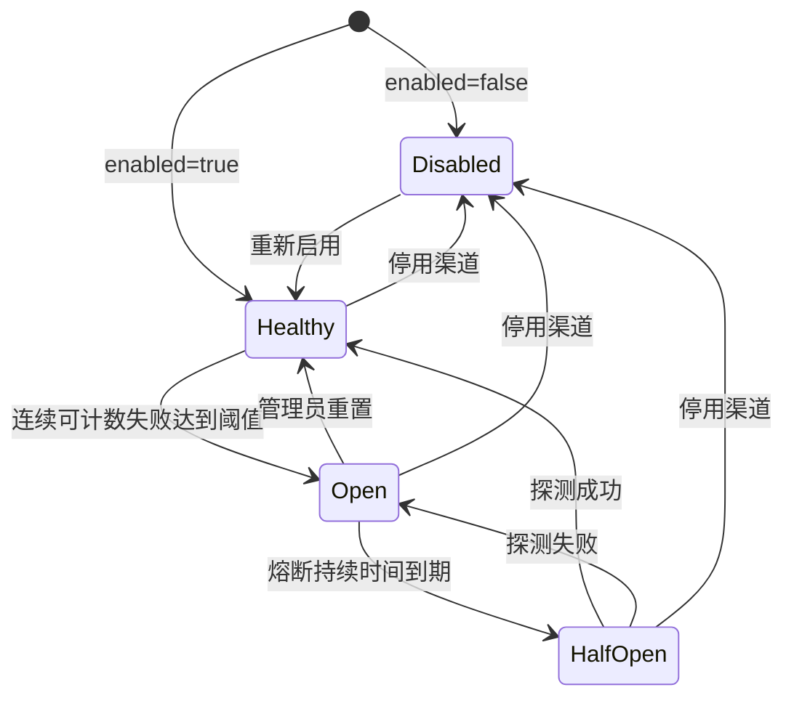
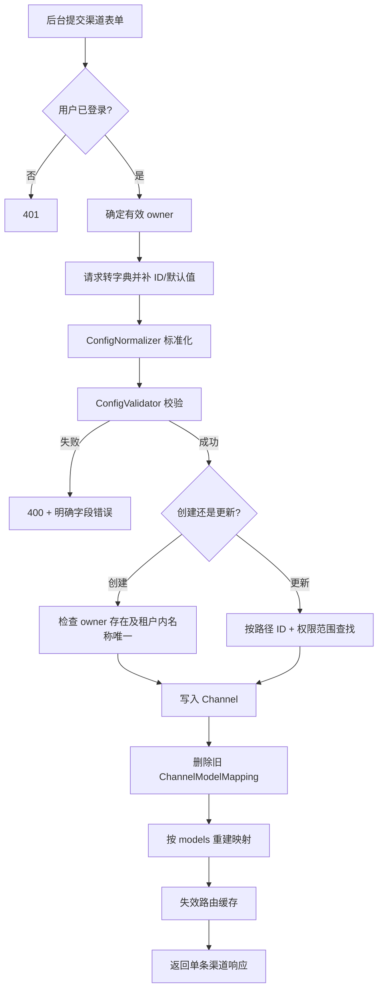
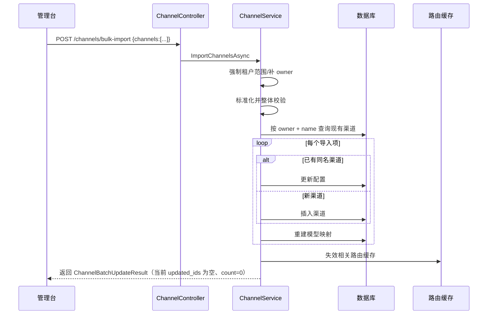

# OpenCodex PRD：渠道管理

## 文档元数据

| 项目 | 内容 |
|---|---|
| 文档编号 | PRD-06 |
| 需求前缀 | `REQ-CH` |
| 文档状态 | 基于现状反向建模，待产品评审 |
| 基线版本 | `main@235da3f4` |
| 最后核对日期 | 2026-09-30 |
| 适用对象 | 产品、后端、前端、测试、运维、安全 |
| 相关文档 | [路由与可靠性](./07-routing-and-reliability.md)、[协议转换](./08-protocol-conversion.md) |
| 事实优先级 | 当前源码与迁移 > 自动化测试 > 当前运行配置 > 说明性文档 |

> 本文显式区分四类内容：**当前实现事实**、**产品化要求**、**已知限制**、**待确认 TBD**。除“当前实现事实”外，其余内容不代表基线代码已经实现。

---

## 1. 目标与范围

### 1.1 产品目标

渠道是 OpenCodex 将客户端模型请求连接到具体上游服务的核心配置单元。本模块需要让不同租户安全、可控地完成以下工作：

1. 创建和维护上游渠道。
2. 配置渠道协议、地址、鉴权、模型映射、兼容策略和可靠性参数。
3. 查看渠道的启用状态、实时容量占用和熔断健康状态。
4. 通过模型发现和流式测试，在正式启用前验证渠道。
5. 支持批量运维、配置导入、健康重置，并保证租户隔离。
6. 为后续路由、协议转换、模型目录、计费和日志模块提供稳定的数据契约。

### 1.2 本文范围

本文覆盖：

- 渠道列表、详情、运行时快照、创建、更新、批量更新、删除。
- 渠道配置导入与合并。
- 渠道模型映射、渠道模型信息覆盖、匹配键数组及模型信息同步。
- 渠道兼容性配置。
- 渠道实时容量与健康状态展示。
- 渠道熔断状态重置。
- 上游模型发现、已保存渠道的流式连接测试。
- 渠道配置的权限、安全、缓存和审计影响。

### 1.3 不在本文范围

- 候选渠道排序、亲和、容量租约、熔断状态机和故障转移，见 [07-routing-and-reliability.md](./07-routing-and-reliability.md)。
- Responses、Chat、Messages 之间的字段转换，见 [08-protocol-conversion.md](./08-protocol-conversion.md)。
- 全局模型目录和价格规则的完整维护流程。
- 用户与访问 API Key 的完整生命周期。
- 独立图片生成/编辑接口的产品交互细节。

---

## 2. 角色与前置条件

### 2.1 角色

| 角色 | 定义 | 渠道权限 |
|---|---|---|
| 未登录访问者 | 无有效后台 Cookie | 不可访问渠道管理接口 |
| 普通用户 `user` | 已登录的租户用户 | 仅查看、创建、修改、删除、诊断自己的渠道 |
| 超级管理员 `superadmin` | 已登录的平台管理员 | 查看和管理全部用户的渠道，可在导入/创建时指定渠道所有者 |
| 代理调用者 | 仅持有访问 API Key | 不可管理渠道，只能通过所属用户的启用渠道发起代理请求 |
| 运维人员 | 通过部署环境管理变量和数据库 | 不等同于应用内超级管理员，除非同时持有后台账号 |

### 2.2 前置条件

1. 后台用户必须已登录，Cookie 对应的用户在数据库中存在且处于启用状态。
2. 新建渠道指定的所有者必须已经存在。
3. 上游地址应可从 OpenCodex 所在网络访问。
4. 若渠道配置引用 `$VAR` 或 `${VAR}`，对应环境变量应在代理进程中存在。
5. 若使用 `auth_mode=config`，上游凭证应配置在 `apikey` 或自定义 headers 中。
6. 若为 `images` 渠道，必须事先明确上游图片 API 方言和至少一个模型映射。

---

## 3. 术语

| 术语 | 定义 |
|---|---|
| 渠道 Channel | 一个具体上游服务配置，包含协议、地址、鉴权和可靠性参数 |
| 渠道类型 | 上游协议类型：`responses`、`chat`、`messages`、`images` |
| 所有者 Owner | 渠道所属用户；路由时只加载访问 API Key 所属用户的渠道 |
| 模型映射 | 渠道 `models` 中客户端模型名 `model` 到上游模型名 `upstream_model` 的映射 |
| 渠道模型信息 | `ChannelModelInfo` 保存的渠道级模型覆盖，可携带 provider、匹配键、能力、定价等信息 |
| 匹配键数组 | `match_patterns`；精确匹配时可由多个字符串共同命中，非精确匹配只允许一个模式 |
| 位置 Position | 持久化顺序字段，参与候选渠道的稳定排序 |
| 优先级 Priority | 数值越小优先级越高 |
| 容量 Capacity | 渠道允许同时占用的主请求数量上限 |
| 熔断持续时间 | 渠道进入 Open 状态后的保持秒数；0 表示不保留熔断状态 |
| 兼容配置 Compat | 在协议转换前对请求参数和工具定义进行调整的规则集合 |
| 运行时健康状态 | `disabled`、`healthy`、`open`、`half_open` |
| 模型发现 | 调用上游 `/models`，提取上游可用模型 ID |
| 渠道测试 | 使用临时渠道配置发起流式请求并以 SSE 返回诊断事件 |

---

## 4. 当前实现事实

### 4.1 权限与租户隔离

1. 所有渠道管理接口均先要求后台用户登录。
2. 普通用户的有效查询范围固定为当前用户名对应的 `User.Id`。
3. 普通用户在创建或导入渠道时，即使请求传入其他 `owner_username`，后端也会强制归属当前用户。
4. 超级管理员读取配置时会看到所有渠道；普通用户只看到自己的渠道。
5. 更新和删除均通过“渠道 ID + 当前权限范围”查找，普通用户无法通过猜测 UUID 操作他人渠道。
6. 更新渠道时所有者不变；请求体中的 ID 也不决定目标，以路径参数为准。

### 4.2 列表、详情与运行时字段

当前渠道读取分为配置读取与运行时读取：

1. `GET /channels`：返回当前权限范围内的渠道配置，并附加 `active_requests`、`health_status`。
2. `GET /channels/{channelId:guid}`：返回单条渠道配置，并附加同样两个运行时字段。
3. `GET /channels/runtime`：只返回 `id`、`active_requests`、`health_status`、`capacity`、`enabled`；可用逗号分隔的 `ids` 过滤。
4. `GET /channels/select-list`：返回 `id/name` 下拉选项，可按名称模糊查询；超级管理员可用 `owner_username` 限定所有者。

运行时字段语义：

- `active_requests`：当前进程内计数，多实例部署时不是全局并发真值。
- `health_status`：熔断服务按 `enabled` 与 `circuit_break_duration_seconds` 计算出的 `disabled/healthy/open/half_open`。
- `position` 持久化并参与路由稳定排序，但当前 `ChannelResponse` 不公开该字段。

`ChannelService.LoadAllChannelDtos` 的排序规则为：

1. `owner_username ASC`。
2. `enabled DESC`。
3. `updated_at DESC`。
4. `id ASC`。

普通用户只包含一个所有者，因此实际表现为“启用优先、更新时间倒序、ID”；超级管理员先按所有者分组。该列表排序不是实际路由顺序。渠道列表 DTO 使用 10 秒内存缓存。

### 4.3 创建与更新

1. 创建请求未提供 ID 时，由服务生成 UUID。
2. 当前创建逻辑将新渠道 `Channel.Position` 固定初始化为 15，不计算已有列表尾部。
3. 未传 `priority` 时，`ConfigNormalizer.Normalize` 会按单渠道校验序号写入 `0`；服务层仍保留一个未命中的 fallback。
4. 未传 `enabled` 时默认启用。
5. 当前创建与更新都通过 `ConfigValidator.ValidateChannel`；`capacity` 必须提供正整数，Images 渠道 `retry_count` 必须为 0。
6. 同一所有者下渠道名称使用实体字符串直接比较，未做大小写归一化。
7. 更新时：
   - 路径 ID 是唯一目标 ID，请求体 ID 不决定目标。
   - 所有者保持不变。
   - `group_name` 未提供时保留原值。
   - 其他主要配置按请求内容覆盖。
8. 创建或更新成功返回单条 `ChannelResponse`，不是完整渠道列表。
9. 创建或更新后会删除该渠道旧 `ChannelModelMapping`，再按 `models` 顺序重建。

### 4.4 批量更新

批量接口只允许修改低风险字段：

- `group_name`
- `enabled`
- `priority`
- `capacity`
- `timeout_seconds`
- `retry_count`
- `circuit_break_duration_seconds`

当前规则：

1. `channel_ids` 会去空、去重。
2. 至少需要一个有效 ID。
3. `patch` 至少包含一个支持字段。
4. 任一渠道不存在或超出当前用户权限范围时，整批返回 404，不修改任何渠道。
5. 所有字段先统一验证，再在同一个 EF Core 跟踪上下文中保存。
6. 成功返回 `updated_ids` 与 `count`，不再返回渠道列表。

### 4.5 导入与合并

1. `POST /channels/bulk-import` 只接受顶层 `channels`。
2. 配置先补全有效所有者、标准化，再整体校验。
3. 合并键为 `(OwnerUserId, Channel.Name)`，不是 ID。
4. 命中同名渠道时更新；未命中时创建。
5. 导入不会删除请求中未出现的现有渠道。
6. 普通用户导入的所有渠道都归属自己。
7. 超级管理员可以通过 `owner_username` 指定所有者。
8. 当前实现对超级管理员导入中的未知所有者存在回落到默认管理员 ID 的路径，属于已知风险，不应作为产品规则固化。
9. `POST /channels/bulk-import` 当前返回 `ChannelBatchUpdateResult`，其中 `updated_ids` 为空、`count=0`，不返回实际新增或更新的渠道 ID。

### 4.6 模型映射与匹配键数组

渠道 `models` 保存可用于核心路由的映射。当前正式字段只有：

```json
{
  "model": "client-visible-model",
  "upstream_model": "provider-model"
}
```

规则：

1. `model` 必填。
2. `upstream_model` 为空时自动等于 `model`。
3. 同一渠道内 `model` 不得重复。
4. `ConfigNormalizer.Normalize` 会删除映射对象中的其他未知字段。
5. 同步生成的 `ChannelModelMapping` 当前字段为：
   - `Position`：按 `models` 数组顺序从 0 递增。
   - `RequestModel`：来自 `model`。
   - `UpstreamModel`：来自 `upstream_model`，为空时回填 `model`。
   - `Enabled=true`。
6. 旧的 `SupportsImage`、`PricingMode` 映射列已由迁移删除；图片能力与定价改由 `ModelCatalogService`、`ChannelModelInfo` 和全局 `ModelInfo` 判断。
7. 核心路由只按渠道 `models.model` 做字符串匹配；`ChannelModelInfo.match_patterns` 当前不参与核心候选匹配。

#### 4.6.1 渠道模型信息覆盖

当前存在一组独立的渠道模型信息接口：

- `GET /channels/{channelId:guid}/model-infos`
- `PUT /channels/{channelId:guid}/model-infos`
- `DELETE /channels/{channelId:guid}/model-infos/{id:guid}`

当前行为：

1. 读取接口合并核心 `ChannelModelMapping`、渠道级 `ChannelModelInfo` 与全局模型信息，返回 `request_model`、`upstream_model`、`overridden`、`global_model`、`override_model`。
2. `PUT`/`DELETE` 使用与渠道读取相同的权限范围；普通用户只能操作自己的渠道。
3. `ChannelModelInfo` 保存 `RequestModel`、`UpstreamModel`、`ProviderId`、`ModelKey`、`DisplayName`、`Description`、`MatchType`、`MatchPattern`、`MatchPatternsJson`、`CatalogJson`、`CapabilitiesJson`、`Enabled`、`Source`。
4. `match_type` 支持 `exact/prefix/suffix/contains`，空值按 `exact` 处理。
5. `match_patterns` 会 Trim、去空、按忽略大小写去重；全部为空时回落到 `model_key`。
6. 只有 `exact` 允许 `match_patterns` 多于一项；非精确匹配传入多个模式返回 400。
7. `match_pattern` 等于归一化后的第一个 `match_patterns` 元素。
8. `request_model` 若显式提供，必须与该渠道已有映射的 `upstream_model` 一致；否则可回落到上游模型名。

### 4.7 环境变量展开

路由读取渠道时，会递归展开字符串中的：

- `${ENV_NAME}`
- `$ENV_NAME`

若环境变量不存在，原占位字符串保持不变。展开结果只用于运行时，不回写数据库。

### 4.8 诊断

#### 上游模型发现

当前控制器路由：

- `POST /channels/discover-models`
- `POST /discover-models`（兼容路径）

请求既可使用嵌套 `channel`，也可使用扁平渠道字段。当前实现会：

1. 拒绝渠道配置中的环境变量占位符。
2. 校验 `baseurl`；域名不做 DNS 解析，直接拒绝 localhost、`.internal`、`.local`、私网/回环/链路本地 IP 与云元数据地址。
3. 将诊断超时钳制到最多 60 秒，将 `retry_count` 强制为 0。
4. 返回上游模型 ID 列表、原始响应与诊断耗时。

#### 流式连接测试

当前控制器路由：

- `POST /channels/test/stream`
- `POST /test-channel/stream`（管理台当前使用）

当前行为：

1. 请求按 `channel_id` 读取已保存渠道，并执行权限范围检查，不接收未保存草稿。
2. SSE 事件包含上游事件、`channel_test.error`、`channel_test.completed`。
3. chat/messages 渠道的上游事件会转换为 Responses 风格输出；连接测试日志仍捕获转换前的上游响应。
4. 诊断响应中的请求头、API Key、Cookie、密码等键会被脱敏为 `...`。
5. 失败响应会在 `channel_test.completed.upstream_response` 中携带上游原始错误体；前端 `formatChannelTestResult` 优先展示上游原始错误消息，而不是客户端 502 脱敏文案。
6. 请求日志列表在 `request_type=diagnostic` 时，把 API Key 列显示为“连接测试”。
7. `frontend/src/api/channels.js` 仍导出 `probeModels`、`probeStream`，分别指向 `/channels/{id}/probe-models`、`/channels/{id}/probe-stream`；当前前端没有调用这两个函数，后端也没有对应控制器 Action。

#### 健康重置

当前控制器同时暴露：

- `POST /channels/{channelId:guid}/health-reset`
- `POST /channels/{channelId:guid}/reset-health`（管理台当前使用）

两者调用同一个 `ResetChannelHealthAsync`，重置熔断状态但不修改渠道配置。

---

## 5. 字段规则

### 5.1 渠道字段表

| 字段 | 类型 | 当前实现规则 | 产品化要求 |
|---|---|---|---|
| `id` | UUID/字符串 | 创建可省略；更新以路径 ID 为准 | 对外统一 UUID；创建成功后不可变 |
| `owner_username` | 字符串 | 普通用户强制为自己；超管可指定；单条创建时未知用户返回 400 | 必须解析为现存用户，未知用户必须明确报错 |
| `name` | 字符串 | 同一所有者下直接字符串比较；未禁止空字符串 | 必填、Trim 后 1–100 字符，租户内唯一 |
| `group_name` | 字符串 | 可为空；更新省略时保留 | 可选，Trim 后不超过 100 字符 |
| `type` | 枚举 | `responses/chat/messages/images` | 必填且不可为未知值 |
| `baseurl` | 字符串 | 必填，必须以 `http://` 或 `https://` 开头 | 生产环境 SHOULD 默认要求 HTTPS；禁止控制字符 |
| `apikey` | 字符串 | 明文落库并在配置响应返回 | MUST 加密落库；默认响应仅返回掩码，显式替换时才接收新值 |
| `auth_mode` | 枚举 | `config/none`，默认 `config` | `none` 时不得自动注入认证头 |
| `headers` | JSON 对象 | 可为空；值转换为字符串后发往上游 | Header 名大小写不敏感；禁止 Host/Content-Length 等危险头 |
| `timeout_seconds` | 正整数 | 缺省使用系统默认超时；校验必须为正整数 | 建议范围 1–3600 秒，超范围返回 400 |
| `circuit_break_duration_seconds` | 非负整数 | 默认 0；0 时熔断服务清除状态并视为健康 | 0 表示关闭状态保持；建议最大 86400 秒 |
| `retry_count` | 非负整数 | 默认 3；Images 必须为 0 | 建议上限 10；界面需说明是“单渠道内部重试” |
| `priority` | 非负整数 | 越小越优先；未传时标准化默认值为 0 | 0–10000；同优先级允许存在 |
| `capacity` | 正整数 | 保存校验为必填正整数；服务层对 `capacity<=0` 按无硬限处理 | MUST 明确是否允许“无限制”；建议 1–10000 |
| `compat` | JSON 对象 | 只接受白名单字段；当前白名单见 5.2 | 必须逐字段验证类型，不允许静默接收未知字段 |
| `models` | 数组 | 只保留 `model/upstream_model`；核心路由按 `model` 精确匹配 | 同一渠道 `model` 唯一，保存顺序稳定 |
| `enabled` | 布尔 | 默认 true | 停用后不再参与新请求路由 |
| `active_requests` | 只读整数 | 本实例进程内计数；Redis 路径仅用于排序/展示 | 标明采样时间及是否为全局值 |
| `health_status` | 只读枚举 | `disabled/healthy/open/half_open` | 与路由状态机定义保持一致 |
| `position` | 内部整数 | 新建固定 15；参与稳定排序，但 API 配置响应不公开 | TBD：是否提供显式拖拽排序接口 |

### 5.2 Compat 字段表

| 字段 | 类型 | 当前作用 | 备注 |
|---|---|---|---|
| `default_params` | 对象 | 参数不存在时补默认值 | 先执行 |
| `rename_params` | 对象 | 将源参数重命名到目标参数 | 目标已存在时保留目标值 |
| `drop_params` | 数组 | 删除指定顶层参数 | 在 force 之前执行 |
| `force_params` | 对象 | 无条件覆盖指定参数 | 高风险，应在 UI 明示 |
| `drop_tool_types` | 数组 | 删除对应工具、tool_choice、include 项 | 例如删除图片生成工具 |
| `unsupported_params` | 数组 | 请求出现对应参数时返回本地 400 | 不调用上游 |
| `preserve_thinking_history` | 布尔 | 管理台对 chat/messages 开放：chat 回传 `assistant.reasoning_content`；messages 恢复 Anthropic thinking blocks，缺签名时降级为文本块 | 后端校验器接受布尔值；其他渠道类型未在 UI 开放 |
| `enable_apply_patch_prompt_compat` | 布尔 | 对 `apply_patch` 工具说明进行兼容改写 | 管理台对 chat/messages 开放，协议转换专用 |
| `multi_agent_v2_mode` | 枚举 | `passthrough/downgrade/reject`；空值表示自动策略 | 非 Images 渠道可选；校验器拒绝其他值 |
| `images_api_dialect` | 枚举 | `openai/xai` 图片接口方言 | 仅 Images 渠道可用且必填 |

### 5.3 渠道状态组合

| `enabled` | 熔断状态 | API `health_status` | 是否参与新路由 |
|---:|---|---|---:|
| false | 任意 | `disabled` | 否 |
| true | Closed/无记录 | `healthy` | 是 |
| true | Open 且未到期 | `open` | 否 |
| true | Open 到期转 Half-open | `half_open` | 仅允许受控探测 |


```mermaid
stateDiagram-v2
    [*] --> Disabled: enabled=false
    [*] --> Healthy: enabled=true
    Healthy --> Open: 连续可计数失败达到阈值
    Open --> HalfOpen: 熔断持续时间到期
    HalfOpen --> Healthy: 探测成功
    HalfOpen --> Open: 探测失败
    Open --> Healthy: 管理员重置
    Healthy --> Disabled: 停用渠道
    Open --> Disabled: 停用渠道
    HalfOpen --> Disabled: 停用渠道
    Disabled --> Healthy: 重新启用
```

---

## 6. 核心业务流程

### 6.1 创建/更新渠道


```mermaid
flowchart TD
    A[后台提交渠道表单] --> B{用户已登录?}
    B -- 否 --> U[401]
    B -- 是 --> C[确定有效 owner]
    C --> D[请求转字典并补 ID/默认值]
    D --> E[ConfigNormalizer 标准化]
    E --> F[ConfigValidator 校验]
    F -- 失败 --> V[400 + 明确字段错误]
    F -- 成功 --> G{创建还是更新?}
    G -- 创建 --> H[检查 owner 存在及租户内名称唯一]
    G -- 更新 --> I[按路径 ID + 权限范围查找]
    H --> J[写入 Channel]
    I --> J
    J --> K[删除旧 ChannelModelMapping]
    K --> L[按 models 重建映射]
    L --> M[失效路由缓存]
    M --> N[返回单条渠道响应]
```

### 6.2 配置导入


```mermaid
sequenceDiagram
    participant UI as 管理台
    participant API as ChannelController
    participant SVC as ChannelService
    participant DB as 数据库
    participant CACHE as 路由缓存

    UI->>API: POST /channels/bulk-import {channels:[...]}
    API->>SVC: ImportChannelsAsync
    SVC->>SVC: 强制租户范围/补 owner
    SVC->>SVC: 标准化并整体校验
    SVC->>DB: 按 owner + name 查询现有渠道
    loop 每个导入项
        alt 已有同名渠道
            SVC->>DB: 更新配置
        else 新渠道
            SVC->>DB: 插入渠道
        end
        SVC->>DB: 重建模型映射
    end
    SVC->>CACHE: 失效相关路由缓存
    SVC-->>UI: 返回 ChannelBatchUpdateResult（当前 updated_ids 为空、count=0）
```

---

## 7. 接口契约摘要

所有成功或失败的后台接口均使用统一 `ApiOpResult` 外壳，HTTP 状态与响应 `code` 应一致。

| 方法与路径 | 权限 | 请求摘要 | 成功响应 | 常见错误 |
|---|---|---|---|---|
| `GET /channels` | 已登录 | 无 | `ChannelListResponse`，含配置与运行时字段 | 401 |
| `GET /channels/{channelId:guid}` | 已登录 | 无 | 单条 `ChannelResponse` | 400/401/404 |
| `GET /channels/runtime` | 已登录 | 可选 `ids` 逗号分隔 | 仅 `id/active_requests/health_status/capacity/enabled` | 401 |
| `GET /channels/select-list` | 已登录 | `q/owner_username` | `id/name` 选项 | 401 |
| `POST /channels` | 已登录 | `ChannelRequest` | 单条 `ChannelResponse` | 400/401 |
| `PUT /channels/{channelId:guid}` | 已登录 | 完整渠道配置 | 单条 `ChannelResponse` | 400/401/404 |
| `PATCH /channels`、`PATCH /channels/batch` | 已登录 | `{channel_ids, patch}` | `updated_ids/count` | 400/401/404 |
| `DELETE /channels/{channelId:guid}` | 已登录 | 无 | `{deleted,id}` | 400/401/404 |
| `POST /channels/bulk-import` | 已登录 | `{channels:[...]}` | 当前为空 ID 的 `ChannelBatchUpdateResult` | 400/401 |
| `GET /channels/{channelId:guid}/model-infos` | 已登录 | 无 | 合并后的渠道模型信息列表 | 401/404 |
| `PUT /channels/{channelId:guid}/model-infos` | 已登录 | `ChannelModelInfoUpsertRequest` | `{model}` | 400/401/404 |
| `DELETE /channels/{channelId:guid}/model-infos/{id:guid}` | 已登录 | 无 | 成功空载荷 | 401/404 |
| `POST /channels/{channelId:guid}/health-reset`、`POST /channels/{channelId:guid}/reset-health` | 已登录 | 无 | `{reset:true,id}` | 400/401/404 |
| `POST /channels/discover-models`、`POST /discover-models` | 已登录 | 临时渠道配置 | 上游模型列表与原始响应 | 400/401/上游状态 |
| `POST /channels/test/stream`、`POST /test-channel/stream` | 已登录 | `{channel_id,model,input,max_output_tokens}` | SSE 诊断流 | 401；业务失败写入 SSE 事件 |

### 7.1 示例：创建普通文本渠道

```json
{
  "name": "primary-responses",
  "group_name": "production",
  "type": "responses",
  "baseurl": "https://provider.example/v1",
  "apikey": "${UPSTREAM_API_KEY}",
  "auth_mode": "config",
  "headers": {},
  "timeout_seconds": 120,
  "circuit_break_duration_seconds": 60,
  "retry_count": 2,
  "priority": 10,
  "capacity": 20,
  "compat": {},
  "models": [
    {
      "model": "coding-model",
      "upstream_model": "provider-coding-model-v2"
    }
  ],
  "enabled": true
}
```

### 7.2 示例：批量停用并分组

```json
{
  "channel_ids": [
    "11111111-1111-1111-1111-111111111111",
    "22222222-2222-2222-2222-222222222222"
  ],
  "patch": {
    "enabled": false,
    "group_name": "maintenance"
  }
}
```

---

## 8. 异常与边界

1. 渠道 ID 为空、格式错误或不在权限范围内：400 或 404，不泄露真实所有者。
2. 同租户渠道名称重复：400；名称比较当前未做大小写归一化。
3. `baseurl` 非 HTTP(S)：400。
4. 未提供 `capacity` 或值非正整数：400。服务层会把 `capacity<=0` 视为无硬限，但管理接口当前无法保存这种渠道。
5. Images 渠道 `retry_count != 0`：400。
6. Images 渠道缺少方言或对象型模型映射：400。
7. Compat 出现未知字段或字段类型错误：400。
8. `match_patterns` 多于一项且 `match_type!=exact`：400。
9. 批量更新部分 ID 无权限：整批 404，不允许部分成功。
10. 导入项同一 owner 下名称重复：当前校验没有对请求内的名称重复做统一检查，行为需通过复现测试固定。
11. 环境变量不存在：路由读取时保留占位符，随后可能导致上游鉴权失败；产品化界面应预检并提示。
12. 诊断接口不允许环境变量占位符；模型发现还会拒绝私网/回环/链路本地地址。
13. 渠道测试不应修改正式渠道；当前会写入 `request_type=diagnostic` 日志，不会调用正式路由缓存。
14. 删除渠道时同一事务中清理 `ChannelModelMapping`，并清理引用该渠道的视觉转移配置；在途请求不被强制终止。
15. 修改容量、优先级或启停后，渠道配置列表缓存为 10 秒；路由原始渠道缓存为 60 秒。普通用户变更会精确失效本人缓存；超级管理员修改他人渠道时当前仍可能等待 60 秒 TTL，见已知限制。
16. 诊断日志当前会把测试渠道请求内容写入日志内容存储，现有测试断言其中可见上游 API Key 与敏感 header；产品化要求必须改为脱敏或加密存储。

## 9. 产品化需求与验收标准

### REQ-CH-001 租户隔离（MUST）

**要求：** 普通用户只能读写自己的渠道；超级管理员可以读写全部渠道。

**验收标准：**

1. 普通用户请求他人渠道 ID 的更新、删除、健康重置均返回 404。
2. 普通用户创建或导入时传入他人 `owner_username`，保存结果仍归属当前用户。
3. 超级管理员可创建归属于任意现存用户的渠道。

### REQ-CH-002 渠道列表（MUST）

**要求：** 列表必须返回当前权限范围内完整渠道配置、运行时活跃数和健康状态。

**验收标准：**

1. 返回项包含字段表中所有公开字段。
2. 停用渠道返回 `health_status=disabled`。
3. 普通用户列表不包含其他用户渠道。

### REQ-CH-003 创建校验（MUST）

**要求：** 新渠道必须通过类型、地址、容量、重试、熔断、Compat 和模型映射校验后才能写入。

**验收标准：**

1. 任一字段失败时数据库不新增 Channel 或 ChannelModelMapping。
2. 错误响应明确指出字段和原因。
3. 有效请求返回可再次读取的 UUID。

### REQ-CH-004 名称唯一性（MUST）

**要求：** 渠道名称在同一所有者范围内唯一，不同所有者可重名。

**验收标准：**

1. 同用户重复创建返回 400。
2. 两个不同用户使用相同名称均可成功。
3. 更新为同用户已有名称返回 400，原记录不变。

### REQ-CH-005 更新目标稳定性（MUST）

**要求：** 更新目标只能由路径 ID 决定，更新不得改变所有者。

**验收标准：**

1. 请求体 ID 与路径 ID 不同时，仅路径 ID 对应记录变化。
2. 请求体携带其他所有者时，OwnerUserId 不变。
3. 省略 `group_name` 时原分组保持不变。

### REQ-CH-006 批量更新原子性（MUST）

**要求：** 批量更新必须全部验证成功后一次性保存，不允许部分成功。

**验收标准：**

1. 任一 ID 不存在时所有目标均不变化。
2. Patch 无支持字段时返回 400。
3. 成功时仅所选渠道和所选字段发生变化。

### REQ-CH-007 删除及关联清理（MUST）

**要求：** 删除渠道时必须清理该渠道的模型映射，并停止其参与后续路由。

**验收标准：**

1. 删除成功后 Channel 和 ChannelModelMapping 均不可查询。
2. 引用该渠道的视觉转移主配置被删除，兜底引用被清空。
3. 已在途请求不被异常中断。
4. 新请求不再选择该渠道。

### REQ-CH-008 配置导入为合并操作（MUST）

**要求：** 导入按 `(owner, name)` 合并，不删除未出现渠道。

**验收标准：**

1. 同名项更新而不新增重复渠道。
2. 新名称新增渠道。
3. 请求未包含的渠道保持不变。
4. 未知 `owner_username` 返回 400，不得静默回落到其他用户：单条创建满足（`owner user not found: <name>`，`ChannelService.cs:420`）；导入合并路径未校验、不返回 400，静默回落到管理员（`ChannelService.cs:751`，`MergeChannelsIntoStore`），此项为 GAP，见 §11 第 6 条。

### REQ-CH-009 模型映射标准化（MUST）

**要求：** 每个映射必须有客户端模型名；上游模型名缺省时等于客户端模型名。

**验收标准：**

1. 空 `model` 返回 400。
2. 同渠道重复 `model` 返回 400。
3. 保存后 ChannelModelMapping.Position 与请求顺序一致。
4. 同步映射写出 RequestModel/UpstreamModel/Enabled=true。
5. 更新渠道后旧映射被完整替换。

### REQ-CH-010 Images 渠道约束（MUST）

**要求：** Images 渠道必须显式声明方言、模型映射，且禁止内部自动重试。

**验收标准：**

1. 无 `images_api_dialect` 返回 400。
2. 方言非 `openai/xai` 返回 400。
3. 无模型映射返回 400。
4. `retry_count` 非 0 返回 400。

### REQ-CH-011 Compat 执行契约（MUST）

**要求：** Compat 只允许白名单字段，字段类型和执行顺序必须稳定。

**验收标准：**

1. 未知字段返回 400。
2. 自动化测试覆盖 default → rename → drop → force → drop tools → unsupported 的顺序。
3. `preserve_thinking_history` 对 chat/messages 的类型与布尔值校验通过。
4. `multi_agent_v2_mode` 只接受 `passthrough/downgrade/reject` 或空值。

### REQ-CH-012 上游凭证保护（MUST，未实现/GAP）

**要求：** `apikey` 和敏感 headers 必须加密存储，普通读取接口不得返回明文；连接测试日志内容存储同样适用（已并入原 `REQ-CH-025`）。

**验收标准：**

1. 数据库备份中不出现可直接使用的上游 Key 明文。
2. 列表响应显示掩码或“已配置”。
3. 更新未传新 Key 时保留旧 Key。
4. 日志和错误响应不出现 Key 明文（含诊断日志内容存储）。

**当前状态（GAP，未实现）**：上游 `apikey` 与含秘密的自定义 headers 当前明文存储并在配置响应中返回（§11 第 1 条）；更新路径 `ChannelService.cs:383` 用请求值直接覆盖 `existing.ApiKey`，`JsonDictionaryValue.String`（`JsonDictionaryValue.cs:25-28`）对缺失键返回空串，未传新 Key 会清空旧 Key，与验收 3 相反；诊断日志内容存储保留上游 Key 与敏感 header 原文（`ChannelDiagnosticsLogTests.TestChannelStreamWritesCompleteRequestLogContent` 断言写入 `SecretApiKey`），仅 SSE 流出经 `SensitiveLogKeys`/`IsSensitiveLogKey`（`ChannelDiagnosticsService.cs:477/634`）递归脱敏，四条验收标准当前均不满足。

### REQ-CH-013 环境变量引用（SHOULD）

**要求：** 支持运行时环境变量引用，并提供可验证性提示。

**验收标准：**

1. 已定义变量在上游调用前展开。
2. 未定义变量在诊断或保存预检中给出明确提示。
3. 管理台不回显展开后的敏感值。

### REQ-CH-014 实时健康展示（MUST）

**要求：** 管理台必须展示渠道启用、熔断和容量占用状态，并区分配置状态与运行时状态。

**验收标准：**

1. Open、Half-open、Disabled 有不同展示。
2. 活跃数刷新不修改渠道配置。
3. 多实例场景明确标注数据是本实例近似值或全局值。

### REQ-CH-015 健康重置（MUST）

**要求：** 有权限的用户可重置自己渠道的熔断状态。

**验收标准：**

1. Open 状态重置后立即返回 Healthy。
2. 重置不会修改 enabled、capacity 等持久化字段。
3. 无权限渠道返回 404。

### REQ-CH-016 模型发现（SHOULD）

**要求：** 用户可在不保存渠道的情况下发现上游模型。

**验收标准：**

1. 使用请求中的临时配置调用上游，不写入正式渠道。
2. 支持对象根和数组根模型列表格式。
3. 拒绝环境变量占位符和非公开 baseurl。
4. 诊断超时最多 60 秒、retry_count 强制为 0。
5. 失败返回可理解的网络、认证、超时或格式错误。

### REQ-CH-017 流式渠道测试（SHOULD）

**要求：** 渠道测试必须输出结构化 SSE 事件并记录脱敏诊断日志。

**验收标准：**

1. 包含上游事件、`channel_test.completed` 与失败时的 `channel_test.error`。
2. 客户端取消后停止上游读取并传播取消。
3. SSE 诊断响应中授权和密码字段被脱敏。
4. 连接测试日志的存储内容当前未满足脱敏要求，必须作为 GAP 跟踪。
5. 失败时优先向上游排障人员展示原始上游错误，列表 API Key 列显示“连接测试”。

### REQ-CH-018 缓存一致性（MUST）

**要求：** 渠道创建、修改、删除、导入后，受影响所有者的路由缓存必须立即失效。

**验收标准：**

1. 超级管理员修改普通用户渠道后，该用户下一请求读取新配置。
2. 删除渠道后不存在 60 秒继续命中的窗口。
3. 多实例使用 Redis 时所有实例观察到同一版本。

### REQ-CH-019 审计记录（MUST，未实现）

**要求：** 渠道敏感变更必须形成审计事件，但不得记录秘密明文。

**验收标准：**

1. 记录操作者、所有者、渠道 ID、动作、时间和变更字段名。
2. `apikey` 与敏感 header 只记录“新增/替换/清除”。
3. 审计事件可按渠道和操作者检索。

**当前状态（GAP，未实现）**：代码中没有审计事件的写入、存储或检索实现（`opencodex_proxy/src` 对 audit 零命中），三条验收标准当前均不满足；本条属规划中能力。

### REQ-CH-020 并发修改保护（SHOULD）

**要求：** 产品化版本应支持乐观并发，避免两个管理页面相互覆盖。

**验收标准：**

1. 更新请求携带版本号或 `updated_at`。
2. 版本冲突返回 409。
3. 冲突时数据库保持先提交版本。


### REQ-CH-021 渠道运行时快照（MUST）

**要求：** 渠道配置读取与高频运行时读取必须分离。

**验收标准：**

1. `GET /channels/runtime` 只返回运行时字段，不携带 apikey、headers、compat、models。
2. `ids` 为空或全部非法时按全量权限范围返回；合法 id 仅过滤授权范围内渠道。
3. 运行时读取不修改渠道配置与缓存。

### REQ-CH-022 渠道模型信息覆盖与匹配键（MUST）

**要求：** 渠道模型信息必须支持渠道级覆盖、全局模型回退和匹配键数组。

**验收标准：**

1. `GET /channels/{id}/model-infos` 合并核心映射、渠道覆盖和全局模型。
2. `match_patterns` Trim、去空、忽略大小写去重；空数组回落到 `model_key`。
3. 仅 `exact` 允许多个匹配模式，其他类型多值返回 400。
4. 普通用户不能读写他人渠道模型信息。
5. 当前核心路由不消费 `match_patterns`，该差异需在产品决策前保持显式说明。

### REQ-CH-023 诊断端点命名一致性（MUST）

**要求：** 文档、管理台调用和后端路由必须使用同一组诊断端点。

**验收标准：**

1. 管理台调用 `/discover-models` 与 `/test-channel/stream`（`frontend/src/api/channels.js`、`frontend/src/channelTestStream.js`）；后端 `ChannelDiagnosticsController` 同时注册这两条路径与等价别名 `/channels/discover-models`、`/channels/test/stream`。
2. `probe-models/probe-stream` 在 `frontend/src/api/channels.js` 只有函数定义、无调用方，后端也没有对应 Action，不得作为已实现能力展示。
3. 新增端点或别名必须同时更新前端调用方与路由测试。

### REQ-CH-024 连接测试错误可诊断性（MUST）

**要求：** 连接测试失败时必须保留可供授权管理员排障的上游原始错误。

**验收标准：**

1. `channel_test.completed.upstream_response` 包含上游原始错误体。
2. 前端优先显示深层上游错误 message，不用客户端 502 脱敏文案覆盖。
3. 日志列表在 `request_type=diagnostic` 时把 Key 名称列显示为“连接测试”。

### REQ-CH-025 诊断日志秘密保护（MUST，未实现/GAP，已并入 REQ-CH-012）

**要求：** 连接测试日志不得以可直接使用的形式保存上游秘密。本条与 `REQ-CH-012` 合并为同一条未实现 MUST 跟踪，验收标准见 `REQ-CH-012`。

**验收标准：** 见 `REQ-CH-012`。

**当前状态（GAP，未实现）**：诊断日志内容存储保留上游 API Key 与敏感 header 原文（`ChannelDiagnosticsLogTests.TestChannelStreamWritesCompleteRequestLogContent` 断言写入 `SecretApiKey`、`SecretHeaderValue`），不满足第 1、3 条；仅 SSE 流出经 `SensitiveLogKeys`/`IsSensitiveLogKey` 递归脱敏，满足第 2 条。


---

## 10. 数据、安全与可观测性影响

### 10.1 数据

- 渠道主体存储在 `Channels`。
- `headers`、`compat`、`models` 当前以 JSON 字符串存储。
- 核心模型映射同时同步到 `ChannelModelMappings`，当前字段为 `RequestModel/UpstreamModel/Enabled/Position`。
- 渠道级模型覆盖存储在 `ChannelModelInfos`，`MatchPatternsJson` 保存匹配键数组。
- `DELETE /channels/{id}` 会清理 `ChannelModelMappings` 与视觉转移配置引用。
- 删除用户时会删除其渠道，但数据库模型未通过导航属性表达完整级联，需通过服务层保证。

### 10.2 安全

- 当前 `Channel.ApiKey` 为明文字段，并在配置响应中返回，是产品化必须整改项。
- 自定义 headers 可能包含 `Authorization`、`x-api-key` 等秘密，也应按敏感配置处理。
- `baseurl` 保存时可指向任意 HTTP(S) 地址；诊断路径会额外拒绝私网/回环/链路本地地址，但正式路由仍承接 SSRF 边界。
- 连接测试的 SSE 响应会递归脱敏敏感键；连接测试日志目前会把渠道请求内容按原文写入日志内容存储，已有测试断言其中可见 API Key 与敏感 header。
- LAN 模式下后台接口可从局域网访问，不能依赖“仅本机”作为安全假设。

### 10.3 可观测性

建议最少指标：

- 渠道总数、启用数、按类型分布。
- 创建/更新/删除/导入成功率。
- 渠道诊断成功率及 P95 延迟。
- 渠道 Open/Half-open 数量。
- 当前活跃请求/容量比例。
- 环境变量未解析次数。
- 配置变更到路由生效的延迟。

---

## 11. 已知限制

1. 上游 `apikey` 和 headers 当前明文存储、明文返回。
2. `capacity` 的 DTO 注释仍写“可空表示不限”，服务层也把 `capacity<=0` 视为无硬限，但保存校验要求必填正整数。
3. 新建渠道 `Position` 固定为 15，不能反映真实插入顺序。
4. 未提供显式渠道排序 API。
5. 超级管理员修改他人渠道时，`ChannelService.InvalidateRouteCache` 只失效当前登录用户名；他人路由缓存仍可能等待 60 秒 TTL。
6. 超级管理员导入未知所有者时存在回落到默认管理员的实现路径（`ChannelService.cs:751`，`MergeChannelsIntoStore` 不返回 400）。
7. `intercept_probe_requests` 已从渠道 Compat 白名单移除，改由系统级 `ProxySettings` 控制；其执行发生在 `ProxyService`，不再由渠道字段控制。
8. 导入返回空 `updated_ids` 且 `count=0`，调用方无法从响应获知实际写入结果。
9. 导入不是显式事务业务操作，逐项仓储保存可能造成大量数据库往返。
10. 没有乐观锁或 ETag，并发更新可能后写覆盖先写。
11. `GET /channels` 的排序与实际路由顺序不同，容易造成产品认知偏差。
12. `frontend/src/api/channels.js` 中的 `probeModels`、`probeStream` 没有调用方，后端也没有 `probe-models/probe-stream` Action。
13. `ChannelModelInfo.match_patterns` 目前不参与核心路由候选匹配，只在模型目录、能力判断、图片支持和定价场景消费。
14. 连接测试日志内容存储当前保留上游 API Key 与敏感 header 原文；`ChannelDiagnosticsLogTests.TestChannelStreamWritesCompleteRequestLogContent` 明确断言该行为。

## 12. 待确认 TBD

| 编号 | 问题 | 建议默认值 |
|---|---|---|
| TBD-CH-001 | `capacity` 是否允许无限制 | 不允许；必须为正整数 |
| TBD-CH-002 | 渠道是否允许 HTTP 上游 | 仅开发环境允许 |
| TBD-CH-003 | 是否开放显式拖拽排序 | 开放并维护连续 Position |
| TBD-CH-004 | 导入遇到同名渠道时是覆盖全部字段还是仅覆盖已提供字段 | 当前为完整覆盖，建议界面明确 |
| TBD-CH-005 | 导入是否需要 dry-run 与差异预览 | 建议需要 |
| TBD-CH-006 | 超管能否查看普通用户上游 Key 明文 | 默认不可查看 |
| TBD-CH-007 | 渠道分组是否影响路由 | 当前不影响，建议保持仅展示用途 |
| TBD-CH-008 | 删除渠道是否需要软删除和恢复 | 建议首版继续硬删除，但增加审计 |
| TBD-CH-009 | 渠道测试是否计入正式成本统计 | 建议单独标记 `diagnostic`，不计正式消费 |
| TBD-CH-010 | Compat 是否开放原始 JSON 编辑 | 默认高级模式开放，并提供结构化校验 |
| TBD-CH-011 | `probe-models/probe-stream` 是否作为正式诊断路径保留 | 统一为单一路径并删除死代码 |
| TBD-CH-012 | `match_patterns` 是否进入核心路由候选 | 若产品需要别名路由，应由路由服务直接消费 |
| TBD-CH-013 | 连接测试日志是否允许保存原始秘密 | 不允许；SSE 可展示脱敏后的上游原文，日志必须加密或脱敏 |
| TBD-CH-014 | `multi_agent_v2_mode` 空值自动策略是否在 UI 明确展示 | 展示“自动”并给出当前入口协议结论 |
| TBD-CH-015 | 新建渠道 Position 是否改为尾部连续分配 | 是；并补显式排序接口 |

---

## 13. 源码与测试追溯

| 能力 | 源码锚点 | 现有测试锚点 |
|---|---|---|
| 渠道接口 | `ChannelController.cs` | `RouteTests.NewAdminRoutesAreAvailable` |
| 渠道运行时快照 | `ChannelService.ReadChannelRuntime`、`ChannelControllerService.ReadChannelRuntime` | `RouteTests.ConfigEndpoint_ReturnsCurrentChannelCapacityUsage` |
| 渠道 CRUD/导入 | `ChannelService.SaveSingleChannel`、`PatchChannels`、`MergeChannels` | `RouteTests.UpdateChannel_OnlyTouchesTargetChannel`、`UpdateChannel_UsesPathIdAndKeepsOwner` |
| 分组保留 | `ChannelService.SaveSingleChannel` | `RouteTests.UpdateChannel_PreservesExistingGroupWhenRequestOmitsGroupName` |
| 批量更新 | `ChannelService.PatchChannels` | `RouteTests.BatchUpdateChannels_PatchesOnlySelectedChannels` |
| 名称唯一 | `ChannelService.SaveSingleChannel` | `RouteTests.CreateChannel_RejectsDuplicateNameForSameOwner` |
| 容量兼容 | `ConfigValidator.ValidateChannel`、`ChannelService.CapacityValue` | `RouteTests.ConfigSave_BackfillsHistoricalNullCapacityToThreeAndRejectsNewNullCapacity` |
| 健康状态/重置 | `ChannelService.ResolveHealthStatus`、`ResetChannelHealthAsync` | `RouteTests.ConfigEndpoint_ReturnsOpenHealthStatusWhenCircuitIsOpen`、`ResetChannelHealthEndpoint_ClearsOpenCircuit` |
| 配置校验 | `ConfigValidator.ValidateChannel`、`ValidateCompat` | `ConfigValidatorCompatTests`、`RouteTests` |
| Compat 改写 | `ChannelCompatRequestRewriter.Apply` | `ProxyCompatibilityTests.ResponsesProxy_DropToolTypes_StripsImageGenerationToolsOnly` |
| 思考历史 | `ProtocolConverter.Requests`、`ChannelCompatRequestRewriter` | `ProtocolStructuralCompatibilityTests` |
| 多 Agent v2 Compat | `MultiAgentV2Policy`、`ConfigValidator.ValidateCompatFields` | `ConfigValidatorCompatTests`、`ProxyEndpointServiceTests` |
| 模型发现/连接测试 | `ChannelDiagnosticsController`、`ChannelDiagnosticsService` | `ChannelDiagnosticsLogTests`、`ChannelDiagnosticsGuardTests`、`ProxyCompatibilityTests.ListModelsAsync_NormalizesArrayRootResponses` |
| 连接测试错误展示 | `frontend/src/channelTestState.js` | `channelTestState.test.js` |
| 连接测试 Key 展示 | `frontend/src/Logs.vue.formatApiKeyName` | 现有前端测试未覆盖；需补日志列表用例 |
| 渠道模型信息/匹配键 | `ModelCatalogController`、`ModelCatalogService.ListChannelModelInfos`、`UpsertChannelModelInfo` | `ModelCatalogServiceTests` |
| 路由缓存 | `ProxyRouteService.ReadExpandedChannelValuesAsync`、`ChannelService.InvalidateRouteCache` | `RouteTests`、服务层间接覆盖 |
| 数据模型 | `Channel.cs`、`ChannelModelMapping.cs`、`ChannelModelInfo.cs` | EF 迁移与集成测试 |

---

## 14. 发布验收建议

1. 用两个普通用户和一个超级管理员完成完整权限矩阵测试，覆盖单条 CRUD、批量、导入、运行时快照和模型信息覆盖。
2. 对四类渠道分别执行保存、读取、模型发现和连接测试；Images 渠道额外验证方言与模型映射。
3. 验证同名、缺失容量、非法 URL、非法 Compat、重复模型、非 exact 多匹配键等负向用例。
4. 在 Redis 单实例、多实例和无 Redis 三种环境验证配置生效延迟与容量并发。
5. 验证数据库、API 响应、SSE 响应、日志内容存储中均不出现上游秘密明文后，方可认定凭证保护需求完成。
6. 用复现测试固定连接测试日志的原始秘密行为，再决定脱敏改造；不得在无测试时直接改变排障语义。
7. 执行 `dotnet test opencodex_proxy/OpenCodex.sln`，并将本 PRD 每条 MUST 需求映射到至少一个自动化测试或发布检查项。
