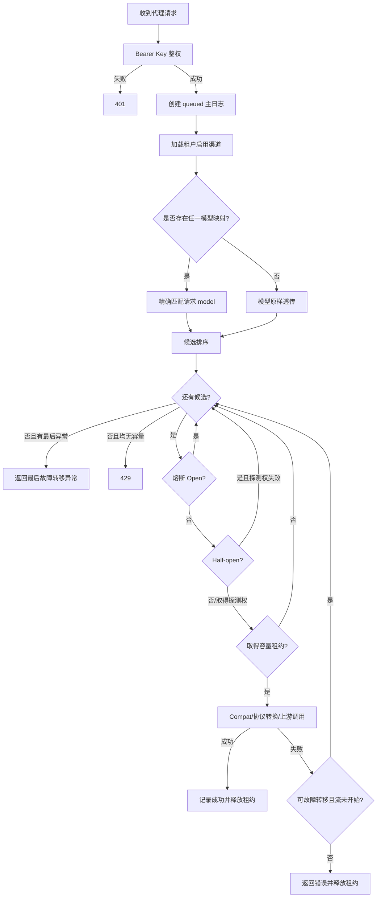
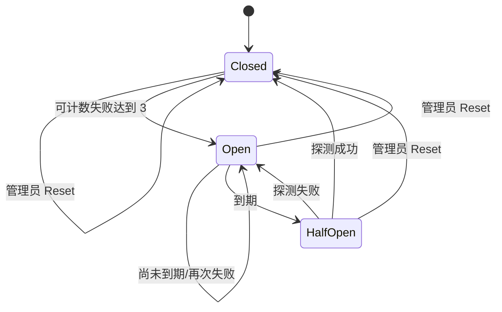

# OpenCodex PRD：路由与可靠性

## 文档元数据

| 项目 | 内容 |
|---|---|
| 文档编号 | PRD-07 |
| 需求前缀 | `REQ-RTE` |
| 文档状态 | 基于现状反向建模，待产品评审 |
| 基线版本 | `main@3827590` |
| 最后核对日期 | 2026-08-17 |
| 适用对象 | 产品、后端、测试、SRE、运维、安全 |
| 相关文档 | [渠道管理](./06-channel-management.md)、[协议转换](./08-protocol-conversion.md) |
| 事实优先级 | 当前源码与迁移 > 自动化测试 > 当前运行配置 > 说明性文档 |

> 本文使用 **当前实现事实 / 产品化要求 / 已知限制 / 待确认 TBD** 四种标签。产品化要求描述目标行为，不表示基线代码已经满足。

---

## 1. 目标与范围

### 1.1 产品目标

路由与可靠性模块负责把每个已鉴权的模型请求安全、确定且高可用地发送到合适的上游渠道。核心目标是：

1. 严格限制请求只能使用访问 API Key 所属用户的渠道。
2. 按模型映射、渠道类型、优先级、会话亲和和实时负载构造候选集。
3. 用容量限制防止单个渠道被并发压垮。
4. 用单渠道重试、跨渠道故障转移和熔断降低瞬时故障影响。
5. 保证流式请求在首字节前可安全故障转移，首字节后不产生协议拼接。
6. 在 Redis 可用和不可用时提供明确、可测试的可靠性语义。
7. 对每次路由决策和渠道尝试形成可追溯日志。

### 1.2 本文范围

- 候选渠道加载与模型匹配。
- 路由候选排序。
- `prompt_cache_key` 会话亲和。
- 渠道并发容量租约。
- 渠道内部 HTTP 重试。
- 跨渠道故障转移。
- 熔断器状态机和 Half-open 探测。
- 流式首字节边界。
- 路由缓存、Redis 降级、取消和日志。
- 图片请求的 OCR/视觉路由选择边界。

### 1.3 不在本文范围

- 渠道 CRUD 字段与管理界面，见 [06-channel-management.md](./06-channel-management.md)。
- 协议字段和 SSE 事件转换，见 [08-protocol-conversion.md](./08-protocol-conversion.md)。
- 访问 API Key 创建和后台 Cookie 登录流程。
- 上游模型本身的质量、限额和 SLA。
- 成本计费规则。

---

## 2. 角色与前置条件

### 2.1 角色

| 角色 | 与路由的关系 |
|---|---|
| 代理调用者 | 使用 `Authorization: Bearer ocx_...` 发起请求 |
| 渠道所有者 | 访问 Key 所属用户；只使用自己的渠道 |
| 超级管理员 | 可配置全体用户渠道，但代理请求仍以所用访问 Key 的所有者为路由租户 |
| SRE/运维 | 配置 Redis、多实例、容量、超时和网络环境，观测可靠性指标 |

### 2.2 前置条件

1. Bearer 访问 Key 有效、启用，且其所有者用户启用。
2. 请求体是 JSON 对象，并可读取请求模型。
3. 所属用户至少有一个符合接口类型约束的启用渠道。
4. 有模型映射模式下，请求模型必须精确命中至少一个映射。
5. 渠道配置已通过保存时校验。
6. 多实例强一致容量和熔断状态需要 Redis 可用。

---

## 3. 术语

| 术语 | 定义 |
|---|---|
| 入口协议 Entry Protocol | 客户端调用的协议：Responses、Chat 或 Messages |
| 渠道协议 Channel Protocol | 选中渠道配置的上游协议 |
| 候选渠道 Candidate | 对当前租户、模型和端点可用的一条渠道+模型映射 |
| 原始模型 Original Model | 客户端请求的模型名 |
| 上游模型 Upstream Model | 模型映射后发送给上游的模型名 |
| 映射模式 | 只要任一启用渠道含模型映射，就要求精确命中映射 |
| 无映射模式 | 所有启用渠道均没有模型映射，模型名原样透传 |
| 亲和键 Sticky Key | 请求字段 `prompt_cache_key`，用于记忆渠道 |
| 容量租约 | 请求占用渠道并发槽位的可释放对象 |
| 单渠道重试 | 同一渠道内部对网络错误、超时或特定 HTTP 状态重发请求 |
| 路由尝试 | 对一个候选渠道执行完其内部重试后的整体尝试 |
| 故障转移 | 当前候选最终失败后切换到下一候选渠道 |
| 首字节边界 | 流式响应是否已经向客户端写出任何内容的边界 |
| 熔断 Open | 渠道暂时不接收新请求 |
| Half-open | Open 到期后的有限探测状态 |

---

## 4. 当前实现事实

### 4.1 端到端路由流水线

当前文本代理请求按以下顺序执行：

1. 创建请求 ID 和默认请求状态。
2. 验证 Bearer 访问 Key，确定 `ownerUsername`、角色和 `apiKeyId`。
3. 验证请求体是 JSON 对象。
4. 提取 `model`、`stream`、`prompt_cache_key`，检测是否包含图片。
5. 创建生命周期为 `queued` 的主请求日志。
6. 只加载所属用户的渠道，并构造模型候选。
7. 按亲和、优先级、活跃请求数和原始顺序排序。
8. 对每个候选依次检查：启用状态、熔断状态、Half-open 探测权、容量租约。
9. 记忆亲和渠道。
10. 如有必要执行图片 OCR 降级、Web Search 模式处理、Compat 改写和协议转换。
11. 将日志标记为 `processing`。
12. 执行流式或非流式上游调用。
13. 成功时关闭熔断状态、释放容量并完成日志。
14. 失败时根据异常分类决定是否计入熔断、是否写 attempt 子日志、是否故障转移。



### 4.2 候选集构造

#### 决策表

| 条件 | 当前结果 |
|---|---|
| 无启用渠道 | 抛出 `no enabled channels configured` |
| 指定 `allowedChannelTypes` 后无渠道 | 同上 |
| 任一启用渠道存在至少一个映射对象 | 全局进入映射模式 |
| 映射模式且请求模型精确命中多个渠道 | 返回全部命中候选 |
| 映射模式但无精确匹配 | 抛出 `no enabled channel configured for model` |
| 所有启用渠道都无映射 | 仅返回配置顺序中的第一个启用渠道 |

重要语义：

- 当前模型匹配使用区分大小写的精确字符串比较。
- `requestContainsImages` 会传入路由服务，但当前主候选构造并未据此过滤或优先原生视觉渠道。
- 无映射模式只返回一个候选，因此不会利用其他无映射渠道做跨渠道故障转移。
- 专用 Images 端点可通过 `allowedChannelTypes` 限制为 `images` 渠道。

### 4.3 候选排序

对映射模式下的候选，排序分两层：

1. `ProxyRouteService` 初始排序：`priority ASC` → `position ASC` → `channel id ASC`。
2. `ProxyEndpointService` 请求时排序：
   - 亲和渠道优先。
   - `priority ASC`。
   - 当前活跃请求数 `ASC`。
   - 保持初始候选顺序。

#### 排序决策表

| 排序键 | 方向 | 说明 |
|---|---|---|
| `IsPreferred` | true 在前 | 命中 `prompt_cache_key` 的历史渠道 |
| `priority` | 小在前 | 显式业务优先级 |
| `active_requests` | 小在前 | 最少连接启发式 |
| 初始顺序 | 小在前 | position、ID 提供稳定性 |

### 4.4 会话亲和

1. 亲和键为请求顶层 `prompt_cache_key`。
2. Redis 可用时存储为 `affinity:{owner}:{stickyKey}`。
3. 默认滑动过期 30 分钟；读命中会刷新 TTL。
4. 无 Redis 时使用进程内并发字典。
5. owner 是亲和键的一部分，不同用户不会共享映射。
6. 当前在真正调用上游之前就写入亲和映射；若所有候选最终失败，可能保留最后一次失败候选。

### 4.5 容量限制

#### Redis 可用

- 每个 `(owner, channel)` 使用一个 Sorted Set。
- member 为随机 lease ID，score 为租约过期时间。
- 获取流程：清理过期租约 → 检查长度 → 插入租约。
- 使用 Redis 分布式锁保护上述三步。
- 锁最多尝试 3 次，每次间隔 10ms，锁 TTL 5 秒。
- 获取锁失败后会无锁尝试，占用极端情况下可能轻微超限。
- 租约 TTL 默认 600 秒，实例崩溃后可自动回收。
- 释放使用 fire-and-forget `ZREM`。

#### Redis 不可用

- 使用进程内计数器做硬限制。
- 每个实例独立，无法形成跨实例全局上限。

#### 展示计数

- 无论是否使用 Redis，都会维护本实例内计数。
- 管理台 `active_requests` 和“最少连接”排序读取的是本实例计数。
- 多实例下该数值不是全局真实并发数。

### 4.6 单渠道内部重试

上游 HTTP 客户端对同一渠道执行 `retry_count + 1` 次最大尝试。

可重试条件：

| 类型 | 可重试 |
|---|---:|
| HTTP 429 | 是 |
| HTTP 500 | 是 |
| HTTP 502 | 是 |
| HTTP 503 | 是 |
| HTTP 504 | 是 |
| HTTP 400/401/403 | 否，由当前渠道立即形成最终异常 |
| 连接异常 `HttpRequestException` | 是 |
| 渠道超时 | 是 |
| 客户端主动取消 | 否，立即传播取消 |
| HTTP 200 但流首个数据事件为可重试 rate-limit error | 是 |

退避：

- 优先使用上游 `Retry-After`。
- `Retry-After` 最大等待 30 秒。
- 无 `Retry-After` 时按 `500ms * 2^attempt`，最大 8 秒。
- 当前没有随机抖动 jitter。

### 4.7 跨渠道故障转移

单渠道内部重试全部耗尽后，代理层依据最终异常决定是否切换下一个候选。

| 最终异常 | 当前是否故障转移 | 是否计入熔断 |
|---|---:|---:|
| 上游 400 | 是 | 是 |
| 上游 403 | 是 | 是 |
| 上游 401 | 否 | 否 |
| 上游 429 | 是 | 是 |
| 上游 500 | 是 | 是 |
| 上游 502 | 是 | 是 |
| 上游 503 | 是 | 是 |
| 上游 504 | 是 | 是 |
| 本地 BadRequest 400 | 否 | 否 |
| RoutingException | 否 | 否 |
| 非 ProxyException | 否 | 否 |

每次候选尝试都会写 `request_type=attempt` 的子日志，包含：

- 尝试序号、重试序号。
- 渠道 ID、名称、协议、上游模型。
- 配置的内部重试次数。
- 状态码、结果、是否允许故障转移、耗时、错误摘要。

### 4.8 流式首字节边界

1. 流式请求在上游确认开始前，会先读取并检查首个有效流事件。
2. 在未向客户端写出任何内容前，候选失败可切换下一渠道。
3. SSE 响应头只在最终选定的上游流确认可用后准备。
4. 一旦 `TrackingProxyStreamWriter.HasWritten=true`，不再故障转移，避免两个渠道的事件拼接到同一个客户端流。
5. 所有候选在首字节前失败时，返回普通 JSON 错误，而不是先发送 SSE 头再失败。

### 4.9 熔断器

默认参数：

- 连续失败阈值：3。
- 默认 Open 时长：60 秒，但主代理会使用渠道 `circuit_break_duration_seconds` 覆盖。
- Half-open 最大同时探测：1。



特殊规则：

- 渠道 `enabled=false` 时健康状态为 Disabled。
- 熔断持续时间为 0 时，状态记录会被清除，渠道始终视为 Healthy。
- Redis 可用时状态跨实例共享；不可用时降级为进程内状态。

### 4.10 错误返回

- `UpstreamException` 对客户端统一映射为 HTTP 502，原始上游状态和响应只用于日志。
- 本地鉴权、请求校验、无路由和容量耗尽保持各自 401、400、404/路由错误或 429 语义。
- 若流已经开始，HTTP 状态不可再变更，异常由流中断和日志体现。

---

## 5. 路由字段与状态

### 5.1 影响路由的输入

| 来源 | 字段 | 作用 |
|---|---|---|
| 访问 Key | OwnerUserId/OwnerUsername | 租户隔离 |
| 请求 | `model` | 模型映射匹配 |
| 请求 | `prompt_cache_key` | 渠道亲和 |
| 请求 | `stream` | 决定流式故障转移边界 |
| 请求内容 | 图片存在性 | 决定是否触发图片降级；当前不影响主候选排序 |
| 渠道 | `enabled` | 是否进入候选集 |
| 渠道 | `type` | 上游协议及端点过滤 |
| 渠道 | `models` | 模型候选构造 |
| 渠道 | `priority` | 候选优先级 |
| 渠道 | `position` | 稳定排序 |
| 渠道 | `capacity` | 并发上限 |
| 渠道 | `retry_count` | 单渠道内部重试次数 |
| 渠道 | `timeout_seconds` | 单次上游尝试超时 |
| 渠道 | `circuit_break_duration_seconds` | 熔断 Open 保持时间 |

### 5.2 请求日志状态

```text
queued -> processing -> success
                    \-> failed
```

| 状态 | 进入时机 |
|---|---|
| `queued` | 已鉴权、已解析基本请求，但尚未选择并调用上游 |
| `processing` | 已选候选并完成上游请求构造 |
| `success` | 最终客户端状态成功且无错误 |
| `failed` | 最终状态失败或记录了错误 |

---

## 6. 接口契约摘要

路由本身没有独立公开“选择渠道”接口，主要通过代理端点体现：

| 方法与路径 | 路由行为 |
|---|---|
| `GET /models`、`GET /v1/models` | 按访问 Key 所属用户汇总可路由模型 |
| `POST /responses`、`POST /v1/responses` | 使用 Responses 入口协议参与路由 |
| `POST /chat/completions`、`POST /v1/chat/completions` | 使用 Chat 入口协议参与路由 |
| `POST /messages`、`POST /v1/messages` | 使用 Messages 入口协议参与路由 |
| `POST /images/generations`、`POST /v1/images/generations` | 仅选择 Images 类型渠道 |
| `POST /images/edits`、`POST /v1/images/edits` | 仅选择 Images 类型渠道 |
| `GET /channels` | 返回渠道活跃数和健康状态 |
| `POST /channels/{id}/reset-health` | 重置指定渠道熔断状态 |
| `GET /stats/active-channels` | 查询活跃渠道队列 |
| `GET /stats/active-channels/stream` | SSE 实时输出队列 |

### 6.1 主要错误摘要

| 场景 | HTTP | 当前描述示例 |
|---|---:|---|
| 缺少或无效访问 Key | 401 | `valid bearer api key required` |
| 请求体不是 JSON 对象 | 400 | `request body must be a JSON object` |
| 无启用渠道 | 400/路由异常 | `no enabled channels configured` |
| 模型无映射 | 400/路由异常 | `no enabled channel configured for model: ...` |
| 全部候选容量已满 | 429 | `all enabled channels for model ... are at capacity` |
| 上游最终失败 | 502 | 对客户端隐藏原始上游细节 |
| 客户端取消 | 连接取消 | 不继续重试或故障转移 |

---

## 7. 产品化需求与验收标准

### REQ-RTE-001 租户路由隔离（MUST）

**要求：** 每个代理请求只能加载访问 Key 所属用户的渠道。

**验收标准：**

1. 两个用户配置同名模型时，各自请求只命中自己的渠道。
2. 超级管理员创建的全局渠道不会自动成为普通用户兜底渠道。
3. 用户停用后，其所有访问 Key 请求均在路由前失败。

### REQ-RTE-002 映射模式判定（MUST）

**要求：** 模型映射模式必须有明确且稳定的判定规则。

**验收标准：**

1. 存在任一有效映射时，只返回精确匹配候选。
2. 未命中时返回明确的模型不可用错误。
3. 匹配是否区分大小写必须由产品决策固定并测试；基线为区分大小写。

### REQ-RTE-003 无映射兜底（MUST）

**要求：** 无映射模式下的候选数量和故障转移语义必须明确。

**验收标准：**

1. 当前兼容模式至少保证第一个启用渠道收到原模型名。
2. 若产品决定支持多候选兜底，所有启用渠道须按确定顺序返回并覆盖故障转移测试。
3. 行为不得因数据库无序读取而变化。

### REQ-RTE-004 渠道类型过滤（MUST）

**要求：** 专用端点只能路由到兼容的渠道类型。

**验收标准：**

1. Images 端点不会选择 Responses/Chat/Messages 渠道。
2. 文本代理不会错误调用 Images 上游。
3. 过滤后无候选时返回明确错误。

### REQ-RTE-005 确定性排序（MUST）

**要求：** 相同配置和运行时快照必须产生相同候选顺序。

**验收标准：**

1. 排序依次使用亲和、priority、active requests、position、ID。
2. 同优先级、同负载候选在重复请求中顺序稳定。
3. 排序规则在管理台可解释。

### REQ-RTE-006 最少连接选择（SHOULD）

**要求：** 同优先级候选优先选择当前负载较低者。

**验收标准：**

1. 一个候选活跃数更低时被优先选择。
2. 请求完成或失败后计数恢复。
3. 多实例环境标明该排序是本实例启发式，除非实现全局计数。

### REQ-RTE-007 会话亲和（MUST）

**要求：** 非空 `prompt_cache_key` 应优先选择此前成功使用的渠道，并按租户隔离。

**验收标准：**

1. 记忆后再次请求优先同一渠道。
2. 亲和渠道容量满或 Open 时自动选择其他候选。
3. 不同 owner 使用相同 sticky key 不共享渠道。
4. 亲和 TTL 命中时滑动续期。

### REQ-RTE-008 亲和写入时机（SHOULD）

**要求：** 产品化版本应仅在渠道确认成功或流确认开始后记忆亲和。

**验收标准：**

1. 全部失败不会把失败渠道写成最终亲和值。
2. 故障转移成功后记忆最终成功渠道。
3. 首字节后中断的流由产品规则决定是否保留亲和，并有测试。

### REQ-RTE-009 渠道容量硬限制（MUST）

**要求：** 达到正整数容量后，不再为该渠道分配新主请求租约。

**验收标准：**

1. 容量为 N 时第 N+1 个并发请求无法取得租约。
2. 成功、失败、取消均释放租约。
3. 容量满时可继续尝试其他候选。

### REQ-RTE-010 分布式容量（MUST）

**要求：** 多实例部署且 Redis 可用时，容量上限必须跨实例共享。

**验收标准：**

1. 两实例合计并发不超过配置容量。
2. 崩溃租约在 TTL 后自动回收。
3. Redis 锁失败路径有超限监控指标。

### REQ-RTE-011 降级语义（MUST）

**要求：** Redis 不可用时服务继续运行，但必须明确退化为单实例局部状态。

**验收标准：**

1. Redis 断开不导致所有代理请求失败。
2. 日志和指标产生 `redis_degraded` 状态。
3. 管理台提示容量、熔断、亲和可能不是全局一致。

### REQ-RTE-012 单渠道重试（MUST）

**要求：** 每个候选在跨渠道切换前，按 `retry_count` 对可重试故障执行内部重试。

**验收标准：**

1. 总尝试数为 `retry_count + 1`。
2. 400/401/403 不在内部重试集合。
3. 网络异常、超时、429、500、502、503、504 可重试。
4. 客户端主动取消不重试。

### REQ-RTE-013 退避与 Retry-After（MUST）

**要求：** 重试必须尊重合理的 `Retry-After` 并实施有上限的指数退避。

**验收标准：**

1. `Retry-After` 最大等待 30 秒。
2. 无该头时退避不超过 8 秒。
3. 产品化版本 SHOULD 增加 jitter，并通过可控时钟测试。

### REQ-RTE-014 流内错误探测（MUST）

**要求：** HTTP 200 但首个 SSE 数据事件表示限流错误时，应在写给客户端前执行内部重试或故障转移。

**验收标准：**

1. 首事件 rate-limit error 不直接发送客户端。
2. 内部重试耗尽后形成 429 类型上游异常。
3. 若下一渠道成功，客户端只看到成功渠道事件。

### REQ-RTE-015 跨渠道故障转移（MUST）

**要求：** 可故障转移异常应切换到下一可用候选，其他异常立即结束。

**验收标准：**

1. 上游 400、403、429、500、502、503、504 按当前兼容规则切换。
2. 上游 401、本地 400、路由错误不切换。
3. 每个候选至多执行一次代理层路由尝试。

### REQ-RTE-016 流式首字节保护（MUST）

**要求：** 流式响应只允许在任何下游字节写出前故障转移。

**验收标准：**

1. 首字节前失败可切换。
2. 首字节后失败不调用下一渠道。
3. 全部首字节前失败时返回 JSON 错误且不准备 SSE。

### REQ-RTE-017 熔断状态机（MUST）

**要求：** 可计数失败达到阈值后进入 Open，到期进入 Half-open，成功关闭，失败重开。

**验收标准：**

1. 第三次连续可计数失败打开熔断。
2. Open 未到期时跳过渠道。
3. Half-open 同时最多一个探测请求。
4. 探测成功清除失败计数。

### REQ-RTE-018 熔断失败分类（MUST）

**要求：** 本地请求错误不得污染渠道健康；上游故障分类必须可配置和可审计。

**验收标准：**

1. 本地 BadRequest 不计数。
2. 上游 401 不计数。
3. 当前兼容规则下上游 400/403 计数；若产品变更，测试和迁移说明同步更新。

### REQ-RTE-019 容量耗尽响应（MUST）

**要求：** 有候选但所有候选都因容量或 Half-open 探测权不可用时，返回 429。

**验收标准：**

1. HTTP 状态为 429。
2. 错误不得包含上游秘密。
3. 日志可区分“容量耗尽”与“无渠道配置”。

### REQ-RTE-020 上游错误隔离（MUST）

**要求：** 最终上游错误对客户端使用统一代理错误，原始状态和正文只进入受控日志。

**验收标准：**

1. 最终 `UpstreamException` 返回 502。
2. 客户端响应不包含渠道 API Key、内部地址或未经脱敏的上游正文。
3. 有权限的日志详情保留排障所需摘要。

### REQ-RTE-021 请求取消（MUST）

**要求：** 客户端取消必须传递到上游、停止重试并释放所有运行时租约。

**验收标准：**

1. 取消后不再发起新 HTTP 尝试或新候选。
2. 容量计数回到取消前值。
3. Half-open 探测权被释放或状态正确收敛。

### REQ-RTE-022 路由缓存一致性（MUST）

**要求：** 渠道配置变更后，所有相关实例应读取新候选集。

**验收标准：**

1. 渠道启停、删除、优先级和模型映射修改立即影响下一请求。
2. 超级管理员修改他人渠道时失效目标 owner 的缓存。
3. 缓存版本和失效失败有指标。

### REQ-RTE-023 图片能力路由（SHOULD）

**要求：** 含图片请求应优先原生支持图片的匹配渠道；无法原生处理时再执行 OCR 降级。

**验收标准：**

1. 有原生视觉候选时不执行 OCR。
2. OCR 路由优先同渠道视觉模型，再选择其他渠道。
3. 无视觉路由时返回明确错误或执行已定义的本地降级。

### REQ-RTE-024 尝试级日志（MUST）

**要求：** 每个候选尝试必须形成主请求可关联的子日志。

**验收标准：**

1. 子日志包含 route attempt number、渠道、模型、状态、耗时和故障转移资格。
2. 多次故障转移的子日志顺序可还原。
3. 子日志不得重复计入用户主请求统计。

### REQ-RTE-025 可靠性指标（MUST）

**要求：** 系统必须输出足以区分内部重试、跨渠道切换、熔断和容量拒绝的指标。

**验收标准：**

1. 至少包含 route_attempts、upstream_retries、failovers、capacity_rejections、circuit_opens、half_open_probes。
2. 指标可按 owner、channel、model、protocol 聚合，但不得把访问 Key 明文作为标签。
3. 可计算最终成功率、首选渠道成功率和故障转移挽救率。

---

## 8. 数据、安全与可观测性影响

### 8.1 数据与共享状态

| 状态 | Redis 可用 | Redis 不可用 | 持久化 |
|---|---|---|---|
| 路由渠道缓存 | L1 + L2 | L1 | 否，源数据在数据库 |
| API Key 鉴权缓存 | L1 + L2 | L1 | 否 |
| 亲和映射 | Redis | 进程内 | 临时 |
| 容量租约 | Redis Sorted Set | 进程内计数 | 临时 |
| 熔断状态 | Redis | 进程内 | 临时 |
| 请求/尝试日志 | 数据库 | 数据库 | 是 |

### 8.2 安全

- owner 必须参与所有 Redis key，防止跨租户污染。
- sticky key 来源于客户端，Redis key 构造需考虑长度、控制字符和内存滥用。
- 路由日志不得记录访问 Key 或上游 Key 明文。
- 上游地址和 headers 来自渠道配置，路由模块必须承接 SSRF 和危险 Header 防护结果。
- 上游错误正文只能向有权限的日志查看者开放。

### 8.3 可观测性建议

关键 SLI：

- 代理最终成功率。
- 首选候选成功率。
- 平均候选尝试数。
- 单渠道内部平均重试数。
- 故障转移成功率。
- 容量拒绝率。
- 熔断 Open 时长和频率。
- Redis 降级持续时间。
- 流式首字节前失败率、TTFT P50/P95/P99。
- 候选构造失败中“无渠道”和“无模型映射”的占比。

---

## 9. 已知限制

1. 无映射模式只返回第一个启用渠道，其他渠道不会用于故障转移。
2. “任一渠道有映射”会让整个租户进入严格映射模式，未映射渠道不再兜底。
3. 模型映射当前是区分大小写的精确匹配。
4. `requestContainsImages` 当前未参与主候选排序或过滤。
5. 亲和映射在上游成功前写入，全部失败时可能记住失败渠道。
6. 多实例下 active request 展示和最少连接排序只反映本实例。
7. Redis 容量锁失败后的无锁降级可能轻微超限。
8. 容量租约固定 600 秒，不会随长请求主动续租；超过 TTL 的长请求可能导致全局容量短暂超发。
9. 重试退避没有 jitter，大规模同时失败时可能形成重试同步。
10. 上游 400/403 会故障转移并计入熔断，可能把请求兼容问题误判为渠道故障。
11. `retry_count` 与候选数相乘，极端情况下总上游调用次数较高。
12. 路由缓存 TTL 为 60 秒，超级管理员修改其他 owner 渠道存在陈旧窗口。
13. 熔断状态不持久化；Redis 和进程重启后状态丢失。
14. 没有权重、百分比分流、灰度、地域、价格或质量评分路由。
15. 没有每模型独立容量，容量仅按 owner+channel 计数。

---

## 10. 待确认 TBD

| 编号 | 问题 | 建议默认值 |
|---|---|---|
| TBD-RTE-001 | 无映射模式是否应返回全部启用渠道 | 是，以支持故障转移 |
| TBD-RTE-002 | 模型匹配是否忽略大小写 | 建议忽略大小写但保留原模型名 |
| TBD-RTE-003 | 上游 400 是否应故障转移/熔断 | 默认否，仅明确的渠道兼容错误例外 |
| TBD-RTE-004 | 上游 403 是否应故障转移/熔断 | 默认是，通常代表渠道权限或额度问题 |
| TBD-RTE-005 | 长请求容量租约是否续租 | 建议后台续租直到请求结束 |
| TBD-RTE-006 | Redis 不可用时是否允许多实例继续接流量 | 建议允许但触发高优告警 |
| TBD-RTE-007 | sticky key 的最大长度和配额 | 建议 256 字符、按 owner 限制条目数 |
| TBD-RTE-008 | 是否引入加权轮询或百分比分流 | 首版不引入 |
| TBD-RTE-009 | 是否允许按成本/延迟动态路由 | 后续版本评估 |
| TBD-RTE-010 | 首字节后中断是否影响熔断计数 | 建议计数，但不故障转移 |
| TBD-RTE-011 | 容量为 0 的语义 | 建议禁止；停用应使用 enabled=false |
| TBD-RTE-012 | 路由失败是否向客户端暴露候选数量 | 默认不暴露，仅日志记录 |

---

## 11. 源码与测试追溯

| 能力 | 源码锚点 | 现有测试锚点 |
|---|---|---|
| 主路由编排 | `opencodex_proxy/src/Libraries/OpenCodex.Core/Services/Proxy/ProxyEndpointService.cs` | `ProxyEndpointServiceTests.cs` |
| 候选构造/排序 | `ProxyRouteService.cs` | `ProxyEndpointServiceTests.ProxyAsync_SamePriorityPrefersLessBusyChannel` |
| 容量耗尽 | `ChannelCapacityService.cs`、`ProxyEndpointService.cs` | `ProxyEndpointServiceTests.ProxyAsync_AllCandidatesAtCapacity_ReturnsTooManyRequests` |
| 容量释放 | `ChannelCapacityService.Lease` | `ProxyAsync_NonStreamSuccess_ReleasesCapacity`、`NonStreamFailure_ReleasesCapacity`、流式对应测试 |
| 会话亲和 | `ChannelAffinityService.cs` | `ChannelAffinityServiceTests.cs`、`ProxyAsync_StickyKeyRoutesToPreviouslyRememberedChannel` |
| 熔断状态机 | `ChannelCircuitBreakerService.cs` | `ChannelCircuitBreakerServiceTests.cs` |
| Open/Half-open 路由 | `ProxyEndpointService.cs` | `ProxyAsync_OpenCircuit_SkipsPrimaryChannel`、`HalfOpenProbeSuccess_ClosesCircuit` |
| 单渠道重试 | `HttpUpstreamClient.cs`、`HttpUpstreamClient.Streaming.cs` | `UpstreamStreamErrorRetryTests.cs`、`ProxyCompatibilityTests.cs` |
| 故障转移分类 | `ProxyFailoverPolicy.cs` | `ProxyFailoverPolicyTests.cs` |
| 非流式故障转移 | `ProxyEndpointService.cs` | `ProxyAsync_NonStreamRetryableFailure_FailsOverToNextChannel`、`NonStreamUpstreamBadRequest_FailsOverToNextChannel` |
| 流式首字节保护 | `ProxyEndpointService.cs`、`TrackingProxyStreamWriter.cs` | `ProxyAsync_StreamRetryableFailureBeforeFirstByte_FailsOverToNextChannel`、`AfterFirstByte_DoesNotFailover` |
| SSE 延迟准备 | `ProxyStreamResponseWriter.cs`、`ProxyEndpointService.cs` | `ProxyAsync_StreamFailoverSuccess_PrepareSseOnlyCalledAfterFailoverSucceeds` |
| 尝试子日志 | `ProxyEndpointService.WriteChannelAttemptLogAsync` | `ProxyAsync_NonStreamRetryableFailure_WritesAttemptChildLogs` |
| 路由配置缓存 | `ProxyRouteService.ReadExpandedChannelValuesAsync`、`TwoLevelCacheService.cs` | 现有集成测试间接覆盖；建议补专门多实例测试 |
| 图片识别转移路由 | `ProxyRouteService.ListVisionTransferRoutesAsync`、`ProxyImageFallbackService.cs`、`VisionTransferSettingsService.cs` | `ProxyVisionRoutingTests.cs`、`ProxyVisionTransferFallbackTests.cs`、`VisionTransferSettingsServiceTests.cs` |

---

## 12. 发布验收建议

1. 建立 3 个同模型渠道，分别验证优先级、负载、亲和、容量和熔断的组合排序。
2. 对每种可重试与不可重试状态执行“内部重试次数 × 候选故障转移”矩阵测试。
3. 用真实 SSE 上游验证首事件错误、首字节前断开、首字节后断开。
4. 进行 Redis 故障注入：断开、恢复、锁超时、实例崩溃和租约过期。
5. 用两个应用实例验证全局容量、熔断和亲和；同时确认 active request 展示语义。
6. 验证取消请求后没有容量泄漏、Half-open 探测泄漏或后台重试残留。
7. 执行 `dotnet test opencodex_proxy/OpenCodex.sln`，并为所有 `REQ-RTE-*` MUST 项建立自动化用例或明确的发布检查项。
