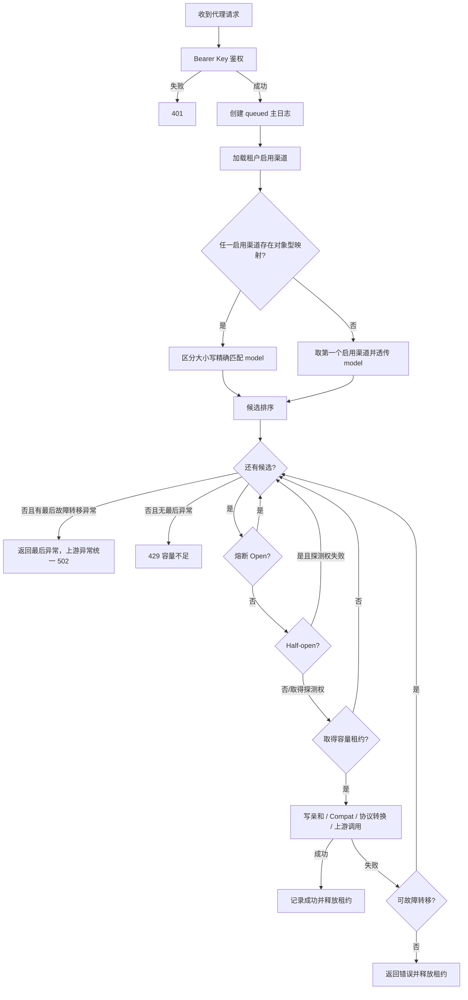
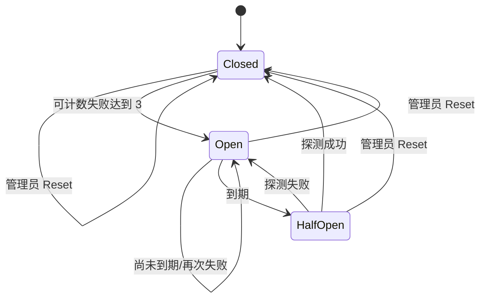

# OpenCodex PRD：路由与可靠性

## 文档元数据

| 项目 | 内容 |
|---|---|
| 文档编号 | PRD-07 |
| 需求前缀 | `REQ-RTE` |
| 文档状态 | 基于现状反向建模，待产品评审 |
| 基线版本 | `main@235da3f4` |
| 最后核对日期 | 2026-09-30 |
| 适用对象 | 产品、后端、测试、SRE、运维、安全 |
| 相关文档 | [渠道管理](./06-channel-management.md)、[协议转换](./08-protocol-conversion.md) |
| 事实优先级 | 当前源码与迁移 > 自动化测试 > 当前运行配置 > 说明性文档 |

> 本文使用 **当前实现事实 / 产品化要求 / 已知限制 / 待确认 TBD** 四种标签。产品化要求描述目标行为，不表示基线代码已经满足。

---

## 1. 目标与范围

### 1.1 产品目标

路由与可靠性模块负责把每个已鉴权的模型请求安全、确定且高可用地发送到合适的上游渠道。核心目标是：

1. 严格限制请求只能使用访问 API Key 所属用户的渠道。
2. 按模型映射、渠道类型、优先级、会话亲和和实时负载构造候选集。
3. 用容量限制防止单个渠道被并发压垮。
4. 用单渠道重试、跨渠道故障转移和熔断降低瞬时故障影响。
5. 保证流式请求在首字节前可安全故障转移，首字节后不产生协议拼接。
6. 在 Redis 可用和不可用时提供明确、可测试的可靠性语义。
7. 对每次路由决策和渠道尝试形成可追溯日志。

### 1.2 本文范围

- 候选渠道加载与映射/透传模式判定。
- 路由候选排序。
- `prompt_cache_key` 会话亲和。
- 渠道并发容量租约。
- 渠道内部 HTTP 重试、退避与 `Retry-After`。
- 跨渠道故障转移。
- 熔断器状态机和 Half-open 探测。
- 流式首行、首事件错误、空骨架与内置工具副作用边界。
- 渠道超时作用范围。
- 路由缓存、Redis 降级、取消、日志与统一上游错误。
- 图片请求的 OCR/视觉路由选择边界。

### 1.3 不在本文范围

- 渠道 CRUD 字段与管理界面，见 [06-channel-management.md](./06-channel-management.md)。
- 协议字段和 SSE 事件转换，见 [08-protocol-conversion.md](./08-protocol-conversion.md)。
- 访问 API Key 创建和后台 Cookie 登录流程。
- 上游模型本身的质量、限额和 SLA。
- 成本计费规则。

---

## 2. 角色与前置条件

### 2.1 角色

| 角色 | 与路由的关系 |
|---|---|
| 代理调用者 | 使用 `Authorization: Bearer ocx_...` 发起请求 |
| 渠道所有者 | 访问 Key 所属用户；只使用自己的渠道 |
| 超级管理员 | 可配置全体用户渠道，但代理请求仍以所用访问 Key 的所有者为路由租户 |
| SRE/运维 | 配置 Redis、多实例、容量、超时和网络环境，观测可靠性指标 |

### 2.2 前置条件

1. Bearer 访问 Key 有效、启用，且其所有者用户启用。
2. 请求体是 JSON 对象，并可读取请求模型。
3. 所属用户至少有一个符合接口类型约束的启用渠道。
4. 有模型映射模式下，请求模型必须精确命中至少一个映射。
5. 渠道配置已通过保存时校验。
6. 多实例强一致容量和熔断状态需要 Redis 可用。

---

## 3. 术语

| 术语 | 定义 |
|---|---|
| 入口协议 Entry Protocol | 客户端调用的协议：Responses、Chat 或 Messages |
| 渠道协议 Channel Protocol | 选中渠道配置的上游协议 |
| 候选渠道 Candidate | 对当前租户、模型和端点可用的一条渠道+模型映射 |
| 原始模型 Original Model | 客户端请求的模型名 |
| 上游模型 Upstream Model | 模型映射后发送给上游的模型名 |
| 映射模式 | 只要任一启用渠道含模型映射，就要求精确命中映射 |
| 无映射模式 | 所有启用渠道均没有模型映射，模型名原样透传 |
| 亲和键 Sticky Key | 请求字段 `prompt_cache_key`，用于记忆渠道 |
| 容量租约 | 请求占用渠道并发槽位的可释放对象 |
| 单渠道重试 | 同一渠道内部对网络错误、超时或特定 HTTP 状态重发请求 |
| 路由尝试 | 对一个候选渠道执行完其内部重试后的整体尝试 |
| 故障转移 | 当前候选最终失败后切换到下一候选渠道 |
| 首字节边界 | `TrackingProxyStreamWriter.HasWritten` 是否已经记录到下游有效写出 |
| 熔断 Open | 渠道暂时不接收新请求 |
| Half-open | Open 到期后的有限探测状态 |
| 内置工具副作用 | Web Search 等内置工具已在某个候选上执行，后续不应再切换渠道重放 |

---

## 4. 当前实现事实

### 4.1 端到端路由流水线

当前文本代理请求按以下顺序执行：

1. 创建请求 ID 和默认请求状态。
2. 验证 Bearer 访问 Key，确定 `ownerUsername`、角色和 `apiKeyId`。
3. 验证请求体是 JSON 对象。
4. 提取 `model`、`stream`、`prompt_cache_key`，检测是否包含图片。
5. 创建生命周期为 `queued` 的主请求日志。
6. 只加载所属用户的渠道，并构造模型候选。
7. 按亲和、priority、本实例活跃请求数和原始候选顺序排序。
8. 对每个候选依次检查：熔断 Open、Half-open 探测权、容量租约。
9. 取得容量租约后写入 `prompt_cache_key` 亲和映射。
10. 如有必要执行图片 OCR 降级、Web Search 模式处理、内置工具注册、Multi-Agent v2 改写、Compat 改写和协议转换。
11. 将日志标记为 `processing`。
12. 执行流式或非流式上游调用。
13. 成功时关闭熔断状态、释放容量并完成日志。
14. 失败时根据异常分类决定是否计入熔断、是否写 attempt 子日志、是否故障转移。


```mermaid
flowchart TD
    A[收到代理请求] --> B[Bearer Key 鉴权]
    B -- 失败 --> B1[401]
    B -- 成功 --> C[创建 queued 主日志]
    C --> D[加载租户启用渠道]
    D --> E{任一启用渠道存在对象型映射?}
    E -- 是 --> F[区分大小写精确匹配 model]
    E -- 否 --> G[取第一个启用渠道并透传 model]
    F --> H[候选排序]
    G --> H
    H --> I{还有候选?}
    I -- 否且有最后故障转移异常 --> X[返回最后异常，上游异常统一 502]
    I -- 否且无最后异常 --> Y[429 容量不足]
    I -- 是 --> J{熔断 Open?}
    J -- 是 --> I
    J -- 否 --> K{Half-open?}
    K -- 是且探测权失败 --> I
    K -- 否/取得探测权 --> L{取得容量租约?}
    L -- 否 --> I
    L -- 是 --> M[写亲和 / Compat / 协议转换 / 上游调用]
    M -- 成功 --> N[记录成功并释放租约]
    M -- 失败 --> O{可故障转移?}
    O -- 是 --> I
    O -- 否 --> P[返回错误并释放租约]
```

### 4.2 候选集构造

#### 决策表

| 条件 | 当前结果 |
|---|---|
| 无启用渠道 | 抛出 `RoutingException`：`no enabled channels configured` |
| 指定 `allowedChannelTypes` 后无渠道 | 同上 |
| 任一启用渠道存在至少一个对象型映射 | 全局进入映射模式 |
| 映射模式且请求模型精确命中多个渠道 | 返回全部命中候选 |
| 映射模式但无精确匹配 | 抛出 `RoutingException`，HTTP 400 |
| 所有启用渠道都无对象型映射 | 仅返回第一个启用渠道 |

重要语义：

- “有映射”按 `HasAnyModelMappings` 判断：只要任一启用渠道的 `models` 中存在对象项，就进入全局映射模式。
- 模型匹配使用 `StringComparison.Ordinal`，区分大小写。
- 映射模式未命中时不会回落到无映射渠道。
- 无映射模式只返回一个候选，模型名原样透传，不利用其他无映射渠道故障转移。
- 无映射模式取的是渠道加载顺序中的第一个启用渠道；加载顺序为 `Position ASC`、`id ASC`，不受 `priority` 影响。
- `ListRouteCandidatesAsync(owner, model, allowedChannelTypes)` 支持类型过滤，但当前文本代理入口调用不带过滤的重载；图片端点服务接口存在，但当前源码没有注册实现。

### 4.3 候选排序

排序分两层：

1. `ProxyRouteService` 初始排序：`priority ASC` → `position ASC` → `channel id ASC`。
2. `ProxyEndpointService.OrderCandidatesAsync` 请求时排序：
   - 亲和渠道优先。
   - `priority ASC`。
   - 本实例活跃请求数 `ASC`。
   - 保持初始候选顺序。

#### 排序决策表

| 排序键 | 方向 | 说明 |
|---|---|---|
| `IsPreferred` | true 在前 | 命中 `prompt_cache_key` 的历史渠道 |
| `priority` | 小在前 | 显式业务优先级 |
| `active_requests` | 小在前 | 本实例最少连接启发式 |
| 初始顺序 | 小在前 | 由 priority、position、ID 形成 |

### 4.4 会话亲和

1. 亲和键为请求顶层 `prompt_cache_key`。
2. Redis 可用时存储为 `affinity:{owner}:{stickyKey}`，值为 `channelId`。
3. 默认滑动过期 30 分钟；Redis 命中执行 `GET+EXPIRE`，进程内命中会延长 `ExpiresAt`。
4. 无 Redis 时使用进程内并发字典；同样按滑动 TTL 过期。
5. owner 是亲和键的一部分，不同用户不会共享映射。
6. 当前在真正调用上游之前就写入亲和映射；若该候选最终失败，可能保留最后一次失败候选。
7. 当前没有 sticky key 长度限制或条目配额。

### 4.5 容量限制

#### Redis 可用

- 每个 `(owner, channel)` 使用一个 Sorted Set。
- member 为随机 lease ID，score 为租约过期时间。
- 获取流程：清理过期租约 → 检查长度 → 插入租约。
- 使用 Redis 分布式锁保护上述三步。
- 锁最多尝试 3 次，每次间隔 10ms，锁 TTL 5 秒。
- 获取锁失败后会无锁尝试，极端竞态下可能轻微超限。
- 租约 TTL 固定 600 秒，不会随请求续租；实例崩溃后靠 TTL 回收。
- 释放使用 fire-and-forget `ZREM`，丢失释放时也靠 TTL 回收。

#### Redis 不可用

- 使用进程内计数器做硬限制。
- 每个实例独立，无法形成跨实例全局上限。

#### 展示计数

- 无论是否使用 Redis，都会维护本实例内计数。
- 管理台 `active_requests` 和“最少连接”排序读取的是本实例计数。
- 多实例下该数值不是全局真实并发数。
- `ChannelCapacityService` 仅在 `capacity>0` 时启用硬限；`capacity<=0` 在该服务内按无硬限处理，但 `ConfigValidator` 不允许通过管理接口保存非正整数容量。

### 4.6 单渠道内部重试

上游 HTTP 客户端对同一渠道执行 `retry_count + 1` 次最大尝试。

可重试条件：

| 类型 | 可重试 |
|---|---:|
| HTTP 429 | 是 |
| HTTP 500 | 是 |
| HTTP 502 | 是 |
| HTTP 503 | 是 |
| HTTP 504 | 是 |
| HTTP 400/401/403 | 否，由当前渠道立即形成最终异常 |
| 连接异常 `HttpRequestException` | 是 |
| 渠道超时 | 是 |
| 客户端主动取消 | 否，立即传播取消 |
| HTTP 200 且 JSON body 为可识别错误 | 否；`ReadJsonObject` 抛 429 `UpstreamException`，不进入重试循环 |
| HTTP 200 且 SSE 首个 `data` 对象为 `{"type":"error",...}` | 是；流式解析器把它当作可重试错误 |
| HTTP 200 但只有 `response.created/response.in_progress` 空骨架 | 是；重试耗尽后抛 502 |

退避：

- 优先使用上游 `Retry-After`；其 Delta/Date 计算值小于等于 0 时退回为 0，再由下限修正。
- 无 `Retry-After` 时使用 `2s * 2^attempt`，指数项先夹到 8 秒。
- 所有路径叠加 0 到 20% 的向上抖动。
- 最终统一夹到 `[2s, 30s]`；因此实际等待不会低于 2 秒，也不会超过 30 秒。

### 4.7 跨渠道故障转移

单渠道内部重试全部耗尽后，代理层依据最终异常决定是否切换下一个候选。

| 最终异常 | 当前是否故障转移 | 是否计入熔断 |
|---|---:|---:|
| 上游 400（`UpstreamException`） | 是 | 是 |
| 上游 403（`UpstreamException`） | 是 | 是 |
| 上游 401 | 否 | 否 |
| 上游 429 | 是 | 是 |
| 上游 500/502/503/504 | 是 | 是 |
| 本地 BadRequest 400 | 否 | 否 |
| RoutingException | 否 | 否 |
| 非 ProxyException | 否 | 否 |

额外门禁：

- 流式请求只有 `TrackingProxyStreamWriter.HasWritten=false` 时才允许故障转移。
- 任一内置工具已经执行（`BuiltinToolRequestContext.HasExecuted=true`）时不允许故障转移。
- 每个候选尝试都会写 `request_type=attempt` 的子日志，包含尝试序号、重试序号、渠道 ID、名称、协议、上游模型、配置重试次数、状态码、结果、故障转移资格、耗时和错误摘要。

### 4.8 流式首字节边界

1. `TrackingProxyStreamWriter` 在第一条实际行到来前不会调用 `PrepareSse`。
2. 在未向客户端写出内容前，候选失败可切换下一渠道。
3. SSE 响应头在第一条行写出时准备，不要求成功候选先完整读完。
4. 一旦 `TrackingProxyStreamWriter.HasWritten=true`，不再故障转移，避免两个渠道的事件拼接到同一个客户端流。
5. 默认同协议透传模式下，任意行写出都会把 `HasWritten` 置为 true。
6. 跨协议转换模式下构造函数使用 `countOnlyMeaningfulWrites=true`：`response.created`、`response.in_progress` 等骨架行不置 `HasWritten`，只有非骨架行才置 true。
7. 所有候选在首行写出前失败时，返回普通 JSON 错误，而不是先发送 SSE 头再失败。
8. 跨协议骨架行可能已经调用 `PrepareSse`，但此时 `HasWritten` 仍可能为 false；该边界由测试固定为已知行为，产品化前需要确认是否要改为“`PrepareSse` 后即禁止转移”。

### 4.9 熔断器

默认参数：

- 连续失败阈值：3。
- 默认 Open 时长：60 秒。
- Half-open 最大同时探测：1。
- 主代理会把渠道 `circuit_break_duration_seconds` 作为 Open 时长覆盖；0 表示清除并保持健康。

可计数失败集合：

- `UpstreamException` 状态为 400、403、429、500、502、503、504。
- 本地 `BadRequestException` 不计数。
- 上游 401 不计数。
- 其他未被枚举的 5xx 或 4xx 不计数。


```mermaid
stateDiagram-v2
    [*] --> Closed
    Closed --> Closed: 不计数失败
    Closed --> Closed: 可计数失败 < 3
    Closed --> Open: 可计数失败达到 3
    Open --> Open: 尚未到期/再次失败
    Open --> HalfOpen: 到期
    HalfOpen --> Closed: 探测成功
    HalfOpen --> Open: 探测失败
    Closed --> Closed: 管理员 Reset
    Open --> Closed: 管理员 Reset
    HalfOpen --> Closed: 管理员 Reset
```

特殊规则：

- 渠道 `enabled=false` 时健康状态为 Disabled。
- 熔断持续时间为 0 时，状态记录会被清除，渠道始终视为 Healthy。
- Redis 可用时状态跨实例共享；连接不可用时降级为进程内。记录失败时若锁获取失败，也会降级到进程内状态。

### 4.10 错误返回

- `UpstreamException` 对客户端统一映射为 HTTP 502，原始上游状态和响应只用于日志。
- 本地鉴权、请求校验、无路由和容量耗尽保持各自 401、400、路由错误或 429 语义。
- 若流已经开始，HTTP 状态不可再变更，异常由流中断和日志体现。

### 4.11 渠道超时作用范围

- 每次上游尝试创建一个独立 `CancellationTokenSource`，按渠道 `timeout_seconds` 取消。
- 非流式 `PostJsonAsync` 使用 `ResponseContentRead`；超时覆盖响应头与完整响应体读取。
- 流式 `StreamJsonAsync` 使用 `ResponseHeadersRead`；超时覆盖响应头与首段流探测，首段出现有效内容后持续读取正文只受客户端取消令牌约束。
- 图片生成/编辑使用 `ResponseHeadersRead`；渠道超时只覆盖 `SendAsync` 到响应头，响应体读取使用客户端取消令牌。

## 5. 路由字段与状态

### 5.1 影响路由的输入

| 来源 | 字段 | 作用 |
|---|---|---|
| 访问 Key | OwnerUserId/OwnerUsername | 租户隔离 |
| 请求 | `model` | 模型映射匹配 |
| 请求 | `prompt_cache_key` | 渠道亲和 |
| 请求 | `stream` | 决定流式故障转移边界 |
| 请求内容 | 图片存在性 | 决定是否触发图片降级；当前不影响主候选排序 |
| 渠道 | `enabled` | 是否进入候选集 |
| 渠道 | `type` | 仅当调用方传入 `allowedChannelTypes` 时过滤；文本代理主入口当前不传 |
| 渠道 | `models` | 对象型映射触发全局映射模式；核心路由按 `model` 精确匹配 |
| 渠道 | `priority` | 候选优先级，小值在前 |
| 渠道 | `position` | 无映射模式的首渠道顺序与映射模式初始稳定顺序 |
| 渠道 | `capacity` | `capacity>0` 时为硬上限；服务层对 `capacity<=0` 视为无硬限，管理接口禁止保存 |
| 渠道 | `retry_count` | 单渠道内部重试次数；总尝试数为 N+1 |
| 渠道 | `timeout_seconds` | 非流式覆盖响应头与完整响应体；流式覆盖响应头与首段探测；图片接口只覆盖到响应头 |
| 渠道 | `circuit_break_duration_seconds` | 熔断 Open 保持时间 |

### 5.2 请求日志状态

```text
queued -> processing -> success
                    \-> failed
```

| 状态 | 进入时机 |
|---|---|
| `queued` | 已鉴权、已解析基本请求，但尚未选择并调用上游 |
| `processing` | 已选候选并完成上游请求构造 |
| `success` | 最终客户端状态成功且无错误 |
| `failed` | 最终状态失败或记录了错误 |

---

## 6. 接口契约摘要

路由本身没有独立公开“选择渠道”接口，主要通过代理端点体现：

| 方法与路径 | 路由行为 |
|---|---|
| `GET /models`、`GET /v1/models` | 按访问 Key 所属用户汇总可路由模型 |
| `POST /responses`、`POST /v1/responses` | 使用 Responses 入口协议参与路由 |
| `POST /chat/completions`、`POST /v1/chat/completions` | 使用 Chat 入口协议参与路由 |
| `POST /messages`、`POST /v1/messages` | 使用 Messages 入口协议参与路由 |
| `POST /images/generations`、`POST /v1/images/generations` | 控制器已注册；当前源码没有注册 `IProxyImagesEndpointService` 实现，调用将是 GAP |
| `POST /images/edits`、`POST /v1/images/edits` | 同上 |
| `GET /channels` | 返回渠道活跃数和健康状态 |
| `POST /channels/{id}/health-reset`、`POST /channels/{id}/reset-health` | 重置指定渠道熔断状态 |
| `GET /stats/active-channels` | 查询活跃渠道队列 |
| `GET /stats/active-channels/stream` | SSE 实时输出队列 |

### 6.1 主要错误摘要

| 场景 | HTTP | 当前描述示例 |
|---|---:|---|
| 缺少或无效访问 Key | 401 | `valid bearer api key required` |
| 请求体不是 JSON 对象 | 400 | `request body must be a JSON object` |
| 无启用渠道 | 400 | `no enabled channels configured` |
| 模型无映射 | 400 | `no enabled channel configured for model: ...` |
| 全部候选容量已满 | 429 | `all enabled channels for model ... are at capacity` |
| 上游最终失败 | 502 | 对客户端隐藏原始上游细节 |
| 客户端取消 | 连接取消 | 不继续重试或故障转移 |

---

## 7. 产品化需求与验收标准

### REQ-RTE-001 租户路由隔离（MUST）

**要求：** 每个代理请求只能加载访问 Key 所属用户的渠道。

**验收标准：**

1. 两个用户配置同名模型时，各自请求只命中自己的渠道。
2. 超级管理员创建的渠道不会自动成为普通用户兜底渠道。
3. 用户停用后，其所有访问 Key 请求均在路由前失败。

### REQ-RTE-002 映射模式判定（MUST）

**要求：** 模型映射模式必须有明确且稳定的判定规则。

**验收标准：**

1. 任一启用渠道存在对象型映射时，全局进入映射模式。
2. 映射模式只返回 `model` 精确命中的候选；未命中返回 HTTP 400。
3. 当前匹配区分大小写（`ProxyRouteService.cs:243`、`:279` 为 Trim 后的序数比较）；尚无覆盖大小写差异的自动化测试，此项为 GAP。

### REQ-RTE-003 无映射兜底（MUST）

**要求：** 无映射模式下的候选数量、首渠道顺序和故障转移语义必须明确。

**验收标准：**

1. 所有启用渠道都无对象型映射时，只返回第一个启用渠道。
2. “第一个”按 `Position ASC`、`id ASC`确定，不受 priority 影响。
3. 模型名原样透传，单候选不提供跨渠道故障转移。

### REQ-RTE-004 渠道类型过滤（MUST）

**要求：** 专用端点只能路由到兼容的渠道类型。

**验收标准：**

1. 路由服务提供 `allowedChannelTypes` 过滤能力。
2. 文本代理当前不传类型过滤；若产品要求排除 Images 渠道，必须显式传入。
3. Images 控制器当前缺少 `IProxyImagesEndpointService` 注册，先作为 GAP 修复。

### REQ-RTE-005 确定性排序（MUST）

**要求：** 相同配置和运行时快照必须产生相同候选顺序。

**验收标准：**

1. 请求时排序依次使用亲和、priority、本实例 active requests、初始候选顺序。
2. 初始候选顺序为 priority、position、ID。
3. 同优先级、同负载候选在重复请求中顺序稳定。

### REQ-RTE-006 最少连接选择（SHOULD）

**要求：** 同优先级候选优先选择当前负载较低者。

**验收标准：**

1. 一个候选本实例活跃数更低时被优先选择。
2. 请求完成、失败或取消后计数恢复。
3. 多实例环境明确标注该排序是本实例启发式。

### REQ-RTE-007 会话亲和（MUST）

**要求：** 非空 `prompt_cache_key` 应优先选择此前记忆的渠道，并按租户隔离。

**验收标准：**

1. 记忆后再次请求优先同一渠道。
2. 亲和渠道容量满或 Open 时自动选择其他候选。
3. 不同 owner 使用相同 sticky key 不共享渠道。
4. TTL 为 30 分钟且读命中会滑动续期。
5. Redis 可用时跨实例共享，不可用时退化为进程内。

### REQ-RTE-008 亲和写入时机（SHOULD）

**要求：** 产品化版本应仅在渠道确认成功或流确认开始后记忆亲和。

**验收标准：**

1. 当前实现是取得容量租约后、上游成功前写入，全部失败可保留失败候选；该 GAP 必须有测试固定。
2. 产品化修复后，全部失败不得写最终亲和值。
3. 故障转移成功后记忆最终成功渠道。

### REQ-RTE-009 渠道容量硬限制（MUST）

**要求：** `capacity>0` 时达到容量后不再为该渠道分配新主请求租约。

**验收标准：**

1. 容量为 N 时第 N+1 个并发请求无法取得租约。
2. 成功、失败、取消均释放租约。
3. 容量满时可继续尝试其他候选。
4. `capacity<=0` 在服务层按无硬限处理，但管理接口当前拒绝保存该值；语义必须统一。

### REQ-RTE-010 分布式容量（MUST）

**要求：** 多实例部署且 Redis 可用时，容量上限必须跨实例共享。

**验收标准：**

1. 两实例合计并发不超过配置容量；锁失败降级路径的轻微超限必须可观测。
2. 锁 TTL 为 5 秒，最多尝试 3 次、间隔 10ms。
3. 租约 TTL 为 600 秒，崩溃租约到期自动回收。
4. 不依赖主动续租。

### REQ-RTE-011 降级语义（MUST）

**要求：** Redis 不可用时服务继续运行，但必须明确退化为单实例局部状态。

**验收标准：**

1. Redis 断开不导致所有代理请求失败。
2. 进程内计数在 Redis 不可用时承担局部硬限。
3. 管理台提示容量、熔断、亲和可能不是全局一致。

### REQ-RTE-012 单渠道重试（MUST）

**要求：** 每个候选在跨渠道切换前，按 `retry_count` 对可重试故障执行内部重试。

**验收标准：**

1. 总尝试数为 `retry_count + 1`。
2. 可重试状态为 429、500、502、503、504。
3. 400/401/403 不在内部重试集合。
4. 网络异常、渠道超时、空骨架流可重试。
5. 客户端主动取消不重试。

### REQ-RTE-013 退避与 Retry-After（MUST）

**要求：** 重试必须尊重合理的 `Retry-After` 并实施有上限的指数退避。

**验收标准：**

1. `Retry-After` 优先于指数退避。
2. 无该头时建议值为 `2s * 2^attempt`，指数建议上限 8 秒。
3. 建议值叠加 0–20% 向上抖动后，最终夹到 `[2s,30s]`。
4. `RetryAfter=0` 仍至少等待 2 秒。
5. `UpstreamRetryBackoffTests` 覆盖等待序列和 30 秒上限。

### REQ-RTE-014 流内错误探测（MUST）

**要求：** HTTP 200 的响应体错误必须区分 JSON 非流式与 SSE 流式语义。

**验收标准：**

1. 非流式 HTTP 200 JSON 命中 `type=error` 时直接抛 429，不重试。
2. 流式首段 `data` 对象为 `type=error` 时，在写给客户端前重试。
3. 流式错误重试耗尽后形成 429 类型上游异常。
4. 非 JSON data、已出现正常内容时停止探测并透传。

### REQ-RTE-015 跨渠道故障转移（MUST）

**要求：** 可故障转移异常应切换到下一可用候选，其他异常立即结束。

**验收标准：**

1. 可切换：上游 400、403、429、500、502、503、504。
2. 不可切换：上游 401、本地 BadRequest 400、RoutingException、非 ProxyException。
3. 每个候选至多执行一次代理层路由尝试。
4. 内置工具已执行时不允许切换。

### REQ-RTE-016 流式首字节保护（MUST）

**要求：** 流式响应只在 `TrackingProxyStreamWriter.HasWritten=false` 时允许故障转移。

**验收标准：**

1. 同协议透传时，任意行写出都会置 `HasWritten=true`。
2. 跨协议转换时，`response.created/response.in_progress` 骨架不置 `HasWritten`，非骨架行置 true。
3. `HasWritten=true` 后不得调用下一候选。
4. 全部候选在首行写出前失败时返回 JSON 错误且不准备 SSE。
5. 骨架行已触发 `PrepareSse` 但 `HasWritten=false` 的边界当前可继续转移，必须由测试固定并作为产品决策 TBD。

### REQ-RTE-017 熔断状态机（MUST）

**要求：** 可计数失败达到阈值后进入 Open，到期进入 Half-open，成功关闭，失败重开。

**验收标准：**

1. 默认阈值为 3，默认 Open 为 60 秒，Half-open 并发探测为 1。
2. 主代理使用渠道 `circuit_break_duration_seconds` 覆盖 Open 时长。
3. Open 未到期时跳过渠道。
4. Half-open 探测成功清除失败计数。

### REQ-RTE-018 熔断失败分类（MUST）

**要求：** 本地请求错误不得污染渠道健康；上游故障分类必须与枚举白名单一致。

**验收标准：**

1. 本地 BadRequest 不计数。
2. 上游 401 不计数。
3. 可计数状态为 400、403、429、500、502、503、504。
4. 未枚举的其他 4xx/5xx 不计入熔断。

### REQ-RTE-019 容量耗尽响应（MUST）

**要求：** 有候选但所有候选都因容量、Open 或 Half-open 探测权不可用时，返回 429。

**验收标准：**

1. HTTP 状态为 429。
2. 错误不得包含上游秘密。
3. 日志可区分“容量耗尽”与“无渠道配置”。

### REQ-RTE-020 上游错误隔离（MUST）

**要求：** 最终上游错误对客户端统一使用代理错误，原始状态和正文只进入受控日志。

**验收标准：**

1. 最终 `UpstreamException` 返回 502。
2. 客户端响应不包含渠道 API Key、内部地址或未经脱敏的上游正文。
3. 有权限的日志详情保留排障所需摘要。

### REQ-RTE-021 请求取消（MUST）

**要求：** 客户端取消必须传递到上游、停止重试并释放所有运行时租约。

**验收标准：**

1. 取消后不再发起新 HTTP 尝试或新候选。
2. 容量计数回到取消前值。
3. Half-open 探测权被释放或状态正确收敛。

### REQ-RTE-022 路由缓存一致性（MUST）

**要求：** 渠道配置变更后，所有相关实例应读取新候选集。

**验收标准：**

1. 普通用户变更后精确失效本人 `CacheKeys.RouteChannels`。
2. 路由原始渠道缓存 TTL 为 60 秒。
3. 超级管理员修改他人渠道时当前只失效登录用户名，存在 TTL 陈旧窗口，必须作为 GAP 修复。

### REQ-RTE-023 图片能力路由（SHOULD）

**要求：** 含图片请求应优先原生支持图片的匹配渠道；无法原生处理时再执行 OCR 降级。

**验收标准：**

1. 有原生视觉候选时不执行 OCR。
2. 当前核心路由不以图片能力过滤/排序候选，只在选中候选不支持图片时执行降级。
3. Images 专用端点服务实现缺失，需先补齐注册与路由测试。

### REQ-RTE-024 尝试级日志（MUST）

**要求：** 每个候选尝试必须形成主请求可关联的子日志。

**验收标准：**

1. 子日志包含 route attempt number、渠道、模型、状态、耗时和故障转移资格。
2. 多次故障转移的子日志顺序可还原。
3. 子日志不得重复计入用户主请求统计。

### REQ-RTE-025 可靠性指标（MUST，未实现）

**要求：** 系统必须输出足以区分内部重试、跨渠道切换、熔断和容量拒绝的指标。

**验收标准：**

1. 至少包含 route_attempts、upstream_retries、failovers、capacity_rejections、circuit_opens、half_open_probes。
2. 指标可按 owner、channel、model、protocol 聚合，但不得把访问 Key 明文作为标签。
3. 可计算最终成功率、首选渠道成功率和故障转移挽救率。

**当前状态（GAP，未实现）**：代码中没有 `System.Diagnostics.Metrics`/OpenTelemetry/Prometheus 指标实现（`opencodex_proxy/src` 中不存在 route_attempts 等指标名，仅有与 TTFT 相关的 `StreamWriteMetrics`），三条验收标准当前均不满足；本条属规划中能力。

### REQ-RTE-026 内置工具副作用门禁（MUST）

**要求：** 内置工具已经执行后，不得切换渠道重放请求。

**验收标准：**

1. `BuiltinToolRequestContext.HasExecuted=true` 时故障转移资格为 false。
2. 非流式与流式路径都必须检查该门禁。
3. 写入 attempt 子日志的 `failover_eligible` 与实际决策一致。

### REQ-RTE-027 渠道超时边界（MUST）

**要求：** 渠道超时必须按请求形态明确作用范围。

**验收标准：**

1. 非流式超时覆盖响应头与完整响应体读取。
2. 流式超时覆盖响应头与首段流探测。
3. 首段探测通过后，持续流正文读取只受客户端取消约束，不继续受渠道超时约束。

### REQ-RTE-028 空骨架流处理（MUST）

**要求：** 只包含创建/进行中骨架且无有效内容的流必须重试。

**验收标准：**

1. `response.created/response.in_progress` 不视为有效内容。
2. 重试次数耗尽后抛 502 `upstream stream produced no content`。
3. 已有正常内容时不得误判为空骨架。

## 8. 数据、安全与可观测性影响

### 8.1 数据与共享状态

| 状态 | Redis 可用 | Redis 不可用 | 持久化 |
|---|---|---|---|
| 路由渠道缓存 | L1 + L2，TTL 60 秒 | L1，TTL 60 秒 | 否，源数据在数据库 |
| 渠道配置列表缓存 | 进程内 10 秒 | 进程内 10 秒 | 否，源数据在数据库 |
| API Key 鉴权缓存 | L1 + L2 | L1 | 否 |
| 亲和映射 | Redis，TTL 30 分钟滑动 | 进程内，TTL 30 分钟滑动 | 临时 |
| 容量租约 | Redis Sorted Set，租约 600 秒/锁 5 秒 | 进程内计数 | 临时 |
| 熔断状态 | Redis，TTL 跟随 Open 时长 | 进程内 | 临时 |
| 请求/尝试日志 | 数据库 | 数据库 | 是 |

### 8.2 安全

- owner 必须参与所有 Redis key，防止跨租户污染。
- sticky key 来源于客户端，Redis key 构造需考虑长度、控制字符和内存滥用。
- 路由日志不得记录访问 Key 或上游 Key 明文。
- 上游地址和 headers 来自渠道配置，路由模块必须承接 SSRF 和危险 Header 防护结果。
- 上游错误正文只能向有权限的日志查看者开放。

### 8.3 可观测性建议

关键 SLI：

- 代理最终成功率。
- 首选候选成功率。
- 平均候选尝试数。
- 单渠道内部平均重试数。
- 故障转移成功率。
- 容量拒绝率。
- 熔断 Open 时长和频率。
- Redis 降级持续时间。
- 流式首字节前失败率、TTFT P50/P95/P99。
- 候选构造失败中“无渠道”和“无模型映射”的占比。

---

## 9. 已知限制

1. 无映射模式只返回第一个启用渠道；首渠道按 `Position ASC`、`id ASC`，不是 priority。
2. “任一渠道有对象型映射”会让整个租户进入严格映射模式，未映射渠道不再兜底。
3. 模型映射当前是区分大小写的精确匹配。
4. `requestContainsImages` 当前未参与主候选排序或过滤，只在选中候选不支持图片时触发降级。
5. 亲和映射在上游成功前写入，全部失败时可能记住失败候选。
6. 多实例下 active request 展示和最少连接排序只反映本实例。
7. Redis 容量锁失败后的无锁降级可能轻微超限。
8. 容量租约固定 600 秒，不会随长请求主动续租；超过 TTL 的长请求可能导致全局容量短暂超发。
9. 退避建议值叠加 0–20% 向上抖动后最终夹在 `[2s,30s]`；指数建议上限为 8 秒，但 `Retry-After` 或抖动可把实际等待推到 30 秒。
10. 非流式 HTTP 200 JSON 错误直接抛 429，不进入统一重试循环；SSE 首事件错误则可重试。
11. 上游 400/403 会故障转移并计入熔断，可能把请求兼容问题误判为渠道故障。
12. `retry_count` 与候选数相乘，极端情况下总上游调用次数较高。
13. 路由缓存 TTL 为 60 秒，超级管理员修改其他 owner 渠道存在陈旧窗口。
14. 熔断状态不持久化；Redis 和进程重启后状态丢失。
15. 没有权重、百分比分流、灰度、地域、价格或质量评分路由。
16. 没有每模型独立容量，容量仅按 owner+channel 计数。
17. `capacity<=0` 在服务层表示无硬限，但管理接口拒绝保存；语义未统一。
18. 跨协议转换时骨架行不置 `HasWritten`，但可能已准备 SSE；这是当前代码边界，不是已决产品规则。
19. 流正文持续读取不受渠道超时约束；长流是否继续受渠道超时约束仍需产品决策。

## 10. 待确认 TBD

| 编号 | 问题 | 建议默认值 |
|---|---|---|
| TBD-RTE-001 | 无映射模式是否应返回全部启用渠道 | 是，以支持故障转移 |
| TBD-RTE-002 | 模型匹配是否忽略大小写 | 建议忽略大小写但保留原模型名 |
| TBD-RTE-003 | 上游 400 是否应故障转移/熔断 | 默认否，仅明确的渠道兼容错误例外 |
| TBD-RTE-004 | 上游 403 是否应故障转移/熔断 | 默认是，通常代表渠道权限或额度问题 |
| TBD-RTE-005 | 长请求容量租约是否续租 | 建议后台续租直到请求结束 |
| TBD-RTE-006 | Redis 不可用时是否允许多实例继续接流量 | 建议允许但触发高优告警 |
| TBD-RTE-007 | sticky key 的最大长度和配额 | 建议 256 字符、按 owner 限制条目数 |
| TBD-RTE-008 | 是否引入加权轮询或百分比分流 | 首版不引入 |
| TBD-RTE-009 | 是否允许按成本/延迟动态路由 | 后续版本评估 |
| TBD-RTE-010 | 首字节后中断是否影响熔断计数 | 建议计数，但不故障转移 |
| TBD-RTE-011 | 容量为 0 的语义 | 建议禁止；停用应使用 enabled=false |
| TBD-RTE-012 | 路由失败是否向客户端暴露候选数量 | 默认不暴露，仅日志记录 |
| TBD-RTE-013 | HTTP 200 JSON body 错误是否应进入内部重试 | 建议与 SSE 首事件保持一致或明确文档化差异 |
| TBD-RTE-014 | `HasWritten` 与 `PrepareSse` 哪个作为故障转移边界 | 建议以“已向下游写字节”为唯一边界 |
| TBD-RTE-015 | 流正文持续读取是否继续受渠道超时约束 | 明确区分首包超时与整体流超时 |
| TBD-RTE-016 | 路由类型过滤是否应默认排除 Images 渠道 | 建议文本入口显式排除 Images |
| TBD-RTE-017 | `capacity<=0` 是否统一为非法或统一为无限制 | 建议统一为非法，停用使用 enabled=false |

---

## 11. 源码与测试追溯

| 能力 | 源码锚点 | 现有测试锚点 |
|---|---|---|
| 主路由编排 | `ProxyEndpointService.ProxyAsync` | `ProxyEndpointServiceTests` |
| 候选构造 | `ProxyRouteService.ListRouteCandidatesAsync`、`HasAnyModelMappings`、`ListMatchedRouteCandidates` | `ProxyCompatibilityTests`、路由集成测试 |
| 候选排序 | `ProxyEndpointService.OrderCandidatesAsync` | `ProxyEndpointServiceTests.ProxyAsync_SamePriorityPrefersLessBusyChannel` |
| 无映射首候选 | `ProxyRouteService.ListEnabledChannelConfigsAsync` | 现有测试间接覆盖；建议补 Position/ID 顺序用例 |
| 容量耗尽 | `ChannelCapacityService.TryAcquireAsync`、`ProxyEndpointService.ProxyAsync` | `ProxyEndpointServiceTests.ProxyAsync_AllCandidatesAtCapacity_ReturnsTooManyRequests` |
| 容量释放 | `ChannelCapacityService.Lease.Dispose` | `ProxyAsync_NonStreamSuccess_ReleasesCapacity`、`NonStreamFailure_ReleasesCapacity`、流式对应测试 |
| 会话亲和 | `ChannelAffinityService` | `ChannelAffinityServiceTests`、`ProxyAsync_StickyKeyRoutesToPreviouslyRememberedChannel` |
| 熔断状态机 | `ChannelCircuitBreakerService` | `ChannelCircuitBreakerServiceTests` |
| Open/Half-open 路由 | `ProxyEndpointService.ProxyAsync` | `ProxyAsync_OpenCircuit_SkipsPrimaryChannel`、`HalfOpenProbeSuccess_ClosesCircuit` |
| 单渠道重试 | `HttpUpstreamClient.PostJsonAsync`、`HttpUpstreamClient.StreamJsonAsync` | `UpstreamRetryBackoffTests`、`UpstreamStreamErrorRetryTests` |
| 退避与 Retry-After | `HttpUpstreamClient.RetryDelay`、`SuggestedRetryDelay` | `UpstreamRetryBackoffTests` |
| SSE 首事件/空骨架 | `HttpUpstreamClient.ProbeStreamForRetryableError` | `UpstreamStreamErrorRetryTests` |
| 故障转移分类 | `ProxyFailoverPolicy.CanFailover` | `ProxyFailoverPolicyTests` |
| 非流式故障转移 | `ProxyEndpointService.ProxyAsync` | `ProxyAsync_NonStreamRetryableFailure_FailsOverToNextChannel`、`NonStreamUpstreamBadRequest_FailsOverToNextChannel` |
| 流式首字节保护 | `TrackingProxyStreamWriter`、`ProxyEndpointService.ProxyAsync` | `TrackingProxyStreamWriterTests`、`ProxyEndpointServiceTests.ProxyAsync_StreamRetryableFailureAfterFirstByte_DoesNotFailOver` |
| SSE 延迟准备 | `ProxyStreamResponseWriter.PrepareSse` | `ProxyEndpointServiceTests.ProxyAsync_StreamFailoverSuccess_PrepareSseOnlyCalledAfterFailoverSucceeds` |
| 尝试子日志 | `ProxyEndpointService.WriteChannelAttemptLogAsync` | `ProxyAsync_NonStreamRetryableFailure_WritesAttemptChildLogs` |
| 统一上游错误 | `ProxyErrorResponseWriter.WriteAsync` | `ProxyEndpointServiceTests`、接口层集成测试 |
| 路由配置缓存 | `ProxyRouteService.ReadExpandedChannelValuesAsync`、`ChannelService.InvalidateRouteCache` | `RouteTests`、服务层间接覆盖；建议补多实例/超管用例 |
| 图片识别转移路由 | `ProxyRouteService.ListVisionTransferRoutesAsync`、`ProxyImageFallbackService`、`VisionTransferSettingsService` | `ProxyVisionRoutingTests`、`ProxyVisionTransferFallbackTests`、`VisionTransferSettingsServiceTests` |

---

## 12. 发布验收建议

1. 建立 3 个同模型渠道，分别验证映射/无映射、优先级、负载、亲和、容量和熔断的组合排序。
2. 对每种可重试与不可重试状态执行“内部重试次数 × 候选故障转移”矩阵测试，覆盖 429、500、502、503、504、400、401、403。
3. 用真实 SSE 上游验证首事件错误、空骨架、首行前断开、首行后断开和跨协议骨架边界。
4. 进行 Redis 故障注入：断开、恢复、锁超时、实例崩溃、租约过期；确认进程内降级不会形成跨实例假硬限。
5. 用两个应用实例验证全局容量、熔断和亲和；同时确认 active request 展示语义。
6. 验证取消请求后没有容量泄漏、Half-open 探测泄漏或后台重试残留。
7. 验证上游 4xx/5xx 对客户端统一为 502，原始状态与响应只进入受控日志。
8. 执行 `dotnet test opencodex_proxy/OpenCodex.sln`，并为所有 `REQ-RTE-*` MUST 项建立自动化用例或明确的发布检查项。
