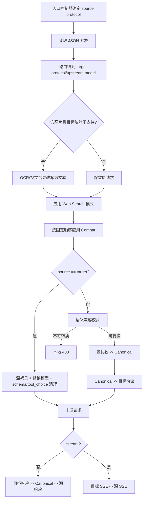
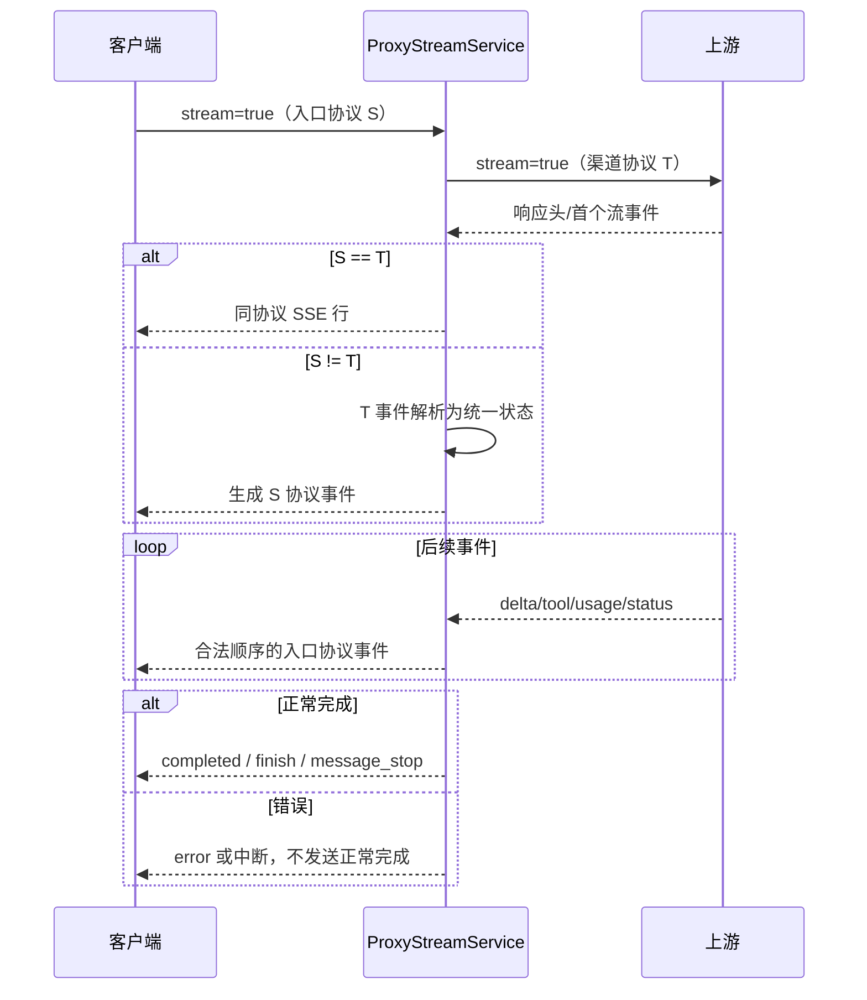

# OpenCodex PRD：协议转换

## 文档元数据

| 项目 | 内容 |
|---|---|
| 文档编号 | PRD-08 |
| 需求前缀 | `REQ-PRT` |
| 文档状态 | 基于现状反向建模，待产品评审 |
| 基线版本 | `main@3827590` |
| 最后核对日期 | 2026-08-17 |
| 适用对象 | 产品、后端、测试、SDK/客户端、SRE |
| 相关文档 | [渠道管理](./06-channel-management.md)、[路由与可靠性](./07-routing-and-reliability.md) |
| 事实优先级 | 当前源码与迁移 > 自动化测试 > 当前运行配置 > 说明性文档 |

> 本文将 **当前实现事实**、**产品化要求**、**已知限制**、**待确认 TBD** 分开描述。协议兼容结论以当前转换器及自动化测试为准，不以历史说明文件为准。

---

## 1. 目标与范围

### 1.1 产品目标

协议转换模块让客户端可以使用一种主流模型 API 协议调用不同协议的上游渠道，同时尽量保持请求语义、响应结构、工具调用闭环和流式事件顺序。目标包括：

1. 对外同时提供 OpenAI Responses、OpenAI Chat Completions、Anthropic Messages 风格端点。
2. 支持三种协议任意入口到任意上游协议的 3×3 非流式与流式矩阵。
3. 保留客户端可见模型名，将路由后的上游模型名只用于上游请求。
4. 转换文本、多模态内容、reasoning、工具定义、工具历史、usage 和结束原因。
5. 支持 Codex 关键能力：`apply_patch`、自定义工具、工具搜索、Web Search、MCP、JSON Schema 输出。
6. 在无法无损转换时明确失败或采用可解释降级，避免静默改变高风险语义。
7. 保证 SSE 生命周期合法、事件顺序稳定、错误终止不与正常完成混用。

### 1.2 本文范围

- 三种文本协议的请求、响应和 SSE 转换。
- 同协议透传时的标准化和安全清理。
- 内容、角色、图片、reasoning、refusal、annotation、工具和 usage 映射。
- Compat 请求改写和语义不兼容校验。
- Codex Responses 透传 headers。
- 上游端点和鉴权头的协议差异。
- 转换日志、流捕获、异常和测试矩阵。

### 1.3 不在本文范围

- 渠道选择、容量、熔断和故障转移，见 [07-routing-and-reliability.md](./07-routing-and-reliability.md)。
- 渠道配置字段，见 [06-channel-management.md](./06-channel-management.md)。
- `/images/generations`、`/images/edits` 的图片二进制方言转换细节；它们是独立 Images API，不属于文本协议 3×3 矩阵。
- Web Search 供应商 Key 管理。
- 模型定价和成本计算。

---

## 2. 角色与前置条件

### 2.1 角色

| 角色 | 关注点 |
|---|---|
| API 客户端 | 只需遵循入口协议，不需要知道上游渠道协议 |
| 渠道管理员 | 正确声明渠道 `type` 和 Compat 配置 |
| SDK/客户端开发者 | 依赖响应字段、SSE 顺序、工具调用 ID 和结束原因稳定 |
| 测试人员 | 按 3×3 矩阵验证结构、语义、顺序和异常 |
| SRE | 观测转换失败、降级、TTFT 和流中断 |

### 2.2 前置条件

1. 请求已经通过访问 API Key 鉴权并完成渠道路由。
2. 请求体为 JSON 对象。
3. 入口协议由控制器端点确定，而不是由请求体自由指定。
4. 目标协议由选中渠道 `type` 决定。
5. 路由已给出 `originalModel` 和 `upstreamModel`。
6. 渠道 Compat 已通过配置校验。

---

## 3. 术语

| 术语 | 定义 |
|---|---|
| Responses | OpenAI Responses 风格，入口字段主要为 `input`，响应为 `response`/`output` |
| Chat | OpenAI Chat Completions 风格，入口字段主要为 `messages`，响应为 `choices` |
| Messages | Anthropic Messages 风格，入口字段主要为 `system`、`messages`，响应为内容块 |
| 源协议 Source | 客户端入口协议 |
| 目标协议 Target | 上游渠道协议 |
| Canonical Model | 转换器内部统一请求/响应结构，不是公开 API |
| 同协议透传 | 源协议与目标协议相同；仍会复制、换模型、清理工具 schema |
| 跨协议转换 | 先转内部统一结构，再生成目标协议 |
| Tool Contract | 工具名称、类型、输入、调用 ID、输出和原生类型的统一描述 |
| Native Tool | 非普通 function 的原生工具，如 MCP、Web Search、tool search、apply_patch |
| Server-executed Tool | 由上游服务器执行、客户端不应再次执行的工具调用 |
| Text Format | Responses `text.format` / Chat `response_format` 的结构化输出要求 |
| TTFT | 下游首个有意义的文本、reasoning 或工具增量写出耗时 |

---

## 4. 当前实现事实

### 4.1 对外端点与协议确定

| 客户端端点 | 入口协议 |
|---|---|
| `POST /responses`、`POST /v1/responses` | Responses |
| `POST /chat/completions`、`POST /v1/chat/completions` | Chat |
| `POST /messages`、`POST /v1/messages` | Messages |

上游协议来自渠道 `type`：

- `responses` → 上游 `/responses`
- `chat` → 上游 `/chat/completions`
- `messages` → 上游 `/messages`

上游 URL 规则：

1. `baseurl` 以 `/` 结尾时，视为完整 API 根，直接拼接端点。
2. 否则若以 `/v1` 结尾，直接拼接端点。
3. 否则自动补 `/v1` 后再拼接。

### 4.2 支持矩阵

当前非流式和流式均覆盖完整 3×3：

| 入口 \ 上游 | Responses | Chat | Messages |
|---|---:|---:|---:|
| Responses | 透传 | 转换 | 转换 |
| Chat | 转换 | 透传 | 转换 |
| Messages | 转换 | 转换 | 透传 |

自动化测试 `ProtocolConversionMatrixTests` 会遍历全部 9 个组合，验证：

- 上游请求形状。
- 客户端响应形状。
- usage 映射。
- 客户端模型名恢复。
- 流式分支选择。
- SSE 日志捕获。

### 4.3 转换流水线

当前主流程在真正转换前还会执行图片降级、Web Search 模式和 Compat 改写。

### 4.4 同协议透传并非字节透传

当源协议等于目标协议时：

1. 深拷贝请求对象，不直接修改控制器收到的原对象。
2. 将 `model` 替换为路由后的上游模型。
3. 清理工具 JSON Schema 中不被上游接受的结构。
4. 清理与工具列表不一致的 `tool_choice`。
5. 非流式响应会深拷贝，并把模型名恢复为客户端原始模型。
6. 流式同协议路径尽量直接传递原始 SSE 行，同时捕获可观测日志。

因此，“透传”表示协议形态不转换，不表示请求或响应逐字节不变。

### 4.5 显式语义不兼容校验

以下字段在指定跨协议方向出现非 null 值时，当前会返回本地 400，而不是静默丢弃：

| 源 → 目标 | 不支持字段 |
|---|---|
| Responses → Chat | `background`、`context_management`、`conversation`、`previous_response_id`、`prompt` |
| Responses → Messages | 上述字段；`parallel_tool_calls`、`reasoning` 在转换时静默移除 |
| Messages → Responses | `container`、`thinking` |
| Messages → Chat | `container` |
| Chat → Messages | `parallel_tool_calls`、`reasoning_effort` |

当前策略只针对会明显改变语义的参数显式失败；其他未识别的新字段可能在 Canonical 过程中被忽略或降级。

### 4.6 Compat 改写顺序

在协议转换前按固定顺序执行：

1. `default_params`：仅在参数不存在时补值。
2. `rename_params`：源字段存在时重命名；目标已存在则保留目标。
3. `drop_params`：删除字段。
4. `force_params`：强制覆盖字段。
5. `drop_tool_types`：同步删除工具、相关 `tool_choice` 和 `include`。
6. `unsupported_params`：若请求仍含这些字段，抛本地 400。
7. `preserve_thinking_history`：写入内部标记，供 Messages 生成逻辑使用。

Web Search 模式处理发生在 Compat 之前。

### 4.7 请求字段与内容映射

#### 4.7.1 顶层结构

| 语义 | Responses | Chat | Messages |
|---|---|---|---|
| 模型 | `model` | `model` | `model` |
| 对话输入 | `input` | `messages` | `messages` |
| 系统指令 | `instructions`/输入消息 | system/developer message | 顶层 `system` |
| 最大输出 | `max_output_tokens` | `max_tokens`/`max_completion_tokens` | `max_tokens` |
| Reasoning 配置 | `reasoning` | `reasoning_effort`；兼容扩展上游可透传 `thinking` | `thinking`，部分方向不可无损转换 |
| 结构化输出 | `text.format` | `response_format` | 无完全等价字段，响应阶段可降级包装 |
| 工具 | `tools` | `tools`/旧 `functions` | `tools`/`mcp_servers` |
| 工具选择 | `tool_choice` | `tool_choice` | `tool_choice` |
| 流式 | `stream` | `stream` | `stream` |

#### 4.7.2 角色与内容

| Canonical 语义 | Responses | Chat | Messages |
|---|---|---|---|
| 用户文本 | message + `input_text` | user message content | user `text` block |
| 助手文本 | message + `output_text` | assistant message content | assistant `text` block |
| 系统/开发者 | instructions 或 message | system/developer role | 顶层 system |
| 图片 | `input_image` | `image_url` content block | `image` source block |
| 工具输出 | `function_call_output`/custom output | role=tool | `tool_result` |
| Reasoning | `reasoning` item/summary | `reasoning_content` | `thinking` block |
| Refusal | `refusal` block | message `refusal` | 目标缺少完全等价结构时降级 |
| URL 引用 | output_text annotations | message annotations | 文本/结构化表示能力有限 |

#### 4.7.3 对话历史整理

- reasoning-only 消息会尝试折叠进相邻 assistant 消息。
- 孤立且没有后续 assistant 的 reasoning 会被丢弃，以避免生成空 content 或连续 assistant 消息。
- 缺失工具结果时，转换器会生成明确的占位文本，避免工具调用历史结构断裂。
- `preserve_thinking_history=true` 时，会尽可能保留 thinking 内容和加密签名；无可用签名时可能用特殊文本标签降级。

### 4.8 工具映射

#### 4.8.1 普通函数工具

| 语义 | Responses | Chat | Messages |
|---|---|---|---|
| 工具定义 | `type=function` | `type=function` | `name/description/input_schema` |
| 调用开始 | `function_call` | assistant `tool_calls[]` | `tool_use` block |
| 参数 | `arguments` JSON 字符串/对象 | `function.arguments` | `input` 对象或流式 JSON delta |
| 调用 ID | `call_id`/`id` | `tool_call.id` | `tool_use.id` |
| 工具结果 | `function_call_output` | role=tool + `tool_call_id` | `tool_result` + `tool_use_id` |

必须保持调用 ID 关联，否则客户端无法继续下一轮。

#### 4.8.2 工具名称命名空间

- 内部标准命名空间分隔符为 `__`。
- 兼容历史 `.` 分隔符。
- 转换器维护请求侧名称映射，在响应和流事件中恢复客户端原工具名。
- 多个并行工具调用必须保持原顺序、各自 ID 和 output index。

#### 4.8.3 apply_patch

- 识别 `apply_patch` 及兼容名称。
- Responses 中使用 `custom_tool_call`/`custom_tool_call_output` 语义。
- Chat/Messages 中转换为可表达的函数或 tool_use 结构。
- 流式支持 patch 输入增量和完成事件。
- 对转义 JSON delta 使用专门解码器恢复原始 patch 文本。
- 从 Responses 转出时，原始字符串输入会标准化为目标工具可消费的 patch 对象。

#### 4.8.4 Tool Search 与 Web Search

- 工具搜索可保留为客户端需要执行的原生工具调用。
- Server-executed Web Search 不应错误转换成客户端 function/tool_use，避免客户端重复执行。
- Web Search 模拟模式由独立服务拦截工具调用并续传结果；转换器仍负责工具定义和事件形态。
- `drop_tool_types` 可同时移除工具、tool_choice 和 include 中的引用。

#### 4.8.5 MCP

当前支持 Responses MCP 与 Anthropic native MCP 之间的专门映射，包括：

- MCP server/toolset 配置。
- 允许工具列表。
- `mcp_tool_use`、`mcp_tool_result`。
- server name、连接配置及结果错误标志。
- Messages 上游存在 `mcp_servers` 时自动补 `anthropic-beta: mcp-client-2025-11-20`。

当前关键边界：

- Native remote MCP 无法转换到 Chat 时会显式失败。
- Responses 输出到 Chat 的 native MCP 生命周期也会显式失败。
- Responses ↔ Messages 对支持的 MCP 结构有专门转换和测试。
- 旧式“工具名命名空间模拟 MCP”与 native remote MCP 是两种不同形态。

### 4.9 Reasoning、refusal 与 annotation

#### Reasoning

- Responses reasoning summary、Chat `reasoning_content`、Messages thinking block 会进入统一 reasoning 文本。
- 从 Chat/Responses 生成 Messages 时，如果没有 Anthropic thinking signature，会生成无签名 thinking 或用文本标签降级。
- `preserve_thinking_history` 控制历史 thinking 是否保留。
- 流式可生成 reasoning summary part/text delta 及目标协议对应的 thinking/reasoning 增量。

#### Refusal

- Responses refusal block 可映射到 Chat refusal 字段。
- 跨到缺少等价结构的目标时只能以可表示形式降级。
- 流式错误和 refusal 不得被错误标记为普通成功完成。

#### Annotation

- URL citation 会尽量保留 URL、标题、起止位置和 snippet。
- Chat 可使用 annotations 表示；Messages 的表达能力有限，可能降级到文本或目标支持结构。

### 4.10 JSON Schema 输出

1. Responses `text.format.type=json_schema` 可映射到 Chat `response_format`。
2. Chat JSON Schema 可映射回 Responses text format。
3. Messages 没有完全等价的响应格式字段。
4. 当入口为 Responses、上游为 Chat/Messages，最终文本若不是符合结构的 JSON，当前转换器会将纯文本包装为满足 schema 外形的 JSON 文本。
5. 已经是有效 JSON 时尽量保留。
6. 当前转换器不执行通用 JSON Schema 验证器级别的严格校验。

### 4.11 Usage 映射

统一关心以下计量：

- input tokens。
- cached input/read tokens。
- cache write tokens。
- output tokens。
- total tokens。

来源差异：

- Responses：`usage.input_tokens`、`usage.output_tokens` 及 details。
- Chat：`prompt_tokens`、`completion_tokens`、`prompt_tokens_details.cached_tokens` 等。
- Messages：`input_tokens`、`output_tokens`、`cache_creation_input_tokens`、`cache_read_input_tokens`。

流式 Chat 只有在请求 `stream_options.include_usage=true` 时应输出 usage chunk；其他入口按各自协议生成完成事件中的 usage。

### 4.12 结束原因与状态

| Canonical 结果 | Responses | Chat | Messages |
|---|---|---|---|
| 正常结束 | `status=completed` | `finish_reason=stop` | `stop_reason=end_turn` |
| 达到长度 | `status=incomplete` + details | `finish_reason=length` | `stop_reason=max_tokens` |
| 工具调用 | 输出工具项 | `finish_reason=tool_calls` | `stop_reason=tool_use` |
| 内容拒绝 | refusal/failed 或完成结构 | `content_filter`/refusal | `refusal` 或可表示降级 |
| 上游失败 | `response.error/failed` | error，不能再发正常 done | error，不能再发 message_stop |

### 4.13 SSE 事件转换

#### Responses 输出事件族

包含但不限于：

- `response.created`
- `response.in_progress`
- `response.output_item.added/done`
- `response.content_part.added/done`
- `response.output_text.delta/done`
- `response.reasoning_summary_part.*`
- `response.reasoning_summary_text.*`
- `response.function_call_arguments.delta/done`
- `response.custom_tool_call_input.delta/done`
- `response.completed`
- `response.error`

#### Chat 输出

- `data: {chat.completion.chunk}`。
- 先输出 assistant role，再输出 content、reasoning 或 tool_calls 增量。
- 结束输出 finish reason；是否输出 usage 取决于 `include_usage`。
- 正常结束输出 `[DONE]`；错误路径不得再输出正常完成。

#### Messages 输出

- `message_start`
- `content_block_start`
- `content_block_delta`
- `content_block_stop`
- `message_delta`
- `message_stop`
- error 路径不得再输出 `message_stop`。

#### 流式顺序约束

1. Added/Start 必须先于 Delta，Delta 必须先于 Done/Stop。
2. 多工具并行时，一个已 Stop 的 block 不得再接收 delta。
3. output index 和 content index 必须单调、稳定。
4. 错误终止与正常完成事件互斥。
5. 同协议透传捕获完整终止状态；跨协议同时捕获上游和下游可诊断行。

### 4.14 Codex Responses headers

仅在 Responses 入口 → Responses 上游的同协议路径中，代理会复制或补全：

- `User-Agent`
- `x-oai-attestation`
- `x-codex-turn-metadata`
- `x-codex-window-id`
- `x-client-request-id`
- `originator`
- `session-id`
- `thread-id`
- `x-codex-beta-features`

规则：

1. 渠道显式 headers 优先，不被覆盖。
2. 客户端缺少时，当前实现会注入测试/兼容默认值。
3. Responses 转 Chat/Messages 时不复制这些 headers。
4. 普通上游请求根据渠道类型设置默认 User-Agent。
5. Messages 使用 `x-api-key` 和默认 `anthropic-version=2023-06-01`；Responses/Chat 默认使用 Bearer Authorization。

---

## 5. 协议决策表

### 5.1 请求转换决策

| 条件 | 行为 |
|---|---|
| 请求体不是对象 | 400 |
| source/target 相同 | 深拷贝、替换模型、schema/tool_choice 清理 |
| source/target 不同且含显式不兼容字段 | 400，不调用上游 |
| source/target 不同且可转换 | source → Canonical → target |
| Compat 声明 unsupported 且请求包含字段 | 400，不调用上游 |
| 工具 schema 含上游不支持结构 | 清理后再发往上游 |
| 原生 MCP 目标不支持 | 显式 400/转换异常 |

### 5.2 流式分派决策

| 入口 | 上游 | 当前转换器 |
|---|---|---|
| Responses | Chat | `ChatToResponsesEvents` |
| Responses | Messages | `MessagesToResponsesEvents` |
| Chat | Responses | `ResponsesToChatEvents` |
| Chat | Messages | `MessagesToChatEvents` |
| Messages | Responses | `ResponsesToMessagesEvents` |
| Messages | Chat | `ChatToMessagesEvents` |
| 任意同协议 | 同协议 | Pass-through + capture |

### 5.3 信息保真级别

| 级别 | 定义 | 示例 |
|---|---|---|
| 无损 | 目标协议有等价字段 | 普通文本、模型、基本 token usage |
| 结构等价 | 结构不同但客户端行为等价 | function_call ↔ tool_calls ↔ tool_use |
| 可解释降级 | 目标缺少等价能力，保留可读语义 | 无签名 reasoning 转 thinking/text |
| 显式失败 | 转换会改变关键行为 | Responses background/conversation 转 Chat |

---

## 6. 接口契约摘要

### 6.1 通用请求要求

- `Content-Type: application/json`。
- 请求体必须为 JSON 对象。
- `Authorization: Bearer ocx_...`。
- `model` 用于路由和上游模型替换。
- `stream=true` 时响应为入口协议对应的 SSE。

### 6.2 通用响应要求

1. 客户端看到的模型名应为请求的原始模型，而不是内部上游模型。
2. 非流式响应的顶层结构必须符合入口协议。
3. 流式响应的事件类型、顺序和终止形式必须符合入口协议。
4. 上游原始响应保留在受控日志，用于排障和 usage 提取。
5. 上游协议错误最终由代理错误层处理，不将内部渠道细节直接暴露客户端。

### 6.3 同协议 Responses 特殊契约

- 允许 Codex headers 透传或补全。
- 不覆盖渠道管理员显式配置的同名 header。
- 客户端 `User-Agent` 不像 Codex Desktop 时，当前实现会替换为兼容的 Codex Desktop UA。

---

## 7. 异常与边界

1. 入口协议由路由固定，不能通过请求字段伪造。
2. 不可无损转换的语义参数返回本地 400，不参与渠道故障转移。
3. 同协议路径也会清理工具 schema，不能假设字节级透传。
4. Native MCP 到 Chat 不支持时显式失败。
5. Messages thinking 到 Responses/Chat 顶层配置目前被视为不可无损转换。
6. Responses reasoning 配置到 Messages 目前显式失败，但 reasoning 历史内容可能降级保留。
7. JSON Schema 包装不能替代完整 schema 校验。
8. Refusal、annotation、thinking signature 等高级信息可能在目标协议中降级。
9. Server-executed 工具不能错误变成客户端需要执行的工具调用。
10. 流式开始后遇到转换异常时，HTTP 状态不可回退，只能输出协议允许的错误或中断。
11. 不完整上游流会由累积器生成 incomplete/错误状态；不得伪造正常完成。
12. 客户端取消时停止读取和转换，不补正常完成事件。
13. Images API 首版不支持 `stream=true`，且不属于本文 3×3。
14. 模型目录可能声明音频/视频能力，但当前协议转换对这些模态没有与文本/图片同等级的完整契约。

---

## 8. 产品化需求与验收标准

### REQ-PRT-001 完整协议矩阵（MUST）

**要求：** Responses、Chat、Messages 的全部 9 个入口/上游组合必须支持非流式和流式调用。

**验收标准：**

1. 9 个非流式组合均生成目标协议请求和入口协议响应。
2. 9 个流式组合均通过 `SupportsStreamingConversion`。
3. 每个组合至少覆盖文本、usage、模型名和正常结束。

### REQ-PRT-002 原始请求不可变（MUST）

**要求：** 转换和 Compat 不得原地污染控制器收到的原始请求对象。

**验收标准：**

1. 转换后原始请求序列化结果不变。
2. 日志可同时记录原始请求与实际上游请求。
3. 多候选故障转移时每个候选从同一有效载荷生成请求，不继承前一候选的目标协议副作用。

### REQ-PRT-003 模型名隔离（MUST）

**要求：** 上游请求使用映射后的模型名，客户端响应恢复原始模型名。

**验收标准：**

1. 所有非流式组合的客户端 `model` 等于请求模型。
2. 所有流式完成事件/块中的可见模型等于请求模型。
3. 上游日志记录实际上游模型。

### REQ-PRT-004 同协议安全标准化（MUST）

**要求：** 同协议调用应保持协议结构，同时执行必要的工具 schema 和 tool_choice 一致性清理。

**验收标准：**

1. 请求结构保持目标协议。
2. 无效 schema 关键字不发送给上游。
3. 指向已删除工具的 tool_choice 被移除或修正。

### REQ-PRT-005 统一内部模型（MUST）

**要求：** 跨协议转换应通过统一 Canonical 结构，避免每对协议各自形成不一致规则。

**验收标准：**

1. 相同语义从不同入口转换到同一目标时生成等价结构。
2. 工具 ID、顺序、usage 和结束原因有统一字段。
3. 新协议能力只需扩展 Canonical 与适配器即可进入矩阵。

### REQ-PRT-006 显式语义保护（MUST）

**要求：** 无法在目标协议无损表示的高风险字段必须明确失败，不得静默删除。

**验收标准：**

1. 当前不兼容参数表逐项返回本地 400。
2. 错误包含源协议、目标协议和字段名。
3. 本地语义错误不触发渠道故障转移或熔断。

### REQ-PRT-007 角色与系统指令（MUST）

**要求：** system、developer、user、assistant、tool 语义在目标协议中正确表达。

**验收标准：**

1. Messages 顶层 system 与 Chat/Responses 系统消息互转后顺序可预测。
2. 用户和助手文本不交换角色。
3. 工具结果不被转换成普通用户文本。

### REQ-PRT-008 文本与多段内容（MUST）

**要求：** 字符串和多内容块输入均应转换，块顺序不得改变。

**验收标准：**

1. 单字符串、多个文本块、空文本分别有测试。
2. 输入块顺序和助手输出段落顺序保持。
3. 空 content 不产生无意义连续 assistant 消息。

### REQ-PRT-009 图片内容（MUST）

**要求：** 三协议间支持可表示的 URL 图片和 Data URL/Base64 图片输入。

**验收标准：**

1. Responses input_image、Chat image_url、Messages image source 可互转。
2. 媒体类型得到保留或按明确默认值补全。
3. 不支持图片的目标模型由路由降级处理，而不是转换器静默删除图片。

### REQ-PRT-010 Reasoning 转换（MUST）

**要求：** reasoning summary、reasoning_content 和 thinking block 应尽可能保留，并明确签名降级。

**验收标准：**

1. 非流式与流式均覆盖三种 reasoning 表示。
2. 无签名时不得伪造有效 Anthropic 签名。
3. `preserve_thinking_history=false` 时不把历史 thinking 非预期发送上游。
4. 孤立 reasoning 不生成空助手消息。

### REQ-PRT-011 普通工具闭环（MUST）

**要求：** 工具定义、调用、参数、调用 ID、结果和下一轮历史必须完整闭环。

**验收标准：**

1. function_call、Chat tool_calls、Messages tool_use 三者互转。
2. 工具结果准确关联原调用 ID。
3. 多个并行调用不串 ID、不乱序。
4. 缺失结果时生成明确占位而非无效结构。

### REQ-PRT-012 工具命名空间恢复（MUST）

**要求：** 命名空间工具跨协议后，响应必须恢复客户端原始工具名。

**验收标准：**

1. `namespace__tool` 和历史 `namespace.tool` 均有兼容测试。
2. 深层命名空间在流式和非流式中完整恢复。
3. 多工具链顺序稳定。

### REQ-PRT-013 apply_patch（MUST）

**要求：** apply_patch 保持自定义工具语义和原始 patch 文本。

**验收标准：**

1. Responses 输出使用 custom tool call 事件。
2. 流式转义 patch delta 能还原原文。
3. 从 Responses 转 Chat/Messages 时输入结构可被目标客户端消费。
4. apply_patch 与普通函数并行时事件类型和 output index 正确。

### REQ-PRT-014 Native MCP（MUST）

**要求：** 对支持方向完整转换 native MCP，对不支持方向显式失败。

**验收标准：**

1. Responses ↔ Messages 支持的 server、allowed tools、use/result 被保留。
2. Messages 上游自动补需要的 beta header，且不覆盖其他 beta 值。
3. Native MCP → Chat 返回明确不支持错误。
4. 不把 remote MCP 降级成语义不同的普通 function。

### REQ-PRT-015 Web Search 与 Tool Search（MUST）

**要求：** 区分服务器已执行工具和客户端待执行工具。

**验收标准：**

1. Server-executed Web Search 不生成 Chat tool_call 或 Messages tool_use。
2. Tool Search 保持客户端工具调用语义。
3. Web Search 模拟续轮后最终答案仍按入口协议完成。

### REQ-PRT-016 Compat 顺序（MUST）

**要求：** Compat 改写顺序固定并对用户可解释。

**验收标准：**

1. 自动化测试验证 default、rename、drop、force、drop tools、unsupported 的先后关系。
2. force 可以覆盖前序结果。
3. unsupported 检查发生在所有改写之后。

### REQ-PRT-017 JSON Schema 输出（MUST）

**要求：** 支持 Responses text.format 与 Chat response_format 的互转，并明确 Messages 降级。

**验收标准：**

1. 合法 JSON 保持不变。
2. 纯文本包装产生可解析 JSON。
3. 无 text format 时不得擅自包装。
4. 产品化版本 SHOULD 增加真实 schema 验证和失败策略。

### REQ-PRT-018 Usage 保真（MUST）

**要求：** 输入、输出、缓存读写 Token 在协议间正确映射。

**验收标准：**

1. 3×3 非流式矩阵 usage 数值一致。
2. 3×3 流式矩阵最终 usage 一致。
3. Chat `include_usage=false` 时不输出 usage chunk。
4. 日志计费使用上游实际 usage，而非估算文本长度。

### REQ-PRT-019 结束原因映射（MUST）

**要求：** stop、length、tool use、refusal、failed/incomplete 在目标协议中使用正确终止语义。

**验收标准：**

1. length 映射为 Responses incomplete、Chat length、Messages max_tokens。
2. tool use 映射为 Chat tool_calls、Messages tool_use。
3. 失败不生成正常完成事件。

### REQ-PRT-020 SSE 事件顺序（MUST）

**要求：** 所有流式转换遵守入口协议的事件生命周期和索引顺序。

**验收标准：**

1. Start/Added 先于 Delta，Delta 先于 Stop/Done。
2. block stop 后不再出现同 block delta。
3. output/content index 稳定且无重复冲突。
4. 并行工具链覆盖至少两个交错调用。

### REQ-PRT-021 流式错误终止（MUST）

**要求：** 错误路径与正常完成路径互斥。

**验收标准：**

1. Chat error 后不发送 finish 或 `[DONE]`。
2. Messages error 后不发送 `message_stop`。
3. Responses failed/error 后不发送 completed。
4. 日志记录终止类型和已写出事件数量。

### REQ-PRT-022 SSE 延迟准备（MUST）

**要求：** 只有上游流确认可用后才向客户端准备 SSE 响应。

**验收标准：**

1. 首事件错误可在普通 JSON 错误或故障转移前被识别。
2. 故障转移成功时客户端只收到最终渠道流。
3. 全候选失败时不发送 SSE Content-Type。

### REQ-PRT-023 Codex headers（SHOULD）

**要求：** Responses 同协议上游应按兼容规则传递 Codex headers，且渠道配置优先。

**验收标准：**

1. 客户端有效 header 被复制。
2. 渠道同名 header 不被覆盖。
3. Responses → Chat/Messages 不复制 Codex 专用 headers。
4. 产品化默认值不得继续使用 `test-*`，需由真实客户端值或正式生成策略替代。

### REQ-PRT-024 Tool Schema 清理（MUST）

**要求：** 发往上游的工具 JSON Schema 必须符合目标协议允许范围。

**验收标准：**

1. 不支持关键字被递归清理。
2. 清理不删除 properties、required 等核心契约。
3. 工具列表变化后 tool_choice 仍一致。

### REQ-PRT-025 未知新字段策略（MUST）

**要求：** 对供应商新增字段采用分级策略：保留、可解释忽略或显式失败，不得无记录静默丢失。

**验收标准：**

1. 同协议未知字段默认保留，除非安全清理规则明确删除。
2. 跨协议忽略字段时记录转换诊断。
3. 可能改变请求语义的字段进入显式不兼容表。

### REQ-PRT-026 可观测转换记录（MUST）

**要求：** 日志必须区分入口协议、渠道协议、实际改写和转换降级。

**验收标准：**

1. 记录 source/target、原模型/上游模型、Compat detail。
2. 流式记录 TTFT、首 SSE、首文本、首 reasoning 和完成时间。
3. 敏感请求头和密钥被脱敏。

### REQ-PRT-027 协议回归矩阵（MUST）

**要求：** 每次发布必须运行覆盖 3×3、工具、reasoning、usage 和错误终止的自动化矩阵。

**验收标准：**

1. `ProtocolConversionMatrixTests` 全部通过。
2. 六个跨协议 SSE 转换器均有独立结构测试。
3. Native MCP、apply_patch、Web Search、JSON Schema 各有正向和负向用例。

---

## 9. 数据、安全与可观测性影响

### 9.1 数据

- 原始请求、实际上游请求、上游响应、客户端响应分别进入不同日志内容槽位。
- 流式会保存经过筛选的上游/下游 SSE 行和写出时序。
- 工具参数、输出和图片引用可能包含敏感业务数据，应纳入日志保留策略。

### 9.2 安全

- 客户端访问 Key 不透传上游；上游鉴权来自渠道配置。
- Messages 默认使用 `x-api-key`，Responses/Chat 默认使用 Bearer。
- 自定义 headers 可能覆盖默认鉴权或 User-Agent，应禁止危险头并审计。
- 工具 schema 和工具输出均为不可信 JSON，转换器必须限制递归深度、集合大小和单字段长度。
- Data URL 图片和大工具参数可能造成内存放大，需要请求体和日志体积上限。
- MCP server 配置可能含远程地址和认证信息，错误和日志中不得泄漏。

### 9.3 可观测性建议

建议指标：

- 按 source/target 的请求量和成功率。
- 转换耗时 P50/P95/P99。
- 显式语义不兼容次数，按字段聚合。
- Compat 各规则命中次数。
- 工具类型分布和工具转换失败率。
- SSE 转换错误、意外结束、首字节前失败、首字节后失败。
- reasoning、MCP、apply_patch、Web Search、JSON Schema 使用率。
- 未知字段忽略/降级次数。

---

## 10. 已知限制

1. Native remote MCP 不能转换到 Chat，部分 MCP 生命周期会显式失败。
2. Messages thinking 配置与 Responses reasoning 配置在部分方向被判定为不可无损转换。
3. 从 Chat/Responses 生成 Messages thinking 时可能没有原生签名，只能无签名或文本降级。
4. JSON Schema 当前主要保证输出外形可解析，不是完整 schema 验证。
5. Refusal 和 annotations 在 Messages 中没有完全等价表示。
6. 同协议透传仍会修改模型并清理工具 schema，不是原始字节转发。
7. 未识别的新字段在跨协议时可能被忽略，当前没有统一降级报告 API。
8. 流一旦开始，后续转换错误不能再以标准 HTTP JSON 错误返回。
9. Images API 不支持流式，且不参与文本协议矩阵。
10. 音频、视频等模态尚无与文本、图片同等明确的转换契约。
11. Codex Responses 同协议缺失 headers 时仍可能注入 `test-*` 默认值，不适合作为长期正式产品行为。
12. 某些目标协议无法区分 server-executed tool 与普通工具，只能依靠类型白名单和专门分支。
13. Canonical 是内部静态字典结构，编译期类型约束较弱。
14. 大量转换逻辑集中在多个 partial class 文件，新增字段时容易只覆盖部分方向。

---

## 11. 待确认 TBD

| 编号 | 问题 | 建议默认值 |
|---|---|---|
| TBD-PRT-001 | 未知跨协议字段是忽略还是失败 | 高语义风险失败，低风险忽略并记录 |
| TBD-PRT-002 | Responses reasoning → Messages 是否继续显式失败 | 保持失败，除非提供正式降级开关 |
| TBD-PRT-003 | JSON Schema 包装失败时返回错误还是原文本 | 默认返回转换错误，不伪造结构 |
| TBD-PRT-004 | 无签名 thinking 是否应作为 thinking block 发送 | 默认转文本标签，避免伪造原生 thinking |
| TBD-PRT-005 | 是否对 Chat 增加 MCP 命名空间降级模式 | 默认不对 native MCP 自动降级 |
| TBD-PRT-006 | Refusal 转 Messages 的正式结构 | 采用文本块并附内部诊断 |
| TBD-PRT-007 | 是否支持音频、视频内容块 | 后续版本单独立项 |
| TBD-PRT-008 | Codex headers 的正式默认生成策略 | 不使用 test 值；缺失时仅补必要稳定值 |
| TBD-PRT-009 | 同协议是否允许“严格原样透传”模式 | 默认不开放，继续执行安全清理 |
| TBD-PRT-010 | SSE 日志保留完整原文还是白名单事件 | 保持白名单并允许短期调试开关 |
| TBD-PRT-011 | 工具命名空间统一使用 `__` 还是支持 `.` 长期兼容 | 对外两者兼容，内部统一 `__` |
| TBD-PRT-012 | 不完整上游流是否允许合成 incomplete | 允许，但必须标记来源和终止原因 |

---

## 12. 源码与测试追溯

| 能力 | 源码锚点 | 现有测试锚点 |
|---|---|---|
| 协议常量/总分派 | `opencodex_proxy/src/Libraries/OpenCodex.Core/Protocols/ProtocolConverter.cs` | `ProtocolConversionMatrixTests.cs` |
| 请求转换 | `ProtocolConverter.Requests.cs`、`ProtocolConverter.ResponsesInput.cs` | `ProtocolStructuralCompatibilityTests.cs`、`InboundStreamingCompatibilityTests.cs` |
| 响应转换 | `ProtocolConverter.Responses.cs` | `ProtocolConversionMatrixTests.NonStream_AllProtocolPairs_ConvertRequestAndResponse` |
| 语义参数保护 | `ProtocolConverter.RequestValidation.cs` | 建议为每个参数补 Theory；现有结构测试间接覆盖 |
| 内容转换 | `ProtocolConverter.Content.cs` | `ProtocolStructuralCompatibilityTests.cs` |
| 工具定义与选择 | `ProtocolConverter.Tools.cs`、`ProtocolConverter.ToolSchemaSanitizer.cs` | `ProxyCompatibilityTests.cs`、`NativeMcpConfigurationTests.cs` |
| 工具历史 | `ProtocolConverter.ToolHistory.cs` | `NativeMcpHistoryTests.cs`、reasoning 历史相关测试 |
| 工具名映射 | `ProtocolConverter.ToolNames.cs`、`ProtocolConverter.ToolContracts.cs` | `SseStreamConverterTests.ToolUse_NamespaceTool_RestoresNamespaceInOutput` 及深层/多工具测试 |
| apply_patch | `ProtocolConverter.ApplyPatchTools.cs`、`ApplyPatchJsonDeltaDecoder.cs` | `SseStreamConverterTests` 中 ApplyPatch 系列、`ResponsesOutboundStreamingCompatibilityTests` |
| Native MCP | `ProtocolConverter.Mcp.cs`、`ProtocolConverter.NativeToolCalls.cs` | `NativeMcpProtocolTests.cs`、`NativeMcpResponseTests.cs`、`ResponsesOutboundStreamingCompatibilityTests` |
| Web Search 工具 | `ProtocolConverter.WebSearchTools.cs`、`WebSearchRequestPolicy.cs` | `ProxyCompatibilityTests` Web Search 续轮/流式系列 |
| Reasoning/refusal/annotation | `ProtocolConverter.Reasoning.cs`、`ProtocolConverter.Responses.cs` | `SseStreamConverterTests` reasoning/refusal/annotation 系列 |
| Usage | `ProtocolConverter.Usage.cs` | `ProtocolConversionMatrixTests`、`SseStreamConverterTests.ChatUsageDetails_AreMappedToResponsesUsageDetails` |
| 结束原因 | `ProtocolConverter.FinishReasons.cs` | `ChatMessagesStreamingCompatibilityTests.cs`、`ResponsesOutboundStreamingCompatibilityTests.cs` |
| SSE 总分派 | `ProxyStreamService.cs`、`SseStreamConverter*.cs` | `ProtocolConversionMatrixTests.Stream_AllProtocolPairs_UseCorrectBranchAndPreserveSseLogs` |
| Chat ↔ Messages | `SseStreamConverter.ChatToMessages.cs`、`SseStreamConverter.MessagesToChat.cs` | `ChatMessagesStreamingCompatibilityTests.cs` |
| Responses 入站 | `SseStreamConverter.Chat.cs`、`SseStreamConverter.Messages.cs` | `InboundStreamingCompatibilityTests.cs` |
| Responses 出站 | `SseStreamConverter.ResponsesToChat.cs`、`SseStreamConverter.ResponsesToMessages.cs` | `ResponsesOutboundStreamingCompatibilityTests.cs` |
| 同协议捕获 | `StreamResponseCapture.cs`、`ProxyStreamService.CapturePassThroughResponse` | `StreamResponseCaptureTests.cs`、`ProxyStreamServiceTests.cs` |
| Compat | `ChannelCompatRequestRewriter.cs` | `ProxyCompatibilityTests.ResponsesProxy_DropToolTypes_StripsImageGenerationToolsOnly` |
| Codex headers | `ProxyEndpointService.ApplyResponsesPassthroughHeaders` | `ProxyEndpointServiceTests` 的 ResponsesPassthrough 系列 |
| 上游端点/鉴权 | `HttpUpstreamClient.Requests.cs` | `ProxyCompatibilityTests.PostJsonAsync_*`、`NativeMcpHeaderTests.cs` |

---

## 13. 发布验收建议

1. 运行完整 3×3 非流式与流式矩阵，不允许只验证主流 Responses 入口。
2. 每个方向至少覆盖：纯文本、图片、reasoning、单工具、并行工具、工具结果、usage、length、error。
3. 单独覆盖 apply_patch、tool search、Web Search、native MCP、JSON Schema、refusal、URL citation。
4. 用真实客户端验证 Codex CLI、OpenAI SDK、Anthropic SDK 的解析兼容性。
5. 对所有显式不兼容字段验证本地 400、无上游调用、无熔断计数。
6. 验证流式错误不会追加正常 Done/Stop/Completed。
7. 对超大工具 schema、深层 JSON、长 patch、Data URL 图片执行资源上限测试。
8. 执行 `dotnet test opencodex_proxy/OpenCodex.sln`，并将所有 `REQ-PRT-*` MUST 项关联到自动化测试或发布检查项。
