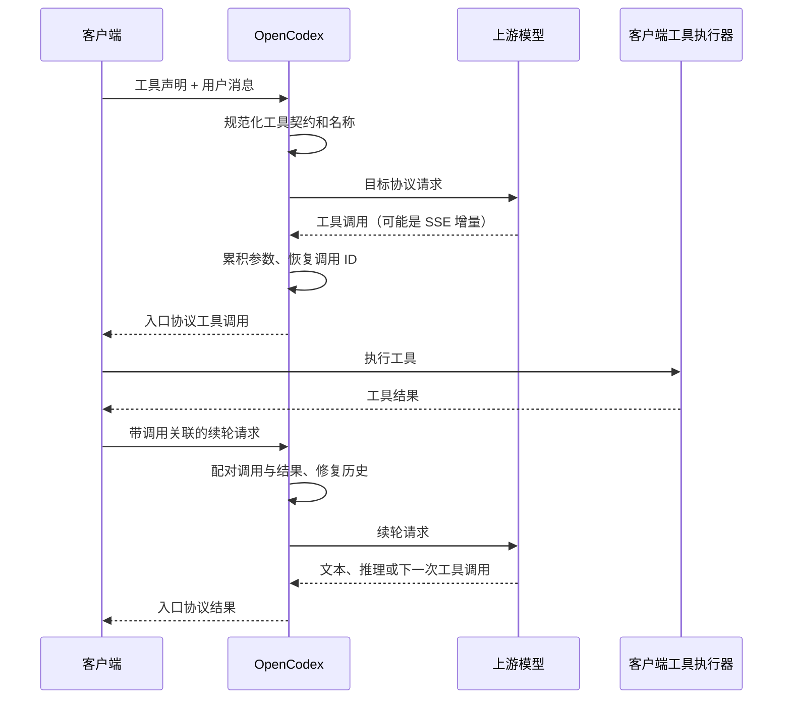
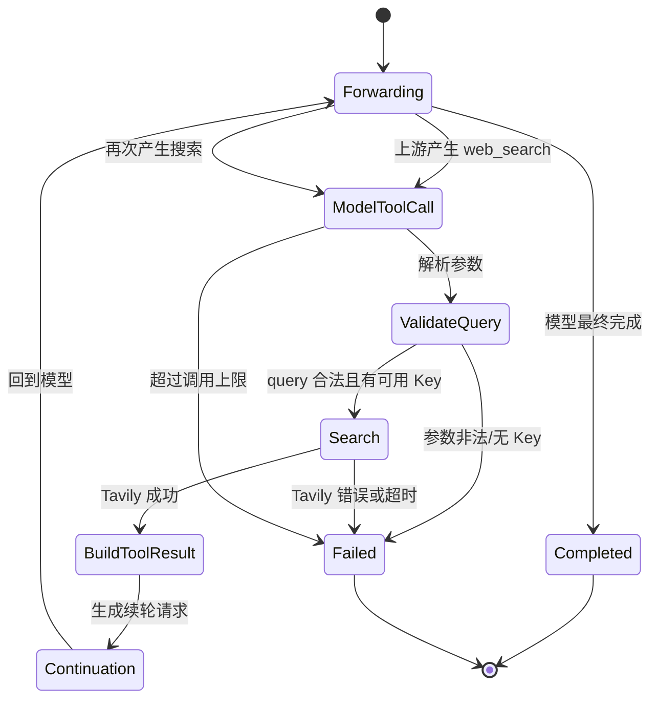
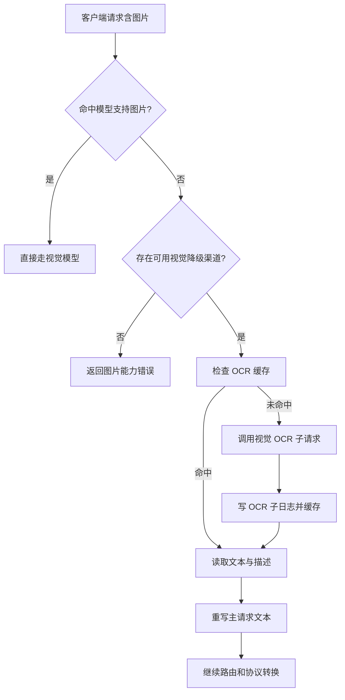

# 09. 工具、多模态与特殊流程

> 需求前缀：`REQ-SPC`  
> 代码基线：`main@3827590`  
> 适用入口：Responses、Chat Completions、Messages、Images 及管理台特殊配置

## 1. 目标与范围

本专题定义普通文本代理之外的复杂能力：

- function/custom/freeform 工具声明和工具调用；
- `apply_patch` 工具及其多种方言；
- MCP 工具、MCP 历史和原生 MCP 事件；
- Web Search 的转换、模拟和关闭模式；
- 图片输入检测、视觉能力路由和 OCR 降级；
- 图片生成与编辑接口；
- Probe 请求拦截；
- 复杂请求头、认证和内容限制；
- 这些能力的日志、重试、错误和安全边界。

这些能力依赖协议转换专题的规范化中间结构，不能只按某一个上游的字段实现。

## 2. 工具统一模型

### 2.1 工具契约

OpenCodex 将不同入口的工具声明统一为至少以下语义：

| 字段 | 含义 |
|---|---|
| 工具名称 | 调用时用于匹配和恢复的稳定名称 |
| 工具类型 | function、custom、freeform、MCP 或供应商原生类型 |
| 描述 | 模型选择工具时使用的说明 |
| 参数 Schema | JSON Schema 或可转换的参数描述 |
| 命名空间 | MCP 或客户端命名空间信息 |
| 调用 ID | 工具调用与工具结果配对的唯一标识 |
| 参数增量 | SSE 中分段传输的 JSON 文本 |
| 结果内容 | 工具执行后的文本或结构化结果 |
| 错误状态 | 工具执行成功、失败或取消 |

### 2.2 工具名称规则

- 普通 function 名称应尽量保持原样；
- MCP 工具可能以命名空间展开形式传输，返回入口协议时恢复原语义；
- `apply_patch` 及带路径的名称需要归一化识别；
- 不能仅依赖显示名判断调用结果，必须同时使用调用 ID 或可验证的历史关联；
- 名称冲突时，系统必须选择稳定的转义/命名策略并在日志中记录映射。

### 2.3 Schema 清洗

`REQ-SPC-001`（MUST）：跨协议发送工具 Schema 前必须执行结构清洗，确保目标协议接受的类型、必填字段和嵌套结构合法。

清洗规则至少包括：

- 去除目标协议不支持的顶层字段；
- 统一 `input_schema`、`parameters` 等字段位置；
- 处理空 Schema、缺失 `type` 和非对象参数；
- 保留描述、属性、required、additionalProperties 等可表达语义；
- 对无法转换的 Schema 返回明确错误或按渠道 compat 规则处理；
- 防止极大 Schema 造成内存或日志写放大。

## 3. 工具调用生命周期

`REQ-SPC-002`（MUST）：工具调用结果必须与正确的调用 ID、工具名称和历史位置配对；缺失或冲突时不得静默拼接到其他调用。

验收标准：

- 单个工具调用可完成调用—结果—续轮闭环；
- 并行工具调用保持各自的调用 ID 和结果顺序语义；
- SSE 参数分片在合并后得到合法 JSON 或明确失败；
- 工具结果错误可在入口协议中表达；
- 发生历史缺口时记录修复或补偿行为。

## 4. `apply_patch` 特殊工具

### 4.1 支持目标

当前代码识别以下相关语义：

- `apply_patch` 普通工具名或带命名空间的变体；
- Responses `apply_patch_call` / `apply_patch_call_output`；
- Chat function 工具；
- Messages `custom`、`freeform`、`grammar` 等可表达方言；
- 增量参数流和最终工具结果。

### 4.2 转换规则

| 入口/渠道差异 | 产品处理 |
|---|---|
| function 形式 | 以 function name + arguments 表达 |
| custom/freeform | 保留补丁文本或自由格式参数 |
| grammar | 仅在目标渠道明确支持时保留 |
| 原生 Responses patch 事件 | 映射为目标协议工具调用和结果 |
| 目标不支持 patch 工具类型 | 按 compat 删除、重写或返回不支持错误 |
| 参数增量 | 逐段累积，并在完成事件后闭合 |

### 4.3 产品规则

- `apply_patch` 的工具名称不能因跨协议转换而丢失；
- 补丁内容不能被普通文本清洗截断；
- 调用结果必须保持成功/失败和错误文本；
- 历史续轮必须保留工具调用与结果的相邻关系；
- 日志需区分原始工具类型、转换后类型和最终入口类型；
- 不把 OpenCodex 本身执行补丁作为代理职责，代理只负责传输和转换。

`REQ-SPC-003`（MUST）：当目标协议无法无损表达 `apply_patch` 时，系统必须执行已记录的兼容策略；如果兼容策略会改变调用语义，必须拒绝请求并说明受影响参数。

## 5. MCP 工具

### 5.1 MCP 类型

当前实现涉及：

- Responses `mcp_call`；
- Messages `mcp_tool_use` / `mcp_tool_result`；
- Chat 中的命名空间工具或工具调用映射；
- MCP server 配置和 beta/实验性 Header；
- 工具历史中的原生 MCP 标识。

### 5.2 MCP 关联规则

1. MCP 调用必须有稳定 ID，缺失时生成代理侧 ID；
2. 工具名称可含服务器或命名空间，转换时保存原始与展开名称；
3. `mcp_tool_result` 必须根据调用 ID 归属于对应调用；
4. 错误结果需要保留 `is_error` 或等价状态；
5. MCP 历史不能被误判为普通 function result；
6. 上游不支持 MCP 时，只能按明确的降级或拒绝策略处理；
7. MCP 相关 Header 只能按渠道能力和配置转发，不能将客户端凭证原样透传。

### 5.3 MCP 历史修复

当客户端续轮只提交部分 MCP 历史或上游要求特定顺序时，系统可根据已知调用映射补充最小必要历史，但必须：

- 不伪造未发生的工具结果；
- 标记补偿发生；
- 在日志中保存原始和有效请求差异；
- 对无法确定调用归属的历史返回结构错误。

`REQ-SPC-004`（MUST）：MCP 调用、结果和历史必须在三种入口协议之间保持可追踪的调用 ID 和错误状态。

## 6. Web Search

### 6.1 模式

| 模式 | 行为 | 是否调用 Tavily |
|---|---|---:|
| `convert` | 保留/转换 `web_search` 工具，交给上游模型或上游工具链 | 否（OpenCodex 不主动搜索） |
| `simulate` | 拦截模型的 `web_search` 调用，选择 Tavily Key 执行，再继续模型请求 | 是 |
| `disabled` | 删除 Web Search 工具及关联 `tool_choice`/`include` | 否 |

当前模拟范围不是所有请求：只有 **Responses 入口 + Chat/Messages 渠道 + 访问 Key 所属用户角色为 `superadmin` + 请求声明 `type=web_search` + 全局模式为 `simulate`** 时才进入本地模拟。普通用户拥有的访问 Key 即使处于全局 `simulate` 模式，也不会执行 Tavily 模拟。

### 6.2 请求策略

当前 `web_search` 调用参数原则上只接受 `query`：

- arguments 必须是对象或可解析 JSON 对象；
- `query` 必填且非空；
- 未知参数按策略拒绝或忽略，必须保持一致；
- 搜索结果应包含答案摘要、来源链接和可供模型继续处理的文本；
- Key 在真正调用 Tavily 之前即被预留，并立即把 `UsageCount` 加 1；Tavily 随后失败也不会自动回退本次计数；
- 达到单 Key 上限的 Key 不得继续使用。

### 6.3 simulate 流程

流式 simulate 的产品要求：

- 已收到的模型可见事件应尽量先输出；
- 发现 Web Search 调用后暂停或结束当前上游事件段，执行搜索；
- 搜索结果作为工具结果进入续轮；
- 不能把中间 `completed` 误发成最终完成；
- 必须有最大搜索轮数，避免模型循环调用；
- 达到上限时返回入口协议可识别的错误或终止事件；
- 主请求日志记录每一轮搜索和 Key 使用情况。

`REQ-SPC-005`（MUST）：只有超级管理员配置并允许的场景才能启用 `simulate`；普通用户不得通过请求字段绕过全局模式或触发未授权 Tavily 调用。

当前 `simulate` 对参数非法、无可用 Key、Tavily 失败或调用次数超限的处理，不是直接返回独立 HTTP 4xx/5xx；它先生成 `status=failed` 的 Web Search 工具结果，再要求模型给出最终回答。只有后续上游调用本身失败时，代理才按上游异常结束请求。

### 6.4 convert/disabled 边界

- `convert` 不得因本地没有 Tavily Key而失败；
- `disabled` 必须同时清理工具声明、`tool_choice` 和相关 `include`；
- 模式切换的生效时机由 `/web-search` 保存操作定义；
- 上游协议不支持 Web Search 时，必须走渠道 compat 或明确错误。

## 7. 图片输入和视觉降级

### 7.1 图片检测

系统需要识别以下输入中的图片：

- Responses `input_image`；
- Responses 工具输出中的图片内容；
- Chat `image_url`；
- Messages `image` 内容块；
- Data URL、远程 URL 或其他已支持引用方式。

图片检测必须覆盖普通消息、工具结果续轮和跨协议转换后的有效载荷。

### 7.2 视觉路由

当前路由事实：

1. `requestContainsImages` 虽传入路由服务，但当前候选构造没有据此优先选择视觉映射；候选仍按亲和、优先级、活跃请求数和原始顺序排序；
2. 已选候选命中显式模型映射且 `SupportsImage=true` 时，图片直接交给该候选；
3. 已选候选命中显式模型映射但不支持图片时，才触发 OCR/视觉描述降级；
4. 降级先在该候选渠道内寻找任一支持图片的映射，再在其他启用渠道中寻找；
5. 若没有视觉映射，OCR 路径返回 400：`OCR requires a configured vision model.`；
6. 若所有启用渠道都没有显式模型映射，路由返回 `MatchedModelMapping=false`，即使检测到图片也不会触发 OCR，图片会继续进入普通转换/上游路径。

产品化要求仍是：视觉能力应成为明确的候选选择条件；无法处理时不得把图片静默丢弃。

### 7.3 OCR/视觉描述降级

当前 OCR 核心路径使用视觉模型，而非历史 Paddle OCR：

- 图片按来源类型和内容建立缓存 Key；
- 通过内部视觉请求提取可见文本和描述；
- 结果写入 OCR 子日志；
- 将识别文本和描述注入主请求的有效文本载荷；
- 继续执行主模型请求；
- 失败时保留主请求与 OCR 子请求的关联。

产品边界：

- OCR 不是独立对外接口；
- OCR 结果可能改变原始请求语义，必须在日志详情中可见；
- OCR 缓存命中不能跳过权限和用户隔离；
- OCR 子请求自身可产生上游错误、Token 和耗时，但成本归属规则需要确认；
- 只在已有显式模型映射且能力不支持图片时触发的当前实现边界，必须在产品文案中说明；
- 图片数据和识别文本可能包含敏感信息，日志保存需受同等保护。

当前还存在以下实现限制：

- 只有 `role=user` 的图片会进入 OCR；非用户消息和工具结果中的图片在降级重写时会被替换为占位文本；
- 图片检测器与重写器覆盖范围不完全一致，例如 Responses 检测器只显式识别 `function_call_output.output` 中的图片，部分 custom/native 工具输出不会触发降级；
- OCR 文件缓存是进程文件系统级共享缓存：Data URL 按解码字节哈希，远程图片按 URL 字符串哈希；缓存 Key 不包含 Owner、访问 Key、模型或渠道，命中后会跨用户复用识别结果与原渠道元数据，属于租户隔离和缓存失效风险；
- OCR 子请求在视觉上游或结果解析失败时返回 502；没有视觉路由时返回 400，主请求不会忽略图片后继续。

`REQ-SPC-006`（MUST）：图片检测、视觉路由和 OCR 降级必须在普通请求、工具结果续轮和三种入口协议中保持一致的能力判断。

## 8. Images 生成与编辑接口

### 8.1 图片生成

- 接口：`POST /images/generations`、`POST /v1/images/generations`；
- 只接受 `application/json`；
- 请求体必须是 JSON 对象；
- 首版不支持 `stream=true`；
- 根据 Images 渠道方言（OpenAI/xAI）构造上游请求；
- 使用 Bearer 访问 Key确定用户和渠道；
- 记录主请求日志；
- 返回上游状态码和转换后的结果或统一错误。

### 8.2 图片编辑

- 接口：`POST /images/edits`、`POST /v1/images/edits`；
- 使用 multipart 请求；
- 支持受限数量和大小的图片文件；
- 首版不支持 `stream=true`；
- 非允许字段和文件字段返回 4xx；
- 请求体、文件、上游响应和错误应受日志脱敏/容量策略限制。

当前实现线索包括单文件约 20 MiB、总量约 100 MiB、最多 16 张的限制；正式产品数值须由非功能需求和测试固定。

当前生产可用性事实：控制器、multipart 读取器、`IProxyImagesEndpointService` 契约和 `HttpUpstreamClient` 的 Images 辅助代码已经存在，但代码库中没有 `IProxyImagesEndpointService` 的生产实现或 DI 注册，也没有把 `IImagesUpstreamClient` 注册为可注入服务。真实应用解析 `ImagesController` 时会因依赖缺失而失败；现有控制器 fake 测试只证明输入校验契约，不证明端点可运行。

`REQ-SPC-007`（MUST）：Images 接口不得把不支持的流式请求当作普通非流式请求静默执行，必须返回明确的客户端错误。

`REQ-SPC-008`（MUST）：Images 接口的生产 DI、渠道校验、真实上游调用和错误路径必须有启动态与集成测试证据；仅控制器 fake 测试不足以证明正式可用。

## 9. Probe 请求拦截

### 9.1 识别规则

当系统级 `intercept_probe_requests=true` 时，如果请求中的以下任一字段为不大于 1 的值，视为 Probe：

- `max_tokens`；
- `max_output_tokens`；
- `max_completion_tokens`。

当前只接受运行时类型为 `int` 的值；字符串 `"1"` 不会命中。判断条件是 `<= 1`，所以 1、0 和负整数都会被拦截。

### 9.2 行为

- 仍必须验证访问 Key；
- 仍写入请求日志；
- 不选择渠道；
- 不调用上游；
- 根据入口协议生成最小成功响应；
- 当前即使请求携带 `stream=true`，也返回普通 JSON、以 `IsStream=false` 记日志，不生成 SSE；流式等价是产品化缺口；
- 客户端应能用它探测模型/代理是否可用而不消耗上游配额。

### 9.3 边界

- 无效或缺失访问 Key不能因 Probe 而免鉴权；
- 字符串数字和 JSON 数字的解析目前不一致；
- 当前负数属于 Probe，正式规则需确认是否保留；
- 渠道级遗留 `compat.intercept_probe_requests` 不得与系统级开关形成双重生效层级；
- Probe 响应不能伪造真实模型能力或工具结果。

当前 Probe 日志只可通过“200、无 Channel/UpstreamModel、无 UpstreamRequest/Response”间接识别，没有独立的 `probe_intercepted` 原因字段。

`REQ-SPC-009`（MUST）：Probe 拦截只能由系统级配置控制，并在日志中标记“未调用上游”的原因。

## 10. Headers、认证和隐私

### 10.1 客户端认证

- 客户端 Bearer Key用于 OpenCodex 鉴权；
- 不得透传到上游；
- 上游认证由渠道 `auth_mode=config` 和渠道 Key/Header决定；
- `auth_mode=none` 时不自动注入上游 Authorization。

### 10.2 特殊请求头

根据入口或渠道协议，可能需要转发：

- Codex/Responses 客户端识别头；
- MCP beta/实验性头；
- 渠道自定义 headers；
- User-Agent 和请求追踪信息。

必须区分：

- 可安全转发的协议协商头；
- 只在 OpenCodex 内部使用的租户和认证头；
- 不能转发的 Cookie、客户端密钥和管理 Cookie。

### 10.3 日志脱敏

至少脱敏：

- `Authorization`；
- `api_key`、`apikey`、`x-api-key`；
- Cookie；
- 密码；
- 上游凭证和自定义敏感 Header；
- 导入/导出操作中的明文 Key（除非明确授权和受控导出）。

## 11. 特殊流程错误模型

| 错误 | 推荐入口状态 | 产品说明 |
|---|---:|---|
| 图片流式不支持 | 400 | 客户端参数不被 Images 首版支持 |
| 图片 Content-Type 错误 | 415 | 生成接口只接受 JSON |
| multipart 文件字段不允许 | 400 | 文件字段白名单失败 |
| 工具 Schema 无法转换 | 400/502 | 取决于客户端参数还是上游能力 |
| MCP 调用无法配对 | 400 | 历史或调用 ID 无法确定 |
| Web Search 参数非法 | 当前通常仍为 200 | 生成失败工具结果并让模型续答；续轮上游失败时才返回异常 |
| 无可用 Web Search Key | 当前通常仍为 200 | 工具结果为“搜索不可用”并强制最终回答 |
| 搜索轮数超限 | 当前通常仍为 200 | 工具结果标记达到上限并强制最终回答 |
| 无视觉渠道 | 400 | `OCR requires a configured vision model.` |
| OCR 上游/解析失败 | 502 | 主请求失败，并保留 OCR 子日志 |
| Probe 被拦截 | 200 | 当前返回非流式最小 JSON，不调用上游 |

`REQ-SPC-010`（MUST）：特殊流程错误必须携带可关联的 request ID，并在日志中记录触发条件、是否调用上游、是否产生子请求和最终入口协议。

## 12. 安全与容量要求

- 工具 Schema、MCP 历史和 SSE 数据必须有大小上限；
- 单个工具调用参数不能无限累积；
- Web Search 模拟必须有轮数、超时、Key 用量和响应大小限制；
- 图片文件必须有单文件、总量、张数和 MIME 校验；
- OCR 缓存必须按内容哈希和用户/模型能力边界设计，避免跨租户泄露；
- 日志不得默认保存未脱敏图片二进制；
- 上游返回的工具名称和 Schema不能执行本地代码；
- OpenCodex 只代理工具描述和结果，不替客户端执行任意工具。

## 13. 特殊流程需求与验收

| 编号 | 级别 | 需求 | 验收要点 |
|---|---|---|---|
| `REQ-SPC-011` | MUST | 工具声明、调用、结果和续轮必须保持调用关联 | 并行/分片/错误结果测试 |
| `REQ-SPC-012` | MUST | Apply Patch 跨方言必须保留补丁语义或明确拒绝 | function/custom/freeform/原生事件矩阵 |
| `REQ-SPC-013` | MUST | MCP 原生调用和结果不得误转普通工具 | MCP ID、错误、历史测试 |
| `REQ-SPC-014` | MUST | Web Search 三种模式行为互斥且可观测 | convert/disabled 不调用 Tavily，simulate 产生续轮 |
| `REQ-SPC-015` | MUST | Web Search 模拟有轮数和 Key 用量上限 | 无限循环和 Key 达上限测试 |
| `REQ-SPC-016` | MUST | 图片检测覆盖三种入口和工具结果 | 多协议图片检测测试 |
| `REQ-SPC-017` | MUST | OCR 降级生成子日志并可回到主请求 | 缓存命中/未命中/失败测试 |
| `REQ-SPC-018` | MUST | Images 接口拒绝不支持的流式请求 | JSON/multipart/stream 测试 |
| `REQ-SPC-019` | MUST | Probe 不调用上游但仍鉴权和记日志 | 各协议最小响应测试 |
| `REQ-SPC-020` | MUST | 特殊流程不得泄露客户端 Bearer Key | 上游 Header 断言 |
| `REQ-SPC-021` | SHOULD | 大型 Schema、SSE、图片和搜索结果有容量保护 | 压力与超限测试 |
| `REQ-SPC-022` | SHOULD | 产品界面说明实验性/降级语义 | 管理台帮助文案和错误文案验收 |

## 14. 追溯索引

| 能力 | 主要源码 | 主要测试 |
|---|---|---|
| 工具契约/名称 | `Protocols/ProtocolConverter.Tool*.cs` | `ProtocolStructuralCompatibilityTests.cs`、`ProtocolConversionMatrixTests.cs` |
| Apply Patch | `ProtocolConverter.ApplyPatchTools.cs` | `ProxyCompatibilityTests.cs`、流式兼容测试 |
| MCP | `ProtocolConverter.Mcp.cs`、`ProtocolConverter.ResponsesInput.cs` | `NativeMcp*Tests.cs` |
| Web Search | `Services/WebSearch/`、`WebSearchService.cs` | `ProxyStreamServiceTests.cs`、Web Search 相关测试 |
| 图片检测 | `ProxyImageRequestDetector.cs` | `ProxyVisionRoutingTests.cs` |
| OCR | `ProxyOcrService.cs` | `ProxyImageFallbackTests.cs` |
| Images API | `ImagesController.cs`、`ImageEditRequestReader.cs` | `ImagesControllerTests.cs`、`ImagesCoreContractTests.cs` |
| Probe | `ProbeRequestInterceptor.cs`、`ProxyController.cs` | `ProbeRequestInterceptorTests.cs`、`ProxyControllerTests.cs` |
| SSE | `SseStreamConverter*.cs`、`ProxyStreamService.cs` | `SseStreamConverterTests.cs`、`ProtocolConversionMatrixTests.cs` |
