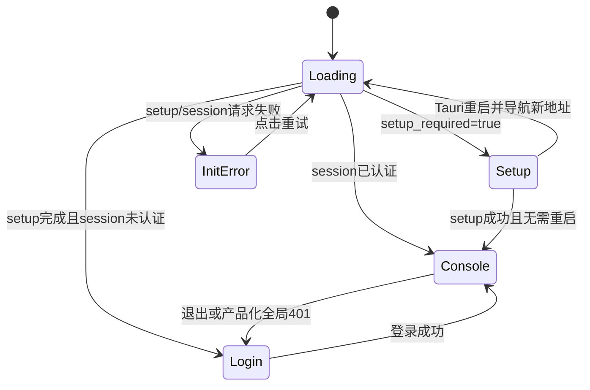
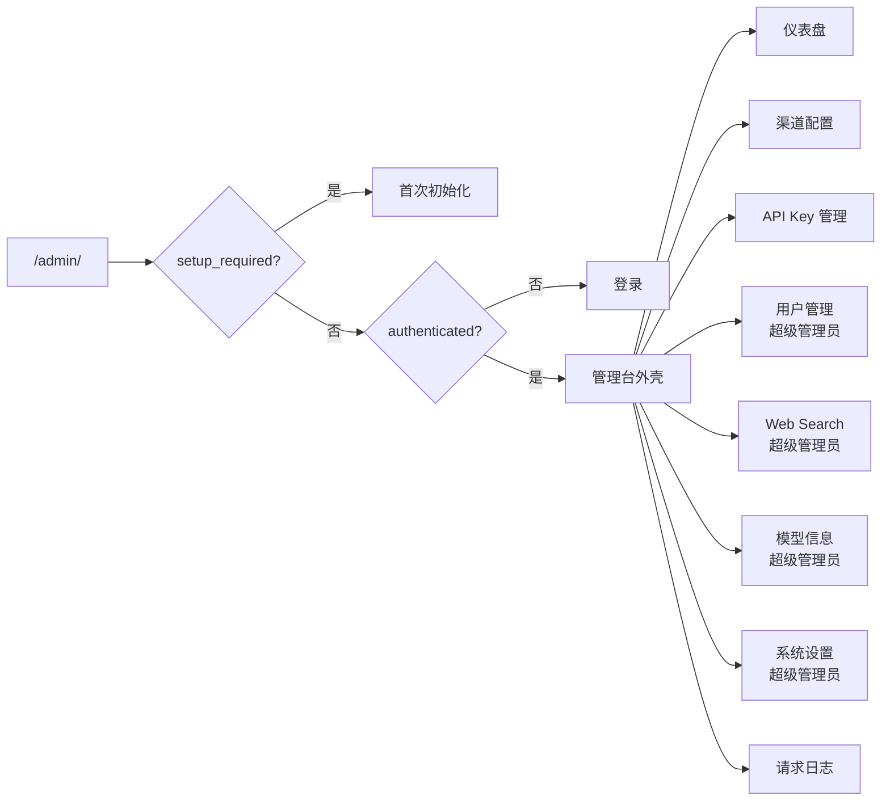
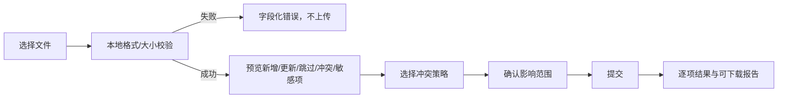

# 10 管理控制台信息架构、页面与交互 PRD

## 0. 文档元数据

| 项目 | 内容 |
|---|---|
| 文档 ID | PRD-10 |
| 需求编号前缀 | `REQ-UI` |
| 文档状态 | Draft，基于当前前端和管理 API 反向整理并补齐产品化要求 |
| 版本 | 1.0 |
| 代码基线 | `main@3827590` |
| 编写日期 | 2026-08-17 |
| 适用端 | Web 管理台、Docker 部署管理台、Tauri 桌面管理台、移动浏览器 |
| 主要读者 | 产品、交互/UI、前端、后端、测试、可访问性、安全、运维 |
| 关联文档 | [02 用户与权限](./02-users-and-permissions.md)、[05 初始化与认证](./05-initialization-and-auth.md)、[06 渠道管理](./06-channel-management.md)、[11 可观测性与计费](./11-observability-and-billing.md)、[12 配置](./12-configuration.md) |

### 0.1 内容口径

- **当前实现事实**：可由 `frontend/src`、管理 API 或当前测试证明的真实行为。
- **产品化要求**：正式产品应达到的目标，以 `REQ-UI-*` 编号。
- **已知限制**：当前交互、架构、响应式、安全或可访问性缺口。
- **TBD**：需要产品、设计或技术负责人确认后才能冻结的规则。

### 0.2 关键词

- **MUST**：发布阻断项，不满足即验收失败。
- **SHOULD**：原则上应满足；若暂缓，必须记录原因、影响和补齐计划。
- **管理台**：挂载在 `/admin/` 的 Vue 3 单页应用。
- **页面状态**：筛选、分页、排序、Tab、展开项、表单草稿、滚动位置、弹窗和实时连接状态。
- **敏感草稿**：密码、完整访问 Key、上游 Key、Web Search Key、含凭证的导入文件等不得自动持久化的状态。

---

## 1. 背景与问题定义

OpenCodex 管理台不是单纯的配置表单，而是覆盖代理运维完整生命周期的操作中心：

- 查看请求量、Token、成本、错误和实时队列；
- 管理渠道、模型映射、协议兼容、容量、熔断和连接测试；
- 管理代理访问 API Key；
- 管理用户和权限；
- 配置 Web Search、模型目录、计费和系统监听；
- 查询请求日志、SSE、请求/响应正文和关联子日志。

当前前端已经提供八个主要业务页面，并实现大量桌面与移动适配。但应用外壳仍使用单个 `activeTab` 和 `v-if` 手工切页，没有 Vue Router、全局错误模型、统一会话失效处理、未保存变更保护和系统化可访问性规范。页面切换会销毁组件，筛选、分页、自动刷新和草稿通常随之丢失；浏览器 URL、前进/后退和刷新也不能表达用户当前位置。

本文把管理台的入口、信息架构、导航、页面结构、交互状态、响应式、可访问性、错误处理和验收标准定义为统一产品契约。各业务字段的后端语义继续以对应专题 PRD 为准。

---

## 2. 产品目标、范围与非目标

### 2.1 产品目标

1. 让超级管理员和普通用户在同一应用外壳中看到清晰、稳定、权限正确的页面集合。
2. 让页面可深链、可刷新、可前进后退，并在安全范围内恢复工作上下文。
3. 统一所有页面的加载、空态、错误、权限拒绝、会话失效和异步组件失败体验。
4. 保证桌面、窄屏和移动设备具备功能等价的核心操作能力。
5. 建立一致的表单、导入导出、危险操作、实时数据和长内容交互。
6. 达到 WCAG 2.2 AA 所需的键盘、焦点、语义、对比度和动态内容要求。
7. 明确当前敏感凭证展示/导出的契约冲突，避免 UI 文案误导用户。
8. 建立可自动化验证的页面质量门禁。

### 2.2 范围

- `/admin`、`/admin/` 和 SPA fallback 入口。
- 初始化、登录、管理台三阶段应用外壳。
- 顶栏、侧栏、折叠菜单和移动 Drawer。
- 仪表盘、渠道、API Key、用户、Web Search、模型信息、系统设置、请求日志。
- 页面切换、路由、历史、状态恢复和脏表单保护。
- 全局 API helper、401/403、网络错误和异步 chunk 失败。
- 桌面、平板、手机断点和弹窗/表格/卡片策略。
- 可访问性、性能、测试和前端可观测性。

### 2.3 非目标

- 重写各后端领域算法。
- 新增当前不存在的业务模块，如组织、账单支付或工单中心。
- 定义企业品牌视觉规范和最终设计 Token 数值。
- 具体选择哪一种前端状态管理库或路由库；本文只定义产品结果。
- 替代对应专题对渠道、日志、计费和权限字段的详细业务规则。

---

## 3. 技术入口与应用加载

### 3.1 当前入口事实

- Vite `base` 为 `/admin/`。
- 生产构建输出到 `frontend/dist/admin`，最终由后端静态文件服务提供。
- 后端收到精确 `/admin` 的 GET/HEAD 时，把请求路径改为 `/admin/`。
- `/admin/` 返回 `admin/index.html`。
- `/admin/{**path:nonfile}` fallback 到 `admin/index.html`，为未来前端深链提供静态入口能力。
- `/admin/api/{**path}` 对常见方法显式返回 404，防止错误 API 路径被 SPA fallback 当成页面。
- 开发环境把 `/admin/session` 等路径代理到后端根路径 `/session`；生产前端直接调用同源根管理 API。
- HTML 设置 `lang="zh-CN"`、viewport、标题 `OpenCodex Admin`。

### 3.2 当前前端启动阶段



### 3.3 异步组件当前事实

`App.vue` 使用 `defineAsyncComponent` 懒加载：

- Dashboard；
- Setup；
- Login；
- Channels；
- AccessKeys；
- Users；
- WebSearch；
- Pricing；
- SystemSettings；
- Logs。

Vite 对部分页面和 ECharts、Element Plus、Vue进行分包。当前没有为异步页面显式配置：

- loading component；
- error component；
- timeout；
- chunk加载重试；
- 版本更新后旧 chunk 404的恢复提示。

因此慢网或部署切换时，页面区域可能短暂空白或只在控制台暴露 chunk错误。

---

## 4. 信息架构与角色可见性

### 4.1 页面地图



### 4.2 页面权限矩阵

| 页面 | 当前 tab key | 未登录 | 普通用户 | 超级管理员 | 数据作用域 |
|---|---|---:|---:|---:|---|
| 仪表盘 | `dashboard` | 否 | 是 | 是 | 普通用户自身；超级管理员全局 |
| 渠道配置 | `channels` | 否 | 是 | 是 | 普通用户自身；超级管理员全部 |
| API Key管理 | `api-keys` | 否 | 是 | 是 | 普通用户自身；超级管理员全部 |
| 用户管理 | `users` | 否 | 否 | 是 | 全部用户 |
| Web Search | `web-search` | 否 | 否 | 是 | 全局配置 |
| 模型信息 | `pricing` | 否 | 否 | 是 | 全局模型目录/计费 |
| 系统设置 | `system-settings` | 否 | 否 | 是 | 全局监听与Probe配置 |
| 请求日志 | `logs` | 否 | 是 | 是 | 普通用户自身；超级管理员全部 |

### 4.3 当前权限实现

- `visibleMenuItems` 根据 `currentUser.role === "superadmin"` 过滤菜单。
- 超级管理员专属 section 同时使用 `isSuperadmin && activeTab===...`。
- `ensureAllowedActiveTab()` 会把普通用户的超级管理员 tab重置为 dashboard。
- 这只是前端防误入；服务端控制器仍通过 `RequireUser()`/`RequireSuperadmin()` 作最终裁决。
- 角色变更仅在重新读取 session或下次登录后刷新外壳中的 `currentUser`；当前没有周期性 session同步。

---

## 5. 应用外壳

### 5.1 顶栏

当前顶栏包含：

- 移动菜单按钮，文字可访问名称“打开菜单”；
- 品牌 `OpenCodex Proxy`；
- 当前用户名；
- 角色 Tag：“超级管理员”或“普通用户”；
- 退出按钮。

桌面顶栏深色背景，品牌字号 24px；窄屏时允许换行，用户区域和退出按钮占据下一行。

### 5.2 桌面侧栏

- 展开宽度 260px。
- 折叠宽度 72px，菜单实际宽度 48px。
- 菜单项高度 48px，使用图标+文字。
- 底部“收起/展开”按钮具有动态 `aria-label` 和 title。
- `menuCollapsed` 仅为当前组件内存状态，刷新或重新登录后恢复展开。

### 5.3 移动导航

- 全局 CSS 在 `max-width:900px` 隐藏桌面侧栏并显示 44×44px菜单按钮。
- 点击后打开从左侧进入、宽 280px 的 Element Plus Drawer。
- 选择菜单项后切换 tab并自动关闭 Drawer。
- Drawer使用与桌面相同的角色过滤菜单。

### 5.4 内容容器

- 桌面：应用壳固定 `100dvh`，外层禁止滚动，主内容区域内部滚动。
- `.content-panel` 使用白色背景、24px内边距，业务 section填满高度。
- `.section-scroll` 用于需要纵向内部滚动的页面。
- `table-area` 让表格占剩余高度、分页固定在底部。
- `max-width:900px` 后改为文档流高度，允许页面整体滚动。

### 5.5 当前导航限制

- 当前只有一个内存变量 `activeTab`，没有 URL 路由。
- 页面切换使用 `v-if`，组件被卸载而非缓存。
- 返回页面时会重新请求数据，原筛选、页码、Tab、滚动、自动刷新和未提交表单通常丢失。
- 浏览器前进/后退不切换管理台页面。
- 复制当前 URL不能分享具体页面。
- 刷新总是回到 dashboard，而非刷新前页面。
- 文档标题和页面标题不随 tab改变。

---

## 6. 页面路由与状态模型

### 6.1 产品化路由建议

最终路径由产品/前端确认，但必须具备稳定一一映射，例如：

| 页面 | 建议路径 | 可持久化查询参数示例 |
|---|---|---|
| 仪表盘 | `/admin/dashboard` | `range`、`start`、`end` |
| 渠道 | `/admin/channels` | `view`、`group`、`owner` |
| API Key | `/admin/api-keys` | 非敏感筛选，不得包含完整Key |
| 用户 | `/admin/users` | 状态/角色筛选 |
| Web Search | `/admin/web-search` | 不在URL放置Key |
| 模型信息 | `/admin/models` | `provider`、`query`、`enabled`、`page` |
| 系统设置 | `/admin/system-settings` | 无敏感参数 |
| 请求日志 | `/admin/logs` | 时间、模型、渠道、状态、request_id、page等 |

### 6.2 状态分类

| 状态类型 | 是否进URL | 是否可本地持久化 | 页面切换是否保留 | 示例 |
|---|---:|---:|---:|---|
| 导航与非敏感筛选 | 是 | 可选 | 是 | tab、provider、日志状态、page |
| UI偏好 | 否 | 是 | 是 | 侧栏折叠、日志列顺序、page size |
| 服务端数据缓存 | 否 | 内存短期 | 可按策略 | 列表、统计、选项 |
| 普通表单草稿 | 否 | 可选且需版本化 | 离开前保护 | 渠道非敏感字段、模型描述 |
| 敏感草稿 | 否 | 否 | 默认不保留 | 密码、完整Key、上游凭证 |
| 临时异步状态 | 否 | 否 | 否 | loading、Toast、SSE连接 |

### 6.3 页面离开原则

- 未保存普通草稿：弹出离开确认，可继续编辑、丢弃或保存。
- 敏感草稿：不得写入 localStorage/sessionStorage/URL；离开时明确丢弃。
- 正在执行测试或批量操作：离开前说明操作是否会在后台继续。
- 正在导入：未完成上传/预览时不得无提示离开。
- 实时连接和计时器：页面不可见或卸载后必须停止，返回时按需恢复。

---

## 7. 全局 API、错误和会话体验

### 7.1 当前 API helper行为

- 基于浏览器 `fetch`。
- 默认 `Content-Type: application/json`，调用方可覆盖为 form-urlencoded。
- JSON响应优先解析；非JSON返回文本。
- 非2xx抛出仅带 message的 `Error`。
- 成功的 `ApiOpResult` 自动取 `Data`。
- 未添加超时、AbortController、统一重试、request ID提取或状态码对象。

### 7.2 当前业务页面错误模式

- 大多数页面 catch 后调用 `ElMessage.error(error.message)`。
- 初始列表失败时，通常保留空数组并结束 loading；空数组可能同时触发“暂无数据”，使“加载失败”和“真正为空”难以区分。
- 刷新失败时有些页面保留旧数据，但不标记数据已经过期。
- Dashboard统计、队列和错误流各自处理错误，流断开时主要改变连接文案。
- Logs筛选提交失败会回滚筛选和列表快照，属于较完整的局部失败处理。
- API helper不保留 status，页面不能可靠区分401/403/409/429/5xx。

### 7.3 产品化全局错误模型

错误对象至少包含：

```text
status, errorCode, message, requestId, retryAfter, details, isNetworkError, isAbort
```

| 错误 | 全局处理 | 页面处理 |
|---|---|---|
| 401 | 清空会话、关闭敏感层、进入登录 | 不重复Toast |
| 403 | 保持会话，记录权限拒绝 | 显示无权限页/行级提示 |
| 404 | 不全局跳转 | 目标已删除，刷新列表 |
| 409 | 不盲重试 | 显示并发冲突并重新读取 |
| 422/400 | 保持表单 | 字段级错误 |
| 429 | 展示等待时间 | 禁用重复提交 |
| 网络失败 | 显示离线/服务不可达 | 保留非敏感旧数据并提供重试 |
| 5xx | 展示诊断ID | 保留上下文，提供重试 |
| chunk加载失败 | 提示版本变化或资源失败 | 一键刷新应用 |

---

## 8. 通用页面结构与交互规范

### 8.1 标准页面层级

1. 页面标题和一行目的说明；
2. 右侧工具栏：筛选、刷新、导入导出、创建等；
3. 可选统计卡/状态摘要；
4. 主列表、图表或表单；
5. 分页或继续加载；
6. Dialog/Drawer承载创建、编辑和详情；
7. Toast仅用于短暂结果，不承担唯一错误说明。

### 8.2 标准状态

| 状态 | 视觉/交互要求 |
|---|---|
| 首次加载 | 骨架或局部 loading，保留页面标题和布局 |
| 后台刷新 | 保留旧数据，刷新按钮 loading，标记刷新中 |
| 成功空态 | 描述为什么为空，并在有权限时提供主行动按钮 |
| 权限空态 | 明确无权限，不显示“暂无数据” |
| 错误态 | 错误摘要、重试、request ID；不与成功空态混用 |
| 部分失败 | 明确哪些区域失败，其他区域继续可用 |
| 保存中 | 禁止重复提交，取消行为明确 |
| 保存成功 | 更新当前数据并关闭/保留编辑器按场景决定 |
| 并发冲突 | 不覆盖远端；展示刷新/对比/重新提交选择 |
| 数据过期 | 保留内容并展示最后更新时间/重试 |

### 8.3 弹窗与抽屉

- 创建/重置类短表单优先 Dialog。
- 渠道/Web Search等长编辑优先 Drawer。
- 手机端复杂 Dialog全屏；底部操作区考虑 safe-area。
- 关闭方式必须统一处理脏表单；遮罩点击、Esc、关闭图标、取消按钮、路由离开采用同一策略。
- 提交过程中默认禁止误关闭，或明确说明后台继续。
- 关闭后清理敏感值和异步请求 token。

---

## 9. 仪表盘页面

### 9.1 页面目标

让用户在一个页面判断代理的使用量、成本、Token、延迟、缓存、请求速率、实时处理渠道和近期错误。

### 9.2 当前页面内容

| 区域 | 当前内容 |
|---|---|
| 时间范围 | 1h、6h、24h、7d、30d、自定义 |
| 手动/自动刷新 | 手动刷新；自动关闭/5/10/30/60秒 |
| 汇总卡 | 总请求数、总TOKEN数、总计费、RPM、TPM |
| 顶部图表/实时 | 请求模型分布、请求队列、错误分布、请求错误 |
| 趋势图 | 消费、Token、TTFT、缓存命中率、每分钟请求 |
| 单位切换 | 成本 CNY/USD；Token K/M |
| 错误详情 | 请求ID、状态码、模型、上游模型、渠道、用户、耗时、错误和响应体 |

### 9.3 当前实时行为

- 统计通过 `GET /stats` 获取。
- 活跃渠道使用 `EventSource /stats/active-channels/stream`，携带 Cookie。
- 近期错误使用 `EventSource /stats/recent-errors/stream`。
- 流有连接/断开文案和 stale timer；组件卸载时关闭流。
- 点击错误项调用 `GET /logs/{id}` 打开详情。

### 9.4 当前状态与限制

- 默认时间范围1小时，自动刷新关闭，成本CNY，Token单位K。
- 自定义开始时间必须早于结束时间；移动端拆成两个日期控件。
- 统计失败仅Toast，图表没有稳定内联错误态。
- ECharts容器没有文本替代、数据表或可访问摘要。
- “请求错误”行使用可点击 `div`，没有 button/link语义、tabindex或键盘事件。
- 页面离开后组件销毁，时间范围和自动刷新设置丢失。
- 实时流断开不等同于历史统计不可用，应作为局部状态呈现。

---

## 10. 渠道配置页面

### 10.1 页面目标

管理上游服务连接、协议类型、凭证、模型映射、兼容规则、可靠性参数、模型计费覆盖和连接测试。详细字段语义见 [06 渠道管理](./06-channel-management.md)。

### 10.2 当前列表和工具栏

- 刷新；
- 批量测试；
- 批量编辑；
- 导出/导入；
- 新增渠道；
- 渠道总数、启用渠道统计；
- 原始列表和归并视图两个Tab；
- 桌面表格与移动卡片；
- 多选渠道；
- 行级编辑、删除、测试、健康重置、模型信息等操作。

### 10.3 当前渠道编辑器

720px Drawer，移动端100%宽度。字段/区域包括：

- enabled；
- 名称、分组；
- 服务类型 `responses/chat/messages/images`；
- images方言 `openai/xai`；
- 认证方式 `config/none`；
- Base URL、上游 API Key、自定义Headers；
- timeout、熔断时间、retry、priority、capacity；
- 请求模型到上游模型映射；
- 模型发现和批量编辑；
- `rename_params`、`drop_params`、`drop_tool_types`、`force_params`、`default_params`、`unsupported_params`；
- apply_patch提示兼容；
- messages保留thinking history；
- 图片渠道重试固定为0。

### 10.4 当前辅助流程

- 模型发现：列表选择后加入映射；
- 渠道级模型信息/价格覆盖：查看、编辑、恢复全局配置；
- 批量编辑：分组、enabled、priority、capacity、timeout、retry、熔断；
- 批量测试：prompt、最大输出Token、并发1–10，展示等待/运行/成功/失败/取消；
- 单渠道测试：模型、prompt、流式事件、耗时、上游请求/响应、错误响应和原始事件；
- 健康重置和导入导出。

### 10.5 当前UI限制

- 切页会销毁复杂渠道草稿，没有离开确认。
- 多个长表单主要依赖提交时解析错误，字段级校验不足。
- 超级管理员能查看全部owner，但新增编辑器不提供清晰的owner分配流程；owner规则以服务端为准。
- 导入文件没有预览、差异、覆盖策略确认和大小上限。
- 导出包含上游凭证，属于高敏感操作。
- 桌面编辑表单大量使用固定12列宽，在某些中间宽度可能拥挤。

---

## 11. API Key管理页面

### 11.1 页面目标

创建和管理调用 `/v1/*` 的代理访问 Key，不得与渠道上游 Key混淆。完整权限和明文策略见 [02 用户与权限](./02-users-and-permissions.md)。

### 11.2 当前页面内容

- 工具栏：刷新、导出、导入、新增；
- 统计：Key总数、启用Key、最近使用；
- 桌面表格/移动卡片：owner（超级管理员）、名称、masked key、最近使用、状态；
- 操作：复制完整Key、启停、删除；
- 新增Dialog：超级管理员可选归属用户、填写名称、创建后显示完整Key。

### 11.3 当前敏感契约冲突

- 页面文案明确声称“可在列表复制完整 Key”。
- 列表行只展示 `masked_key`，但如果响应有 `row.key` 就允许复制。
- 导出JSON写入 `k.key` 并提示“含明文”。
- 创建成功Dialog显示完整Key。
- README声称只在创建时显示一次、数据库只保存哈希；当前后端事实与该说明冲突。
- 超级管理员创建表单提交 `owner_username`，后端 DTO当前接收 `owner_user_id`，归属选择可能不生效。

### 11.4 产品交互原则

- 最终采用一次性明文或可重复揭示策略前，不得同时使用矛盾文案。
- 若采用一次性明文：列表、刷新和导出不得再返回/复制完整Key；创建成功页必须提示立即保存且关闭后不可恢复。
- 若允许导出明文：需要近期重新认证、二次确认、审计和受控文件处理。
- 创建成功后主按钮不应继续无提示创建多枚Key；对话框应进入明确“已创建”阶段。

---

## 12. 用户管理页面

### 12.1 当前页面内容

- 仅超级管理员可见；
- 刷新、新增用户；
- 桌面表格/移动卡片：用户名、角色、状态、创建时间；
- 行级启停、重置密码、删除；
- 新增用户Dialog：username、password、enabled；
- 重置密码Dialog：只读username、新密码。

### 12.2 当前保护行为

- UI禁止启停任意 `role=superadmin` 的行，而不只是环境变量超级管理员。
- UI禁止为任意超级管理员重置密码。
- UI禁止删除当前登录用户名。
- 删除其他超级管理员在前端未统一禁止；最终保护依赖后端。
- 创建接口固定创建普通用户，UI没有角色选择。

### 12.3 当前限制

- 用户名/密码没有Element Plus rules和内联错误。
- 删除提示只显示用户名，未说明渠道、Key和日志影响。
- 密码重置成功不说明已有会话是否失效。
- 无搜索、筛选、分页、最近登录或审计入口。
- 页面切换会关闭表单并丢弃输入，没有脏表单提示。

---

## 13. Web Search页面

### 13.1 当前页面内容

- 仅超级管理员可见；
- 刷新、导入、导出、新增Key；
- 统计：当前模式、可用Key、累计调用；
- 模式：模拟 `simulate`、转换 `convert`、关闭 `disabled`；
- Key表格/移动卡片：服务商、masked API Key、使用次数/上限、状态；
- Key操作：测试、编辑、删除；
- 编辑Drawer：provider、完整Key、enabled、usage_count、usage_limit；
- 测试结果展示成功/失败、耗时、使用量和返回摘要。

### 13.2 当前保存模式

- 模式切换立即调用保存。
- 新增/编辑/删除先修改本地数组，再调用 `/web-search` 持久化。
- 导出文件包含完整Key并明确提示明文。
- 导入只做JSON、keys数组和mode的基础校验，没有预览。

### 13.3 当前限制

- 本地先变更、服务端保存失败时没有统一回滚，UI可能暂时与服务端不一致。
- Drawer固定520px，没有显式移动端100%宽度规则，主要依赖全局最大宽度。
- 切换模式属于立即生效操作，但没有影响范围确认或撤销。
- 完整Key编辑/导入/导出缺少近期认证和审计反馈。

---

## 14. 模型信息与计费页面

### 14.1 当前页面内容

- 仅超级管理员可见；
- 搜索模型/名称/匹配键；
- enabled筛选；
- 刷新、更新默认目录、新增供应商、新增模型；
- 桌面用供应商Tabs，移动用Select；
- 表格/卡片展示供应商、模型、名称、匹配规则、输入/输出/缓存价格、状态、来源；
- 客户端分页，默认25，可选25/50/100；
- 编辑/停用模型。

### 14.2 模型编辑器

- provider、enabled；
- model key、display name；
- match type：exact/prefix/suffix/contains；
- match pattern、description；
- supports image、context window；
- currency；
- input/output/cache_write/cache_read规则；
- billing mode：per_request/per_million_tokens/tiered_tokens；
- unit price、tiers、enabled；
- Catalog JSON高级编辑。

移动端模型Dialog全屏，计费规则由表格转换为卡片。

### 14.3 当前限制

- 列表从服务端加载全部匹配结果，再在前端分页；大数据量下性能和一致性有限。
- “更新”实际调用 seed-defaults，但按钮文案未说明插入/更新范围和覆盖规则。
- 停用操作使用“删除”图标和DELETE接口，但产品结果是停用，语义需要统一。
- Catalog JSON和tiers错误主要在保存时Toast，没有字段定位。
- 页面状态在切页/刷新后丢失。

---

## 15. 系统设置页面

### 15.1 当前页面内容

- 仅超级管理员可见；
- 刷新；
- 访问范围 localhost/LAN；
- LAN警告；
- 端口1024–65535；
- Probe拦截开关；
- 当前绑定地址、管理台地址、是否桌面托管；
- 保存；
- 需要重启且处于Tauri时显示“立即重启服务”。

### 15.2 当前交互

- 页面进入即 `GET /system-settings`。
- 保存 `PUT /system-settings`。
- 返回 `restart_required=true` 时显示持久信息Alert。
- Tauri重启成功后导航到新管理台URL。

### 15.3 当前限制

- 修改草稿后点击刷新或切页会直接覆盖/丢弃，没有确认。
- Web/Docker形态保存后只能提示重启，没有具体操作指引或健康验证。
- LAN模式仍可能使用明文HTTP。
- Tauri Rust schema当前可能在重启时丢失 Probe拦截字段。
- 端口占用只会在重启阶段暴露，保存前不预检。

---

## 16. 请求日志页面

### 16.1 页面目标

按权限查看请求生命周期、筛选链路、统计总量、诊断转换前后内容、SSE和渠道尝试。详细日志和成本语义见 [11 可观测性与计费](./11-observability-and-billing.md)。

### 16.2 当前工具栏

- 列设置：显示/隐藏列、上移、下移、恢复默认；
- 自动刷新：关闭/5/10/30/60秒；
- 手动刷新；
- 超级管理员清除全部日志。

列设置只保存在当前组件内存，不进入localStorage。

### 16.3 当前筛选

快捷筛选：

- 时间范围：前后3小时、最近1/6/24小时、7天、自定义；
- 标识类型：request ID、conversation key、turn ID、window ID、previous response ID；
- 请求状态；
- 模型；
- 渠道；
- 查询、重置、更多筛选。

高级筛选：

- 自定义开始/结束时间；
- 关联链路所有ID；
- path；
- request type：main/ocr/attempt；
- status code；
- owner username（仅超级管理员）；
- API Key ID/名称。

筛选有草稿/已应用两层状态、dirty提示和可关闭的已应用chips。自动补全至少输入2字符，远程加载候选。

### 16.4 当前列表与摘要

- 汇总卡：总请求、总Token、总计费、RPM、TPM；
- 桌面表格列可配置；
- 移动卡片显示核心字段；
- 服务端分页，默认20，可选20/50/100/200；
- 筛选提交同时刷新列表和统计；任一失败时回滚原筛选和视图快照；
- 当前默认“前后3小时”包含未来3小时，是否为预期需确认。

### 16.5 当前详情

- 基础：request ID、状态、类型、父日志、会话关联字段、模型、上游模型、渠道、状态码、尝试数、成本和时间；
- 关联跳转：OCR子日志、渠道尝试、主请求；
- 错误信息；
- SSE：合并事件/原始行，复制当前视图；
- JSON区：请求头、原始请求、转换后请求、转换前响应、转换后响应等；
- 每区支持复制；
- 移动端详情全屏。

### 16.6 当前限制

- 切到其他页面后筛选、页码、列设置和自动刷新全部丢失。
- 详情可能包含凭证、Prompt、用户数据或上游响应，当前UI主要依赖后端存储内容，缺少统一脱敏视图和权限提示。
- “清除全部日志”不可恢复，只用一次Popconfirm；缺少近期认证和影响数量预览。
- 大型JSON和长SSE一次性渲染可能造成性能问题。
- 复制按钮部分为纯图标，依赖Tooltip而非统一 `aria-label`。

---

## 17. 导入、导出、复制与危险操作

### 17.1 当前导入导出

| 页面 | 导入 | 导出 | 敏感性 |
|---|---:|---:|---|
| 渠道 | JSON | JSON | 含上游Key/Headers |
| API Key | JSON | JSON | 当前含访问Key明文 |
| Web Search | JSON | JSON | 含Web Search Key明文 |
| 模型信息 | 无普通导入导出 | seed默认目录 | 配置风险 |

当前导出通过Blob和临时`<a download>`触发；导入通过隐藏文件input读取完整文本并解析JSON。

### 17.2 产品化导入流程



### 17.3 危险操作等级

| 等级 | 示例 | 最低交互 |
|---|---|---|
| 低 | 刷新、复制masked值 | 即时执行+结果反馈 |
| 中 | 停用Key、停用用户、切换Web Search模式 | 明确对象和影响，可撤销时优先撤销 |
| 高 | 删除用户/渠道/Key、明文导出 | 二次确认、影响摘要、审计 |
| 极高 | 清除全部日志、远程暴露LAN、批量覆盖配置 | 近期认证、输入确认、影响数量、审计和恢复/备份说明 |

---

## 18. 响应式与移动端规范

### 18.1 当前断点事实

| 层级/页面 | 当前断点 |
|---|---|
| 全局外壳 | 900px：隐藏侧栏、显示移动菜单；600px：紧凑间距/44px控件 |
| Dashboard | 600px移动交互；另有900px和901–1400px布局规则 |
| Logs | 600px移动卡片；另有960px、1440px规则 |
| Users | 600px表格转卡片 |
| AccessKeys | 600px表格转卡片 |
| WebSearch | 600px表格转卡片 |
| Channels | 767px表格/表单转移动布局 |
| Pricing | 767px表格/Tab转卡片/Select |
| SystemSettings | 主要依赖全局900/600规则 |

### 18.2 当前全局移动规则

- 使用 `100dvh` 和 safe-area inset。
- `max-width:900px` 时Dialog约束到视口，fullscreen Dialog占满100dvh。
- Dialog/Drawer footer考虑底部安全区。
- `max-width:600px` 时主内容8px、面板12px。
- 关键按钮最小高度44px。
- 输入字体16px。
- 分页隐藏total/page-size并使用44px页按钮。
- 系统设置按钮纵向全宽。

### 18.3 当前问题

- 600、767、900三个核心断点混用，导致同一宽度下外壳已进入移动模式而页面仍显示桌面表格。
- 部分组件用JS `matchMedia`，部分只用CSS，状态切换时可能不同步。
- 手机横屏、折叠屏、320px窄屏和系统字体放大没有系统测试。
- 固定宽Drawer 520px、280px虽有全局max-width，但未统一定义手机全屏策略。
- 表格列过多时中间宽度可能横向滚动或压缩。

### 18.4 产品化断点原则

建议由设计系统统一为“紧凑/中等/宽屏”语义断点，页面可以在内容需要时增加局部容器查询，但必须满足：

1. 导航模式与页面主布局不冲突；
2. 不依赖User-Agent；
3. 桌面缩窄和移动设备结果一致；
4. 200%缩放仍可操作；
5. 横竖屏切换保留安全的非敏感状态；
6. 表格转卡片时字段与操作功能等价。

---

## 19. 可访问性规范与当前缺口

### 19.1 当前正向基础

- HTML语言为中文。
- 移动菜单、侧栏折叠、日志复制请求ID等部分按钮有 `aria-label`。
- 日志已应用筛选区域使用 `aria-live=polite`。
- 多数交互使用Element Plus原生按钮、表单、Dialog、Drawer。
- 角色/状态同时有文本，不只依赖颜色。

### 19.2 明确缺口

1. Dashboard错误项为可点击 `div`，键盘不可达且无语义。
2. ECharts没有文本替代、数据表、摘要或无障碍模式。
3. 部分圆形/图标按钮仅通过Tooltip表达用途，缺少稳定accessible name。
4. Toast经常是唯一错误反馈，和字段没有关联。
5. 异步页面加载、实时流重连、保存结果缺少统一live region。
6. 无全局跳到主内容链接。
7. 关闭Dialog/Drawer后的焦点恢复未形成统一测试。
8. 无 `prefers-reduced-motion` 规范。
9. 复杂表格转卡片后的阅读顺序和标题关联未系统验证。
10. 高对比度模式、200%缩放和屏幕阅读器没有自动/人工门禁。

### 19.3 WCAG 目标

- 正式版本以 WCAG 2.2 AA 为最低目标。
- 键盘、读屏、缩放、颜色对比、焦点可见、目标尺寸和错误识别均属于MUST。
- 图表必须提供等价文本摘要或数据表，不要求读屏直接解析Canvas。

---

## 20. 产品化需求与逐条验收标准

### 20.1 入口、外壳与路由

#### REQ-UI-001（MUST）管理台入口稳定

**验收标准**：
1. `/admin` 和 `/admin/` 均进入同一应用，最终URL规范一致。
2. 静态资源使用 `/admin/` base正确加载。
3. 未知页面深链返回SPA入口，未知 `/admin/api/*` 不被误当页面。
4. Web、Docker、Tauri三形态均通过自动化冒烟测试。

#### REQ-UI-002（MUST）启动状态互斥且无闪屏

**验收标准**：
1. 同一时刻只显示加载、错误、setup、login或console之一。
2. 未完成session检查前不展示受保护数据。
3. 请求失败有重试，不展示空白页。
4. 状态切换不会短暂暴露上一用户数据。

#### REQ-UI-003（MUST）每个业务页面拥有稳定路由

**验收标准**：
1. 八个业务页面均有唯一URL。
2. 刷新后恢复同一页面和允许的非敏感查询状态。
3. 浏览器前进/后退能切换页面。
4. 复制URL可在同权限账号中打开同一视图。

#### REQ-UI-004（MUST）路由级权限保护

**验收标准**：
1. 普通用户直接输入超级管理员URL时不能渲染受限页面。
2. 返回明确403/无权限体验并导航到允许页。
3. 隐藏菜单不能替代服务端权限。
4. 角色变化后当前路由立即重新校验。

#### REQ-UI-005（MUST）安全恢复页面状态

**验收标准**：
1. 筛选、分页、排序、Tab和滚动按页面策略恢复。
2. 侧栏折叠、日志列设置等偏好可持久化且可重置。
3. 密码、完整Key、上游凭证和导入文件内容不进入URL或Web Storage。
4. 状态schema升级失败时安全回退默认值。

#### REQ-UI-006（MUST）未保存变更保护

**验收标准**：
1. 渠道、Web Search、模型、系统设置和用户表单修改后离开会提示。
2. 提示覆盖菜单切换、浏览器后退、刷新、关闭Dialog/Drawer和退出。
3. 用户可继续编辑或明确丢弃。
4. 敏感草稿不提供不安全的自动持久化选项。

#### REQ-UI-007（MUST）应用外壳角色与身份清晰

**验收标准**：
1. 顶栏持续显示当前用户名和角色。
2. 用户名过长时不挤掉退出和导航。
3. 退出入口在桌面/移动均可见且键盘可达。
4. 会话切换后不残留前一用户菜单或数据。

#### REQ-UI-008（SHOULD）侧栏偏好持久化

**验收标准**：
1. 展开/折叠状态在同一用户后续访问中恢复。
2. 折叠时每个图标有Tooltip和accessible name。
3. 偏好损坏时回退展开，不影响导航。

#### REQ-UI-009（MUST）移动菜单可靠

**验收标准**：
1. 移动断点隐藏桌面侧栏并显示44×44px菜单按钮。
2. Drawer打开后焦点进入，关闭后回到触发按钮。
3. 选择页面后Drawer关闭并更新路由。
4. Esc、遮罩和关闭按钮行为符合统一脏状态规则。

### 20.2 异步加载与全局API

#### REQ-UI-010（MUST）异步页面有加载和错误占位

**验收标准**：
1. 首次加载chunk显示明确骨架/进度，不出现空白内容区。
2. chunk失败显示重试和刷新应用。
3. 部署版本切换导致旧chunk 404时给出“版本已更新”恢复路径。
4. 加载状态可被读屏感知。

#### REQ-UI-011（MUST）统一API错误对象

**验收标准**：
1. 前端可读取HTTP status、业务错误码、message、request ID和Retry-After。
2. 网络错误、主动取消和服务端错误可区分。
3. 不把错误响应堆栈或敏感详情直接展示给普通用户。
4. 所有页面通过同一客户端或等价统一层调用管理API。

#### REQ-UI-012（MUST）全局401处理

**验收标准**：
1. 任意页面请求401时原子清空会话和敏感层。
2. 并发401只显示一次会话失效提示。
3. 进入登录页并记录安全的原目标路由。
4. 重新登录后不恢复敏感草稿。

#### REQ-UI-013（MUST）全局403处理

**验收标准**：
1. 403不清除有效会话。
2. 显示无权限文案并保留可返回导航。
3. 不能把403显示成空列表或网络故障。
4. 服务端审计可关联request ID。

#### REQ-UI-014（MUST）请求取消与竞态保护

**验收标准**：
1. 页面卸载或筛选变化时取消不再需要的请求，或用token丢弃旧响应。
2. 慢旧响应不得覆盖快新响应。
3. 取消请求不显示错误Toast。
4. 保存类请求是否允许取消有明确规则。

### 20.3 通用页面状态

#### REQ-UI-015（MUST）加载态不破坏上下文

**验收标准**：
1. 首次加载与后台刷新视觉不同。
2. 后台刷新保留旧数据和滚动位置。
3. 同一按钮请求中显示loading并防重复提交。
4. 超过目标时长显示慢请求提示和取消/重试策略。

#### REQ-UI-016（MUST）空态与错误态分离

**验收标准**：
1. 成功返回0项显示空态。
2. 请求失败显示错误态，不显示“暂无数据”。
3. 权限不足显示权限态。
4. 每种状态提供合适下一步。

#### REQ-UI-017（SHOULD）数据新鲜度可见

**验收标准**：
1. 自动刷新或实时流页面显示连接/最后更新时间。
2. 刷新失败保留旧数据时标为已过期。
3. 用户可手动重试。
4. 不因局部流断开隐藏仍有效的历史数据。

#### REQ-UI-018（MUST）字段级校验

**验收标准**：
1. 表单错误显示在对应字段附近。
2. 提交后焦点移动到首个错误字段。
3. Toast只作补充，不是唯一错误载体。
4. 前端约束与服务端规则一致，服务端仍最终校验。

#### REQ-UI-019（MUST）并发冲突保护

**验收标准**：
1. 目标被删除或更新时不静默覆盖。
2. 409/404提供刷新和重新编辑路径。
3. 不可编辑owner、role等字段不被陈旧草稿回写。
4. 批量操作返回逐项结果。

### 20.4 仪表盘

#### REQ-UI-020（MUST）仪表盘核心指标完整

**验收标准**：
1. 时间范围影响所有历史统计图和汇总口径一致。
2. 总请求、Token、成本、RPM、TPM有单位和无数据状态。
3. 自定义范围拒绝开始不早于结束。
4. 普通用户和超级管理员看到正确数据作用域。

#### REQ-UI-021（MUST）实时区域独立降级

**验收标准**：
1. 队列和错误流分别显示连接、断开、重连和无数据。
2. 某一流失败不阻止历史图表使用。
3. 离开页面后关闭EventSource和timer。
4. 返回页面按设置恢复或明确重置自动刷新。

#### REQ-UI-022（MUST）仪表盘图表可访问

**验收标准**：
1. 每张图有标题、当前范围和文本摘要。
2. 提供数据表或可下载等价信息。
3. 请求错误项使用button/link语义并支持Enter/Space。
4. 图表颜色不是唯一区分方式。

### 20.5 渠道、Key、用户和全局配置

#### REQ-UI-023（MUST）渠道列表功能等价

**验收标准**：
1. 原始/归并视图均能查看核心状态和执行允许操作。
2. 移动卡片保留选择、编辑、测试、删除和更多操作。
3. 健康、容量、enabled和owner状态有文本。
4. 普通用户看不到他人渠道。

#### REQ-UI-024（MUST）渠道编辑草稿安全

**验收标准**：
1. 所有字段按协议类型动态显示且切换时明确清理规则。
2. Headers、兼容规则和模型映射解析错误定位到具体区域/行。
3. 上游Key默认遮蔽，不写入持久化前端状态。
4. 关闭或切页触发脏表单保护。

#### REQ-UI-025（MUST）渠道批量与测试流程可控

**验收标准**：
1. 批量操作先显示对象数和将修改字段。
2. 批量测试可取消并展示每项状态。
3. 长时间测试离开页面时说明后台行为。
4. 测试结果区分连接中、流式、成功、失败和无事件。

#### REQ-UI-026（MUST）API Key页面使用单一明文策略

**验收标准**：
1. 列表文案、复制、创建和导出与最终安全策略一致。
2. 一次性策略下关闭创建结果后不能从列表再次复制完整Key。
3. 明文导出若保留，必须近期认证、二次确认和审计。
4. `owner`选择字段与后端契约一致并有端到端测试。

#### REQ-UI-027（MUST）用户生命周期交互说明影响

**验收标准**：
1. 停用、删除和重置密码前说明对Cookie、Bearer Key和资源的影响。
2. 环境管理员、当前用户、最后超级管理员保护在按钮态和后端一致。
3. 密码字段遵循认证密码策略并在完成后清空。
4. 删除结果明确成功、部分失败或冲突。

#### REQ-UI-028（MUST）Web Search即时变更可恢复

**验收标准**：
1. 模式切换明确标注立即生效。
2. 服务端保存失败时回滚本地mode/keys或重新加载权威状态。
3. 测试Key不阻塞其他只读查看。
4. 完整Key导入导出遵循敏感操作策略。

#### REQ-UI-029（MUST）模型信息编辑可验证

**验收标准**：
1. provider、model key、match规则、Catalog和pricing错误可定位。
2. “更新默认目录”显示新增/更新范围和结果。
3. 停用动作的按钮、确认和接口语义一致。
4. 大数据量改用服务端分页或达到性能指标。

#### REQ-UI-030（MUST）系统设置保存和重启闭环

**验收标准**：
1. 草稿、已保存值和运行中值可区分。
2. 保存前验证端口和访问模式。
3. 需重启时明确当前仍未生效，并给出Web/Tauri对应操作。
4. 重启后自动验证新地址和设置值。

### 20.6 请求日志

#### REQ-UI-031（MUST）日志筛选可分享且可回滚

**验收标准**：
1. 非敏感筛选、页码和page size可映射到URL或稳定状态。
2. 草稿与已应用条件有明确区分。
3. 列表/统计任一刷新失败时不应用半套筛选。
4. 重置恢复明确默认时间范围。

#### REQ-UI-032（MUST）日志列表桌面移动等价

**验收标准**：
1. 手机卡片包含诊断所需核心字段和详情入口。
2. 桌面列设置可持久化和恢复默认。
3. 分页在320px下可操作，无横向溢出。
4. 状态、类型、耗时和成本格式一致。

#### REQ-UI-033（MUST）日志详情安全展示

**验收标准**：
1. 详情按用户权限返回，前端不得仅靠隐藏owner字段。
2. 凭证、Cookie和安全Header按策略脱敏。
3. 大JSON/SSE采用虚拟化、折叠或分段加载，满足性能目标。
4. 复制前明确内容敏感性，复制结果可被读屏感知。

#### REQ-UI-034（MUST）关联日志导航可返回

**验收标准**：
1. 从主请求查看OCR/attempt或从子日志返回主请求后，浏览器返回能恢复原详情/列表。
2. 关联筛选保留原时间范围。
3. 目标不存在时显示404而不是空详情。

### 20.7 导入导出与危险操作

#### REQ-UI-035（MUST）导入前预览和冲突确认

**验收标准**：
1. 校验扩展名、MIME、大小、JSON schema和条目上限。
2. 展示新增、更新、跳过、冲突和非法条目数量。
3. 用户选择冲突策略后再提交。
4. 结果提供逐项报告，不因单项失败误报整体成功。

#### REQ-UI-036（MUST）敏感导出受控

**验收标准**：
1. 导出前展示是否包含明文凭证。
2. 明文导出需要近期认证和二次确认。
3. 记录操作者、范围、结果和request ID，不记录凭证内容。
4. 文件名、权限和后续保管提示明确。

#### REQ-UI-037（MUST）危险操作分级确认

**验收标准**：
1. 确认内容包含对象名、数量和不可逆影响。
2. 清除全部日志、批量覆盖和LAN暴露采用最高等级交互。
3. 按钮在请求中禁用，避免重复执行。
4. 操作结果可区分全部成功、部分成功和失败。

### 20.8 响应式与可访问性

#### REQ-UI-038（MUST）统一响应式策略

**验收标准**：
1. 导航与页面布局使用协调的语义断点。
2. 320px、375px、600px、768px、900px、1280px和200%缩放均有回归。
3. 不出现阻断操作的横向滚动。
4. 横竖屏切换不丢失已保存状态。

#### REQ-UI-039（MUST）移动端核心功能等价

**验收标准**：
1. 八个页面的核心查看和操作均可在手机完成。
2. 表格转卡片不遗漏关键字段或危险确认。
3. 复杂Dialog在手机全屏，底部按钮不被安全区/键盘遮挡。
4. 触控目标不小于44×44px。

#### REQ-UI-040（MUST）键盘与焦点管理

**验收标准**：
1. 无鼠标可完成导航、筛选、创建、编辑、保存和取消。
2. Dialog/Drawer使用焦点圈定，关闭后恢复触发点。
3. 页面切换后焦点落到主标题或主内容。
4. 不存在只有click而没有键盘等价的交互元素。

#### REQ-UI-041（MUST）动态状态可被辅助技术感知

**验收标准**：
1. 加载、保存、错误、复制、流连接和筛选应用有合适live region。
2. 字段错误通过可访问描述关联。
3. 图标按钮均有稳定accessible name。
4. 状态不只通过颜色、位置或动画表达。

#### REQ-UI-042（MUST）图表与复杂数据等价表达

**验收标准**：
1. ECharts每张图提供摘要或数据表。
2. Canvas本身不可读时不阻断信息获取。
3. 数据表支持键盘浏览并显示相同单位/时间范围。
4. 高对比度和色觉缺陷模式仍可区分序列。

#### REQ-UI-043（SHOULD）减少动态效果

**验收标准**：
1. 尊重 `prefers-reduced-motion`。
2. 侧栏、Drawer、loading和图表动画可减少或关闭。
3. 不使用闪烁超过可访问性阈值的效果。

### 20.9 性能、测试与质量

#### REQ-UI-044（MUST）页面性能预算

**验收标准**：
1. 各页面chunk大小、首屏加载和交互响应有TBD-UI-004确定的预算。
2. ECharts仅在需要页面加载。
3. 长日志和大列表不阻塞主线程超过目标阈值。
4. chunk超预算在CI失败或产生明确门禁。

#### REQ-UI-045（MUST）前端自动化测试门禁

**验收标准**：
1. 覆盖setup/login、角色路由、401/403、八页冒烟和关键CRUD。
2. 覆盖至少三档视口、键盘和基础a11y扫描。
3. 覆盖脏表单、导入预览、危险确认和chunk失败。
4. PR构建必须运行测试和生产build。

#### REQ-UI-046（SHOULD）前端可观测性

**验收标准**：
1. 记录页面加载失败、chunk失败、API错误类别和未捕获异常。
2. 关联后端request ID和前端版本。
3. 不采集密码、Cookie、完整Key、Prompt正文等敏感数据。
4. 提供错误率和关键流程成功率看板。

---

## 21. 管理台接口依赖

### 21.1 页面到接口

| 页面 | 主要接口 |
|---|---|
| 启动/认证 | `/setup/status`、`/setup`、`/session`、`/login`、`/logout` |
| 仪表盘 | `/stats`、`/stats/active-channels/stream`、`/stats/recent-errors/stream`、`/logs/{id}` |
| 渠道 | `/config`、`/config/import`、`/channels`、`/channels/{id}`、`/channels/batch`、`/discover-models`、`/test-channel/stream`、渠道模型信息/健康接口 |
| API Key | `/api-keys`、`/api-keys/{id}`、`/api-keys/import`、超级管理员创建时 `/users` |
| 用户 | `/users`、`/users/{username}` |
| Web Search | `/web-search`、`/web-search/import`、`/web-search/test-key` |
| 模型信息 | `/model-providers`、`/model-infos`、`/model-infos/{id}`、`/model-infos/seed-defaults` |
| 系统设置 | `/system-settings`；Tauri `restart_backend` command |
| 请求日志 | `/logs`、`/logs/{id}`、`/log-filter-options`、`/stats` |

### 21.2 前端第三方依赖

| 依赖 | 用途 | 产品风险 |
|---|---|---|
| Vue 3 | 组件和响应式 | 路由/状态层当前未引入 |
| Element Plus | UI组件 | 需统一a11y和移动覆写 |
| ECharts | 仪表盘图表 | Canvas可访问性和bundle体积 |
| vue-json-pretty | 日志JSON详情 | 超大JSON性能与敏感内容 |
| Tauri API | 桌面后端重启 | 只能在Tauri runtime调用 |

---

## 22. 当前实现事实、已知限制与 TBD 汇总

### 22.1 当前实现事实

1. 管理台基于Vue 3、Element Plus、ECharts，部署在 `/admin/`。
2. 页面均异步加载。
3. 应用有顶栏、260/72px侧栏、移动280px Drawer。
4. 普通用户和超级管理员菜单不同，服务端做最终权限校验。
5. 八个主要页面均已有桌面交互；多数列表具备移动卡片。
6. Dashboard使用历史统计+两个SSE实时流。
7. Logs具有草稿/已应用筛选、服务端分页、详情和SSE查看。
8. 全局CSS已考虑100dvh、safe-area、44px触控和16px移动输入。

### 22.2 已知限制

1. 无Vue Router，URL、刷新、前进后退和深链不表达页面。
2. `v-if`切页销毁组件，绝大多数页面状态丢失。
3. 无统一脏表单保护。
4. 无异步chunk加载/错误组件。
5. API helper不保留status/request ID，无全局401/403。
6. 页面错误大量只用Toast，加载失败可能被误显示为空态。
7. 响应式断点600/767/900混用。
8. Dashboard可点击div和ECharts存在可访问性缺口。
9. 部分图标按钮缺少aria-label，缺少reduced-motion规范。
10. API Key明文文案、列表复制和导出与README冲突。
11. API Key owner字段前后端不一致。
12. 渠道、API Key和Web Search导出含明文凭证。
13. 导入没有预览、冲突策略、大小限制和逐项结果。
14. Web Search本地先变更，保存失败缺少可靠回滚。
15. 日志列设置不持久化，大JSON/SSE可能造成性能问题。
16. 系统设置和Tauri setup存在Probe字段重启丢失问题。
17. 前端package scripts只有dev/build，没有正式test/a11y/e2e门禁。
18. 当前仅有两个Node单元测试文件，集中在渠道测试/图片状态逻辑。

### 22.3 TBD

| 编号 | 事项 | 推荐方向 | 决策方 |
|---|---|---|---|
| TBD-UI-001 | 正式路由路径和日志筛选URL字段 | 采用语义路径，敏感值禁止入URL | 产品+前端 |
| TBD-UI-002 | 页面状态保留时长 | 会话内保留，用户偏好长期保留 | 产品+前端 |
| TBD-UI-003 | 统一响应式断点 | 基于内容和设计Token统一三档 | 设计+前端 |
| TBD-UI-004 | 首屏/chunk/交互性能预算 | 结合部署硬件和LAN场景实测冻结 | 前端+架构 |
| TBD-UI-005 | API Key明文策略 | 推荐创建时一次性显示 | 安全+产品 |
| TBD-UI-006 | 明文导出是否保留 | 推荐默认关闭，必要时近期认证 | 安全+产品 |
| TBD-UI-007 | 日志默认“前后3小时”是否应改最近3小时 | 推荐改为最近3小时 | 产品+数据 |
| TBD-UI-008 | 日志详情脱敏范围和揭示权限 | 默认脱敏，受控揭示 | 安全+运维 |
| TBD-UI-009 | 超级管理员是否可为他人创建渠道 | 若支持需显式owner字段和审计 | 产品+权限 |
| TBD-UI-010 | 前端错误采集平台和保留期 | 仅采集元数据，不采敏感正文 | 运维+安全 |
| TBD-UI-011 | 是否支持暗色/高对比主题 | 高对比为可访问性优先，暗色可后续 | 设计+产品 |
| TBD-UI-012 | 离开页面时后台测试是否继续 | 按任务类型定义，结果可回查 | 产品+后端 |

---

## 23. 源码与测试追溯

### 23.1 应用外壳和构建

- `frontend/src/App.vue`
  - 启动状态、API helper、角色菜单、侧栏/移动Drawer、tab切换、退出。
- `frontend/src/main.js`
  - Element Plus按组件注册和应用挂载。
- `frontend/src/style.css`
  - 全局壳、工具栏、表格、Dialog/Drawer、响应式、safe-area和44px规则。
- `frontend/vite.config.js`
  - `/admin/` base、开发代理、生产输出、manual chunks。
- `frontend/index.html`
  - `zh-CN`、viewport、标题和应用根节点。
- `opencodex_proxy/src/Presentation/OpenCodex.Api/Hosting/OpenCodexApplicationBuilderExtensions.cs`
  - `/admin`规范化、静态文件、SPA fallback和`/admin/api` 404。

### 23.2 页面源码

- `frontend/src/Dashboard.vue`
- `frontend/src/Channels.vue`
- `frontend/src/AccessKeys.vue`
- `frontend/src/Users.vue`
- `frontend/src/WebSearch.vue`
- `frontend/src/Pricing.vue`
- `frontend/src/SystemSettings.vue`
- `frontend/src/Logs.vue`
- `frontend/src/Setup.vue`
- `frontend/src/Login.vue`
- `frontend/src/tauriBackend.js`

### 23.3 当前前端测试

- `frontend/src/channelTestState.test.js`
  - 渠道测试连接、流式、成功/失败等状态转换。
- `frontend/src/channelImagesState.test.js`
  - 图片渠道方言、retry=0和兼容规则处理。
- `frontend/package.json`
  - 当前只有 `dev`、`build` script；没有正式test script。

### 23.4 后端路由测试证据

- `opencodex_proxy/tests/OpenCodex.Api.Tests/SetupRoutesTests.cs`
  - setup状态和首次创建流程。
- `opencodex_proxy/tests/OpenCodex.Api.Tests/RouteTests.cs`
  - 新管理路由可用、旧 `/admin/api/*`路由不可用、失败HTTP状态、渠道/价格权限和持久Cookie。
- 各领域单元/集成测试可追踪到对应专题，但当前缺少浏览器级端到端测试。

### 23.5 必补浏览器测试矩阵

1. `/admin`、`/admin/`、八页深链、404和版本更新chunk失败。
2. setup、login、logout、session恢复、并发401、403。
3. 普通用户/超级管理员菜单和直接URL权限。
4. 导航前进后退、刷新、状态恢复、脏表单离开。
5. 每页首次加载、空态、错误态、重试和后台刷新。
6. Dashboard SSE断线/重连、图表文本等价和错误项键盘操作。
7. 渠道创建编辑、模型发现、批量、单/批测试、移动卡片。
8. API Key一次性明文策略、owner字段、导入导出。
9. 用户保护、密码重置和删除影响确认。
10. Web Search保存失败回滚、Key测试和明文操作。
11. 模型搜索、provider、分页、Catalog/tiers错误和手机全屏编辑。
12. 系统设置保存、Tauri重启、端口失败和Probe字段往返。
13. 日志筛选回滚、列设置、关联详情、SSE、长JSON和清除全部。
14. 320/375/600/768/900/1280px、横竖屏、200%缩放。
15. 键盘、读屏、焦点、对比度、axe扫描和reduced motion。

---

## 24. 文档自检

- `REQ-UI-001` 至 `REQ-UI-046` 编号连续、无重复。
- 每条 MUST/SHOULD 均包含可执行验收标准。
- 已覆盖 `/admin/`入口、启动状态、信息架构、角色可见性、路由、页面状态和会话失效。
- 已逐页覆盖 Dashboard、Channels、API Keys、Users、Web Search、Pricing、System Settings、Logs。
- 已覆盖桌面、移动、加载、空态、错误态、异步chunk、Dialog/Drawer和危险操作。
- 已记录600/767/900断点混用、可点击div、ECharts文本替代、图标aria和reduced-motion缺口。
- 已记录API Key敏感文案/owner契约冲突和Tauri Probe字段丢失问题。
- 已链接 [02 用户与权限](./02-users-and-permissions.md)、[05 初始化与认证](./05-initialization-and-auth.md)、[06 渠道管理](./06-channel-management.md)、[11 可观测性与计费](./11-observability-and-billing.md)。
