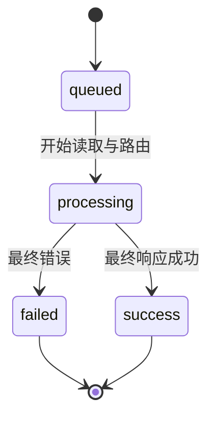
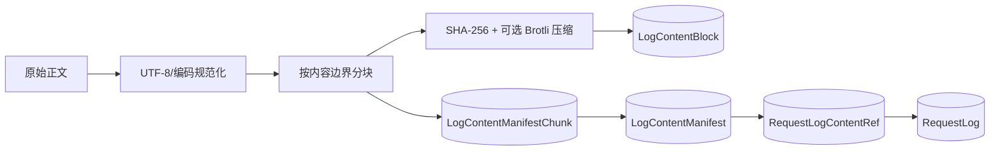

# 11. 可观测性与计费

> 需求前缀：`REQ-OBS`  
> 代码基线：`main@3827590`  
> 目标：让每次代理请求可被定位、解释、统计和估算成本，同时控制正文存储与敏感信息暴露

## 1. 观测目标

OpenCodex 的观测能力不是单纯的应用日志，而是围绕一次客户端请求建立可查询的业务链路：

```text
客户端主请求
  ├─ 渠道 attempt 1
  ├─ 渠道 attempt 2
  ├─ OCR 子请求（可选）
  ├─ Web Search 轮次（可选，记录在详情）
  └─ 最终客户端响应
```

观测系统必须回答：

- 请求是谁发起的、使用哪个访问 Key；
- 请求模型和上游模型分别是什么；
- 选择过哪些渠道，为什么跳过或失败；
- 是否流式、TTFT 和总耗时是多少；
- 输入、缓存、输出 Token 和成本是多少；
- 请求是否经过协议转换、工具、Web Search、图片或 OCR；
- 客户端看到的响应与上游响应有什么差异；
- 普通用户只能看自己的数据，超级管理员能看全局数据。

## 2. 观测对象和生命周期

### 2.1 主请求

主请求由客户端一次 HTTP 调用产生，`request_type=main`。它拥有：

- 请求 ID；
- 用户和访问 Key；
- 入口路径和协议；
- 请求/上游模型；
- 最终渠道和状态；
- 主体 Usage、成本和时序；
- 与 attempt、OCR 子请求的父子关系。

### 2.2 渠道尝试

每次向候选渠道发起的调用生成 `request_type=attempt` 日志：

- 记录渠道 ID、类型、上游模型；
- 记录尝试开始/结束、状态码、错误、是否流式；
- 记录是否在首字节前失败；
- 可用于解释重试和故障转移；
- 不应被误计为额外的客户端业务请求。

### 2.3 OCR 子请求

图片降级触发的视觉识别请求生成 `request_type=ocr`：

- 关联主请求；
- 记录输入图片来源类别、命中/未命中缓存、识别文本和描述；
- 记录上游视觉模型、耗时和错误；
- 成本是否并入主请求由计费策略定义；
- 详情权限与主请求一致。

### 2.4 生命周期状态



`LifecycleStatus` 是业务状态，不能只根据 HTTP 状态码推断；例如某次 attempt 可能失败，但主请求经过故障转移后成功。

当前状态常量只有 `queued`、`processing`、`success`、`failed`。客户端取消没有单独的 `cancelled` 状态；流式取消会记录错误文本并按现有完成判定落为 `failed`。

## 3. 日志字段产品定义

### 3.1 基本字段

| 字段 | 展示/查询用途 | 脱敏或权限 |
|---|---|---|
| request_id | 全链路定位 | 可复制，非秘密 |
| created_at | 时间筛选和排序 | 按用户时区展示 |
| method/path | 入口定位 | 路径可筛选 |
| client_ip | 网络排障 | 超级管理员/受控权限；`TBD` 是否默认展示 |
| model/upstream_model | 模型映射排障 | 用户范围隔离 |
| channel | 渠道排障 | 用户只能看自己的 |
| owner_username | 全局运营筛选 | 仅超级管理员 |
| api_key | Key 名称/掩码 | 不展示完整秘密 |
| request_type | main/attempt/ocr | 用于链路树 |
| parent_request_log_id | 父子导航 | 按权限校验 |
| lifecycle_status | 成功/失败/处理中 | 与 HTTP 状态并列 |
| status_code | HTTP 结果 | 整数筛选 |
| error | 错误摘要 | 必须脱敏 |

### 3.2 时序和性能字段

| 字段 | 定义 |
|---|---|
| `ProcessingStartedAt` | 进入核心处理时间 |
| `CompletedAt` | 请求完成或失败时间 |
| `DurationMs` | 完成减创建/开始的产品定义耗时 |
| `TtftMs` | 首个有效文本、Reasoning、工具或协议内容写出时间 |
| `IsStream` | 是否请求/响应流式 |
| `StreamTimings` | 流式事件、写出和终止摘要 |

TTFT 不等同第一条空 SSE 行或连接建立时间。不同协议必须使用统一的有效内容定义，否则统计不可比较。

### 3.3 Usage 和成本字段

| 字段 | 含义 |
|---|---|
| InputTokens | 输入 Token |
| CachedTokens | 兼容汇总缓存 Token |
| CacheWriteTokens | 缓存写 Token |
| CacheReadTokens | 缓存读 Token |
| OutputTokens | 输出 Token |
| Cost | 按定价快照计算的金额 |
| CostCurrency | 币种，当前常见 USD |
| PricingModelInfoId | 使用的模型信息 |
| PricingPlanId | 使用的价格计划 |
| PricingSnapshotJson | 完成时价格规则快照 |

`REQ-OBS-001`（MUST）：当上游提供可解析 Usage 时，系统必须在主请求日志中保存统一字段；无法解析时必须标明缺失原因，不得用 0 冒充真实零用量。

当前差距：`ProxyLogService` 在 `usage` 缺失、字段不可解析或未知协议时直接写入 0，`RequestLog` 没有 Usage 完整性/缺失原因字段，因此当前不能区分“真实为 0”和“未取得 Usage”。

`REQ-OBS-002`（MUST）：成本计算必须基于请求完成时的定价快照，且能追溯到计费项、模式、单位价格和输入用量。

## 4. 内容寻址日志存储

### 4.1 保存槽位

当前枚举严格包含以下 8 个槽位：

| 槽位 | 当前写入内容 |
|---|---|
| `RequestHeaders` | 客户端请求头 |
| `RequestBody` | 原始正文，无法取得时为入口载荷序列化 |
| `UpstreamRequestBody` | 转换后请求 |
| `UpstreamResponseBody` | 上游响应 |
| `ResponseBody` | 客户端响应或错误响应 |
| `WebSearchJson` | Web Search 模拟详情 |
| `OcrJson` | OCR 元数据 |
| `StreamLinesJson` | 按 sequence/source/raw_line 保存的流式原始行 |

当前没有按日志级别关闭正文槽位的实现：创建、处理中和完成阶段会写入所有可取得的槽位，`null` 槽位不建立引用。产品若需要“元数据-only”或分级日志，必须新增明确配置和验收。

### 4.2 编码和去重

当前实现采用内容寻址结构：



当前实现线索：

- 最小块约 2 KiB；
- 平均目标约 8 KiB；
- 最大块约 32 KiB；
- 压缩后更小时保存压缩数据；
- Block 和 Manifest 以 SHA-256 唯一化；
- 引用替换后清理孤立内容。

正式产品要求：

1. 哈希校验失败必须让详情读取显式失败；
2. 内容寻址用于完整性和去重，不等于加密；
3. 删除请求日志时只删除无其他引用的共享内容；
4. 内容存储失败对主请求的影响必须定义（阻断、降级或异步补写）；
5. 必须有存储容量、孤立对象和损坏对象监控。

当前敏感信息差距：`ProxyRequestMetadataFactory` 会复制全部客户端请求头，`ProxyLogService` 随后把它们原样写入 `RequestHeaders`；当前路径没有先移除 `Authorization`、Cookie 或自定义敏感 Header。因此内容寻址、压缩和去重不等于脱敏，数据库读取者可接触到明文凭证。

`REQ-OBS-003`（MUST）：详细正文的保存、读取、删除和重组必须保持引用完整性，任何损坏不得静默返回错误正文。

## 5. 日志查询和详情

### 5.1 列表查询

管理台支持：

- 时间范围和自定义时间；
- 请求 ID、会话键、Turn ID、窗口 ID、上一响应 ID；
- 模型、上游模型、渠道、路径、状态码；
- 请求类型、流式标记、生命周期状态；
- 超级管理员按用户筛选；
- API Key 名称筛选；
- 分页、排序、列显示设置；
- 自动刷新 5/10/30/60 秒。

查询规则：

- 普通用户的所有过滤条件仍受 Owner 约束；
- 文本联想至少 2 个字符并带防抖；
- 高级过滤修改后需显式应用；
- 请求失败时恢复上次有效过滤器和列表；
- 空结果要显示空态而不是错误；
- 大时间范围和高基数字段要防止无界查询。

当前列表 `page_size` 被服务端限制为 1–200，过滤候选最多返回 200 项；统计查询仍会把选定时间范围内的记录一次性加载到内存。

### 5.2 详情

详情至少展示：

- 请求状态、类型、父日志和关联子日志；
- 请求、上游模型和渠道；
- 状态码、耗时、TTFT、Token、成本；
- 创建、开始处理、完成时间；
- 错误摘要；
- 请求头；
- 原始请求、上游请求、上游响应、客户端响应；
- OCR、Web Search 和流式内容（若存在）；
- SSE 原始行/合并事件视图；
- 复制和关联日志跳转。

`REQ-OBS-004`（MUST）：读取日志详情必须在服务端验证日志 Owner 或超级管理员权限，不能只凭前端传入日志 ID。

`REQ-OBS-005`（MUST）：主请求详情必须能导航到所有关联 attempt 和 OCR 子日志，子日志也能返回主请求。

### 5.3 清空日志

当前只有超级管理员可清空全部日志，操作需要二次确认，且会影响：

- 日志元数据；
- 内容引用；
- SSE 流行/事件正文；
- 统计历史；
- 成本历史。

正式产品需要确认是否提供：

- 按时间清理；
- 按用户清理；
- 只清正文、保留元数据；
- 清理前导出；
- 审计记录和不可抵赖确认。

## 6. 仪表盘统计

### 6.1 摘要指标

- 总请求数；
- 成功请求数；
- 最近一小时请求数；
- 输入、缓存、输出和总 Token；
- 总成本和最近一小时成本；
- CNY/USD 双币展示；
- RPM、TPM。

### 6.2 图表

- 请求模型分布；
- 错误状态码和渠道分布；
- 成本趋势；
- Token 趋势；
- TTFT 趋势；
- 缓存命中率；
- RPM 趋势。

图表必须明确：

- 时间桶宽度；
- 是否包含 attempt/OCR；
- 成本币种转换来源；
- 缺失 Usage 的处理；
- 无数据和查询失败状态；
- 时区和夏令时规则。

当前统计口径：没有显式 `request_type` 过滤时排除 `attempt`，但会包含 `main`、`ocr` 和旧数据中的空类型；显式选择 `attempt` 时可以把尝试纳入统计。最近错误流同样排除 attempt、保留 OCR。因而“请求数”和“总成本”当前并不天然等同于纯客户端主请求。

当前 `CachedTokens` 是输入 Token 的缓存子集/兼容汇总值，但摘要的 `total_tokens`、最近总 Token 和 TPM 使用 `InputTokens + CachedTokens + OutputTokens`，缓存部分会被重复相加；缓存命中率也使用 `CachedTokens / (InputTokens + CachedTokens)`。这些是当前展示口径，不应被描述为去重后的实际 Token 总量。

### 6.3 实时队列和错误流

当前管理台使用两个实时 SSE：

| 流 | 更新用途 | 当前间隔线索 |
|---|---|---:|
| 活跃渠道 | 渠道、处理中数量、请求/上游模型 | 约 2 秒 |
| 最近错误 | 最近错误请求摘要 | 约 5 秒 |

前端状态：连接中、实时更新中、未连接、空态。实时流断开不能阻断普通日志查询和统计查询。

`REQ-OBS-006`（MUST）：实时 SSE 断开时管理台必须显示未连接状态，并允许通过自动重连或刷新恢复；不得将旧数据伪装为实时数据。

## 7. 计费模型

### 7.1 价格继承

当前有效价格解析只有两层：

1. 若 `channel_id + upstream_model` 精确命中启用的 `ChannelModelInfo`，使用该渠道模型自己的启用计划；
2. 没有渠道模型覆盖时，按 `exact → prefix → suffix → contains` 及模式长度/供应商排序匹配启用的全局 `ModelInfo`，使用其启用计划。

当前没有独立的“渠道级价格计划”回退，也不读取 `ChannelModelMapping.PricingMode/PricingPlanId`。内置和旧版价格需要先播种/迁移为全局模型计划才会参与该解析。若命中渠道模型但该覆盖没有有效计划，系统不会继续回退全局，而是生成原因相应的零成本快照。

### 7.2 计费项和模式

| 计费项 | 适用用量 |
|---|---|
| Input | 输入 Token 或按次 |
| Output | 输出 Token 或按次 |
| Cache write | 缓存写 Token |
| Cache read | 缓存读 Token |

| 模式 | 公式概念 |
|---|---|
| `per_request` | 每次完成请求固定价格 |
| `per_million_tokens` | `tokens / 1,000,000 × unit_price` |
| `tiered_tokens` | 按命中的阶梯分段计算 |

### 7.3 成本边界

- 每条 main、attempt、OCR 日志都会独立尝试解析 Usage 和计算成本；默认统计排除 attempt，因此 attempt 成本通常不进入仪表盘，但显式筛选 attempt 时会计入；
- OCR 子请求会写自己的 Usage、价格快照和成本，且默认统计包含 OCR；该成本不会合并进主请求的 `Cost` 字段；
- Web Search Tavily 成本是否计入模型成本：当前不等同模型价格，需单独定义；
- 价格或模型未匹配、计划无规则时，当前仍保存 `Cost=0`、`CostCurrency=USD` 和带 `resolution` 的零成本 `PricingSnapshotJson`；顶层没有“未知成本”布尔状态；
- 多币种汇率来源和更新时间为 `TBD`；
- 历史日志必须保留计算依据。

`REQ-OBS-007`（MUST）：成本展示必须同时展示币种和“已计算/未知/部分 Usage”等状态，不能把缺少价格或 Usage 的金额显示成确定账单。

## 8. 脱敏和访问控制

### 8.1 默认脱敏

必须脱敏：

- Authorization；
- API Key、apikey、x-api-key；
- Cookie；
- 密码；
- Data Protection 相关秘密；
- 上游自定义敏感 Header；
- 导入/导出文件中的不必要凭证。

以上是产品化要求，不是当前已实现事实。当前请求头正文会原样持久化，至少 `Authorization`、Cookie 和自定义敏感 Header 尚无统一日志脱敏层。

日志等级可以决定是否保存更多结构，但不得降低访问权限或绕过秘密脱敏。

### 8.2 角色范围

| 操作 | 普通用户 | 超级管理员 |
|---|---:|---:|
| 查看自己的日志 | 是 | 是 |
| 查看其他用户日志 | 否 | 是 |
| 查看日志详情 | 仅自己的 | 全部 |
| 查看全局统计 | 否 | 是 |
| 查看实时全局队列 | 仅自己的范围 | 全部 |
| 清空日志 | 否 | 是 |
| 导出含正文日志 | 按权限/策略 | 按策略 |

## 9. 性能、容量和保留

当前实现有部分保护：

- `StreamResponseCapture` 对同协议流重建的逻辑响应默认限制约 1 MiB、集合 256 项、单个待解析 SSE 数据约 256 KiB；
- 但 `ProxyStreamService.CaptureStreamLines` 会把每一条 upstream/downstream 原始行追加到 `StreamLinesJson`，当前没有字节数或条数上限；上述 1 MiB/256 项限制不保护原始流日志槽位；
- 上游连接池每主机约 100；
- Tavily 连接池约 50。

正式产品必须确认：

- 单请求正文最大保存量；
- 单个日志总内容上限；
- 单实例日志量和查询响应时间；
- 保留期、归档和自动删除；
- 存储容量告警阈值；
- 大查询是否异步导出；
- SSE 长连接最大时长。

`REQ-OBS-008`（MUST）：日志和统计查询必须有分页、时间范围或容量边界，不能因用户传入极大范围导致无界内存加载。

`REQ-OBS-009`（SHOULD）：系统应提供日志存储使用量、正文块去重率、孤立块数量和最近清理时间等运维指标。

## 10. 可观测性需求与验收

| 编号 | 级别 | 需求 | 验收 |
|---|---|---|---|
| `REQ-OBS-010` | MUST | 主请求、attempt、OCR 形成可导航链路 | 构造重试+图片请求并检查父子关系 |
| `REQ-OBS-011` | MUST | 流式请求记录 TTFT、结束状态和关键时序 | 三协议流式测试 |
| `REQ-OBS-012` | MUST | 原始、上游、客户端正文槽位按权限读取 | 普通/超级管理员越权测试 |
| `REQ-OBS-013` | MUST | 内容寻址正文可重组并校验 SHA-256 | Block/Manifest 单元测试 |
| `REQ-OBS-014` | MUST | 统计不重复计算 attempt 为客户端请求 | 主请求+多尝试统计测试 |
| `REQ-OBS-015` | MUST | 成本保留价格快照 | 修改价格后历史日志不变 |
| `REQ-OBS-016` | MUST | 实时 SSE 断开显示未连接 | 断开/重连 E2E |
| `REQ-OBS-017` | MUST | 日志过滤始终受 Owner 约束 | 构造跨用户 ID 查询 |
| `REQ-OBS-018` | MUST | 清空日志有权限和二次确认 | 普通用户拒绝，超级管理员确认 |
| `REQ-OBS-019` | SHOULD | 支持结构化导出和受控正文导出 | 权限、脱敏和大数据量测试 |
| `REQ-OBS-020` | SHOULD | readiness 与观测指标可区分 | 数据库/Redis 故障测试 |

## 11. 源码追溯

| 区域 | 位置 |
|---|---|
| 日志控制器 | `opencodex_proxy/src/Presentation/OpenCodex.Api/Controllers/ObservabilityController.cs` |
| 日志写入 | `OpenCodex.Core/Services/Proxy/ProxyLogService.cs` |
| 内容编码 | `OpenCodex.Core/Services/Proxy/LogContentCodec.cs` |
| 内容存储 | `OpenCodex.Core/Services/Proxy/LogContentStore.cs` |
| 统计服务 | `OpenCodex.Core/Services/ObservabilityService.cs` |
| 请求实体 | `OpenCodex.Domain/Domain/RequestLog.cs` |
| 内容实体 | `OpenCodex.Domain/Domain/LogContent.cs` |
| 仪表盘 | `frontend/src/Dashboard.vue` |
| 日志页面 | `frontend/src/Logs.vue` |
| 定价与成本解析 | `OpenCodex.Core/Services/ModelCatalogService.cs`；旧版扁平价格管理为 `OpenCodex.Core/Services/ModelPricingService.cs` |
| 价格页面 | `frontend/src/Pricing.vue`、`frontend/src/Channels.vue` |
| 测试 | `ObservabilityServiceTests.cs`、`ObservabilityControllerTests.cs`、`LogContentCodecTests.cs`、`LogContentStoreTests.cs`、`ProxyLogServiceTests.cs` |
